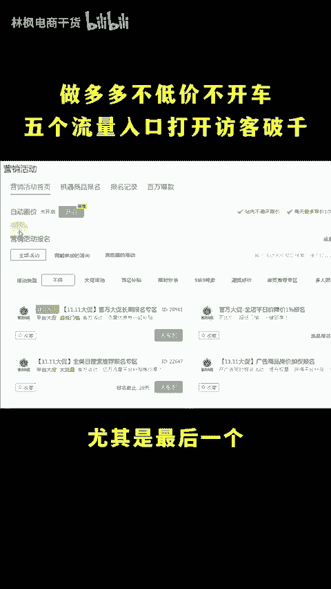
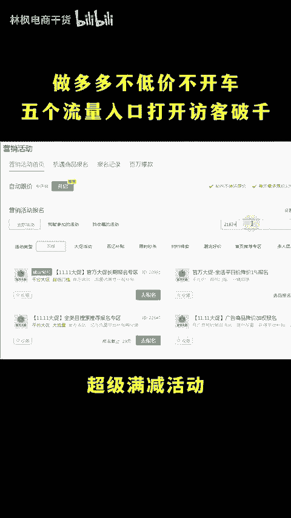
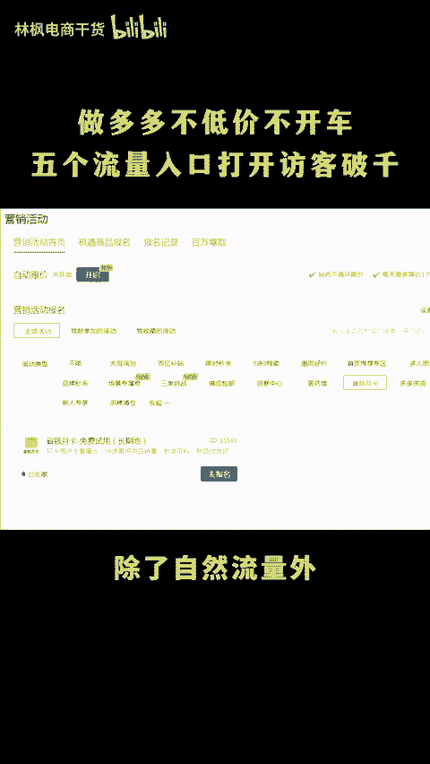
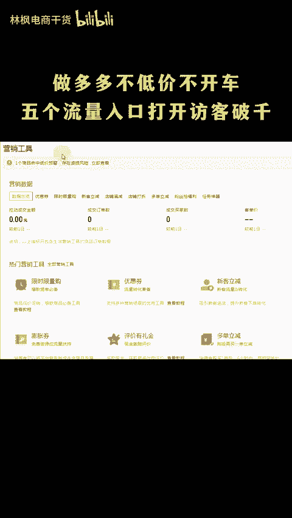
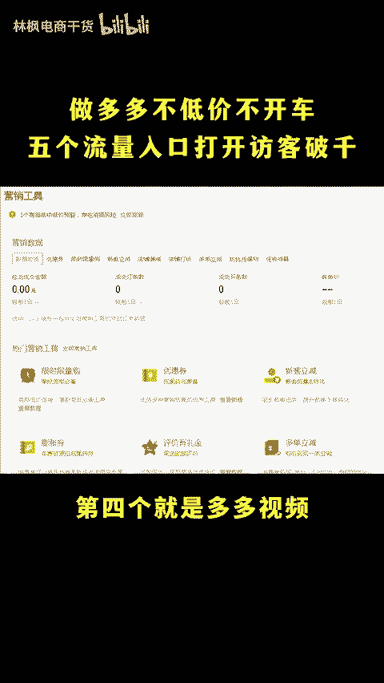
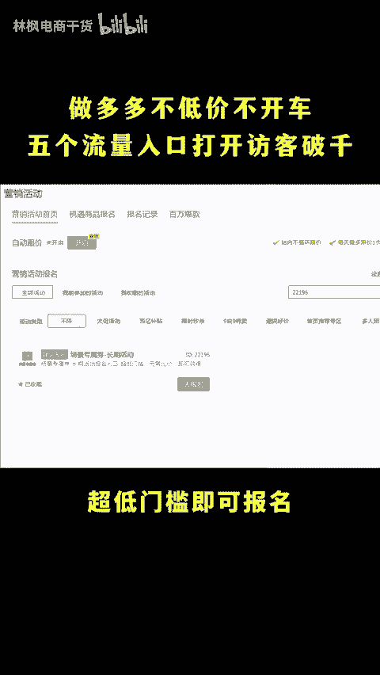

# 拼多多店铺该做的都做了访客一天只有十几个怎么回事儿啊？ - P1 - 林枫电商干货 - BV11CmKY9EBs

该做的都做了，为什么每天访客就十几个呀？那肯定是你还没有做到位啊，价格有没有做到最低，直通车账户有没有充足？😡，omy god，都不开车，访客就提升不上去吗？啊，不是我刚开5天的店，没有开车。

都有300的访客，你肯定是忘了打开这5个流量入口了，点个关注，点个赞，实操教学。😡，这5个啊是很多人忽略掉的流量渠道，尤其是最后一个上了就有千万曝关。首先我们先到一次活动界面啊。

搜索21824这个超级满减活动，双十一活动期间流量超高。第二个就是省钱月卡，除了自爱流量外，第一个大想要快速拉升销量，上评价非常好用。黑5也能用。第三个就是营销工具的新颗粒减券。

这个是最常用控制价格还能够拉流量的工具。第四个就是多多视频，流量超大，但是呢建议在买家都发布，不会的可以扣6，找我要实操流程了。最后一个活动呢就是22196。这个活动超低门槛即可报名，无需全网比价。

报名成功后，在活动期间获得超强闪电券的样式。三峡还留倒计时的氛围加持，提升曝关及点击率。

