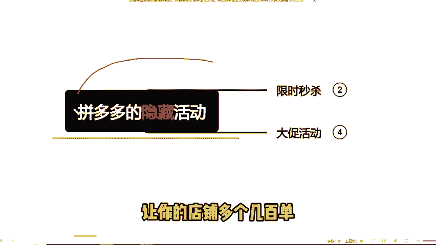
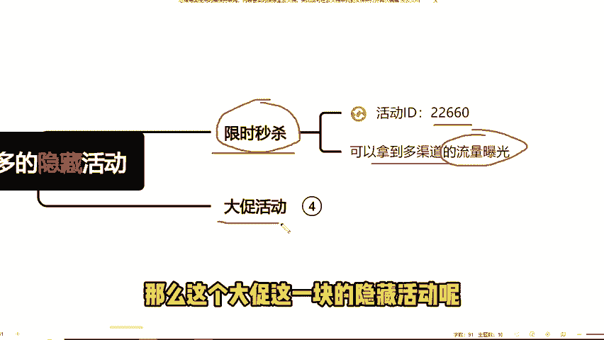
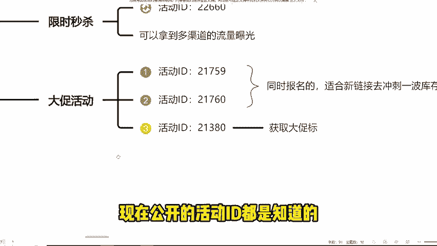
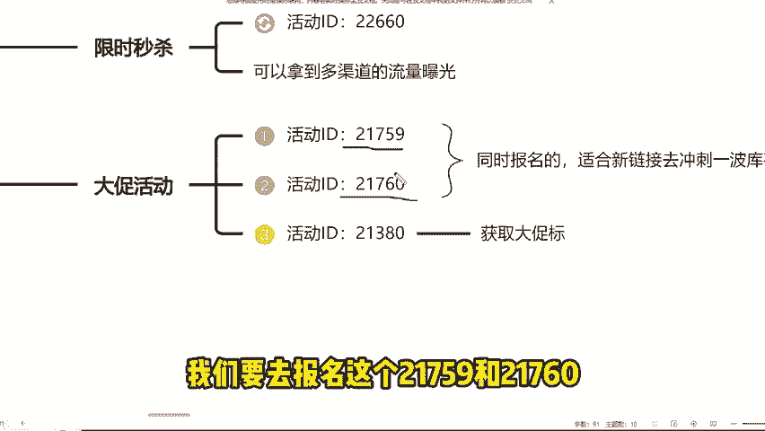
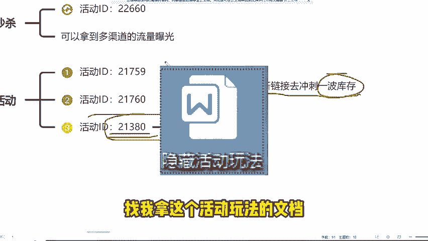

# 拼多多开店如何报名隐藏活动？获取流量的同时不被比价和有大促标。拼多多运营基础教学， - P1 - 老头电商-干货分享 - BV1bo1oYcEfg

拼多多居然还有隐藏的活动，当然是有的。如果说你的链接没有流量，还不想开车的话，在活动中被比价了，或者说上了大促也没有大促标的，那么就一定要记住下面这几个隐藏的活动。让你的店铺多个几百单是没有任何问题的。

首先第一个链接没有什么流量的，首先可以去报名一个限时秒杀的活动，可以拿到多渠道的流量曝光，适合大部分类目。那么这个隐藏活动怎么去报名呢。只要我们先打开我们以前的活动报名记录，点击详情，那注意啊。

是电脑网页打开，然后在网页上输入活动的ID敲一下回车就弹出来我们的隐藏活动了，直接报名就可以了。那么这个大促这一块的隐藏活动呢。那我们要知道现在公开的活动ID都是知道的，那肯定报名的同行也会多。

那么现在我们看到的不计价100件的活动是很容易被比价的。我们要去报名这个21759。

和21760这两个隐藏大促活动，他们两个是可以同时报名的，适合我们的新链接去充刺一波库存。前期的话会比我们的开车要好很多。试一下，你们肯定会有惊喜的。最后就是一个我们报名，还没有大出标的。

可以试一下21380这个长期大促的活动，这个是很容易出标的。当然根据这些隐藏的活动也是有一定的玩法的视频还在制作中急的同学呢，你可以关注我，找我拿这个活动玩法的文档。好了，学会了隐藏活动的。

赶紧去操作吧。

