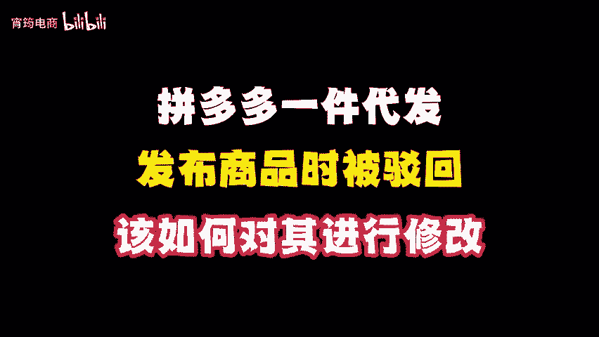
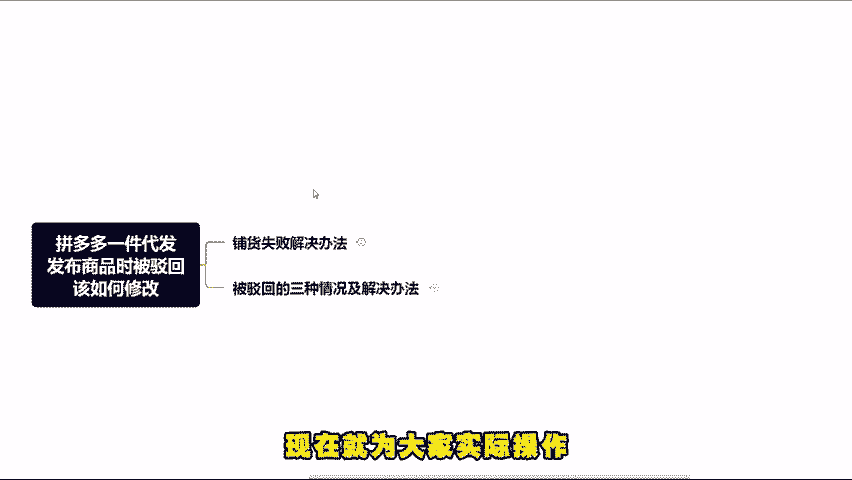
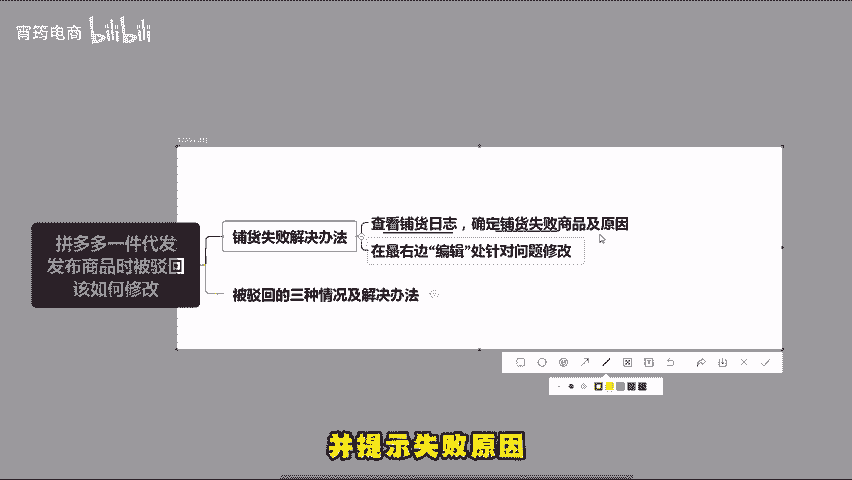
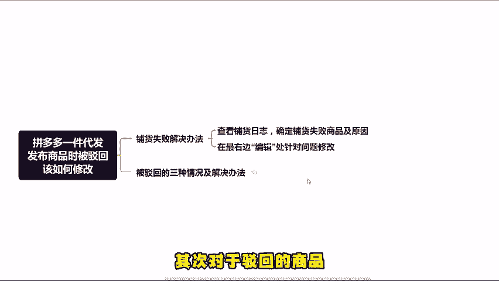
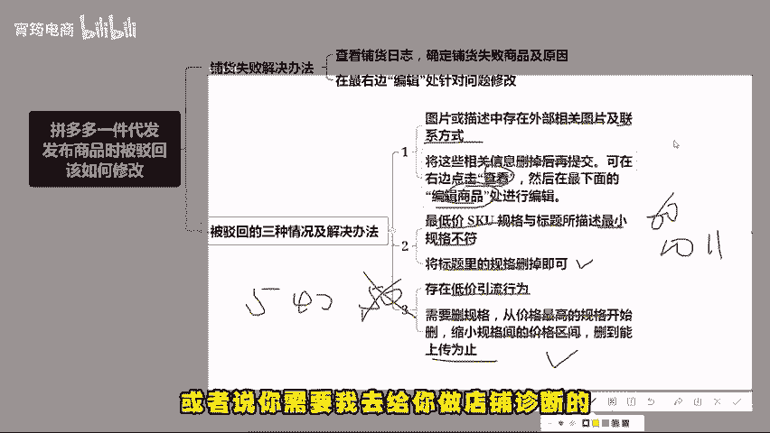

# 拼多多开店必学！！！发布商品被驳回改怎么解决（拼多多开店 ｜ 拼多多运营 ｜拼多多实操 ｜ 拼多多新手） - P1 - 宵筠电商 - BV1G8mKYeEWV

最近，不少商家朋友反映，在上传产品时碰到诸多问题，如有铺货失败的，也有后台被驳回的，也不知如何修改。现在就为大家实际操作讲解一下，解决这些问题的方法。首先，对于铺货失败的情况。

可在铺货日志中查看铺货失败的商品会在下方空白处显示，并提示失败原因，在最右边的编辑处可进行操作，针对失败问题进行修改就可以了。比如商品存在违规词，只需要将违规词删掉，然后重新铺货即可。其次。

对于驳回的商品举三个例子。其一，若图片或描述中存在外部相关图片及联系方式等。将这些相关信息删除掉后再提交，可在右边点击查看，然后在最下面的编辑商品中进行编辑。其二。

若最低价的SQU规格与标题所描述的最小规格不符。比如标题中有60包，但实际规格有10111包等情况。此时只需将标题里的规格删掉即可。其三，若存在低价引流行为，就需要删除。

规格从价格最高的规格开始删缩小规格键的价格区间，比如有卖5块、40块、50块的，先删50块的，若人被驳回，说低价引流，再删40块的，删掉能上床为止。好了，今天就分享到这。如果看完视频还是不太懂的话。

可以找我领取实操文档，也可以提问，或者说你需要我去给你做店铺诊断的，也可以来找我。最后祝各位早日报单。

