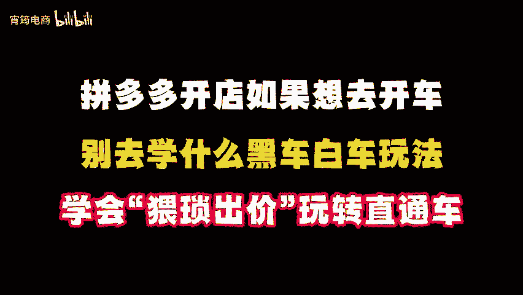
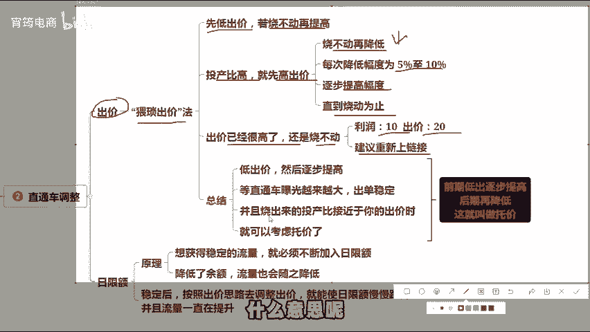
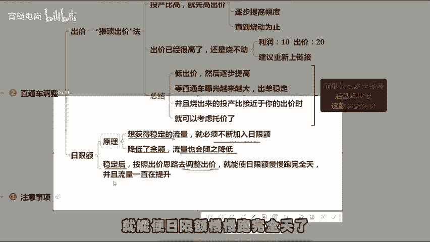
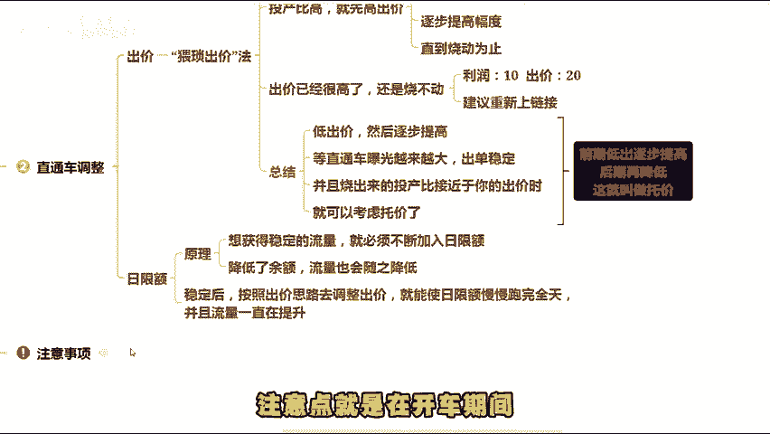
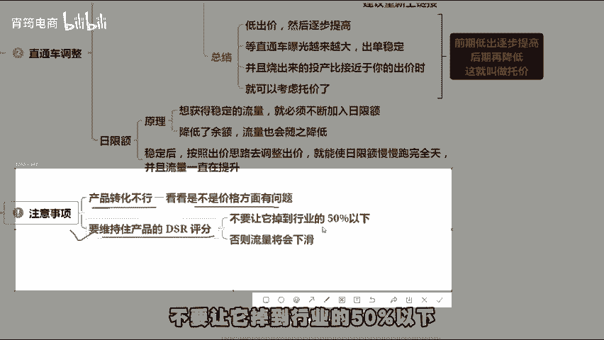
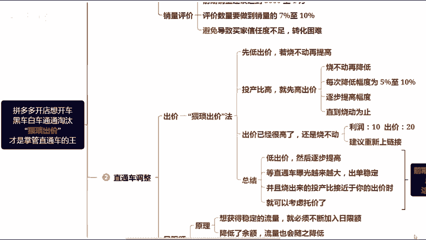

# 拼多多开店必看！拼多多“猥琐出价”玩转直通车（拼多多开店 ｜ 拼多多运营 ｜ 拼多多实操 ｜ 拼多多新手 ｜ 拼多多教程） - P1 - 宵筠电商 - BV1DKyNYJEEy

很多做拼多多的商家朋友，常常把大量时间花在研究直通车上面。实际上直通车是最没有技术含量的。看完我这个视频，你无需再去钻研其他直通车推广玩法。我会从前期准备到如何实现托价盈利以及注意事项，一步步教会大家。

如果看我的视频还有不太懂的。我要准备的运营文档，可以评论区自取。首先，开车前要做好技术准备。其一，主图开车前一定要重视主图的点击率，在拼多多上点击率通常由主图上的营销词决定。

所以我们可以借鉴同行的优质主图来进行制作，但切不可直接搬运，做好主图后呢，可以先开启一个简易的计划，查看主图的点击情况。若能达到行业平均水平，那就可以正式开启推广了。其二，价格价格要为推广留出利润空间。

第一步，将预期售卖价提高10%左右。第二步，通过优惠券或者是限时限量购，把价格降下来。这样我们就可以通过调整优惠力度，为直通车留下运营空间。其三，销量评价。前期销量建议达到50。至1万也不会改的。

可以找我领取文档，评价数量要做到销量的7%到10%左右。因为后续如果开车，有人点击直通车进入你的产品页面，而你的产品销量和评价都很少。就会导致买家信任度不够，转化困难，花了推广资金却没有效果。

直通车现在可以调整的只有出价和日限额，像急速起量和全局优先起量，都是让你提高出价，如果你玩不好，可以直接不开。专注研究出价和日线额就可以了。那出价该怎么出呢？其实很简单，我建议大家采用猥琐出价法。

什么是猥琐出价呢，就是先低出价，若烧不动再提高。如果投产比高，就先高出价，若烧不动再降低，每次降低幅度为5%到10%逐步提高。直到烧动为止。如果你的出价已经很高了，还是烧不动。比如你的利润只有10块。

却已经出到20块还烧不动。那我建议你重新上链接。如果20块才能烧动，而你的利润只有10块，后期再降低，这就叫托价，日限额只能逐步增加，不能降低。什么意思。

就是想要获得稳定的流量，就得源源不断的给拼多多增加余额。如果降低了余额，流量也会随之降低。原则上日限额只增不减，或者到后期可以让它稳定下来，稳定后，按照出价思路去调整出价，就能使日线额慢慢跑完全天了。

并且流量一直在提升。注意点就是在开车期间，如果发现产品转化不行，就要按照第一步去调整产品的售卖价。看看是不是价格方面有问题。同时要维持住产品的DSR评分，不要让它调到行业的50%以下，否则流量就会下滑。

最后，如果你看完有不懂的地方，可以随时找我，也可以向我提问。同时我也准备了拼多多各个类目的实操文档以及最新玩法的拆解步骤，可以找我领取。最后就助所有的商家朋友都能够早日爆单。

