# 拼多多开店运营-新手电商运营实战指南，B站最全拼多多零基础入门教程！拼多多运营秘籍，小白也能成电商大亨！轻松上手拼多多，拼多多新手开店赚钱攻略 - P13：013 拼多多爆款跟款选品 - 拼多多开店运营- - BV1xms8eSEVs

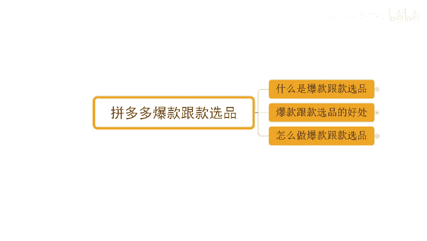

hello大家好，我是谢楼。那么今天给大家分享内容呢是我们拼多多店铺运营选品的试用策略中的爆款跟款选品的方法啊。在分享之前呢，还是老规矩先给来看一下近期跟市场小伙伴他们的店铺数据好吧？

可以看到像这个店铺呢原本是一个零访客的新店对吧？那么类似这种店铺呢，我首先呢也到市场进行分析，完成了我们的这个市场分析之后和我们的技争分析之后呢来确定好我们的爆款选品对吧？然后完成我们店铺的运营。

到后期的话可以看到整个店铺的访客也在不断增长到后面的话一天的访客呢做到了12001天啊，那么一天的订单呢是2700多单转化率的21。05啊，非常不错啊，包括还有这个店铺对吧？

原本呢也是一个零访客的新店从最早的临访客呢开始对吧？进行运营。那么我们也完成了产品的选品，包括后期的新品操作，以及我们后面呢可能还有更多的一些活动策划呀，包括我们的一些这个数据优化等等啊。

那么做到了一天访。

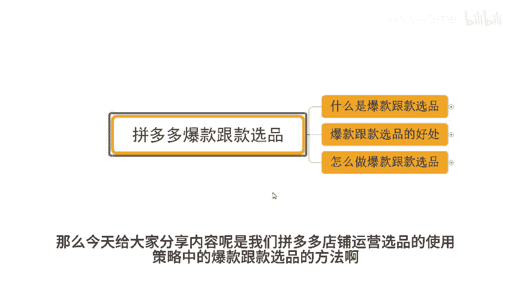

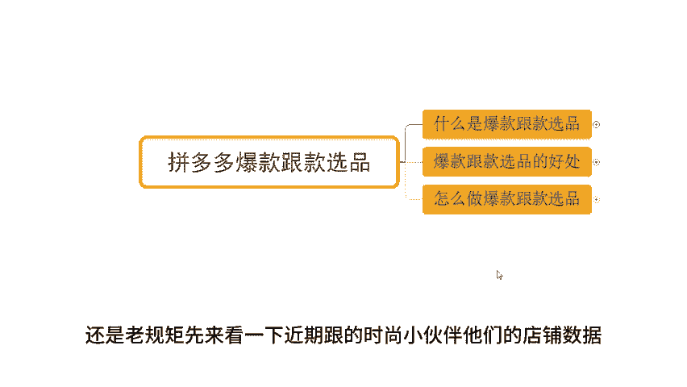

客呢是9000多对吧？一天订单是900多单，转化率呢做到了9。82%啊。当然呢除了这种零访客的新店之外呢，还会有的像这种啊原本呢是有定数据的店铺啊，像这个店铺呢原本的访客呢只有几百个？

那么针到店铺呢也也从我们这个产品的结构包括我们产品的布局价格引导这些东西完成优化访客也不增一天访客做到了1400一天订单00多单转化率呢11。77非常不错。那么这些店铺呢也都是通过战略的方式来操作的。

如果说你想知道怎么通过自店铺数据来让我们店铺得更优秀的话建仔细观看分享视频吧那么店铺运营呢对于我多新小伙伴会问题困难这很正常。如果说你有什么店铺操作面问题啊。

有需要资料的呀可以找我啊有时间的话我也可以带着你起去做小伙伴一起快提升运营能力让我们店铺达到高水平。

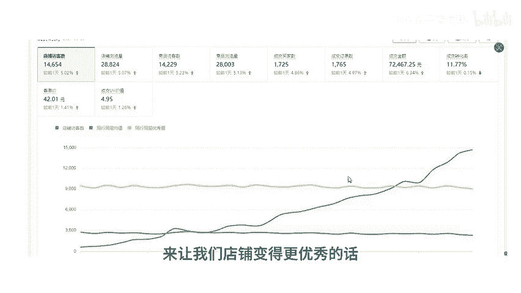

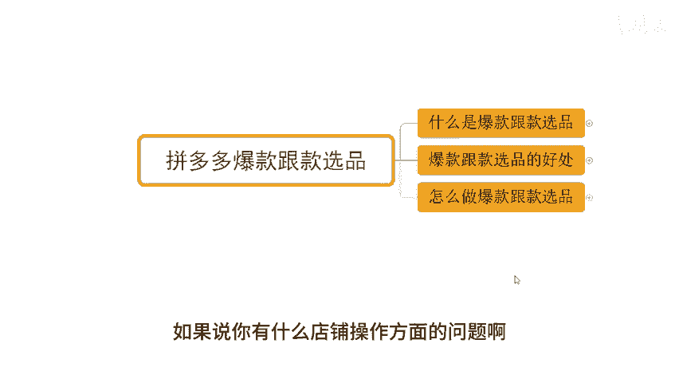

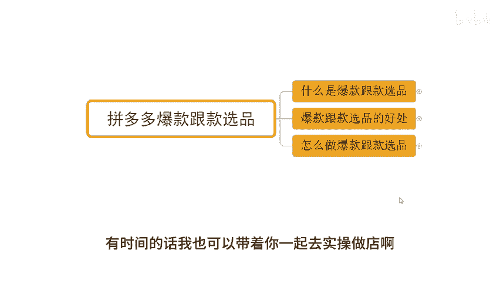

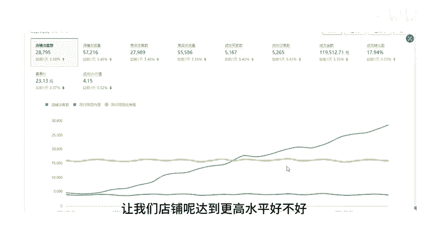

OK那么关于我们爆款更换选品呢，首先我们要搞清楚对吧到底什么是爆款更换选品对吧？这个搞清楚之后呢，我们才能进行下一步的操作，对不对？那么什么是爆款更换选品呢？其实爆款更款选品的话。

就是我们商家在多平台的一个销售商品的时候呢，根据我们市场趋势和买家的一个习惯，选择平台上呢具备高销量高人气商品啊，完成我们的产品后期的一个发布并且销售对吧？通过这样的方式呢来获得一个更好的市场表现啊。

以及更好的利润啊，就这么简单。那么这样去做呢？其实对于我们来讲的话，尤其对于我们新手商家来讲的话是一个非常非常方便的一个事情，而且呢它的好处很多。那么到底有哪些好处呢？一起来看一啊。

爆款跟款选品的好处来首先第一个呢它是已经进行了这个市场需求认证的对吧？为什么这样说呢？因为更款呢它本身就意味着我们所选择的商品呢？它是已经有了一个高销量并受欢迎的一个。😊。

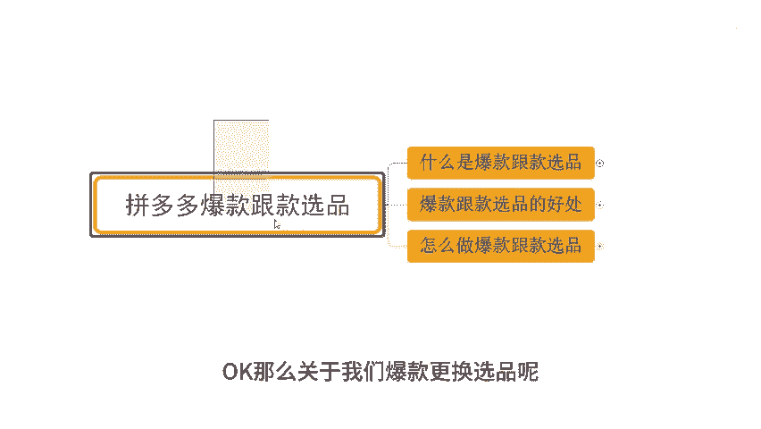

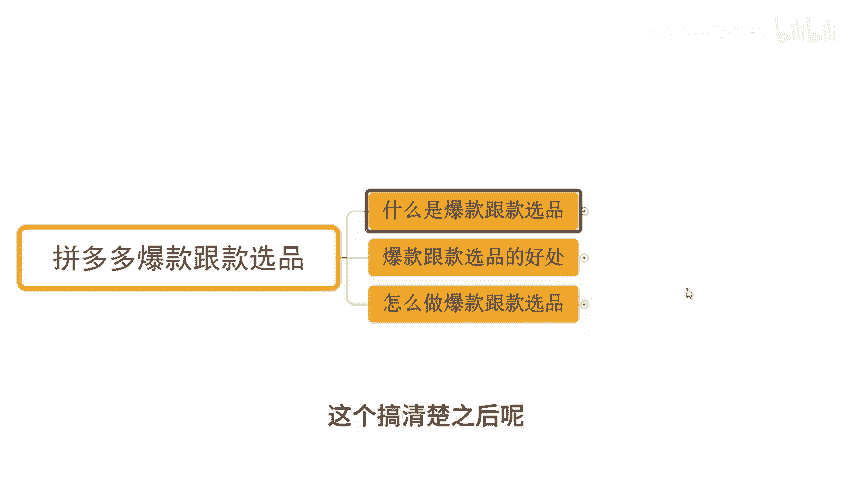

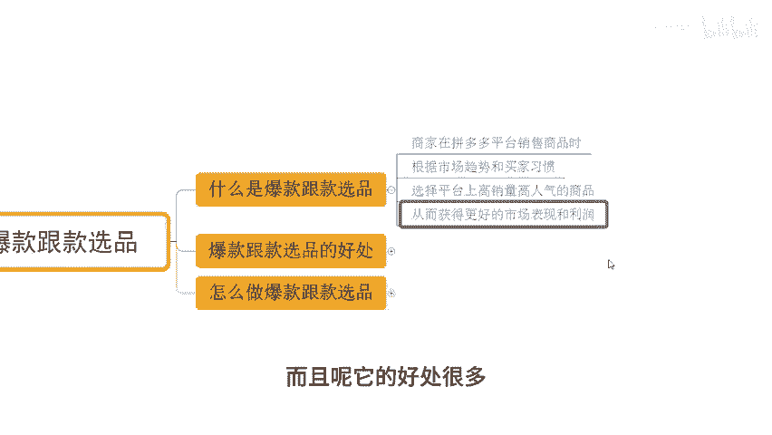

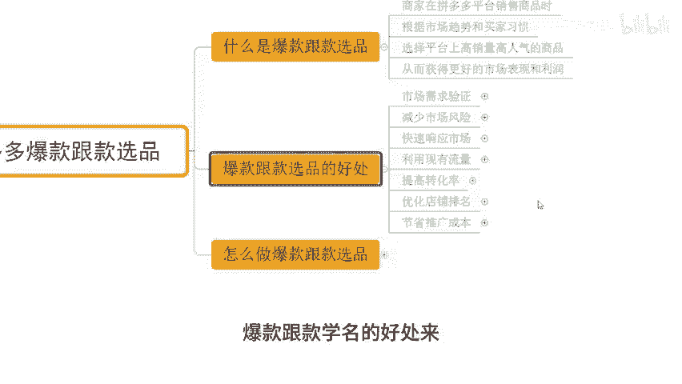

一个状态对吧？所以呢它本身就是得到了我们消费者的一个认可。而且这个消费者呢就是我们平台的消费者啊。换句话说呢，我们这个市场呢是已经被认证过的对吧？所以操作风险会比较低。

而且呢整个的一个市场体量也会比较大啊。那么再往下呢，我们可以看到啊，除了刚刚讲的这个市场验证之外呢，还会减少我们的一个市场风险啊。😊。

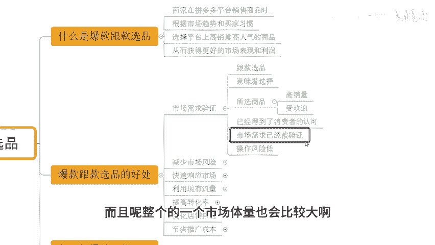

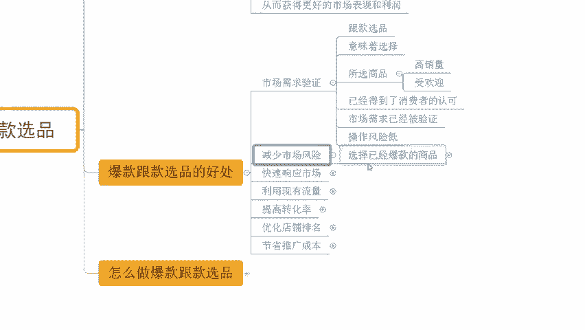

那么本身选择的产品呢已经是一个爆款，对不对？那么这个时候呢，我们在啊进行一个前期的市场测试的时候呢，我们的时间成本呢，我们的这个呃资金成本呢等等啊，都会大大降低，都会减少啊。

那么从而呢也可以降低我们新品在市场是欢迎程度不确定性的一个风险啊，如果说我们做一个纯新品，对吧？我也不确定这个市场上它的一个商品反馈到底怎么样。那么这个时呢我需要花费大量的时间跟精力去进行测试。

而测试的结果呢可能是好的，也可能是不好的。如果不好的话，那我整个测试的一个时间跟资金全部就浪费掉了，好不好？O同时呢还可以进行一个快速的市场响应啊。那么我们因为找的产品呢。

就是我们平台上所存在的一些爆款啊，那我们可以长期关注它能够去找到一些所谓的刚刚起爆的新品，对吧？同时呢这样呢可以快速的去抓住我们的销售机会，也可以保证我们店铺的一个销售增长啊。

所以这是对我们店铺来讲非常非常。😊。

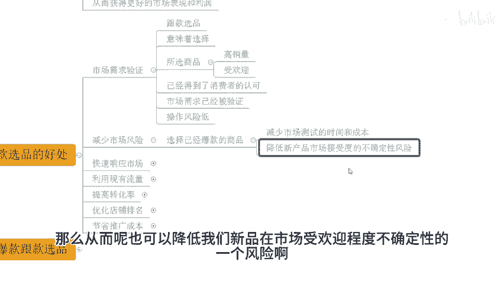

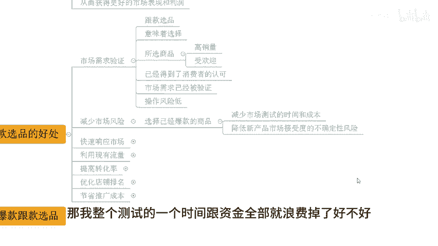

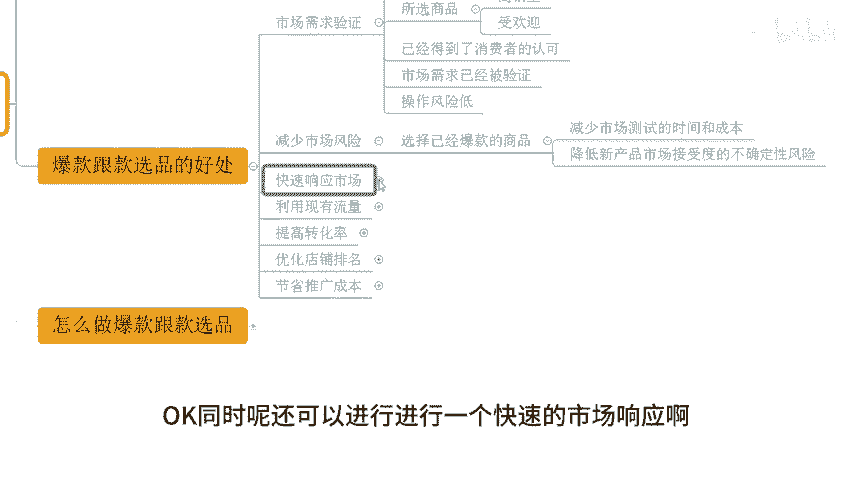

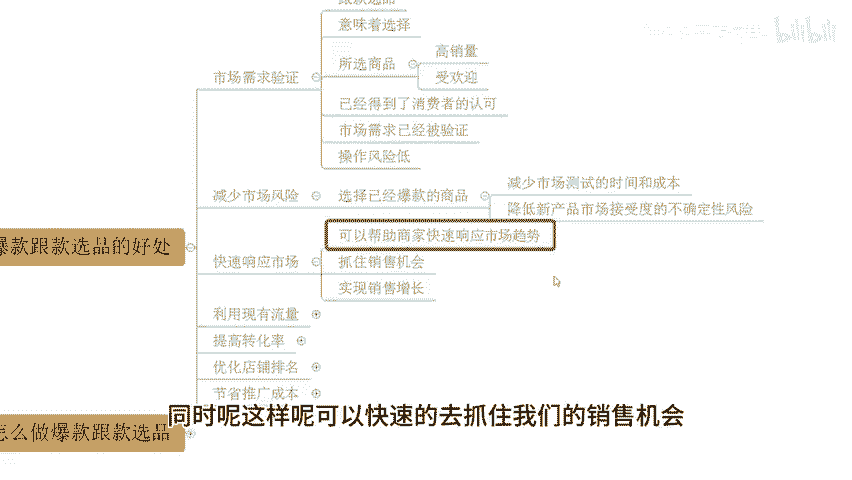

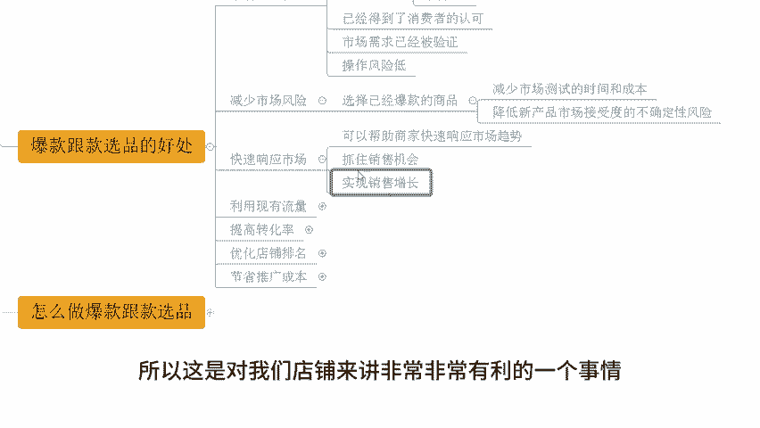

的一个事情。同时还可以什么呢？更好的去利用我们现有的一个流量啊。那爆款商品呢往往呢它都会获取到一定的市场的流量和关注度啊。所以跟款呢可以去利用这些现有的流量。

从而来提高我们产品的曝光率以及我们销售的潜力，能够去快速的讲战市场，对我们来讲的话，不光是有流量还会有转化，所以它的一个稳定性会更好啊，然后再一个就是提高我们转化率啊，其实这个呢跟我们上面讲的差不多。

对不对？爆款商品呢它本身是具备了很高的一个市场的认可度的啊，所以这点大家去这个不用去担心，所以说消费者对于这类产品呢，它会有到一个比较好的一个接受程度啊，同时呢那么对于转化板块来讲的话，也会比较高啊。

所以我们去做这种产品的话，不会担心说有没有流量的问题，也不会担心说会不会不好卖的问题啊。我们重点要担心的就是我们如何去把它给排名打出去啊，就这么简单啊。那么再一个点呢就是可以更好的优化我们店铺排名啊。

假如说现在啊我们有到很多的爆款商品。😊。

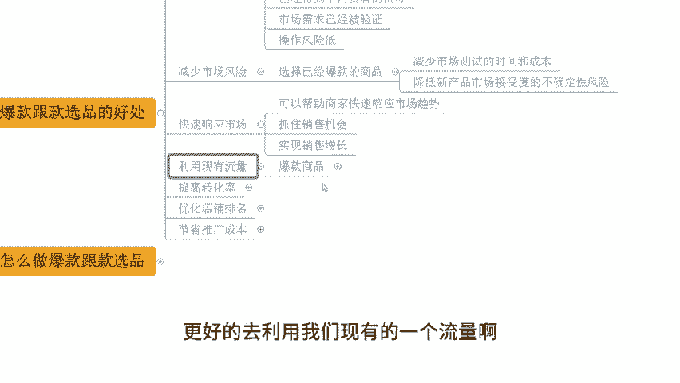

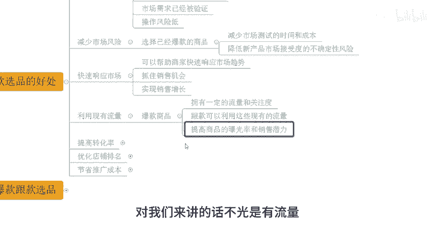

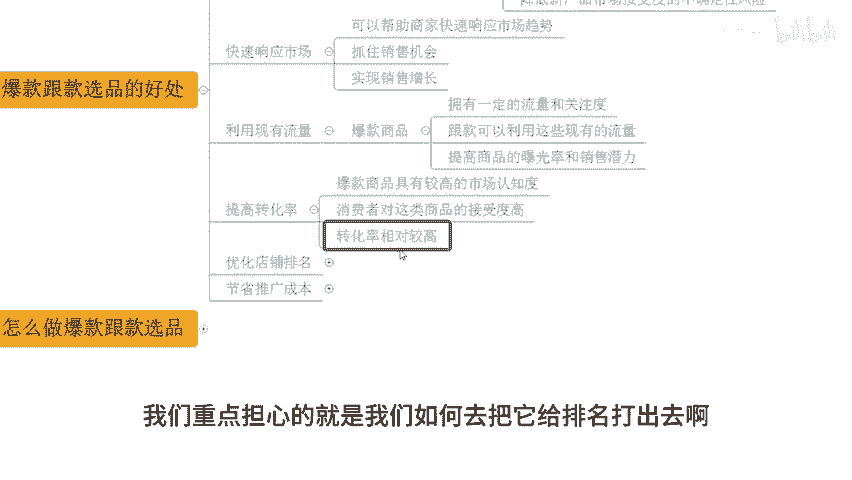

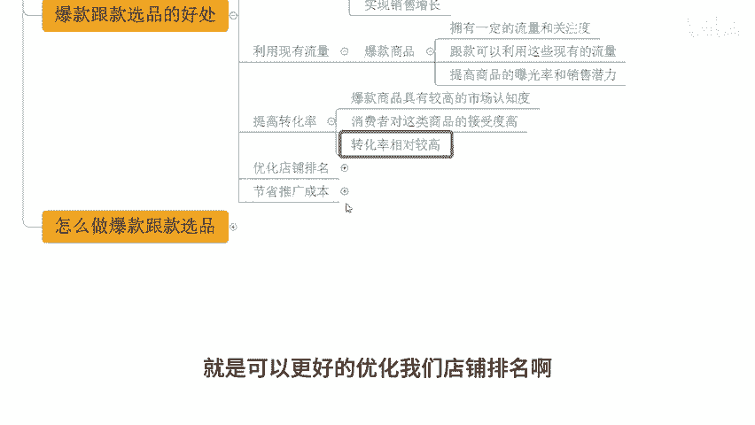

而爆款商品呢，它本身就具备了一个比较大的一个人群覆盖范围，而且呢会有到一个比较高的一个用户喜爱度。当我店铺里面的商品呢都是属于这种产品的时候呢，OK那我们能够去通过商品排名获取了一个比较好的推荐。

同时呢我们店铺呢也可以通过它来完成更好的一个流量获取，能够吸引到更多流量啊，所以它对我们店铺的排名优化也是有帮助的啊。然后再一个呢就是可以减少我们的一个推广成本啊，那么推广成本这个板块的话。

如果说我们去操作的话，本身我们做的是爆款对不对？所以这个时候呢就可以借助到商品本身的自然流跟这个这个市场的一个热度啊，这里打出字啊，市场热度。😊。

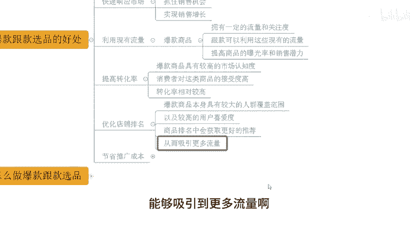

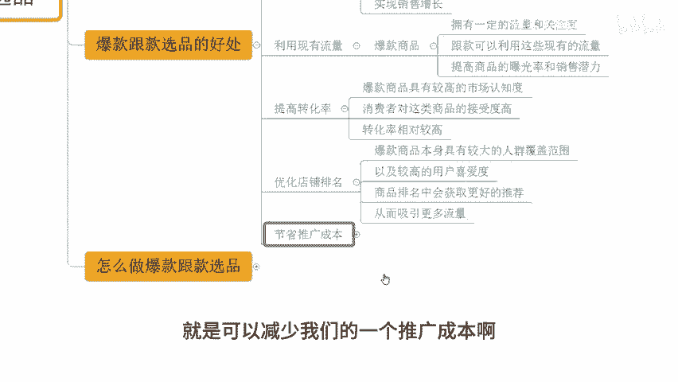

那这个时候呢整个市场热度比较高，整个商品的一个自然流量也会比较多。那么我们通过呃去完成截流的方式去进行一个引导的话，ok那我们可以减少到大量的一个付费推广的一个成本，也可以减少我们对付费的一个依赖啊。

从而呢我们整个店铺呢你能够快速起爆啊，所以它的一个好处其非常非常多的O说完这么多对吧我们也都知道了到底什么是爆款选品，那也知道了我们爆款品的好处。那我们到底应该怎么去做啊。

这个爆款公款选品呢来一起看一看。首先第一件事情呢就是分析我们的一个市场趋势啊，那我们需要结合到我们季节因素然后呢去考虑到平台的一些商品的一个销售数据，根据我们用户的一个行为习惯啊。

从而来识别出市场上具备一定市场体量的一个爆款商品。什么意思呢？就比如说今天我们有一个产品已经卖卖起来已经卖爆了啊，这个产品呢就是一个凉席啊，打个比方啊，那马上夏天都快过去了。

你说你再去做这个事情意义大不大呢？其实可能并不大。😊。

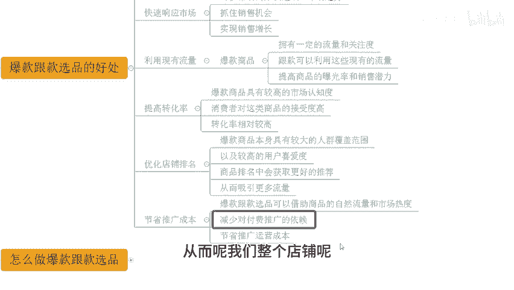

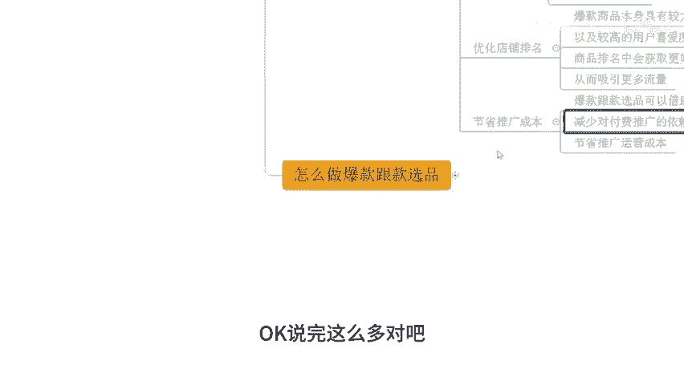

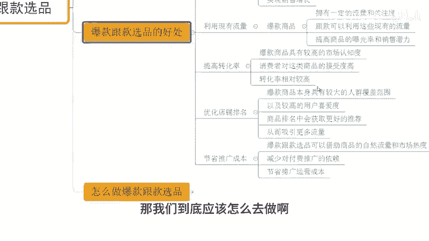

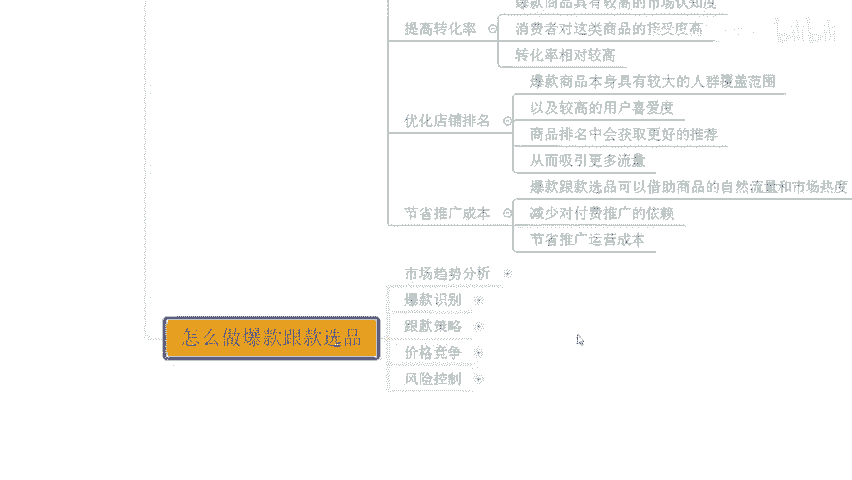

因为它的生命周期很短啊，所以说我们需要去有一个预见性啊，然后再就是呢我们要结合我们用户习惯，对不对？那呃当某一个阶段结束的时候，可能我们会面临着一些换季。那么这个产品呢。

如果说在这个阶段上是处于一个马上要迎来一个旺季的一个时候，对不对？同时呢这个产品呢在目前是已经出现了一个比较萌芽的状态，对吧？爆款前置已经出现了，那我们可以马上去操作它是这样子的。

所以说我们要去辩证的去分析啊，对于时间板块，对用户习惯板块来讲的话，是这样子的啊，然后呢再就是我们要去做好我们的爆款识别，那我们需要去实时去关注啊，注意这个东西很重要啊，那么关注我们市场上一些销量啊。

快速增长的一些产品啊，那么这些产品呢一般来讲的话，我们需要去关注一些发布时间比较短的。同时呢我们的评价数量啊多的，而且评价是一个正面评价的商品。那么这些商品呢它在呃竞争环境来说的话。

它不是那种所谓的老爆款。😊。

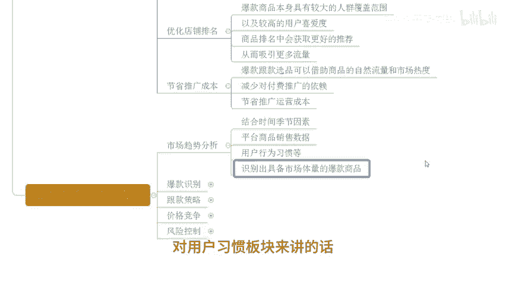

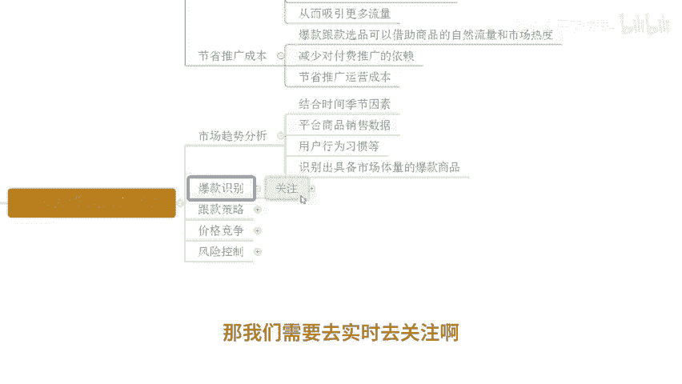

大爆款。那我们去操作呢机会可能会更大一点。同时呢我们在进行操作的时候呢，因为它评价会比较正面，对吧？也都是一些好的评价。所以这个时候呢这个产品往往来说不会有太差的一个质量。

那我们在后期选择会员去更款的时候呢，或者我们自己去生产的时候呢在用户体验方面来讲的话，也不会说太差啊。O再就是我们的更款策略了啊。那么这个更款策略呢是确认了我们商品具定具备一定的这个报款力之后啊。

那迅速去跟进它。那通过我们采购啊或者生产之类的方式来进行一个商品的一个获取啊，同同时呢我们在发布之后呢来借助到这种的热度带动自身商品的一个销售是这样的一个一个过程哈。那么在价格板块的话。

那我们现在呢因为我们是更款，所以说我们在更款的时候呢进行选品的时候呢，我们就需要让我们的产品能够去保证我们有到一个足够的质量，并且呢在整个运营过程呢有着充分的一个价格。😊。

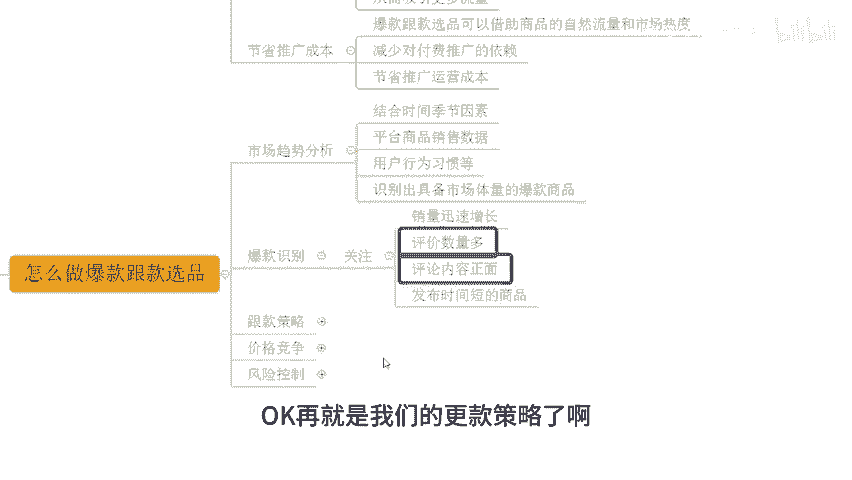

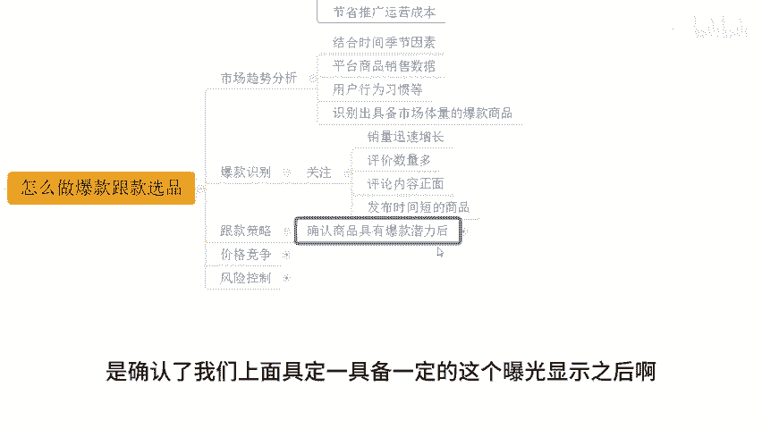

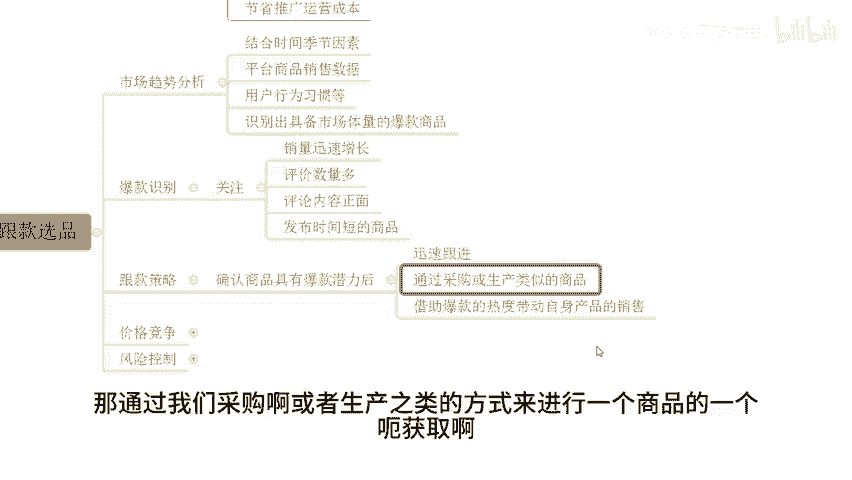

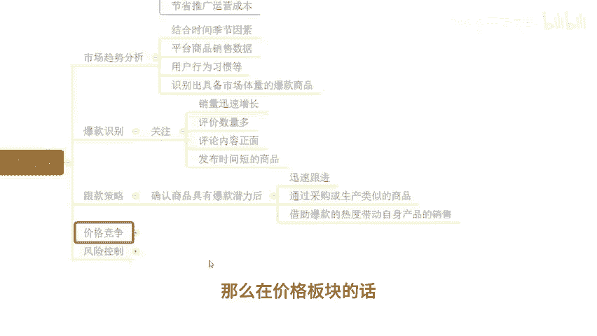

人力啊，那我们可以通过呃扩大生产规模，扩大这一个呃库存的一个这个规模啊来压低我的一个产品成本。那么同时呢在我压低产品成本之后呢，降低我的价格来形成一个价格的绝对垄断跟优势，快速起量啊。

能够去把我的优势放大啊等等啊，都可以的。

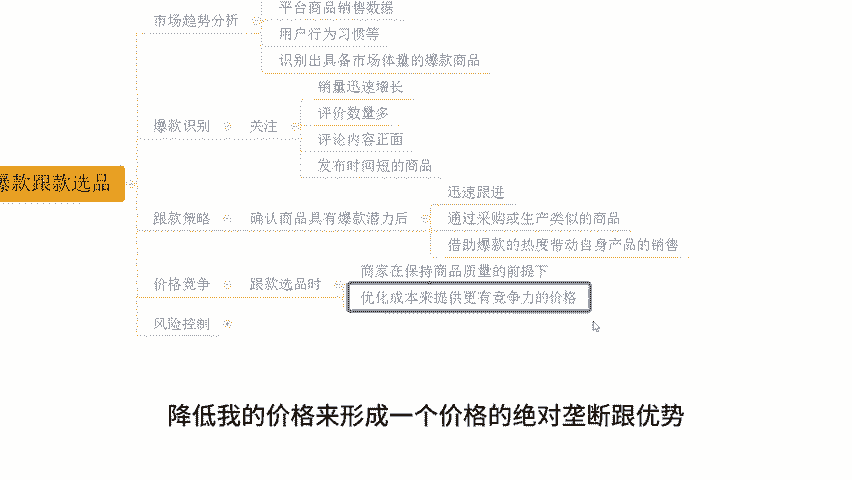

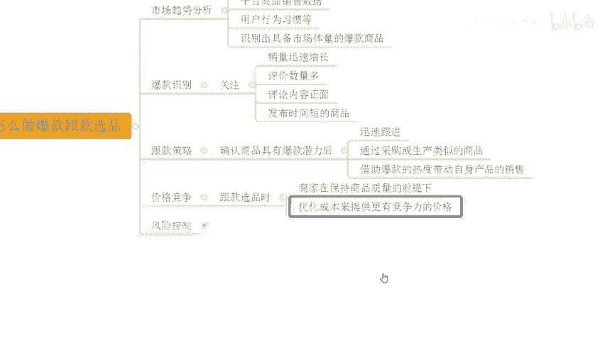

那么再一个就是我们的风险控制啊。那我们在更款的时候呢，也是需要去注意规避风险的。不是说完全没有风险啊。那么哪些风险呢？首先第一个要避免知识产权侵权。

有的产品呢可能说确实是我们的所谓的竞争对手的一个小爆款。但是他店铺呢对这个产品有专利，或者是有图案专利或者是知识产权专利，或者是其他专利啊，都有可能。那么这个时候如果说我们盲目去更款的话。

也会导致说我们店铺呢受到一些侵权的一个处罚啊，这就得不偿失了啊，所说我们需要去掉这个确保我们的商品质量过关，并且呢要遵守我们平台规则避免掉一些我们讲的刚才说的一些违规的一个情况出现啊。

那么这样呢我们在操作的时候呢，才能有到更好的一效果。好吧，O啊，以上呢就是我们关于这个爆款选品的一个操作逻辑啊。当然呢这个可能对于我们很多小伙伴来讲的话，可能是一个思维方式的一个改变。

可能没有涉及到说我第一步应该去做什么。第二步应该做什么，我应该从哪个地方去做什么事。😊。

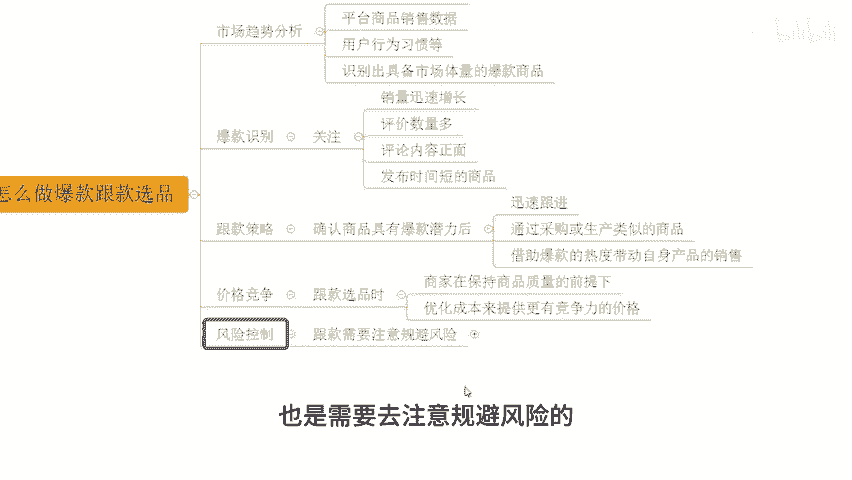

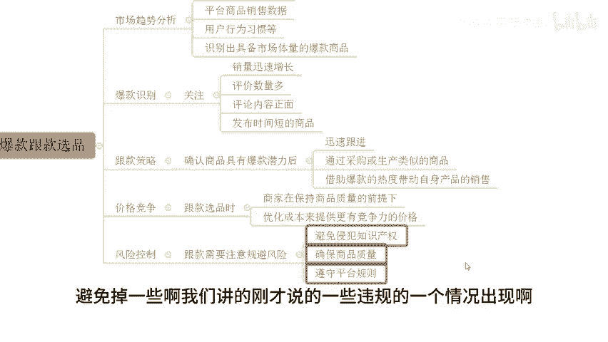

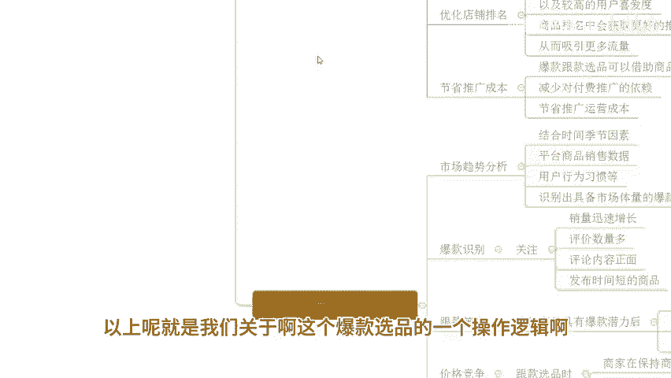

啊，这个也不太现实，因为时间关系不可能讲的特别的具体，特别的详细。那如果说大家对这方面有什么想法，有什么疑问，或者有兴趣的，也可以直接找我跟我交流沟通啊，有需要资料的对吧？也可以这个找我啊。

那么同样的还是那句话，有时间的话，我也可以带着你们一起去实操坐店啊，就像这小伙伴一样呢，我们一起快速的去提升我们店铺运营水平，让我们店铺达到更高水平之后呢，也能够快速去盈利。好吧？

OK那么今天的视频分享呢就到这里，我们下载见，各位拜拜。😊。

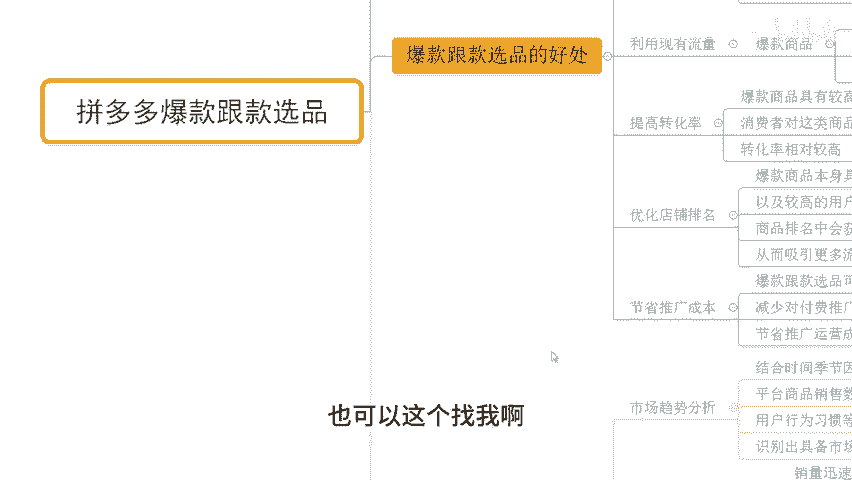

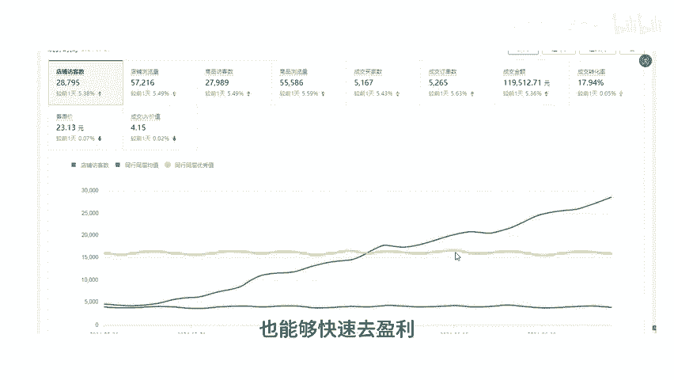

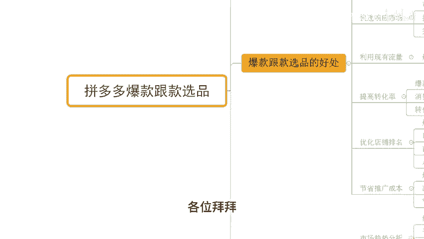