# 拼多多开店运营-新手电商运营实战指南，B站最全拼多多零基础入门教程！拼多多运营秘籍，小白也能成电商大亨！轻松上手拼多多，拼多多新手开店赚钱攻略 - P14：014 拼多多店铺运营10种选择策略 - 拼多多开店运营- - BV1xms8eSEVs

。hello，大家好，我是西楼。那么今天给大家分享的内容呢是我们拼多多店铺运营十种选品策略啊。那么在分享之前呢，还是老规矩，先给大家看一下近期跟着时尚小伙伴他们的店铺数据，好吧。

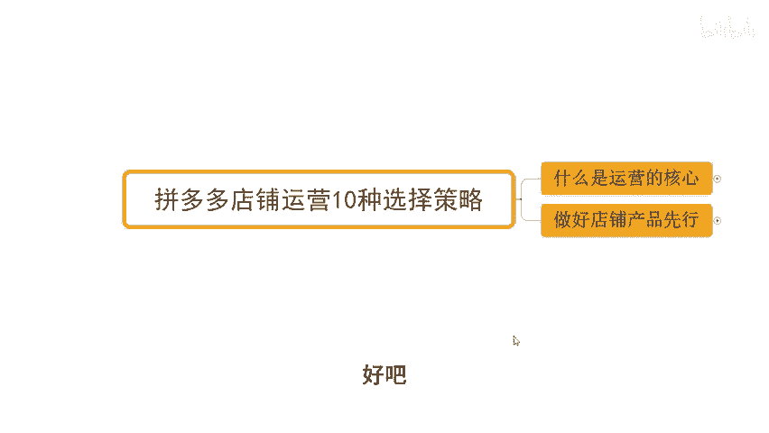

可以看到像这个店铺呢，原本的访客并不多，对吧？只有几百个10千0不到啊。那么跟着实效之后呢，整体的店铺数据呢开始不断的增长啊，到后期呢是一天做到了14000的访客，一天订单呢是1700多单。

转化率呢做到11。77%啊。

还像这个店铺啊，那么早期的时候呢，访客做到了将近5000啊，然后达到这个瓶颈之后呢，一直无法突破。那么后面呢也是针对到我们产品结构，针对我们商品的SQ布局进行调整优化啊。

那么后面呢开始不断的一个呃提升啊，访客呢从原本的5000左右的访客呢直接突破到了后期的280001天啊。那么一天的订单呢做到了5100多单，转化率呢17。94啊。那当然了。

除了这种有基础有数据的店铺之外，对不对？也会有到很多这种呃零基础零访客的新店啊，比如像这一个对吧？原本是一个零访客的新店啊，那么跟了实操之后呢，也是通过产品的选品到后期的新名操作不断的去优化。

那么访客呢也开始不断的增长，到后期的话一天访客呢做到了12000可以看到啊，一天订单呢是2700多单转化率呢21。05啊，转化率非常高啊。当然因为这个店铺的客单价相对比较低一点，只有11。

27的一个客人价啊，那同样的还像这个店铺啊，这个店铺呢相对来说单量就会少很多了吧？单量一天只有900多单啊，那么也是一个零访客的新店，从最早零访客做到了后面一天的话是900多访客对吧？

那么转化率呢相对来说不是特别高，只有9。82啊，但是他的客单价比较，客单价是100多的客单价啊。所以说不管是这种零基础的新店也好，还是说有一些有数据有基础的店铺也好，其实跟实操呢也都能够得到一个好提升。

那当然了，这些店铺也都是通过这个战略的方式。😊。

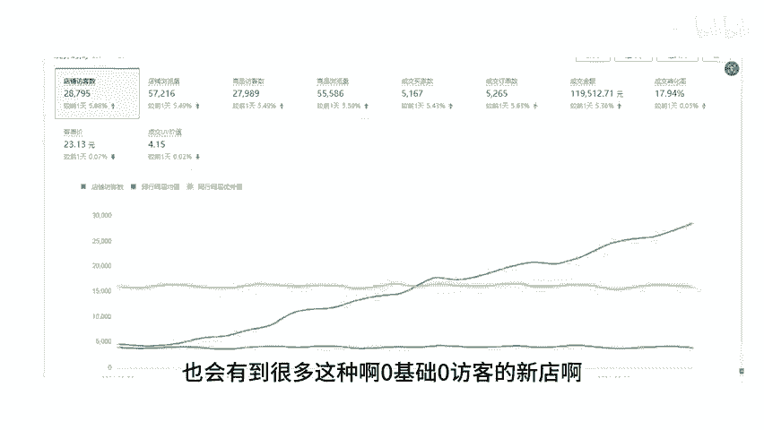

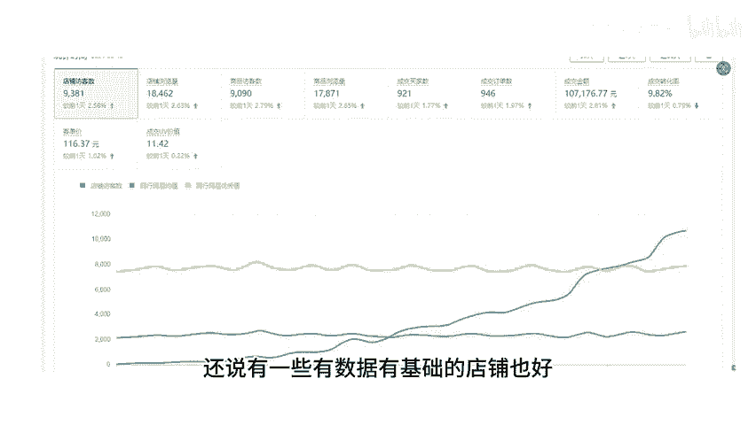

操作的如果说你想知道怎么通过这样的方式来提升店铺数据，让我们店铺变得更好的话，OK那么可以仔细观看我分享视频，好吧。

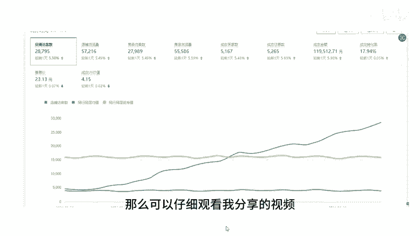

店铺运营呢对于我们大多数人来说，尤其是对于新的小白来说，肯定会有很多很多困难。这个很正常啊。那如果说你有店铺操作方面的问题啊，有需要资料的呀，OK的可以找我啊。有时间的话。

我也可以带着你一起去实操做店啊，就像这些小伙伴一样呢，我们一起快速提升我们的运营能力，让我们店铺呢达到更高一个水平，好吧。

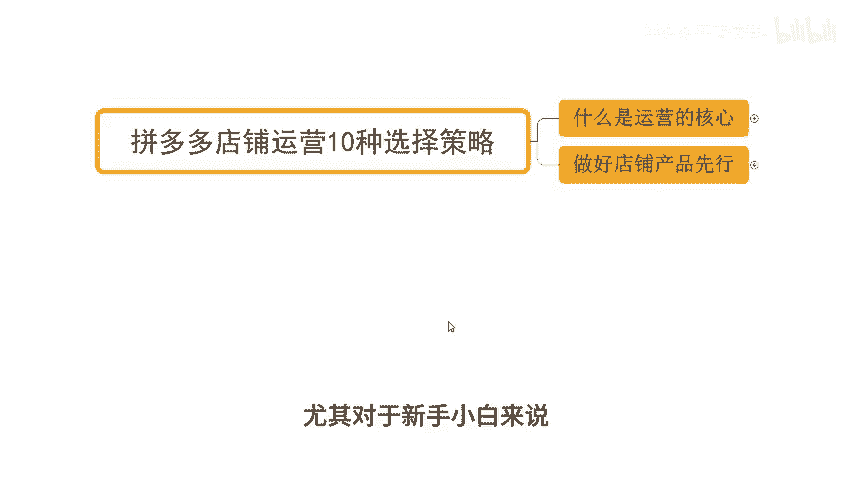

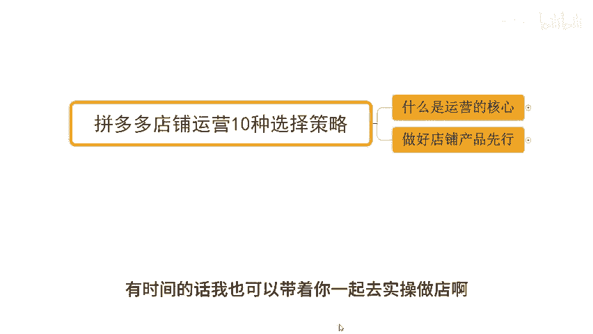

OK那么关于我们具体的1种选品策略呢，后面我会详细分享。首先呢今天我们了解清楚到底什么是我们店铺运营的核心啊，这个是很很关键的一个点啊。那么其实什么是核心，我相信大家看到这个标题应该很清楚的吧？

其实选品就是核心产品就是核心。如果说你不懂选品，那么你整个店铺运营呢就会困难重重啊，什么意思呢？如果说今天我们不同选品，我们发布的商品呢本身就是一个没有流量的产品，对吧？

或者说我们发布的这商品呢本身就没有一个很好的市场需求。那么这个时候呢我们整个的一个产品呢也会存在说有访客没有转化啊，诸如其来的问题呢，也会导致我们整个的店铺操作呢得非常非常的困难啊。

而这些问题呢也都是跟我们这一个选品息息相关的啊，那不会选品的一个弊端呢有很多除了我刚刚讲的这些之外，另外可以看一下啊像我们首先第一个点呢会面临说有到一个非常大的库存积压。比如说今天我们是厂家或者是我。

😊。

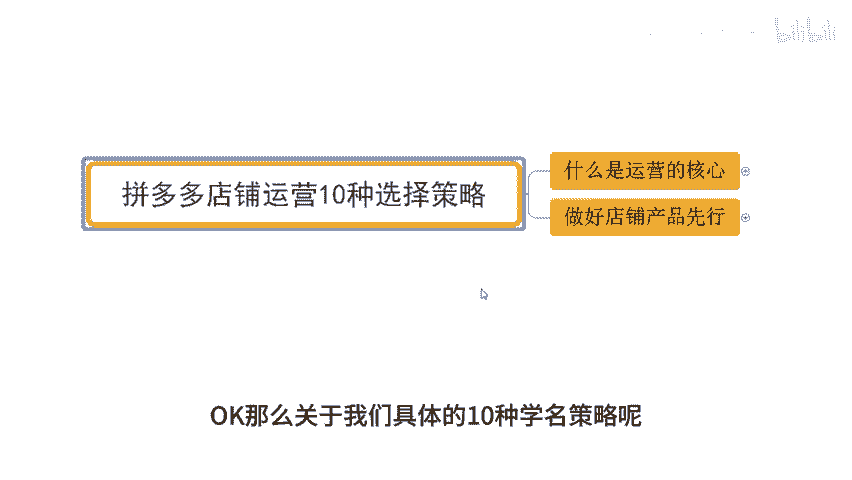

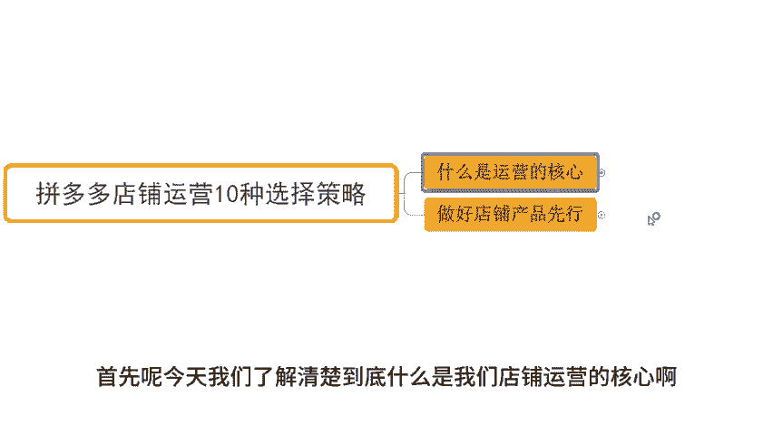

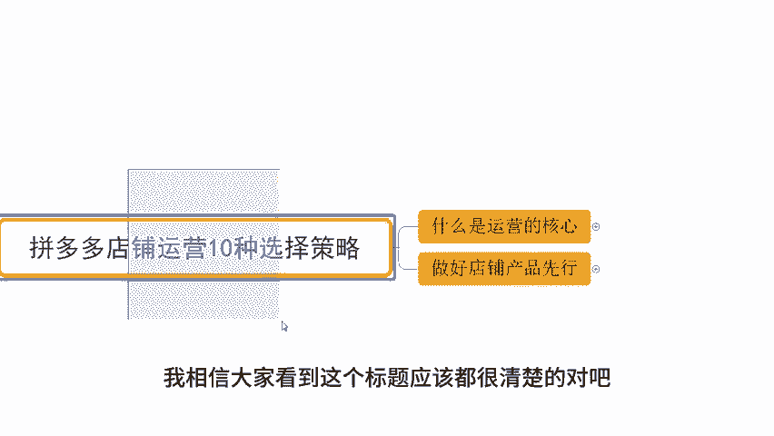

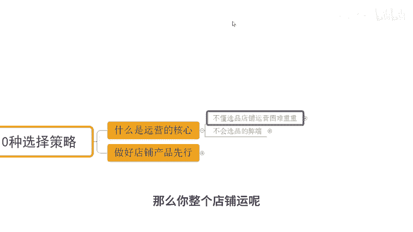

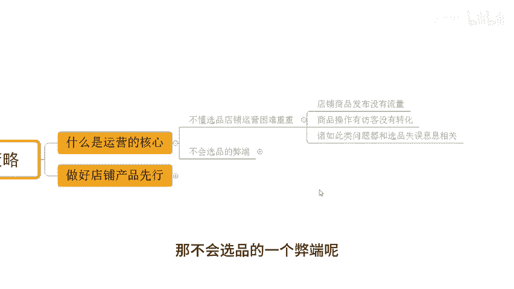

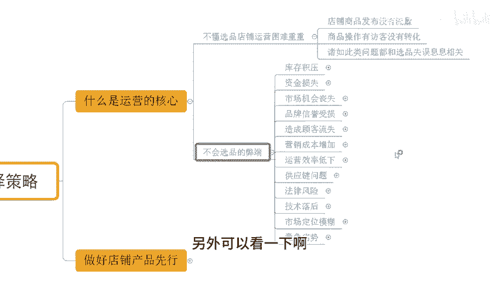

是拿货的啊，那么我们选择了一些不受欢迎的一些商品。那么这个时候呢可能就会导致大量的一个库存积压。而这个库存积压呢，就会导致我整个的仓储成本和我的一个资金被占用啊。

就会导致我可能后续存在说很大的一个经营风险啊，那同时呢还会造成我们的资金损失，除了我们会说有个资金占这个占用之外的话，资金损失也是不可避免的。什么意思呢？

首先当我投入了大量资金的采购这种不畅销的产品的时候，对不对？那可能后期呢我需要去进行一个清仓处理这个时候呢，肯定就会以低价的方式来进行的。而这个时候呢，往往会造成亏损啊。

那么我们资金呢就会造成一个直接的损失。那么另外一点呢，还有是我们整个市场的一个丧失啊，这个机会的上失。那我们如果关注到的产品呢都是一些错误的商品，对吧？

那么这个时候呢就会导致我们错过市场上一些其他有潜力的商品和一些销售机会。

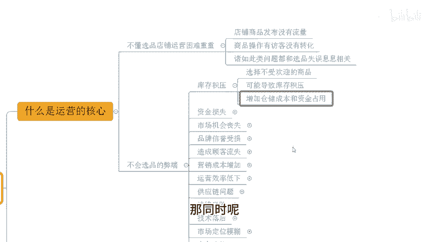

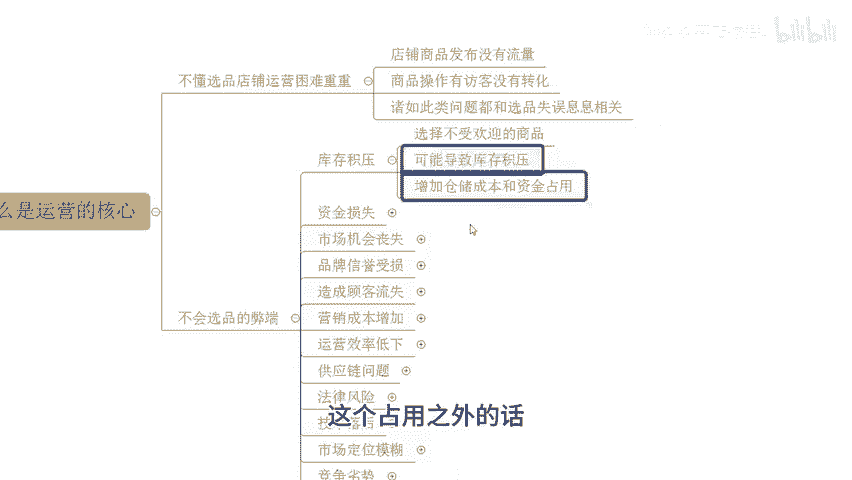

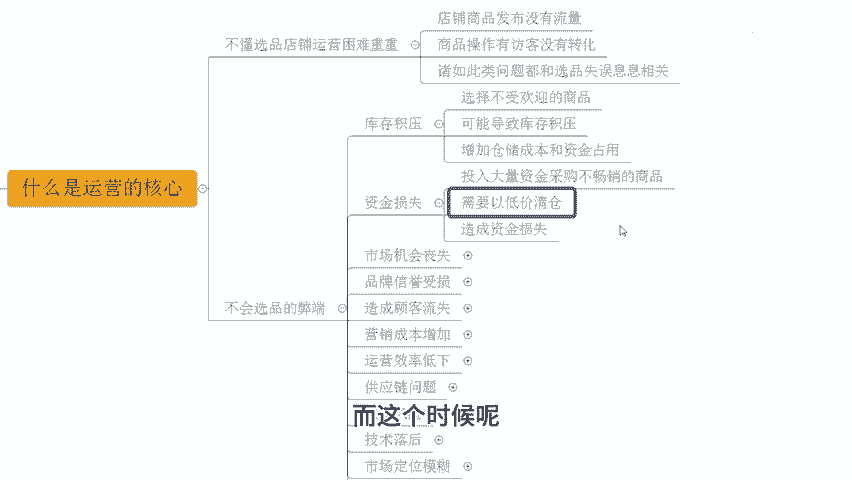

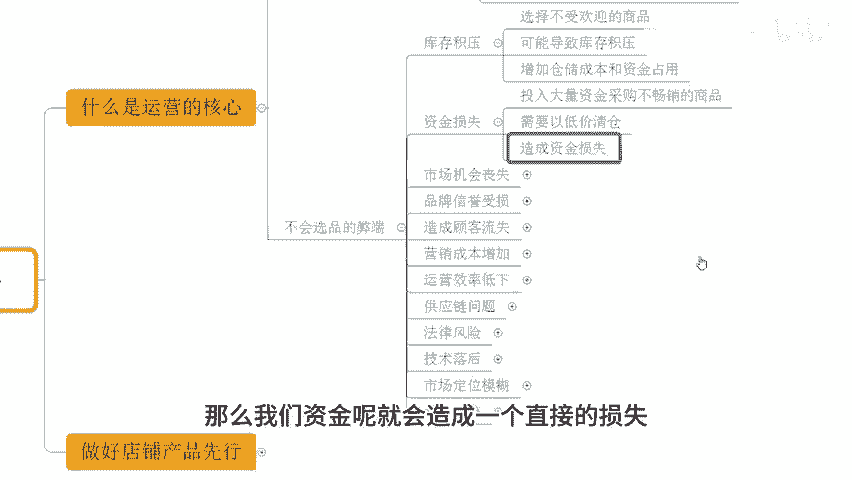

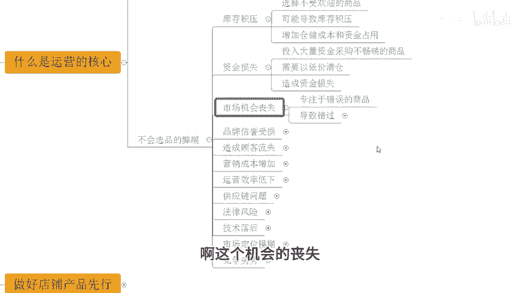

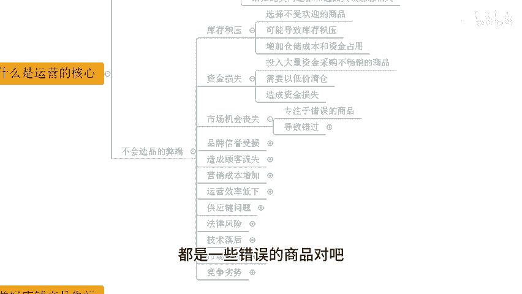

导致我们在后期的时候呢，发现当我反应过来的时候，整个平台的其他一些所谓的这个爆款已经卖爆了，对吧？我再去追困难变得很大，而且甚至可能说已经没有这个机会去再去追了。

那么因为这个市场呢已经可能这一阵风已经过去了，对不对？那么再一个点呢就是我们品牌的信誉呢也可能会受到影响。当然这里的品牌信誉呢也不仅仅说只是我们某一些这个知名品牌，它的一个品牌形象，对吧？

当然也会包含出像我们个人店铺的一个店铺形象啊，它也是有品牌效应的啊，尤其是我们在经营的时候呢，一定要有这样一个思维，或者有这样一个认知啊，我们做店铺呢其实就跟我们做人一个道理的。那么你人品不错。

那么你后期可能会到很好的这样的一个社会知名度或者社会的一个口碑，那么店铺也是一样道理，对吧？那如果说我们选品有问题，那可能就会导致说选到一些产品或者说是这个数据啊不是很好的一些垃圾商品，对吧？

那么这个时候呢。

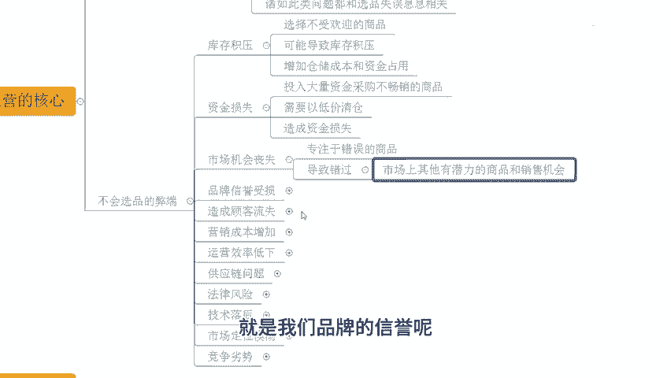

导致我们整个的店铺呢会存在出大量一些不符合我们用户需要的产品。那么这个时候呢自而然对我们品牌的形象，对我们自身的一个呃损失也会造成比较巨大的一个损失啊，对我们消费者的信任也会一种伤害啊。

然后再一个就是可能会造成我们顾客流失了。那这个东西呢很正常，对不对？当我们用户呢来到我们店铺之后发现这个店铺的商品呢跟我所需要的产品不一样啊，是不是我想要的产品。那么自而然就导致我的顾客流失掉，对吧？

那么这个时候呢这个顾客流失之后呢，到别的店铺去成交，包括说有的老客户他也可能会导致说呃因为这个店铺的商品可能比较一般，或者是对我的吸引力不够，对我的这个需求把控不够。

那导致我可能原本需要去购买一些商品的呢，我不会造他店铺去再次回顾啊，那么会导致我们的用户流失也都会有的啊。那再一个点就是我们整个的营销成本呢会大大增加啊，这个东西呢是一个非常非常重要的一个事情，对不对？

因为我们如果说是一些不是欢迎的产品的话，那么它本身因为是。

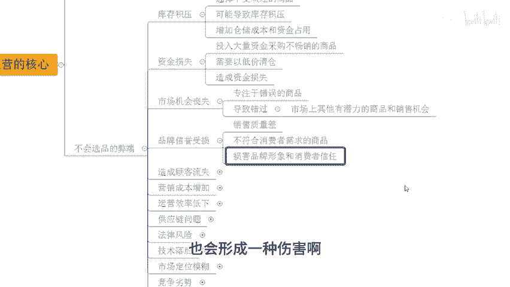

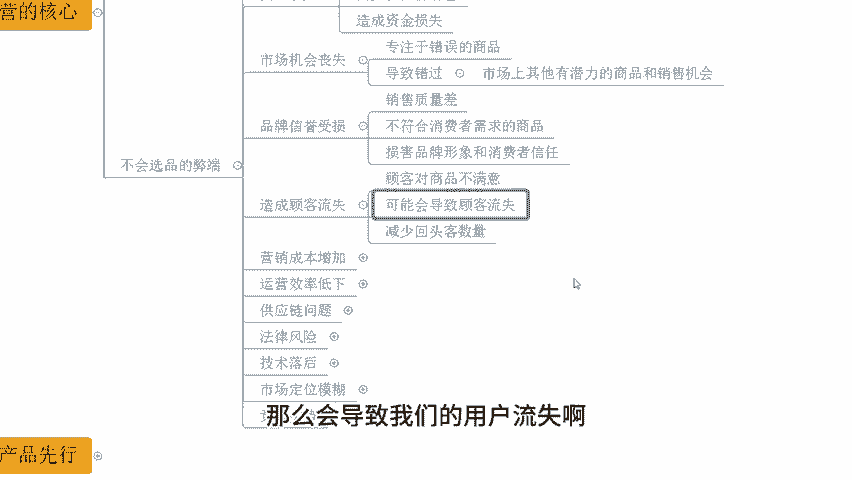

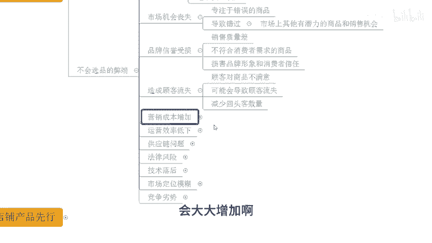

场的容量还是我们群体会比较小一点，对吧？所以这种时候呢我们在推广这种产品的时候呢，那我们想去把它推起来，让它具有销量的话，那么这个时候呢我们就需要投入到更多的一些营销资源和广告的费用啊。

那么会造成大量的一个浪费啊。再一呢就是我们的运营的效率会比较低下。像我们本商品的这一个呃库存管理啊，订单处理这些运营环节呢，如果说是我们选品不当的话，就会导致说整个过程会变得比较复杂。

而且会变得比较低效啊，也是一个非常非常重要事情。那么我的人力成本有大增加啊。然后再又是我们的供应链问题。

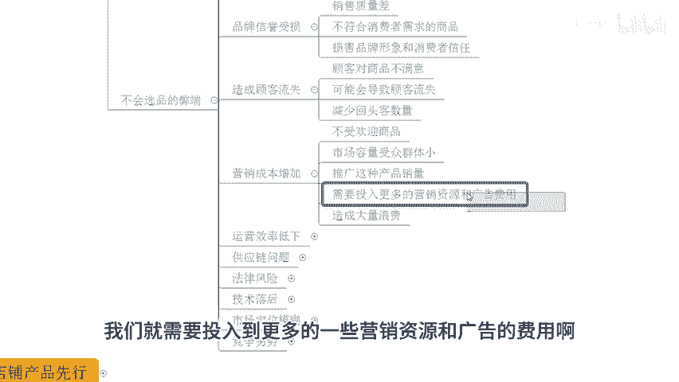

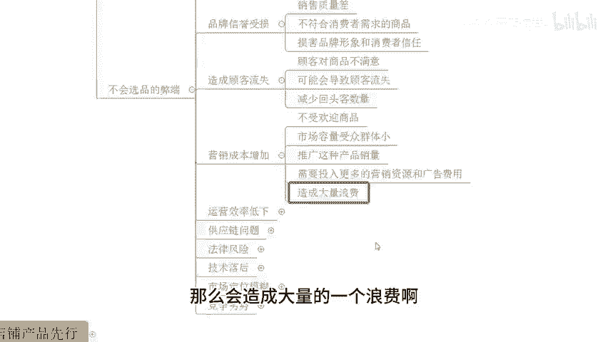

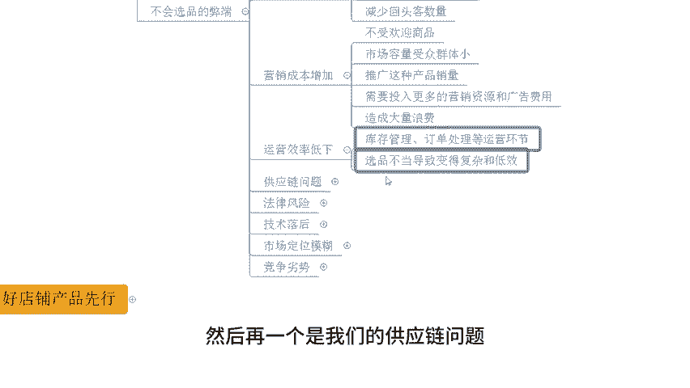

那选品不当的话，也可能会导致我们整个的供应链不稳定啊。因为这个产品呢可能没有太多人去呃这个销售啊，也没有太多人去购买。那么可能我们呃如果说是采购的话啊，供应商那边的话，它的会员也不会很稳定，对？

可能它因为数据量不好，反馈不好，动不动可能就会取消这个生产，都有可能对吧？那么这个时候呢就会导致影响到我们店铺的及时供应还有我们质量的一个控制啊，那么就会有很大很大的一个隐患啊。

那么再呢就是我们的法律风险啊，那如果说今天我们不会选品的话，也会导致说可能这个产品呢本能涉及到一些这个法律法规的一些违规啊，那么我们也可能会面临着一些法律输讼啊或者是罚款的一风险啊。

那么再一个呢就是我们的一个技术落后这样的一个一个弊端啊。那么市场呢它是一个这个快速变化的啊。如果说我们没有办法去跟上这个市场的不伐的话，那么这个时候就会导致我们的产品呢可能快速过时，也会导。

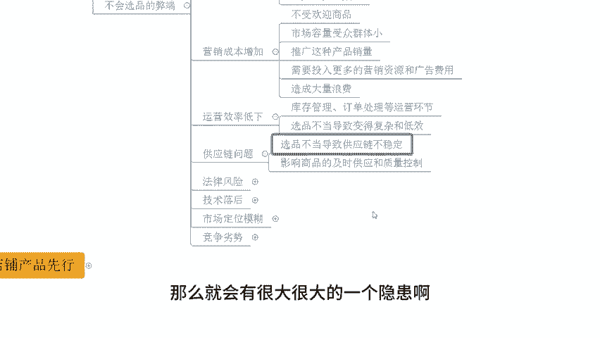

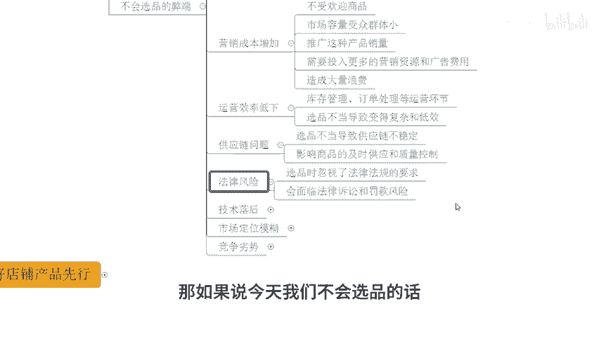

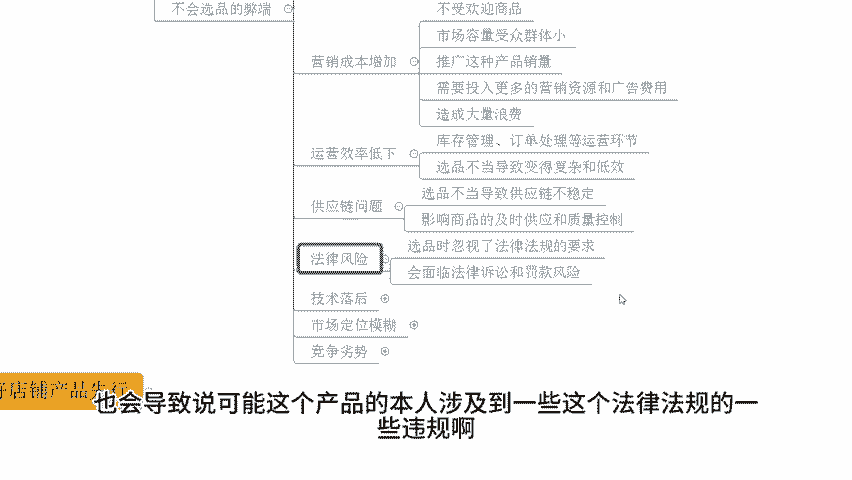

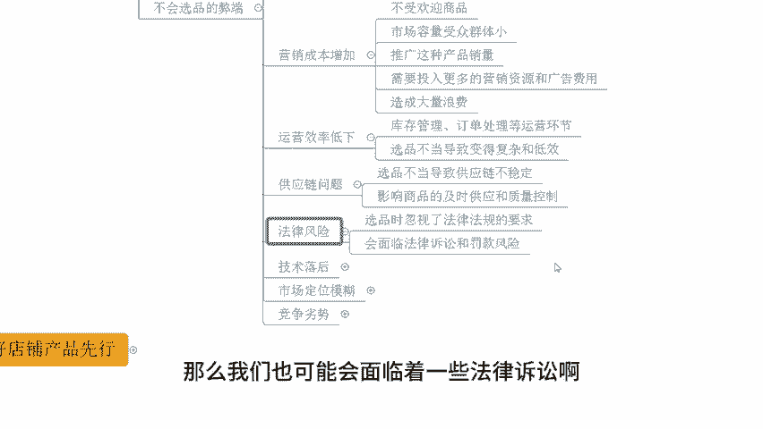

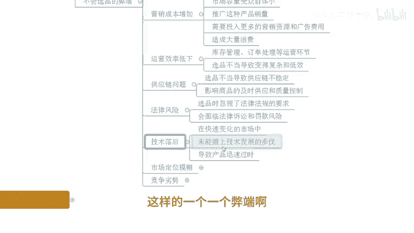

我们整个的市场占有率下降啊。那么同时呢当我们不会选辩的时候呢，我们整个的这个市场定位呢也会比较模糊。那可能导致我们这个品牌或者是我们店铺呢在整个市场里面的定位呢不是很清晰。

那消费者呢也很难去辨别出我自己的这个品牌或者我自己店铺的一个特色来进行一个很好的年性的一个增加啊，再一个呢就是我们竞争的一个劣势啊，那市场的竞争呢非常激烈。这个大家都知道选品不当的话。

那么这个时候呢就很正常就会导致说我们的商家呢在竞争环境中处于一个不利的不利的一个状态啊。比如说我们产品呢它本身就没有一个很好的市场体量，没有很好的市场需求。那我们就没有办法去获取了更多的用户。

自而而然你是在整个竞争过程中是于一个劣势的啊。那么O除了这点之外呢，那我们还有就是呢一个非常关键点，对不对？我们要做好店铺的话，所以说大家要知道就是产品先行，对？那么产品先行的话，这里呢。

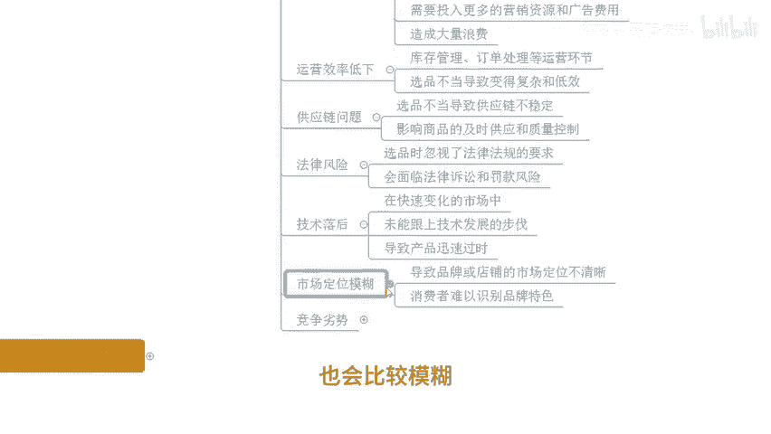

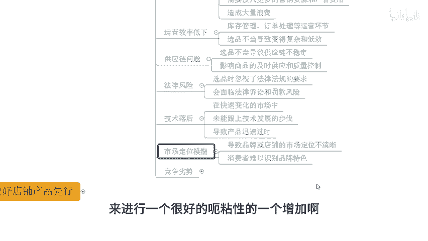

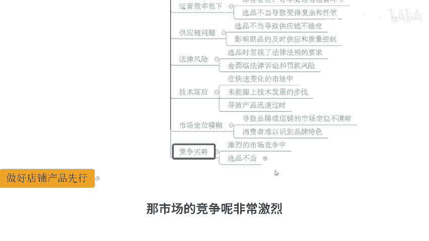

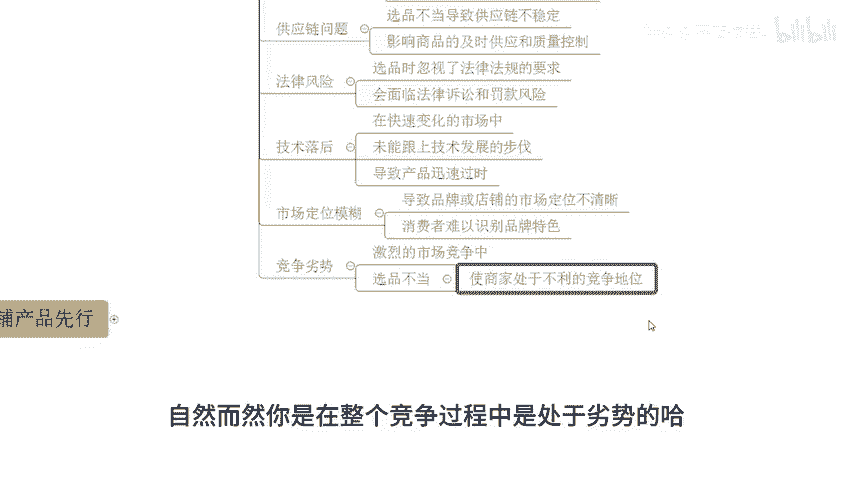

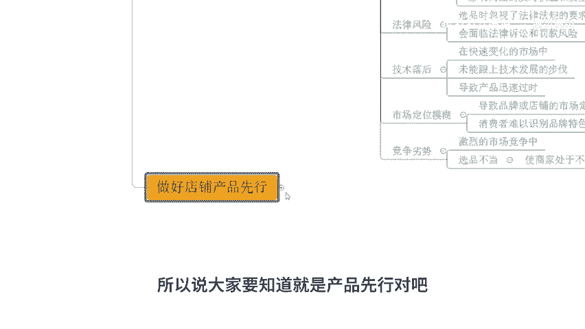

就是我们要针对到我们的这个选品逻辑，有到一个充分的认知。那么店铺的运营呢，在很多时候呢，我们会讲到说60%看产品，30%看运营，10%看运气，对吧？那60%部分这个产品部分它是大头。

但是这一个大头呢却是我们运营决定的。因此运营很重要。

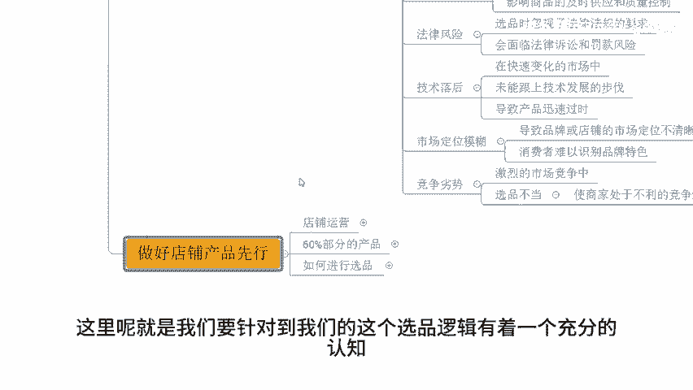

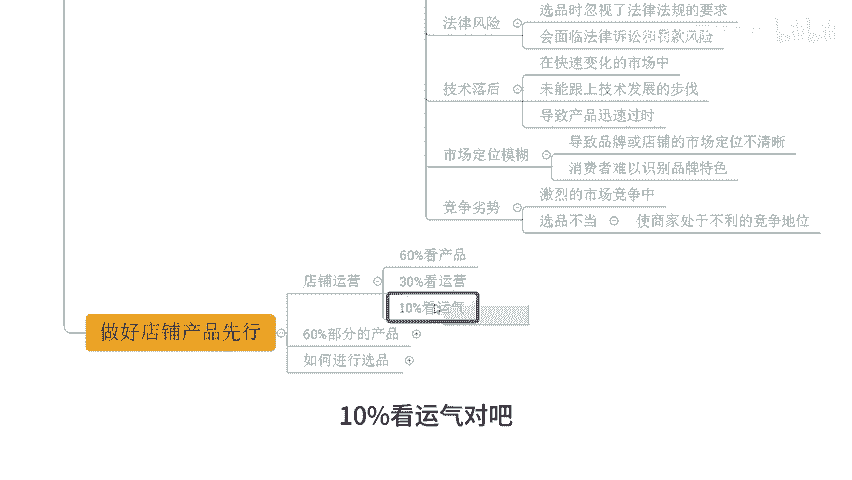

运营中的选品也更重要啊。那所以说如何进行选品，就会保证我们能够去有到一个很好的市场体量产品，能够去在我们同类进营中体现出我们竞争力，并且让我们产品呢有个更好的一个生命周期，能够具备一个更大的利润空间。

来完成我们店铺的一个运营，完成我们市场的一个占领啊，所以这个很关键好吧？而至于说具体的一些选品的策略，对吧？哪1种后面呢我会抽时间给大家详细的去一一讲解大家可以关注一下啊，那么如果说对于店铺操作呢。

你有什么样的一个问题啊，或者有需要资料的呀。O的，可以找我。当然呢还是那句话有时间的话，我也可以带着你一起去实操做店，对吧？就像这些小伙伴一样呢，我们一起快速去提高我们运营能力。

让我们店铺呢达到一个更高水平，好吧？O那么今天的视频呢到这里结束，我们下次见，各位，拜拜。

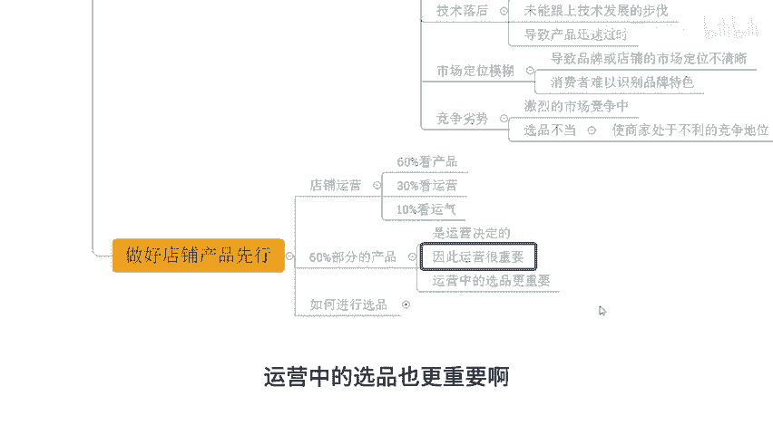

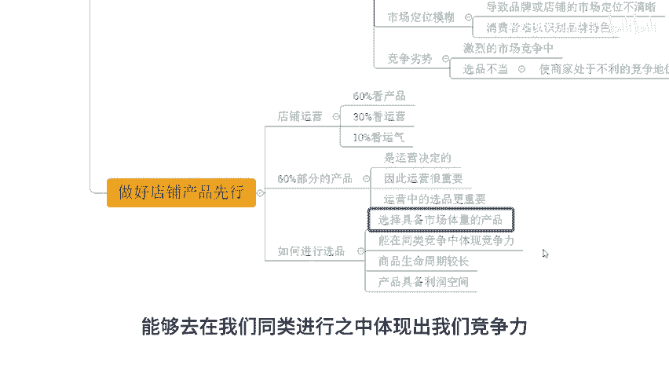

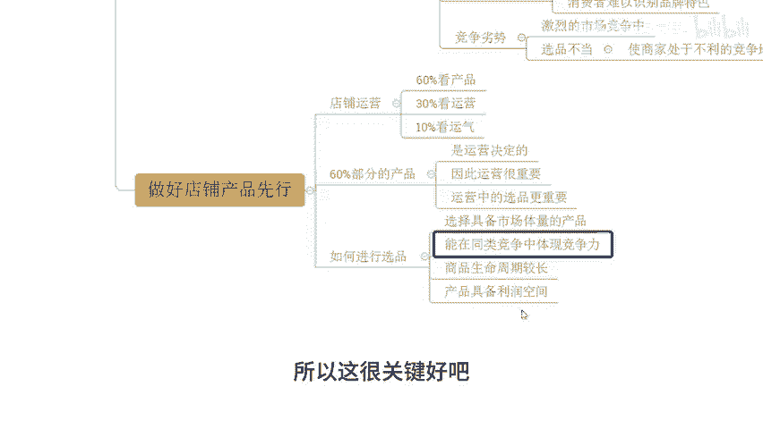

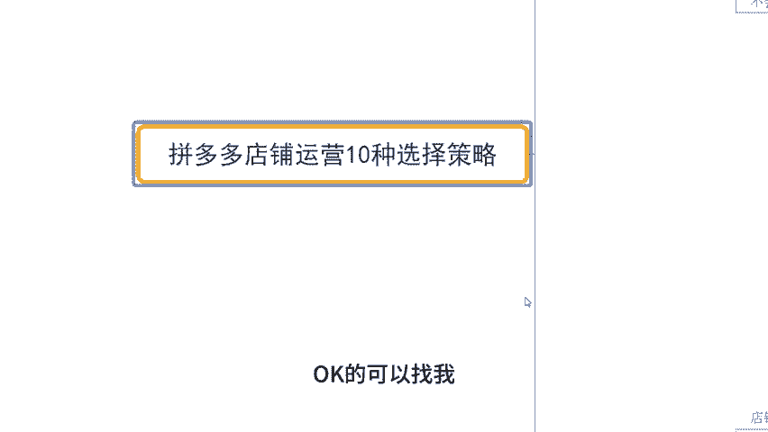

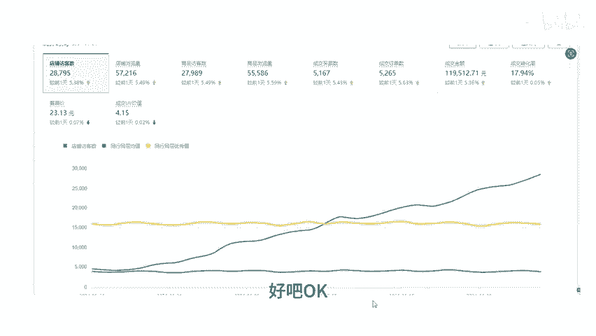