# 拼多多开店运营-新手电商运营实战指南，B站最全拼多多零基础入门教程！拼多多运营秘籍，小白也能成电商大亨！轻松上手拼多多，拼多多新手开店赚钱攻略 - P15：015 拼多多活动跟款选品 - 拼多多开店运营- - BV1xms8eSEVs

hello，大家好，我是谢楼。今天给大家分享内容呢是我们拼多多店铺运营食品食种选品方法中的活动更换选品的方法啊。那么在分享之前呢，还是老规矩先给大来看一下近期跟的其他小伙伴他们的店铺数据，好不好？

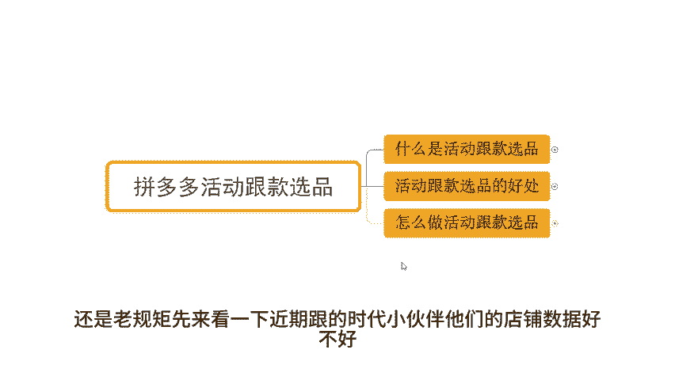

OK可以看到，像这个店铺呢，原本的访客在5000左右啊，那么在这个瓶颈上呢，也就是排徊了许久，对吧？但是呢一直无法突破。到后期呢也跟实到之后呢，我们也是针对到我们产品的结构，包括说我们新品的一个布局。

以及我们商品的SQU和价格定位重新的做了一些调整啊。那么优化之路呢，整个店铺访客也在不断的增长啊，到后期呢一天的访客呢从原本的5000左右啊，做到了28000。那么一天的订单呢做到了5000多单。

转化率呢做到了17。94%啊，也都非常不错的啊。好像这个店铺呢，那原本的访客只有几百个，对吧？一样的，也都是通过各种的优化调整完成了店铺访客增长啊。到后面的话，一天访客做到了14000。

一天的订单1700多单，转化率呢做到了11。77%。

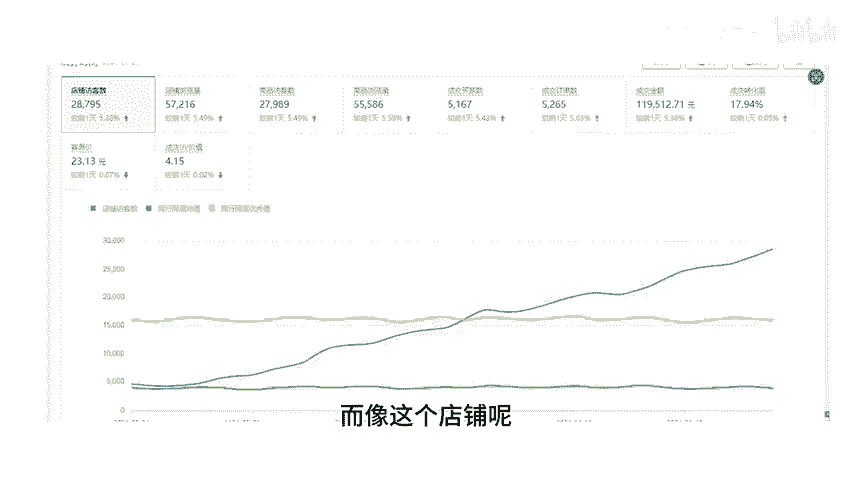

那么同样的，除了这种有店铺数据，有基础的店铺之外呢，OK还有像一些纯新店对吧？这个店铺呢原本是一个零访客的新店啊，那么也是跟着实之后呢，完成了我们产品的选品定位，完成了我们商品的操作，对吧？

不断的进行调整优化后期的话一天访客做到1000一天订单2700多单转化率21。05啊也是非常不错。那么像这些店铺呢也都是通过战的方式来操作的啊，那么对于我们整个店铺来讲的话。

如果说你想要知道怎么通过战流的方式来提升店铺数据怎么通过战流来优化我们店铺数据达到更高的一个这个收益的话，O建议可以仔细观看我分享视频好不好？对于店铺操作来讲的话，其实很多的销小白面临很多很多困难。

这很正常。如果说你有店铺操作面的问题啊，有需要资料的呀，的可以找我啊，有时间的话，我也可以带着你一起去操作店啊，像这些小伙伴一，我们一起快速提升营能力让我们店铺呢达到更高水平。

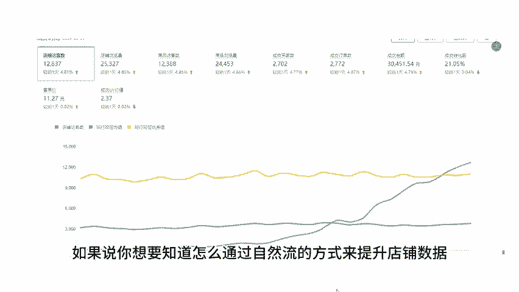

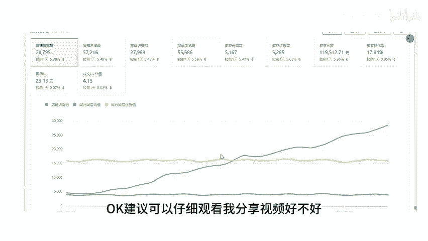

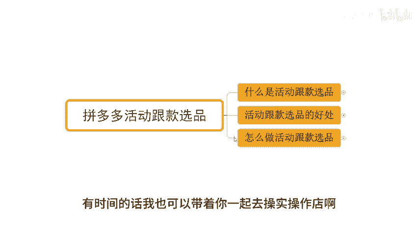

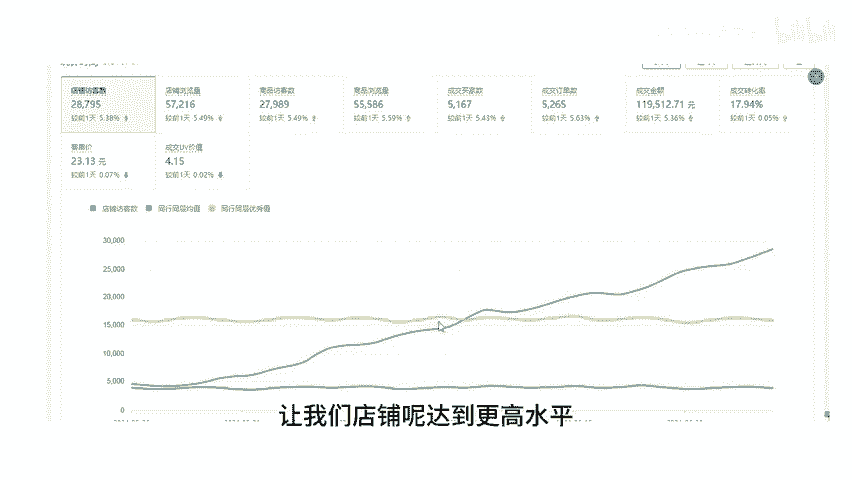

OK那么今天分享内容呢叫做活动跟管选品。那还是那句话，对吧？我们得搞清楚什么道理什么是这个活动跟管跟管选品啊，对不对？这个你不知道你说你说那么多有什么用没有意义，对吧？那我们来看一下啊。

什么是活动跟管选品。活动跟管选品呢就是指我们商家在电平台上根据一些特定的促销活动选择在活动里面表现好的商品来进行销售的一个策略，就这么简单，对吧？那么这样的一个方式的话，我们都有很多很多好处。

比如说我们这些产品呢它本身是在平台上没好的爆款啊，再一个呢我们能够通过活动呢去比较快速的去锁定他们好吧，而这个所谓的特定活动的话，一般往往来讲对于拼多多来说，我们可以去通过这个爆款进价来进行确定啊。

也是比较方便的。那么活动更款呢刚刚也讲到说会有到一些好处，对吧？效率比较高。那到底有哪些好处呢？具体都有哪些我们来看一啊。首先第一个点，那么是市场需求的认证。😊。

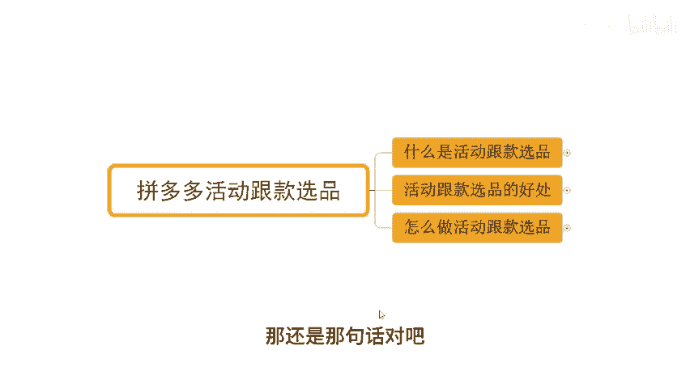

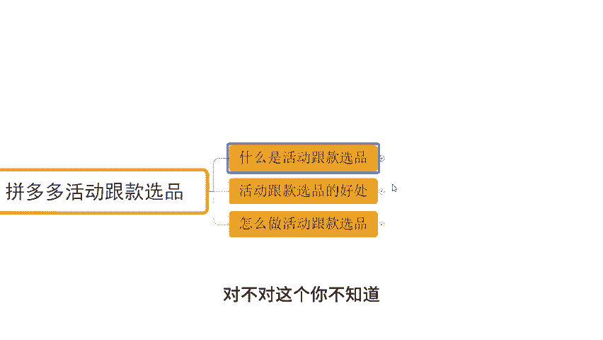

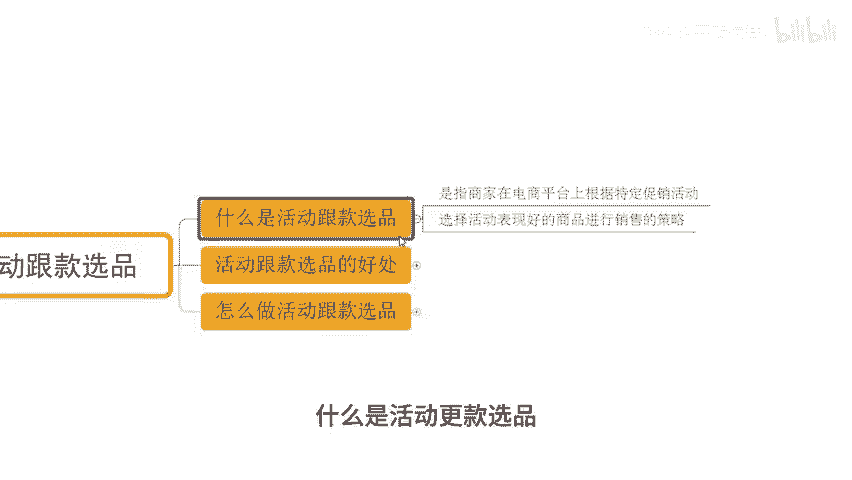

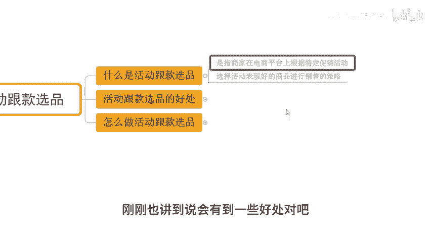

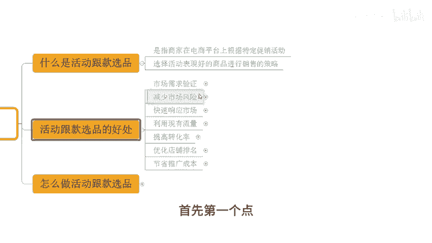

这个的话其实跟我们之前讲到的这个爆款跟款是一个逻辑的啊，因为活动跟款选品的话，那么他所选的商品呢也是已经经过市场验证的啊，因为呢它是已经通过活动提报了，对吧？

并且在活动提报里面呢能够有到一个很好的活动反馈，对吧？通过这些活动营销呢得到这个反馈之后呢，我们也都知道这个产品肯定是没问题的，所以它的起报概率呢会大大增加啊。

那同时呢也会减少到我们的一个市场经营风险啊，为什么这样说呢？因为本身这个产品是爆款啊，我们已经很清楚了，所以说还是那句话啊，我们可以减少我们整个市场测试，包括测试过程中的时间成本。

还有我们的资金成本啊都可以减少。同时呢我们也会降低我们新品在市场上不是欢迎的一个不确定性这个不确定的一个因素啊，那同时呢对于我们店铺来讲的话，也可以通过活动跟款新品呢来快速的去进行一个市场响应，对不对？

因为有很多商品的话，在平台销售的时候呢，可能没有办法去有到。

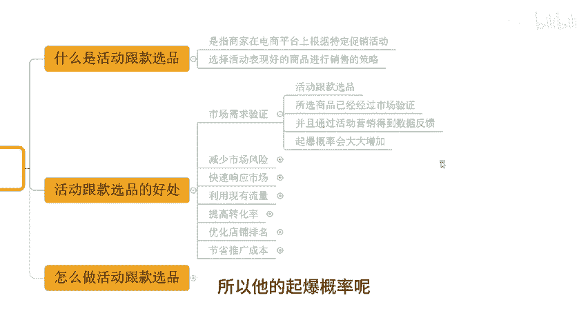

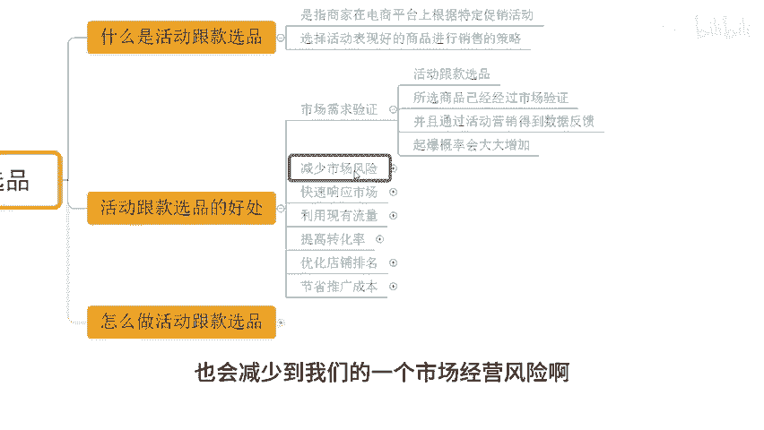

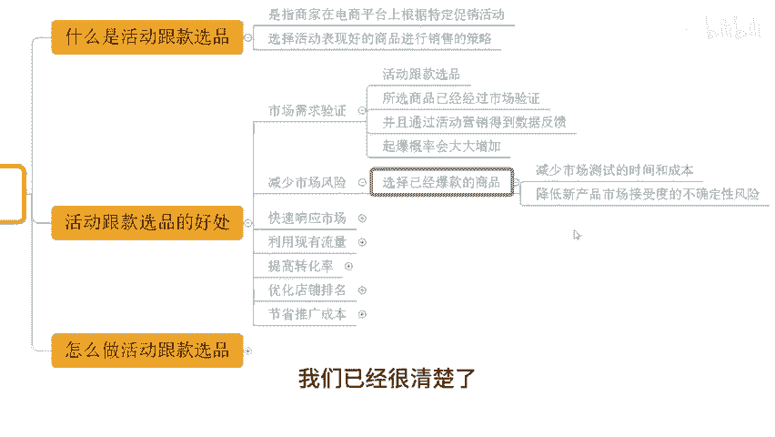

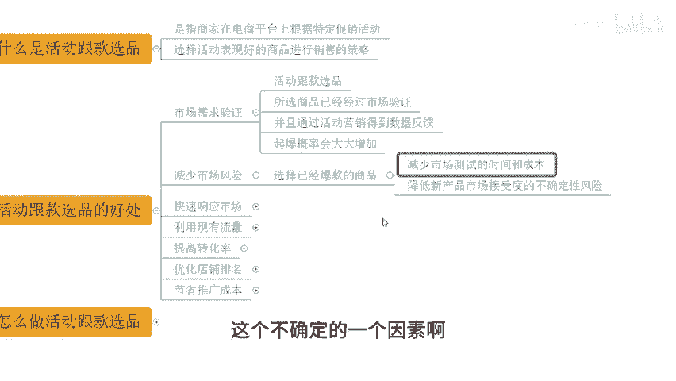

个很好的所谓的一个市场跟踪的一个一个效率，对吧？那么我们通过活动渠道去不断的观察，或者长期坚职观察的话，其实可以快速的去反映到市场上的一些这销爆款是什么，然后通过这些商品它的一个市场趋势变化。

我们可以快速的去抓住一些销售机会，能够实现我们销售的这个增长啊，完成我们产品的一个定位啊，是这样子的。同时呢我们通过这个活动选品呢也可以去利用好现有的一些流量啊。

因为这些商品啊它本身是属于一些啊活动商品是些爆款商品对不对？而他们呢就一定具备了一定的流量和关注度的那我们通过跟款呢可以通过这些产品啊来完成现有流量的一个收割，对吧？比如说提高我们产品的曝光率啊。

提们产品的销售潜力等等啊，都可以的。当然呢在这个过程中的前提条件是我们的商品呢一定是具备一定的竞争优势的，比如说我的价格比较低，或者说其他方面的一些这个营销做的更到位更好一点啊。那在。

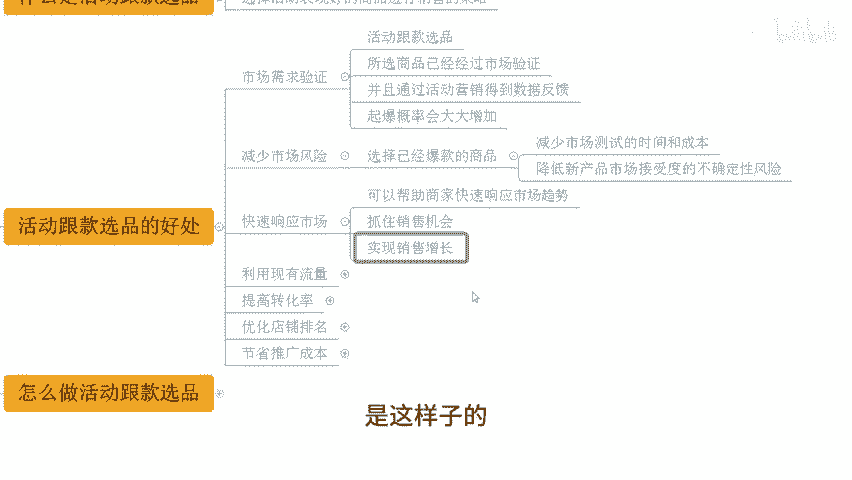

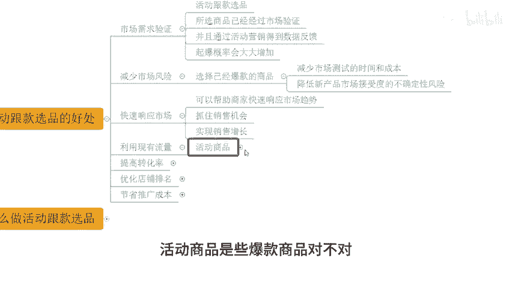

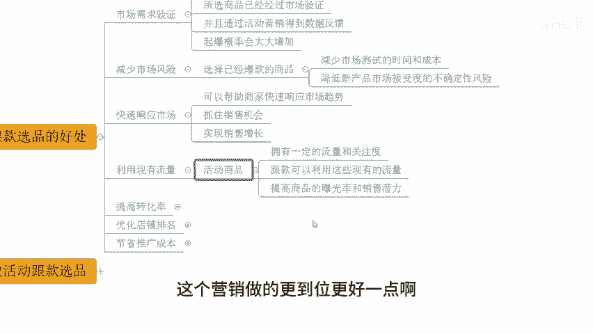

点呢就是说这种商品呢它的转化率呢也会比较高啊，对于我们这些活动商品来讲的话，它肯定是受到了市场认可度的一个这个认证的，对不对？而消费者呢对于这类商品的接受程度一定是比较高的。

不然的话它不可能在活动里面能够有到一个好的表现。所以说他们的转化率呢相对也是比较高的啊。同时呢也有利于我们去优化我们商品的排名。活动商品呢它本身也会覆盖到比较大的一个流量人群。

那么也会有到较高的一户用户喜爱度啊，并且呢活动提报呢本身就是会有到一个平台加权扶持的。所以说这个时候呢对于我们这个商品排名获取呢会有到更好的推荐，也能够去引导到更多的流量进店。

对我们店铺排名呢也是有大的帮助的啊。那么除此之外呢，还有就是可以去节省到我们的一个推广成本啊，那活动选款呢可以借助我们商品的自然流以及我们的呃。😊。

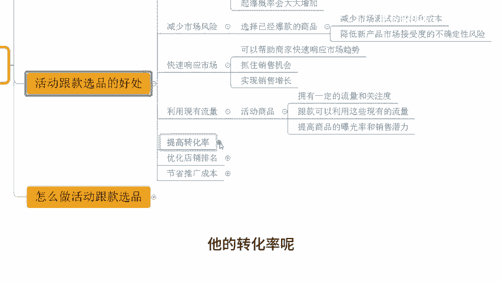

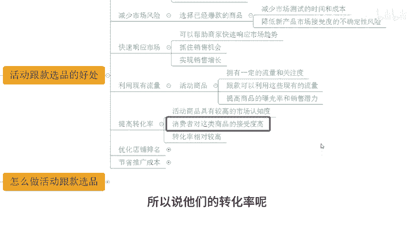

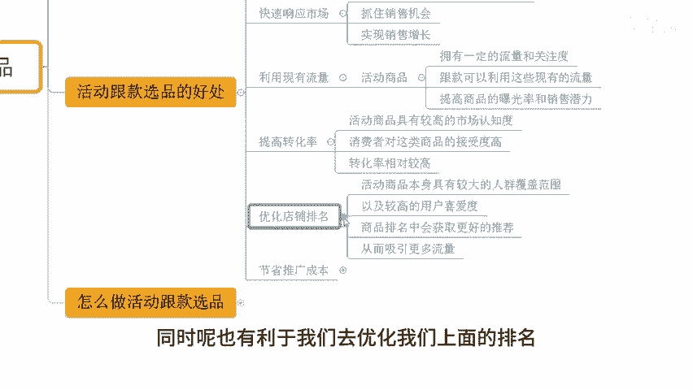

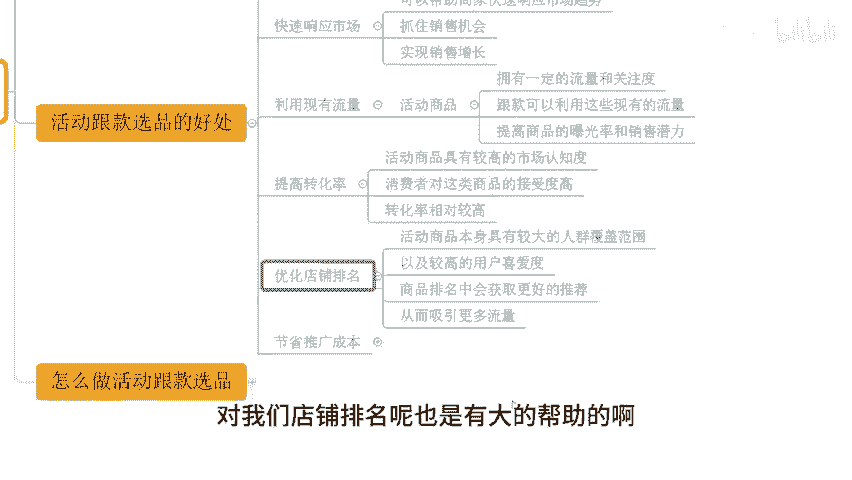

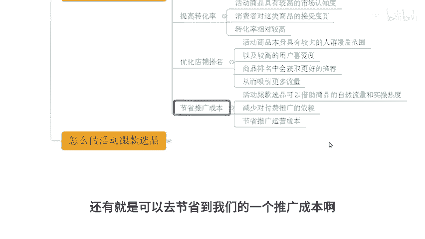

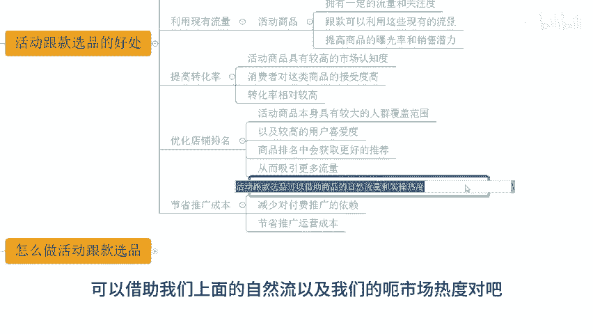

市场热度对吧？来进行产品的运营。同时呢也可以减少到我们产品呢对于活动的对于这个付费推广的一个依赖，对吧？啊，能够节省到我们的运营成本，我们可以大量的去使用到活动的方式来进行产品的一个流量获取，对不对？

通过报名活动来完成我们的平台推荐来得到更好的产品曝光。当然呢在这个过程中呢，我们可能也需要去做好更多其他一些操作。比如说我们的一些视觉方面的调整呢，营销策略方面的一些调整等等啊，都有可能啊。

那当然呢具体怎么去做O我们来看一看啊，下面的好吧，首先第一点啊，对于对标商品的选择这一块呢非常非常重要啊。我们说了啊，我们可以在我们的商家管理后台，在我们的店铺营销里面去找到爆款进价啊。

在这边呢去看到我们近期那么这些呃在性价坑位里面有到更好表现的或者较好表现的一些商品，对不对？然后呢我们去找到这些商品来进行一个销售啊，那这些商品呢它本身是通过活动渠道来进行销售的。它已经通过了。😊。

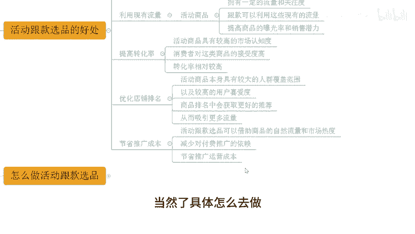

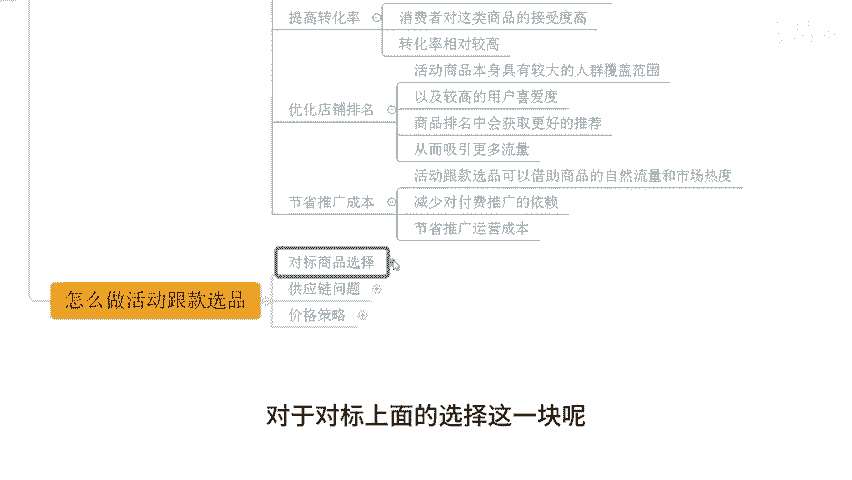

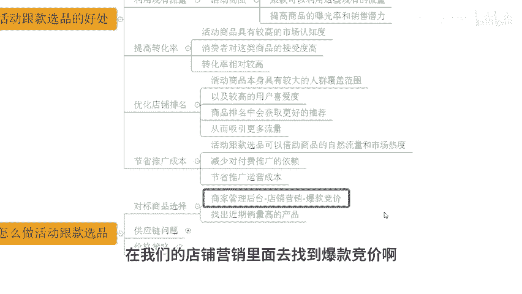

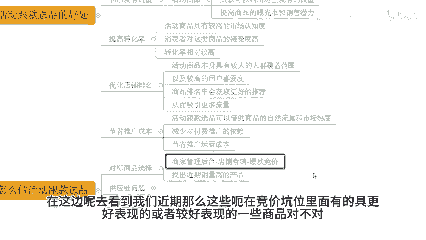

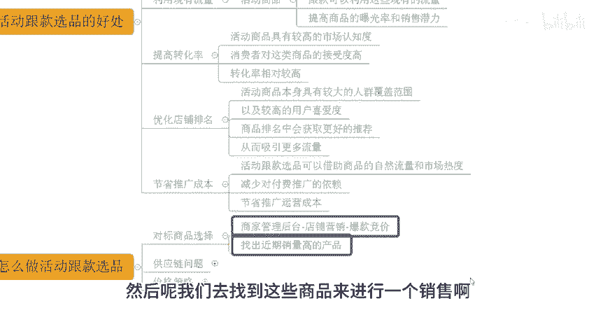

市场认证，他已经通过了我们用户的几个检验啊，所以说我们去操作呢，我也说过，对吧？它会更好一点。同时呢我们找到这种产品之后呢，一定要去解决我们供应商的问题啊。我们要去找到一些呃同款呢或者相似款的会源。

能够确保我们在发货和售后的问题上不会出现问题，不会说是有违规啊，或者有其他些原因导致我的经营策略受到影响啊，是这样子的。那么搞定这些东西之后呢，对吧？我已经确认了产品。

我也经找到了一个货源那么我们就要把我们的价格打下来，对不对？我们要制定一个有竞争力的一个价格策略，能够去充分的吸引我们消费者进行购买，并且呢我们通过竞价活动啊。

提报来完成我们的一个呃平台流量的一个获取来帮助我们形成一些更好的市场垄断的一个效果啊。那么这个时候呢自而然我们整个店铺呢就可以盘活起来，对不对？当然呢在我们整个过程中呢其实还有更多的一些操作风险啊。

那么这里呢因为我们之前是讲包款更的提到过，所以就没有去在。😊。

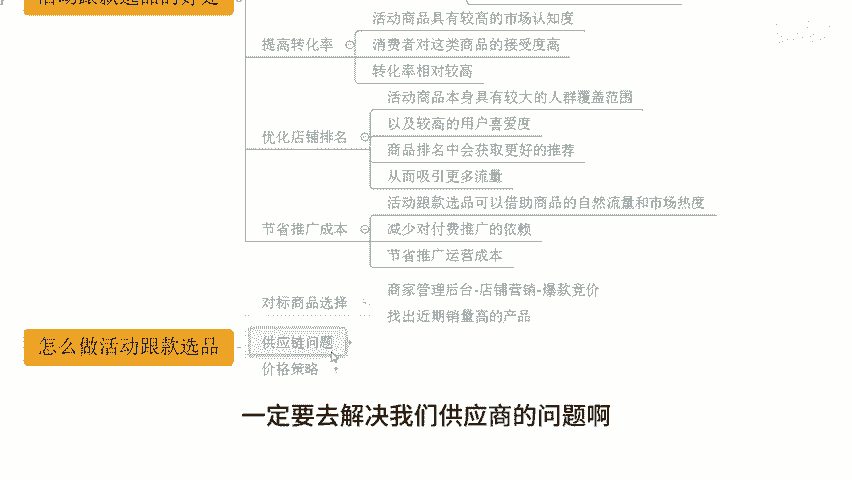

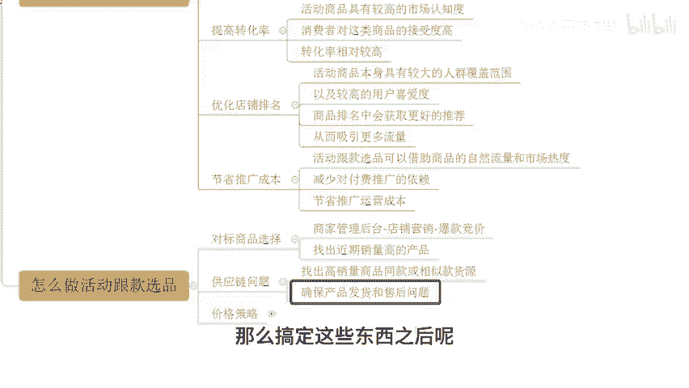

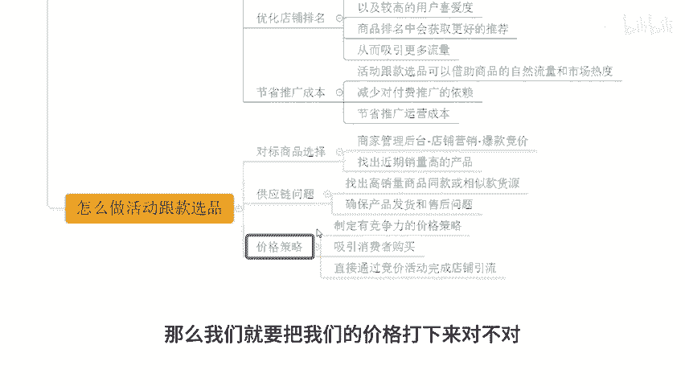

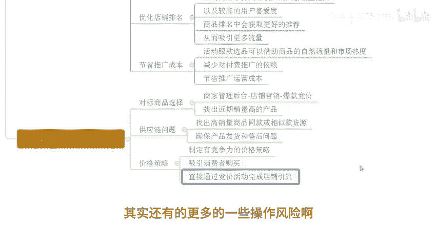

过多去讲解啊，包括像我们讲到的一些这个呃知识产权的一些违规呀，或者其他方面的一些违规呀，对吧？我们要去重点关注一下，也需要关注一下我们市场动态，对不对？还有我们这个经营的一个时间节点的一个问题。

如果说我们所选的这一个所谓的爆款商品，它已经啊处于一个呃走下坡路这样的一个市场趋势的话，那我们也要去慎重考虑，对吧？我要不要去做。如果说我去做的话，我能不能快速的去把它啊打爆去吃一波流量吃一波转化。

就直接把它给撇干净，对不对啊持干抹金之后赶紧跑路，对吧？如果说不能做到的话，ok那么这种接近我们市场尾端的一些这样的一个产品的话，就尽量不要去碰，避免造成一些库存机啊，或者是一些售后问题之后呃。

不不能处理。因为很多时候像我们去找到供应商拿货这种情况的话啊，有一个非常严重的问题，就是什么呢？当这一个产品过季了。当这个产品呢它啊这个厂家这边已经停产了。

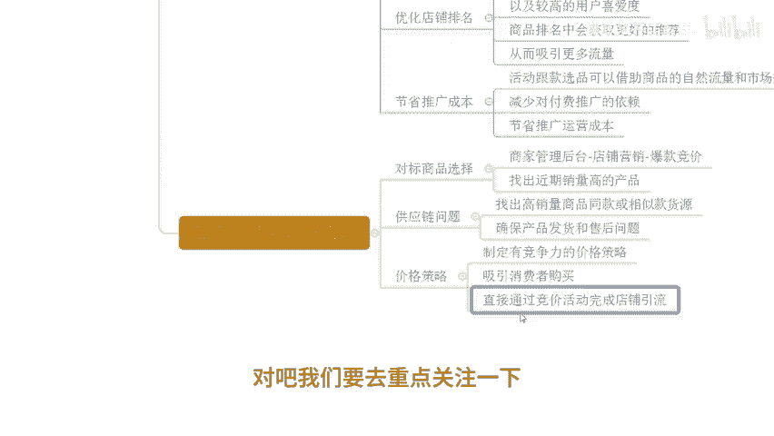

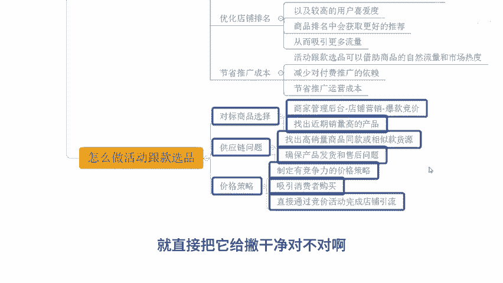

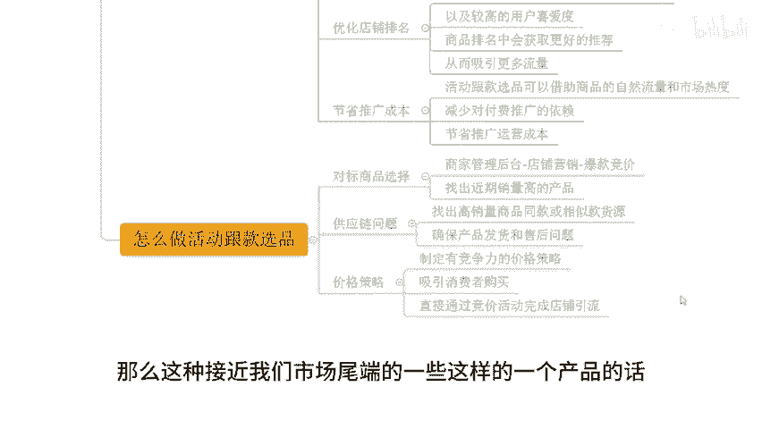

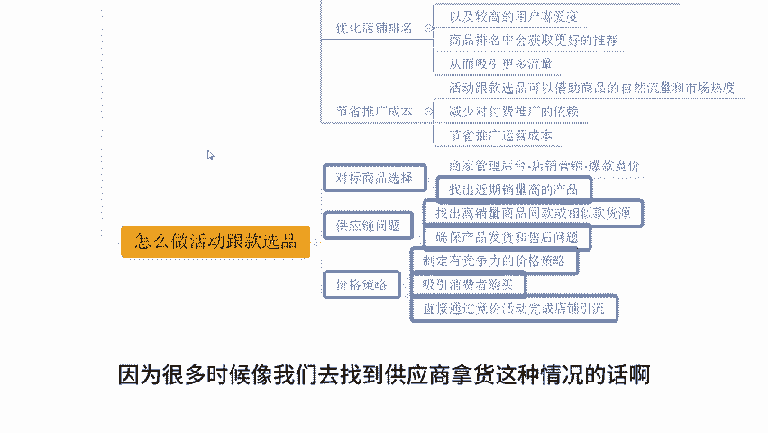

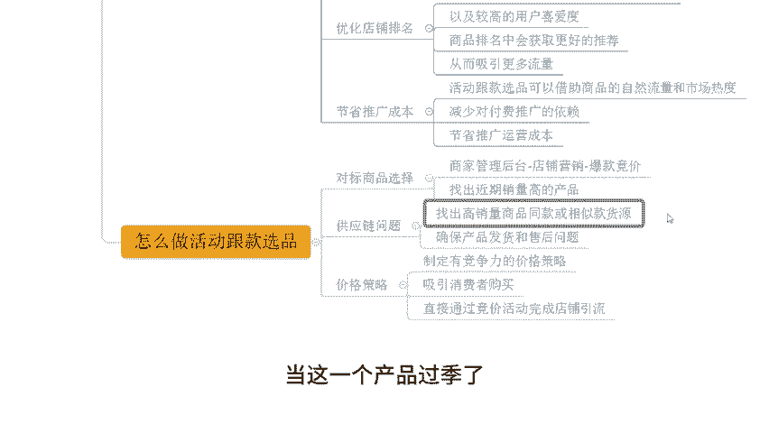

或者是不出货的时候呢，他的一个售后是不会去处理的，相当于这个售后问题呢，退出来的货呢就会砸到我们商家自己手里面，就会自己承担这个损失啊，所以这方面来讲呢，我们要重点留意他啊，O啊。

那么以上就是我们关于我们活动选品的一个方法啊。那么从哪个地方去找到这些活动商品从哪个地方去这个关注到我们后期的一个经营方向，对吧？我们都有讲到过啊，那么当然呢，对于很多的一些具体细节。

因为没有涉及到具体产品嘛，所以说没有办法讲的特别详细啊如果说大家对于这种操作呢，还有哪里不清楚的，或者什么其他店铺方面的一些问题啊，或者需要资料的，都可以找我啊，那么呃当然呢还是那句话。

如果说有时间的话，我也可以在你们一起去实操做店对吧？像这小伙伴们起快速提升运营能力让我们店铺呢达到更高水平好吧今天的分享呢结束，我们下次见各位拜拜。😊。

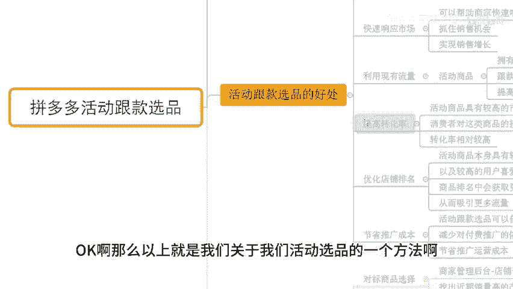

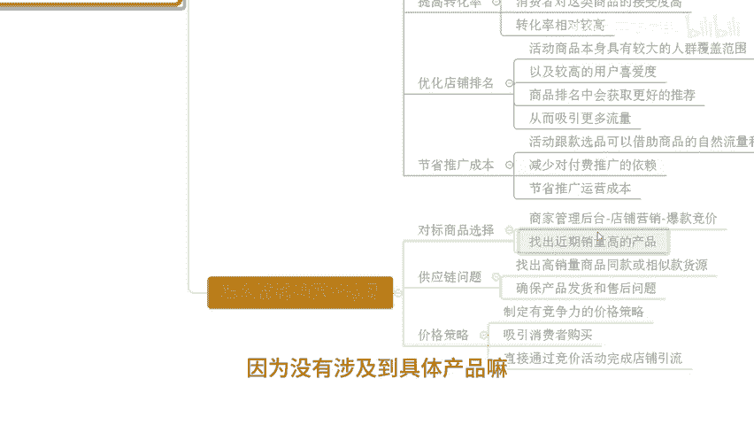

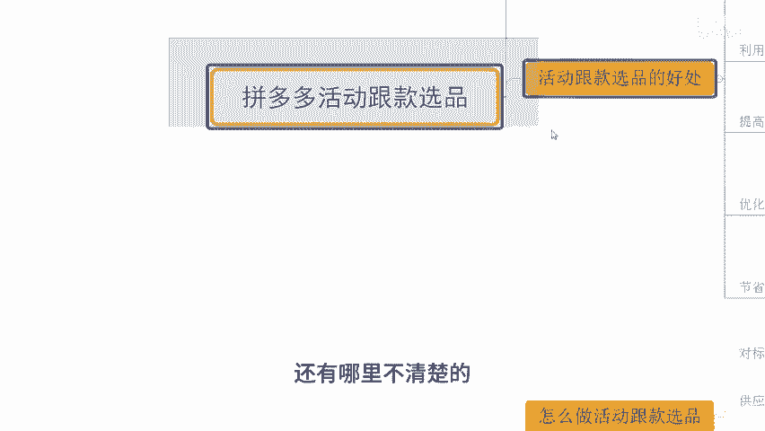

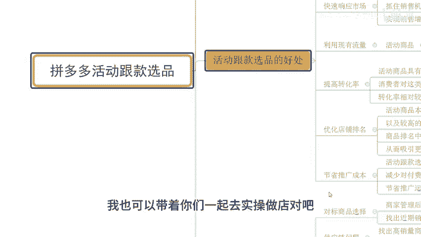

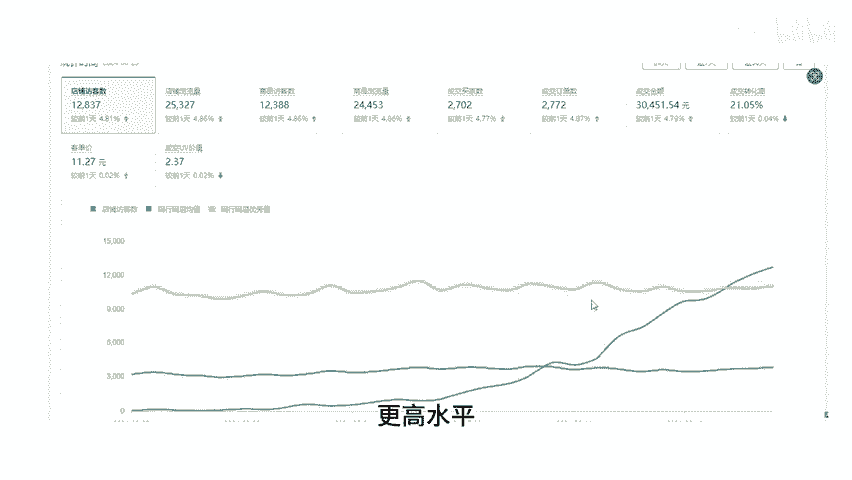

