# 拼多多开店运营-新手电商运营实战指南，B站最全拼多多零基础入门教程！拼多多运营秘籍，小白也能成电商大亨！轻松上手拼多多，拼多多新手开店赚钱攻略 - P16：16 拼多多搜索属性选品 - 拼多多开店运营- - BV1xms8eSEVs

hello大家好，我是谢楼。今天给大家分享的内容呢是我们多多店铺运营1种选品策略中的搜索属性选品的方法啊。在分享之前呢，还是老规矩先给大家看一下近期跟小伙伴他们的店铺数据好吧。

可以看到像这个店铺呢原的访客呢并不多，对吧？只有几百个1千0不到啊，那么跟着实之后呢也是啊通过不断的优化啊，通过我们产品结构的优化，通过我们上品SQ的优化，通过我们产品价格定位的优化等等啊。

进行不断的调整，对不对？访客呢也从最开始的100不到啊，那么成长到后期呢一天100个访客一天订单呢做到了1700多单转化率呢11。77啊，还有像这个店铺原本访客呢在5000左右对？

那么也是啊完成我们优化之后呢不断的调整，对不对？那么访客也在不断增长，后面的话一天访客做到了2000一天的订单呢是5100多单转化率呢做到了17。94啊。

当然呢除了这种有数据，有基础的店铺之外呢，还会的些这种啊零访客的新店啊，可以看到啊，原本呢是没有有数据的对吧？一个零访客的店铺啊，那么跟着实操之后呢，整个店铺也在不断的优化提升，访客也在不断增长啊。

后面的一天访客做到100天订单2700多单转化率呢21。05啊，所以说不管是这种有店铺数据的也好，还是说这种零访客的新店啊，跟着实操呢其实都是能够得到一个提升的。而这些店铺呢也都是通过自然的方式操作的。

如果说你想通过自的方式来操作店铺。如果你知道自然流怎么去提升店铺数据建议可以仔细观看我分享视频好吧。那么店铺运呢对于我们大多数小伙伴来讲，尤其是对新的小白来话，会有很多很多的困难啊。

如果说你有店铺这方面的问题啊，或者有需要资料的呀，以找我有时间的话，我也可以带你一起去实操做店，这小伙伴一一起快速提升运营能力我们店铺数据呢达到更高水平好吧那么所谓的搜。😊。

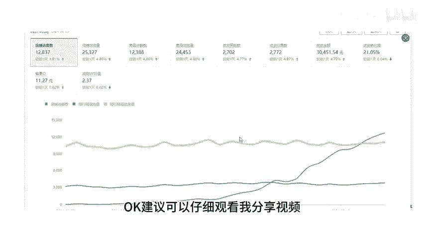

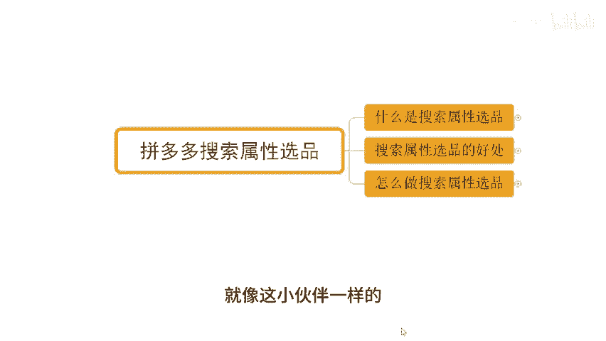

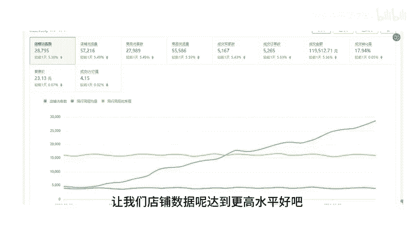

属性选品到底是什么呢？对吧？这个东西我们搞清楚啊，如果搞不清楚这个东西没法进行，对吧？我们来可以看一下啊，其实收入属性选品呢就是通过我们平台用户的一个售索行为。

根据我们用户搜索结果来确定潜力商品的一个属性，并且呢针对性的去找到这些具备潜力商品属性的产品呢进行一个选品运营啊，就这么简单啊。那么通过这样的方式呢，我们可以减少一些试错啊。

能够去更好的去找到一些这个市场热销的产品，并且呢进行这个运营啊。那么呃搜入属性选品呢，它具体的好处有哪些呢？我们来展开说一说啊。首先第一个点。😊。

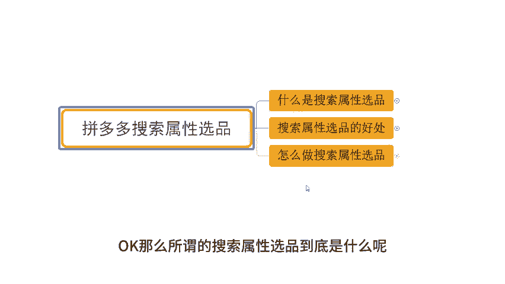

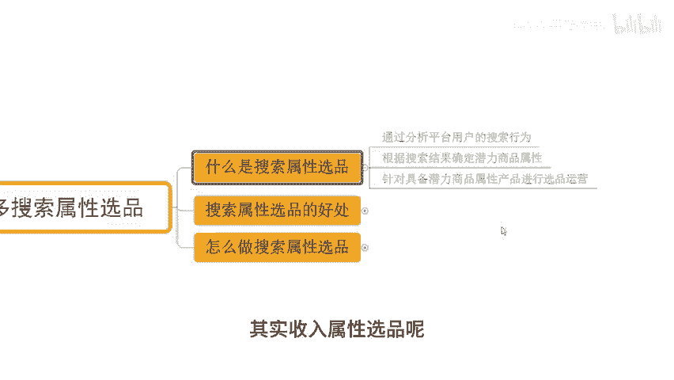

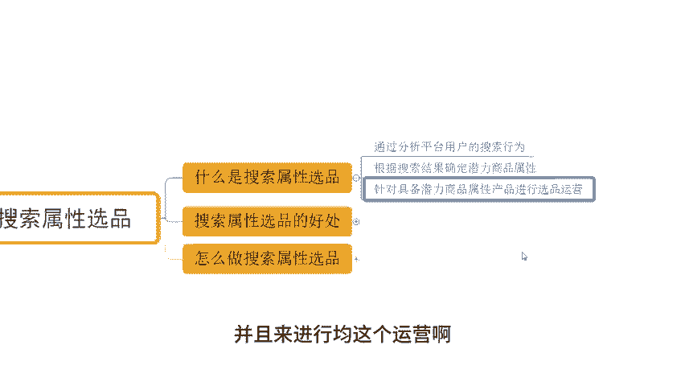

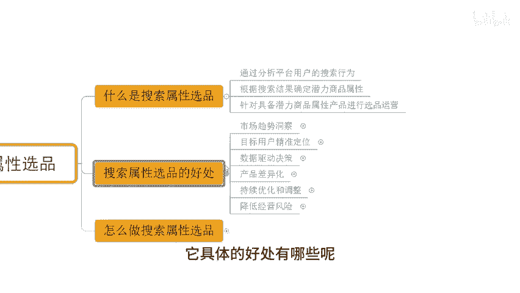

那么我们可以做到我们很好的一个市场趋势的一个洞察，对不对？因为我们可以分析我们用户的关键词和我们的关键词的一个行为，对吧？可以观察我们市场趋势以及我们消费者的一个需求变化。

当我们用户对某个产品有需求的时候呢，他去完成搜索这个时候呢，一定会形成一个搜索的一个关键词。而这关键词呢往往就代表了后期我们平台商品的一个风向标对吧？那比如说某些产品一开始时候没有太多人去搜索。

但是有的时候呢突然会有到一大部分开始搜入这个词的时候呢，O那么后续可能这个词它所代表的某种属性，他所代表的背后的产品呢，就会形成一个所谓的爆款，而这个东西如果说现在当下是没有人在是使用。

或者是没有人在销售的时候O那对于我们来说就是一个很好的机会啊。那么再一个是我们可以清晰的去定位好我们目标用户群体的一个定位啊，那么包括说我们可以了解清楚我们用户的一个基本特征，对吧？

包括说他的年龄啊、性别呀地域呀，包括兴趣。

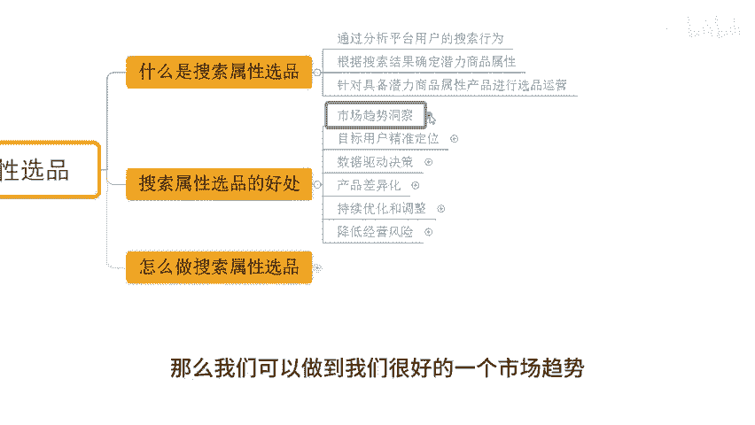

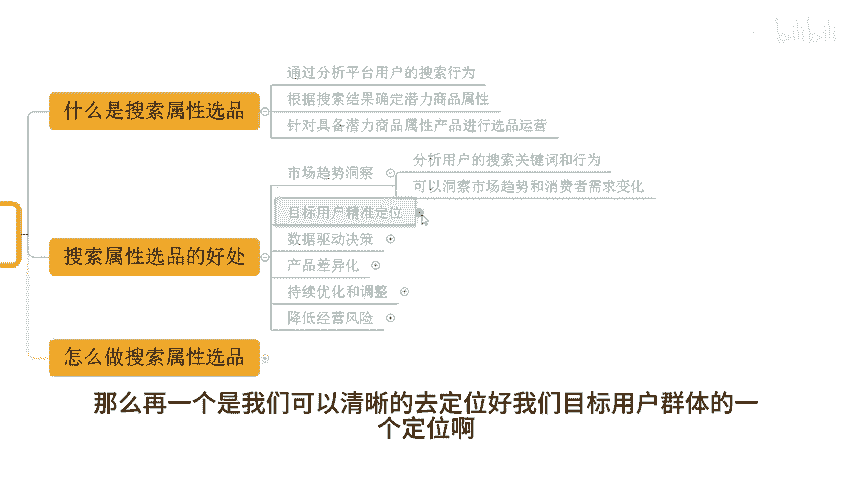

爱好啊等等啊。那么通过这些呢来帮助我们后期呢能够更好的找到一些符合消费者需求的一些产品啊，并且呢我们可以去完成我们数据化的一个决策啊。

那我们可以利用到一些这个平台提供的一些数据分析的一个工具啊来进行我们的分析，来帮助我们商家来基于我们实际数据做出一些更加科学的一个选品策略啊，那么同时呢在后期经营的时候呢，也会有到更加清晰的方向。

不至于说不知道做什么。那同时呢我们在操作的时候呢，也要去注意好一些产品差异化啊，虽然说我们通过属性选品呢找到的产品呢，可能更多是属于一些潜力爆款，但是呢我们要注意啊。

同样都是这个属性的产品可能会有到各种各样的产品，对不对？所以在这过程中呢，我们要注重到我们产品的一个差异化，以及我们自身特点的一个提炼。

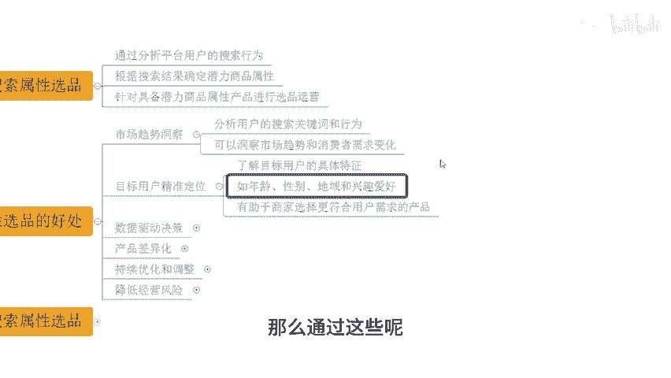

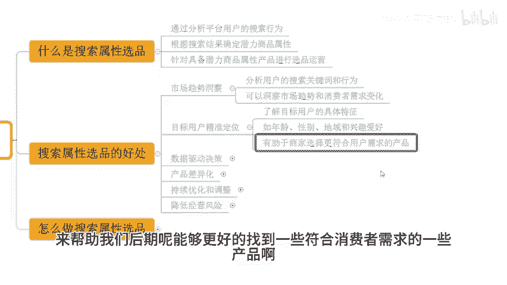

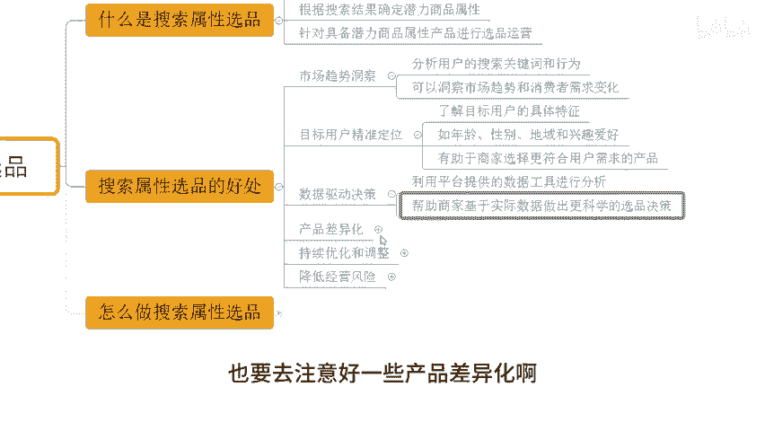

那具备我们独特的一个呃且具备竞争优势的一个产品的话，O那么这个时候呢对于当下的一个竞争环境呢，我们的优势就会更大。我们也能够更加好的去提高我们产品的一个市场竞争力啊。

能够完成对于这个市场的一个把控或者抢占啊。那同时呢我们要去持续的优化和调整我们店铺啊，那么它是有利于我们店铺不断的变得更加优秀的。因为我们在针对到搜索分析的时候，对不对？我们是不断的去操作的。

而且市场的一个搜索情况呢，也是实施动态变化的对吧？包括我们市场的情况，包括用户情况，在我们关键词的一个呃数据变化过程中呢也是不断的去呈现出来的。所以说我们可以持续的去根据我们用户的变化。

根据我们搜索的一个关键词属性的一个变化，来去优化我们选品策略。同时呢来保持我们店铺呢当下所发布的这些所谓的新品都能够去更好的具备到更大的市场需求体量，能够让我们店铺呢变得更加有活力，更加有竞争力。

能够有更好的市场覆盖率。

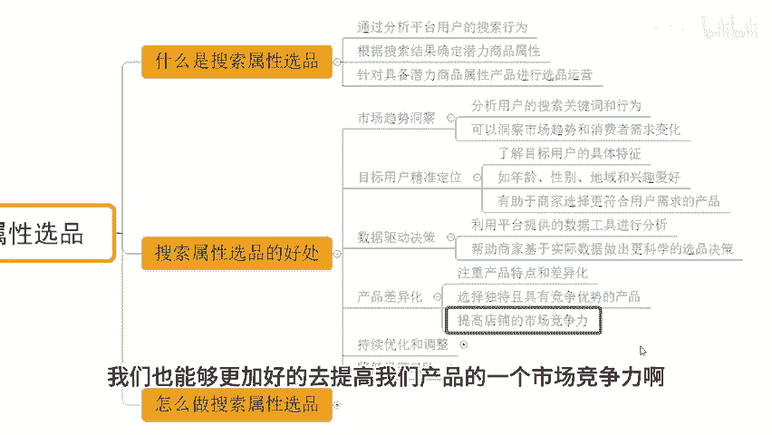

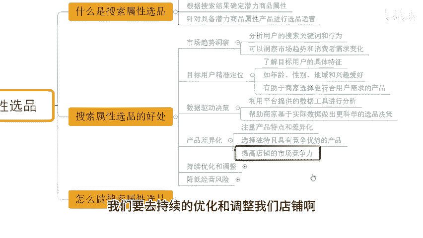

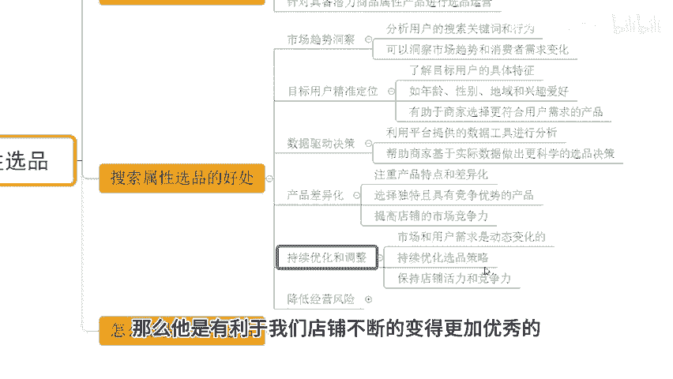

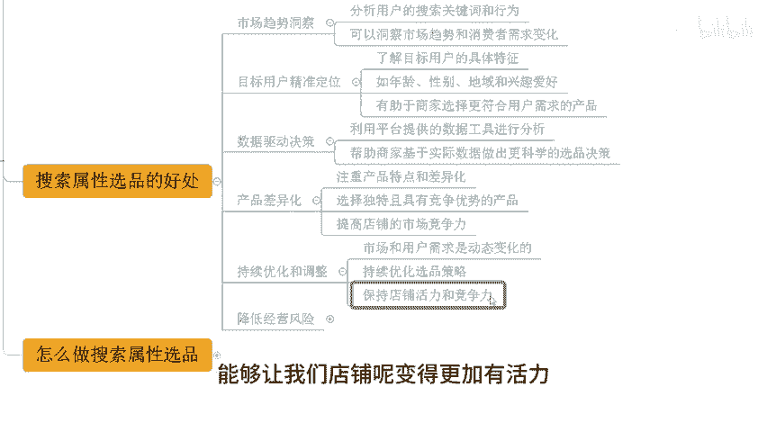

好吧，同时呢我们的收入数据选品的话，也可以帮我们完成一个操作，就是降低我们的经营风险啊。什么意思呢？来看一下啊，首先呢如果说我们的选品呢是盲目的对吧？我不清楚我的产品是啊有市场还是没有市场的。

那么这个时候可能我会在经营过程中造成大量的浪费啊，这是一方面，另外一方面呢，可能在我们的这个店铺运营的一些投入上面呢，也会有到一个啊比较大的一个风险，对不对？

所以说我们通过这样的一个完整的收入属性的分析呢，也可以明确确定好我们用户的一个需求方向。那么减少到我们这一块的一个经营风险啊，同时呢一个提高我们销售的一个概率啊，是这样子的，那么到底说了这么多，对吧？

怎么去做我们的收入数据一个属性选品呢，来看一下。

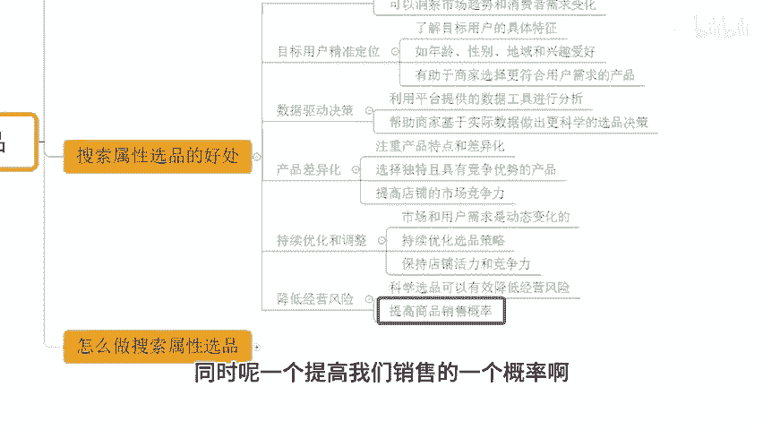

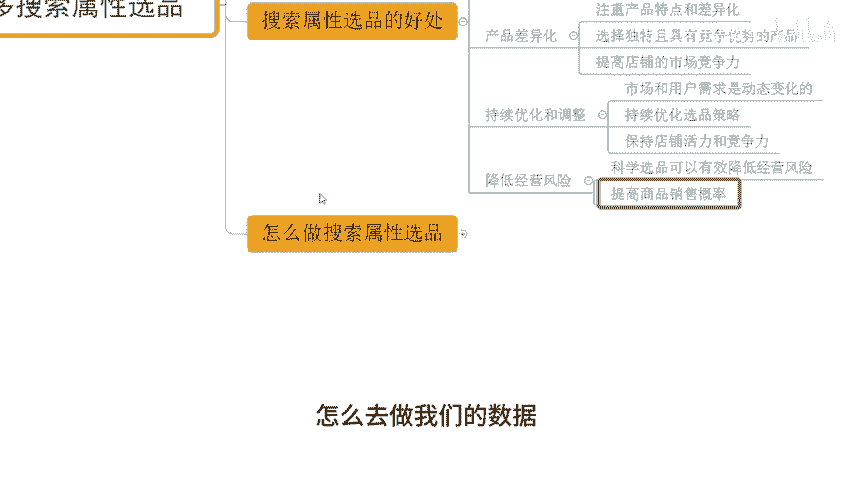

首先第一件事情呢是搜索数据的一个分析啊，我们可以去收集分析我们用户在呃搜索框中输入的一些关键词数据啊，也可以了解到我们平时用户的一个摄入习惯和热门的摄入趋势，对吧？把这个搞清楚搞清楚之后呢。

我们再进行一个属性的一个筛选啊。那我们要根据我们用户的搜索习惯呢来识别出我们关键词中的一个属性词啊，比如说我们的一些品牌呀、材质啊、功效啊，价格区间那等等啊。

那么这些属性呢都可以作为我们后期产品选品的一个重要依据啊。同时呢我们在整个分析过程中呢，也要去确定好我们市场的缺口啊，对吧？这是非常重要一个点啊，有些时候呢我们市场上呢有有些商品它是供应不足的。

比如说有些产品呢它的一个属性呢，摄入需求比较高。但这个对应属性的商品呢在市场上上确实比较少的。那么这种情况呢就代表说我们这个产品呢它的一个缺口比较大啊，它还没有说有足够的商品来满足用户的需求。

那我们去经营的话，我们的经营。

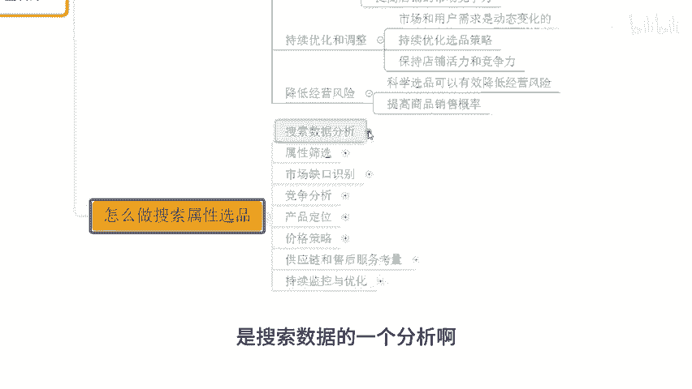

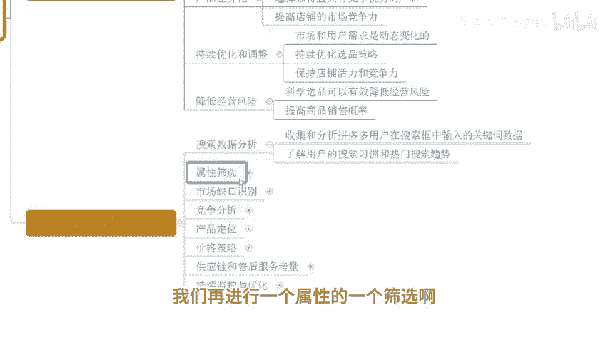

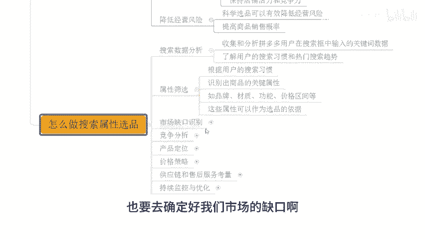

风险就会比较低。我们市场的一个容量就会比较大啊，我们的产品的一个呃竞争力可能会比较强啊OK同时呢我们去操作的时候呢，也要去做好一个竞争分析啊，我要了解清楚我们竞争对手它的产品属性是什么。

了解清楚他们的强项和弱点。那么如果说我们这个市场上有空白点的话，那么也要去更好的去抢占它。那么这个也是我们刚刚讲的市场缺口的一个重要的一个分析方式，对不对？那么再来呢就是我们商品的一个定价了啊。

根据我们产品的一个呃属性的一个分析的一个结果，对不对？那我们的呃新品的一个选品啊啊或者是呃现有商品的一个产品线的一个规划呀，我们都可以做到更加精准。同时呢我们在进行一个。

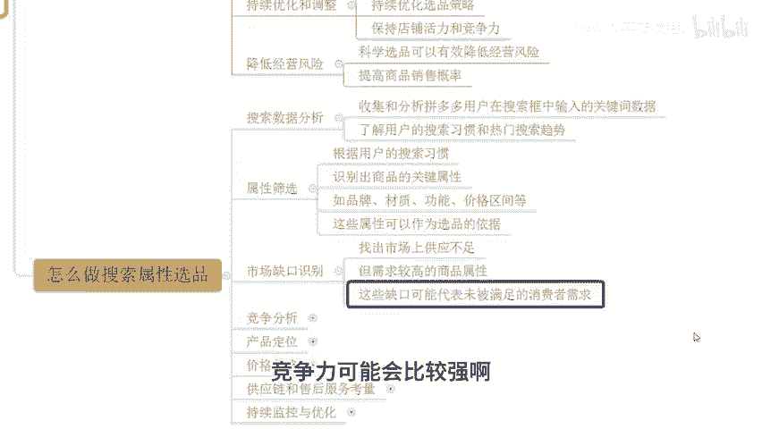

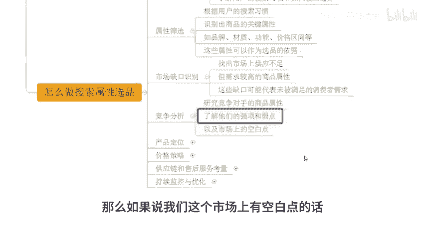

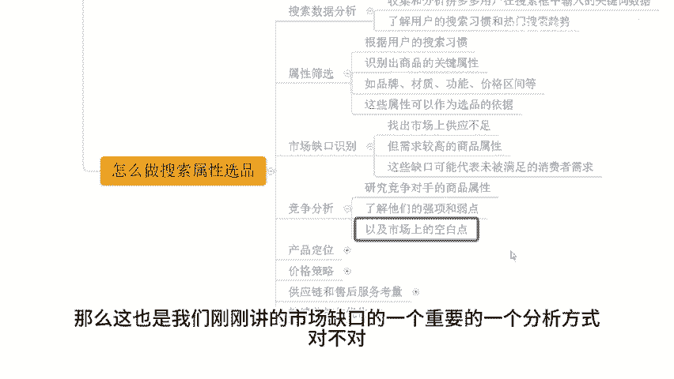

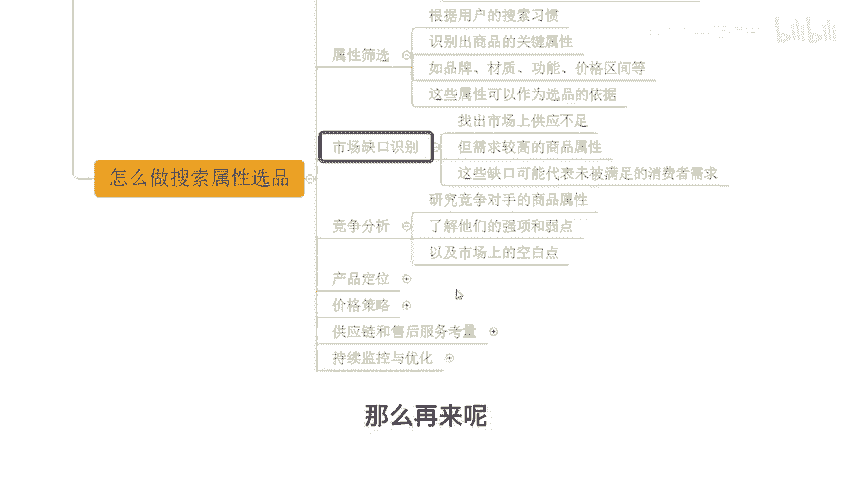

商品的用户啊进行定位的时候呢，也可以有到一个更加清晰的一个啊需求的一个定位，对不对？完成我们后期进行的一个呃确定对吧？同时呢我们在价格策略方面的话，OK的。

我们也可以根据我们售后属性的一个分析来找到对应属性的一个价格敏感度啊，那么确定好一个合理的价格制定的一个策略，对不对？来完成我们消费的一个目标获取啊啊，比如说有的产品可能说啊当前这个属性呢。

它就是有更高可能价的人会喜欢它。

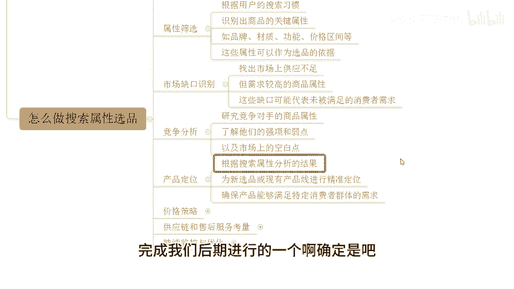

反而地核单的商品呢没有什么太大的市场体量，对吧？所以这种情况下呢，我们去做一个高客单的商品呢，也可以帮我们提高我们的一个利容空间，对不对啊，都是都是有这种情况的啊。

那么再一个就是我们供应链和我们售后服务的一个考量啊。这个东西也是非常非常重要的啊。那我们要考虑清楚我们供应链的稳定性，以及我们售后的一个保障啊。

避免说因为我们供货问题和售后纠纷呢来导致的我们店铺的问题啊，这样呢可以提高我们用户的一个满意度，能够确保我们产品啊能够支撑我们的一个市场需求，并且呢能够保证我们产品的一个市场能力和库能管理。

以及我们的物流配送等等啊，都能满足的话，那我们整个经营呢在后期呢能够没有后顾之忧啊，同时呢我们要持续的去关注监控来进行一个优化啊，那我们要去关注我们市场的一个变化，包括说我们市场的一个反馈。

包括我们商品数据对吧？那如果说当前我们商品呢是有到一个很好市场反馈评价也很好销售数据也很好那我们可以去保持它。

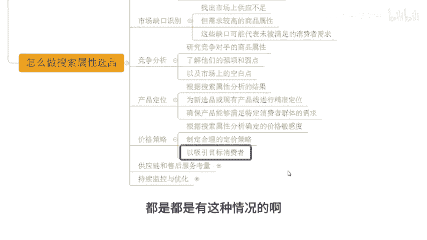

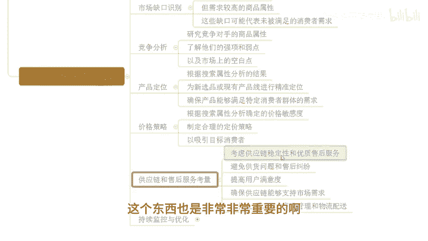

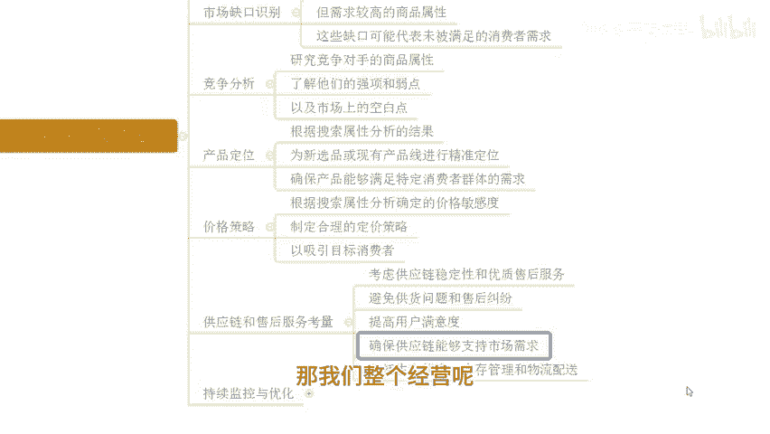

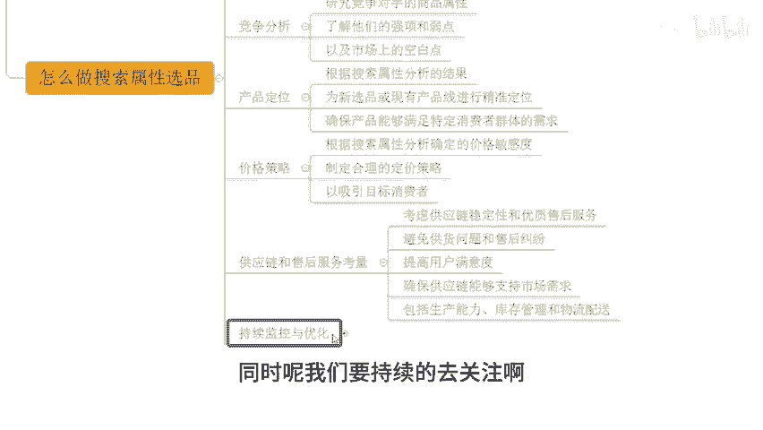

但是如果一旦出现一些是销售的一个疲软现象，或者一些其他不良反馈的话，我们要及时调整来优化我们产品的结构，优化我们产品的一些这个规划，保证我们后期呢能够有到更多的产品呢来支撑我们店铺数据，好吧。OK啊。

那么以上呢就是我们关于我们收入属性选品的一个分享啊。当然呢还是那句话这样的一个分享呢可能更多是呃基于我们这个思维逻辑的一个展开。因为没有办法去涉及到具体某一个产品，确实我们每个人做的产品都不一样。

产品太多了。所以说我没有办法去详细的说，具体某一个产品是什么样子的啊。所以这点呢也希望大家能够理解一下。那么如果说对于属性分析选品的一个策略，有不清楚的，或者有什么其他店铺中的方面问题，有需要店铺。

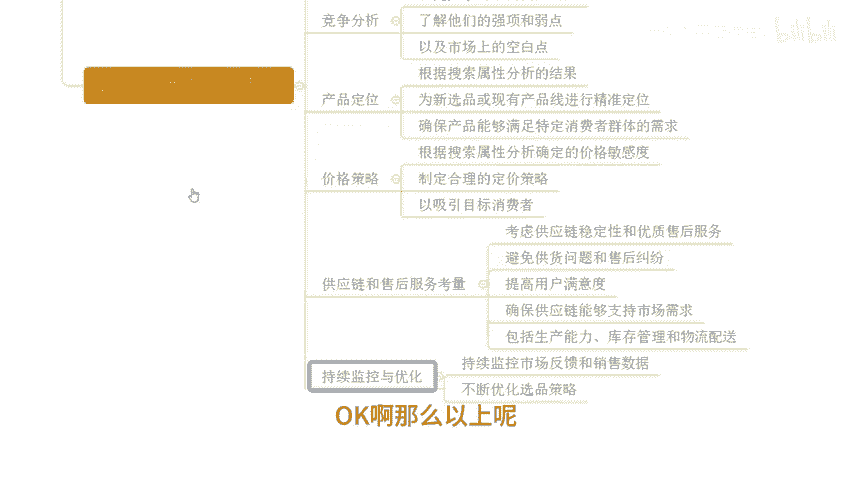

有需要店铺的一些呃这个运营资料的OK的啊，也可以找我啊。那么当然呢还是那句话，有时间的话，我可以带着你一起去实操坐店，对吧？就像这些小伙伴一样呢，我们一起有到一个更好的操作方法。

能够让我们店铺呢达到更高水平。好吧。OK今天的分享呢就到这里，我们下次再见。各位，拜拜。😊。

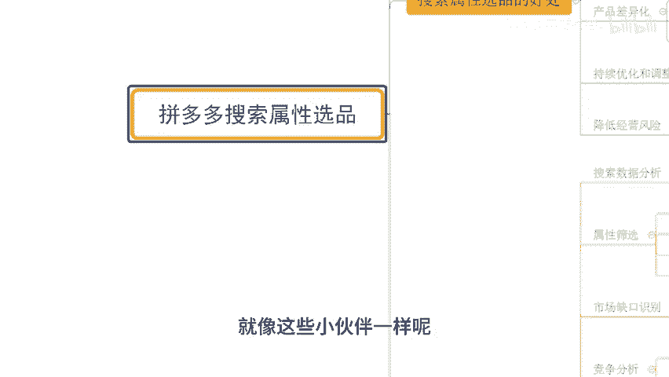

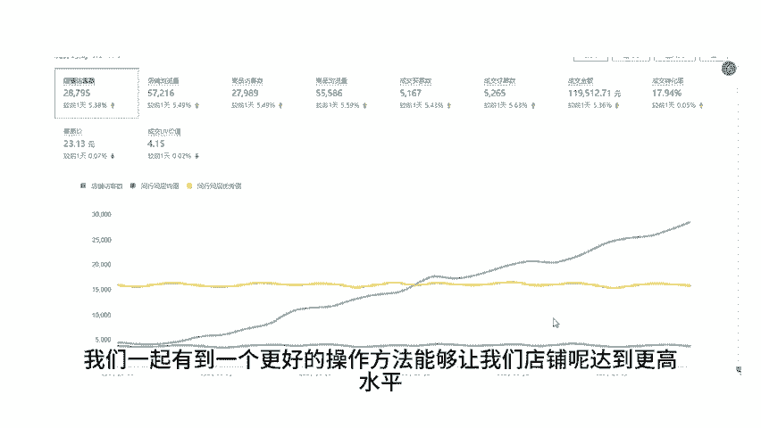