# 拼多多开店运营-新手电商运营实战指南，B站最全拼多多零基础入门教程！拼多多运营秘籍，小白也能成电商大亨！轻松上手拼多多，拼多多新手开店赚钱攻略 - P17：017 拼多多季节节日选品 - 拼多多开店运营- - BV1xms8eSEVs

hello大家好，我是谢楼。那么今天给大家分享的内容呢是我们拼多多店铺运营1种选品策略中的季节节日选品方法啊。在分享之前呢，还有老规矩先给大家看一下近期跟着时尚小伙伴他们的店铺数据，好吧。

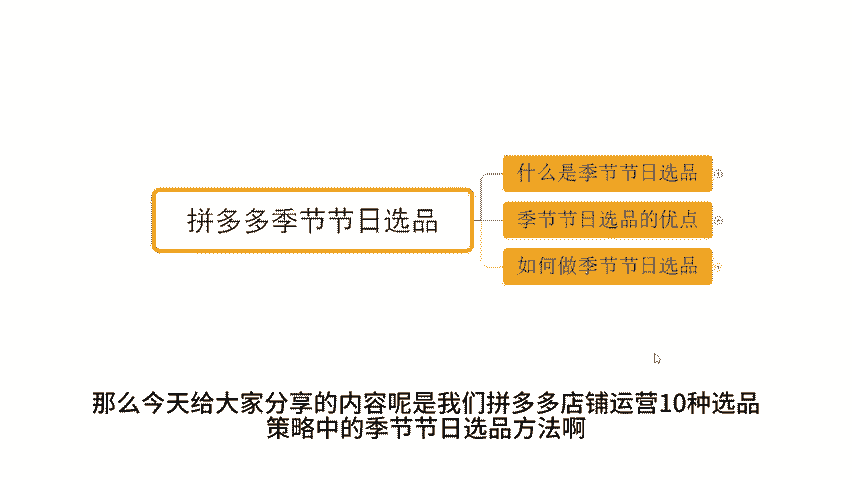

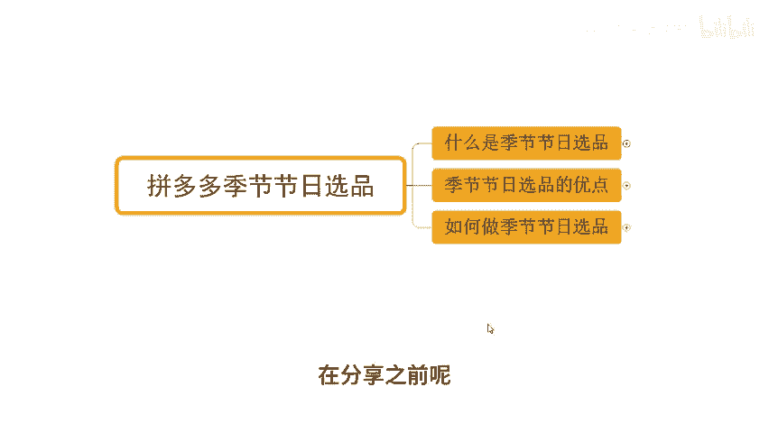

可以看到啊，像这个店铺原本的访客呢并不多啊，只有几百个访客，一0不到啊。那么跟着实施之后呢，也是不断的进行了产品的优化，对吧？进行了我们数据的一个提升。到后期的话，那么访客不断提升过程中呢。

做到了一天访客接近100啊，14000多啊。那么一天订单呢是1700多单，转化率呢11。77啊，还有像这个店铺可以看到是一个零访客的新店来的对不？最少是没有任何数据的一个店铺。那么通过市场分析。

通过竞争分析完成了报款明之后呢，不断的进行我们商品优化啊，可以看到访客也在不断的增长啊，到后期的话，一天访客呢也做到了12000啊，那么一天订单呢是2700多单，转化率呢做到了21。05%，非常不错。

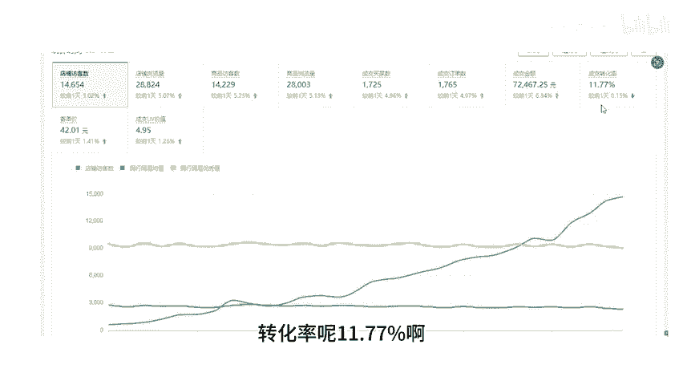

当然呢除了像这种啊有一点记录数据的，有一些这个呃零访客的新店，还有像一些店铺呢达到一定水准之后，对吧？没有办法突破。那么跟着时操也可以提升。像这个店铺可以看到啊，原访客呢在5000多500左右的样子。

对不对？那么陷入了一个瓶颈啊，没有办法提升。那么时呢，我们也针对到产品的这个布局Q的一个调整以及我们价格定位的一调整啊，完成了后期的优化，可以看到访客也在不断的增长啊。

到后面的话一天访客呢做到了28000。那么一天订单呢做到了510多单转化率呢做到17。94啊，所以说不管是这种有数据的店铺呀，又或者是这种达到一定瓶颈的店铺，又或是些零访客新店啊。

实操也都能到个提升的啊而这些店铺呢也都是通过自然流的方式来操作的。如果说你想知道怎么通过自流来提升店铺数据，你想要通过自流来达成店铺的一个运营可以仔细观看我分享视频吧那么店铺运营呢对于我们大多数人来讲。

尤其对于。😊。

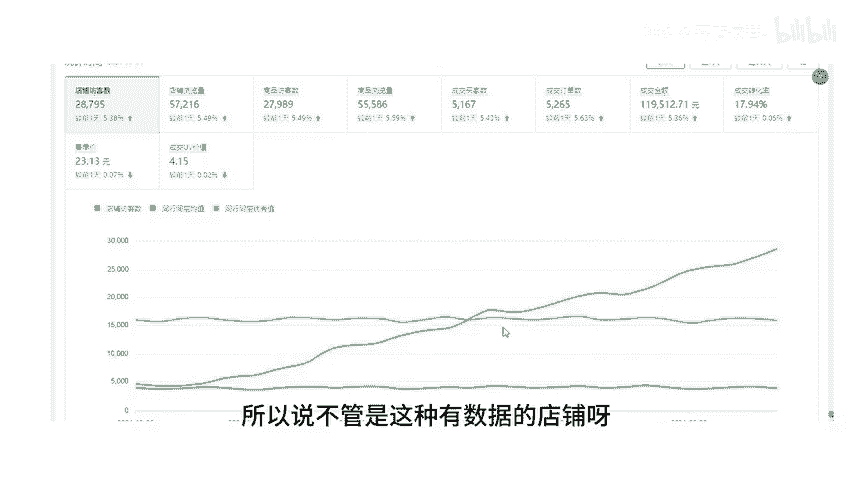

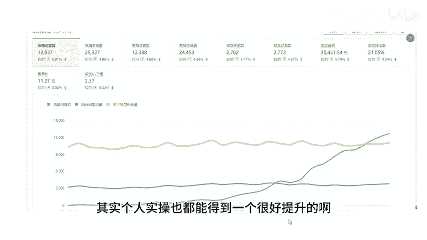

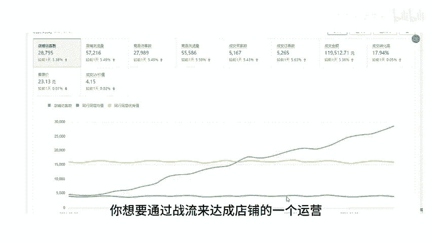

小白讲呢会有到很多很多的困难啊，这很正常。如果说你在店铺操作过程中呢，有遇到问题的，或者有需要运营资料的，O的，可以找我啊。有时间的话，我也可以带着你一起去实操坐店啊。就像这些小伙伴一样呢。

我们一起快速提升运营能力，让我们店铺呢达到更高水平，好不？O那么到底什么是我们的季节节日选品呢，这个东西呢可能对于完全不懂的小伙伴来讲会比较懵，对吧？但是实际上通过字面意思呢，我们其实很好理解的。

所谓的季节节日选品呢，就是说我们通过这个特定的季节或者节日的特性呢来选择与之相关的商品进行销售啊，那么受到我们这个季节节日影响的一个呃这个情况呢。

我们当下呢一些应季的商品呢也都会变得有到很好的一个市场需求，能够具有到一个很好的市场的一个销量啊，所以这个时候呢我们去操作这种产品，或者我们提前去预备操作这种产品呢，往往是可以达到一个更好的效果的。

好吧。那么季节节日选品。😊。

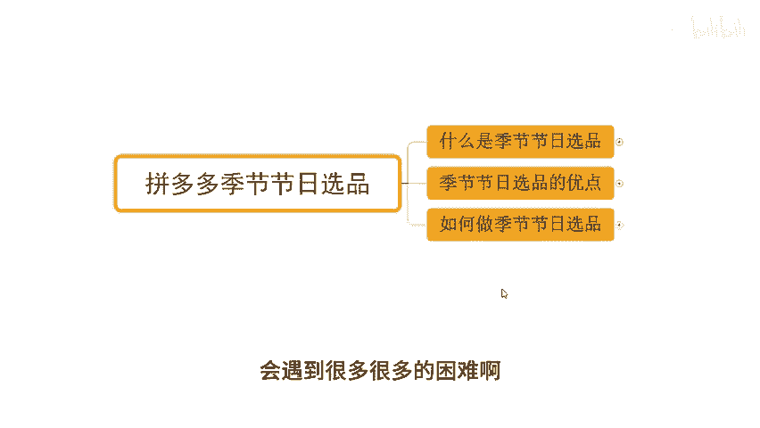

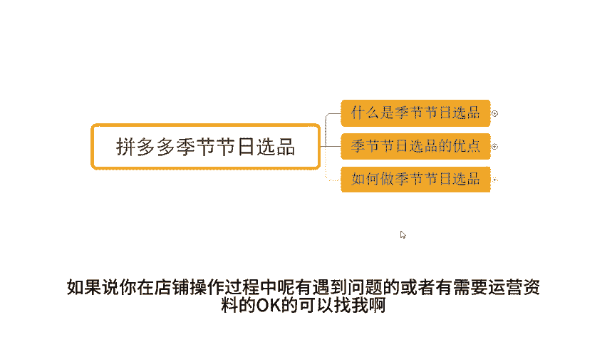

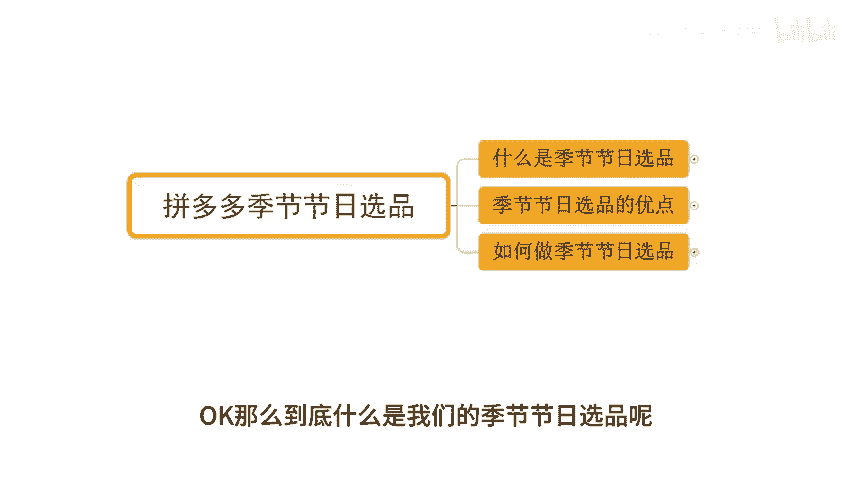

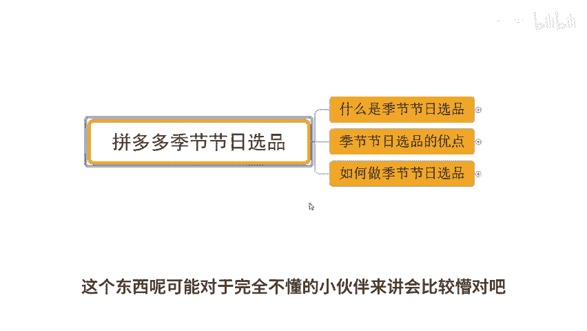

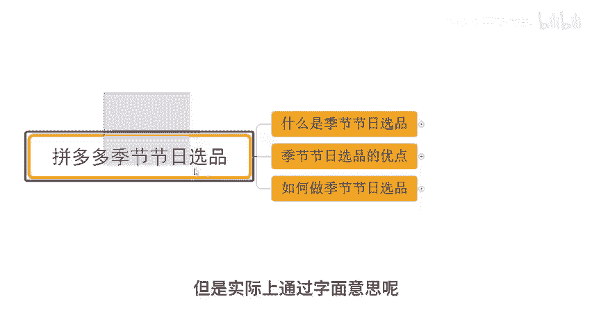

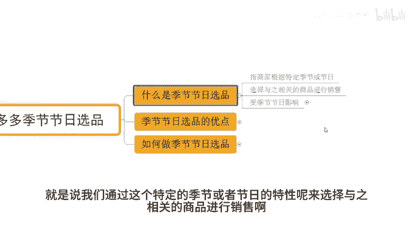

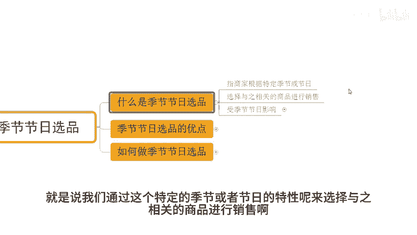

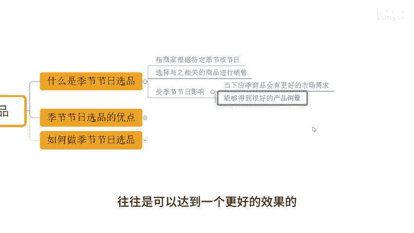

那他又有哪些的具体的优点呢？来我们看一看哈。首先第一点。

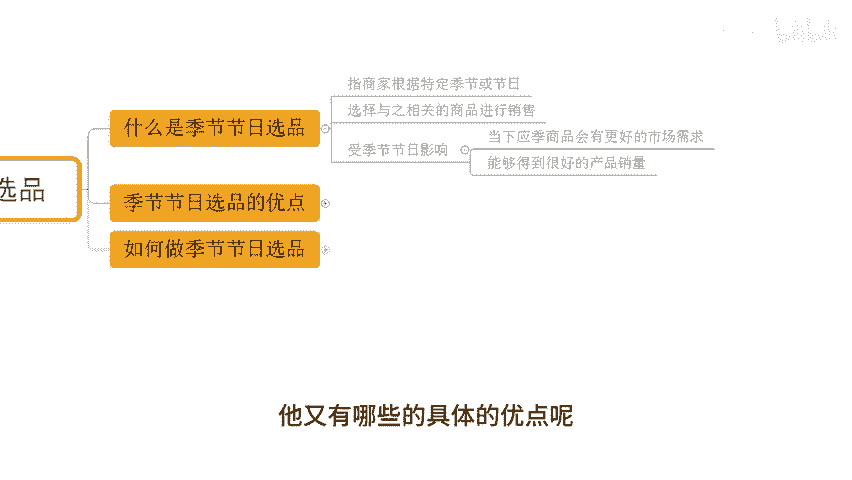

市场需求会变高啊。那么在特定的季节或者节日期间呢，消费者对于某些产品的需求呢会有明显的一个增加啊，这个是我们呃不得不去重点去了解的啊，那么这个东西呢，就比如说啊像我们冬天呢会有到一些保暖衣服，对吧？

夏天呢会有到一些清凉的饮品，对吧？包括像我们一些节日的时候呢，会有一些装饰品对吧？比如像春节的时候呢会有春联啊，有这一个呃门神对吧？啊，有这个福字对吧？啊等等啊，啊都是一些特定的节日装饰品，对不对？

那么也都会有到一些特定的一个消费的一个需求啊，再一个呢就是我们整个的销量的一个呃机会啊，增加了啊，那么通过我们的季节性节日性的选品呢，那我们可以抓住这些消费者的一个节日的消费心理啊。

来增加我们店铺的消费的一个呃销量，以及我们的一些利润，对不对？同时呢在整个的操作过程中呢，对于我们店铺来讲，其实它是一个非常非常重要的一个环节，就是呃季节。😊。

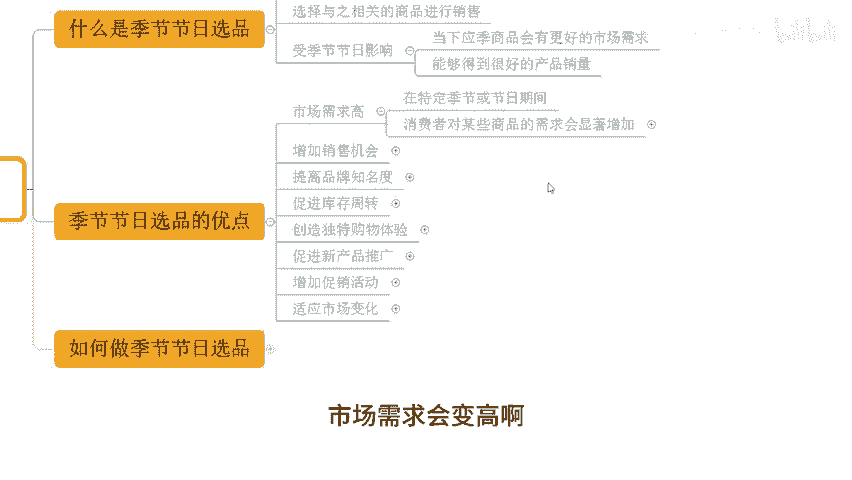

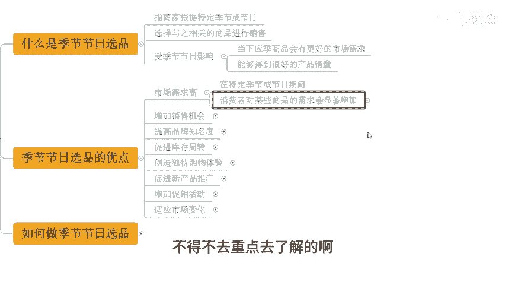

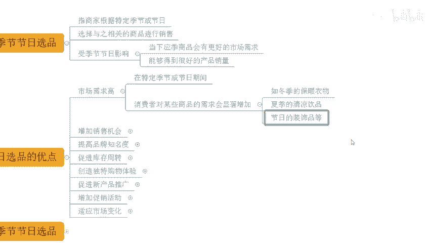

啊，和节日，那么它都是在不断的跟替，不断的跟迭的对吧？所以说一般来说它可以杜绝掉一些所谓的老链接对我们的影响啊，因为它每次换季的时候呢，其实商品会呈现出一个数据低迷的一个阶段。而这个阶段的话。

再想起报的话，那我们的基础条件其实相对来说是一样的啊，所以说这个时候呢，对于新店来讲的话，其实机会还也还是蛮大的啊。那么再来说一说啊，可以提高我们整个品牌的知名度。当然了。

这个品牌知名度呢也可以说是我们自己店铺的知名度啊。那我们通过这种节日啊，相关的商品的进营推广呢来提高我们店铺的一个与我们消费者之间的一个联系啊，来增强我们店铺或者增加我们品牌的影响力啊，是这样子的啊。

那么再一个点呢就是可以去促进我们库存的一个周转啊。那如果说我们是做一些营销商品呢，它可能消费的一个需求呢会比较固定一点，对吧？但是呢他没有说很特别的一个高峰期。但是呢一些季节性的。

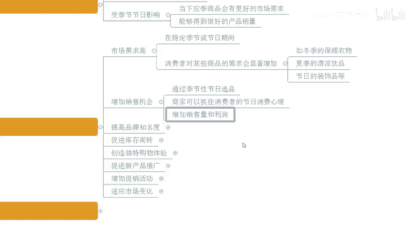

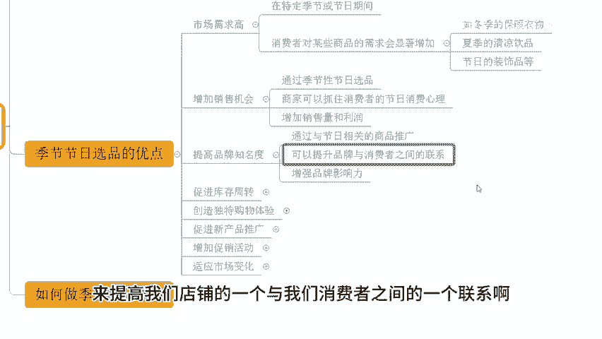

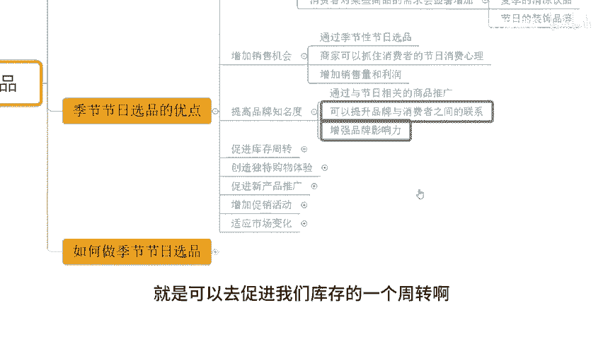

商品或者是一些节日商品呢，它的消费周期呢就会比较明显，对吧？所以说如果我们能够去很好的管理到这样的一个库存情况的话，那我们整个的周转呢也是会比较快速的。那么也可以去减少我们的库存积压啊。

那再一个呢就是我们可以创造出独特的购物体验啊。那我们的商品呢往往会有到一些季节或者是节日的一些相关的包装跟设计啊，那么这样呢可以给到我们消费者不同的一个购物体验，能够去做出一个差异化的一个营销啊。

同时呢我们可以去促进我们新品的一个推广啊，那作为节日啊，作为我们换季的商品呢，新品推广呢都是有到一个很好的时机的，对不对？因为我们受到这种节日受到这个换季的影响呢，我们整个商品的一个氛围。

或者是我们需求会不断放大。那么这个时候呢我们消费的一个需求呢，还有它的注意力就会比较容易被吸引过来啊，同时呢我们可以增加我们的一些。😊。

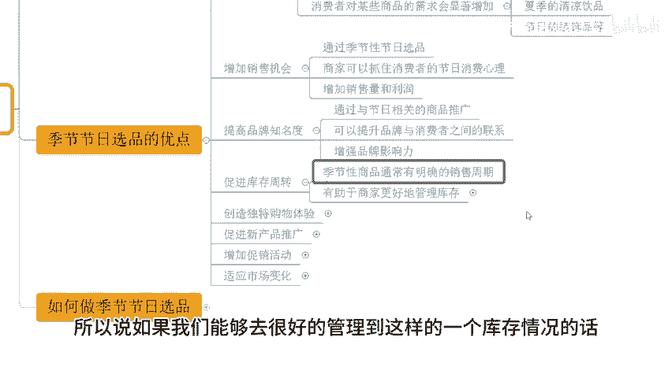

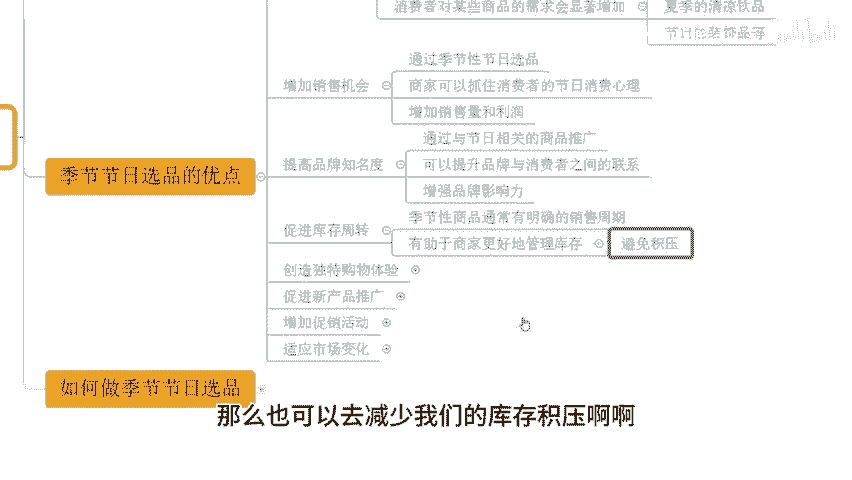

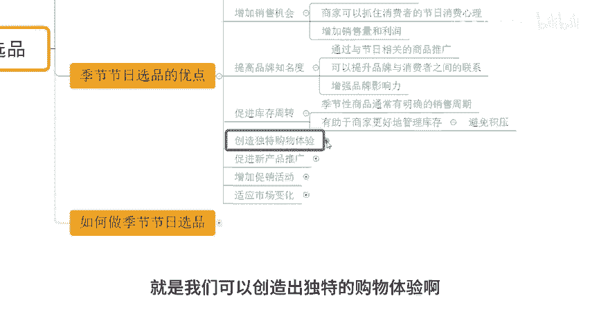

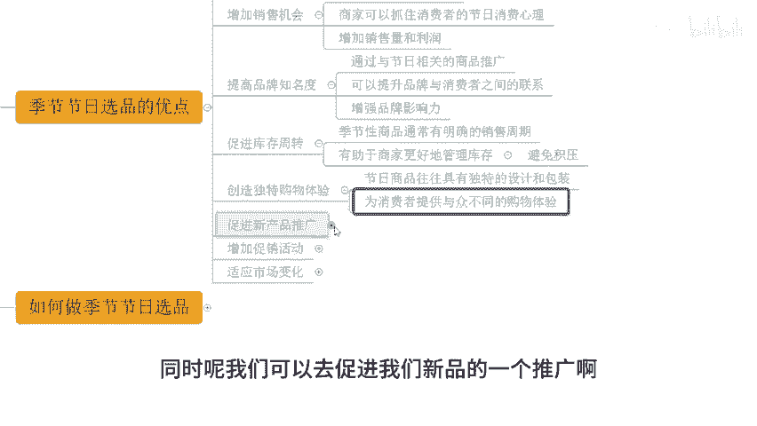

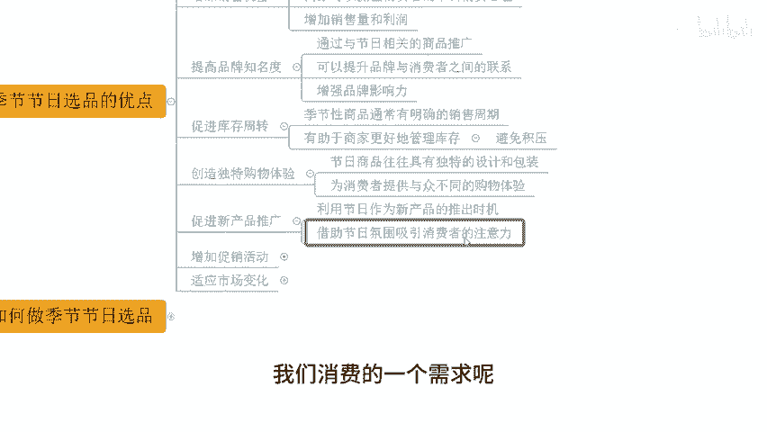

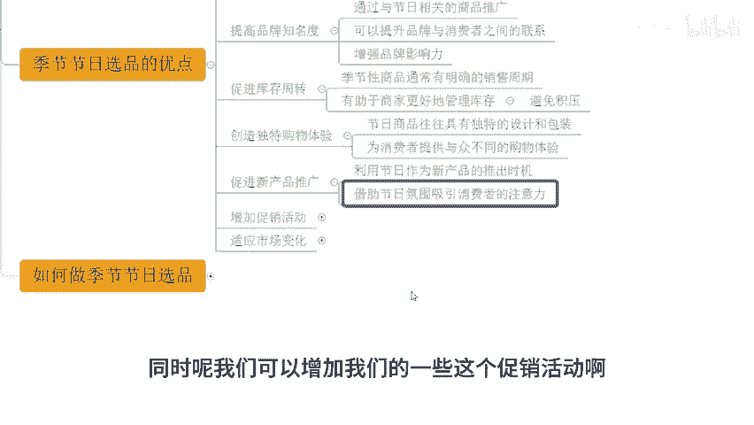

这个促销活动啊，像我们节日期间能把我们商家呢都会有各种各样的营销活动，对吧？比如说像我们的一些打折呀、满减啊、赠品啊等等啊，那么这些活动呢也是有助于去吸引我们消费者的，对吧？能够去快速增加我们销量啊。

当然呢换季的时候呢也是一样的啊，我们可以去做一些对应的季节的一些所谓的营销策划啊，来完成我们刚讲到的这些打折优惠券的一个发放，以及我们正品发放的一些活动啊，都是可以的。

同时呢我们也更好适应到我们市场的一个变化啊，那我们要去关注到我们的季节性的一个变化。对我们店铺的影响对我们产品的影响，及时的去调整到我们产品的一个选品策略上来。那这样呢能够更加的让我们店铺。

适应到我们市场变化，能够去更好的去做到一个用户流程，或者是更好的去用我们用户呢能够关注到我们店铺O的啊，是这样子的。那具体怎么去操作我们的季节节日选品呢？O来看一下首先第一件事情呢是市场研究。😊。

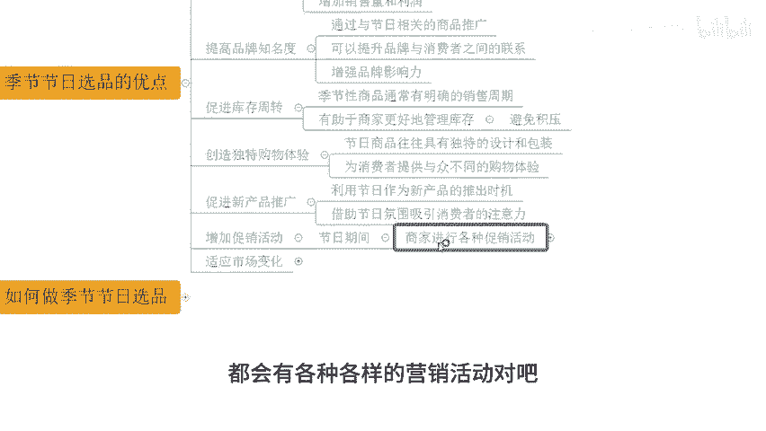

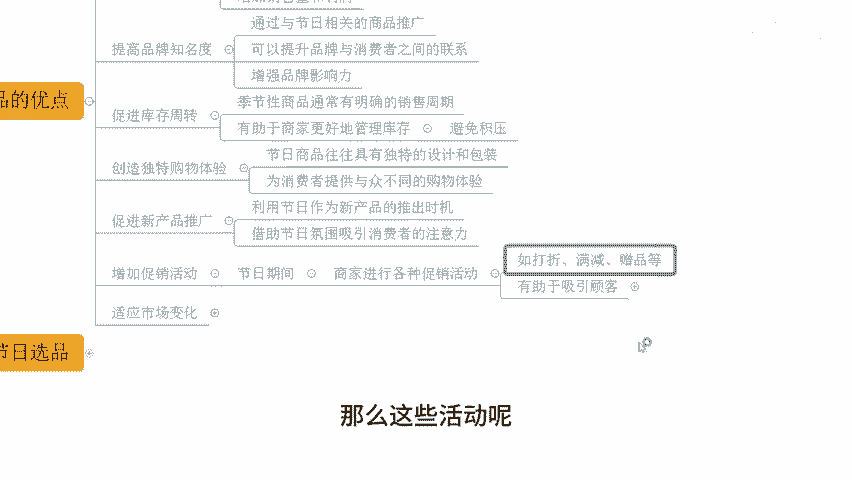

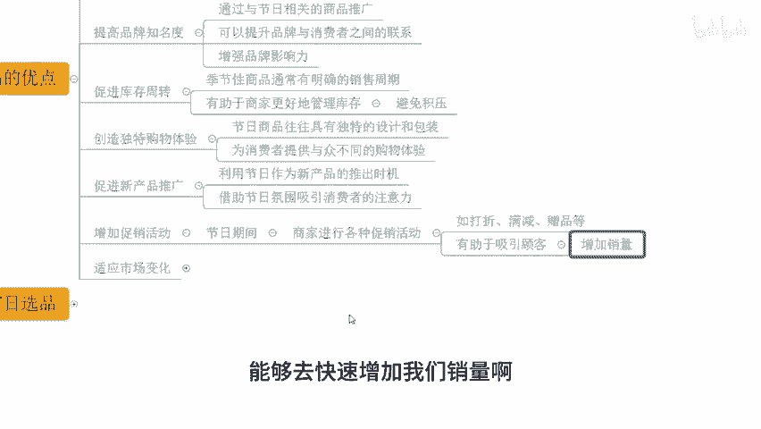

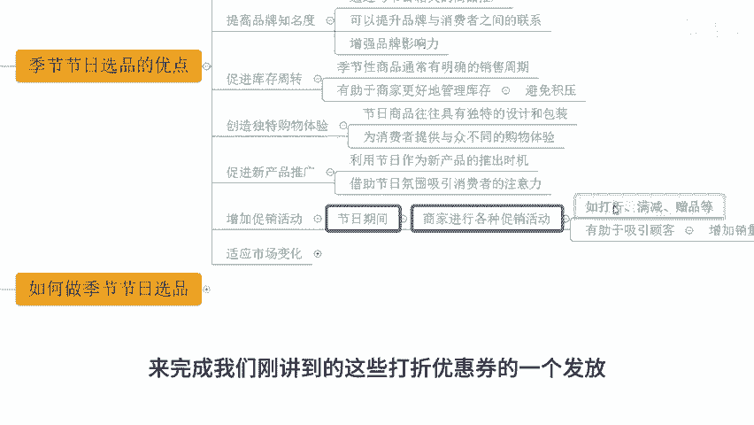

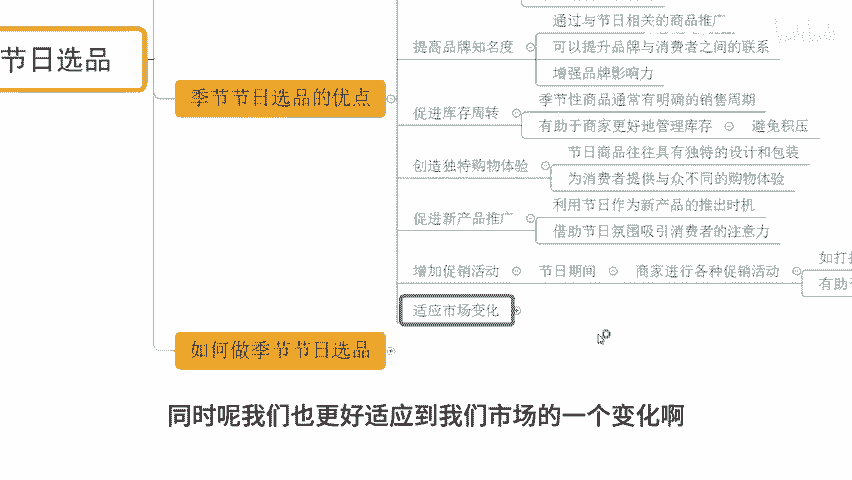

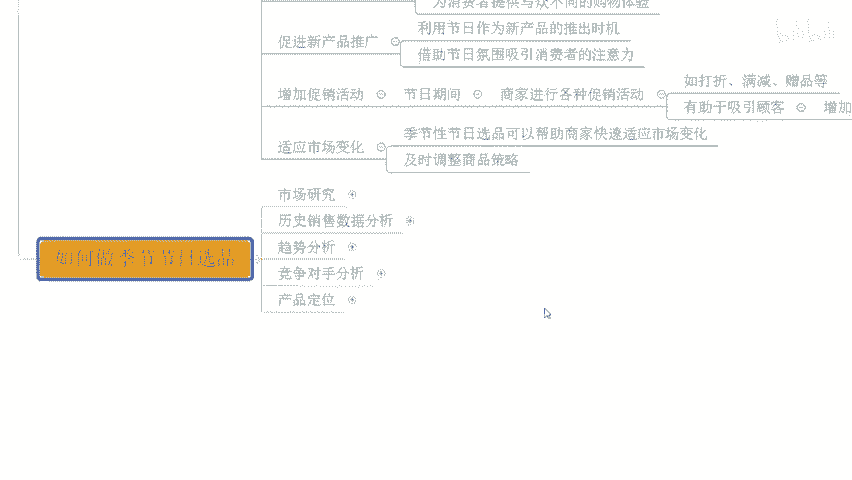

那我们要分析我们市场上季节性消费的一个模式啊，这个是非常非常重要一个点啊。那什么产品在哪些季节是对应的一个销售高峰期，我们应该在哪些时间节点上完成店铺商品的一个发布。

在哪些时间节点上来完成这个产品的一个正常的一个销售。在哪些时间节点上呢来完成我们店铺最终的一个库存清理，以及我们收尾工作，对吧？那么这个是非常非常重要的啊。

那同时呢我们要分析清楚我们呃目标市场的一个节日消费需求，对吧？不同的产品在不同的时间节点上，它会有到不同的时间这个表现啊，那同样的在呃同一个产品在不同的这个阶段上啊。

不同的节日上它也会有到一个不同的一个表现。那我们可以利用到季节变化，利用到我们节日的变化来进行我们对应同样的商品进行一个运行啊营销，来达成我们后期销费的一个转化啊。

那么同时呢我们可以了解到不同的节日产品需求的一个变化呢？也可以了解到我们。😊。

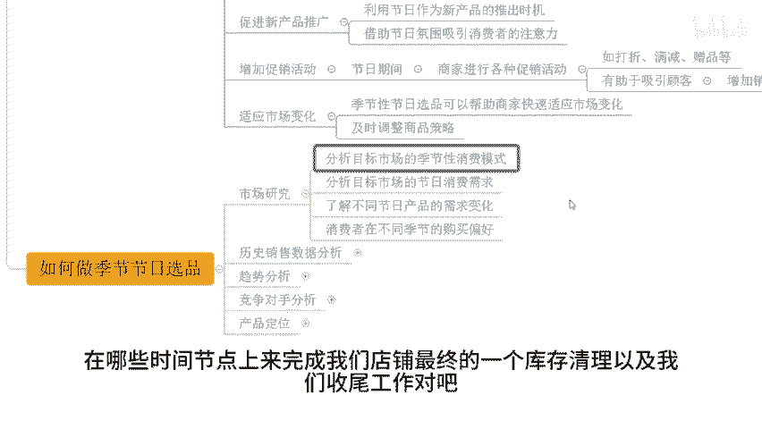

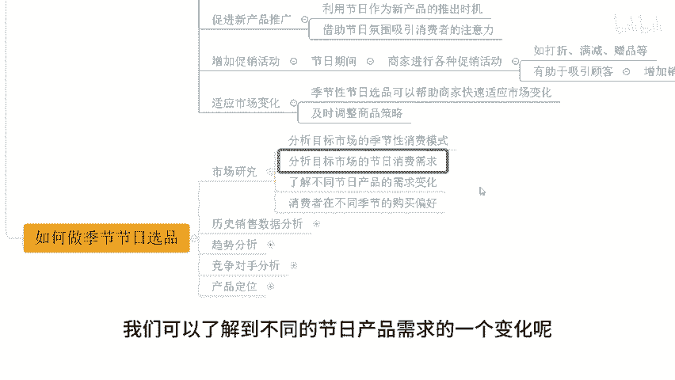

不同的这个消费者在不同的一个季节的一个购买偏好啊，来形成我们后期店铺经营的一个呃活动策划的一个一个安排啊。同时呢我们要去分析到我们的历史销售数据啊，这个是非常非常重要的一点啊。

我们要去查看我们过去的一些销售数据啊，来清楚知道在不同的时间节点上，在不同的季节上，我们要去找出哪些商品。那么哪些商品在特定的节日里面会表现的更好一点，哪些商品表现的不好。

那我们要规避那些不好的找出那些好的，让我们在后期经营的时候呢，能够去有到一个最低的保障啊。同时呢我们要去了解清楚我们的一个趋势分析啊。那么我们要根据我们市场的一个变化啊，来确定我们未来经营的方向。

比如说我们以服射来举例子，对不对？那包括像我们的一些这个流行元素啊，颜色呀、设计啊等等啊，对不对？这个也都会涉及到我们的季节，涉及到我们节日的一。😊。

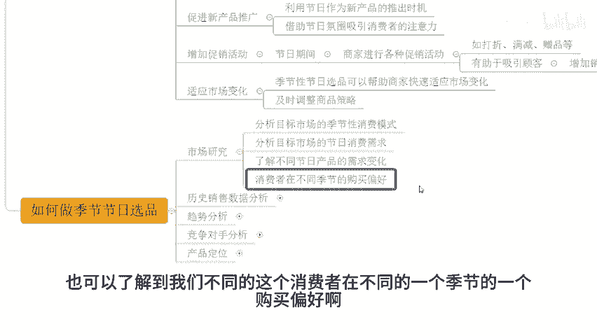

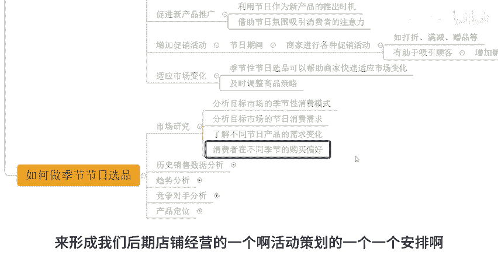

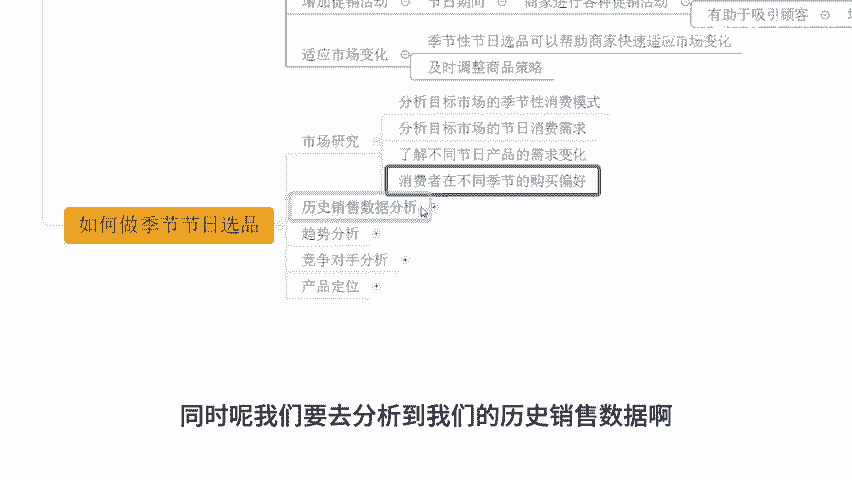

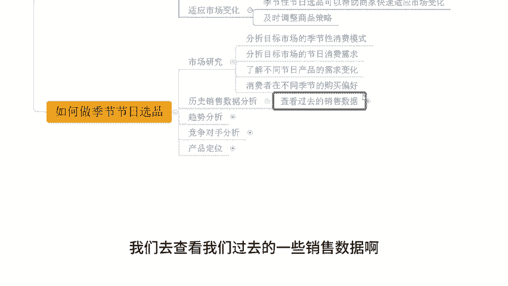

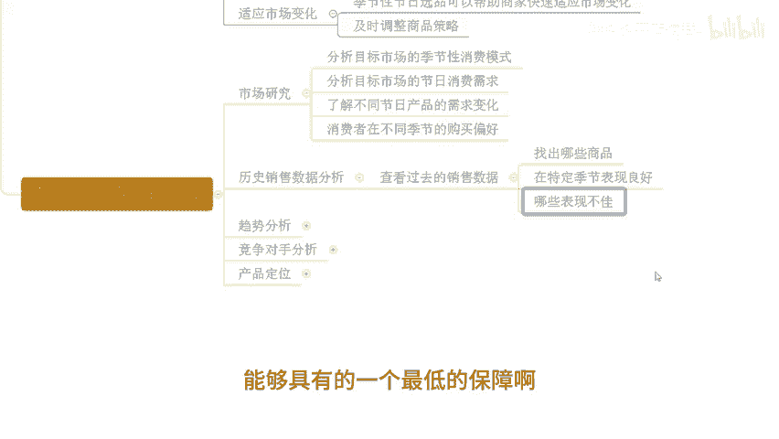

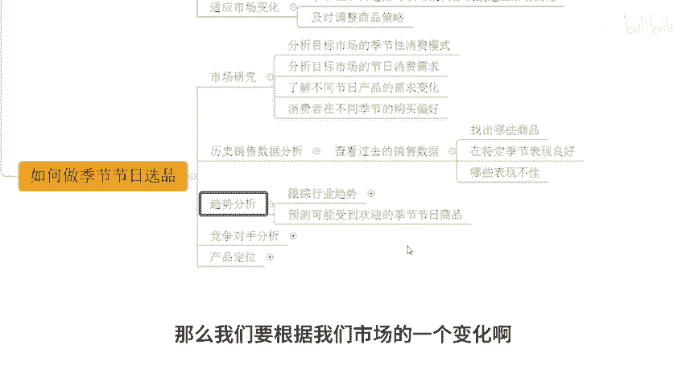

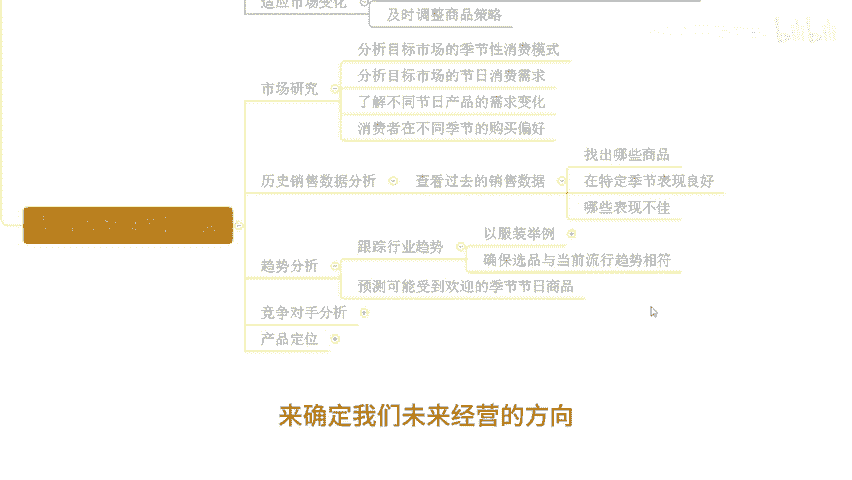

影响啊，所以说我们要去分析清楚它。那么能确保到我们商品呢是属于当前这个季节或者当前这样的一个节日，它比较流行的比较符合的啊。那能够预测出我们未来产品的一个呃这个方向啊来进行一个产品定位啊。

同时呢我们要去确定好我们竞争对手完成竞争对手一个分析。我们要搞清楚我们竞争对手呢，他对于竞竞性选品的一个策略是什么，能够了解清楚我们竞争对手呢在节日营销的时候呢，它的一个产品线啊是什么？它的策略是什么？

了解清楚他们的一个成功之处和不足之处，寻找差异化，能够去创造我们自己机会，这个是必然的啊，同时呢我们这产品定位的时候呢，我们可以干嘛呢？去根据我们这节特点以及节日特点来开发出我们新品啊。

以及我们可以更好调整我们现有产品。

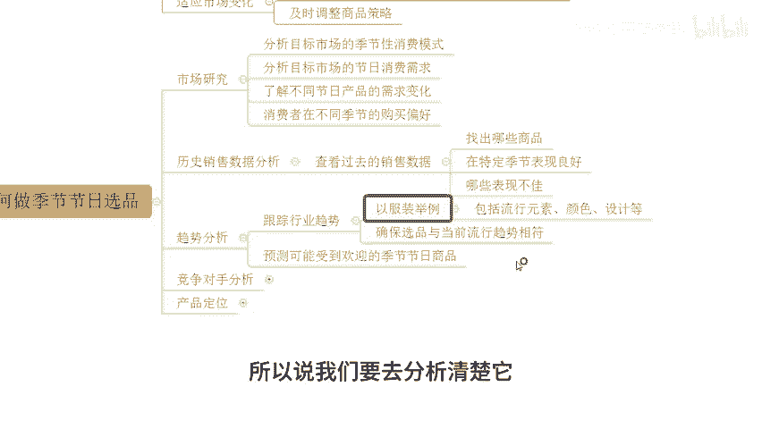

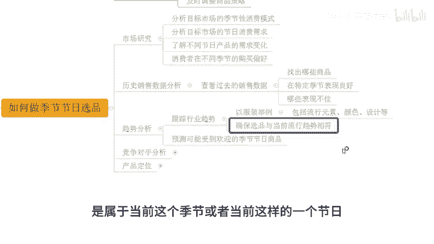

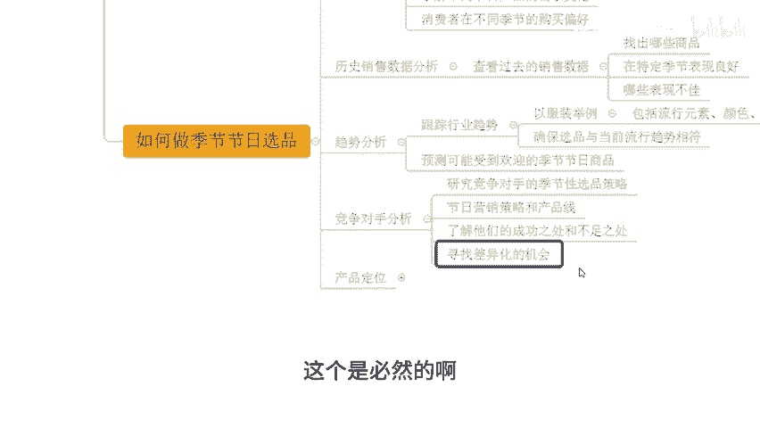

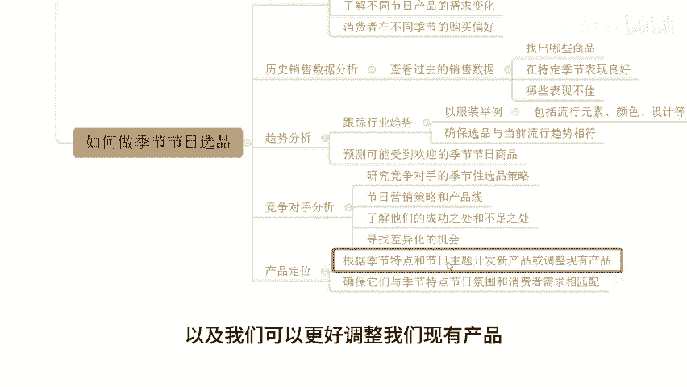

能够确保我们的产品呢在季节特点和节日氛围上能够去充分的和我们消费者的需求所匹配，来完成我们后期用户的一个收割，形成更好的一个转化。

所以说这个东西呢是我们需要去有到很宏观的一个分析以及很细节的分析才能进行的啊，那么有了这样一个分析之呢，我们后期呢在进行过程中呢，也不至于说产品呢受到一些呃这个呃市场影响。

或者是没有一个太好的市场占有率。好吧，O以上呢就是我们季节节日选品的一个分析啊，那么希望大家能够去吸收之后呢有所帮助哈。当然呢，涉及到我们具体的一些操作的话，因为我们产品不同，因为我们品类不同。

或者是因为我们具体的一个方向不同的，这个是没办法去讲的特别详细的。如果说大家对这方面感兴趣或者是有疑问O的啊，有什么遇到其他一些问题也好，对吧？或者有需要资料也好啊，都可以找我啊。

当然呢还是那句话有时间的话呢，我也可以在这里继续实坐店啊，就像这些小伙伴一样呢，我们一起能够去快速提运营。😊。

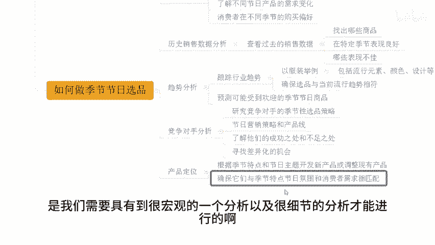

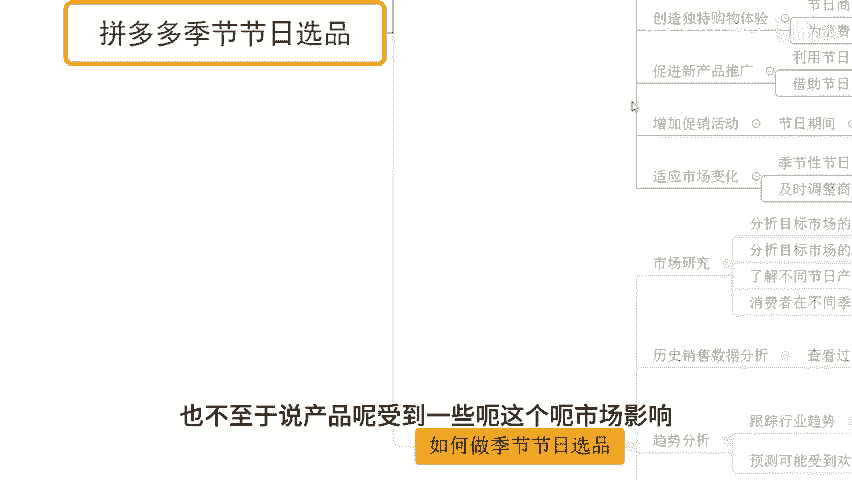

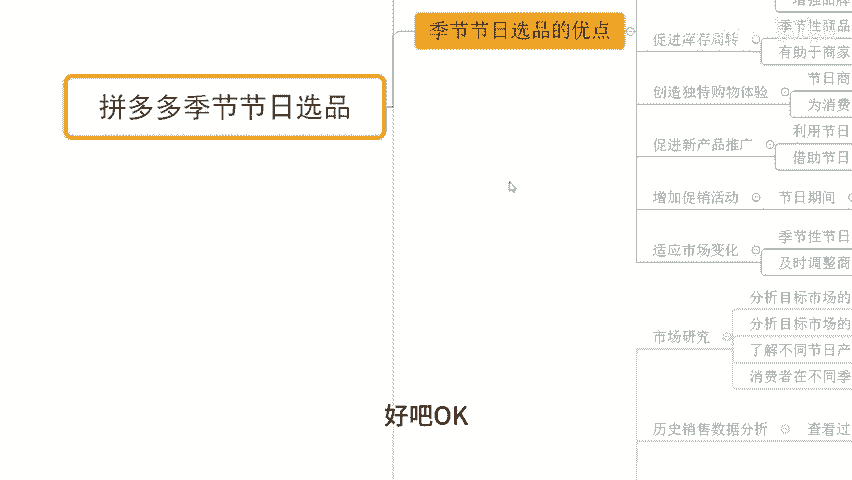

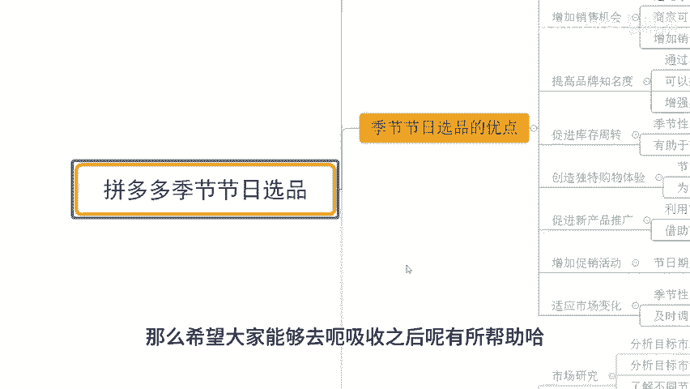

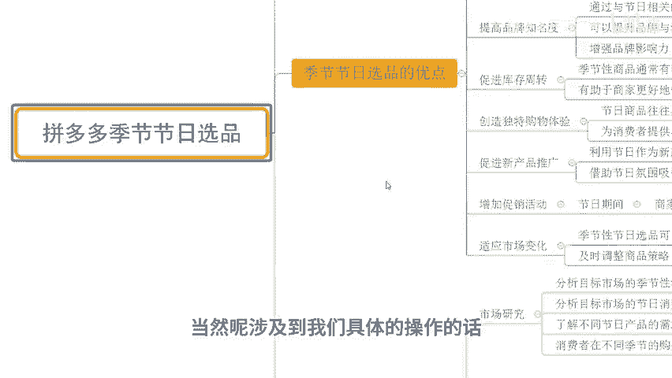

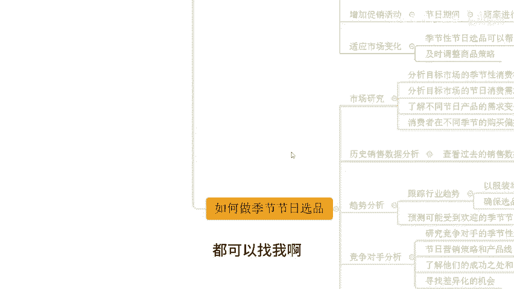

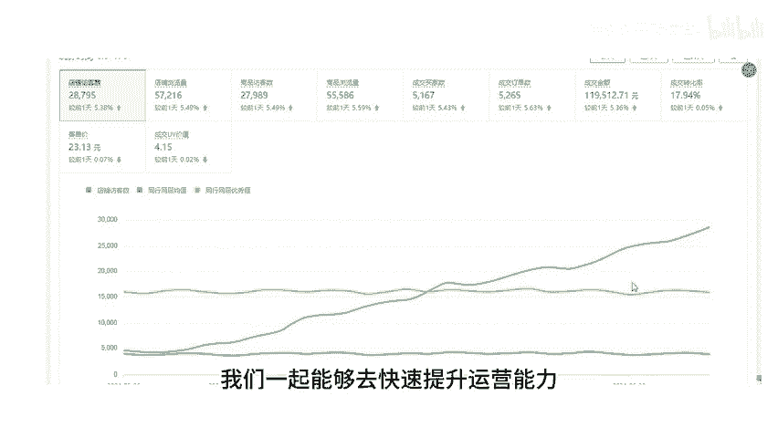

能力让我们店铺呢变得更好，好吧。OK今天的分享呢就到这里，我们下期再见，各位，拜拜。😊。

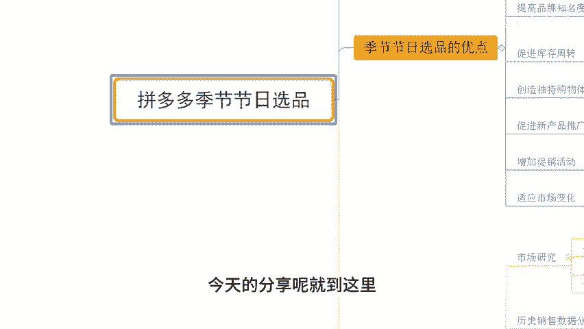