# 拼多多开店运营-新手电商运营实战指南，B站最全拼多多零基础入门教程！拼多多运营秘籍，小白也能成电商大亨！轻松上手拼多多，拼多多新手开店赚钱攻略 - P18：018 第三方爆款跟款选品 - 拼多多开店运营- - BV1xms8eSEVs

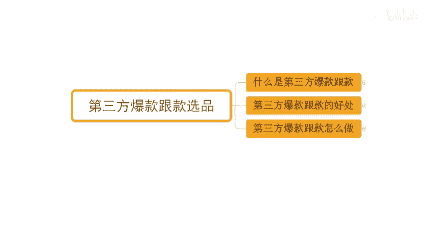

hello，大家好，我是谢楼。那么今天给大家分享的内容呢，是我们拼多多店铺运营十种选品策略中的第三方爆款更款选品的方法啊。

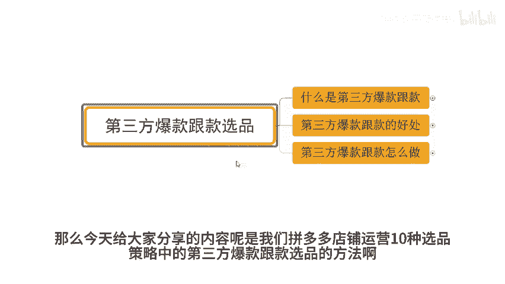

那在分享之前呢，先给来看一下近期跟着十川小伙伴他们的店铺数据，好吧。

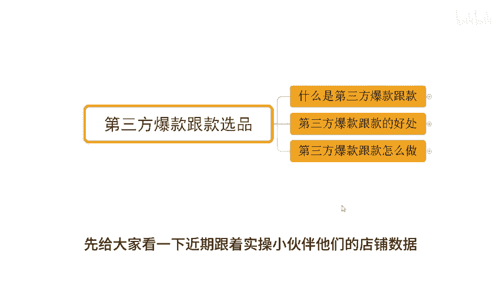

可以看到像这个店铺呢，原本访客呢在5000左右啊，那么店铺呢达到这样的一个数据之后呢，一直没有办法突破。那也是通过我们整个商品的优化调整，以及我们SQ的重新调整。那么提升好我们店铺的转化。

拉动我们店铺全众增长啊，可以看到啊整体的访客数据呢成长速度非常快啊。到后期的话一天的访客呢做到了28000，一天的订单呢是5100多单，转化率呢做到了17。94%。同样的啊。

还有像这个店铺可以看到原本访客呢只有几百个10千0不到啊，那也是通过不断的产品结构优化和我们SQ的优化来提升我们点击转化率。那么访客呢也在不断的增长啊，到后期的话一天的访客呢做到了14000。

一天的订单呢做到了1700多单，转化率呢做到了11。77。当然呢除了像这种有基础有数据的店铺之外呢，还有到一些店铺对不对？一些这个纯新店啊，那么同样也是能够到提升的。像这个店铺可以看到啊。

原本的访客是零啊一个纯新店来的。那么像这种店铺呢，我们前期呢也通过数据分析结合到我们店铺实际况和我们自身的一情况呢，完成了我们爆款选品啊，那么产品确定好之后呢。

我们不断的调整优化提升我们商品权重可以看到访客提升也非常快到后期的话这个店铺呢一天访客做了12000。那么订单的话一天是2700单转化率呢比较高啊，21。05%啊，当然呢因为这个店铺客价比较低点。

只11块多。那除了这个店铺之呢，像这个店铺对吧？那么整个的一个店铺情况呢也是一个纯新店来的对？当然这个店铺呢整体数据呢没有刚刚这个店铺多啊，因为他的一客单价比较高啊。

100多的客单价啊也是从零开始的可以看到。啊，那么整个店铺数据呢也在不断的增长。到后期的话一天呢访客做用了9000多，订单的话是900多单，转化率呢9。82%啊，也是非常不错的。那么像这些店铺呢。

也都是通过自然流的方式来操作的啊。如果说你想要知道怎么通过自然流来提升店铺数据，你想要通过自然流来打造爆款店铺。OK那么建议可以仔细观看我分享视频。好吧。

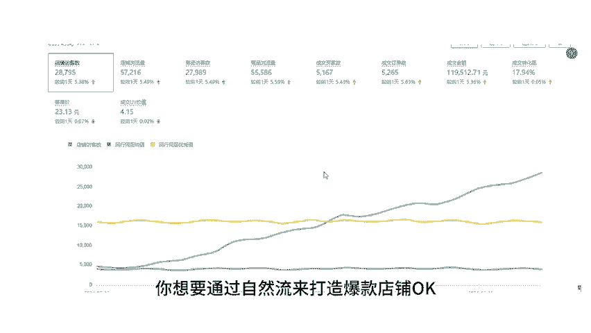

那店铺运营呢，对于我们很多的新手小白来说的话，有非常非常多的困难啊，这个很正常。大家不用气了啊，毕竟一个陌生的环境，陌生的一个领域对吧？啊，遇到困难很正常，有困难呢说明我们在进步啊，这个是一个好事情啊。

那如果说你遇到这种店铺操方面的问题啊，或者有需要资料的呀，OK的，可以找我啊。有时间的话，我也可以带着你一起去实操做店啊，就像这些小伙伴一样呢，我们一起快速提升我们运营能力，让我们店铺呢达到更高水平。

好吧，OK。

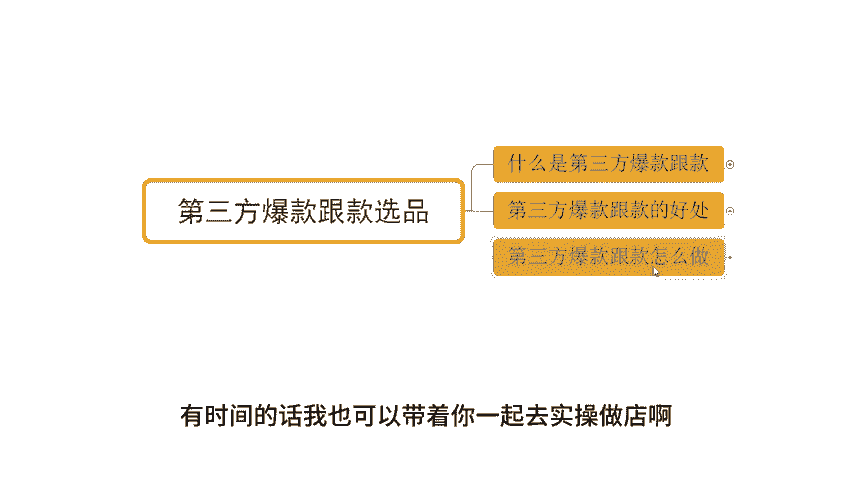

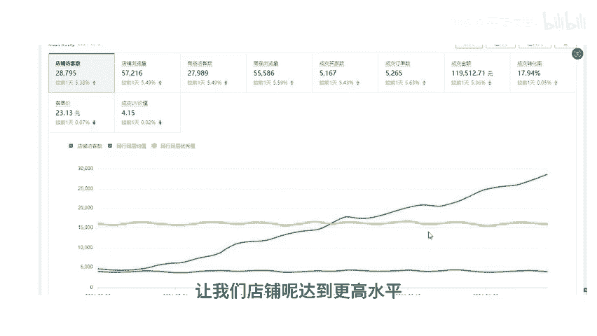

那么既然说今天我们讲的是第三方爆款更款选品，那么到底什么是第三方爆款跟款呢？我们先来看一下。其实呢这个逻辑比较简单啊，就是说我们商家呢进行选品时候呢，可以参考到一些第三方的平台啊。

比如说像我们的这个淘宝、京东等等啊，这种各种第三方的平台，都是我们参考的对象啊，那么根据这些平台呢，我们来找到一些爆款来完成我们自己店铺的选品啊，就这么简单。而爆款的一个跟款选品呢，不管是第三方也好。

还是我们自己的一个平台也好，它其实都有很多很多好处的。像第三方爆款跟款选品的话，我们来看看它具体好处哪些啊。首先第一个点呢，那么这些产品呢它是已经经过了市场的认证，对不对？虽然说是第三方的爆款啊。

但是这个爆款呢，它之所以形成肯定是我们这个产品呢是具备一定的市场需求的。所以说我们在后期经营的时候呢，我们不用去担心说哎这个产品是不是不好，或者这个产品是不是没有很多的一个用户需求啊，不至于对吧？

它一定是具备。

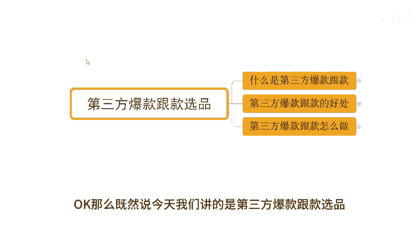

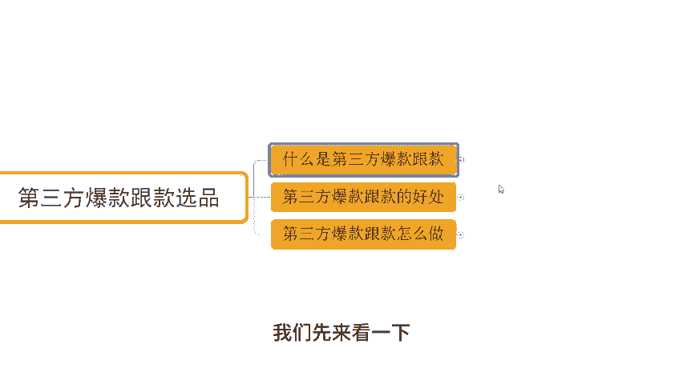

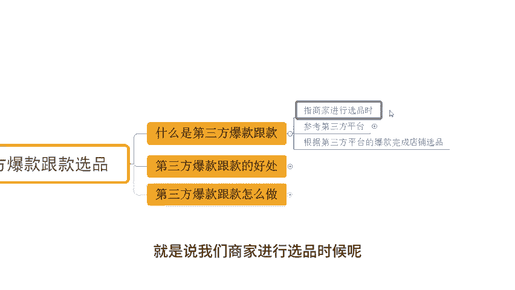

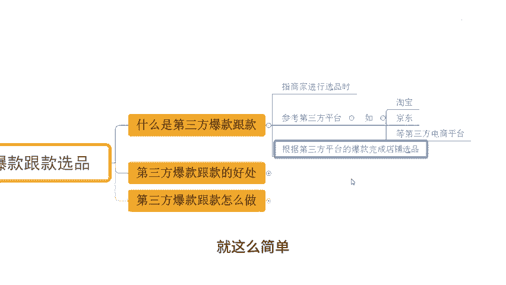

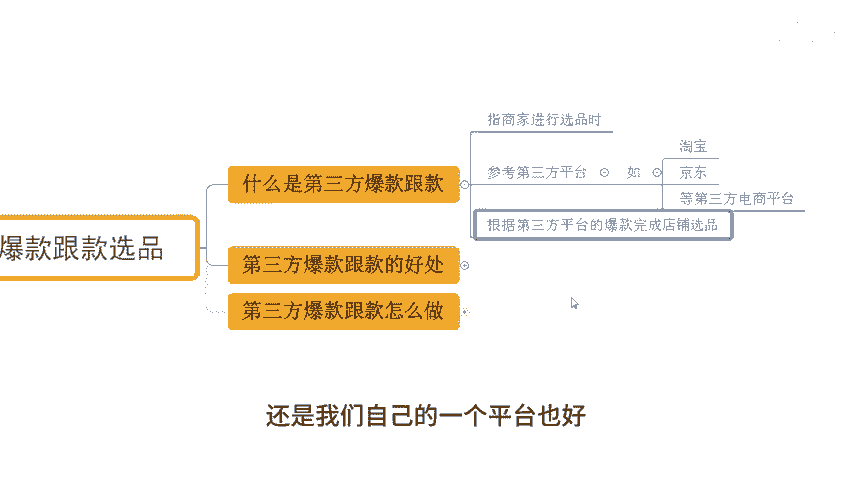

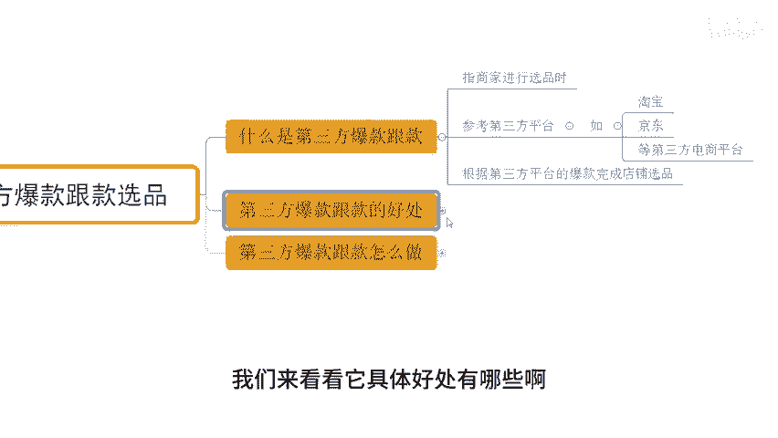

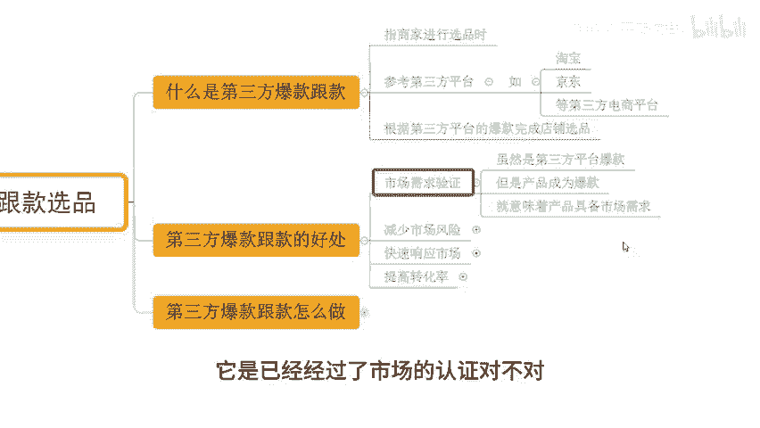

很大的一个市场体量的。所以我们整体的操作呢就会可以有到一个呃相对来说比较有保障吧哈。那么另外一点呢，就可以减少我们整个市场的一个风险啊。那么选择第三方的一个爆款商品呢，我们可以去干嘛呢？

可以增加我们自己本身商品的一个权重啊。那么这个呢是有一个非常重要的一点的。因为如果说我们经营的产品是本平台已经有的产品，那么我们会存在说一个这个竞争关系，对吧？

但如果说我们平台上可能经营的人很少或者是没有人经营的这个产品的话，而且在第三方平台上有在经营，而我们平台有价格优势的话，其实在这种情况之下呢，它是符合我们平台的调性的。

因为平台就是在跟我们其他平台进行竞争，他希望是我们在拼多平台上能够有到一个更好竞争力，能够帮我们平台呢跟别的平台进竞争的时候呢，有到一个明显的竞争优势来保证我们平台的一个市场地位。

并且呢完成一个更好的第三方引流啊那么同时。

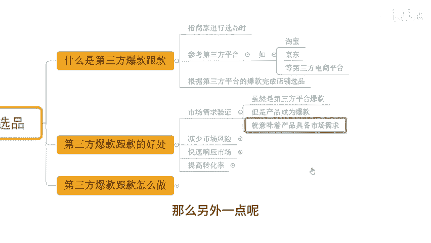

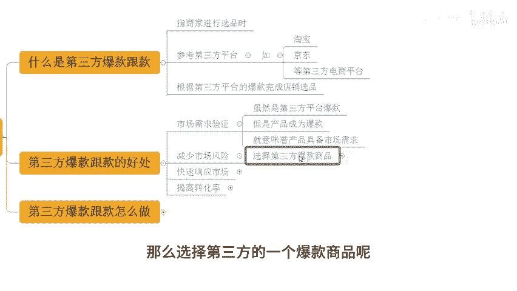

呢整个的操作呢，它也可以减少我们啊进行市场测试啊这么一个时间和这个成本啊。对于我们来讲的话呃，运营风险降低了，那么成本也降低了。同时呢我们在产品的经营过程中呢，也可以降低我们。

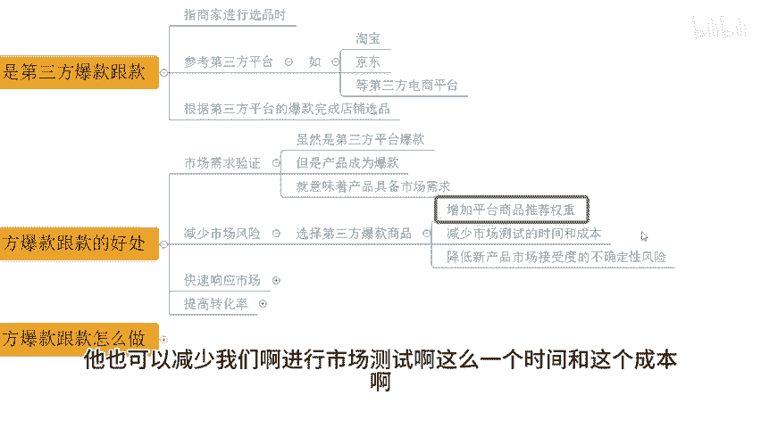

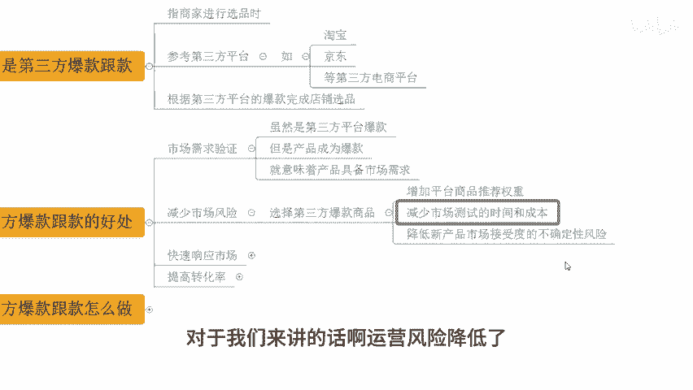

新产品啊对市场这个接受度的一个不确定性的一个风险性啊，也能减少。因为它本身就是爆款来的。好吧，那除此之外呢，我们还能够去快速的去响应市场的一个变化，对吧？那么呃第三方的一个爆款款商品呢。

我们可以去帮助商家能够快速去响应市场的一个趋势。那可以抓住到我们更好的一个销售机会，以及我们实现我们的销售一个增长啊，那在我们本身嗯在进营产品的时候呢。

我们就需要不断的去找到一些更多更新的一些平台的爆款商品来完成产品的一个迭代，来帮助我们平台呢有到一个更好的用户的体验度，对吧？所以这种情况之下，当我们有到更新的产品，更好的产品的时候呢。

O这个也是符合我们市场的一个需求，也是符合平台的一个推荐要求的。

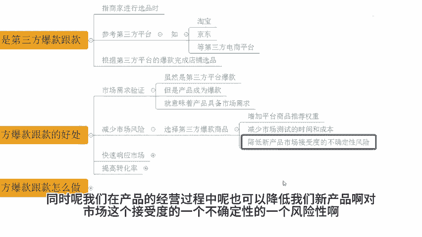

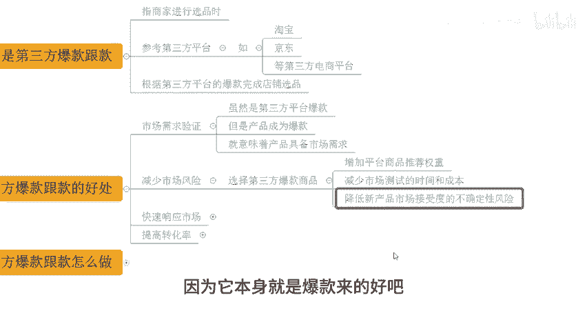

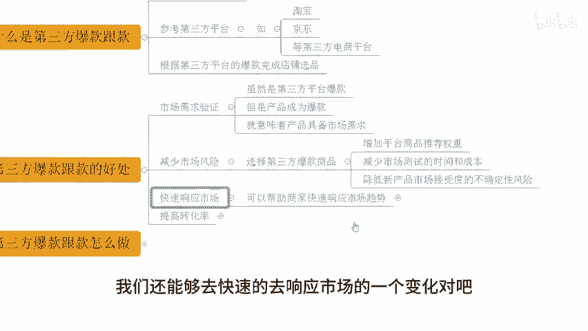

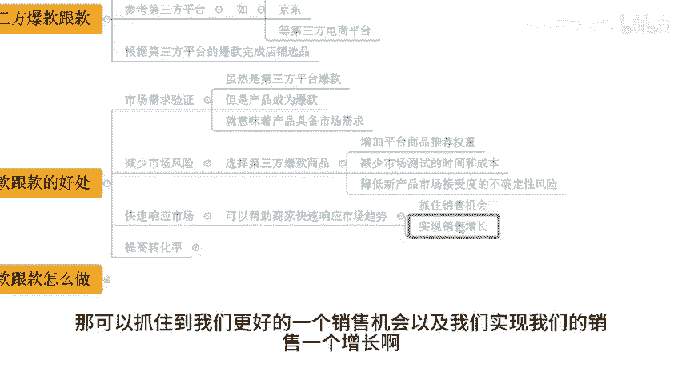

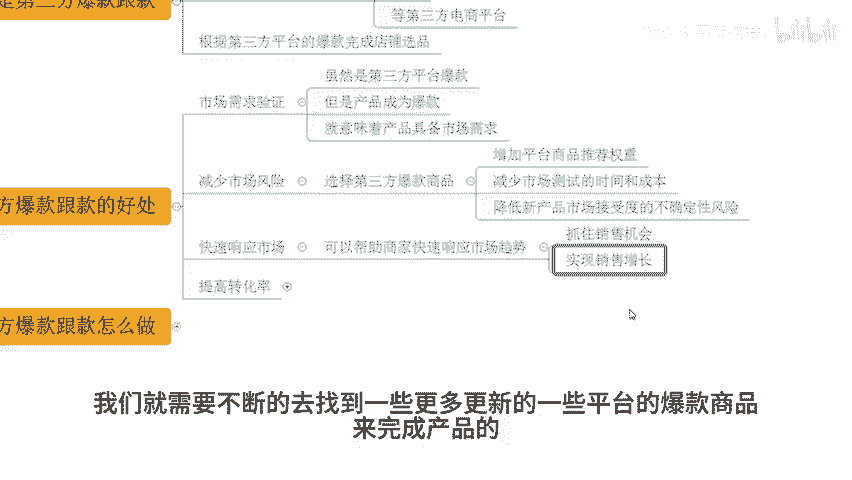

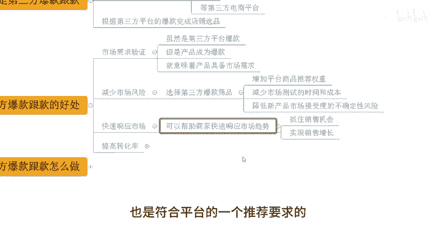

那么再一点呢，我们可以提高我们产品的转化率啊，那么这个东西呢其实就很现实了。因为报款上面呢，它本身就拥有了很高的一个用户的一个认可度。

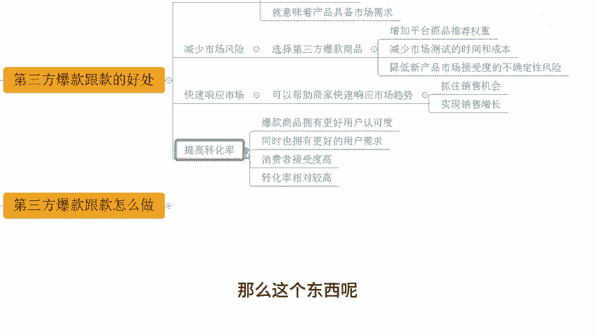

同时呢他也会拥有到一个更好的啊用户需求。所以这种情况之下呢，我们消费者呢它的接受度会比较高。相对来说呢，我们转化率也会比较高。那么我们整个店铺经营的话，到后期如果说你没有办法去很好的进行转化的话。

其实再多流量都等于零对？当我们能够去充分利用流量的时呢，我们平台的一个曝光不会变废掉。平台判定说我们店铺呢有到更好的流量直接能力，从而呢给到我们更多的推荐权重。

帮助我们获取更多访客啊所以他的一个好处其实是不言而喻的啊那说到这里可能很多朋友说那这个爆款更换选品，尤其是这个第三方的爆款更换选品，我们应该怎么去做呀？嗯，其实不难啊，我们来看一看具体操作步骤。

首先第一个事情呢，我们就要去确定一个啊进行一个市场研究来确定我们平台的一些销价格段。这个我们得搞清楚。并且呢来确定我们市场这销价格的个S布局情况啊，那么这个是我们了解清楚的一个问题。

因为我们在竞争的时候呢，虽然说可能我们产品呢。

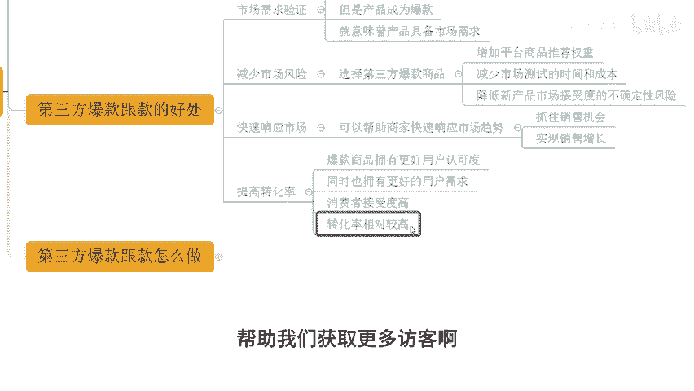

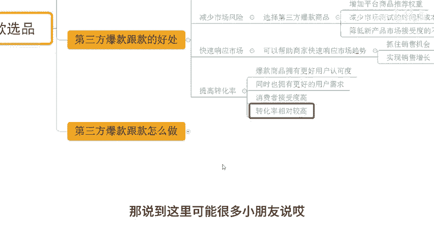

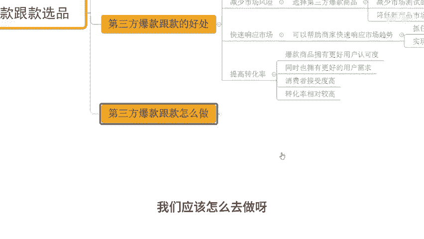

平台上啊比较少，但是也不说我们就不去竞争了，相似商品也会去形成竞争关系。所以说我们也需要去了解清楚我们平台的一个需求情况啊。那么除了这个地方之外呢，我们还要了解清楚我们第三方的爆款，对他们进行分析啊。

我们要清楚的了解清楚我们这个第三方的啊爆款情况啊，能不能够去找到一些近期啊上架的一些标签小爆款啊，这个是非常关键的一个点啊。

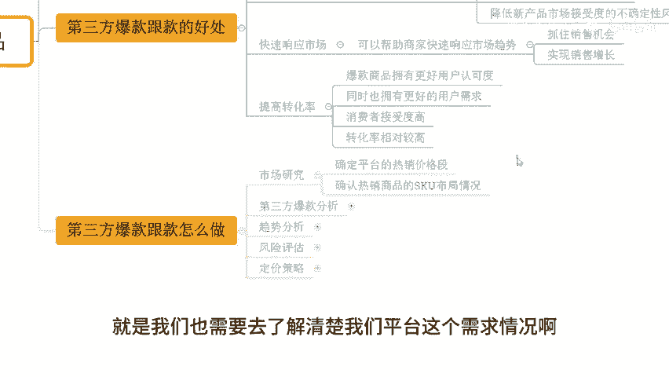

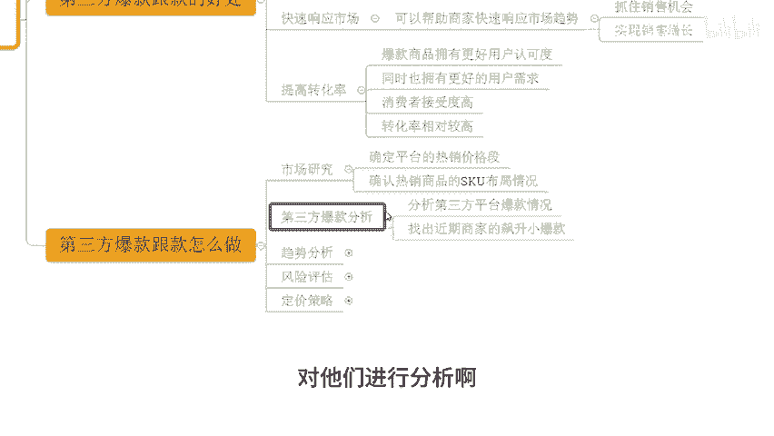

那么这些产品的话，它因为呃是近期刚刚起报的，可能在这种情况之下呢呃比较少人去关注它或者操作它。所以如果说我们有到这样的一个呃每天去检查，或者每天去关注这种市场动态的情况呢。

我们可以第一时间去进行一个调整啊，能够帮助我们完成我们店铺商品的一个上架，并且呢在后期经营过程中呢，我们可以抢占先机啊，是这样子的。那么了解清楚之后，我们来进行一个趋势分析，我们要搞清楚这一个产品呢。

在未来的足够的一个时间范围内嘛，它是有到一个很好的生命周期的对吧？你不至于说因为我刚开始操作，它就已经进入了一个比如说换季啊或者受了其他些因素影响。

导致这个产品过时或者是没有一个很好的市场需求的一个状态，对吧？所以这种情况之下的话，我们把这个搞清楚之后呢，我们再去操作呢，对我们店铺来讲会更加这个保险一点啊。那么再呢就是我们的一个风险评估啊。

这个也是我们需要去做一个事情。那我们要确保这个产品呢不存在说。

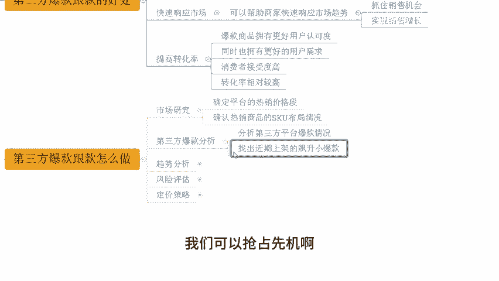

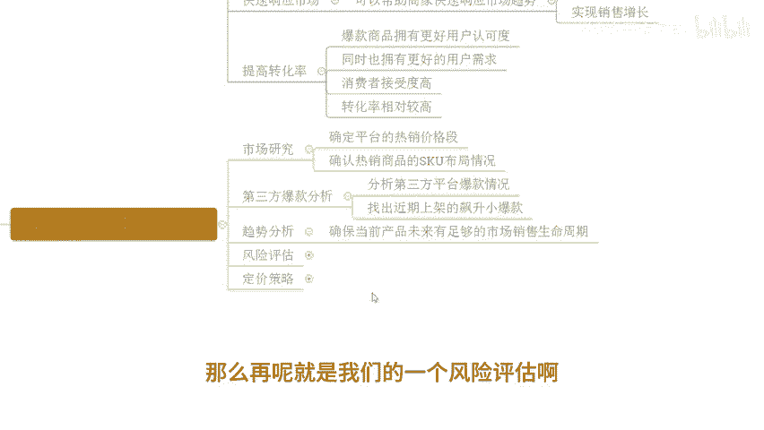

侵权这样一些法律问题。比如说我们如果说去使用的话，对吧？会不会有到一些这一个图案的侵权呢，或者是这一个呃产品的一个侵权啊等等啊，这东西我们得搞清楚。那如果说它本身不是什么知名品牌。

没有这种品牌的一些限制，或者是整个的一个产品呢也不存在说本身的一些违规那我们可以直接去操作它，这没问题的啊。那么把这个东西搞定之后，后面呢我们就要进行产品的上架发布了，对吧？上架发布过程中呢。

最最重要的就是我们的定价策略啊，这个是非常非常重要的。那么制定一个合理的价格定价呢，我们的这个店铺商品来讲话，它的重会更高啊，那么在这个过程中呢。

我们需要考虑到我们的这个成本也考虑到我们的利润率也要考虑到我们消费者的一个习惯。如果说我们发布的商品呢它本身不符合平台的一个要求，它的一个价格段次比较高或者是特别高。

那么这种情况呢也可能会导致我们整个市场呢受到一些影响啊，所以说在。

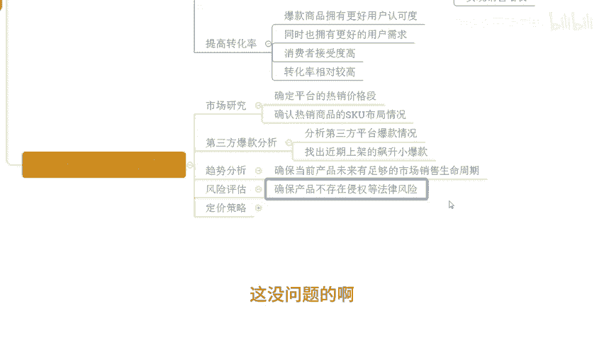

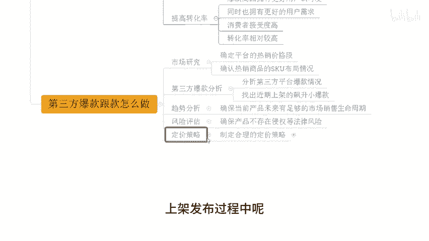

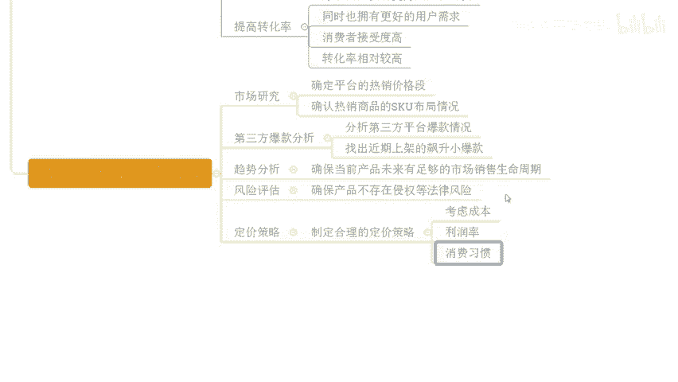

最开始的时候呢，我们就要确认好我们平台的一些这些价格段，以及我们热销商品的一些价格SQ布情况啊。那么在这个合理范围内，我们去进行操作，并且同时我们要保证呢我们的价格呢要比第三方平台要更低一点。

这样呢才能够在平台上进行销售的时候呢，有到一个更好的市场竞争力，也能够得到平台的一个推荐啊，是这样子。那么搞定这个事情之后，我们去上架呢，我们自然而然整个商品呢就能够得到更好的一个权重得到更多曝光好吧。

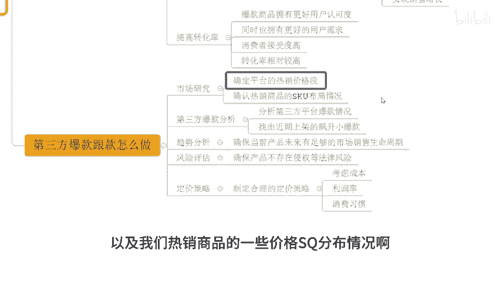

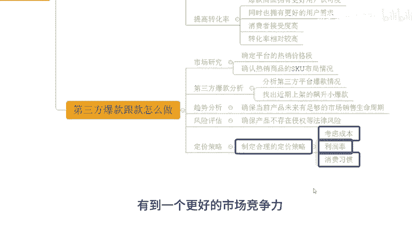

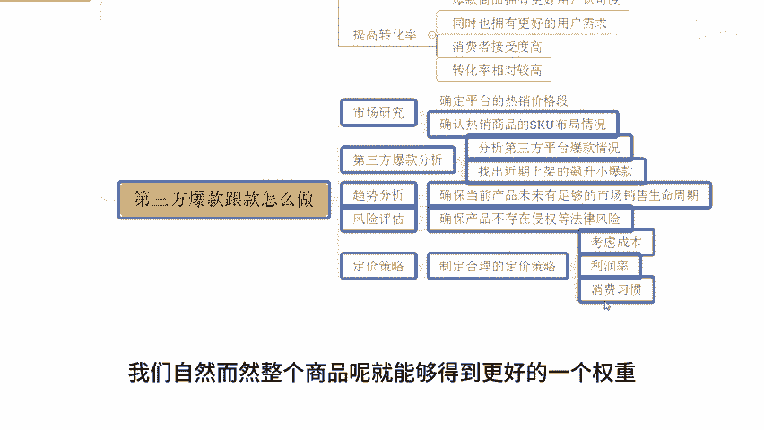

OK啊，那么以上呢就是我们第三方爆款更款选品的一个操作方式啊。当然了，如果说大家还有什么不清楚的地方，有什么其他店铺操作面的问题，或者有需要资料的，可以找我啊。那么同样的呃，如果说有时间的话。

我也可以带大家一起去实操，对不对？这样的话至少来讲有一点啊，你们可以有到更好的一个学实效率。对于我们店铺操纵呢也能够达到更高水平，好吧，跟这一店铺一样，能够去快速提升。那么今天的一个分享呢，就到这里。

我们下次见，各位，拜拜。😊。

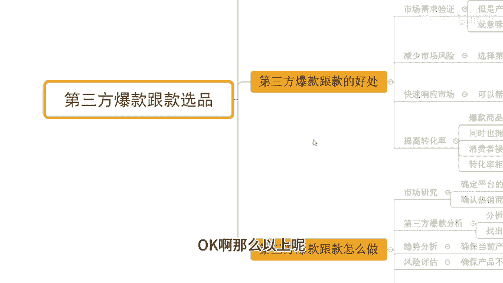

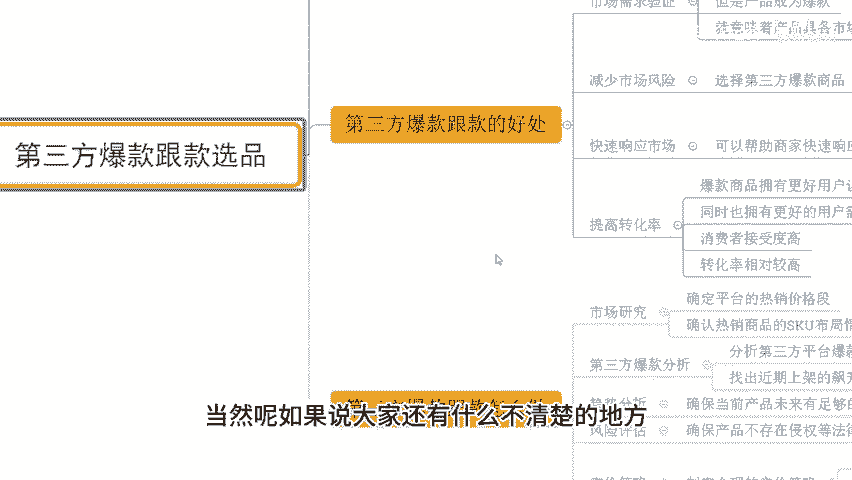

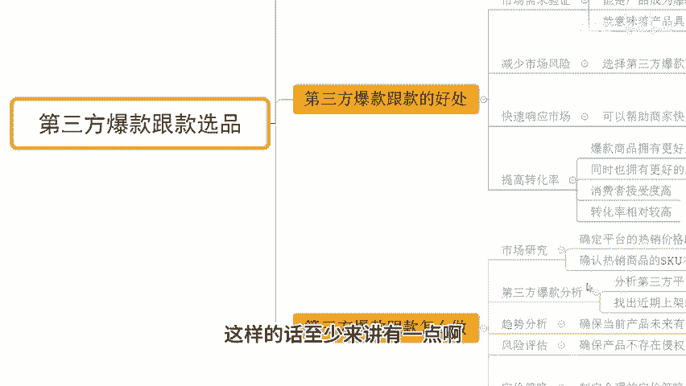

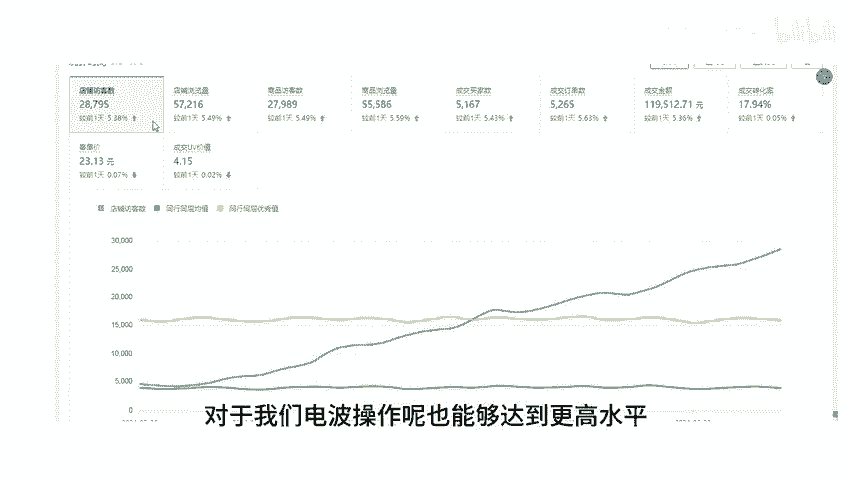

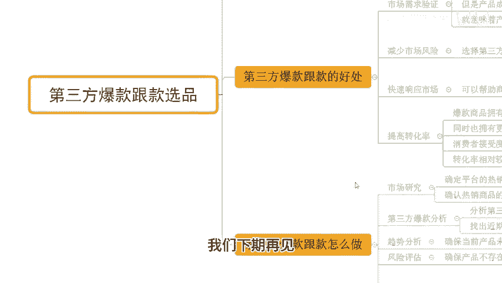