# 拼多多开店运营-新手电商运营实战指南，B站最全拼多多零基础入门教程！拼多多运营秘籍，小白也能成电商大亨！轻松上手拼多多，拼多多新手开店赚钱攻略 - P21：021 拼多多反向需求选品 - 拼多多开店运营- - BV1xms8eSEVs

。hello，大家好，我是西楼。今天给大家分享内容呢是我们拼多多店铺运营10种选品策略中的拼多多反向需求选品的方法啊。在分享之前呢，然后规矩先给大家看一下近期跟人时尚小伙伴他们的店铺数据，好吧。

可以看到像这个店铺呢，原本访客呢在5000左右啊，那么而且呢这个店铺当时的数据呢是卡在这个样的一个位置，很长时间没有办法突破。那么当时呢这样的店铺呢，我们拿到手里面之后呢，也是针对到我们产品的结构。

针我们SQ进调整优化。当优化完成之后呢，可以看到整体的访客也在不断的增长啊。然后访客成长也比常快速啊。然后后期的话一天的访客呢是做到了28000一天的订单呢是5100多单转化率呢做到17。94%。

当然还像这个店铺啊，原本的访客呢是在几百个10千不到啊。那么同样的，通过产品结构的优化，通过我们产品的SQ布局调整。那么优化完成之后呢，整个店铺呢也在不断的提升，对吧？

访客上升的速度也是非常非常快速的啊。到后期呢一天的访客呢做到了10001天的订单呢是1700多单，转化率了11。77啊。当然除了这种有基础有数据的店铺之外呢，一些零访客的新店。

那同样的跟实效也是能够达到很好提升的啊，可以看到像这个店铺原本的访客是零对吧？是一个纯新店来的。那么通过对我们市场经行分析以及爆款进行分析。完成了我们产品选款定位之后呢，开始操作。

不断的优化我们产品的权重，可以看到啊访客提升也非常快速。到后期的话一天访客呢做到了12000一天的订单呢是2700单，转化率呢做到了21。05啊那么同样的像这个店铺可以看到啊。

那这个店铺的数据能没有刚刚这个店铺那么大啊，但是这个店铺的客单价比一100多客单价的？也是一个访客的新店。同样的跟着实操之后呢也是完成了产品品和操作之后呢，访客开始不断的提升。

到后期的话一天的访客呢做到了900一天的订单呢也是做90多单啊转化率呢是9。82啊那么这些店铺呢也都是通过自流的方式操作的。如果说你想知道怎么通过自流来提升店铺数据。

你想知道如何通过流来打造爆款建议可以仔细观看我分享的视频好吧店铺运营呢对于很多的新小白来呢会有很多很多的困难啊。如果说你在店铺操作过程中有遇到问题，有需要资料的可以找我那么有时间的话。

我也可以在这里一起去实操做，这小伙伴一样。

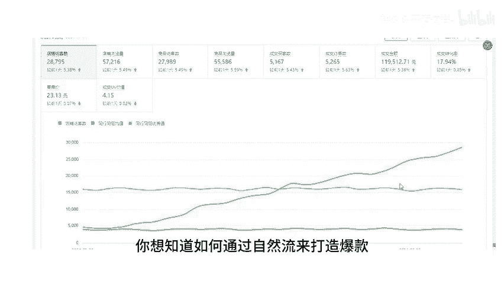

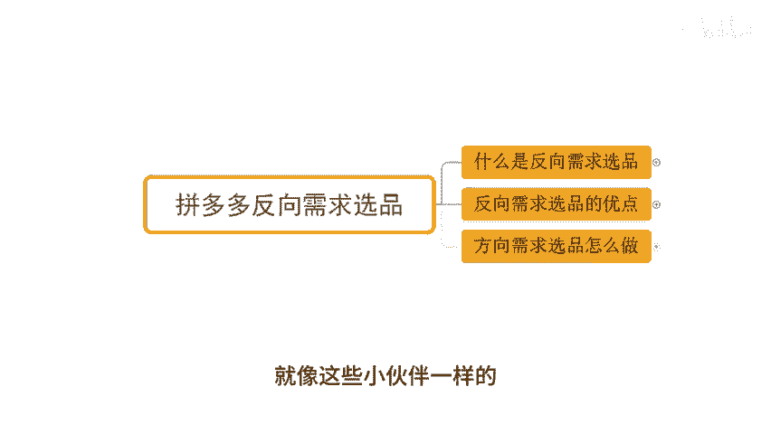

我们一起快速提升运营能力，让我们店铺呢达到一个更高水平。好不好？OK那么既然说今天讲的内容呢就是反向需求选品呢，到底什么是反向需求选品呢？一起来看一下。

其实反向需求选品呢它是一种呢深度挖掘我们用户需求的一个选品维方式。一般的选品方式呢可能是关注大部分人的一个需求。

而反向需求选品呢是关注我们啊大部分需求之外的少部分人啊这部分人他们的需求呢往往会被忽略掉啊，所以说我们去关注他们同时呢那么这样的一个产品呢。

我们在操作过程中呢可能他的竞争压力会小一点产品的转化呢也会更高啊，有这样的一个特点啊。那到底反向需求，我们为什么要去做这个事情呢？他有哪些优点呢？我们来看一下啊。😊。

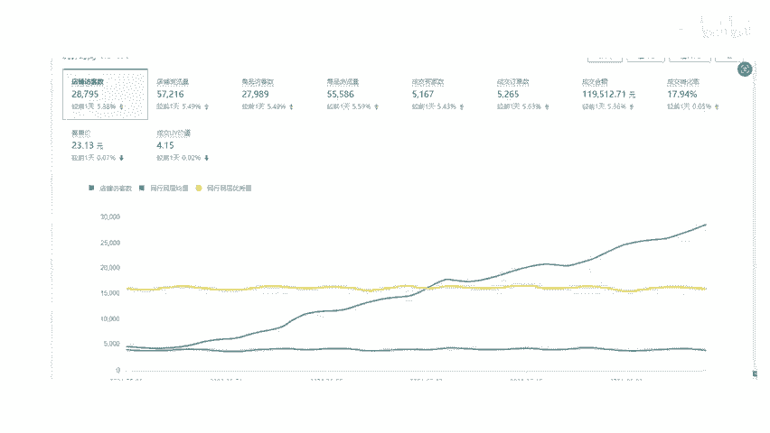

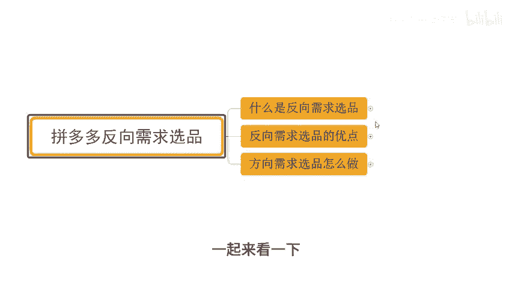

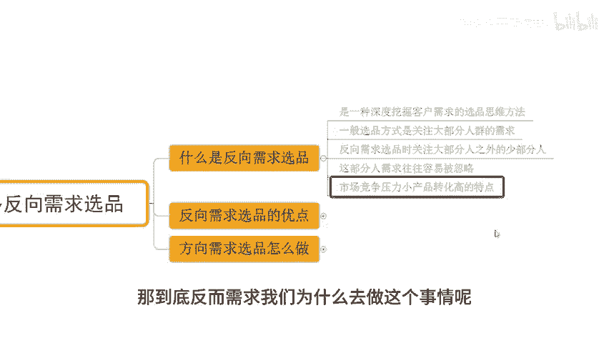

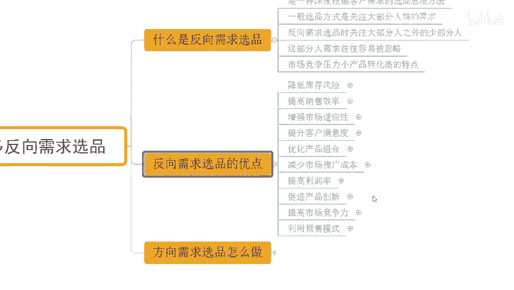

首先第一件事情呢，那么可以降低我们的库存的一个风险啊。那本身呢我们通过了解完成我们用户需求，我们再去进行选品的话，这个时候呢就可以减少我们的库存压力，对不对？

我们不会说是盲目去进行一个产品库存的一个累积，对吧？那么在我们经营过程中呢，整个商品呢它也不不会像我们这些所谓的大部分一样的对吧？会有了大量的一个需求，会有了大量的一个库存要求。

那自而然我们库存压力也会比较小，那包括说产品的过时之后呢，我们整个库存压力的风险呢也会比较小一点啊。那在整个操作过程中呢，那我们的一个呃销售的一个效率呢也会变得更高一点啊。

那么针对到我们产品的需求进行一个选择。那么这个时候呢已经明确了我们用户有这样的一个需求之后呢，我们的产品的转化率也会更高。同时呢我们可以增强我们市场的一个适应性，对不对？

首先呢我们在进行这些所谓的需求选择过程中呢，也是通过完整的数据分析去确定的对吧？所以说我们可以了解清楚市场的一个需。

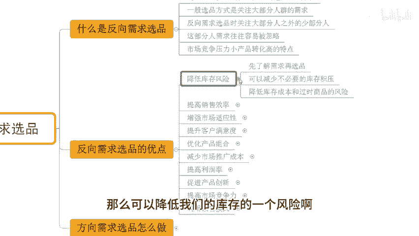

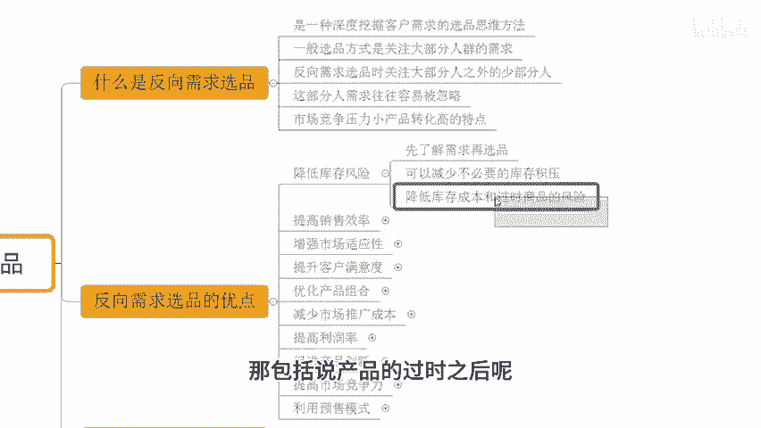

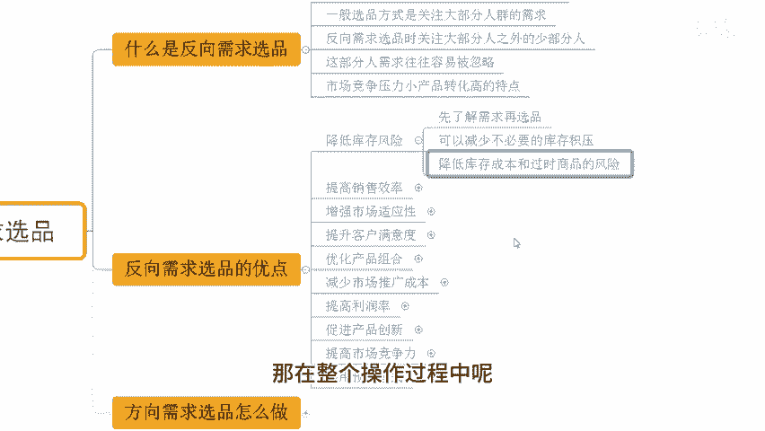

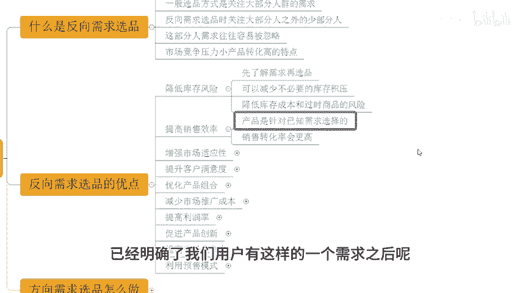

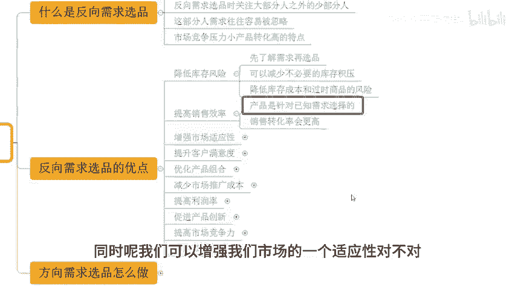

变化以及我们消费者的一个情况。那同时呢我们可以在操作过程中呢，及时去调整我们的一个运营策略。那么这样的方式呢，也能够去让我们店铺能够更好的去适应市场。同时呢我们可以提升我们用户的一个满意度啊。

因为提供了我们消费者实际想要的一个产品。所以这个时候呢我们用户的一个满意度，还有忠诚度呢会比较高一点，可以有到大量的这一个回购订单和有的大量的一些忠实粉丝沉淀啊。

同时呢我们可以去做好我们产品的一个优化组合，对吧？那通过我们的这个需求的一个分析，对吧？我们可以结合到我们自身产品的一个情况来进行一个组合优化，那去除一些表现不好的产品，来保证我们后期的时候呢。

能够有到更好的产品提供给我们的消费者，同时呢我们可以减少我们店铺推广的一些市场成本啊，那么产品的一个需求多和少，它是一个相对的，对不对？当我们有到一个精准需求的时候。

其实这个时候呢我们产品呢它一定是有到一个非常好的市场体量。而且有到非常好的一个市场的一个用户人群的。所以这种时候呢，我们整体的运营成本呢也会比较。

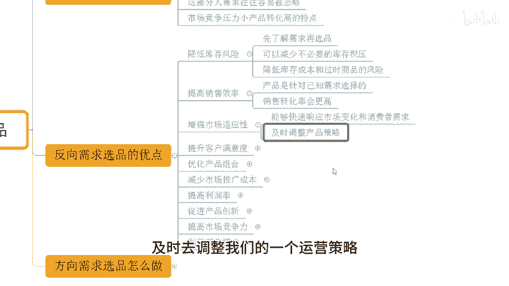

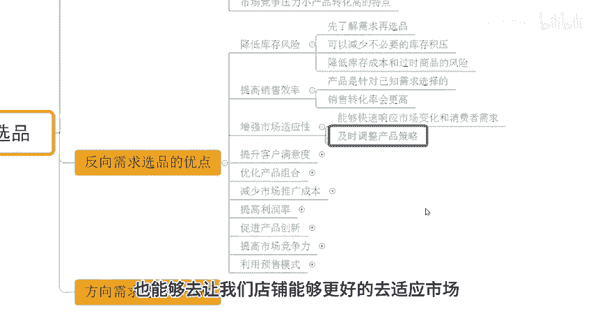

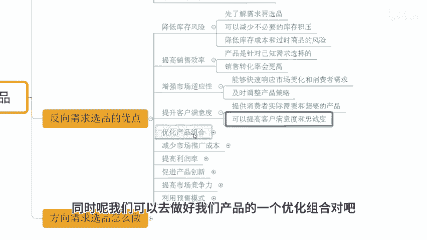

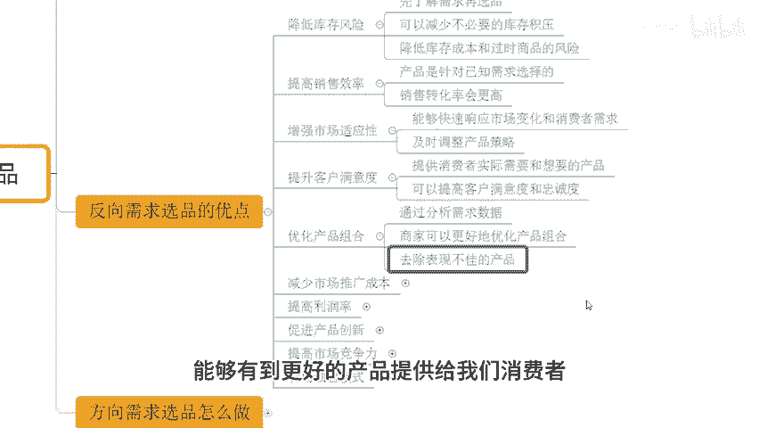

第一点，而且它跟我们那些所谓的大爆款的热销的商品需求不同的是什么呢？它的竞争压力会很小。所以说这个时候呢我们运营难度也会相对来说比较低一点啊。那么另外呢我们的利润呢会更高啊。

那本身呢产品呢是根据我们所谓的这种需求来进行定制的。所以这种时候呢我们少部分人的一个需求。对于我们很多的头部商家来说它可能是不屑一顾的。

相对来说呢可能更多是像我们这些中小卖家会关注到一些更小部分人群的一个需求。所以这个时候呢经营的商家会很少，也会避免掉一些大商家的一个垄断，所以呢可以避免掉一些价格站来保证我们产品的一一个较高的利润率啊。

同时呢我们可以促进我们产品的一个创新啊，我们了解用户需求之后呢，以激发我们产品的创新以创意对不对？来完成更好的用户的一个服务啊，那么这也是我们可能在日常的这店铺运营过程中之前可能不太具备的。

当然这个条件呢是更多针对于我们是厂家这种情况来的。如果说你是一个。

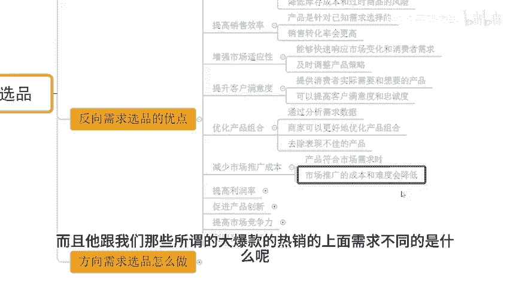

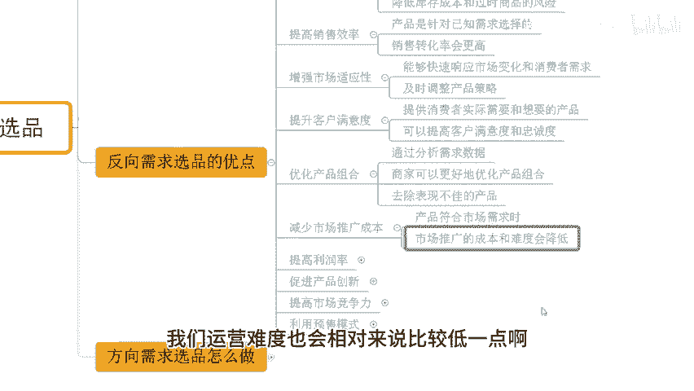

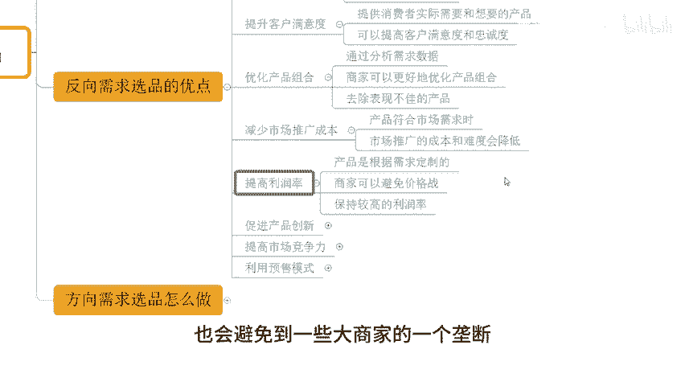

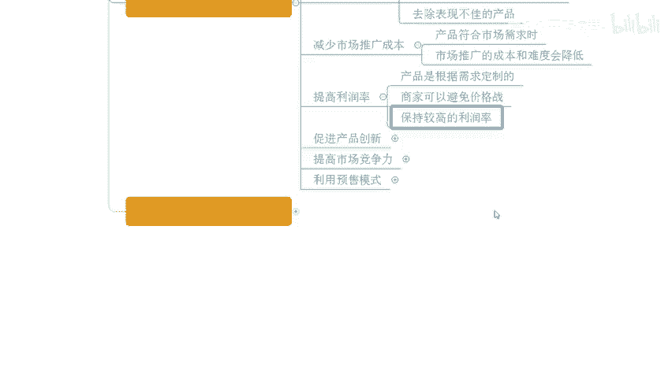

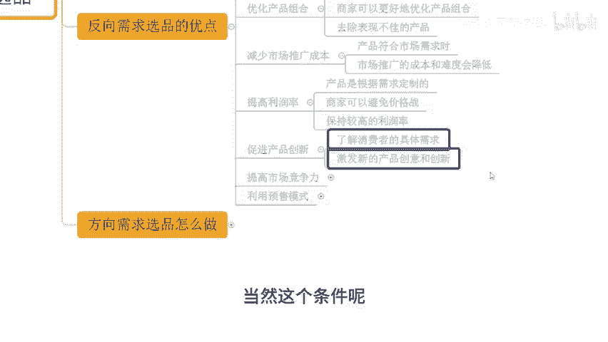

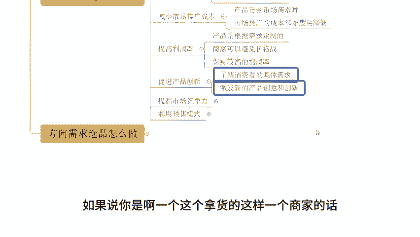

这个拿货的这样一个商家的话，可能对于这一条来说啊意义就不大了啊。那么同样的，除了这些东西之外呢，我们还可以提高我们的一个市场竞争力，对对？我们可以快速适适应我们市场的一个啊用户的一个需求变化啊。

那么能够在我们市场里面呢能够有到一个更好的或者较强的一个竞争力。同时呢我们利用这种预售模式去进行经营的时候呢，也可以去降低我们在前期的时候的一些这个资金风险啊，降低我们财务风险啊，是这样子的。

那么整个的反方向选品啊，这个反向选品的一个这个这个操作方式呢，可能大家都是了解的很清楚了啊。😊。

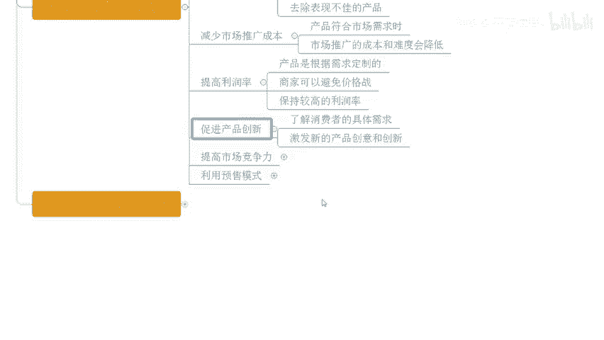

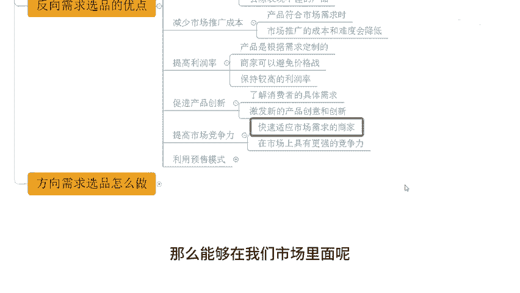

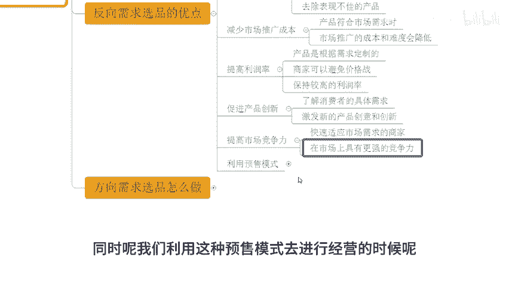

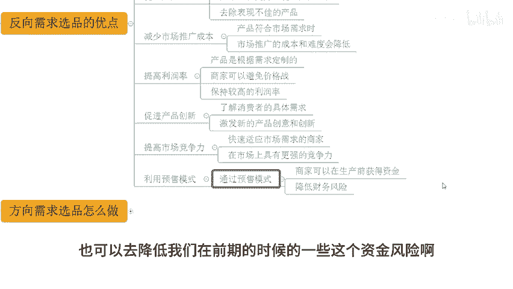

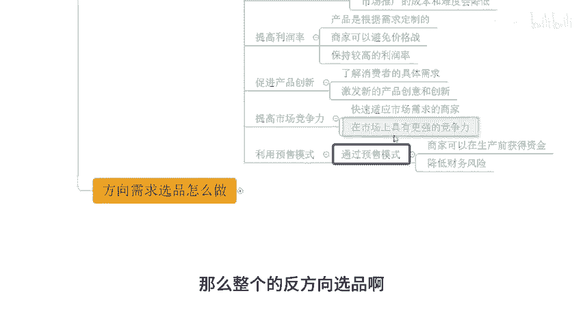

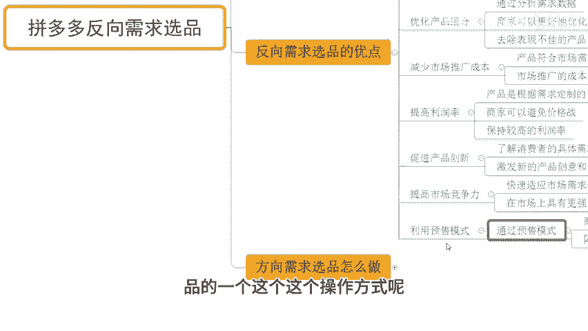

那么我们来说一说具体反向选品啊，它的一个操作方式到底怎么去做的。来看一下。首先呢第一点呢，我们要研究我们的市场，对吧？我们可以通过深入研究市场的一个情况来了解清楚我们消费者的需求偏好以及购买习惯。

然后收集这些消费者的一个消费数据，包括说一些关键词啊这时的商品这些商品呢来确定我们主流市场的需求。然后通过确定这些市场需求之后呢，来反推。那么另外一部分被平台忽略的一些重要人群。我举个例子啊。

像我们的内衣在前几年可能大部分的内衣呢都是这个小胸变大，对吧？这个聚拢啊啊这个这样一些效果啊，可能会比较多一点啊，可能这些产品的一个需求也会比较高，包括说产品的热度也会比较高。但是你会发现近一两年。

那么像一些大胸显小这样的一些产品就凸显出来了。因为早些的时候可能我们更多人关注的是小胸。

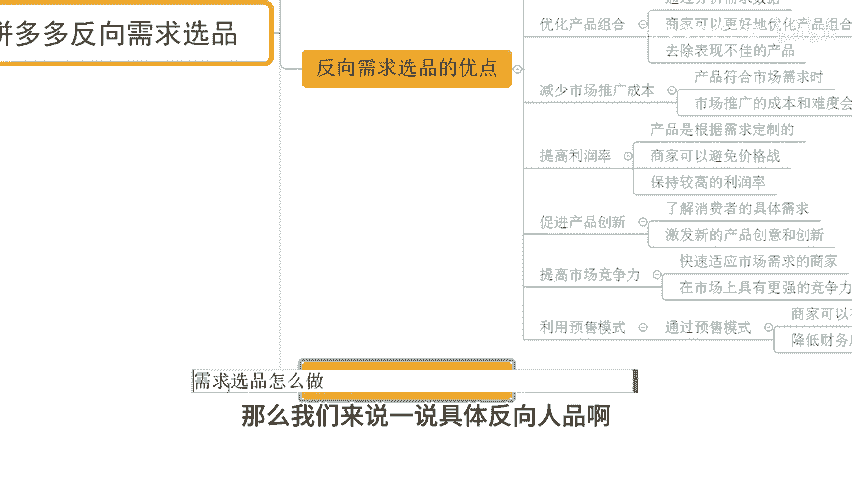

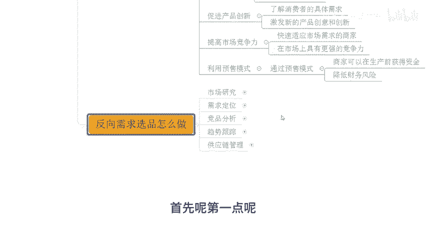

人群的一个需求，去往往忽略了一些大胸人群的一个烦恼啊。所以这个时候呢这部分人是很难得到一个或者是很难去找到一个适合自己的好的产品的。那么这一块的市场相当于是空白。

而近几年为什么说这个市场会慢慢慢慢变得庞大或者得更加的到关注呢？那么一方面呢是我们这个本身啊利于这个品类呢，它已经趋于一个市场饱和，对不对？那么尤其是这个小胸显大聚拢效果的这种产品对吧？

他的一个竞争压力非常大以呢更多的需要去拓展市场会关注到更广泛的人群，另外一方面呢就是因为这一部分人群呢，他们也是一个非常庞大的人群也会有很多人有这样一个苦恼。那么而这一部分人群没有被发掘的时候呢。

他们的一个这个市场空白是没有得到填补的对？所以现在有很多人去经营它的时候发现确实这个市场很好，而且呢有的很大的一个市场潜力，能够到很好的市场反馈，对吧？就这么简单。那所。我们在经营其他品类的时候呢。

也是有到这样的一个一个一个状态的对吧？我们要去关注清楚我们的产品的一个具体主主流人群是谁。那么相相对应的啊，那么在主流人群之外，还有哪些人群有哪些需求我们要发掘出来啊。那么有了这样前期的市场调研之呢。

我们就要做我们产品的一个需求定位了啊。那么这个所谓的需求定位就是我们刚讲到的我要确定好我们主流需求之后来反方向的去这个推啊推推导出我们多个不同维度的一些需求来去寻找适合我们自己的或者是能够更好突破的一个这的一个细分的一个市场。

好吧，那么做完这个东西之后呢，另外还有点就是我们要去做我们的竞品分析，我们了解清楚我们的反向需求市场情况之后呢，要了解清楚我们反向市场的一个竞争环境。

包括说这个产品的一个销售价格价格段呢包括销量情况等等这些东西。那确定这个市场呢是我们能够竞争的并且有足够的利润空间的。那我去玩它。如果说是确实这个品类。

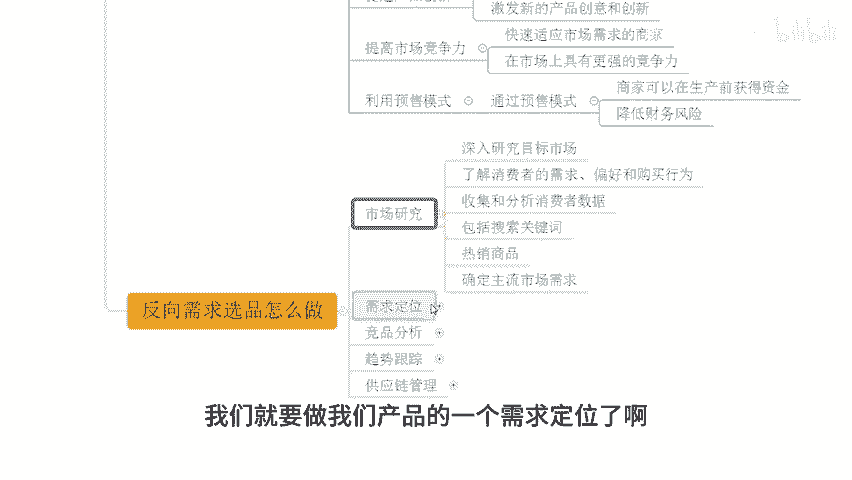

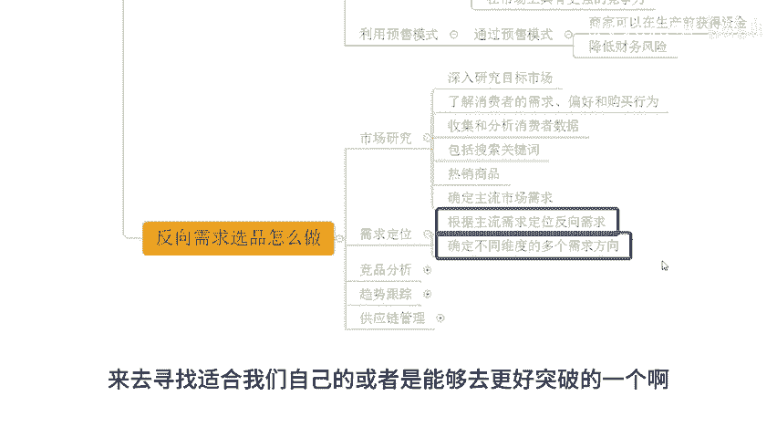

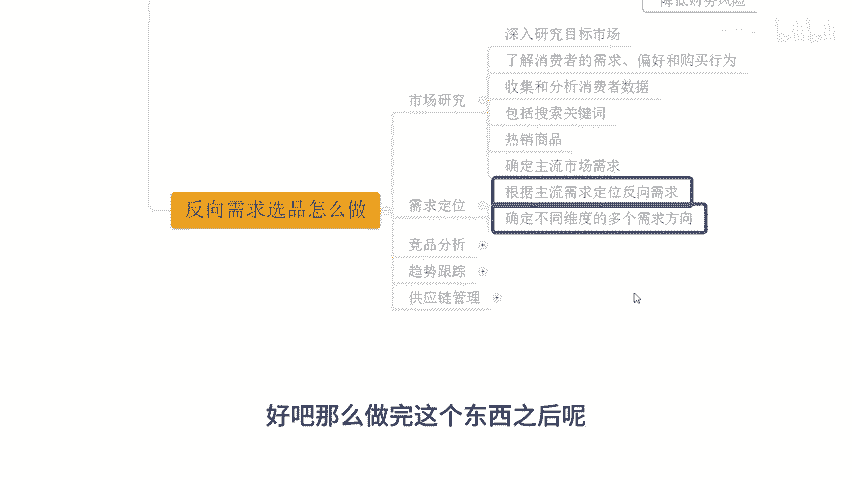

并没有我们想的那么好，或者是这个市场数据来说，对我们来讲呃，没有达到我们想要的一个一个一个效果的话，OK的那。其实我们也不用考虑的啊，可以多去啊多方向的去发展去分析啊，也都是可以的。

然后呢再一点呢就是我们要去进行我们趋势的跟踪，对吧？我们要关注到我们市场趋势，像我们流行元素啊，机械变化等等啊，来预测我们未来的一个市场需求变化。包括说我们到这个时间的一个影响到影响到一些长流趋势影响。

带来的一个市场变化或者需求变化。那么有了这样的一个前瞻性呢，我们后定位商品的时候呢，也能有到更好的一个操作，好吧？那除此之外呢，还有就是我们要去做好我们的供应链管理，对吧？要建立灵活的供应链啊。

那么这个所谓的灵活供应呢其实更多来讲的话，其实就适合我们做一键代发的一些中小商家了，对不对？因为我们不用去有到那么大的投入去做这个产品的打板去制作呀建立建立这个生产的一个这个链路啊。

对不这样以我们更加灵活一点。但是呢要做到一点是我们要快速的去响应市场需求变化。好吧，当我们去有发现到这样的一个。

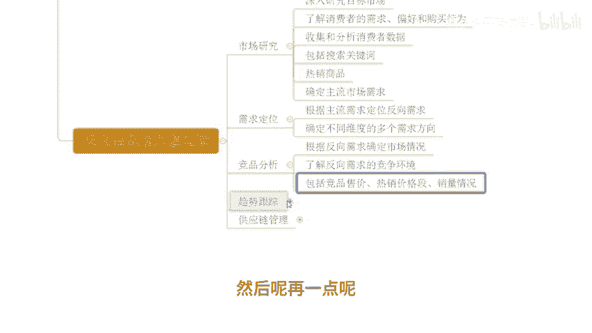

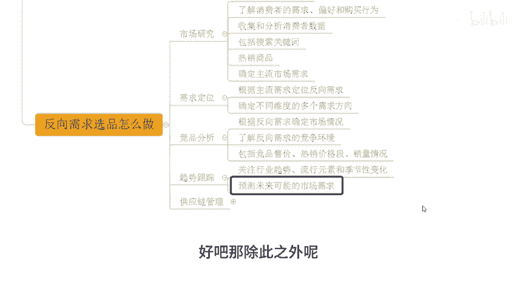

相对来说比较小的一个啊有大需求的一个市场之后，要快速切入，并且呢能够进行一个市场垄断，这是最好的那我们在操作过程中呢可以去做多链接多店的方式去做，那么形成一个搜索的一个垄断形成我们产品的推荐的一个垄断。

那么这样呢我们在后期的时候呢还要去建立我们的行业壁垒，能够让我们在这个品类里面进行一个更好的生存啊。O那么以上呢就是我们关于反向需求选品的一个分享啊。那么当然呢在这个过程中可能还到很多很他疑问。

大家不清楚，这没关系，如果说你有遇了店铺操作方面的问题啊，有需要资料的呀，可以找我好吧，同样的，那么如果说有时间的话，我也可以在一起去实做店。像小伙伴，们一起能够快速提升运营能力。

让我们店铺呢变得更好吧今天的视频到此结束，我们下期见，各位拜拜。

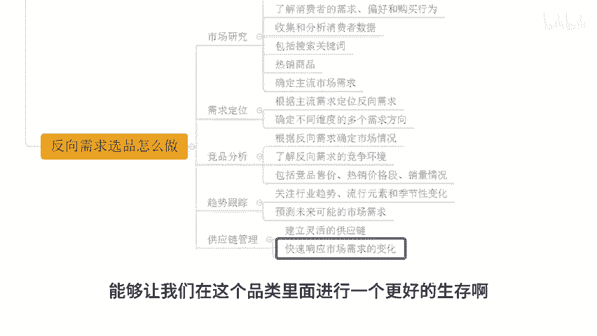

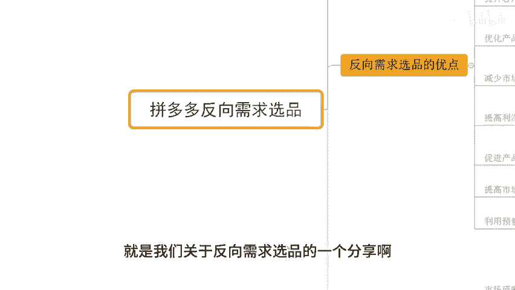

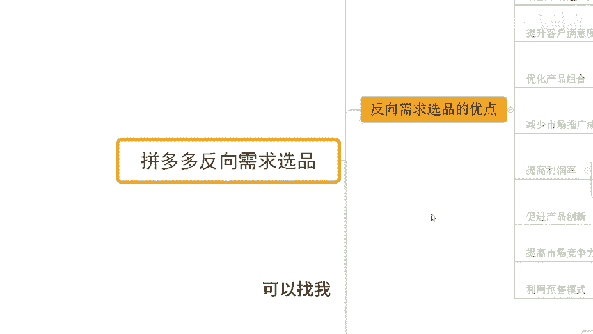

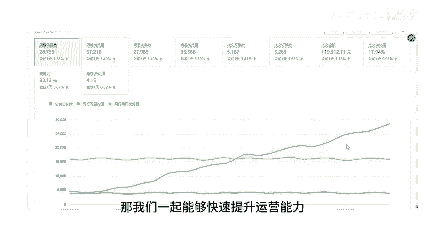

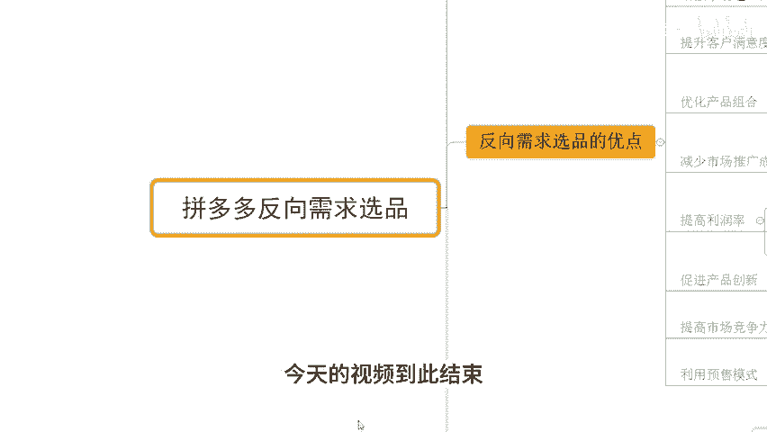