# 拼多多开店运营-新手电商运营实战指南，B站最全拼多多零基础入门教程！拼多多运营秘籍，小白也能成电商大亨！轻松上手拼多多，拼多多新手开店赚钱攻略 - P22：022 拼多多热门事件选品 - 拼多多开店运营- - BV1xms8eSEVs

hello大家好，我是谢楼。那么今天给大家分享的内容呢是我们拼多多店铺运营10种选品策略中的热门事件选品啊。那在分案之前呢，先给大家看一下近期跟的收的小伙伴他们的店铺数据，好吧。

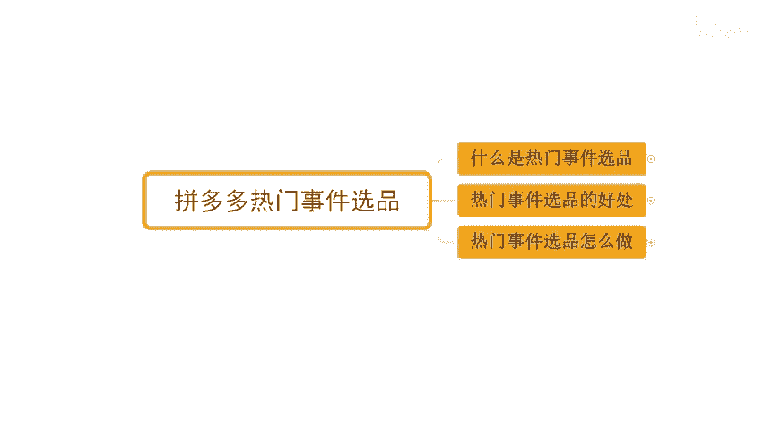

可以看到像这个店铺呢原本是一个零访客的新店。那么针对到这个店铺呢，我们针对到市场进行分析，确认了我们的呃这个经营的品类。那么在这个过程中呢也去做了竞争分析，完成了我们市场的一个定位，做了我们的选品。

那么选完品之不断操作优化，面权重可以看到啊，整体的访客呢也是提升非常快的。但后期的话一从这个访客做到了100的访客一天订单是2700多单转化率呢21。

05像这个店铺可以看到也是一个新店来的当这个店铺的数据没有刚这个店铺的好啊，因为他的客价高100多客人价啊，也是从零开始的一新店啊，最少零访客。那么通过超作优化之后呢，访客也是不断的增长。

到后期的话一天访客做到了9000多一天订单是90多单转化率做到了9。2啊。当然同样的了这种零基础的新店之外呢，一些有基础有数据的店铺？实也是有一个非常好的提升像这个店铺对吧？

原本的访客呢只有几百个100不到啊那么通过产品的结构以及我们SQ的调整。之后呢，可以在不断的增长啊，到后期的话一天访客呢我们也做到了1400一天的订单呢是1700多单，转化率呢做到11。77啊。

也是非常不错的。那么像这些店铺呢也都是通过战略的方式来操作的。如果说你想通过战略的方式来提升店铺数据，你想要通过略的方式打到爆款建可以仔细观看我分享视频好吧那店铺运营呢我多小白来会遇到很多的困难啊。

如果说你店铺操作有遇到什么问题，或者需要资料可以找我有时间的话我可以带着你一起去实操做店小伙伴运营能力那我们店铺呢更好好吧，O那么既然说今天分享内容呢叫做热门事件选品。

那到底什么热门事件选品呢看一下热门事件选品呢是根据我们这个当下或者是预期中的一些热门事件或者是社会现象或者是文化趋势等等啊，选择相关的产品进行销策略。

就这么简单啊那么这种选品方式呢可以利用我们人对一些特定事件的一些。😊。

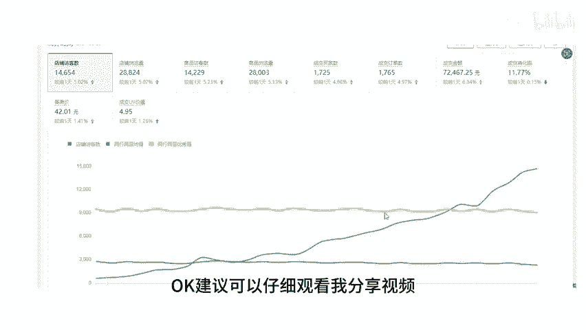

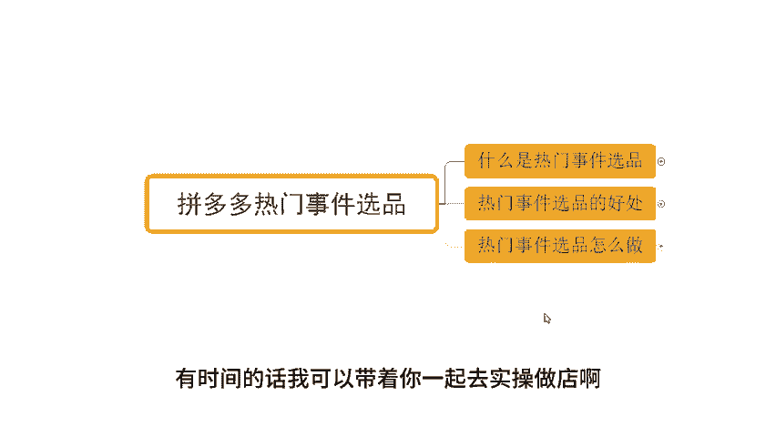

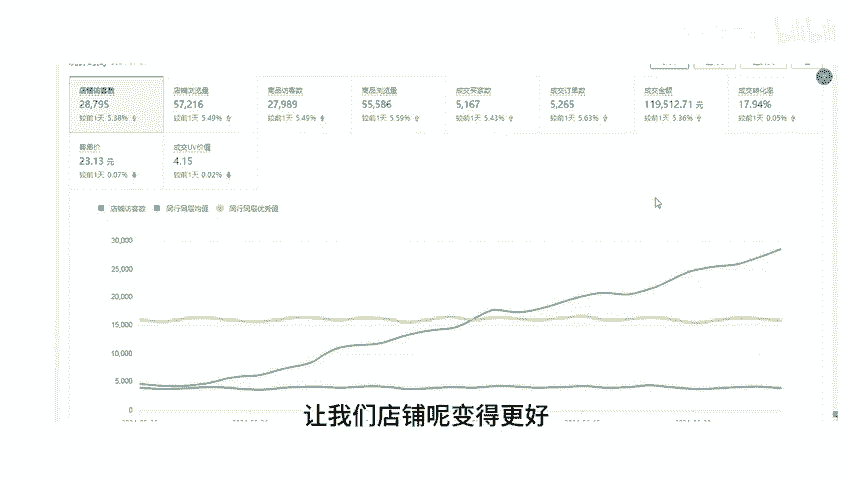

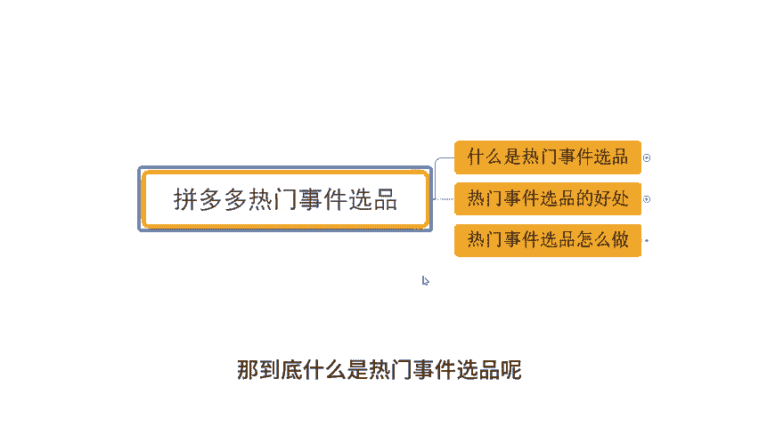

的兴趣啊来提高我们产品的销量和市场关注度啊，就比如说啊这个像今年高考对吧？那么呃这个热度很高啊，包括说我们在高考之前也会有到像这个江平事件，对吧？也会有到这种这些各种各样的事情。那么这种热度就很高。

而对应的这种热度下面可能也会产生一些产品啊，或者是一些呃对我们市场有影响的一些一些事情啊，比如说像我们江平有涉及到的这个服装款式，已经被一些知名的这个服装公司给这个买断了，对吧？这个版权买断了啊。

可能也会成为一些爆款，那么包括说像这个江平自己穿的一些穿搭啊，或者是他用到的一些所谓的文具啊，或者是这个教辅书籍啊等等啊，也都可能会成为当下的一些这个热门的爆款啊，都有可能啊。

当然呢还有像一些热门的一些事件啊，比如说一些明星的一些丑闻啊，或者明星的一些这个趋事啊，对吧？等等啊这种东西都会形成我们当下的一些热门话题来形成一些产品的热度增加的一个过程。所以我们需要关注他们哈。

那我们来具体看一看热门事件的一个寻明好处有哪些啊。首先第一个点呢可以增加我们产品的曝光度，对吧？那么热门事件呢往往会伴随着大量的媒体和公众的一个关注。而相关联的产品呢也会借此获得额外的曝光啊。

比如说当下这个我们刚讲到的江平他所在比赛中的一些穿搭，对吧？可能也会在未来的一段时间里面形成一个所谓的爆款产品出来，对吧？也会有人很多人去购买它，也都这个不可知，对不对？

那这种情况之下呢如果在借由一些媒体进行炒作，或者借由一些这个运营的一些宣传，那么可能这个产品呢就有更大的机会形成一个爆款。所以我们如果说对这方面确实刚好是有这样的一个产品的情况之下呢。

可以去提前布局去操作啊，都是可以的啊。那么再一个呢是可以提升我们的销量，对不对？😊。

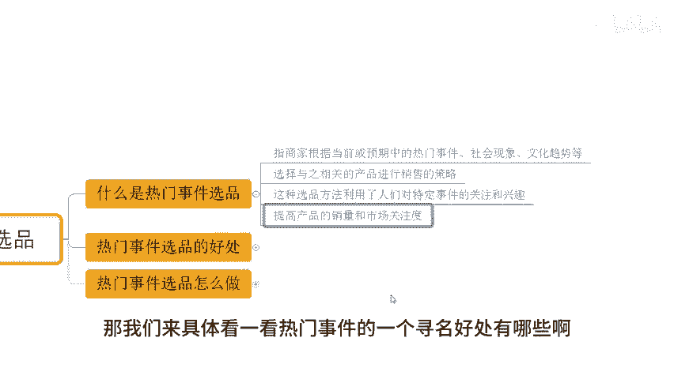

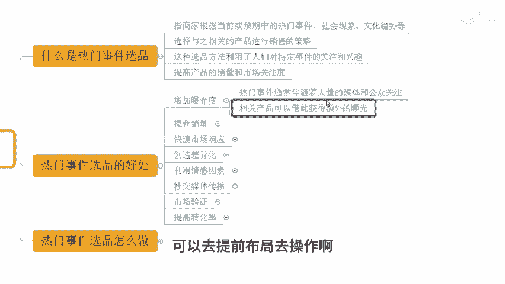

我们的这个正常人来讲的话，他对一些热门事件呢都会有比较感兴趣啊，而这种感兴趣呢也会转化成为一种购买能啊购买行为。好吧，从而呢也会提升到相关产品的一个销量，对不对？同时呢我们在做的时候呢。

能够去通过热门事件营销选品来进行一个快速的市场响应啊，那么它呢可以帮我们紧跟热门事件的同时呢去快速调整我们产品的经营策略，能够满足我们市场的需求，对吧？那么这个时候呢，我们店铺的一个权重。

或者我们店铺的一个热度呢也会很高啊，同时呢我们操作过程中呢也可以进行一个创造一个差异化啊，那么本身呢这一个热门事件的一个产品呢跟普通的商品可能也会有到一些独特性啊，毕竟他可能在前期关注的人很少，对吧？

当我们第一时间去进行经营的时候呢，可能我们的经争环境来说的话，我们同样的一个竞争对手比较少一点。所以我们也可以更加快速的进形成一个差异化的经营效果，能够脱颖而出啊，同时呢它还可以利用到一个情感因素啊。

那么。😊。

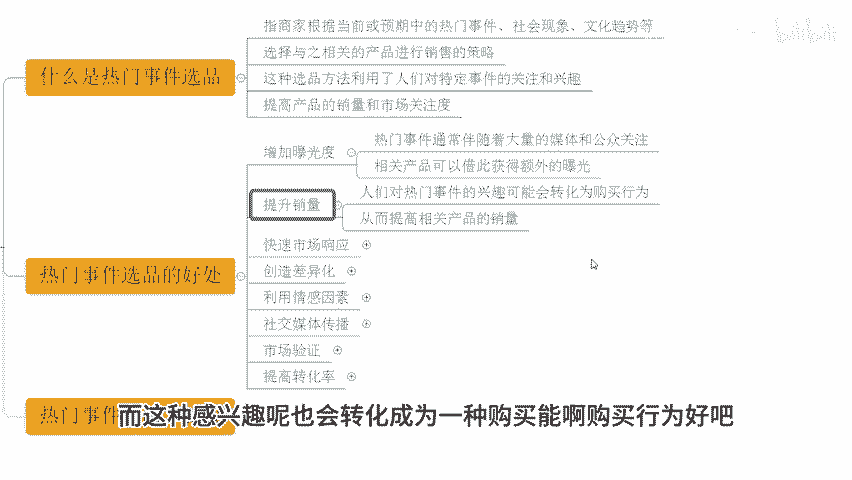

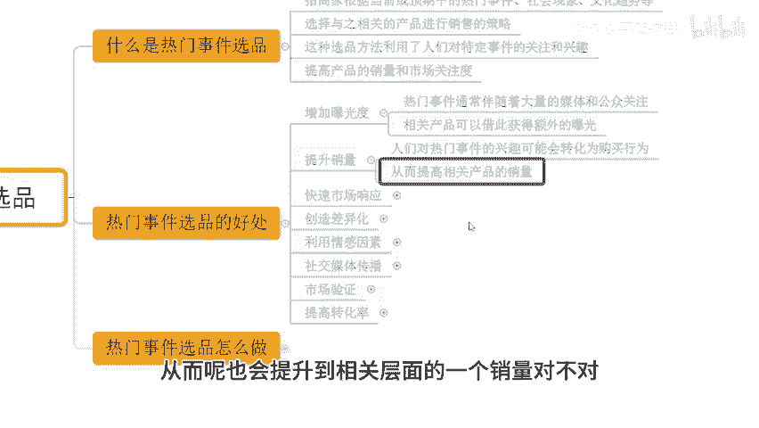

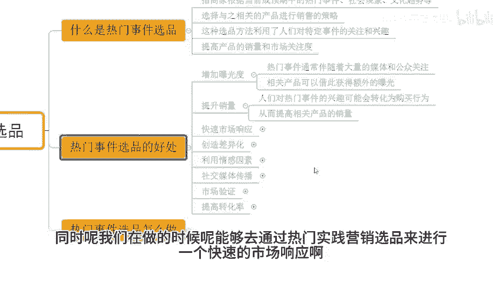

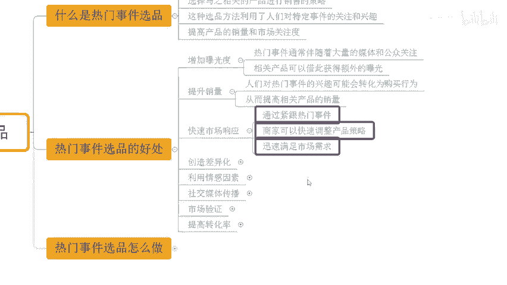

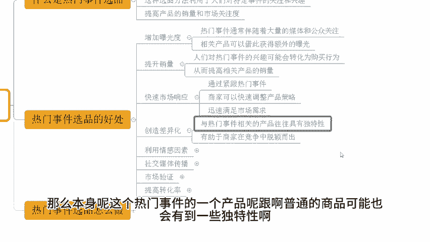

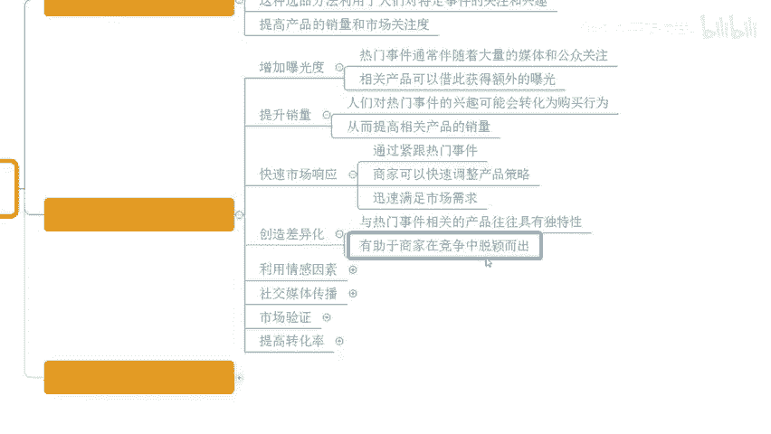

我们的这些大众啊，他对于这种热门事件呢，往往会有到一个较深的情感投入啊。那么这个情感投入呢，对于我们这些产品来讲的话，也是一个非常有利的一个点啊，它可以促进我们产品的一个消化啊。

那么另外呢就是我们社交媒体的一些传播了，对吧？那。

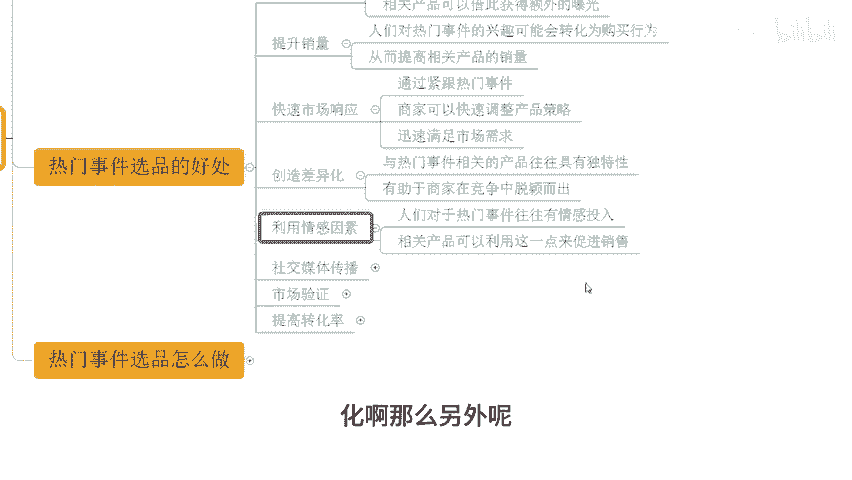

不这个都是热门事件了，那肯定会在互联网上在这个社交媒体上形成一个大量的讨论啊。那么这个过程中呢，我们的产品也可以借到啊这一个通过这种方式来进行传播啊，那同时呢这个也可以进行一个市场验证，对吧？

那么热门事件呢本身这个事件，它就是一个有非常好的市场营销的一个兴趣点赞的啊，很多人去关注它。所以说这个时候呢我们同样的相关的产品呢，他也可以降低我们市场预测的一个不确定性啊。

也能带来一个很好的产品转化啊，那同时呢可以提高我们后期的一个产品转化，对不对？刚刚我们也提到过对吧？那么本身这个消费者呢对于这种热门事件一些相关产品呢，他也可能会有到更高的这个购买意愿啊。

那么转化率呢也会更高一点啊，这是肯定的啊，那既然说到这个地方对不对？我们应该怎么去做我们的热门事件选品呢？这个东西就很关键了。

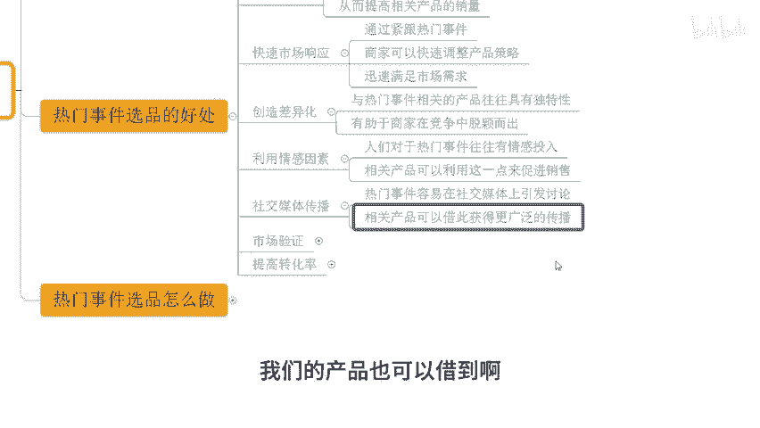

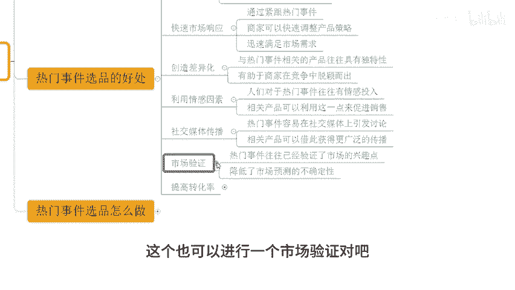

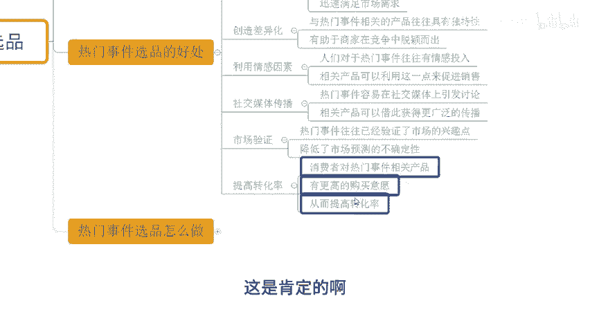

那这里呢我就不得不提到一件事情啊，就是说我们做热门事间选品，这个本身是没有错的啊，包括说我们营销都会有专门的事件营销啊，有这么一个呃方法啊。但是呢注意到一点什么东西呢？就是做这种东西呢？

它本身是一个可遇不可求的一个东西。因为热门事件或者是一些这个热度很高的一些突发性的事件，它本身就有偶然性。那么这个偶然性呢就会说我们不可控啊。

当然了不排除有一些所谓的啊比较专业的营销团队专门去制造各种热点啊，这个也不排除对吧？肯定是有的必然的啊，但是对于我们普通的商家来说的话，这种东西可能是可遇不可求的。所以说我们在经营过程中呢。

我们遇到这种事情可以快速去响应它没有问题，没有毛病。但是你不要说专门去盯着这种事情不放啊，那么如果说你去专门盯这种事情的话，你等一个月等不到，等两个月等不到，等3个月等不到等一年等不到，那你怎么办呢？

是不是？所以有的时候呢我们还是要去灵活一点啊，有到这种事情的时候呢，马上去布局，马上去操作可以那不要刻意啊。那所以我们需要干嘛呢？第一件事情呢要进行一个事件的监测啊。

我们要持续的去关注社会上的一些热门事件啊，包括说一些这个节日啊，体育赛事啊或者名人活动啊等等啊，那么这个东西都可以带来我们后期的一个针对性的。😊。

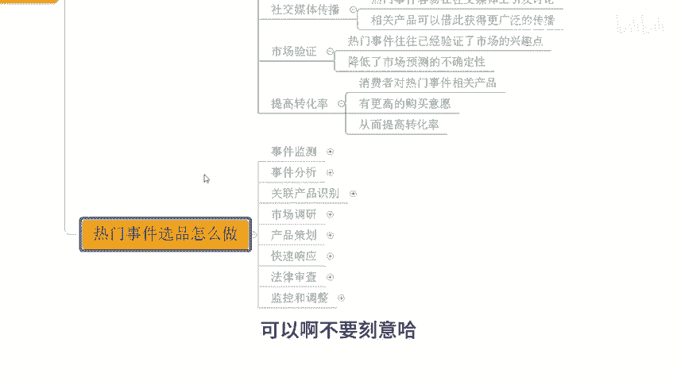

运营啊，当然呢这里有到一个点，就是说什么呢？我们需要具备一个良好的洞察力，对吧？我们需要有到一个非常好的市场洞察力。如果说你没有这样的一个敏锐的感感官的话，OK那么你可能后期经营的时候呢。

也会陷入一个被动哈。

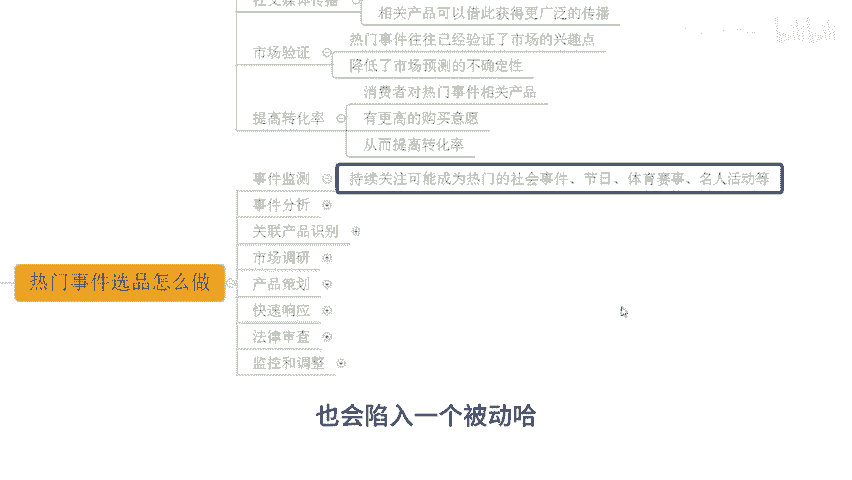

那么然后呢，当我们去观察好有这些事情之后，对不对？我们要进行事件分析，对吧？那对应的这个事件呢，它会啊有到哪些的一个受众基础，对吧？影响力的一个范围有多大，持续的时间会有多久。

那么对我们目标的市场的一个契合度高不高？如果说他在这个事件中产生的一个影响是比较轰动性的对吧？范围比较大的，并且呢能够去营造出一个非常好的和产品相关联的一个契机的话。

那么这个时候这个产品呢往往也能够成为一个非常好的产品啊，非常好的一个市场的一个爆款哈。那这个时候呢我们再就是要进行一个关联上面的识别，对不对？这个也是我们刚提到的这个点啊，那我们要确认这个事件。

它能够直接或者间接和我们产品有到哪些联系。而这些联系呢是不是能够去引发我们消费者一个兴趣。如果是的话，O那么话不多说，赶紧上啊，那做好我们市场调研之后呢，可以开始产品操作了，对不对？

我们要去调研清楚我们产品和我们这个消费者之间关注的。😊。

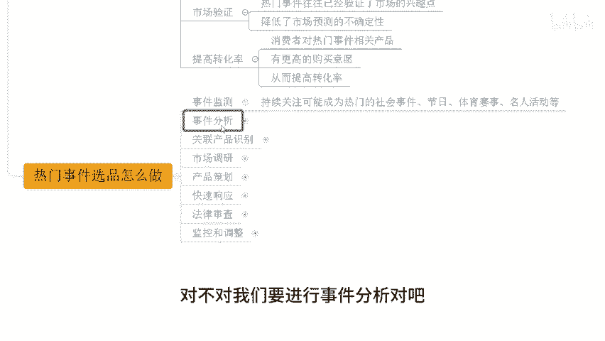

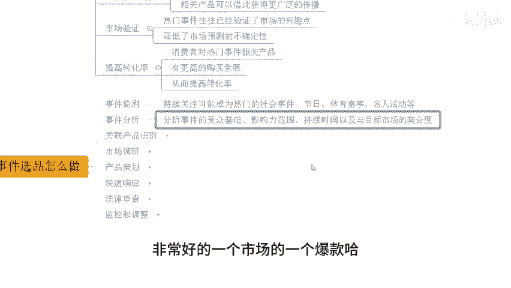

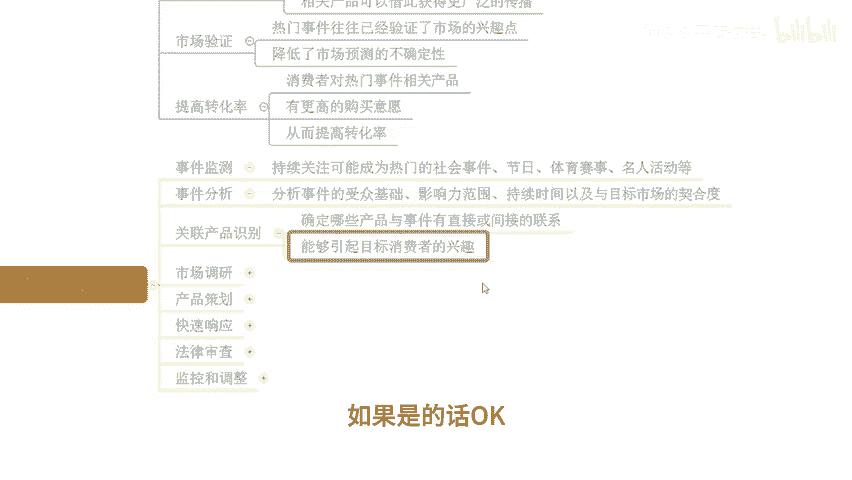

个度怎么样对吧？他们会不会对我们产品呢有到这样一个需求？如果是有需求，那么这个营销在后期就可以马上进行啊。那么产品策划方面呢可以看一下啊，那我们要根据我们这个事件的特点呢进行产品营销。

包括说我们可以去制作一些或者设计一些产品的这个限量版或者是事件相关主题的一些产品对吧？当然呢这个呢是针对到我们的一些具有产品开发能力的一些厂家来的对吧？比如说像之前啊就会有到这个中分头的玩偶啊，对不对？

还有像什么沙雕啊对等等这种产品啊，啊，也都是非常非常有意思的一个事情啊。那么另外呢就是我们像这个整个的经营过程中呢，就是我说的我们需要有个敏锐的动产力，并且要有一个快速响应时间，对吧？

那么如果说你没有办法第一时间去进行这个操作的话，可能你就过了这个时效之后呢，你再去操作的时候呢，整个产品一个热度就低了啊，就没有办法很好经营了啊，当然了还有一点就是我们要去。

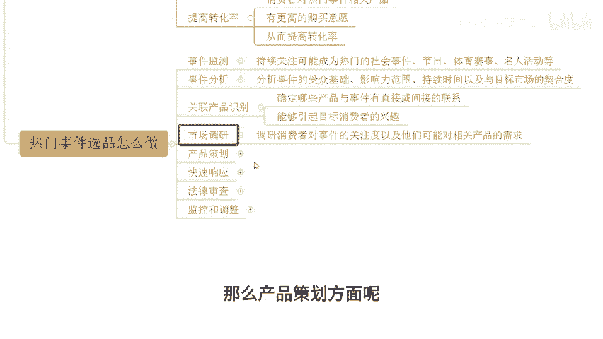

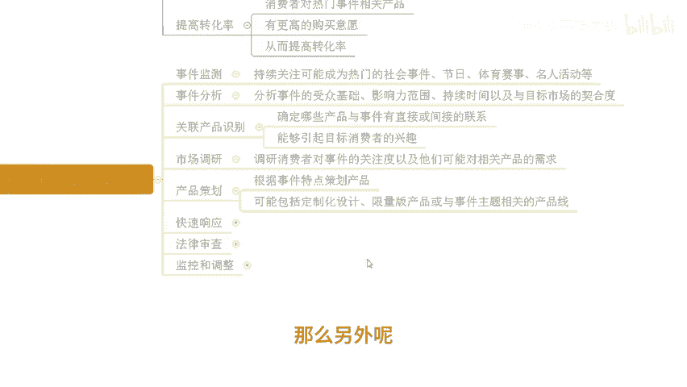

有到一个非常好的法律意识啊，我们要对我们产品呢进行法律的一个审查，对不对啊，确保我们的营销的一些材料啊，包括说我们产品本身呢有这个没有这个不侵权版权或者没有这个商标法的一些这个后续的一些影响问题啊。

那么这个是非常非常重要的。同时呢我们在经营过程中也需要去监控观察好我们的一数据？我们监控我们市场数据的变化市场的一个反应，也要及时的去根据我们数据反馈来调整我们的经营策略。

如果说这个热度开降了事已经开始对我们产品影响没有了，那么我们也要及时的去调整我们未来的经营方向来避免说我们这个热度掉了之后呢，整个店铺就呈现出一个实际形成的一个状态们要做好衔接。

能够去推出其他的产品进行一个迭代，这常重要的吧啊，那么以上呢就是我们拼多多的热门事选品的一个分享。当然在店铺运营过程中更多体的问题。如果说你有店铺问题啊，有需要资料的呀，可以找我啊。同样的。

如果说有时间的话。😊。

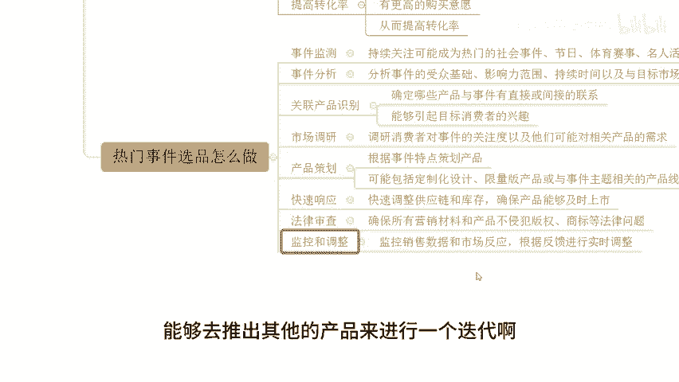

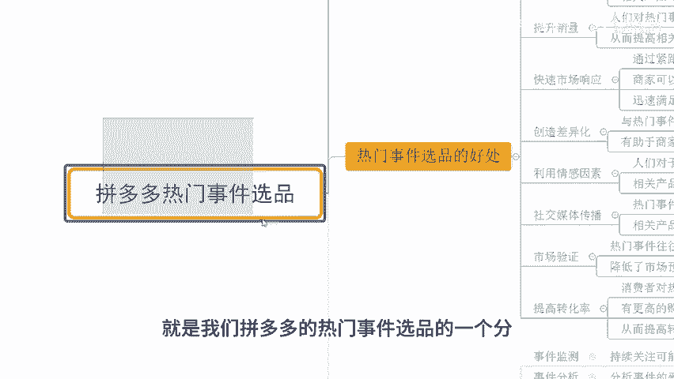

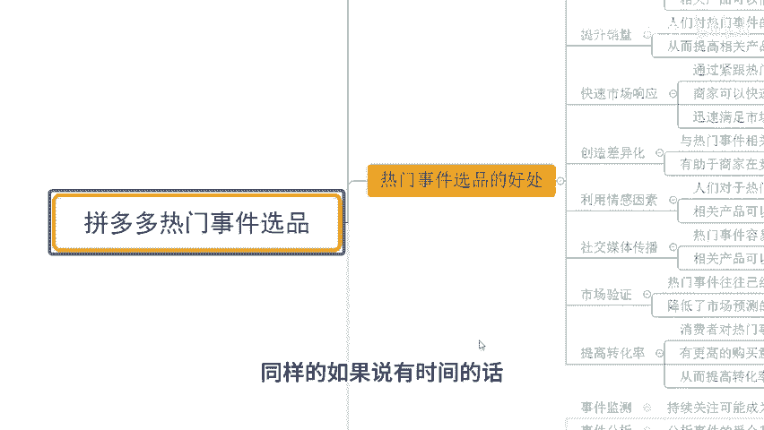

可以带你们一起去实操坐垫啊，就像这些小伙伴一样的，我们一起能够有到更好的方法去操到店铺，让我们店铺呢能够达到更好的提升，达到更好的效果。好吧。OK那么今天的分享呢就到这里，我们下期见，各位，拜拜。😊。

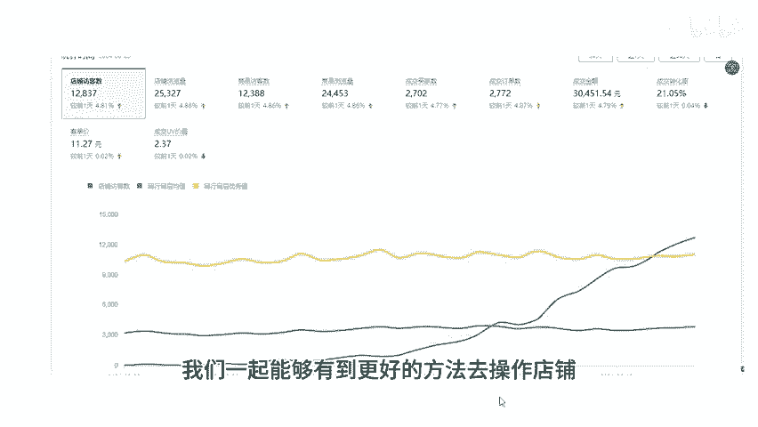

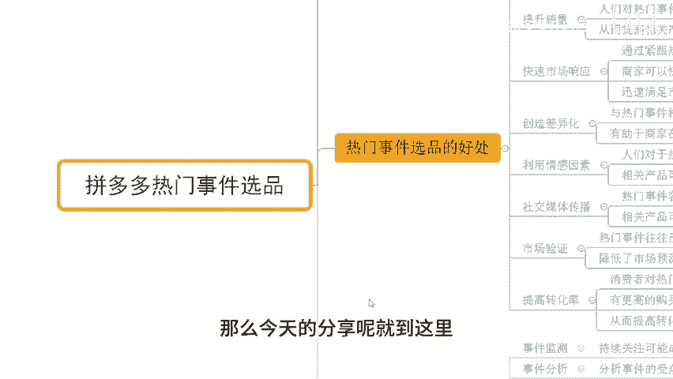