# 拼多多开店运营-新手电商运营实战指南，B站最全拼多多零基础入门教程！拼多多运营秘籍，小白也能成电商大亨！轻松上手拼多多，拼多多新手开店赚钱攻略 - P24：024 拼多多店铺运营新品起流量方法 - 拼多多开店运营- - BV1xms8eSEVs

Yeah。hello，大家好，我是西楼。那么今天呢给大家分享的内容呢是我们拼多多店铺运营新品请流量的方法啊。那么这一套方法呢会有到非常非常多重要的内容。而这些内容呢，对我们店铺来讲意义非常非常重大啊。

当然呢在具体分享具体的内容之前呢，还是老规矩，先给大家看一下近期跟着实操小伙伴他们的店铺数据，好吧。😊。

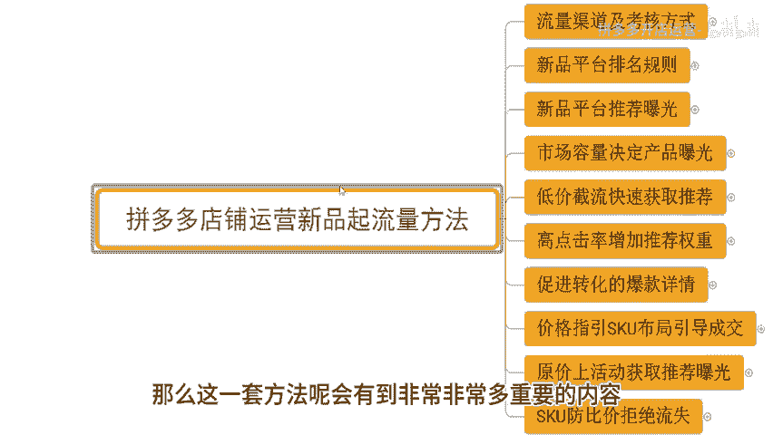

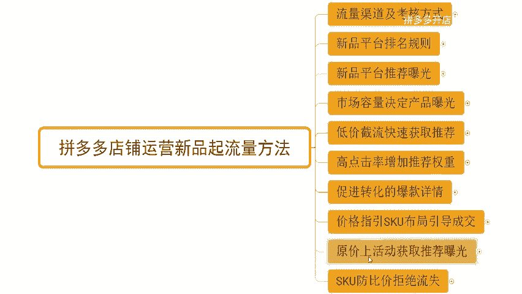

那么像这个店铺大家可以看一下，是一个从零开始的新店啊。那么像类似这种小伙伴呢，在我们日常运营过程中呢会遇到非常非常多，对不对？可能是刚开始接触到我们拼多多这个呃平台的啊。

也可能是刚开始接触电商的都很多啊，都是从零开始的。那么有很多小伙伴呢也会担心说哎那我刚开始接触拼多多现在去做会不会比较晚，那么这里数据会告诉大家啊，其实不晚的，只要我们想做任何时候开始都可以。

只不过呢越早做呢，可能我们整个的提升会更快，我们的经营难度会更低啊，就这么简单，对吧？像这个店铺呢早期的时候呢，我们一开始完成了我们市场分析，完成了我们竞争分析，确认了我们的这个主推爆款之后啊。

完成了会员对接，就开始上架商品来不断的操作。而整个操作过程呢，经过一段时间的累积之后，商品的群重呢也在不断的增长啊，可以看到，到后期的话整个访客提升非常非常快速啊。那么从最早的临访客一天啊，到后期一天。

😊，房客呢19000将近2万啊。那么一天的订单呢是2300多单，转化率呢12。07%。非常的不错，对吧？当然呢除了像这一种啊，没有数据，没有基础的新店之外，一些有基础有数据啊处于一个瓶颈状态的店铺。

那么同样跟着时操也是能够得到很好提升的。可以看到像这个店铺原本的访客只有几百个对吧？那么而且呢卡在这个几百个呢已经非常非常长时间了。那么跟着实操之后呢，我们完成了产品结构的调整，完成了SQ的调整。

而且重新呢针对到我们产品的转化的一个引导做出了一些营销的一个调整啊，那么到后期的话，整体的转化啊，提升之后，访客也在不断的增长啊，而且增速非常快啊，到后期可以看到从几百个访客啊。

直接涨到了9000多将近1万啊，一天的订单呢是1200多单转化率呢13。12啊也是非常不错的啊，还有像这个店铺啊，同样的。那么到早期的时候呢是2000多访客啊，到后期的时候呢。

也通过不断的优化调整之后呢，从2000多访客呢直接干到了2万多。😊，对吧一天的订单呢是1900多单，转化率呢9。37啊，也是非常不错的。那么这些店铺呢也都是通过自然流的方式来操作的啊。

那如果说你想知道如何通过自然流来操作店铺。如何通过自然流来打造爆款。OK那么建议呢可以仔细观看我分享视频。好吧，那么这一次呢给大家分享内容呢叫做拼多多店铺运营心平其愿的方法啊。

那么这个情求的方法呢是围绕着我们前期在做店过程中重点需要去注意的一些事情，并且能够做好这些事情之后，为我们店铺呢快速起爆带来一定的一个争议啊。那么可以看到，首先第一个点呢。

我们要了解清楚的就是我们的流量渠道和考核方式。😊。

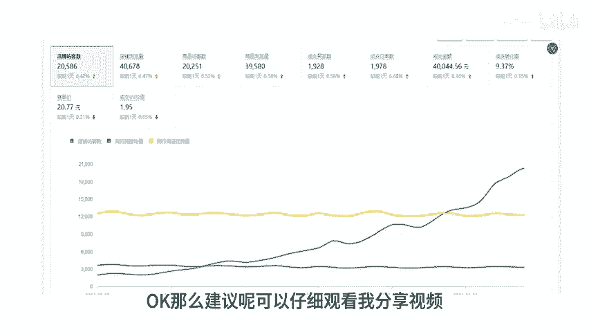

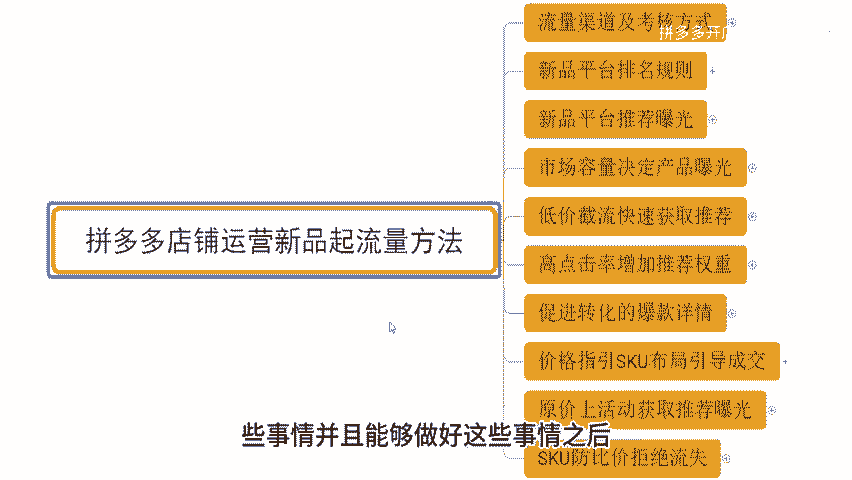

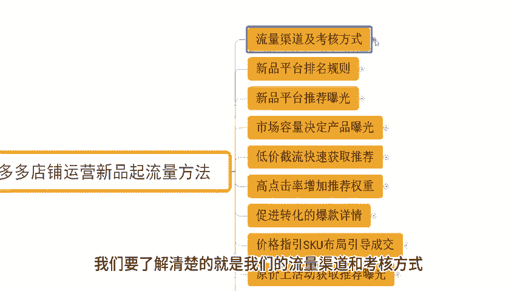

那么这里呢会介绍到各种各样的一个流量渠道。而这些流量渠道哪些它的考核内容是什么？哪些它的具体一个流量来源是哪里，对不对？怎么去帮助我们更好的加速，哪些是我们更加容易获取的。我们搞清楚搞清楚这个之后。

然后在针对到对应的一些排名规则啊进行研究。那么研究了解清楚之后呢，掌握规则运用规则，并且呢能够利用到这些规则呢，完成我们整个商品的排名提升，得到更好的推荐，得到更好的曝光。那么这个就是我们要做的事情。

那其实做运营的话，方法再怎么变化，它都是基于规则变化而来的，对吧？当我们了解规则之后，能够充分意义上去运用规则的时候，我们才能够真正意义上掌握到我们运营的一个技巧。好吧。

那么同时呢我们还要了解清楚就是我们平台的一个新品推荐的一个机制，对吧？那么新品标签是什么？为什么会推荐新品。而我们如何去获取到新品加权。这个东西我们搞清楚有了这样的一个了解之后呢，我。😊。

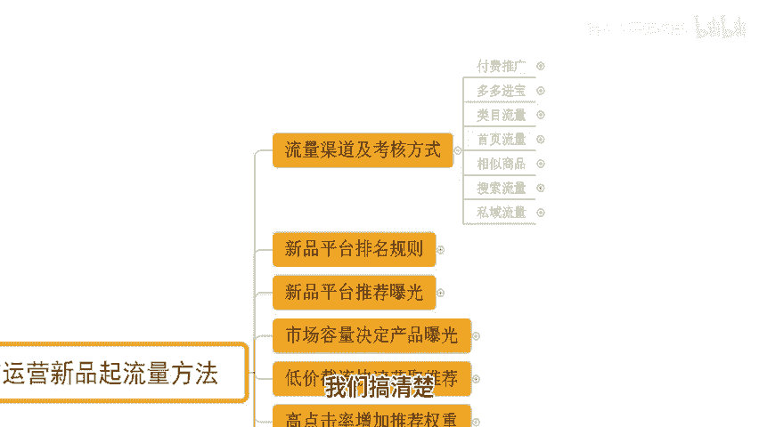

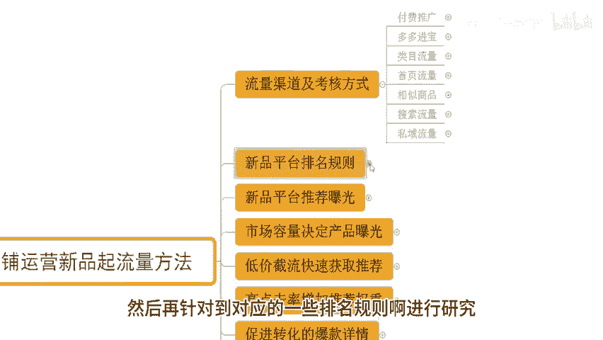

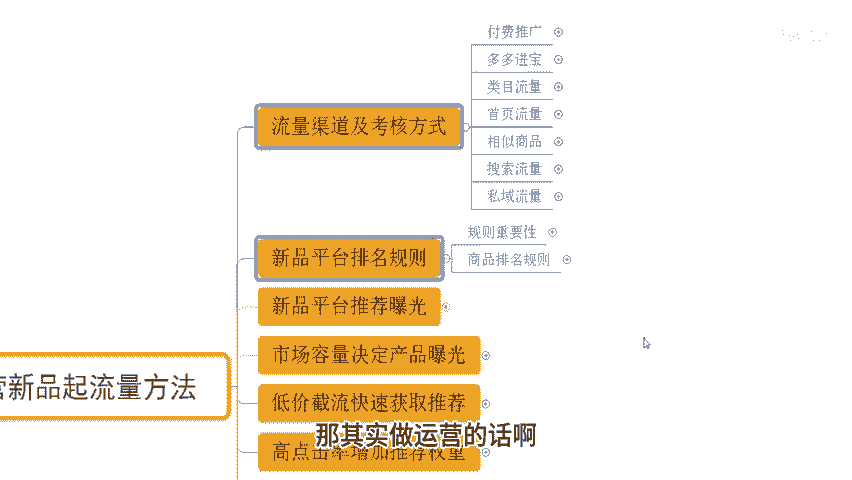

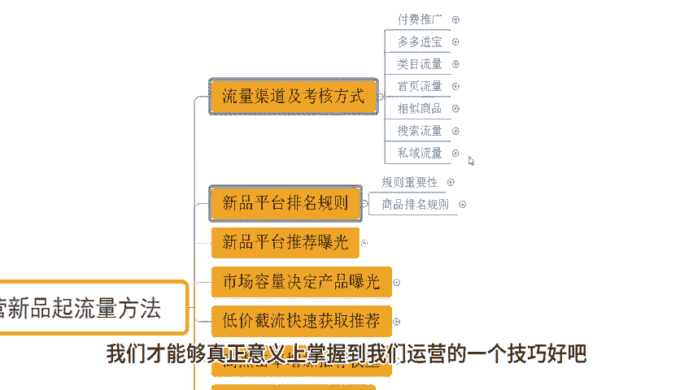

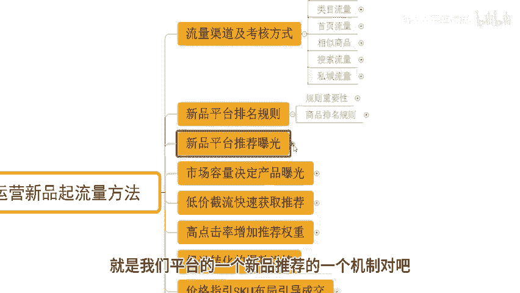

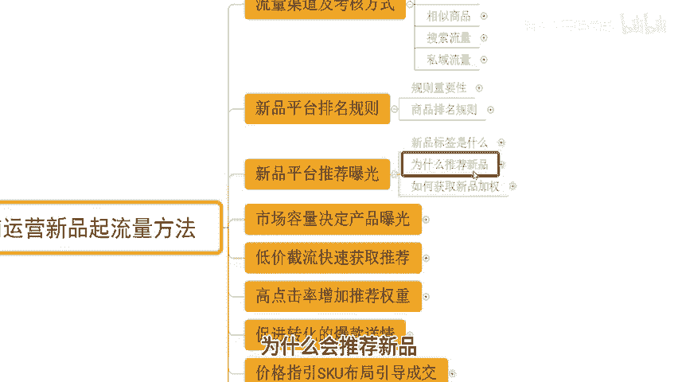

在做店铺的时候，就能够去利用到新品扶持这样的一个规则呢，完成产品的曝光获取，得到更多的展示，对吧？同时让我们的起报难度呢降低啊，那么了解完的这个过程中呢，我们还要清楚知道就是我们的市场容量啊。

它和我们曝光质量的关系。

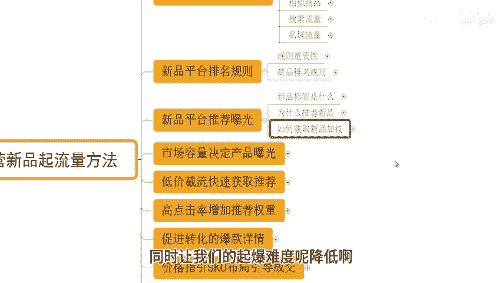

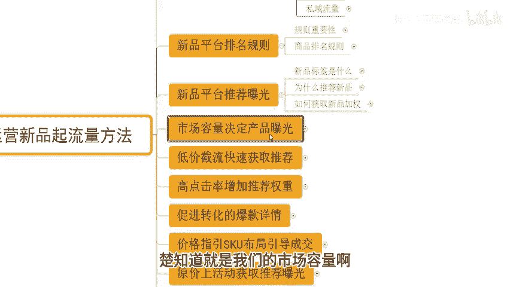

那么如何去选择到一些市场容量更大的产品，拿到更多推荐，得到更好的曝光，让我们产品呢在整个的竞争环境里面处于一个更加良性的一个状态，对吧？能够去让我们产品呢有到更多的机会。

那么这个就是我们选品的一个一个技巧了啊，也是我们在整个的经营过程中需要去重点去留意的一个事情。因为一开始如果说你选择的市场有问题，你经营的方向有问题。那么后期你所有的这个计划，那么都会受到影响啊。

所以说它是一个最基础最核心的板块也是牵一发而动全身的啊，当我们了解清楚这些之后呢，我们还要搞清楚就是平台的一些推荐机制，什么推荐机制呢？低价的一个推荐机制啊，那么平台上呢有很多的同行。

他们会利用到一些低价的玩法来打造爆款，对吧？那我们如果说有这样的一个产品优势，我们可以去运用它。如果说我们没有这样的优势，我们应该如何去了解它他们的运营逻辑是什么？应该怎么去杜绝它，对吧？

我们从分搞清楚，那么搞。😊。

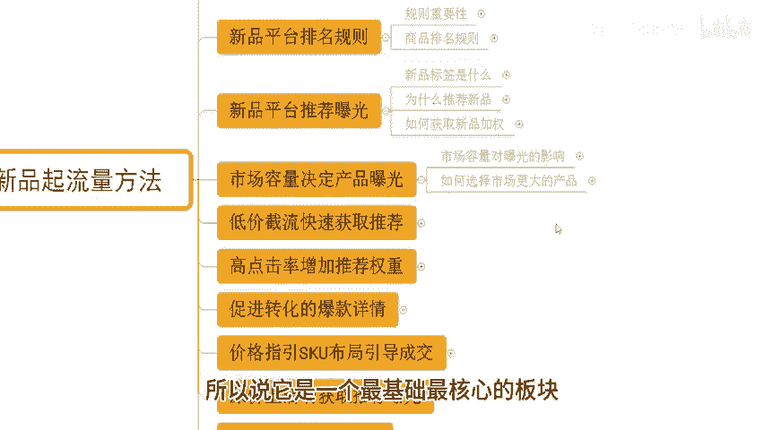

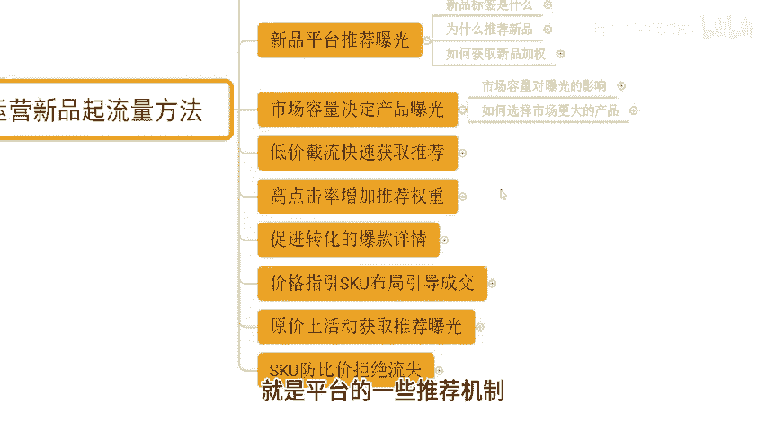

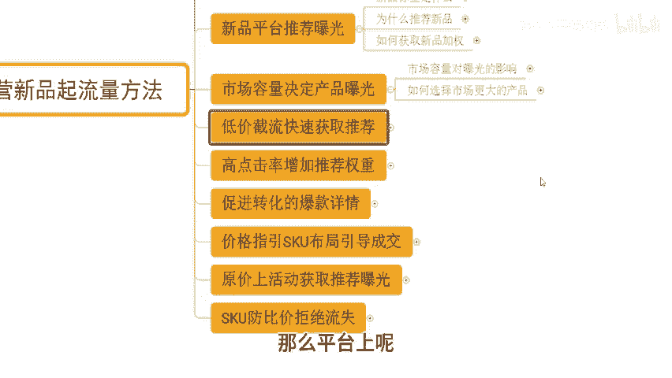

清楚这些东西之后呢，我们在后期的经营过程中才会有到一个更好的这个经营方向。包括说我们的一个啊操作呢你才会更稳定，对吧？同时呢我们要了解清楚，就是我们在经营过程中，我们产品如何去获取到更高的推荐权重。

那么在我们数据考核中，如何去完成更高点击的一个提升。😊。

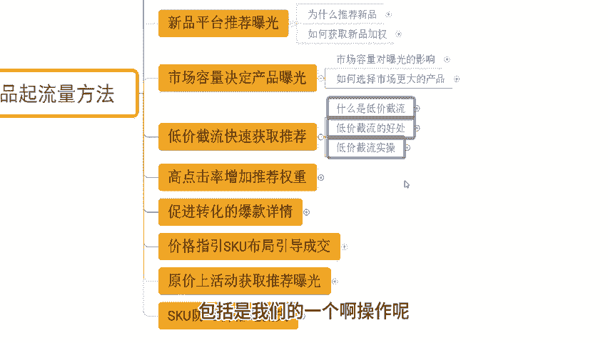

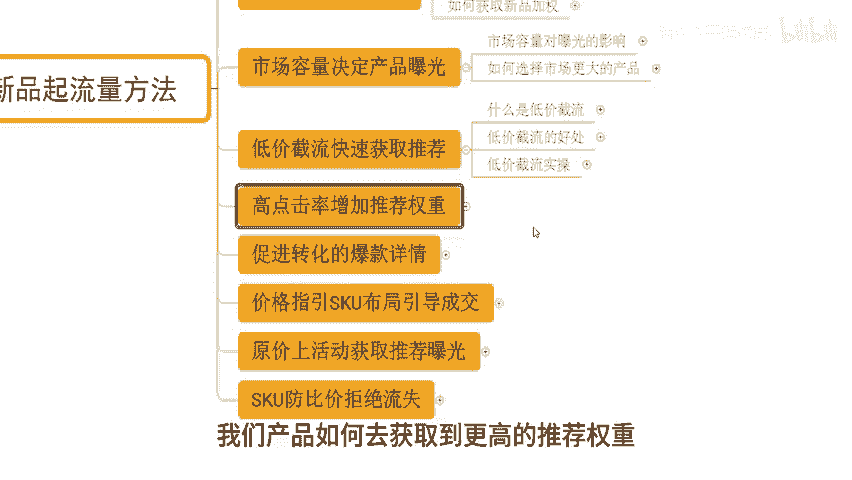

点击率对我们店铺来讲是非常非常关键的，对不对？商品的权重。可以说在数据层面上来讲，第一个考核数据就是点击率。如果说我们产品在获取曝光之后，你说哪个数据对我们的访客数据影响最大，那么一定是点击率。

当我们获取到曝光之后，相同曝光情况之下，点击率越高，那我们整体访客也就越高的对吧？所以我们想要去有到更多访客的话，那么一定要去提供到更好的更优质的图片来完成点击的获取，得到更好的产品展示。

从而得到更多推荐，也能够去完成更加精准的引流之后，帮助我们店铺得到更多的转化啊，带来更好的一个产品的后期点击反馈，对吧？同时呢。😊。

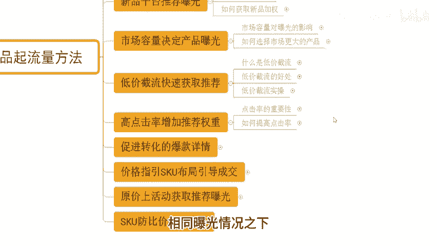

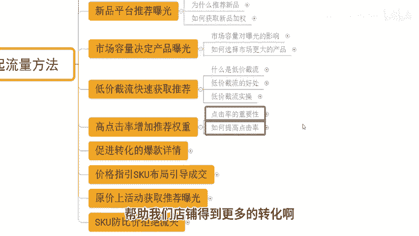

确保转化呢，也不光是说我们去能够有到很好点击就可以了，对吧？我们还要去通过我们啊产品图片的一个输出来说服我们消费者来满足我们消费者的一些需求，或者是来进行一些盈利的一个打消，对吧？那么在这个过程中。

我们如何去说服我们的消费者，对吧？我们应该如何去规划我们产品详情怎么样去让我们用户呢看到我们详情之后，了解清楚我们产品的一个优点，或者知道我们产品的特点之后，并且愿意为我们产品进行买单。

这个也是非常非常重要一个点，对吧？那么很多时候啊我们在进行店铺运营的时候呢，呃产品转化差，啊，可能有价格方面的原因，可能有SQ的一个原因，对吧？也有可能就是我们图片的原因。😊。

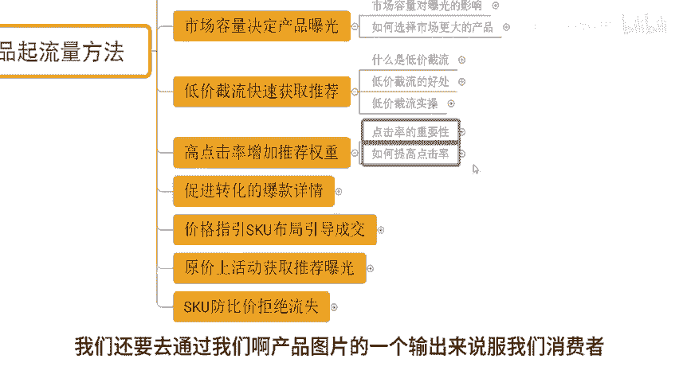

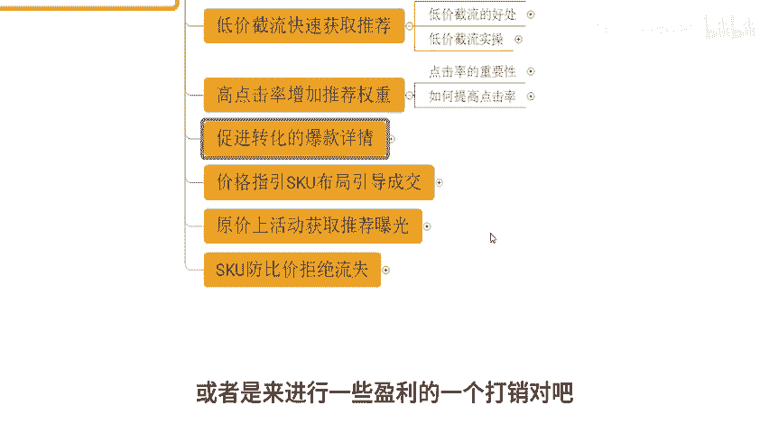

甚至我个人认为啊。图片策划的影响是呃相对更大的啊，在某种意义上来说，为什么这样讲呢？因为首先第一点啊，产品的价格呢是在我们发布商品的时候就已经有的那我们进店的用户呢。

他已经是属于我们引流的这个价格段的人群了。😊。

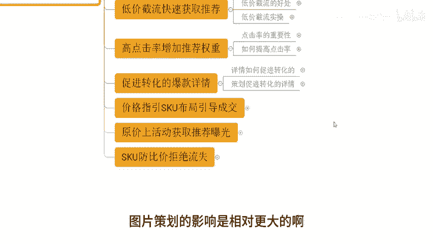

这个价格段人群引流过来之后，他不转化。无非就是我们产品的内功没有做到位，而内功里面的话，像我们的SQO像我们的图片，像我们的这些销量和评价等等这些东西都有影响，对吧？

那么其中呢图片是我们用户最直观了解我们产品的一个重要途径。那我们图片呢没有办法去打消用户疑虑，或者没有办法去体现出我们竞争优势的话，那么肯定转化会受影响，对吧？那我们如何去做我们更好的产品详情。

如何去体现我们产品卖点，这个是我们必须掌握的一个事情那么到这地方搞清楚它之呢，还要解清楚就是我们产品的SQ布局对吧？我们刚说了，要去拿到更好的转化。那么我们的内功非常非常重要。

那么内功里面呢就有到非常重要的环节，除就是我们的图片之外呢，还有就是SK那么SKU应该如何去做好它，对吧？它对于我们转化到底有什么影响。

我们应该怎么去设置它能够去让我们消费者呢更加好的更加方便的来选择我们产品，而且。😊。

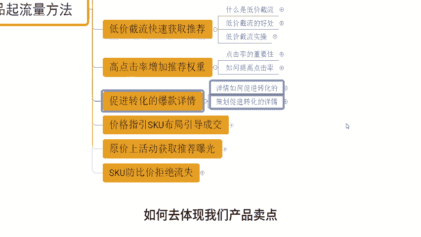

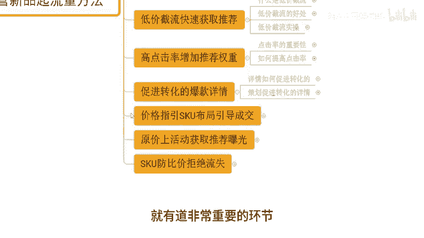

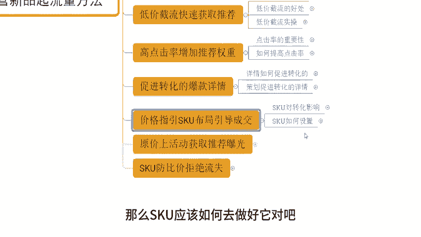

做决策，这个也是我们必须去掌握的一个事情。掌握好这个之后呢，O那我们用户呢在我们店铺呢就能够更加容易去下单啊，能够去帮助他们完成决策的同时呢。

我们的转化率提升那我们整体的客单价也可以得到一个更加稳定的一个增长。包括说我们的产出也能更稳定。优惠价值也能更高。那么我们整个上品群众呢也会呈现出一个滚雪球的状态，越滚越多，越滚越大推荐呢也会越来越多。

反馈也会越来越多，数据反馈越来越好。好吧，那么搞清楚这些东西之后呢，我们后面还要去了解清楚就是我们如何实现原价上活动的操作，或者是我们要了解清楚就是活动对我们平台来讲的话，它的重要性对吧？

那么它的推荐权重很多啊那么这些推荐权众我们如何去通过上活动来获取。如果说有遇到平台卡价格，那我们应该怎么去规避卡价格这个操作导致我上活动的一个限制，对不对？那么这样呢能够去得到更多推荐的同时呢能。😊。

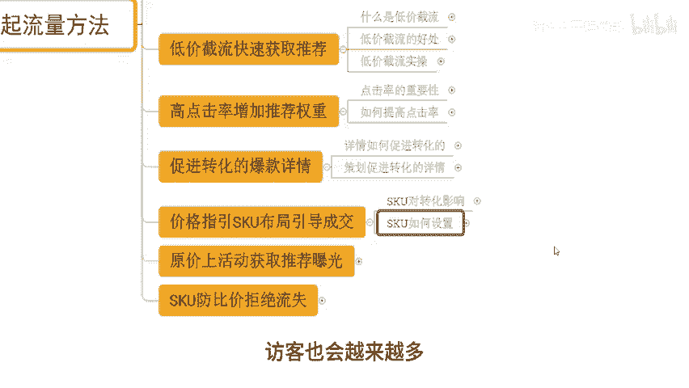

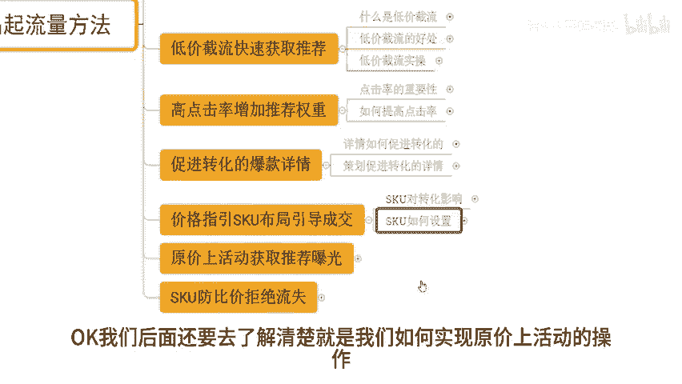

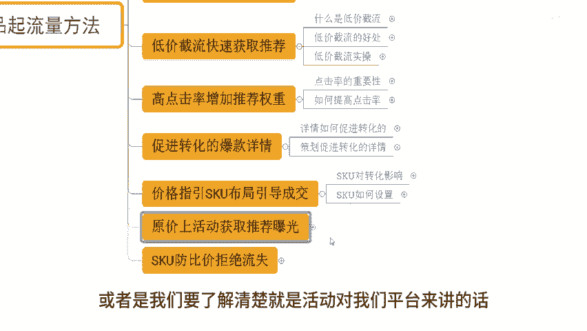

能够去减少我们的一些这个呃因为不能报活动的一个流量渠道的损失，对吧？同时呢我们还搞清楚就是仿比价的一个操作啊，那么其实这个仿比价呢跟我们之前讲到的这个呃低价节流的一个玩法呢，他们俩是相辅相成的。

如果说我自己产品呢能够去有价格竞争优势，那我们要去做到的就是去比价去能够帮我们完成更多的一个节流。如果说我们没有价格优势的话，那么做仿比价就是必须的。那我们保证产品的曝光得到更多推荐啊。

从而呢拿到更好的产品展示啊，它是这样一个一个逻辑来的。那么这些所有的内容，所有的细节呢，在后面的分享里面呢，我会给大家对对大家进行详细讲解啊，大家不用着急。那么店铺操作呢它有很多很多的方法跟细节。

这里呢我也反复强调一下，对不对？那么每一个点每一个细节呢，大家要去深入研究，并且能够结合自己产品去做好它那么先再多的视频看再多的直播也好，对？对我们店铺提升其实是有限的。那么真正意义上提升我们店铺数据。

😊。

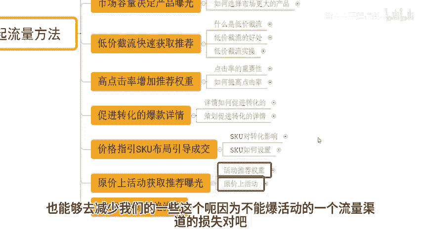

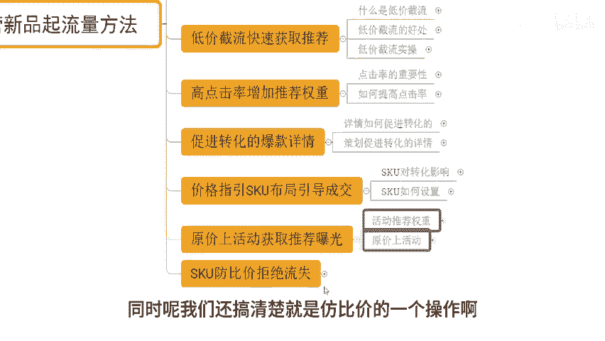

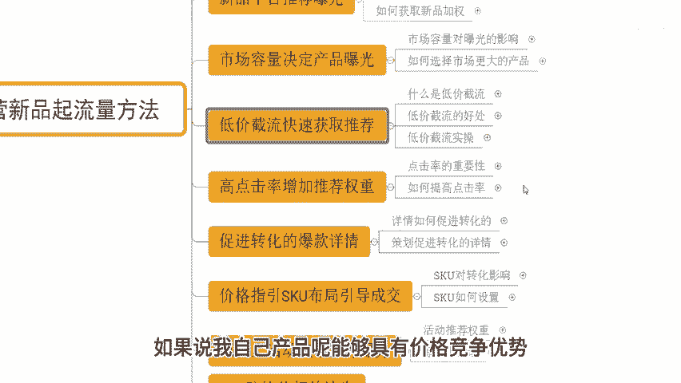

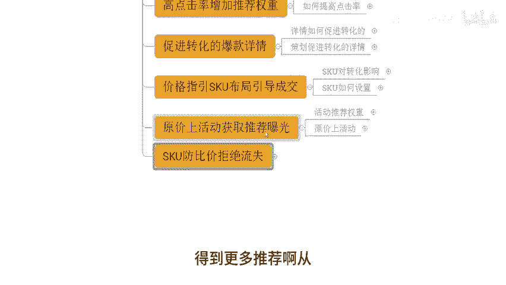

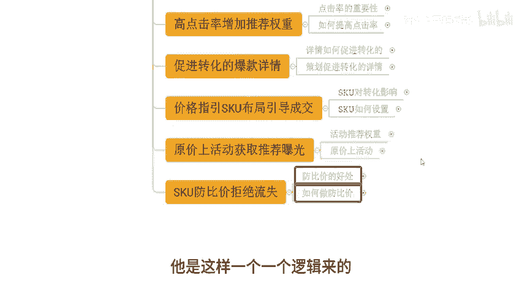

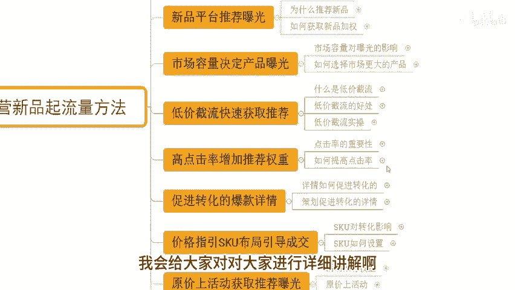

是实操。所以说看视频呢可以提升你的知识储备啊。那么如果说你自己在累积提升的时候，确实对于店铺的帮助比较有限的情况之下，或者是提升比较缓慢的情况之下，okK的，也可以选择更我实操。好吧。

就像这小伙伴一样呢，我们一起能够有到更好的方法之后，能够去快速提升我的运营能力，能够去操作好我们店铺让我店铺呢达到更好的水平。好吧。那么包括像我们小小伙伴，如果说有什么店铺操入方面的问题啊。

有需要资料的呀，可以找我好吧。那么今天的视频呢就到这里，我们下载见。各位拜拜。😊。

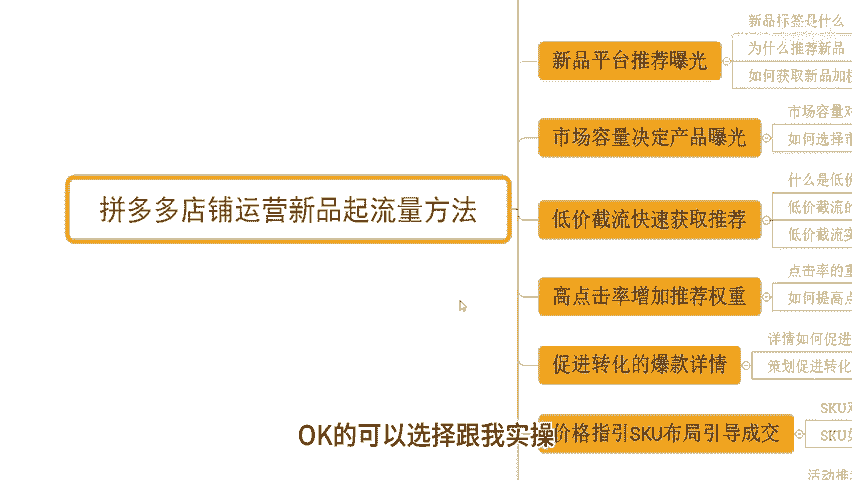

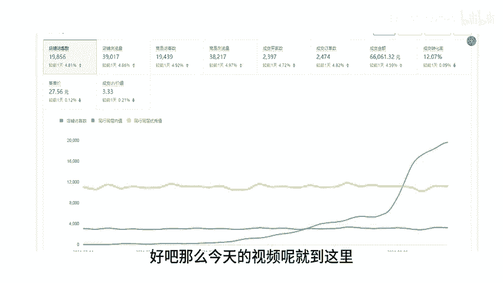