# 拼多多开店运营-新手电商运营实战指南，B站最全拼多多零基础入门教程！拼多多运营秘籍，小白也能成电商大亨！轻松上手拼多多，拼多多新手开店赚钱攻略 - P25：025 拼多多流量渠道及考核方式 - 拼多多开店运营- - BV1xms8eSEVs

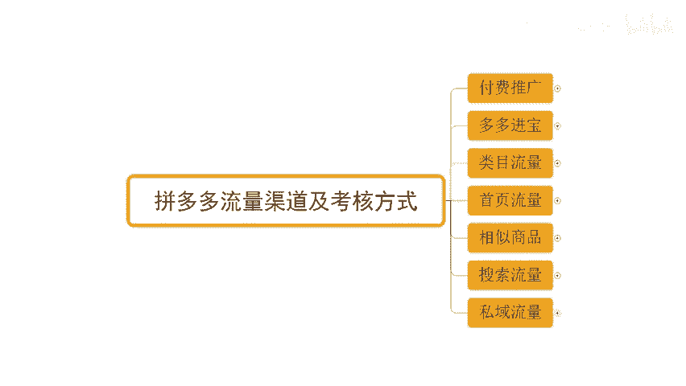

hello大家好，我是谢楼。今天给大家分享的内容呢是我们拼多多店铺运营商品及流量方法中的拼多多流量渠道及考核方式的一个内容啊。在分享之前呢，先给大家看一下近期跟着时尚小伙伴他们的店铺数据，好吧。

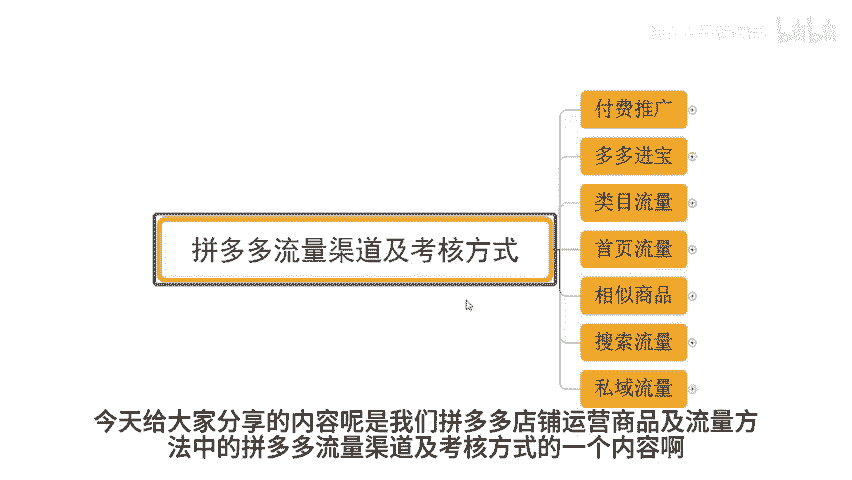

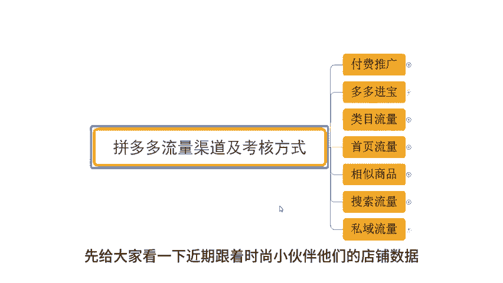

可以看到，像这个店铺啊，原本的访客在2000多成年不到啊。那么跟着实操之后呢，通过我们针对商品的结构的调整，通过我们对产品SQ的一个调整，对吧？完成了后续转化的引导。当我们转化提升之后呢。

OK访客是可以得到不断的增长的啊，所以这个店铺呢在优化之后，访客可以看到非常快速稳定的方式在往上冲。到后期的话，一天的访客呢从原本的2000左右做到了2万多。订单的话做到了1900多单啊。

那么转化率呢9。37%啊，非常不错。当然呢像除了这个店铺之外，还有像这个店铺也是的啊，那么这个店铺呢原本访客只有几百个，对不对？那同样的通过对我们产品结构的调整。通过对我们SQ的一个调整优化。

通过对我们转化率的一个优化O的那访客也在不断的增长啊，到后期的话，一天访客呢做到了9000多将近1万啊。那么一天的订单呢是1200单转化率13。12%啊，也都非常不错的。当然呢。

除了像这种有基础有数据的店铺之外，一些零访客的新店对吧？同样跟着实操呢也能得到一个非常好的提升啊，可以看到像这个店铺来，那么原本呢是零访客的一个店铺对吧？没有任何数据的那跟着实操之后呢。

首先我们针对到市场进行分析，完成了我们的竞争分析和选品之后开始上线产品不断的操作优化，我们产品的技术权重，等到一段时间的数据沉淀产品的一个权重累积足够之后啊就会发现。😊，访开始不断的往上增长。

从呈现出一个非常快速的一个爆发过程啊。那么由其到后期可以看到，一天访客呢做到了19000将近2万啊。那么一天订单呢是2300多单，转化率呢12。07啊，而像这个店铺原本呢访客也是你的一个店铺啊。

访客呢在经过调整优化之后呢做到了29000啊，一天的话是1700多单啊，当然呢这个店铺因为客价比较高一点，而且做的是鞋子啊，所以转化率比较低啊，只有5。99转化率啊。

但是呢这些店铺都是通过自然流的方式来操作的。那如果你想要知道如何通过自流来操作店铺，你想要知道如何通过自流来打造爆款O那么建议呢可以仔细观看我分享的视频，好吧。

店铺运营呢对于我们很多的新手小白来说呢会非常的困难，对不对？啊很正常。因为毕竟是一个陌生的领域啊。那如果说你有什么店铺操作方面的问题呀，有需要资料的呀，可以找我有时间的话，我也可以带着你一起去实操做店。

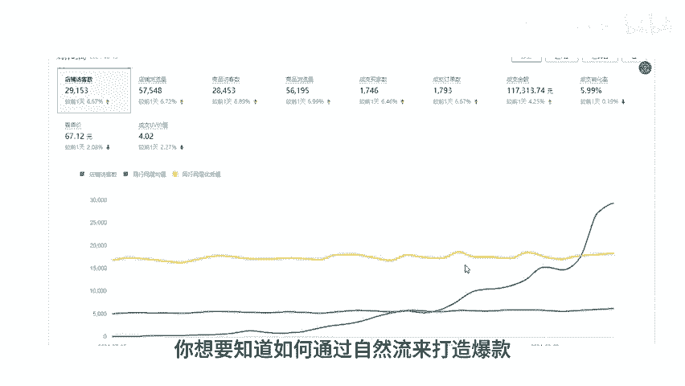

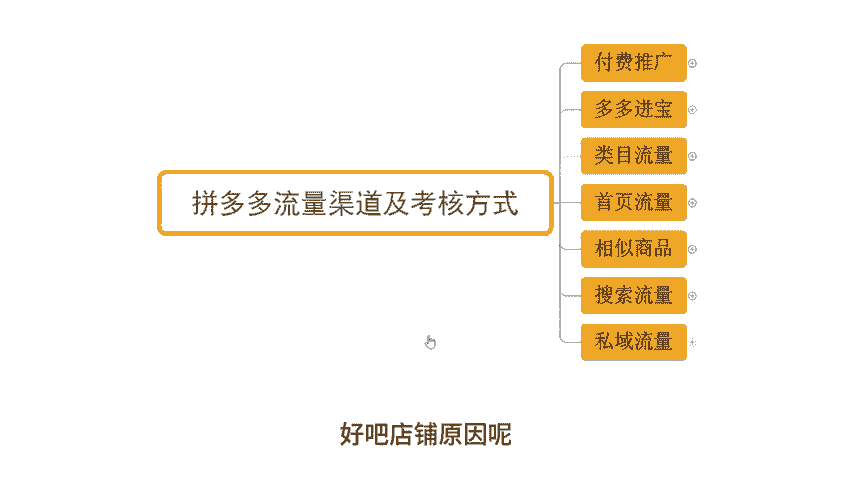

就像这些小伙伴一样呢，我们一起能够有到更好的方法，能够把店铺呢快速的啊做到一个更高的高度。好吧OK废话就不多说了啊。那么今天分享内容呢叫做流量渠道及考核方式啊，那我们做店的话。

首先前力条件呢就是我们店铺需要有流量，对吧？需要有访客，不然的话你的产品卖给谁呢？对吧？你店铺没有访客的情况之下，你也不可能转化不可能产订单不可能赚到钱。

所以说前力条件就是我要搞清楚我们店铺的访客从哪里来的，通过哪些方式来，并且呢这些方式它是如何考核的啊，那么这里呢我们来看一看，首先第一个呢就是我们的付费推广啊。

那么付费推广呢可能在当下来说是我们绝大部分新的小伙伴会容易去使用，并且很依赖它的一个方式，为什么这样说呢？因为这种方式呢，它最简单最直接有多简单多直接呢来我们只需要针对到账户进行充值，对不对？

然后呢创建计划，把钱花出。😊。

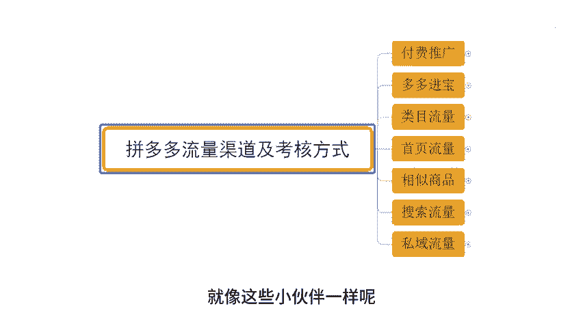

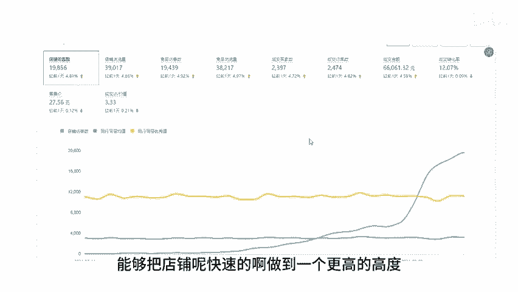

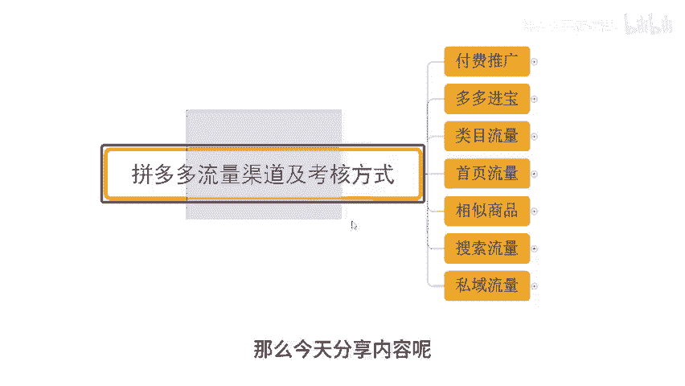

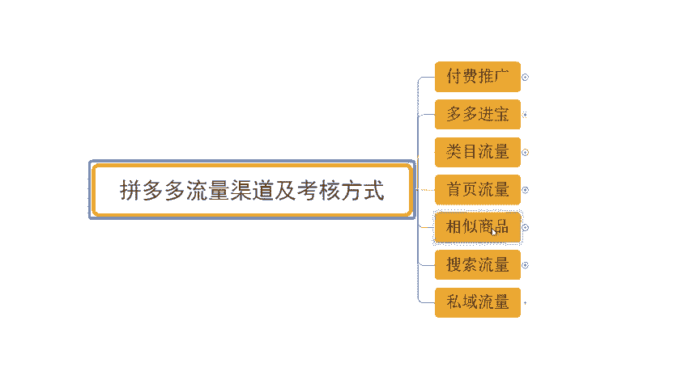

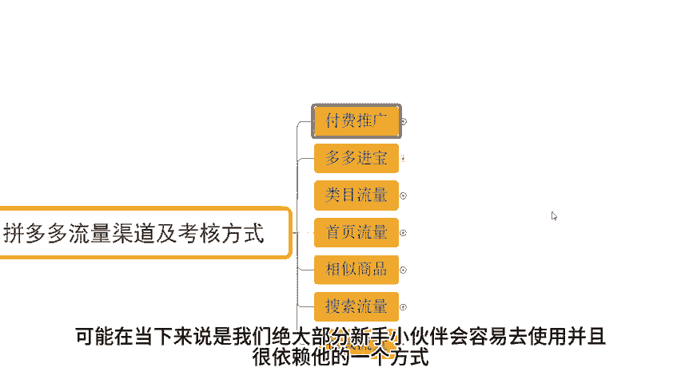

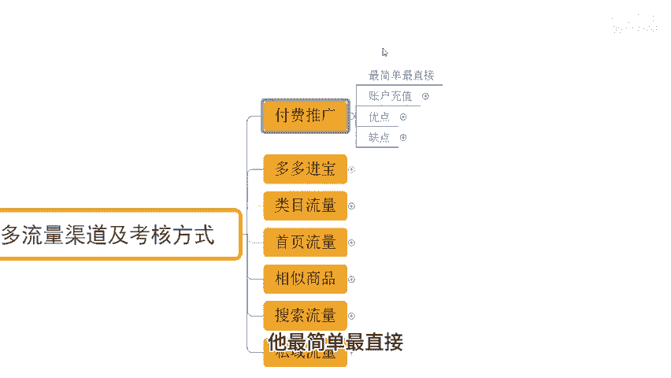

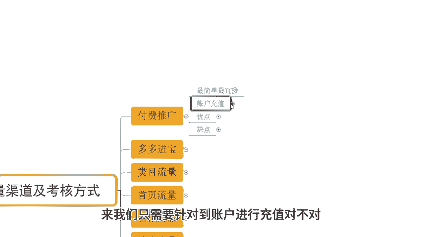

出去OK那么这个时候流量就进店了啊，非常的简单。但是啊这种方式呢对我们店铺来讲呢，可能看似简单，却隐藏很多很多的啊一些陷阱。什么意思呢？首先平台的广告位。

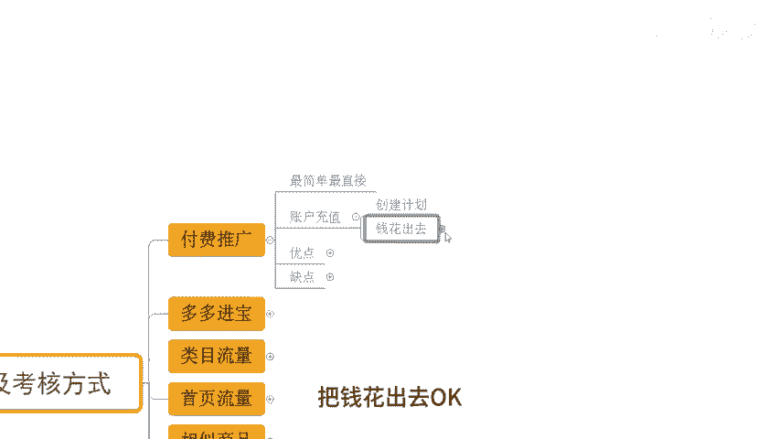

啊，平台的广告位啊它是有限的对吧？它有限的啊，它不是无限的啊。所以这种情况之下呢，当我们的这一个推广的方式简单化之后，当我们的推广的门槛简单化之后呢，所有人都可以参与推广推广的人变得更多之后呢。

那么推广的竞争环境就会变得更加恶劣。这个时候呢，有限的广告位要进行商品排序的话，就会形成一个恶性竞争的环境。那么每个人想要拿到曝光就会不断的增加出价去获取到更靠前的位置，就会导致我们的推广会越来越贵啊。

那么这是一个非常重要的一个一个板块啊，那么而且来说的话，对于我们店铺来讲，它其实是一个非常不健康的方式啊，为什么这样说呢？后面我会想起来家讲解啊，大家不用着急。那么来说一说它的优点啊。

优点呢其实刚刚也提到过，对吧？付费推广的优点呢，就是快捷简单。而且目前来讲，整个平台的话，它的推广方式会越来越智能化，越来越简单啊。

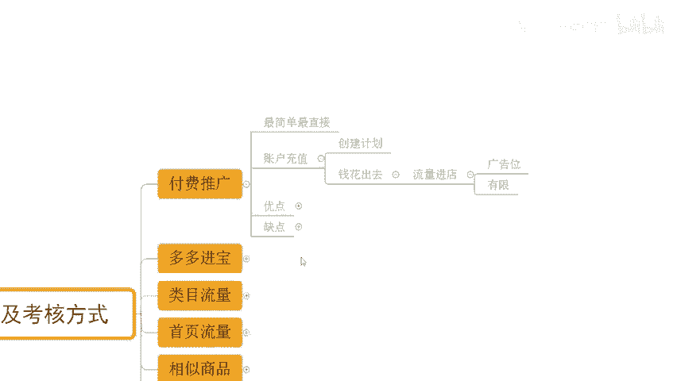

甚至可以说是无脑操作。那么这个时候呢，我们作为一个新手来讲的话。我去做推广啊，就非常非常容易上手啊。但是想要把真正意义上店铺的数据做好，你不是会创建计划就可以的，对吧？

还需要我们产品能够有到一个好流量承接能力啊，这是很重要的点啊，那缺点方面呢，那有什么呢？首先对于我们付费推广来说，那你如果产品没有一个很好的流量承接能力，你没有足够的产品的访客数据啊，那么作为新品。

作为新店直接开付费的话，好，那么你的店铺呢就会被打上一个付费标签。那么这个时候呢，在后期是不利于我们店铺的自然流量获取的平台会觉得哎你这个人就是有钱的对吧？

你这个人就是愿意花钱去买流量的于是会给你什么限制自然曝光，那你更多的去进行一个消费啊。那么另外除此之外呢，当我们产品在正常发布之后，本来平台是会给我们正常的产品自然曝光的对吧？但是因为你去做了付费。

这个时候呢付费推广。😊。

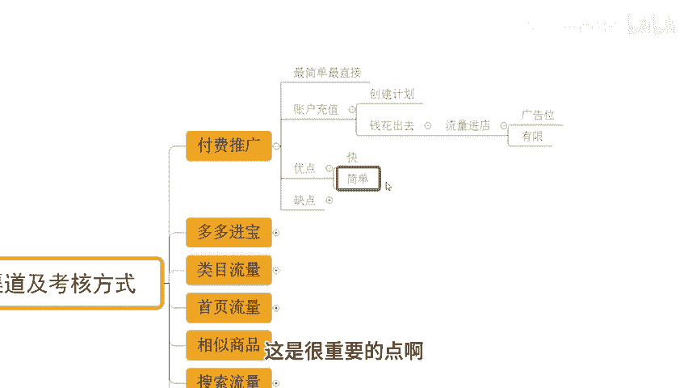

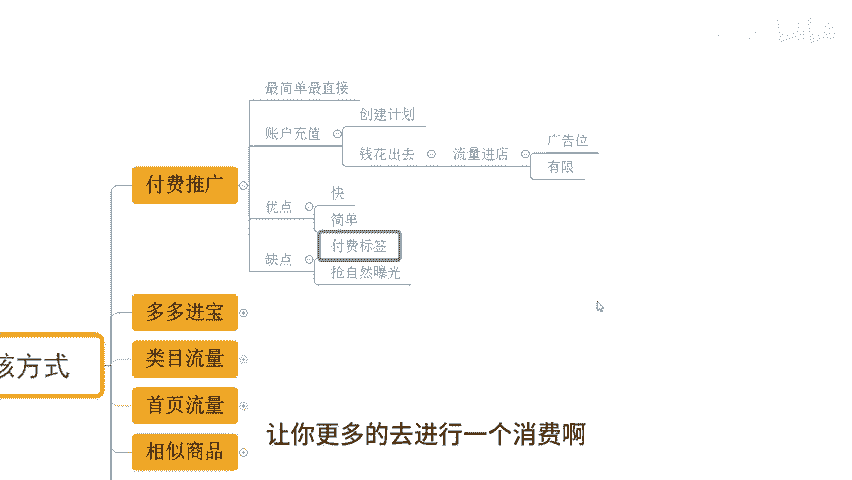

计划呢他会嘛抢占我们自然曝光，而且抢占之后，所有原本自然曝光所产生的点击转化等等各种数据呢会进入到付费板块，导致我们自然流量没有数据，没有数据就不可能放大啊，所以它的一个危害也是非常非常大的啊。

那么再说一说这个多多进宝啊，多多进宝呢，其实它相对来说呢呃也可以把它归纳为是付费流量板块啊，只不过呢它的付费流量机制呢是不一样的啊，那么推荐机制可以给大家说一下。

首先呢是我们自己呢针对到我们推广的产品啊进行一个佣金的设置。在有啊多多克对我们产品进行推广之后啊，我们产生的订单。那么这个时候呢平台会根据订单情况呢，扣除对应的佣金给到我们的多多克啊。

让他们能够去有到什么一个收益啊，所以呢啊看着好像也还不错，对不对？那么这个地方呢。

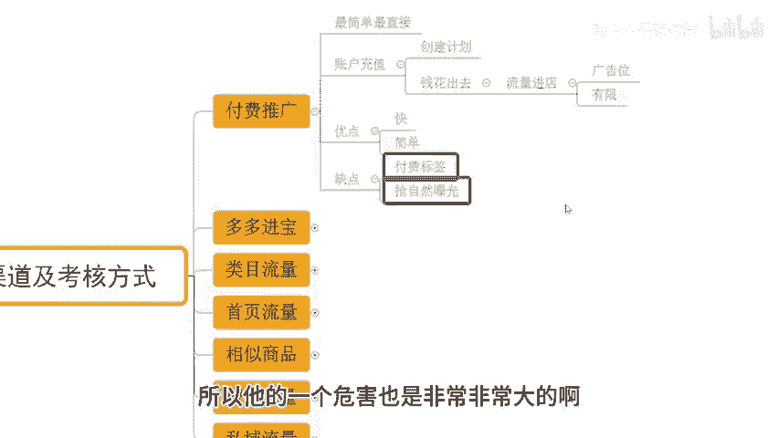

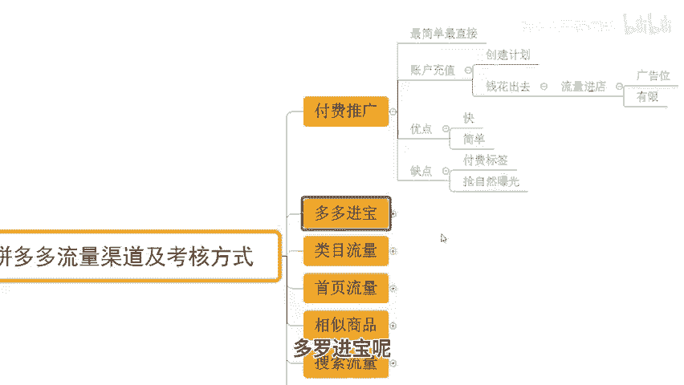

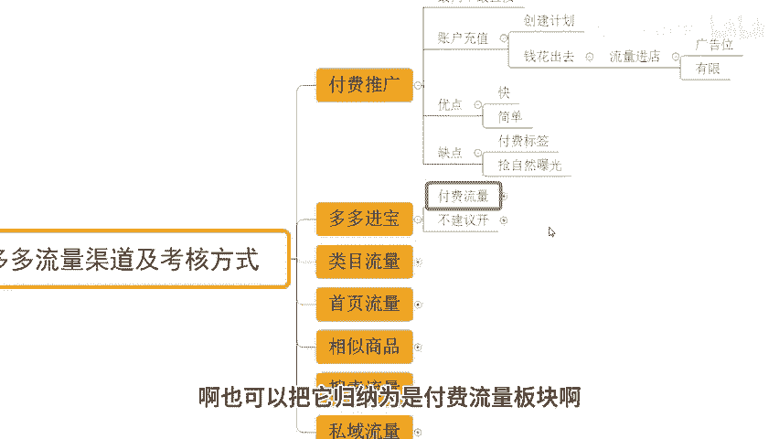

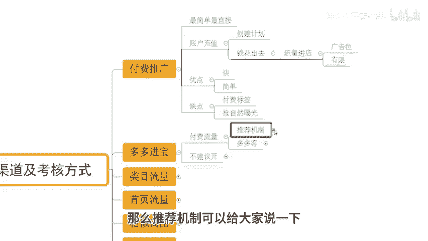

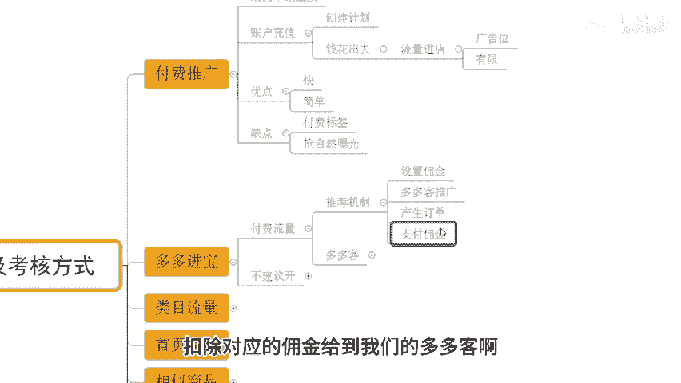

多多克想要推动我们的商品，就必须什么完成我们店铺的推广，完成我们产品的推广啊，进行成交啊，拿到这个佣金。但是这个地方呢就有一个问题，就是我们的产品和多多克他的一个粉丝需求要一致。

而且我们的产品要价格足够低啊，这至是亏损状态才能推得动啊，为什么呢？因为每个人在进行推广的时候，平台啊会进行考核，这个多多克他也会进行考核，对吧？哎，那别人的产品它是什么样的一个佣金比例。

它是什么样一个价格在推。那么我如果说比这个价格高，比这个价格呢呃没有任何优势的话，那我是推不动的，我要能够把它推得动的话，我就需要有到足够低的价格，并且呢能够去很好的符合我的用户人群，对不对？

所以这个时候呢就会导致我们既在亏亏本销售又在付出佣金，那么投入成本就比较高。当然那这只是一个正常的啊多多克的一个渠道方式。

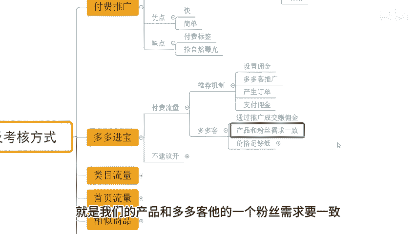

啊，那么还有到更多人可能通过开通多洛克的一个这个渠道来进行一个评价的操作，来进行一个销量的提升，对吧？啊，这个就是另难别论了啊，好吧，那么这个东西呢也是不建议大家去开的啊。首先搞清楚这一点。

那么为什么这样说呢？因为第一个正常来说，产品是没有人去推的。

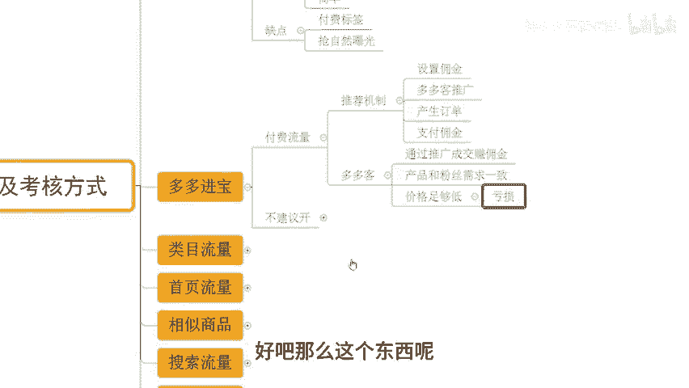

那么会导致我们大量的知识订单被一些呃这个插件或者是一些软件劫持，导致我们扣除佣金的同时呢，又没有带来任何的一个收益啊。那么呃这种情况呢，就除非是我们能够有到一个非常好的呃这个合作对象啊。

产品呢是符合他的用户人群的。而且呢，他是愿意去跟我们进行达成长期合作啊，那么这样的情况可以去推。那么这里呢。

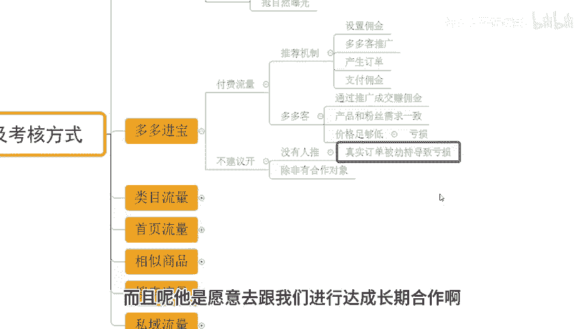

他的一个渠道啊只是属于达人或者只是属于这个多多克，他自己私域流量进行运营的一个方式啊，可能是公众号，可能是一个小网站，也可能是分享的链接或者是一些这个社交的一个群对？都有可能啊而我们的推广呢。

刚刚没有提到具体的展示入口啊，这个在我们搜索首页包括活动等等各个渠道都有展示啊，都有广告位啊，是这样子的。那再往下呢我们来说一说我们的类目流量啊，类目流量呢很简单。

就属于我们产品呢它的类目呢是热热销产品啊。那么这个时候那呃它是热销类目的情况之下呢，就能够去在排名靠前的内目进行展示。而我们商品在这个类目里面，它的数据反馈比较好。那么有到比较好的坑产。

并且和我们当前这个类目呢匹配度比较高。那么O你的展示机会就会更多，你就更好的机会展示更靠前的位置啊，那另外一点呢就是我们的首页流量啊，首页流量。

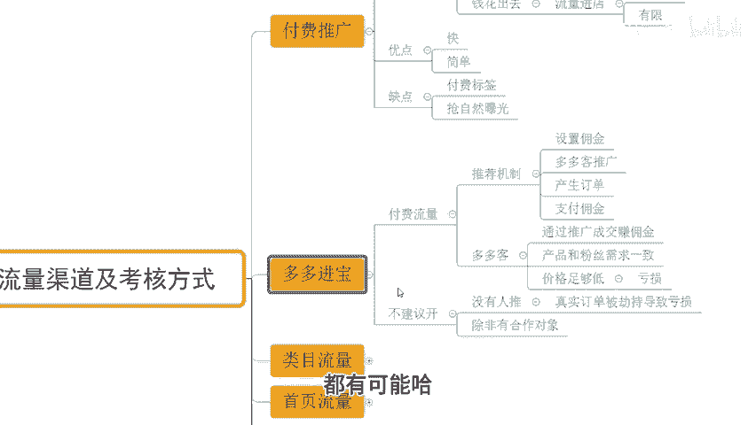

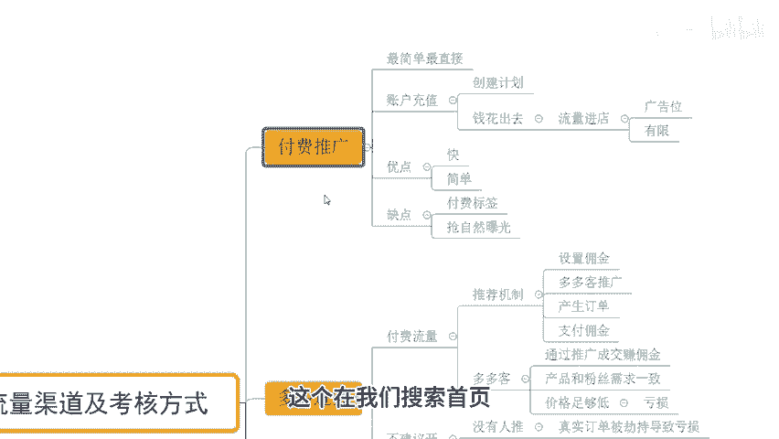

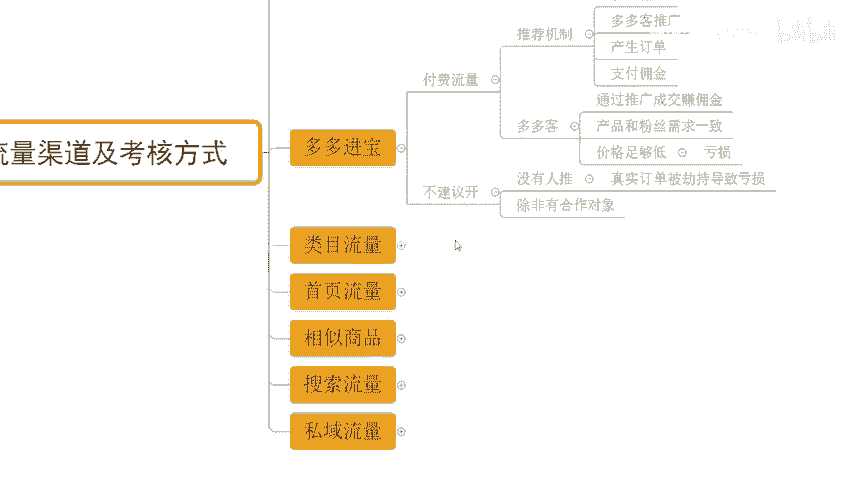

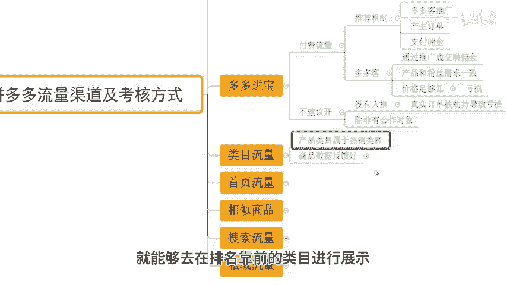

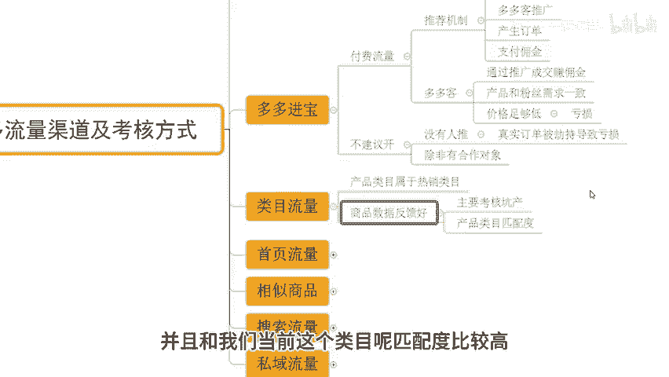

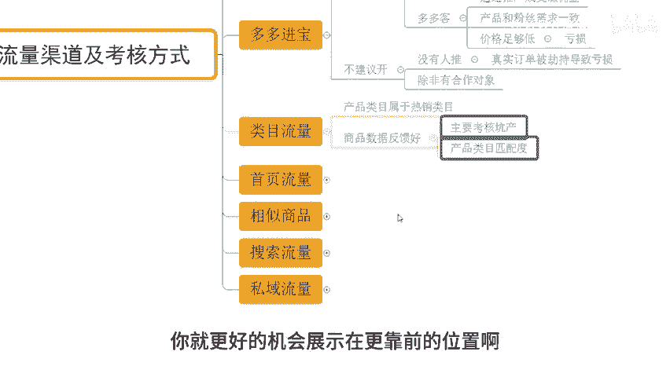

样呢就是考核我们产品的重要数据表现啊，包括说我们产品呢评分比较高，我们店铺评分比较高。在我们的产品的销售的这个端口各项数据表现比较好的情况之下啊，那么它就可以有到更加好的首页展示。

当然呢最最核心的是商品评分板块啊。那么再来说一说相似商品啊，相似商品呢在我们的这个考核过程中的话，它首先产品的标签要高度匹配。包括说我们商品的属性要高度匹配。而且我们产品呢也会进行比价。

当我们产品有到一个更好性价比的时候，那么这个相似商品的推荐呢就会比较多。而且呢用户转化率会比较高。它的展示方式呢，包括我们的这个详情页底部啊，包括我们下单之后的推送啊等等啊，各个渠道都有的啊。

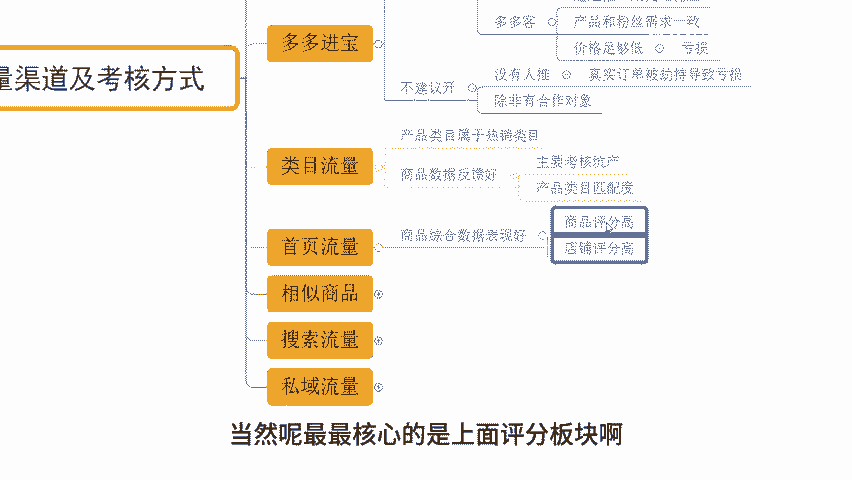

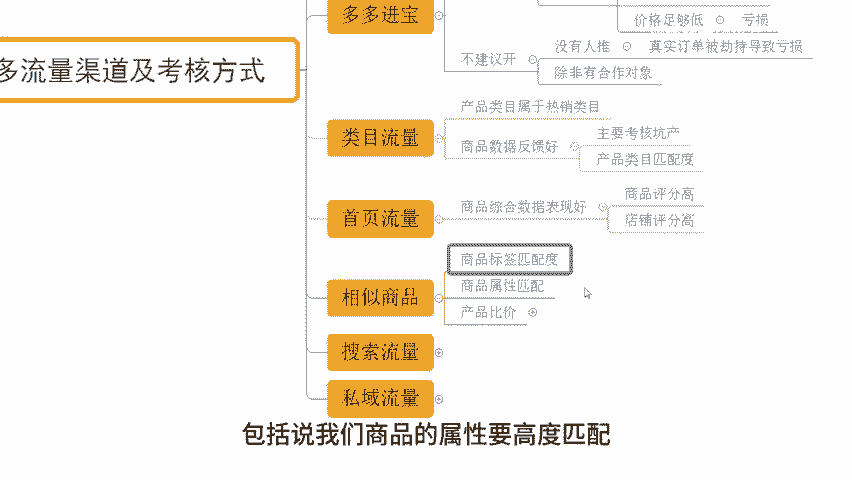

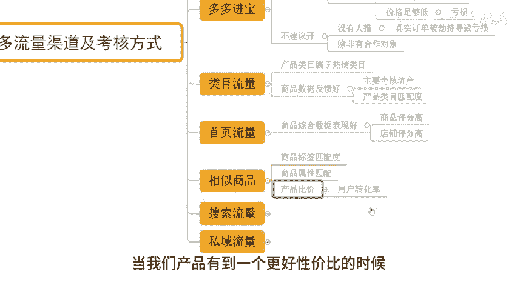

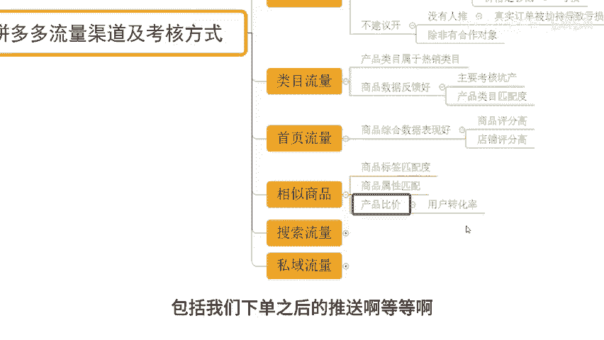

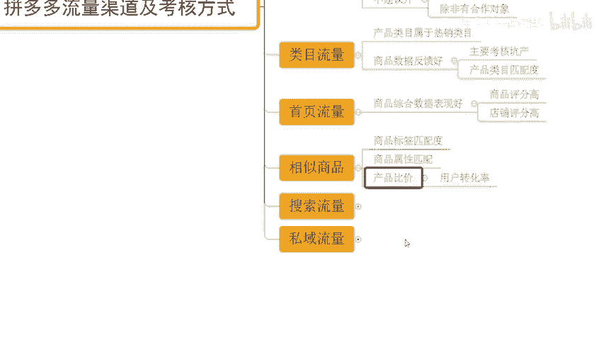

那么再来说一说我们的搜索板块啊，那么搜索板块呢，顾名思义是我们用户进行搜索关键词进行展示，对吧？那么这个时候呢，商品它的一个展示的方式呢，重点就考核关键词和我们产品以及我们人群的匹配度。

再一个呢就是我们对应产品的对应关键词产出。那么能够有到更多产出，能够有到更好数据表现。那么自而然排名会更靠前。那最后一个呢就是我们的私域流量了啊，这个就像我之前讲到的，像我们达人一样的，对不对？

他可能会有到自己的一个方式去进行引流。那作为我们商家，那我可能也会为我的平台进行引流。那可能是我通过公众号的运营方式啊，可能是我通过社交媒体的方式来进行运营，为我店铺引流，对吧？都可以。

那么在这里的话啊这里我要重点说明什么呢？如果说我们在进行运营过程中，这些所有的方式，我们都可以去操作。但是最最重要的就是私域板块，作为一个新店作为一个新品去运营的话，私域。

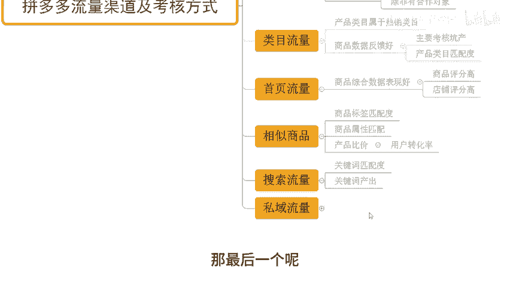

流量是必不可少的。为什么这样讲呢？其实我们可以简单考虑一下，不管是其他的哪种流量板块，我们都是在平台内部获取的，对不对？唯独私域引流是我们通过外部为平台创造价值，创造流量。

所以这个时候呢平台就会觉得哎你有在给我平台拉人拉人头啊，那这个这个人呢就是O的这个店铺就是O的。他在给我平台创造价值，哪怕是通过我们私域方式把我们平台的老客户拉回来对？进行一次激活也是好的。

他是对我们店铺有加权的好吧，O啊，那么这些流量板块重能考核的内容我也讲到过了。那么我们前期在操作的时候重中之重应该做了什么呢？O也就是我们的非付费的渠道，包括我们的内部啊首页呀相似啊，还有搜索呀。

还有食欲等等啊。那么具体每一个渠道，我们应该怎么去做，后面我会单独为大家进行详细分享啊，大家不用担心好吧，O啊，那么今天呢关于我们流量渠道。

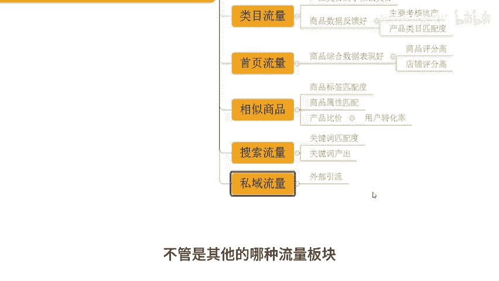

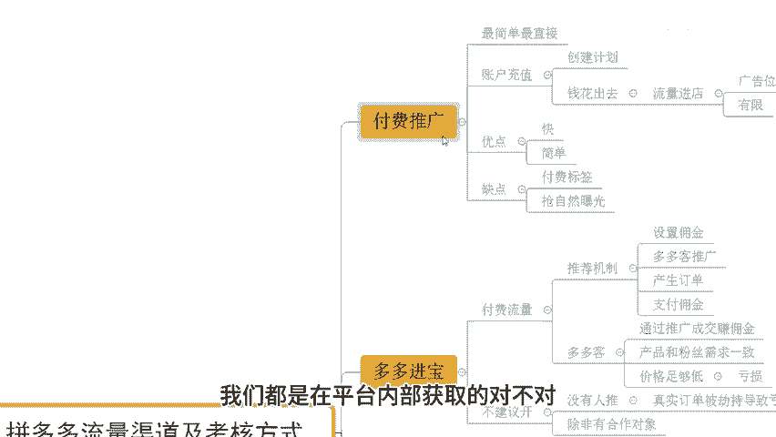

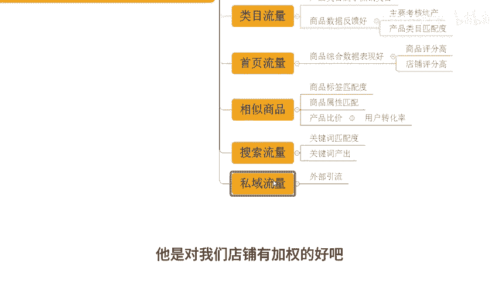

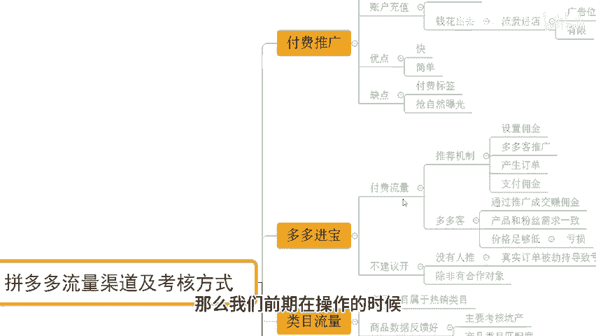

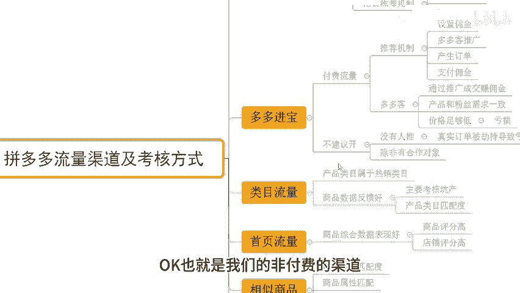

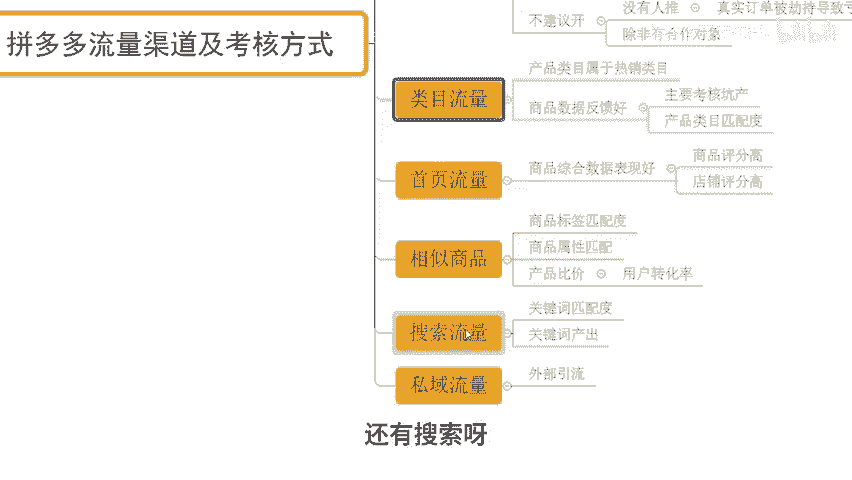

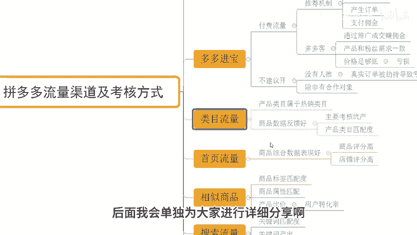

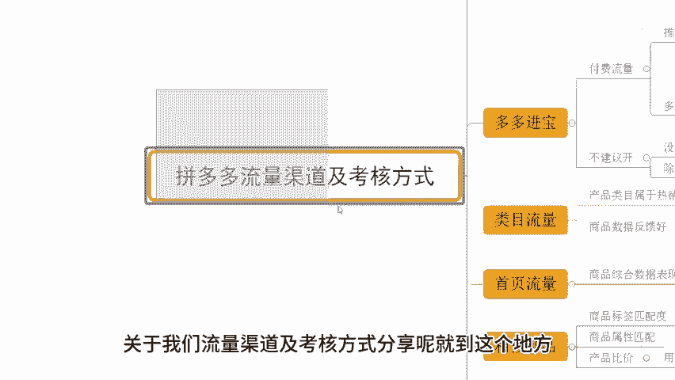

及考核方式分享呢就到这个地方。当我们了解清楚考核方式之后，我们才能够去更好的完成平台引流，才能进行店铺的一个操作。所以这点大家注意一下啊，那么还是那句话，如果说你自己对店铺运营来讲没有方法，没有失落啊。

那么对于操作方面有这个疑问啊，或者是这个需要资料的可以找我同样的啊，那么确实自己做店铺呢是没有一个清晰的一个方向啊，需要跟着实操的，也可以来啊。那么这些小伙伴呢就是我们的榜样，对不对？

我们能够有到更好的方法之后，自然而然能够有到更好的索数据啊，店铺提升的也会更快速。好吧，O那么今天的分享呢到这里，我们下再见。各位拜拜。😊。

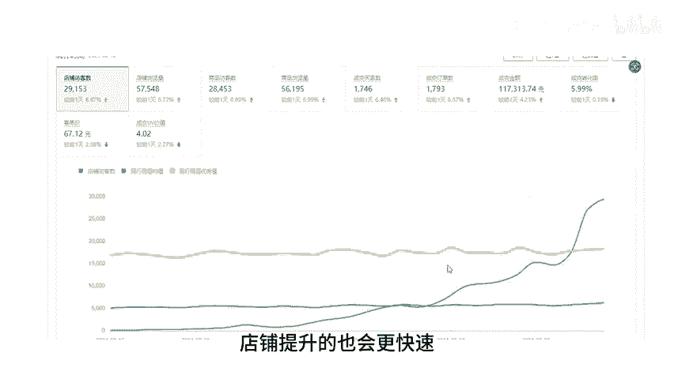

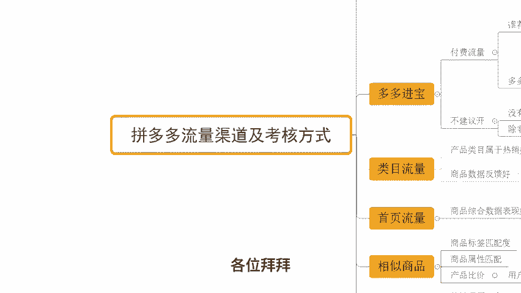