# 拼多多开店运营-新手电商运营实战指南，B站最全拼多多零基础入门教程！拼多多运营秘籍，小白也能成电商大亨！轻松上手拼多多，拼多多新手开店赚钱攻略 - P26：026 新品平台排名规则 - 拼多多开店运营- - BV1xms8eSEVs

Yeah。hello大家好，我是西楼。那么今天给大家分享的内容呢是我们拼多多店铺运营新品企流量方法中的新品平台排名规则内容啊。在分享之前呢，还是老规矩啊，先给大家看一下近期跟着实操小伙伴他们的店铺数据。

好吧。

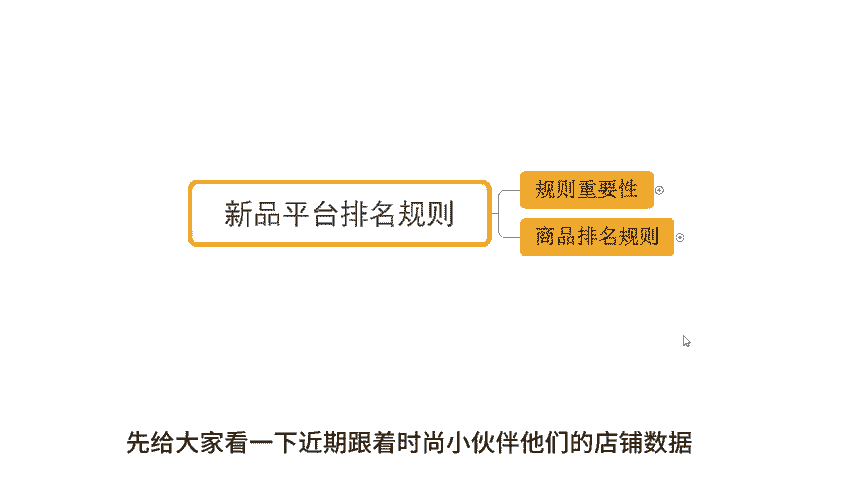

可以看到，像这个店铺呢，原本访客在2000左右啊，那么跟着实施之后呢，完成了我们产品的重新的商品布局，以及我们SKU的一个调整优化啊。当我们转化提升之后呢，整体访客也在不断的增长啊，到后期的话。

一天的访客呢从原本的2000左右啊做到了2万多。那么一天的订单呢做到了1900单，转化率呢9。37啊。这个店铺呢做的是灯具的，还是非常不错的一个数据啊。还像这个店铺可以看一下啊。

原本的访客在1000左右啊，几百个到1000的样子。那么同样的用了实操之后呢，也是完成了我们商品的这个活动策划的一个调整啊，完成了我们产品结构的一个调整啊之后呢，不断的在优化我们商品的转化啊。

当转化得到提升之后呢，整体的访客也会不断的增长，而且上升趋势非常稳定啊，可以看到到后期的话，一天的访客呢是做到了9000多啊，原本呢是1000左右对吧？有了9倍的增长。那么转化率呢做到了13。12%啊。

那么订单的话一天是1200多单。当然了，除了像这一种有基础有数据的店铺之外，一些零基础的新店跟着实操同样是可以得到一个非常好的提升的啊。可以看到像这个店铺呢。最早是零访客的一个店铺啊。

临零访客开始做的对吧？同样的，那么这种小伙伴呢跟着实操之后呢，我们完成了我们的市场分析，完成了我们的竞争分析。

通过商品定位呢确认了我们主推方向和爆款定位之后啊开始上架商品来不断的操作提升得到一段时间的数据沉淀之后呢，访客也开始不断的增长啊，到后期的话，一天访客呢做到了19000。

那么一天的订单呢是2300多单转化率呢12。07啊，也是非常不错的。当然除了这个店铺之，还剩这个店铺啊也是啊同样临访客的一个新店。那么最早临访客啊到后期的话一天是做到了29000的一个访客。

一天1700多单，转化率呢5。99%。当然这个店铺转化率比较低一点，它是这个女鞋品类的啊O的啊，那么像这些店铺呢也都是通过自然流的方式来操作的啊。如果说你想要知道，如何通过自然流来打造爆款做好店铺的话。

建议可以仔细观看我分享视频。

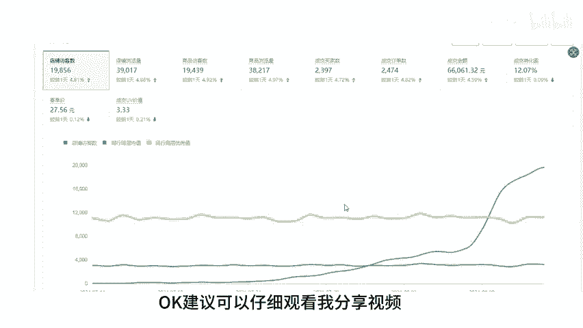

好吧。😊，那么店铺运营呢对于我们很多的新的小伙伴来说呢会有到很多的困难啊。如果说店铺操作有问题啊，需要资料的呀，可以找我有时间的话呢，我也可以带着你一起去实操做店啊，就像这些小伙伴一样呢。

我们一起能够有到更好的方法，一起呢能够让我们店铺呢达到更高水平。好吧，O那么关于今天分享内容呢叫做新品平台排名规则啊。那首先我们来说说规则的重要性啊，了解清楚这个之后呢。

也能够方便我们对于后期在规则的一个认知上啊，有到一个更好的一个这个定位吧，算是啊那我们也有清楚知道规则对我们的影响有哪些啊。首先呢对于我们商家来说可以看到啊，那么它是有利于我们激励商家的竞争的对吧？

那排名规则呢可以促使我们商家完成一个良性的竞争啊，那同时呢能够帮助我们商家知道我们需要提升的点在哪里，并且努力去提升我们商品的服务和质量，来得到。

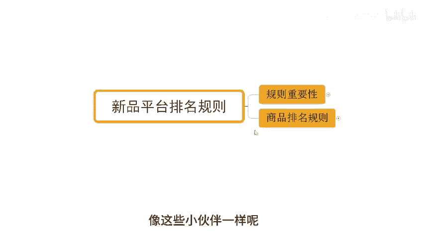

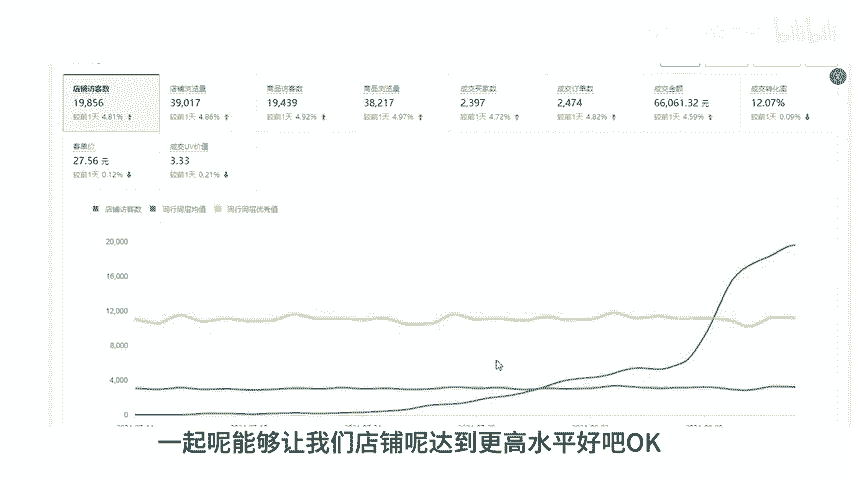

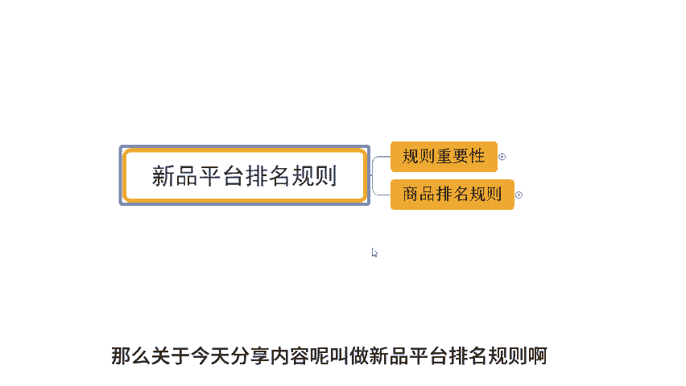

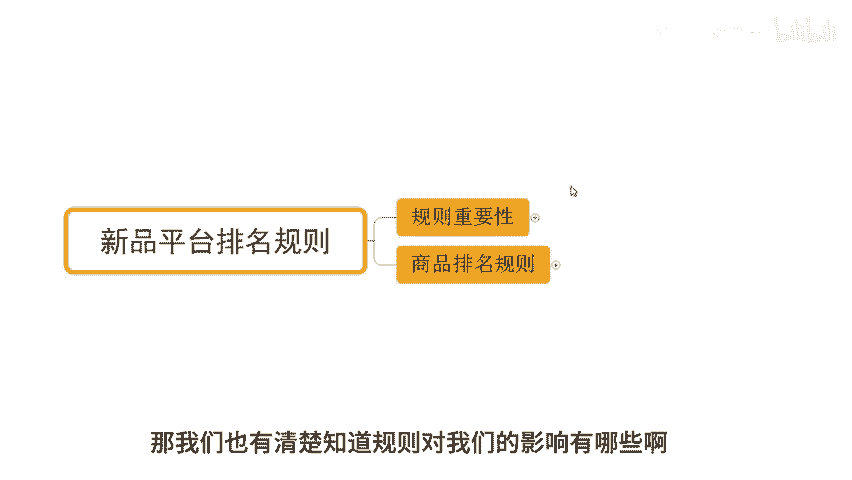

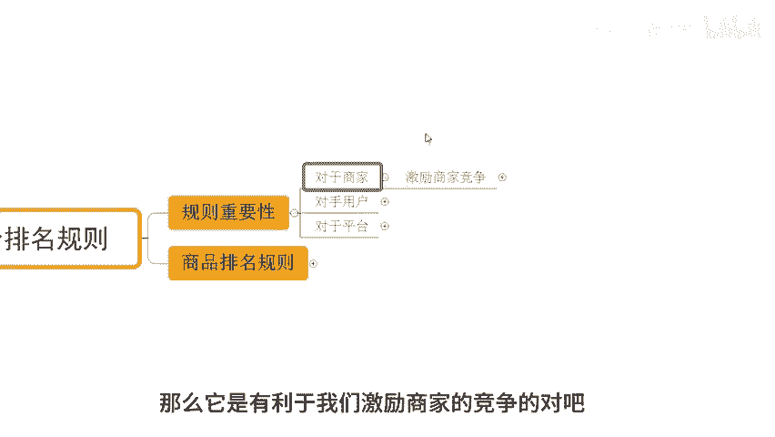

更好的这个产品的一个这个服务啊，那帮助我们用户呢得到更好的产品啊，同时呢也为我们店铺创造更好的价值。而对于我们的这个用户来来说啊。

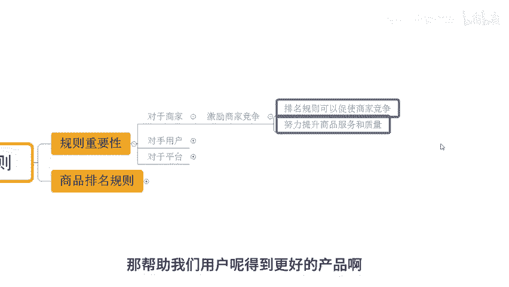

啊，对于用户来说。那么它可以提高我们用户的体验啊，对于我们呃这个用户呢，他在进行购买商品过程中呢，那么排名规则呢是有利于确保我们的用户呢在搜索商品的时候呢。

能够在更靠前的位置快速的去找到一些高质量并且受欢迎的产品啊。这样的话对于用户来说呢，他的一个体验会更好啊。那么也帮助我们的这个消费者呢快速的去找到合适的商品之后呢。

得到更好的购买的体验和我们后续的商品服务啊。

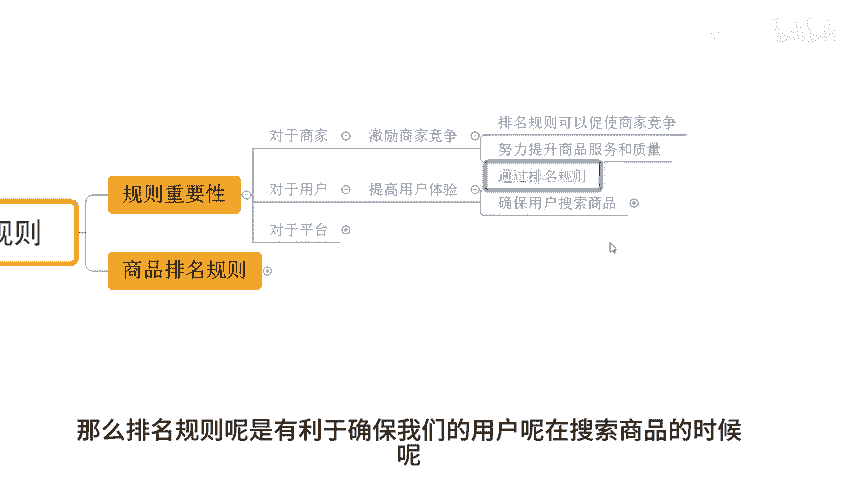

那么对于我们的平台而言啊，这个东西呢就更加的重要了啊。那么它呢是有利于提升我们平台的一个影响力的啊。那好的商品呢能够让我们消费者得到好的体验，对吧？这个我们刚才已经提过的。

而好的商品体验呢能够让我们的市场体量，得到更好的这个扩大啊，能够被我们平台呢创造更大的一个价值，能够吸引到我们的优质商家，从而形成一个良性的循环啊，带动我们平台，带动我们的商家，也同时给到我们的用户啊。

更多的选择和更好的一个体验啊。

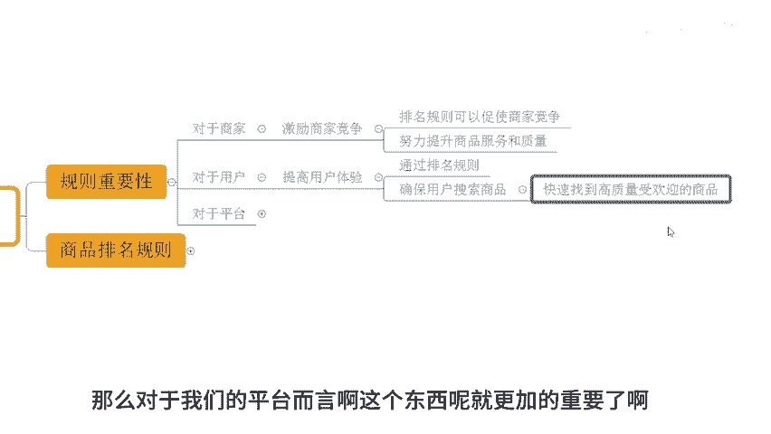

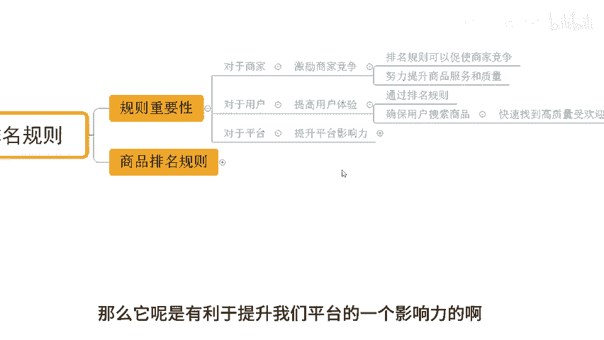

那么具体来说一说我们排名规则到底是样的，好吧。

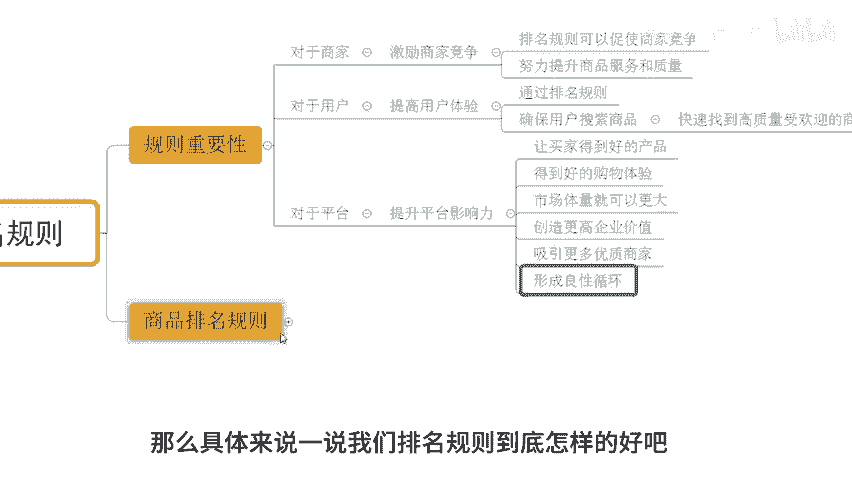

那么官方呢对于我们商品排名规则呢，是有到明文规定的啊，可以看到这边是我在后台找到的规则的一个截图啊。那么平台的类目商品的排名呢是按照一段时间的商家商品上线时间、销量、价格、质量、售后、商品评分等综合因素进行排名更新的啊。

而其中呢考核的内容呢分为4个大类啊，分别是我们的店铺数据、商品质量、商品数据以及处罚类，对吧？等等啊。那么具体哪一些它只在里面考核呢，我们先不用去具体研究啊，不着急，我们来展开说一说啊。

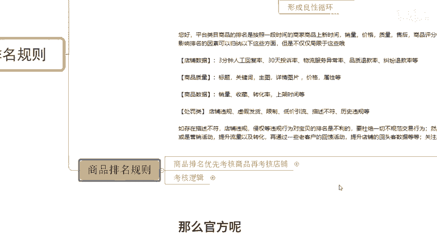

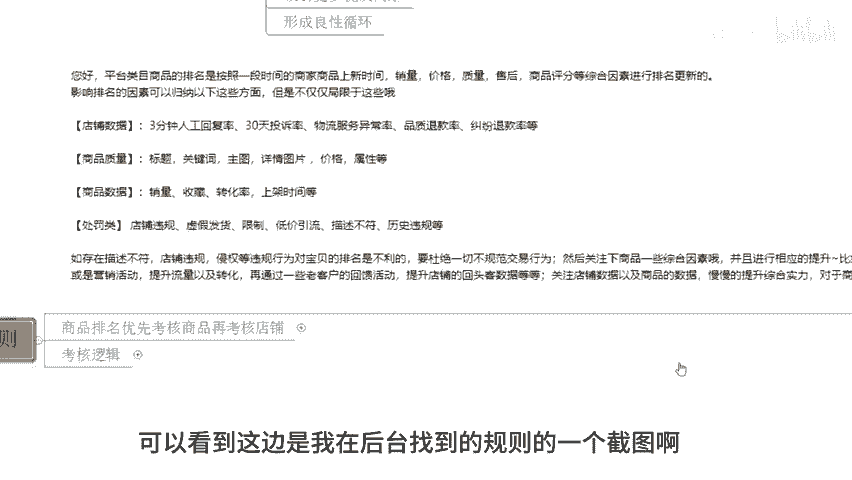

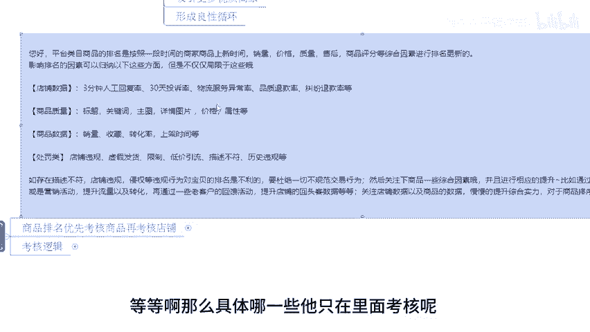

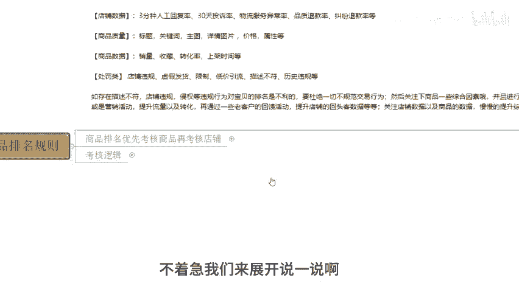

那商品的排名啊，它是优先会考核到我们商品，再去考核到我们店铺的这一点大家要先明确到啊。那么什么意思呢？OK我们来看一看商品质量是我们产品在发布过程中呢，一开始平台会抓取到的一个部分啊。

它包含了我们产品的标题关键词主图详情页啊，包括我们的价格和属性等等啊，那么平台呢会根据商品质量完成基础曝光的考核，而这个基础曝光考核呢，就是我们刚讲的根据这些商品的基础信息来进行评判的啊。

那么它是属于潜力商品属于用户需求高的产品。OK那么它的基础曝光会更多。那在这个过程中呢，产品得到基础曝光，用户对我们的商品形成点击啊，那么我们整个商品呢就可以产生点击率，产生点击量，产生搜索热度。

从而呢带动我们后续呢完成更多的商品数据考核。那么这个商品。

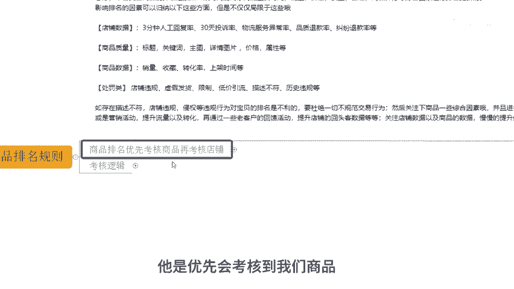

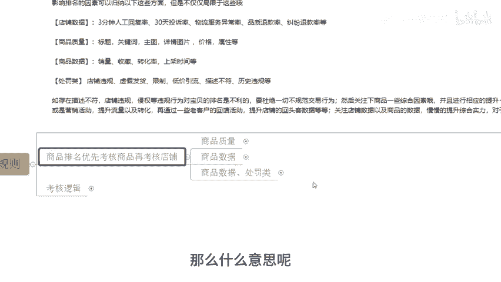

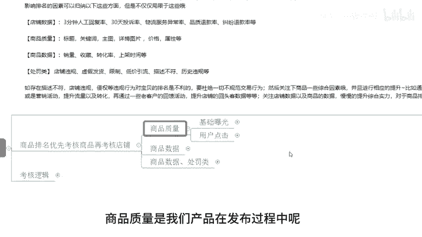

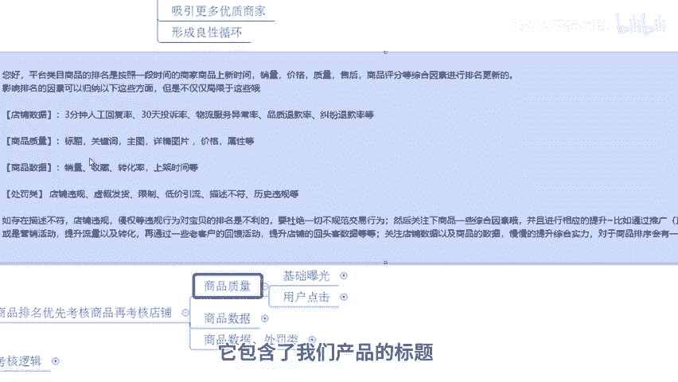

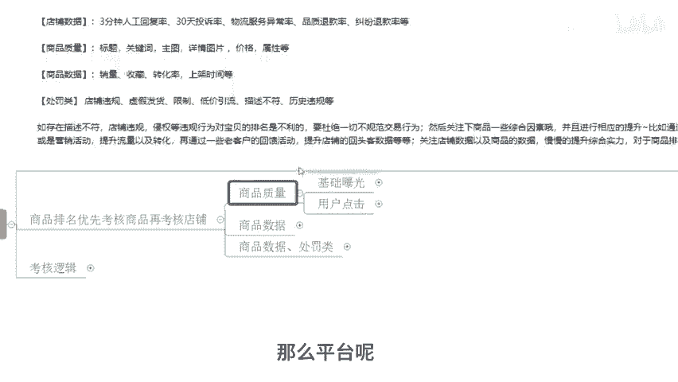

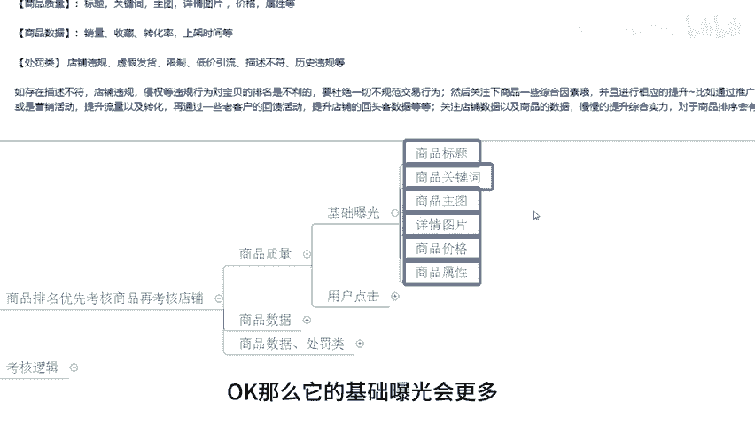

数据考核呢就包括了我们后期的一些销量收藏转化率和剩产时间啊，这个也是我们刚刚提到的排名规则里面所说到的一部分，对不对啊，商品的销量收藏啊转化率、上产时间属于商品数据啊。那么在这里面呢，商品的销量呢。

它其实不仅只是单纯的一个销量而已啊，它包含了我们的订单量、销售额、客单价、UV价值同比增长率等等啊。这些数据。

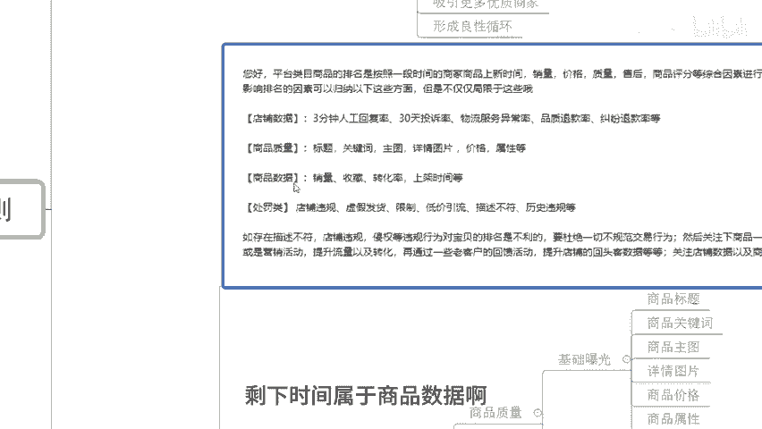

所以在我们产生了点击之后呢，平台会根据这些数据来完成我们排名考核的一个呃重要的环节啊，就是我们数据考核。而数据考核的依据呢是根据我们同行来进行对比的。它不是说单纯的我自身商品怎样就怎样，对吧？

那么同样的搜索持同一个类目，那数据表现更好的产品啊，整体的点击效果更好的产品就会排名到更高前。因为我们会认为这类商品呢是我们平台的用户更加喜欢，能够创造更大价值的产品啊，那么在这个过程中呢。

除了会考核这些东西之外啊，他还会考核到我们的店铺数据啊，还有我们的处罚类。为什么会这样考核呢？道理很简单。商品质量可能会存在相同的产品，商品数据也同样会存在商品同样的产品，对吧？

但是排名它一定是有先后的。所以在这些数据相同的情况之下呢，就会再次考核到更多的呃这个。范围啊，那包括了我们的店铺数据，还有处罚类。

那么店铺数据里面呢就包含我们讲的啊3分钟人工回复率、30天投诉率、物流服务异常率等等等等啊，以及我们的各种违规等等情况啊。那么当我们有了这些违规之后，O那么你在排名过程中呢，就会比那些没有违规的。

相对更靠后一点啊。换句话说，你没有违规。那么你的曝光是正常的。但如果说你一旦违规排名会靠后啊。OK那我们来重点再次展开说一说我们的排名逻辑啊，给大家去梳理一下啊，可能这个过程呢。

我们只是讲了一些排名的内容啊，大家可能不是很理解啊，来看一看好吧。啊大家可以看到这个图。

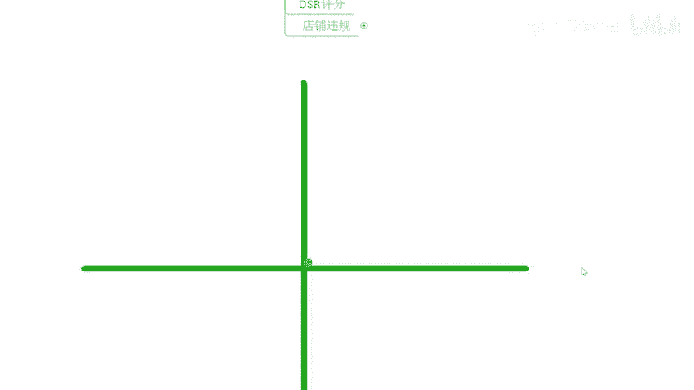

在我们这个画面里面呢会有到一个绿色的十字架，对不对？我们把这个十字架呢把它想象成为我们产品的曝光的范围啊，中间这个交界点呢是我们产品上架的曝光原点啊。那么一开始默认的时候。

上架商品呢会在这个位置进行产品的曝光啊，那么产品往右啊，会曝光范围越来越大，往上会曝光的这一个数据量会越来越高，越来越多啊，那么相对来说呢，往下呢就会变得越来越少，对不对啊，这里是原点嘛。

往下是负数往左也是负数啊。所以它这么一个状态的。那么可以看一看啊，继续往下啊。那么我们产品呢能够拿到最大的曝光范围，也就是以这里交界的原点啊，然后往这个右还有往上产生的一个最大的啊一个矩阵啊。

一个矩形的框子啊，那么商品质量呢它是考核到我们产品的我们的标题啊，图片啊，价格等等这些东西啊，那么这些项目考核的时候，我们的呃产品有优势。那么你的曝光范围就会更大啊，你的推荐就会更多。

而商品质量的考核是我们商品的销量啊转化收藏等等啊。那么这些数据更好呢，你的整体的高度就会更大啊。那么是这样的一个状态。

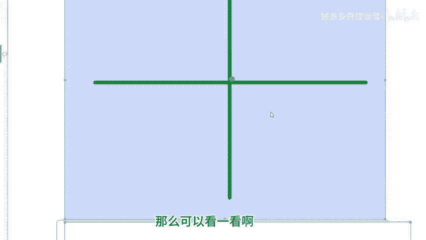

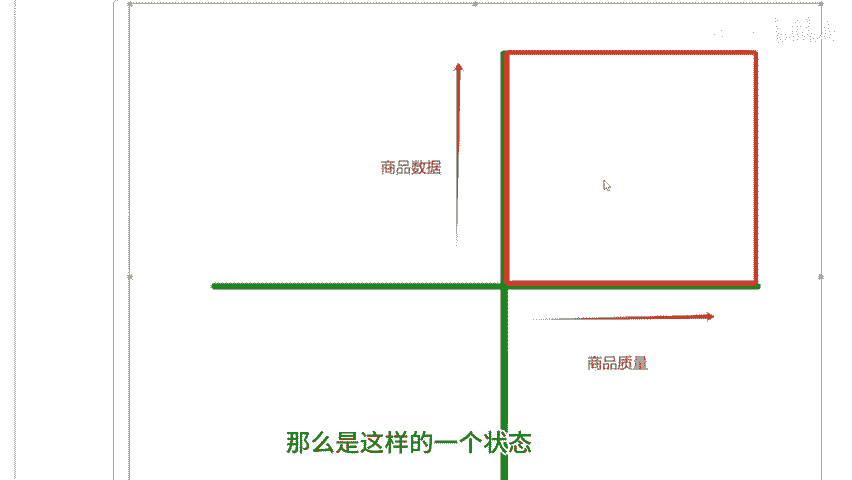

但是啊一旦呈现出店铺有违规的情况之下，或者是我们店铺的店铺数据考核不达标，对吧？有这个3分钟人工回复率啊不合格呀，有30年投诉率不合格呀等等各项违规的话。

O那么这个时候整体的原点就会从最开始的啊这个交界的原点呢往我们的左下方斜下方啊往这边移动啊。那么这个时候呢，整体的曝光范围就会减少有效范围呢就只剩下这个黄色的框子这部分了啊，原本的红色框子呢。

它从最大的范围呢往啊这个左下方啊往左下方移动啊，原点往这边移动。那么有效范围就减少了。这个时候呢曝光就会减少。所以说我们想要去得到更好的产品曝光的情况之下呢。

就需要去满足系统考核同时要注意规避店铺的违规能够去得到更好的用户啊反馈是非常非常重要的，好吧。

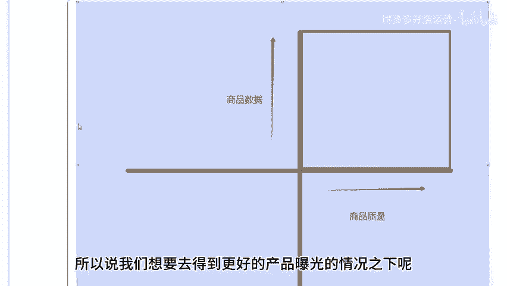

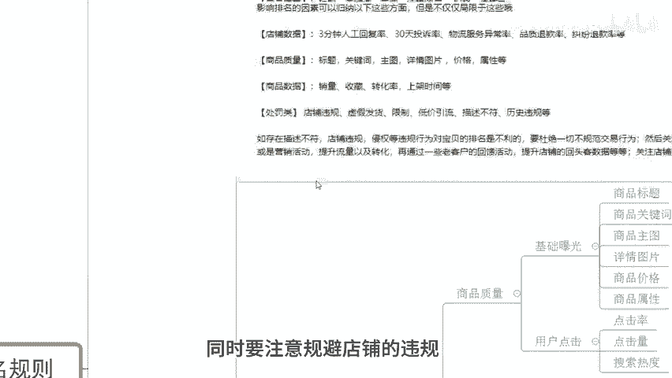

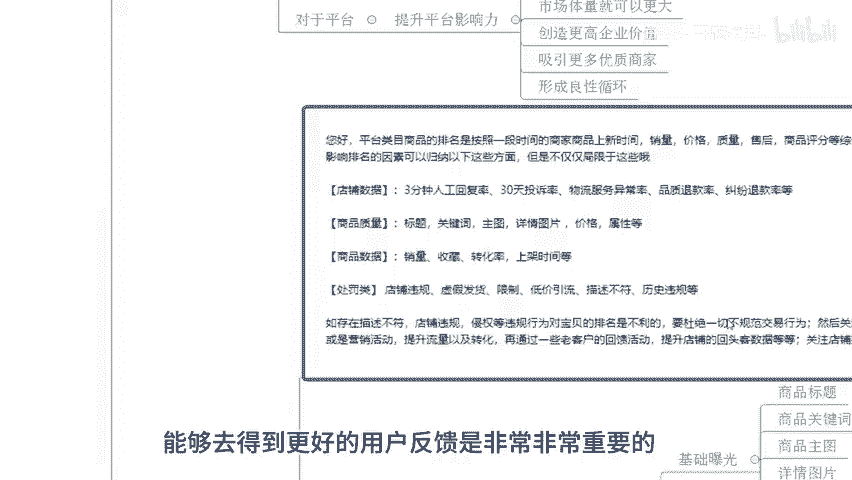

OK那么后续我们如何去得到排名，怎么去优化排名，会进行详细讲解。那么大家可以关注一下，好吧。OK今天呢关于我们产品的新品排名规则的一个分享呢就到这里，还是那句话。如果说你在店铺运营过程中有任何困难。

有需要这个资料的都可以找我啊。那么当然同样还是那句话，有时间的话，想要跟着时操也可以找我啊，跟这些小伙伴一样呢，我们一起能够就到一个更好的方法之后，店铺呢也能做的更好。好吧，O今天的视频到这里结束。

我们下次见。各位拜拜。😊。

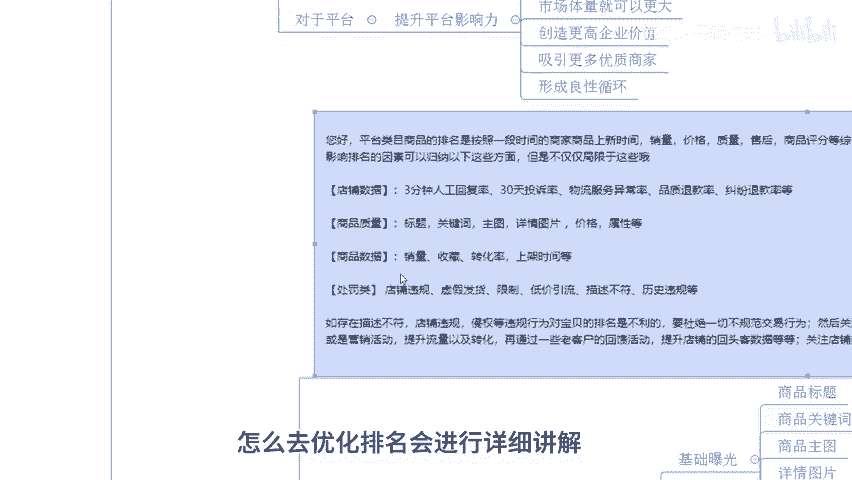

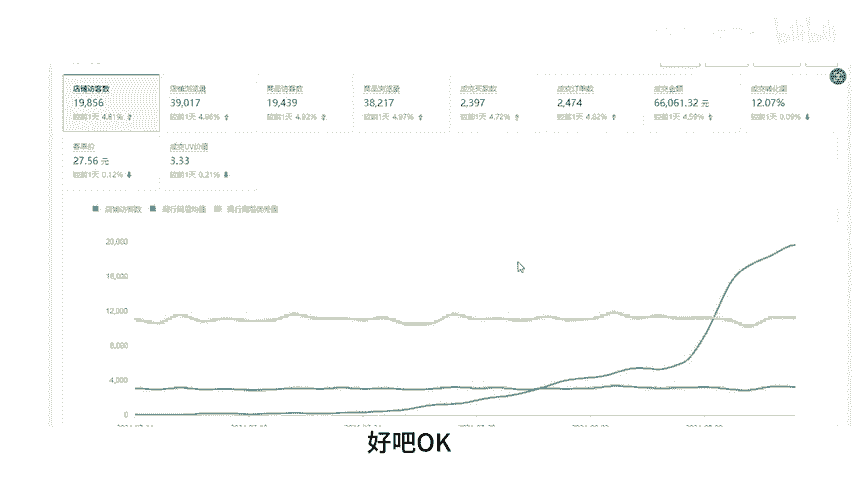