# 拼多多开店运营-新手电商运营实战指南，B站最全拼多多零基础入门教程！拼多多运营秘籍，小白也能成电商大亨！轻松上手拼多多，拼多多新手开店赚钱攻略 - P2：02 拼多多新手开店内功修炼 - 拼多多开店运营- - BV1xms8eSEVs

hello，大家好，我是谢楼。今天给大家分享的内容呢是我们拼多多新手开店内功修炼片的内容啊。在费用之前呢，先看一下近期个人识的小伙伴他们的店铺数据，好吧。

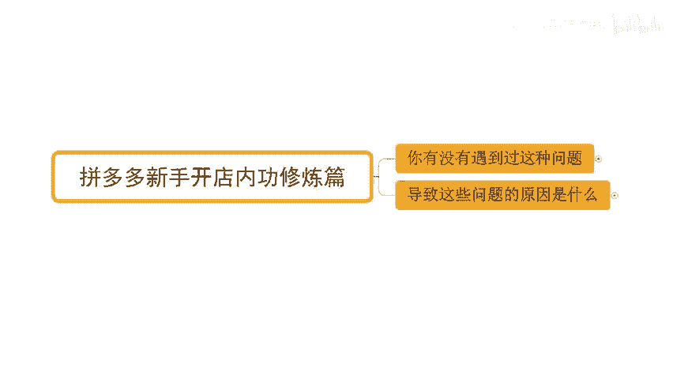

可以看到啊，像这个店铺呢，最早是一个零访客的新店，那从没有数据，到后面上架产品之后一步一步的去操作。那访客开始增长。到后期的话，一天访客呢做到了15000，一天的订单呢是2900多单。

转化率呢做到了18。76%啊。同样的，除了这样的一个零基础店铺之外呢，还有一些有基础有数据的店铺呢，也是一样的啊。像这个店铺呢，原本访客在3000左右啊，才会存在说一些波动啊。

那么也是进到产品的进行调整优化之后呢，开始不断的去提升我们店铺权重，增加我们的这个访客数据啊。那从最早的这个3000左右的访客呢到后期的话一天的访客呢做到了13000一天的订单呢是2100单转化率呢做到了16。

47啊。那么也都非常不错的一个数据增长啊，同样的还像这个店铺啊也是的，原本的访客在2000不到啊。那么通过优化之后呢开始不断的增长啊，数据开始提升，访客增长也非常快速啊。

到后期的话一天访客呢做到了12000啊。那么一天订单是2100多单，转化率呢做到17。03啊，也都非常不错。那么像这些店铺呢，除了是呃纯新店也好，还是说有一些基础数据的店铺也好。

那么跟着时上呢也都能够得到一个相对比较不错的，而且比较快速提升。而这些店铺呢也都是通过自然流的方式操作的。如果说你想知道怎么通过自然流来提升店铺数据，你想知道如何通过自然流来打造店铺排名。

OK建议可以仔细观看我分享视频。好吧。

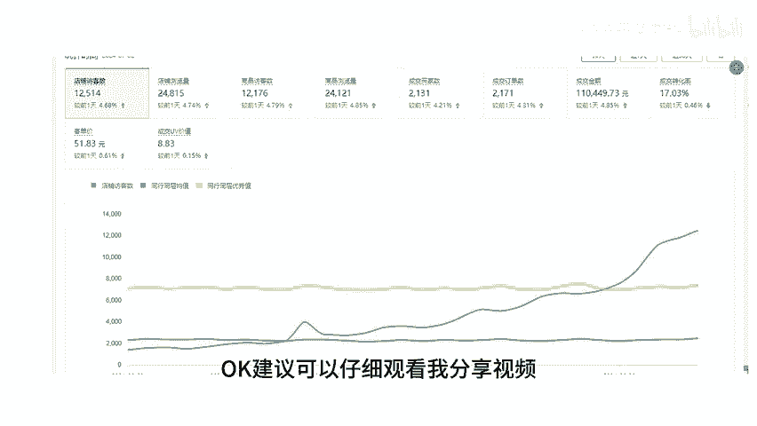

那店铺操作呢，对于我们很多的新手小伙伴而言的话，会有到很多的困难。这个很正常。如果说你店铺操作有遇到问题，或者有需要资料的，可以找我。那有时间的话，我也可以带着你一起去实招坐店啊。就像这些小伙伴一样的。

我们一起快速提升我们的运营能力，让我们店铺呢达到更高水平，好吧。

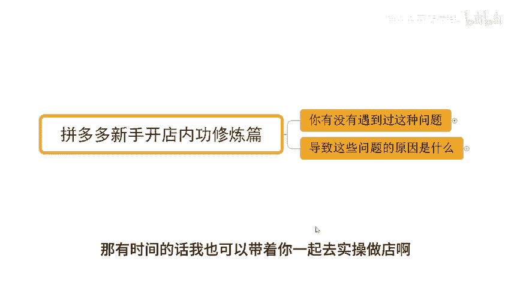

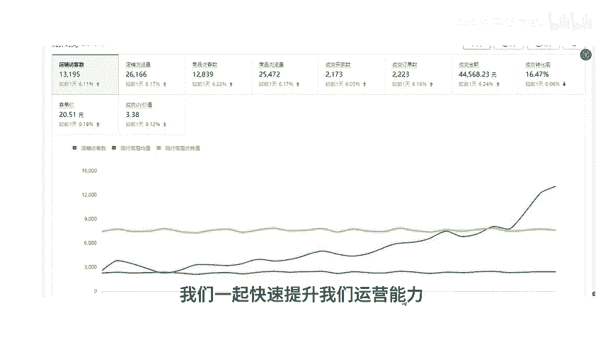

O。😊，那么既然说讲到我们的内功修炼篇，那么这个地方呢，我们先来说一说一些常见的现象啊，我不知道大家有没有遇到过这种情况啊，哪些情况呢？第一种情况可以看到啊，就是我店铺商品呢已经发布了。

但是呢没有什么访客啊，这种情况对于我们很多人来说的话，是一个非常常见的一个现象，对吧？几乎所有的人都会遇到过这种情况，只要你做了店铺的对吧？当然了还有像这种情况就是说哎我们店铺呢确实有一定的访客数据。

虽然说不多吧，但是呢有一定的数据量了，但是他永远都不会转化的。

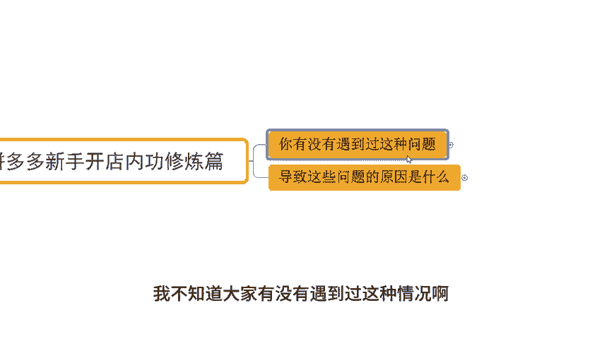

转化率极低啊，又或者是我店铺呢，哪怕是有访客的时候呢，也会有到很多人去咨询订单。但是呢他们流失会很高啊，动不动呢，这个人问两句就没有了，就不见了，对吧？

那么呃再一个就是我们自己产品呢可能啊价格竞争力会比较弱一点，对吧？所以平台推荐的权重也会比较低啊，这些情况我相信大家都有遇到过，对吧？

那么这些情况造成的原因其实啊大部分的情况来说都跟我们产品的内功有关系。

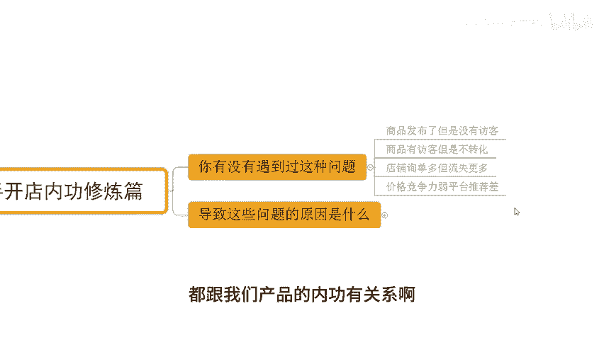

啊，都是有关系的。如果说你的内功有做到位的话，其实这些问题呢都是能够得到解决的，或者是对他们的解决都是有帮助的。

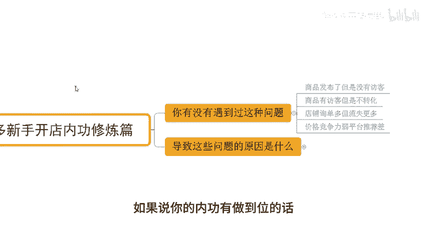

那么我们要展开说一说啊，看看哪些问题是我们内功方面的一个问题是我们可以解决的。好不好？首先第一个我店铺呢没有访客。好吧，那针对到没有访客呢，我们就要搞清楚一个事情，就是我的访客没有这个事情。

到底什么原因导致的，是因为我店铺没有曝光呢？又还是说我店铺没有点击，如果说是因为我店铺没有曝光。那么这个时候呢，就有几种情况，一种情况呢就是我的推荐曝光少，还有就是我的收lo曝光少。

又或者是我的售入排名比较低啊，那针对到不同的情况呢，我们需要有到不同的解决方案。第一个点就是我的推荐曝光少。那么推荐曝光呢，这个东西在我们前期运营的时候呢，其实是根据我们商品发布的基础曝光来决定的对吧？

那这一个部分呢是考核的我们商品的基础权重，而这个基础权重考核呢？O。

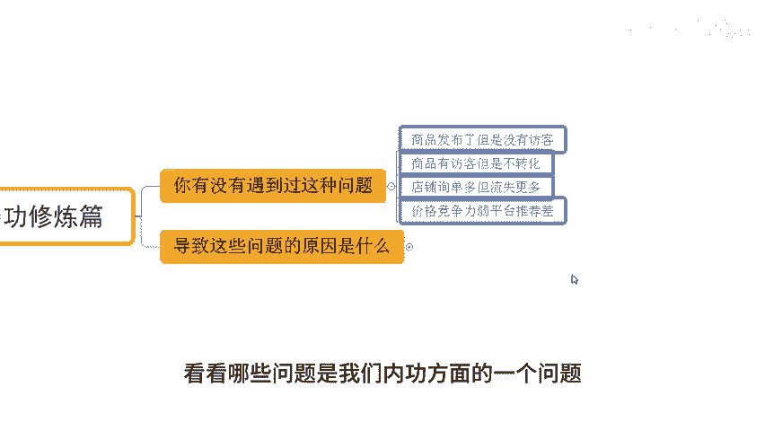

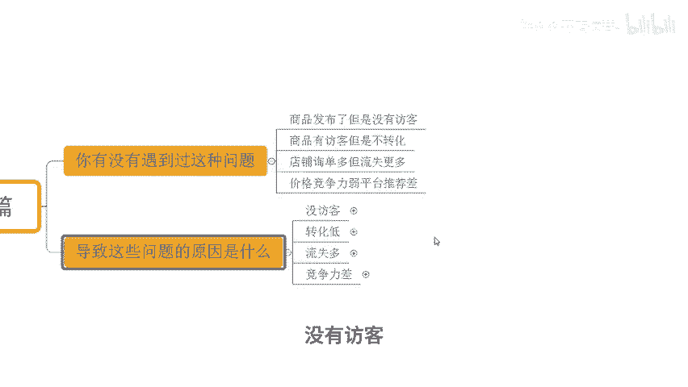

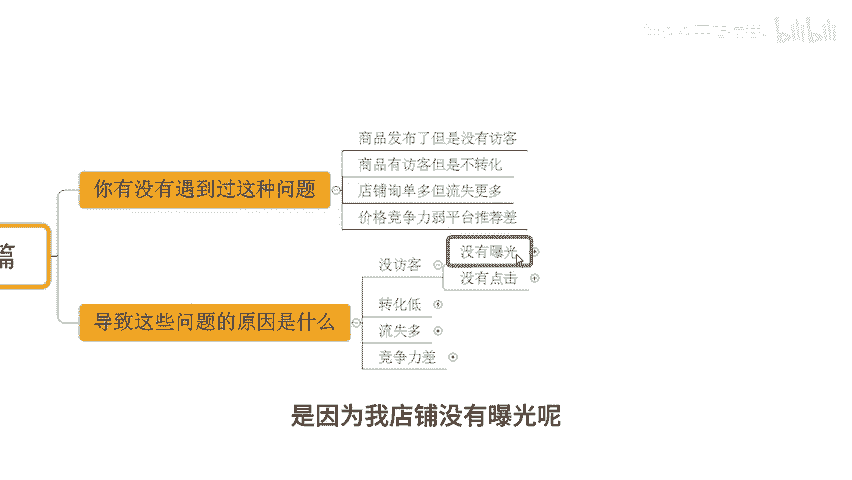

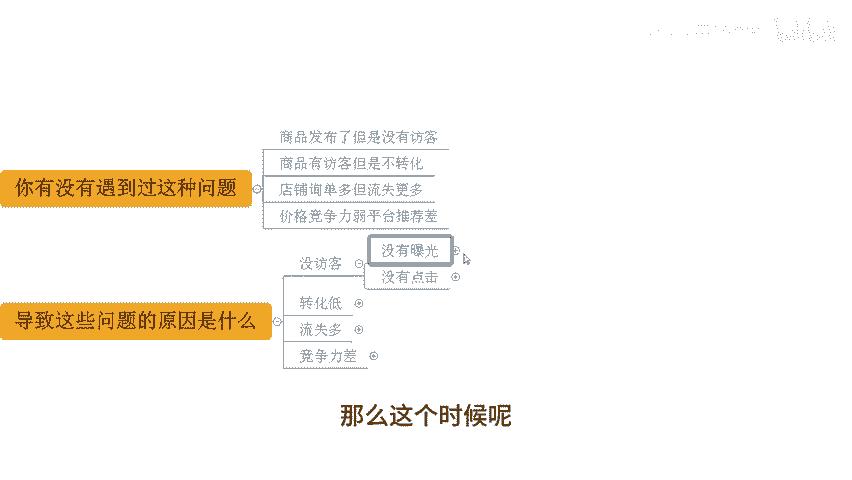

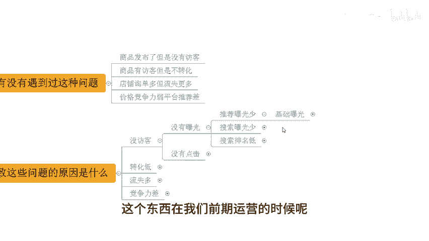

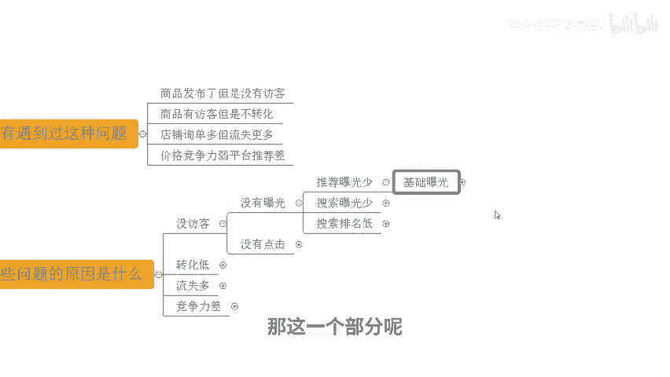

我们产品的标题，我们产品的关键字，我们产品的主图详情属性、价格等等啊，这些基础信息就会构建成我们产品的推荐曝光。那么如果说你一开始能够有到一个相对来说比较好的选品啊。

那我们产品呢本身是符合市场需求的一个产品，对不对？它是有一到一定的需求量，有到一定的这个曝光有到一定的这个转化啊，那么这种情况呢，我们上架之后呢，产品大概率呢，它的人群范围是比较大的，对不对？

也不会说说这个产品呢就是一个没有人要的垃圾产品，对吧？那么同时呢我们在操作过程中呢，能够去有到一个啊相对来说比较好的标题，能有到好的图片，能够拿到更好的系统的新品推荐权重的话，那么曝光自然然也不会少。

而同时我们产品的发布过程中呢，我的属性能够去覆盖到更多的潜力爆款的属性。那么这个时候呢商。

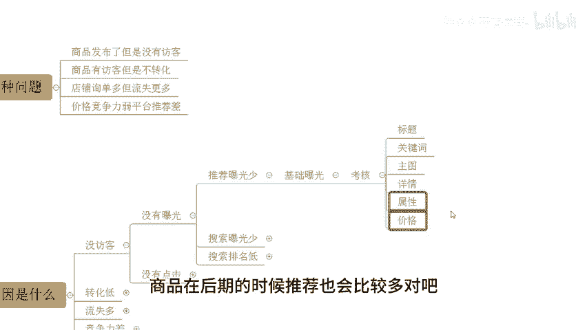

在后期的时候推荐也会比较多，对吧？那同时呢我们在价格设置时候呢，去设置好我们的热销价格段的一个露出价格。并且在我们的SQ设置的时候呢，去能够体现出的价格竞争力。当然呢，如果说是我们进行比价的话啊。

如果说不比价的话，我们去做好分比价，其实正常来讲，我们产品的曝光是不会太少的。所以这一个曝光少的板块的话，重点是两个部分，一个是选品问题，一个是发布过程中的一些设置问题。

那么这两个板块如果说你做到位的话，O推荐曝光不会少的。那如果说推荐曝光不少，对吧？我们产品是曝款，我们产品的发布过程中呢也是注意好这些所有的细节。那么有可能就是我们产品的搜索曝光少。

或者是我们的思路排名第。那搜索曝光少，什么意思呢？

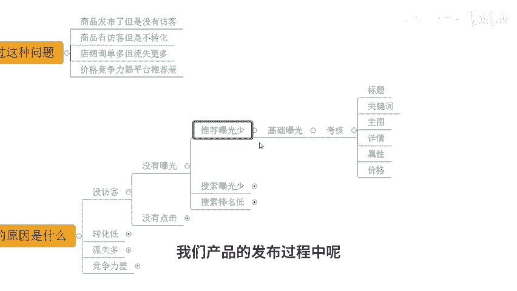

道理很简单了啊，那我自己产品呢在进行标题写作的时候，可能我用到的这些关键词呢，它的一个搜索量并不多，它的搜索热度并不高。所以这个时候呢，整个商品通过对应的这些关键词抓取到我商品的概率会比较低一点啊。

那么这个时候呢整个产品的热度少，那我的曝光也会少，对吧？同样的，哪怕是我能够去拿到一个相对比较高排名的时候呢，它也可能并不多啊，所以这就是我们关键词一个曝光少的问题。再一个就是我的抓取的关键词少。

就是大部分的关键词呢，因为我产品群种低嘛，它是没有办法抓取到我的。所以这个时候呢，如果说是我们想要拿到更好的曝光的话，我们要用到一些搜索热度高的词，同时呢让我们的产品有到更多的抓取值。

让更多关键词能够抓取到我的商品啊，那么这个呢考核到我们商品的数据，对吧？我们产品的点击产品的转化产品的客单价产品。

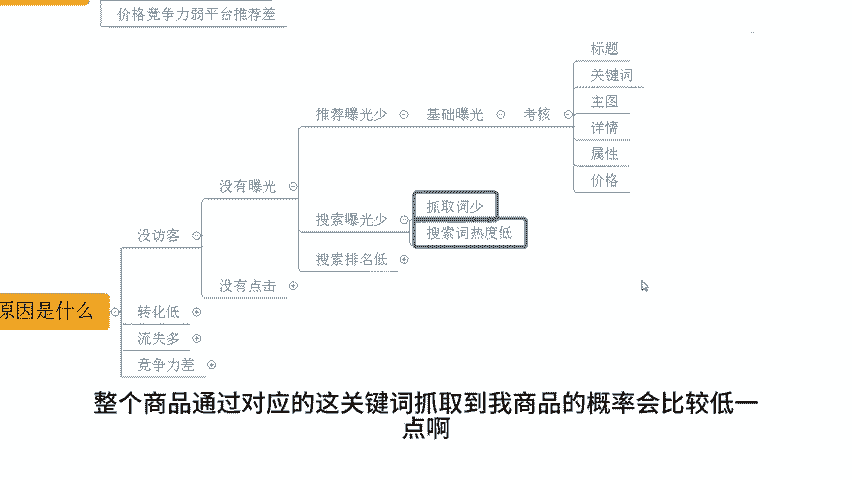

成交额产品的UV价值等等啊，这些数据进行考核的。同样的再往后呢，我们有到一个呃商品排名的问题，对吧？数额排名的问题。那么这个排名呢也是考核到我们对应关键词数据反馈的。那么这些数据反馈呢。

也是我们刚讲到的关键词点击呀、转化呀、坑产啊UV价值等等。

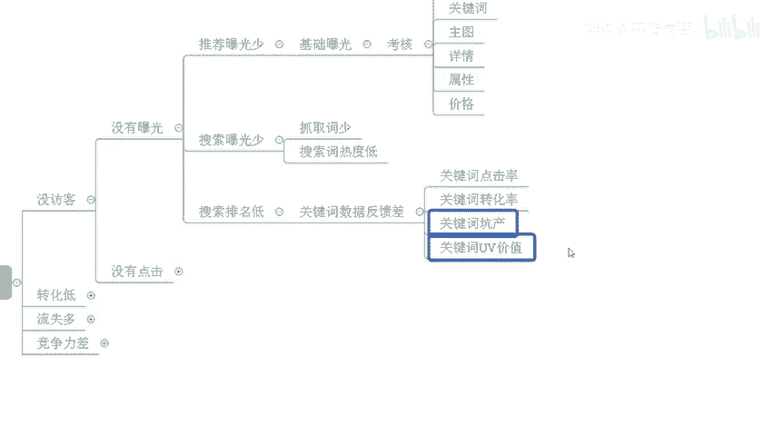

那这些东西做到位的话，OK那我的曝光是没问题的。当我曝光没问题的时候，如果说我们点击稳定的话，OK那我的访客是不会少的对吧？那么另外一点呢就是我们刚刚讲到的，没有点击这样的一个情况，对不对？

OK那么这种时候我产品都已经能够拿到好的排名了，都能够推荐出去了。

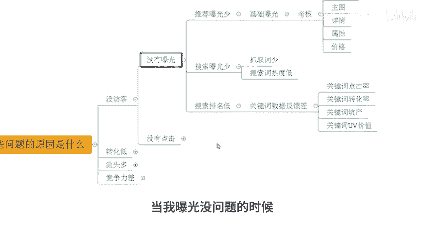

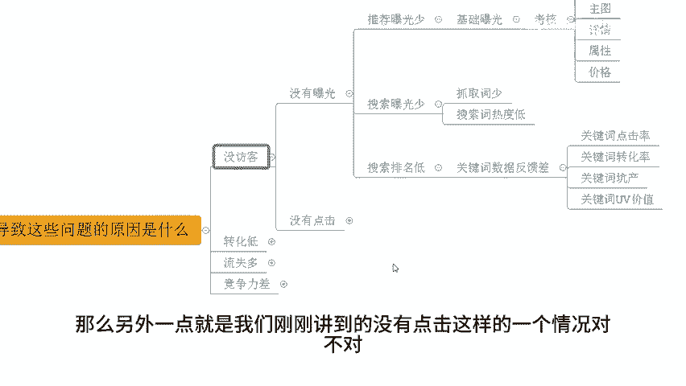

没有人进来我店铺，原因是什么？那大概率可能就是我们产品图片问题咯，对吧？图片没有吸引力，吸引力很差，或者是我们产品的价格没有吸引力，导致我们用户呢对我们产品不感兴趣。那么这个时候呢，我们用户就会流失掉。

所以说针对到我们产品呢在前期优化的时候呢，我们产品的选品，我们产品的发布我们产品的价格设置我们产品的这些数据，包括我们产品的各种的这个细节我们都要做到位，不然的话你后面很难运营啊，你推广出去之后。

你发现没有人点击的时候你会痛苦。推广出去之后，有人点击有没人转化时候，你也会更加痛苦，对不对？那么再来说转化低的问题。转化低呢，这个东西有很多的原因啊需要我们去了解，去分析啊。

所第一个就是可能我们有存在说流量这个不精准的一个情况。因为初期的时候，产品呢它没有办法说给到你一个非常精准的一个曝光非常精准的一个流量，对不对？所以这个时候呢我们产品在推的时候呢，就是一个泛流量。

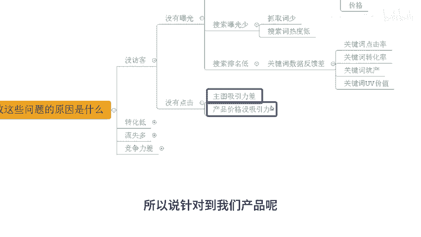

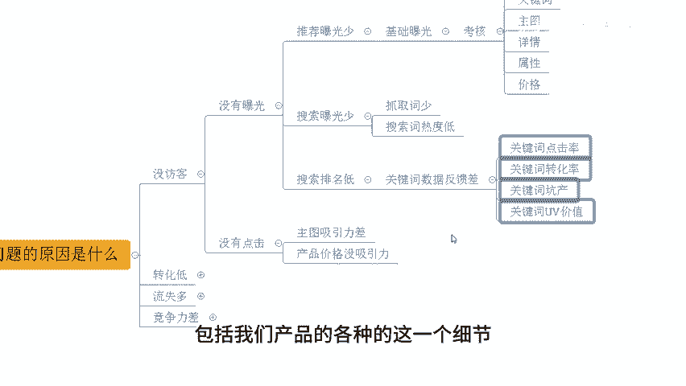

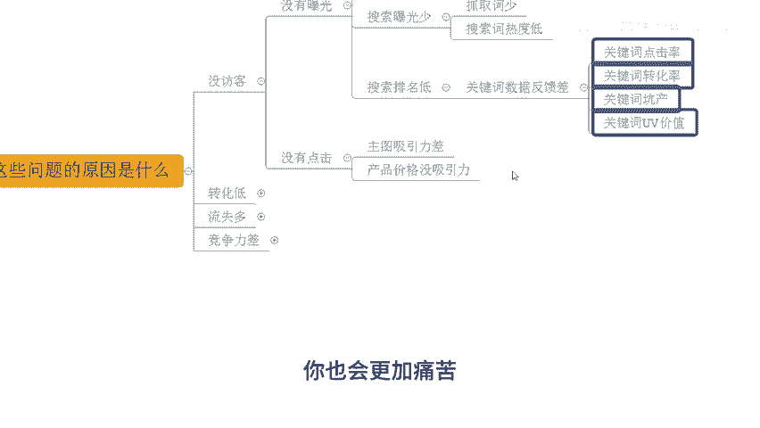

一个泛曝光。那么可能就会导致我们在很大程度上来说，那么我们进入到店铺的访馈呢，他可能并不精准。所以说我们一开始在做的时候呢，我们就要需要通过一个非常非常具备特定人群引导的一个主图来作为我的这个图片啊。

作为我的一个对外的展示图片啊。那么这个时候呢来引导出更加精准的用户进来我店铺来帮助我们呃这些用户呢更好的了解我店铺商品之后形成转化。因为大部分人可能他对我们产品是不感冒的对吧？

只有符合我产品的那些特别的一些精细化的一些人群。那么他对我们展产品转化的比较高。那有了这样的一个转化之后呢，后期我商品才能有到一个更好的数据反馈啊。那么再就是什么呢？我们的价格高啊。那么价格高呢。

它也会也是我们不转化的一个核心原因，对不对？那么这种情况之下的话，那我们可能也需要去通过对比的方式啊来完成我们的产品的价格指引，或者是通过我们价格布局的方式来进行一个用户心理价位的一个定位，对不对？

来完成后面引导转化的一个动作，也都是需要去做的。那么这个部分呢可能是更多心理层面的一个引导啊。那么再往后呢，就是我们产品的SQ与我们实际不符了。

用户呢他觉得这个产品好像是我需要的点来之后一看哎他的这一个功能呢，他或者他的这样一个组合方式啊，跟我实际需求呢可能有出入啊，他没有办法去更好的或者是没有办法去让我满意。

那我可能就会选择说别人的店铺看看有没有合适的，或者是别人店铺看好有看到合适的，我就走掉了啊，就这么个原因。那所以我们要针对这些方面呢都进行一个优化啊。那再一个就是我们的流失特别多。

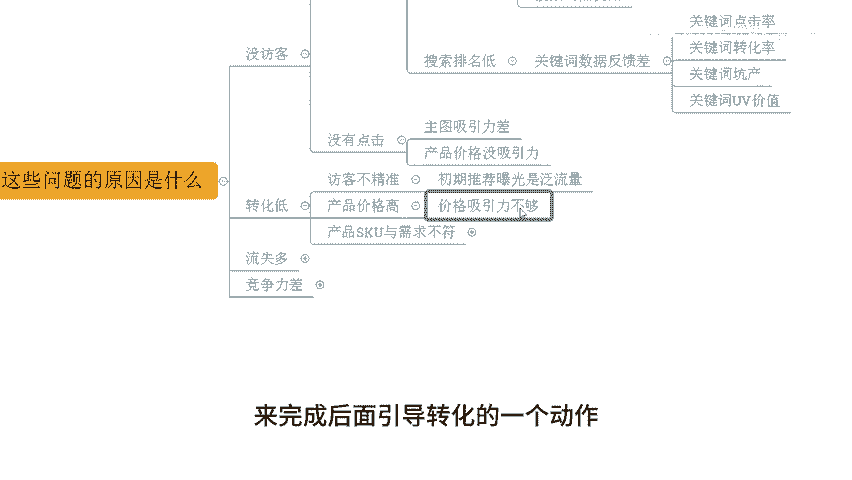

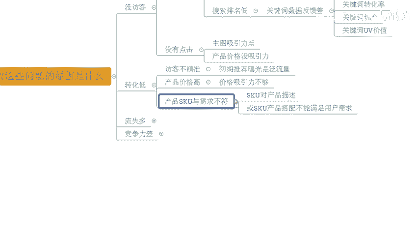

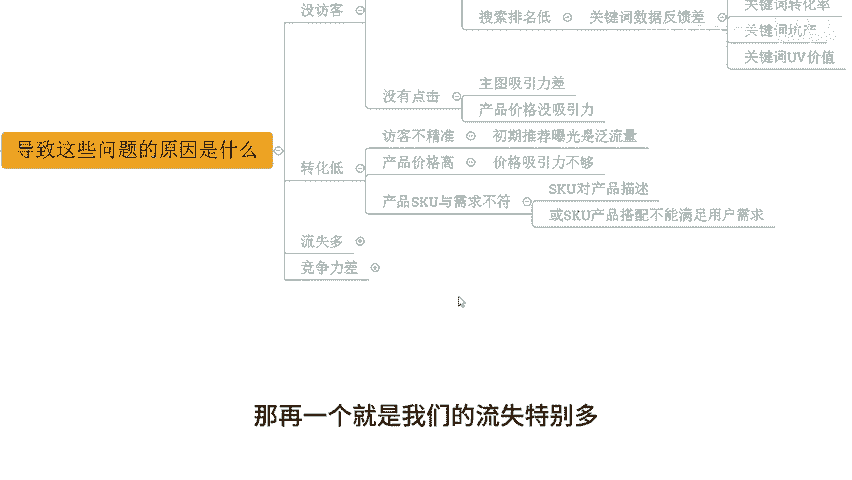

那流失特别多的话，这里呢就非常简单一个点呢，就是我们店铺呢没有记一点，我们记一点不够。那同时呢可能我们的价格竞争力呢也不够，对吧？导致用户离开我店铺之后呢。

他就不会再想着说哎找回来再进入到我们店铺里面去啊，就这样子的那所以我们需要让我们的用户呢能够去充分的记住我店铺，能够去充分的了解我店铺商品，并且能够去知道我店铺呢跟别人店铺的区别是什么。

能够让他喜欢上我的店铺啊。那再一个呢就是我们的竞争力差。那竞争力差呢，就是我们讲的价格高了，对不对？那我们这个价格高，我们应该怎么去进行一个价格的指引，怎么去完成我们价格的一个啊呈现啊。

那么这些东西通通的一步一步的做到位。

OK那我们的内功修炼才算是完善的，也才能解决到我们上面讲的这些没有访客，没有转化、流失多等等啊这样的一些问题。那么这些具体的操作细节啊，我会在后面的这一个视频里面进行详细分享啊，大家可以关注一下。

那对于店铺操作来讲的话，如果说你是有什么具体操作方面的一些问题啊，或者需要资料的呀，可以找我啊，那有时间的话还是那句话啊，我可以带着你一起去实操坐垫啊，就像这些小伙伴一样的。

我们一起能够去有到更好的操作方法，对吧？能够让我们店铺呢达到更高水平，好吧？OK那么今天的视频呢就到这里，我们下次再见，各位拜拜。

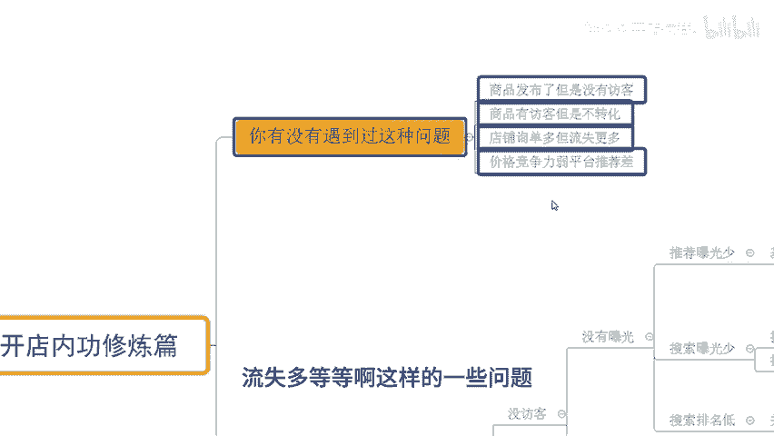

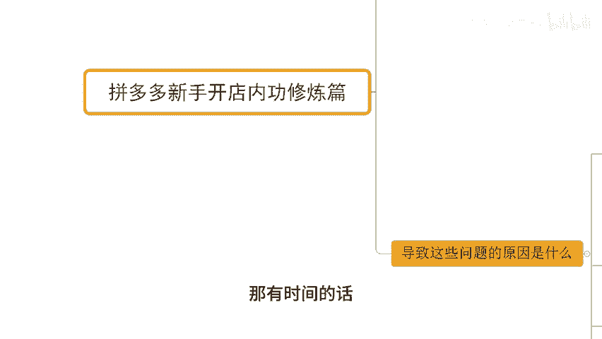

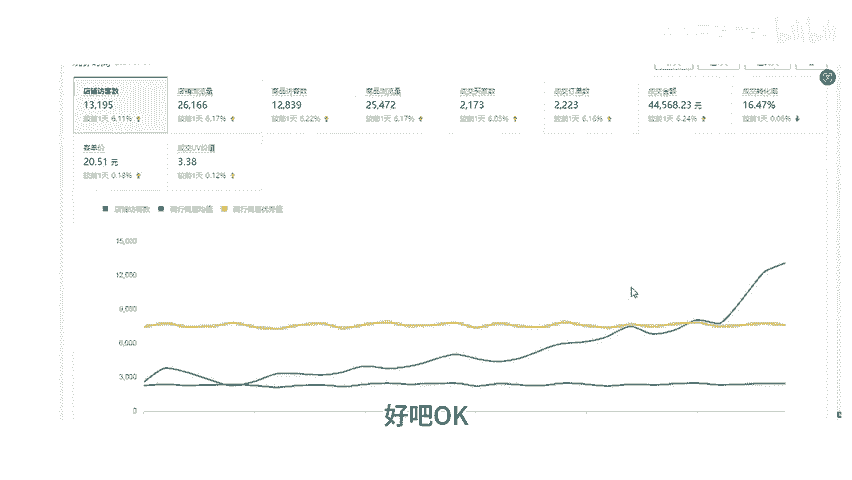