# 拼多多开店运营-新手电商运营实战指南，B站最全拼多多零基础入门教程！拼多多运营秘籍，小白也能成电商大亨！轻松上手拼多多，拼多多新手开店赚钱攻略 - P37：037 爆款商品选品逻辑 - 拼多多开店运营- - BV1xms8eSEVs

hello大家好，我是西楼。那么今天给大家分享内容呢是我们拼多多店铺运营没有访客，怎么办中的爆款商品选品逻辑的内容啊。

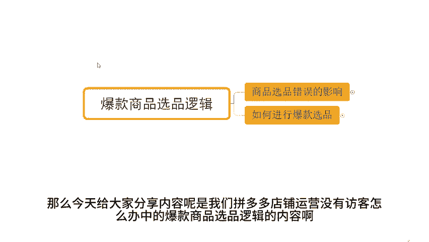

在费用之前呢，老规局先给他看一下近期跟着石他小伙伴他们的店铺数据，好吧。

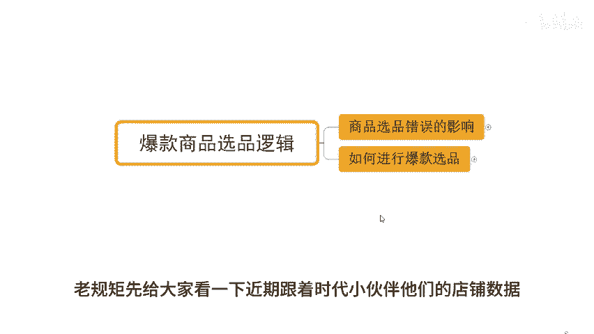

可以看到啊，像这个店铺原本呢是一个没有访客的新店啊，访客数据0啊。那么这样的店铺呢，我们拿到手里面之后呢，首先去通过我们的市场分析以及我们的竞争分析完成了我们的保款定位啊那完成爆款定位之后呢。

就开始进行我们产品的选品上架。那么上架之后呢来进行我们商品群动的获取不断的作优化啊可以看到啊，那么经过一段时间的数据累积之后呢，访客也呈现出一个非常快速增长的过程啊。

那后期的话一天的访客呢做到了1200啊，一天的订单呢是1900多单转化率呢做到了15。68啊，那当然了除了像这种零访客的新店之外呢，一些有基础有数据的店铺呢也是到很好提升的啊。

可以看到像这个店铺呢原本访客在5000多对吧？那么通过我们产品的优化产品结构的调整以及我们商品SQ的一调整优化啊，那么可以看到整体后期的访客呢也是呈现出一个非常快速增长啊。

当然呢这期间呢也会有一些波动啊，这个很正常啊。那么从最早的这个呃5000多访客呢做到了后期的一天24000的一个访客啊。那么订单的话，一天是3200多单，转化率呢13。06%啊。

包括还有像这个店铺可以看到啊，原本的访客呢只有几百个啊，那跟着实操之后呢，整体访客也是呈现出一个非常非常快速的一个增长过程。到后期的话，一天访客呢做到了10一0啊，一天的订单呢是1300多单。

转化率呢11。88%。那么这些店铺呢也都是通过战流的方式来操作的啊。如果说你想通过暂留操作店铺，你想要通过暂流来打造爆款，OK这样也可以仔细观看我分享视频，好吧。

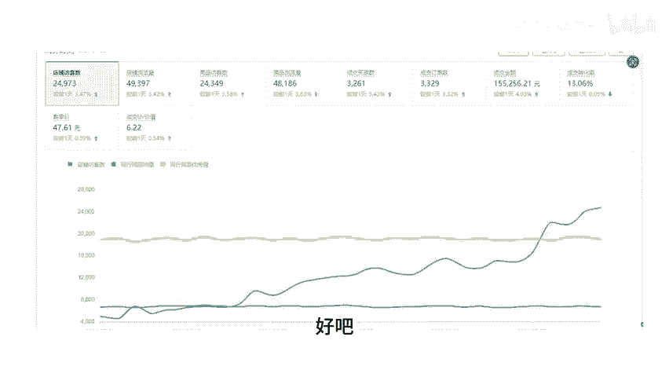

那么。😡，店铺运营呢对于我们很多的新的小伙伴来说呢，会有到很多的困难啊，这个很正常。如果说店铺操作过程中你有遇到什么问题啊，或者是有需要运营资料的呀，OK可以找我啊。有时间的话。

我也可以带着你一起去实操坐店啊，就像这些小伙伴一样，我们有到更好的操作方法，让我们店铺呢做到一个更高水平，好吧。

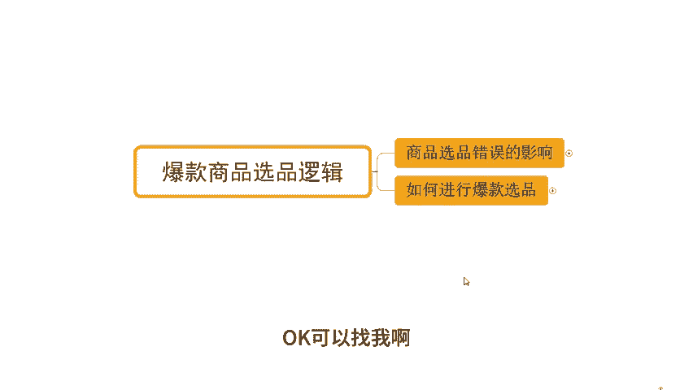

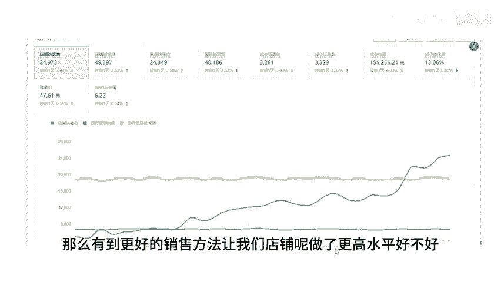

那么我们讲这个店铺没有访客怎么办？为什么会提到说爆款选品的一个逻辑呢？这个东西呢也跟家说一下，其实很简单啊，那如果说我们店铺呢本身在产品选品过程中会存在一些问题的话。

商品本身就是一个呃有到一个呃在市场份额上啊，占比比较小的一个情况的话，OK那么这个时候呢访客自然会少啊，或者是说我们生命周期会比较短啊，所以说我们要搞清楚这个东西。

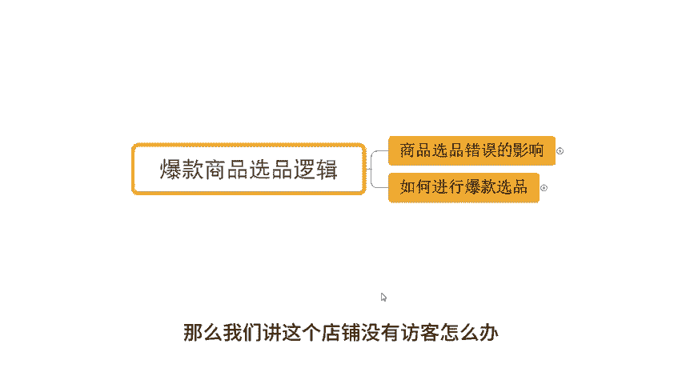

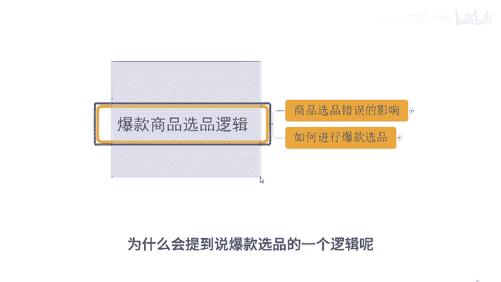

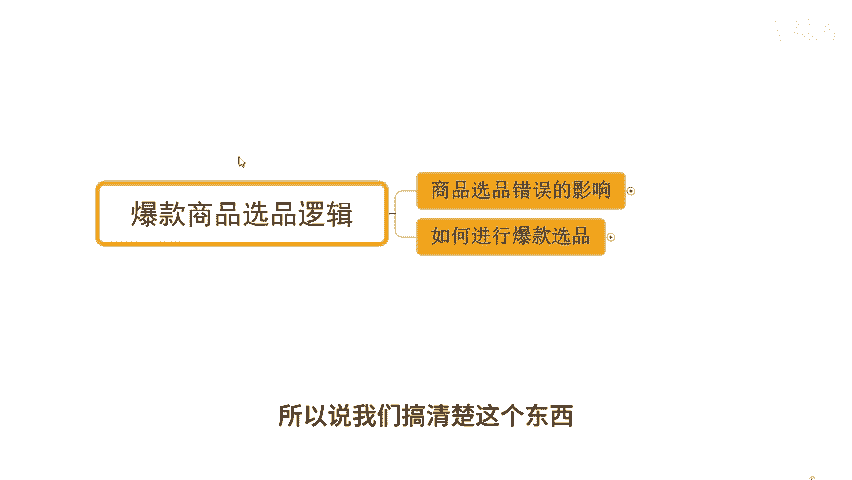

那我们具体来看一看啊，商品说名错误呢，它的影响有哪些？

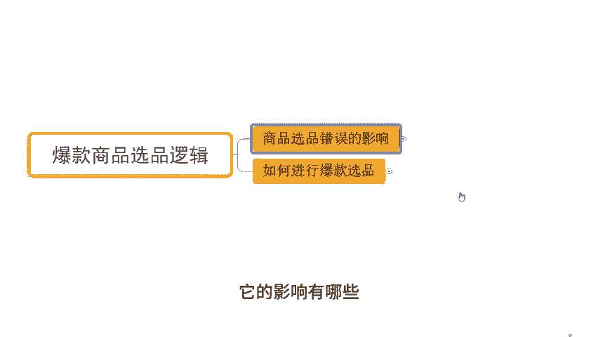

首先第一件事情呢，就是我们商品呢可能会下架啊。那当我们商品上架之后呢，如果说我们的商品和我们的店铺类目不符，那么这个时候呢，也可能会被平台下架掉啊。当然还有到其他一些原因啊。

也可能会导致我们商品被下架啊。那么这一个下架过程中呢，会占用比较多的时间啊，我们商品呢可能需要重新去编辑，然后审查，然后再上架啊，那么这个时候呢会浪费到我们大量的时间跟精力啊。嗯。

包括说我们在这个过程中呢，可能也会有一些经济损失啊。那这个时候呢，本身这一个店铺商品下架这个行为呢，也会导致平台对我们店铺。

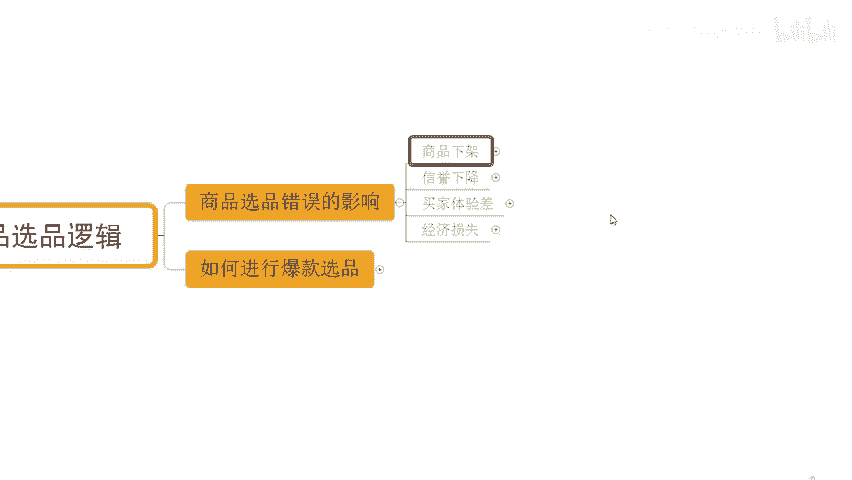

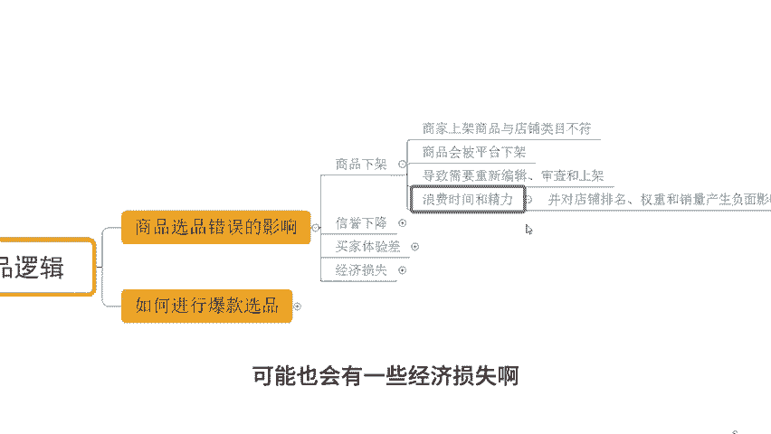

有到一个降权的一个操作，对吧？会导致我们。我们店铺的这一个啊访客受到影响。同时呢我们在啊操作过程中，如果说确实存在说一些产品啊或者是比较多的产品呢是属于这种一个情况的话。

那么我们本身商品权重呢也会受到影响。就是我们产品整体排名呢，包括说我们销量呢也都会受到是损失啊，所以说它是不利的啊。那么再一个呢就是我们的信誉会下降啊。

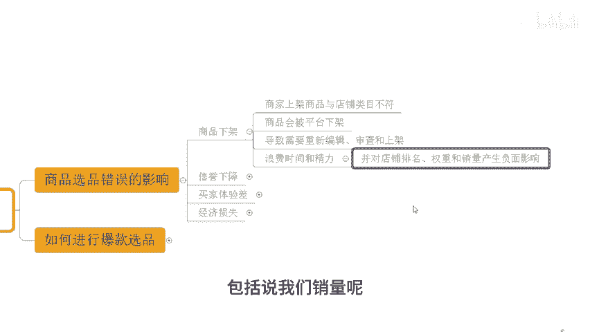

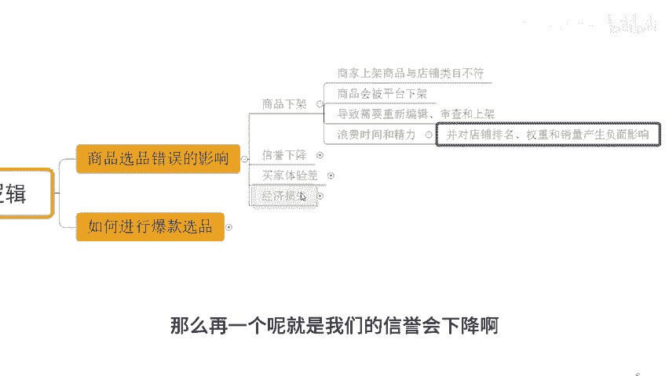

那选品错误呢，这个时候呢就会导致我们店铺呢在店铺的信誉上呢有所损失。比如说呃我们产品本身有些瑕疵，或者是在我们的这个。

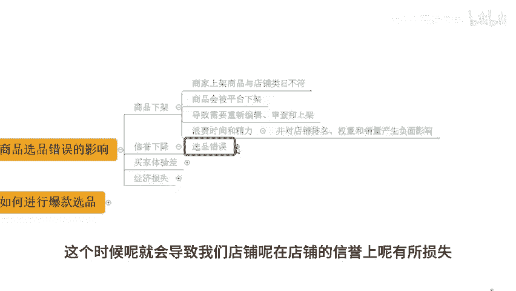

这个销销售的过程中或者售后过程中维护的过程中。有一些问题的话，那么也会导致我们店铺的一些这个性誉下降啊，尤其是在我们这个产品啊，存在说一些这个假货泛滥呢，或者是呃质量劣质的一个产品的这个过程中呢。

那么一定会损失到我们消费者，对于我们啊商家啊，包括说对于我们平台的一个信任。那么这个呢也会不利于我们产品排名的提升。包括说呃我们可能会是因此受到比较多的一些呃差评，对吧？

那么会直接引起到我们店铺后期的推荐啊，那么这个是得不偿失的。

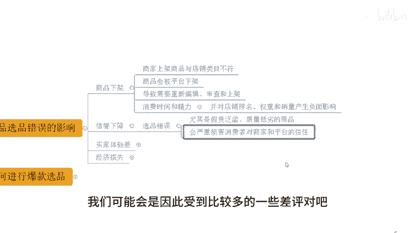

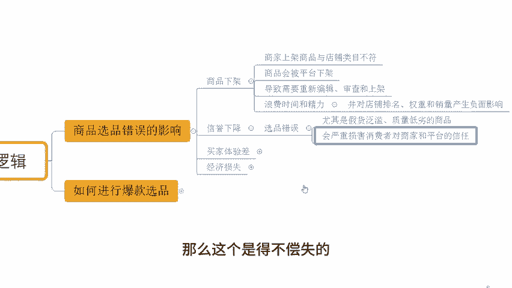

那再一个呢就是我们的买家体验会比较差啊。那当我们产品学名错误的时候呢，可能会导致我们用户呢在搜索和购买过程中啊，遇到一些跟他的需求不匹配的商品。那么这个时候呢就会降低我们用户的购物体验啊。

我们用户呢就会觉得哎这个平台。

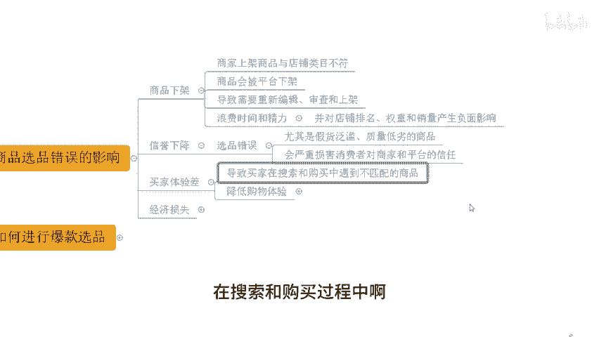

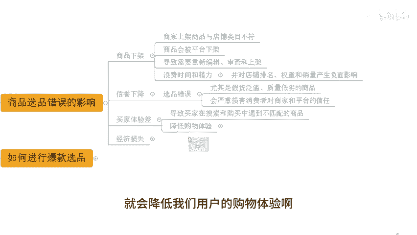

好像产品跟我自己真正想要的东西不太一样，对吧？会导致消费者呢对于我们的店铺，对于我们的平台呢，它的满意度啊会下降啊，会受到一些影响吧。那么这个时候呢，当我们有到这种信誉下降啊，有的买家体验下降的时候呢。

OK。平台对于我们店铺的推荐曝光，对于我们产品的一个呃这个呃排名啊都会受到一些影响啊，得不偿失哈。那再一个点呢，就是我们经济的直接损失哈。

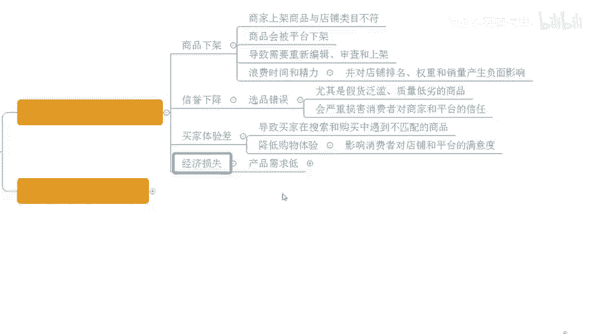

那如果说我们今天做的这个产品呢，它的用户需求呢会比较低啊。那么这种情况之下的话，我们产品在上架之后呢，可能我们会花费到时间，花费到人力资源，花费到一些资金去操作这个产品。

但是呢这个产品的市场需求很低的话，就会导致一个问题，就是这个产品可能它的生命周期很短。或者是它就没有销量啊，那么就会导致我们店铺呢在前期投入的成本呢。

是没有办法去这个通过销售产品的方式来进行这个回收的啊，就会导致我们店铺的利润呢受到损失，会导致我们店铺的资金直接损失啊，那么这个得不偿失的。

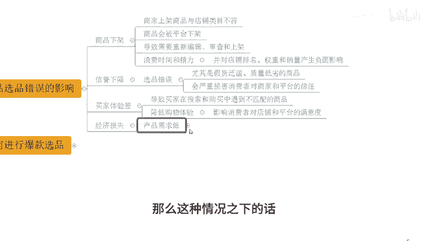

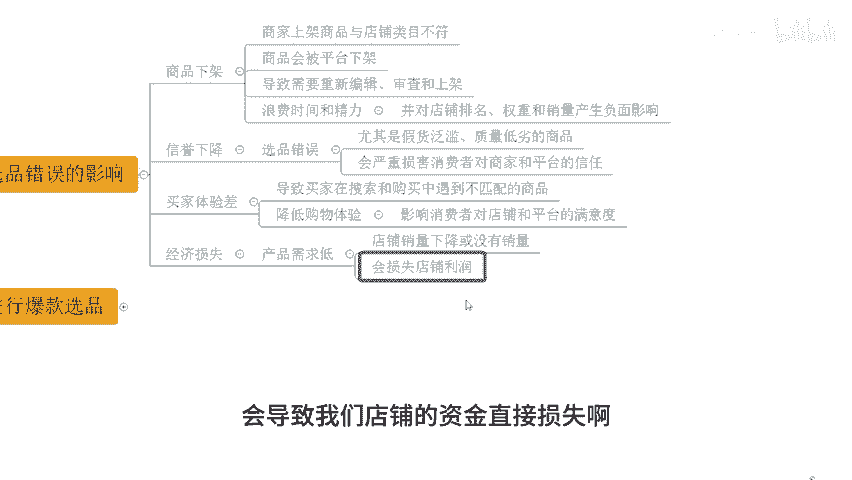

OK那我们如何进行我们的爆款选品啊，来提升我们店铺访客呢？来看一下啊，首先。

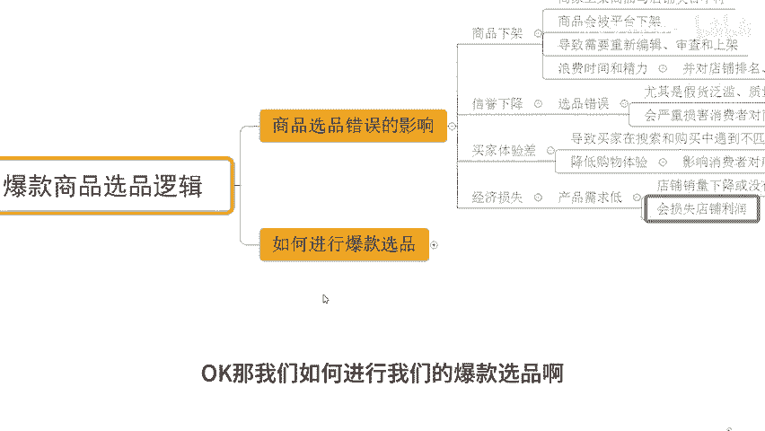

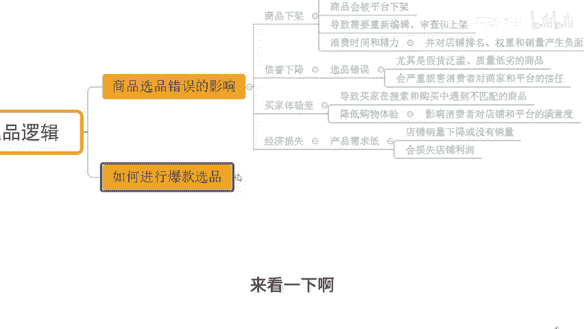

第一件事情呢，我们要确认买家的需求啊，这个是非常非常直接的一个点啊，就是只有符合我们的需求的产品呢，才能成为爆款。这句话大家记一下啊，那。

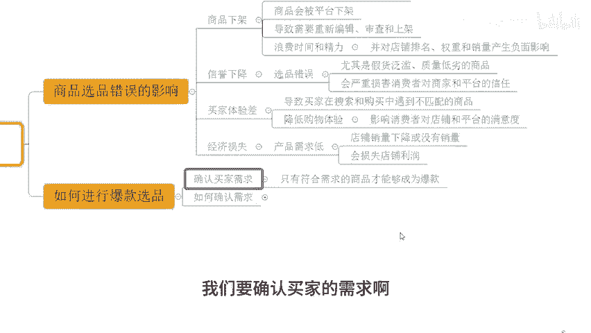

如果说我们现在进营的这个产品，它本身就没有市场需求或者市场需求很低。这种情况之下，你是不可能让这个产品成为爆款的。因为这样子去做的话，你的市场份额就比较小，你上限很低，对吧？打个比方。

今天我做的这个产品呢，头部商家一天就卖个三亩单，你说你去做你能做成三亩十单吗？不太现实，对吧？当然呢你说这种细分类目呢，我可以通过多链接多店铺的方式去进行一个霸屏操作。

让这些用户呢通过不同的店铺进入到我的这个这个呃产品里面来啊来进行销售啊，可不可以可以，但是他始终没有办法去有到非常大体量的一个支撑啊，来带来更好的一个收益啊，这是肯定的啊。

所以说一开始我们要确认好这个产品呢，确实是存在一个非常大的市场需求，能够去有到一个很好的这个销售的一个市场环境啊。那如何去确认一些很好的市场需求来满足我后期的产品的发布。包括说我们后期的销售呢来看一下。

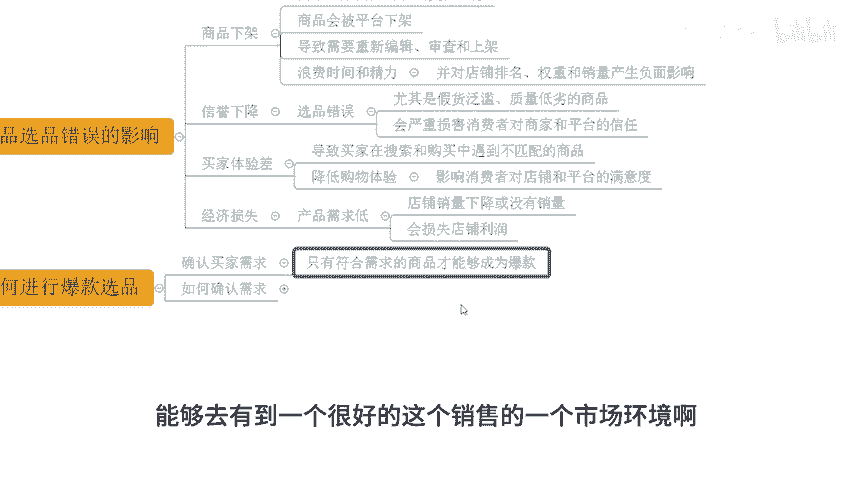

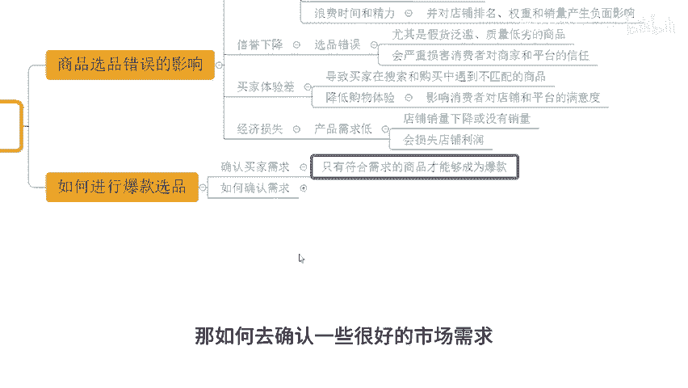

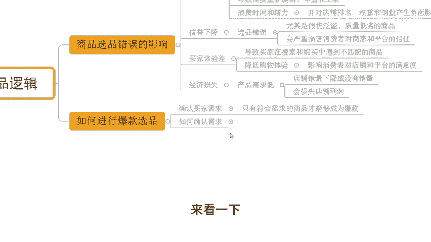

第一件事情呢，我们可以通过平台的爆款来完成选品。那么如果说这一个产品呢，在我们的平台上呢，它本身就是一个爆款。或者是我们在通过市场上，通过我们自己平台上这些爆款来进行分析，找出符合更多爆款特性的产品。

那么这个时候呢，这个产品至少来讲它在我们上架之后呢，它是有机会去获取到更好的人群覆盖范围的。是会有到更好的市场需求的。那么这个时候他去做的时候呢啊体量就不会太小，成功的概率也会很高啊。

包括在后期经营的时候呢，可能也会有到啊更好的数据啊。那么再一个呢，就是我们的活动爆款选品。比如说我们平台上呢有很多的商品呢会进行一些活动的投放啊，像我们啊尤其像竞价活动啊。

我们可以看到在竞价活动里面呢会有到前一天。某某商品啊，它的一个销售的一个数据对吧？当然这个数据呢是一个区间啊，比如说1000到2000啊，1500到2000啊。

2000到2500的等等啊这样的一个销售区间。那有大量的类似这样的产品，在我们这个品类里面出现。那么我们的商品又刚好是跟这一些商品重合的，或者是相似度比较高的。

那么就说明呢我们这样的产品呢是能够去有到一个很好的市场份额的啊，那我们去做的话，它能够成为爆款的概率也会很高啊。那么我们这后续销这个操作的时候呢，它也会有到一个更好的一个市场数据。

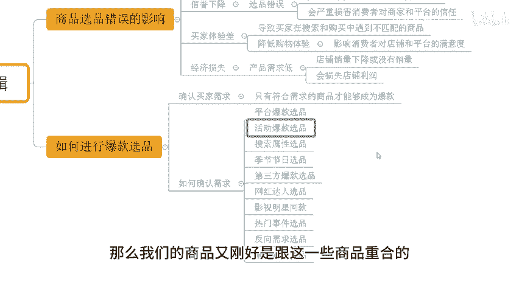

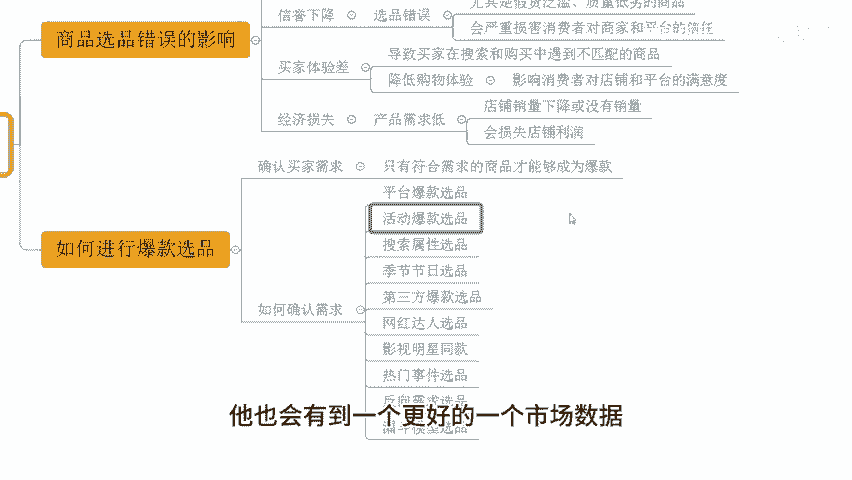

那么再来就是我们搜属性选品啊，当我们进行产品发布之前呢，我们要去确认好我们的市场的一个情况，对不对？那么其中有一个非常关键的点就是搜索啊，那我们通过搜索值的分析呢。

能够确认好平台上的一些热搜关键词是什么。那么其中呢针对到这些热搜的一些属性来进行分析，找出符合这些属性的产品，能够更好的覆盖这些热搜词的一个产品。

那么这个时候呢我们后续可能获取到的一个市场份额呢也会更大啊。O那么这几个点呢，就是在我们平台呃类啊进行的一个呃对比的一个方式来进行选品啊。那么另外呢就是我们需要去进行一个更好的时间节点的把控啊。

像我们季节跟节日的一个选品啊。那么不同的时间节点，不同的季节呢会有到不同的商品需求。那我们可以通过提前的预判来完成这部分操作。比如说我们的。

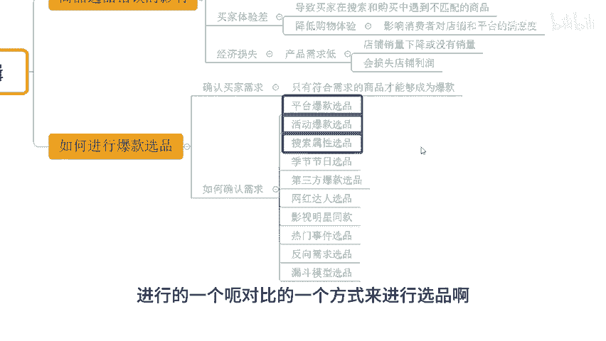

啊，端午节，我们的中秋节会有到一些特定商品，它会有到特定需求。那我们可以提前去布局操作啊比如说我们的春节，我们的一些这一个呃元宵节，对吧？它会有到一些节日用品，它也会有到一个很好的一个市场需求。

那么我们可以提前去完成布局啊，这都是我们去操作的一个方向啊。那么当然呢还有到一些产品呢，它本身有到一个非常好的一个季节性的对吧？啊，比如说我们的服装，那么一年四季呢，它会有到不同的这个产品的一个需求。

那么针对到不同的季节，那么不同的产品，我们可以提前去做好布局去完成操作，也是可以有到一个很好的呃这个后续的一个反馈啊，都是可以的。那么除了这些之外呢，另外还有一点就是我们的第三方爆款选品啊。

那比如说我们在淘宝，我们在京东啊等等各种各样的一些电商平台。那么存在一些新的爆款出现。那么拼多多平台是没有销售的那么我们可以操作啊。这个时候呢这些产品呢在其他平台上经过市场认证，市场验证的对吧？

那我们平台上呢也可能会有到一个很好的需求也是可以的啊。那么再呢就是我们的网红达人选品，还有我们的影视明星选品啊，这两个版本呢其实差不多啊差不多。

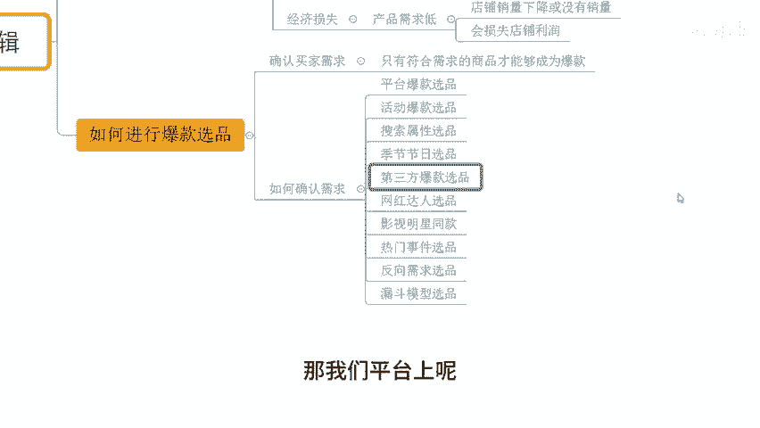

那呃网红达人呢他们会进行一些商品推荐啊，那么这些商品呢可以在很短的时间里面呢呈现出一个非常好的一个热度，对吧？包括像我们的影视作品里面出现的一些明星产品啊，也是一样的道理。

它会在很短时间里面非常大的一个热度产生啊，那我们可以通过这样的方式来关注这些变化啊来进行一个产品发布啊，也是可以的啊，当然呢明星同款商品呢还有很多啊一些周边产品也会出现啊，那么这个也是一样的道理啊。

那再一个就是我们的热门事件选品啊，这个东西呢也是可遇不可求的算式啊，我们需要去不断的关注我们生活环境中的一些热门事件啊，那么这些热门线产生呢也会有到不同的这个商品的一个需求和和这个商机产生啊。

比如说像我们这个之前啊。😊，有到这个呃。罐车运油事件对吧？这样事件呢虽然说是一些恶性事件啊，但是呢也会带动到一些其他产品的一个呃热度上升。比如说像我们的这个呃榨油机，对吧？

那么呃很多的这个人呢也都会对这方面呢有到很大的需求，他会觉得自己去榨油呢会有到一个更好的保障啊，那呃据不完全统计啊，当时出现这样的一事件之后呢啊那么这个榨油机的这个搜索热度啊。

包括说产品的一个市场体量呢上涨了8到10倍啊啊，后续呢还在不断的攀升啊，具体的一个数据呢不是很清楚啊，那没有去过多关注它，所以这样的一东西呢我们都可以去关注起来哈。那再一个就是我们的反向需求选品啊。

就是呃类似我们呃大多数产品呢会有到非常高的一些热度，对不对？那么这些热度呢它是代表了一定的受众群体的。但是有人喜欢黑，就有人喜欢白啊，那市场大多数人喜欢黑的时候呢。一般的情况之下，就会有到很多的商家。

包括说我们头部商家可能会更多关注这一个喜欢黑的人群。因为这一部分是一个很大商场体量。但是在这个情况之下呢，还会有到一部分人呢。他们是喜欢白的，但是喜欢白的这部分人是少部分人啊，他们有固定的需求。

但是真正意义上去符合他们需求产品，相对来说去正常经营的人会比较少。那么这种情况之下呢，我们去做这种产品呢也可以有到一个很好的市场的一个反馈啊，也是可以的。那么再呢就是我们的漏斗模型选品啊。

那么这种模型选品呢。

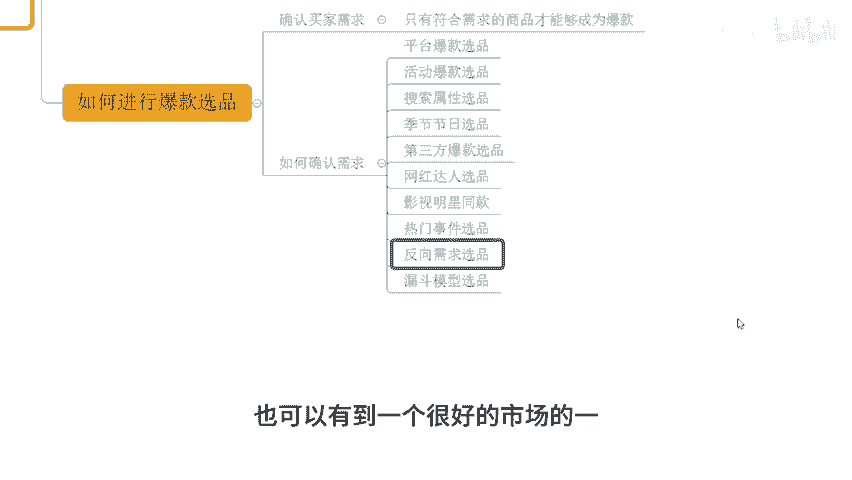

他呢可能会相对啊成本会比较高一点。它是通过我们完成了我们的摄入分析之类的一些方法之后呢，去大批量的找到类似啊具备潜力商品的潜力潜力爆款商品的一个一个产品之后啊那么进行一个产品上传之后呢来进行数据筛选的啊。

那一层一层的去筛选啊，筛选出点击好的筛选出转化好的筛选出客单价高的筛选出优V价值高的等等啊，筛选出来之后呢来针对性的进行单独运营啊，是这样子的啊，所以呢也可以帮我们找到一个更好的产品。

但是呢这种方式呢可能对于我们很多商家来说会成本较高啊，不太建议大家去做重点呢还是直接去通过潜种方式去完成它啊，可能会更好一点。好吧？那么当我们完成这些动作之后，O我们商品呢是已经符合平台的爆款属性的。

已经满足了平台爆款的一个潜置的，对不对？我们就重点运营的话，那么O它起报的概率就更高。同样的它的访客也会更多，好吧。

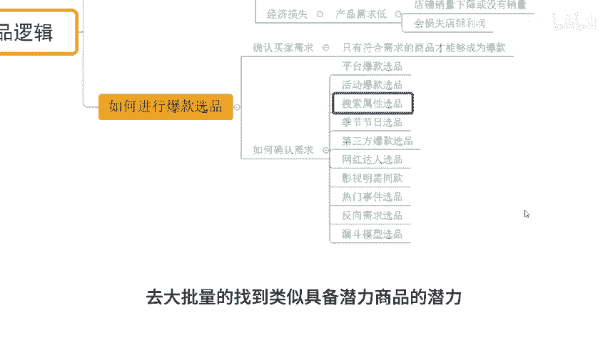

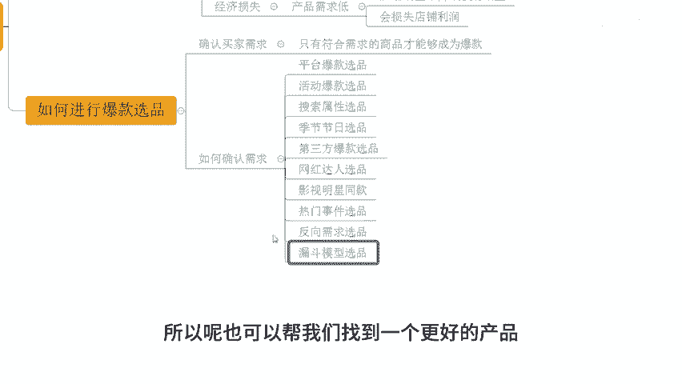

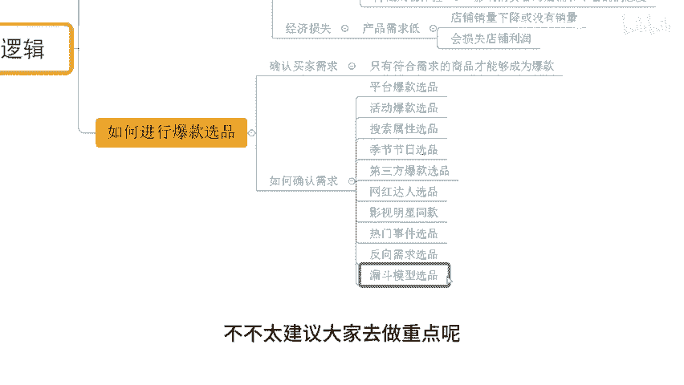

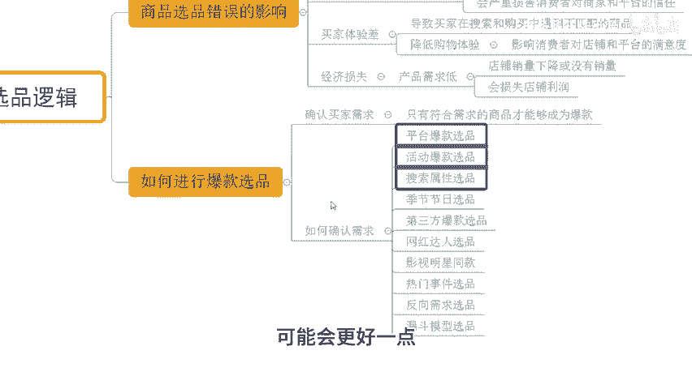

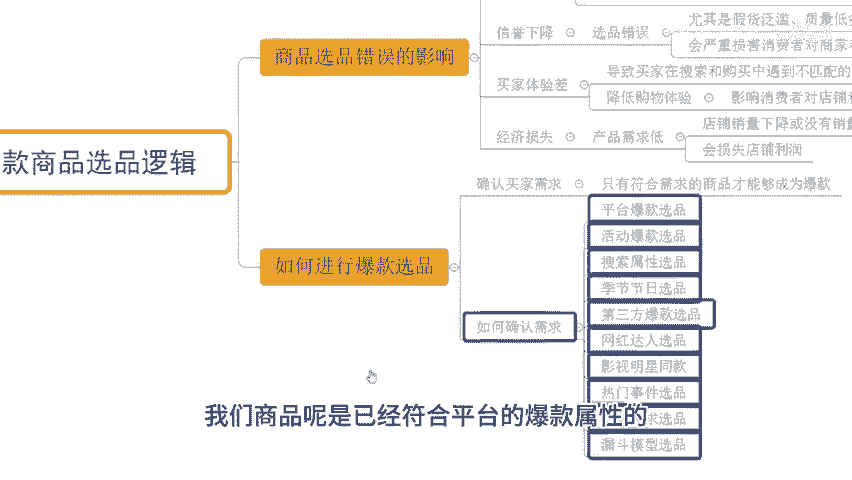

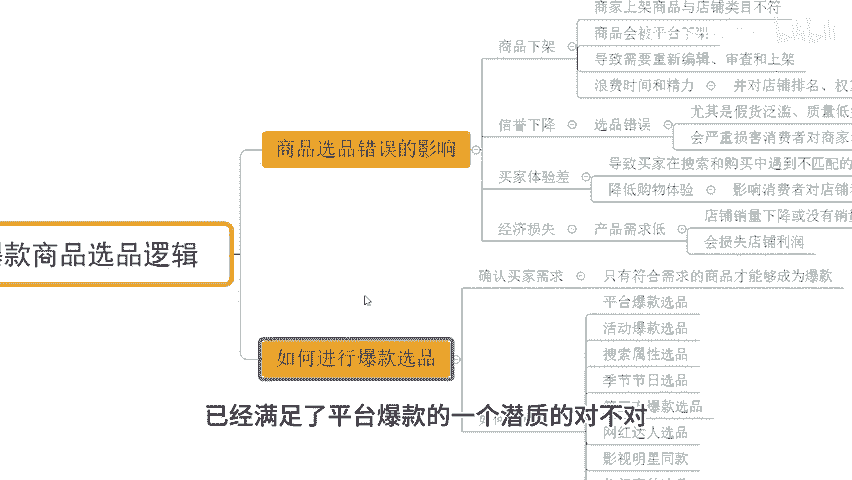

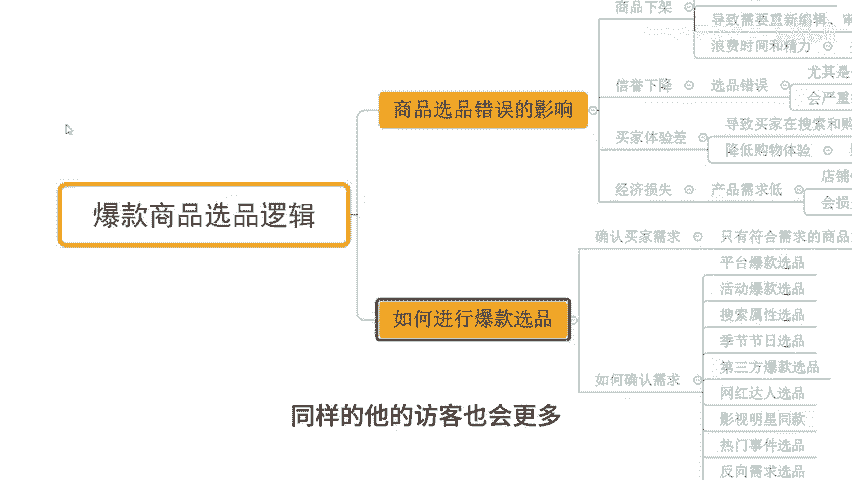

OK那么以上呢就是我们爆款上面选品逻辑，对于我们访客的影响哈。那么就分享到这里。如果说你在店铺收过程中呢，有什么问题呀，或者需要资料的呀，O可以找我啊，有时间的话，我也可以带着你起续操作店铺啊。

那么就像这些小伙伴一样，我们一起能够有到更好的方法，让我们店铺呢达到更高水平。好吧。那多的就不多说了。那么今天的分享呢就到这里，我们下次见，各位拜拜。

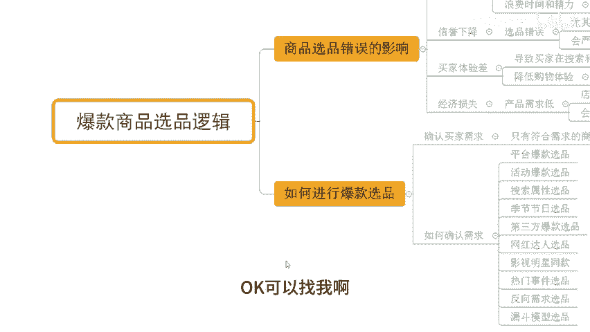

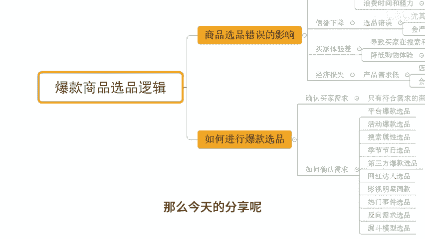