# 拼多多开店运营-新手电商运营实战指南，B站最全拼多多零基础入门教程！拼多多运营秘籍，小白也能成电商大亨！轻松上手拼多多，拼多多新手开店赚钱攻略 - P38：038 店铺体验分维护 - 拼多多开店运营- - BV1xms8eSEVs

hello，大家好，我是西楼。那么今天给大家分享内容呢是我们拼多多店铺没有访客，怎么办中的店铺体验分维护的内容啊。在分享之前呢，老国局先给他看一下近期跟的室的小伙伴，他们的店铺数据，好吧。

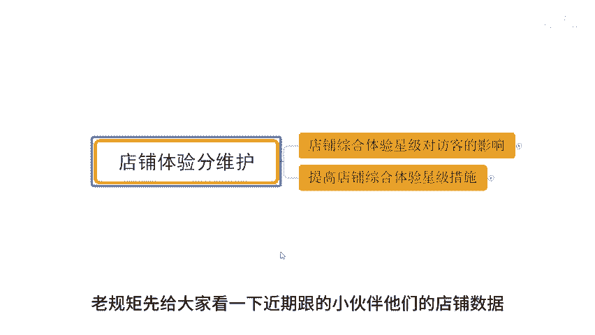

可以看到，像这个店铺呢，原本访客呢只有几百个啊。那么跟着实效之后呢，我们通过产品的结构调整，通过我们上品SQ的调整等等啊进行优化。那么访客呢也在不断的提升啊。

到后期的话一天访客呢做到了1000一天的订单呢是1300多单，转化率呢做到11。88啊，还有像这个店铺可以看到原本访客呢在5000多啊。那么跟着实效之后呢，也通过我们产品的结构调整等等啊。

已心理优化之后，访客也在不断的增长啊，到后期的话一天访客呢做到了200一天的订单呢是3200多单。转化率呢做到了13。06啊。当然呢除了像这种有基础有数据的店铺之外啊。

一些你访客的新店跟着实效也是可以得到好提升的。可以看到像这个店铺啊，原本的访客是零啊，一个纯新店来的。那么跟着实操之后呢，我们通过市场分析，通过我们的竞争分析完成了我们的爆款定位啊。

开始啊选品之后上架操作。那可以看到，那么通过不断的运营呢，商品访客也在不断的增长啊，到后期的话，一天访客呢是做到了12000啊，一天的订单呢是1900多单，转化率呢15。68。那么这一店铺呢。

也都是通过自然流的方式来操作的。如果说你想要知道如何通过自然流来测店铺，如何通过自然流来找到爆款OK建议可以仔细观看我分享视频，好吧。

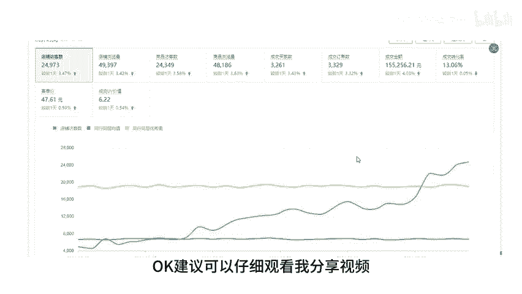

那店铺运营呢对于我们的新入小白来说呢，会有到很多的困难。这个很正常。如果说对于店铺操作，你有什么问题呀，需要资料的呀，OK可以找我啊。那有时间的话呢，我也可以带着你一起去实操坐店啊。

就像这些小伙伴一样呢，我们能够有到一个更好的操作方法，能够让我们店铺呢达到一个更高水平，好吧。

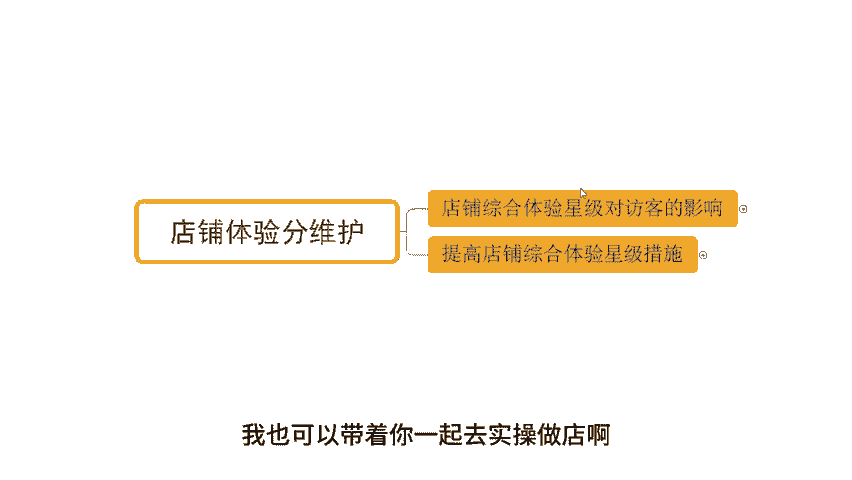

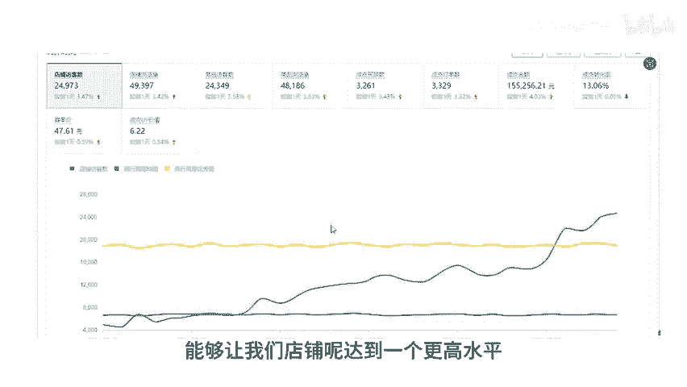

OK那我们来重点聊一聊店铺体验分维护对于我们访客都有哪些影响啊。

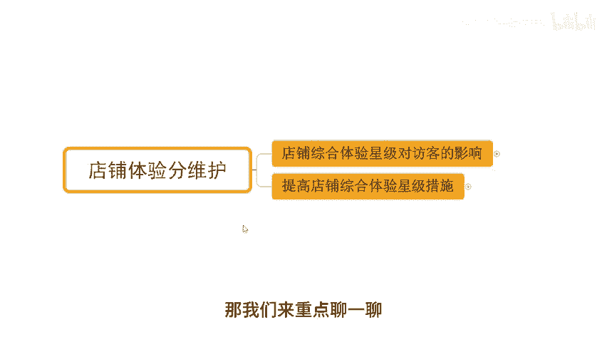

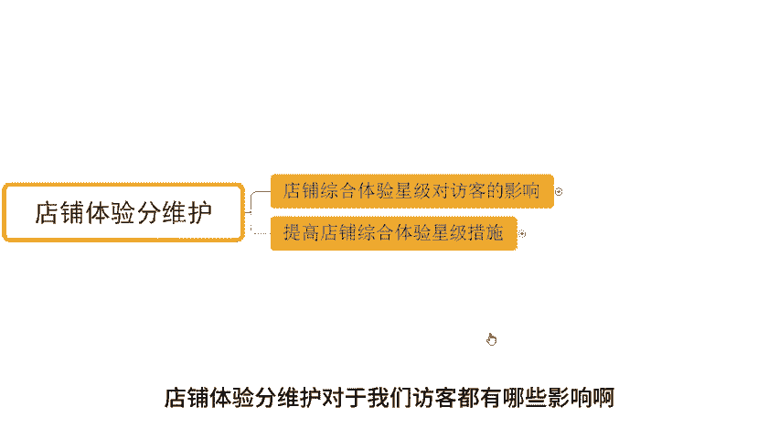

那首先第一个点啊，对于我们的信誉度啊，还有信任感呢是会有到直接的影响的那店铺的这个综合体验星级呢，对吧？如果说是啊更高啊，那么我们店铺的服务品质啊，包括说我们商品质量呢一定是更好的那这个时候呢。

对于我们消费者来说呢，一定会增加对于我们店铺的一个信任感，从而呢能够吸引到更多的客户呢，在我们店铺里面完成订单的提交。那么这个时候呢，我们商品数据提高之后，我们店铺的权重也会增长。我们访客数据。

我们的曝光也会得到更多啊，那么再呢就是我们的搜索排名和我们的曝光率的问题啊。那刚刚也提到过，对不对？在我们的平台呢会根据我们的这个体验星级啊来完成我们店铺的一些搜索结果的排名调整啊。

那更高级的一个店铺啊，那么这个。

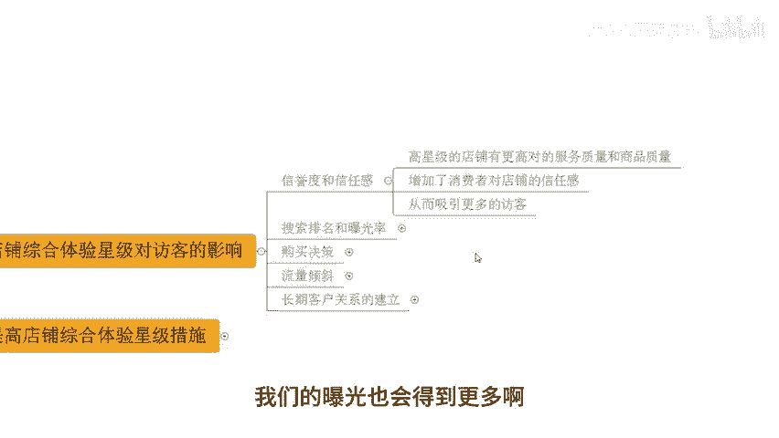

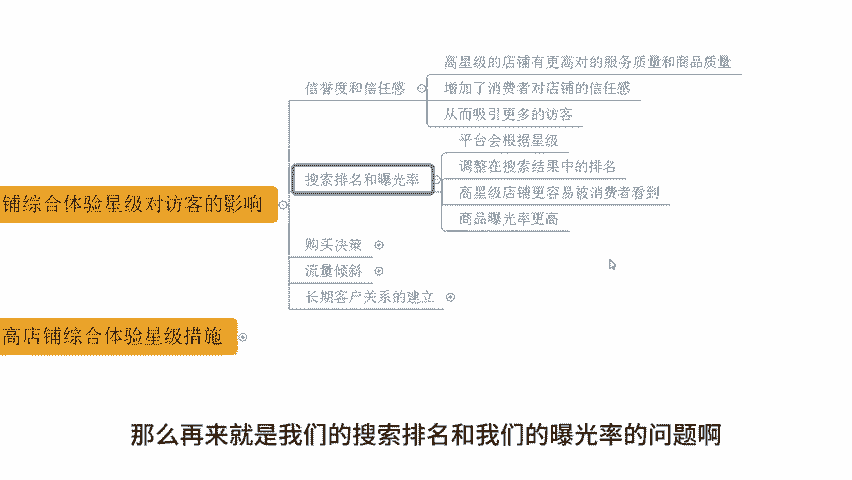

时候呢呃用户呢看到的概率呢其实是更高的。平台呢也会有到更多推荐给到一些更高星级的店铺，让他们拿到更多曝光。那再一个呢就是我们的购买决策。那么这个东西呢，就是我们刚刚提其实有提到过的一个事情，对不对？

那买家呢在购买商品的时候呢，他进行决策的时候呢，一般呢会参考到我们的呃综合体验星级。那么星级较高，这个时候呢，这个店铺呢就更容易获取到买家认可。从而呢呃转化也会增加。那么我们商品的曝光也会随着增加啊。

他是这样子一个过程哈。

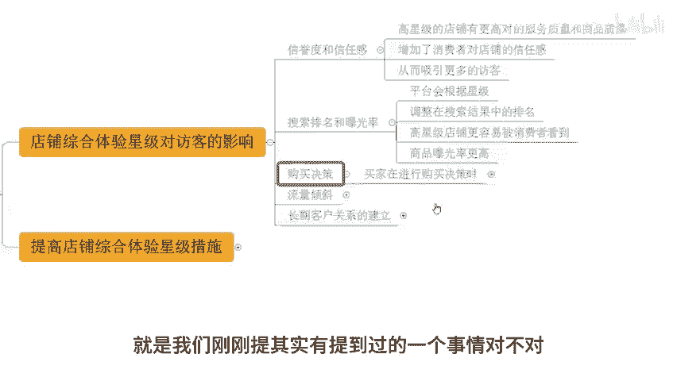

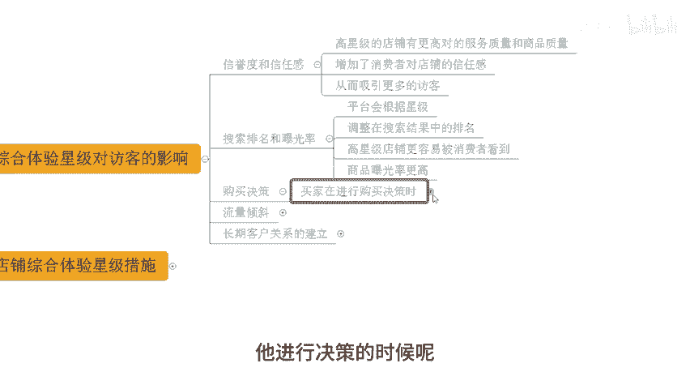

同时呢还回到一个流量倾斜问题啊，那平台进行店铺的推荐的时候呢。

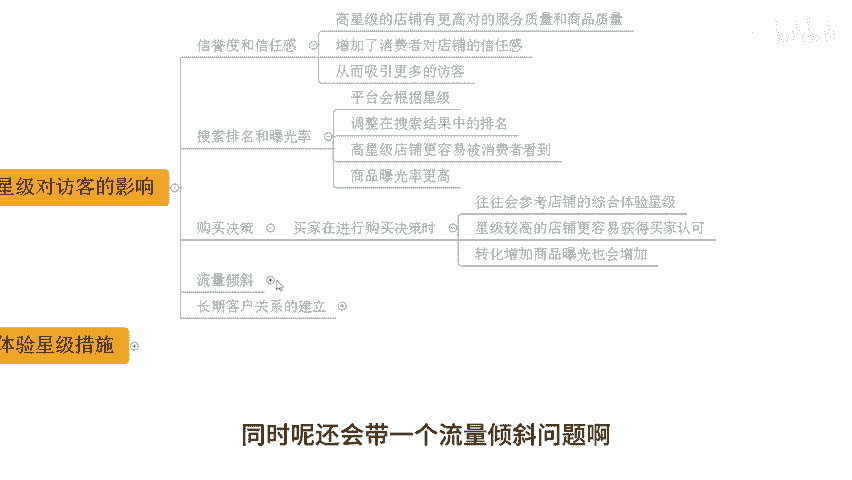

不仅仅说在搜索结果里面呢，会影响到我们的这个曝光，对吧？那么不仅仅说我们这个体验信息呢会影响搜索。那么在推荐权重板块啊，那平台呢也会给予更高信息店铺呢更多的曝光扶持，更多的流量扶持。

那么在我们的自然曝光里面，在我们的活动的这个机会商品展示里面啊，那么我们产品呢也都会得到更好的展示排名。从而呢来增加我们的访客啊，当我们的访客数据增加。

自而然后续呢我们可能也会到更多的点击更多的访这个转化啊等等啊。那么从而呢带动我们店铺权重的一个增长啊，是这样子的。

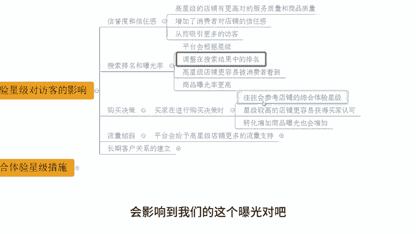

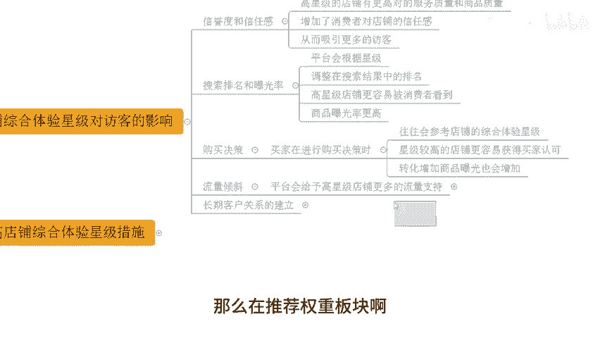

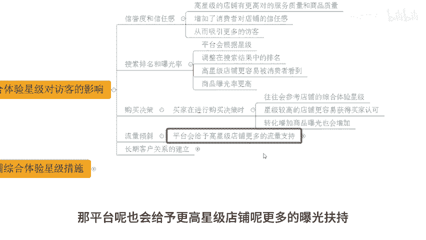

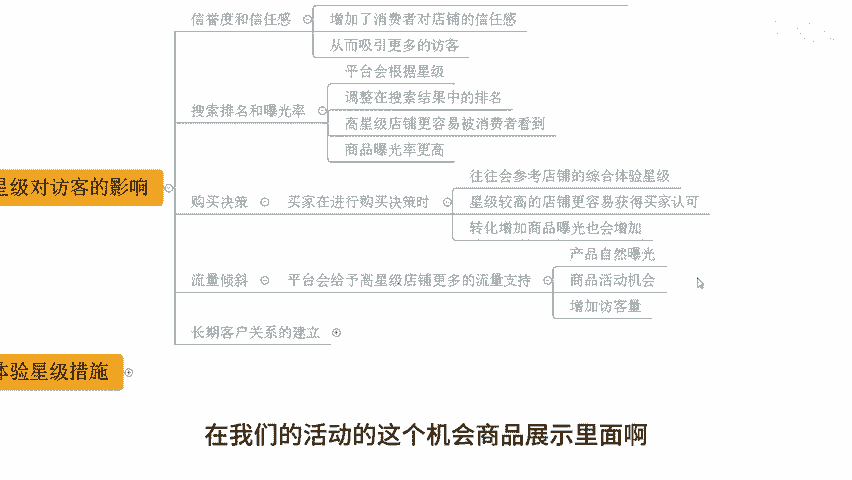

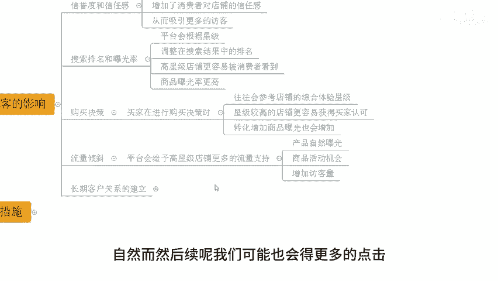

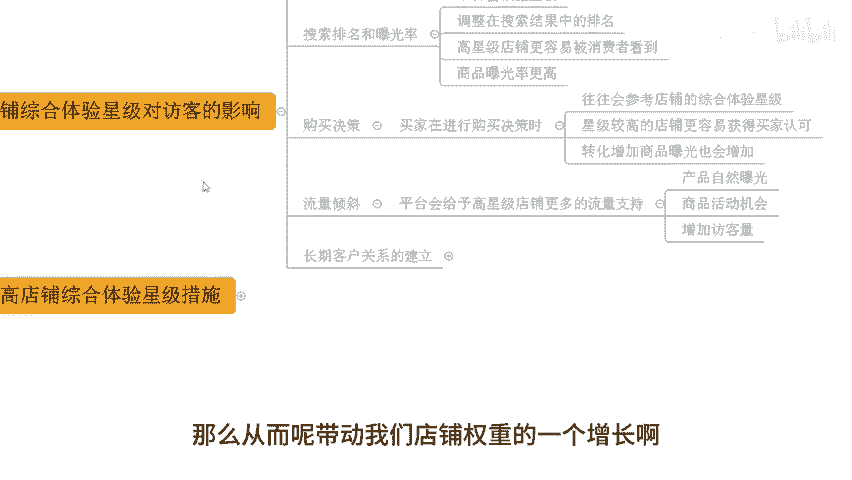

那么另外呢就是我们长期客户关系的一个建立问题啊。那平台呢他希望的是我们能够具有到更好的用户留存，和我们用户呢建立一个长期的客户关系。所以说星级更高店铺呢，它是有利于我们建立一个长期的客户关系的啊。

因为优质的服务呢，它首先呢是呃有到一个更好的产品，并且呢能够去让我们的用户呢对我们店铺对我们产品呢，包括对我们平台呢产生更好的一个忠诚度，是这样子的啊。

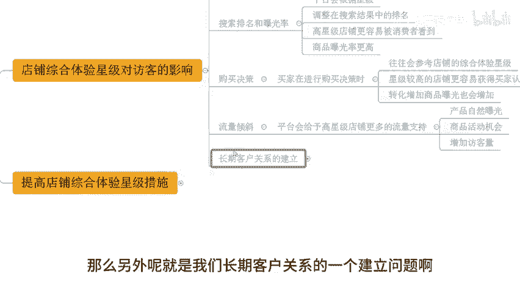

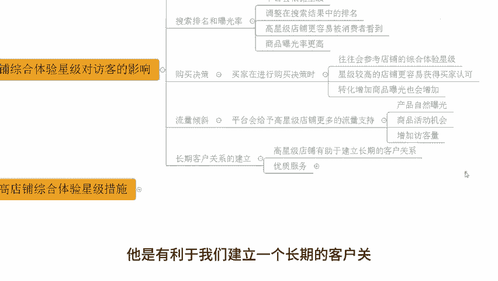

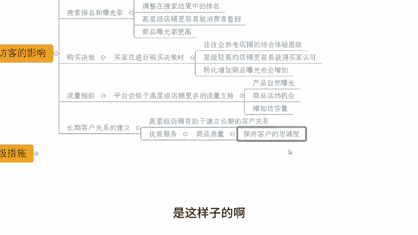

那听了这么多，对吧？我们应该怎么去提高我们店铺综合体验信息，这个才是关键啊。我们有哪些措施来帮我们提高呢？好，讲到这个地方呢，我就不得不说了一个事情啊，那么。

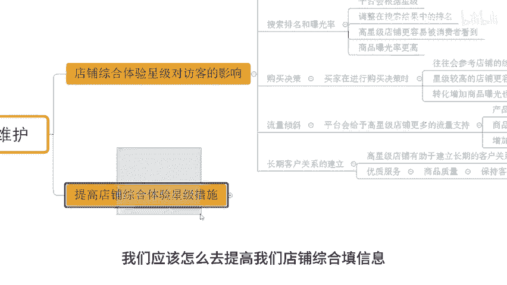

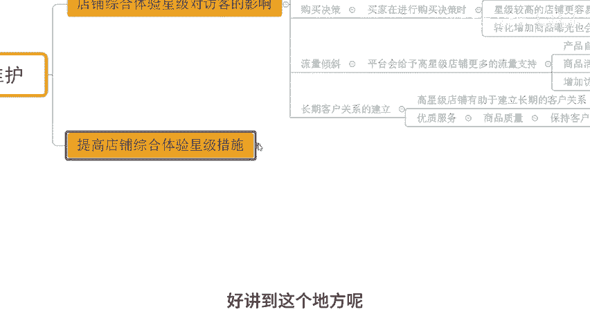

店铺的体验星级提高的措施呢，它其实只是治标啊。我们如果说要去真正意义上去分析我们的呃这个各种的数据来维护它的话，治本是关键。那我们要搞清楚，真正意义上导致我们星级评分比较低的原因是什么？

如果说真的是我的产品不行，OK建议呢更换产品。如果说是我的这个发货的这个服务不行，那么OK我们可以换一个供应商。如果说是我自己服务的一个态度问题啊，或者是服务的一个效率比较低啊，那我们要去进行优化。

这是非常非常关键的一个点。那如果你真的是产品不行，你一直去做这个东西，你做的越多，死的越快啊，所以呢这里呢也奉劝一些脑袋转不过弯的商家们啊。如果真的是你的供应商发货，供应不上。

如果真的是它的质量真的很差，OK赶紧换商品，你做的越久，对你店铺的伤害越大，好不好？OK那我们来看一看哪些维度可以来进行我们店铺综合体验星级的一个优化呢？首先。

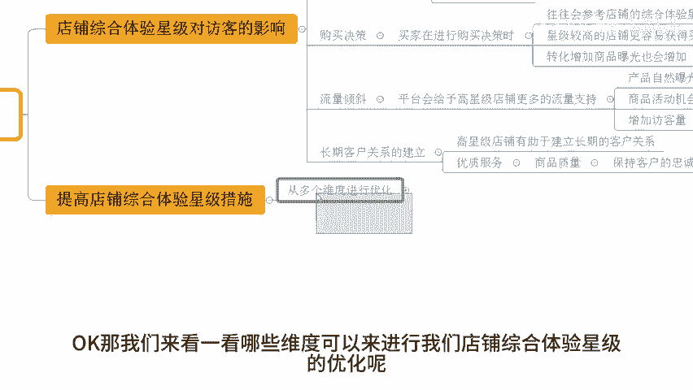

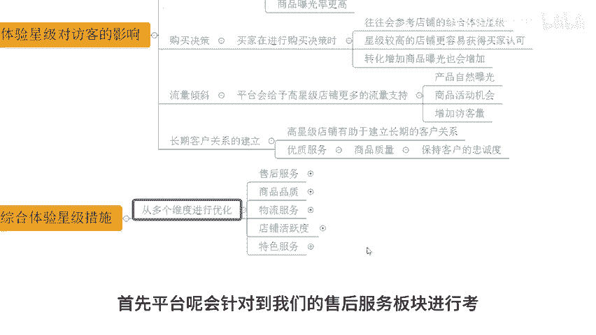

平台呢会针对到我们的售后服务板块进行考核。那么这里面呢有包含到我们售前的部分，其中呢就有到我们的人工回复率啊。那么在我们正常的进行消费的一个过程中呢。

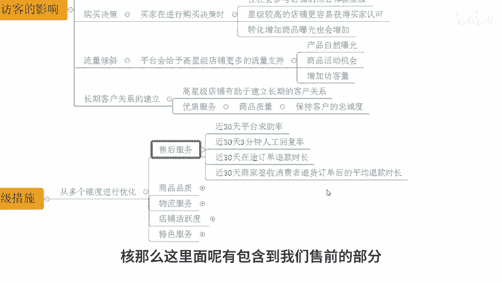

用户进行询单，对吧？我们都会要求商家呢有这一个很好的这个回复率啊。那么3公钟3分钟人工回复率呢，如果说你是低于50%，这个时候呢会受到平台的警告啊，如果说一直很低。

那么O可能后续呢你的推荐报告会受到影响的。所以说你的访客也会受到影响。所以我们也要保证三分钟人工回复率呢，在80%以上啊。那如果说真正意义上出现了你的回复率不达标，那么记得去优化调整你的服务状态。

包括说我们可以通过放大询单量来进行稀释回复率的一个方式来解决这个问题啊，那包括像我们其他这些问题啊，什么在途订单是退款时间比较长啊，啊，商家这个签收消费者退货订单的平均时间比较长啊，对吧？

那么这个东西都是我们可以自己去啊通过其他方式去把控的啊，那如果说我们的订单。

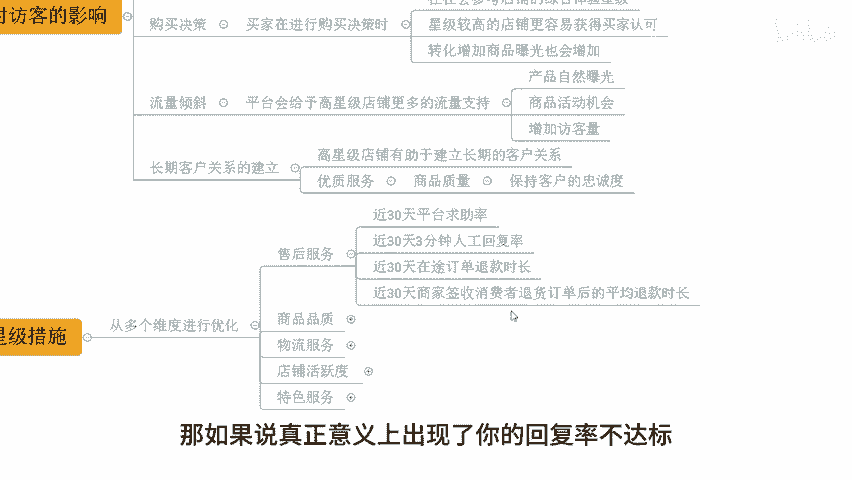

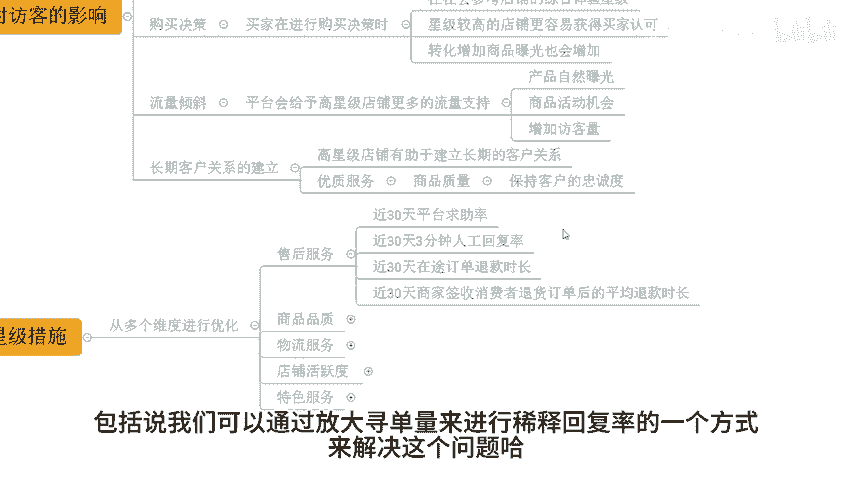

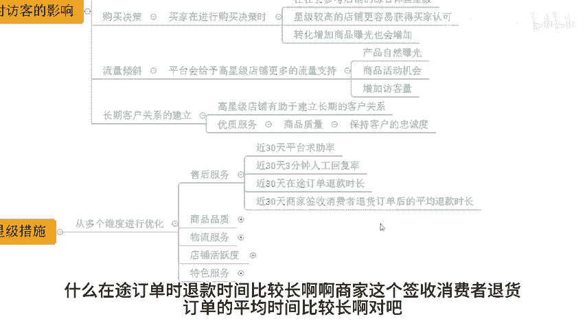

已经退回在路途中了，对不对？那你确定这个人是没什么毛病的，或者你通过呃经验来判断这个人可能是没什么问题的对吧？那么可以直接去完成退货的一个操作，对吧？来减少这个时间也都是可以的。

那再一个就是我们平台求助率啊。那么这个地方呢要尽可能的在用户产生问题进行沟通的时候呢，第一时间去进行沟通解决，哪怕不能解决，也要第一时间去给到用户一个很好的处理方案来完成后续的一个呃这个问题处理啊。

避免说产生一些纠纷，引起平台的接入。当这个用户呢求助到平台的时候呢，你就会产生一个求助率。哪怕这一个呃这个没有说是我们商家的责任，他求助率仍然存在的啊，是这样子的。

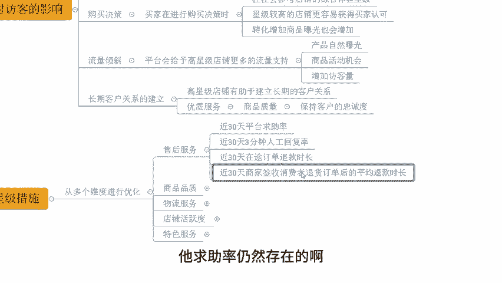

那么再呢就是我们商品品质啊，这个地方呢就提到过我们讲的呃商品的评分的问题，对吧？那么他呢考核的是我们近90天用户的评价分啊，那这个地方呢，如果说我们呃店铺啊确实存在说一些商品质量问题啊。

或者是其他一些服务方面的一些瑕疵啊，那么要尽可能的尽早去把它优化解决掉，避免说这个数据累积。那当他累积到一定数量之后呢，我们店铺评分下降之后，我们要想把它给维护的很好，它的周期会很长啊。

所以这点呢非常非常重要。那么还有呢就是我们的30天的一个积极评论率啊，所以我们要去做好我们的评价引导啊。

要告诉消费者呢能够积极客观的去对我们商品或者对我们服务完成评价啊来保证我们30天的一个评论率呢相对比较高一点。那么这样呢我们整个的一个商品品质也会比较好一点啊。然后再就是我们30天的一个严重劣质率啊。

这个东西呢就是我们自己在做。店铺的时候呢，他的一个呃退货选项啊，我们要去注意到一个事情就是什么呢？用户可以选择7天无理由退货，用户也可以选择自己不想要了，或者什么其他原因啊，都是可以的。

但是一定不要选说这个呃产品有问题，或者是呃产品质量不好之类的东西啊，不要去有这种东西。那如果有用户呢，他的一个退货申请里面有到类似的一些呃对我们商品的这个品质，有呃不良评价的一个退货要求的话。

那么记得引导他进行调整修改啊，这个非常关键。

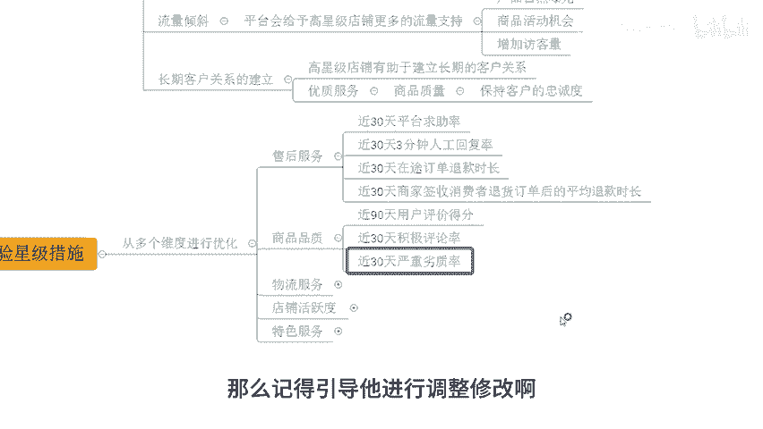

那再一个呢就是我们的物流服务问题啊，这个也是我们讲的呃日常的一些维护的过程啊，包括像我们的近30天的一个签收的一个时效，对吧？包括我们的呃综合处罚率啊。那么如果说你的发货时间比较长。

你的发发货经常容易说出现延迟发货呀，缺货呀，或者是这个物流更新异常啊，那么这些东西的话，OK那么你的整体的呃物流方方面的一个反馈呢也比较差，也会导致我们的信息评分比较低啊，包括我们签收时间。

那么这个东西呢，我们要做好用户的一个提醒。哎，那么通过短信的形式啊，或者通过啥形式呢，能够跟我们消费者达成一个呃这个呃签收的一个啊这样的一个一个一个动作啊，一个呃这个邀请啊。

来帮助我们店铺呢缩短这个时间哈。

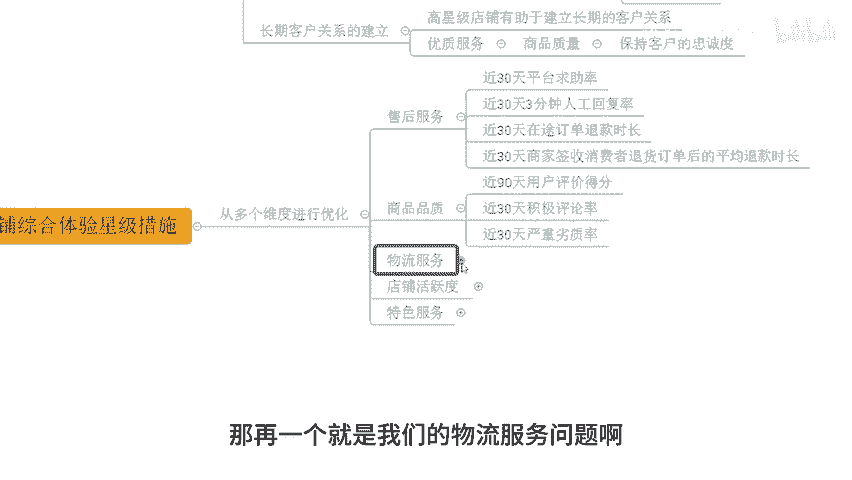

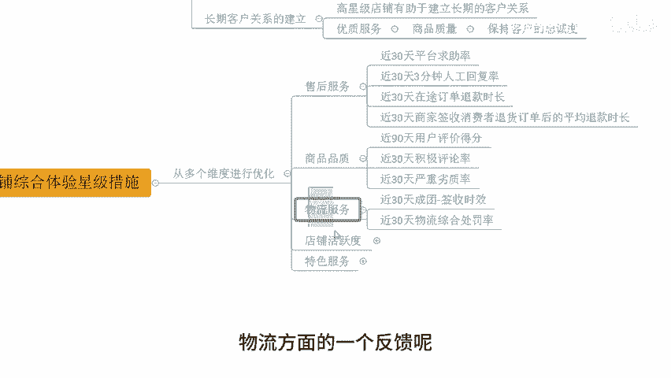

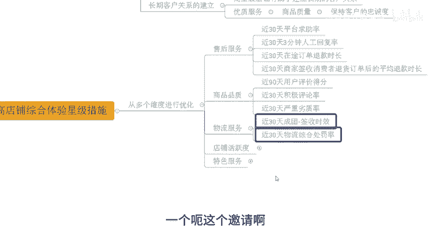

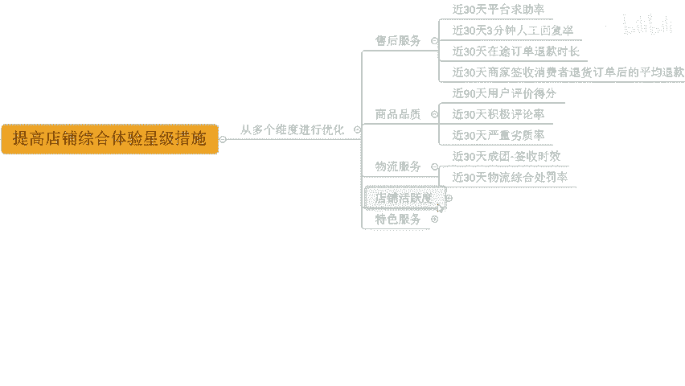

再呢就是我们的店铺活跃度啊。那么这个店铺活跃度呢是考三0天的那其中呢重点考就是我们的上新率，还有我们店铺数据啊，我们要我们的商品呢能够有到一个很好上新率，让我们商品呢也能够有很好的动销率啊。

包括说我们店铺的其他商品呢能够有到一个很好的数据反馈。那么这个呢就是一个正常的运营店铺说必须具备的啊。那么你如正常运营的话，这个板块是不用说过渡的或者刻意的去做什么维护的。一般问题不大啊。

那么再呢就是我们的特色服务这个板块。那么这个呢就是我们像运费险呢啊之类的，还有什么这个呃假一赔十啊之类的服务的一个开通状态啊。那么这些东西基本上问题不大啊，都是可以正常开通的。

OK那么把这些东西做好自然而然我们店铺的体验星级呢会比较高啊，但是呢还是那句话前提条件是你的商品本身没有问题。如果说你成品有问题的话，第一时间记得去换商品或者是换供应商。

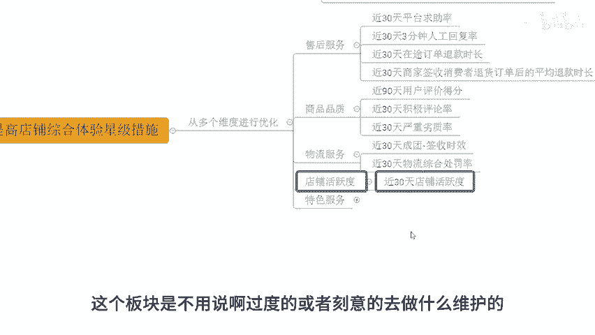

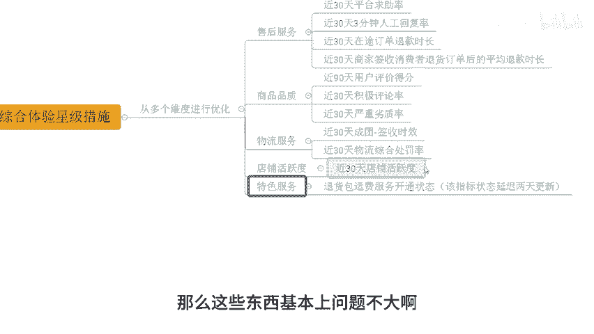

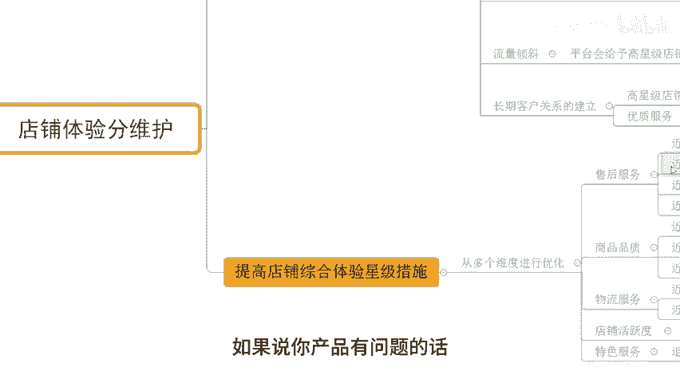

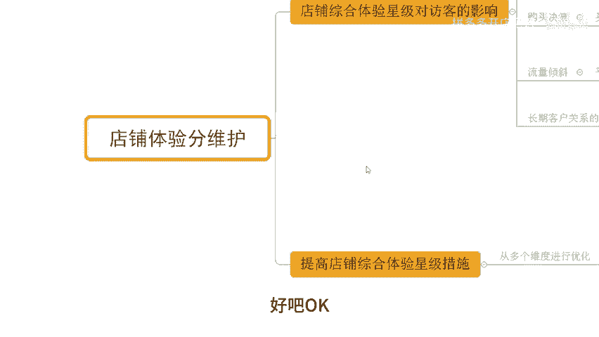

好吧，OK以上就是我们店铺体验信息维护对我们访客的影响啊。那么希望大家有帮助啊。如果说你在店铺运营过程中有什么遇到啊自己解决不了的问题啊，或者需要资料的呀，可以找我啊。那同样的还是那句话，有时间的话。

我可以带着你一起去实操坐店啊，就像这些小伙伴一样，我们一起能够有到一个更好的方法，让我们店铺呢达到更高水平。好吧。OK今天的视频呢就到这里，我们下次再见。各位拜拜。

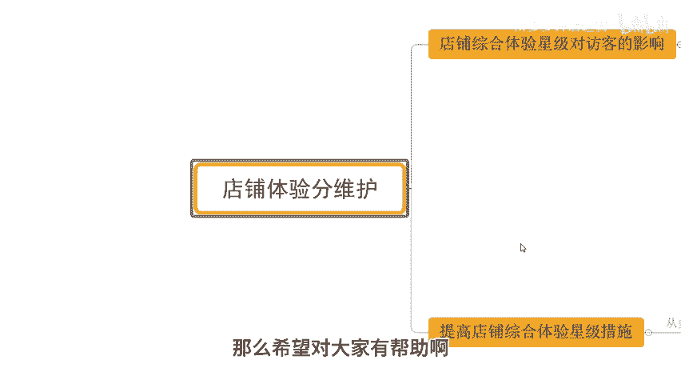

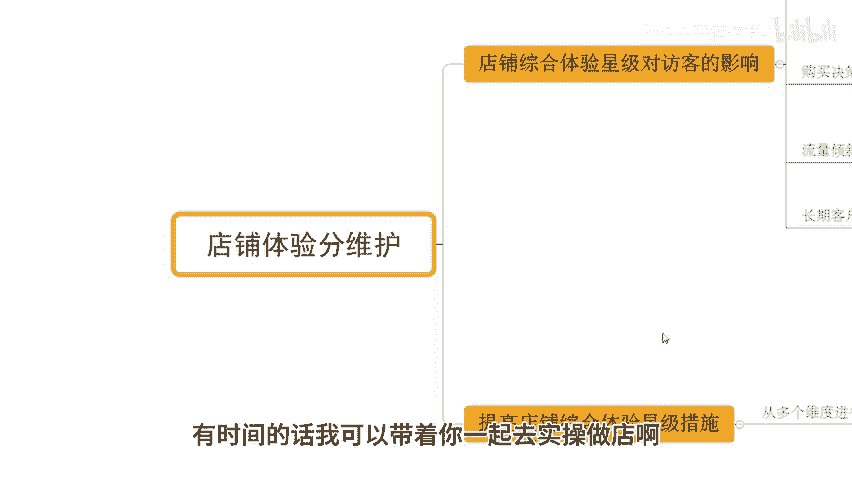

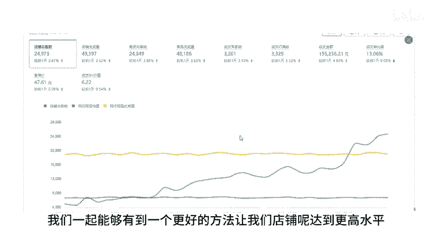

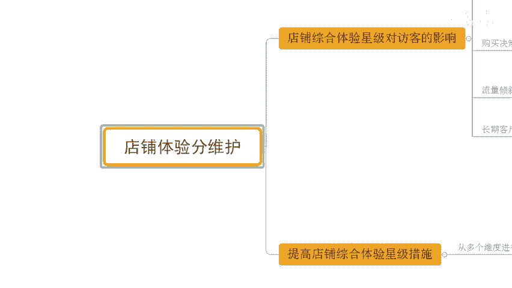