# 拼多多开店运营-新手电商运营实战指南，B站最全拼多多零基础入门教程！拼多多运营秘籍，小白也能成电商大亨！轻松上手拼多多，拼多多新手开店赚钱攻略 - P39：039 标题组合搜索优化 - 拼多多开店运营- - BV1xms8eSEVs

hello，大家好，我是谢楼。今天给大家分享的内容呢是我们拼多多店铺运营没有访客，怎么办中的标题组合搜索优化内容啊。在飞享之前呢，然后规局先给大他家看一下近期跟收的小伙伴他们的店铺数据好吧。

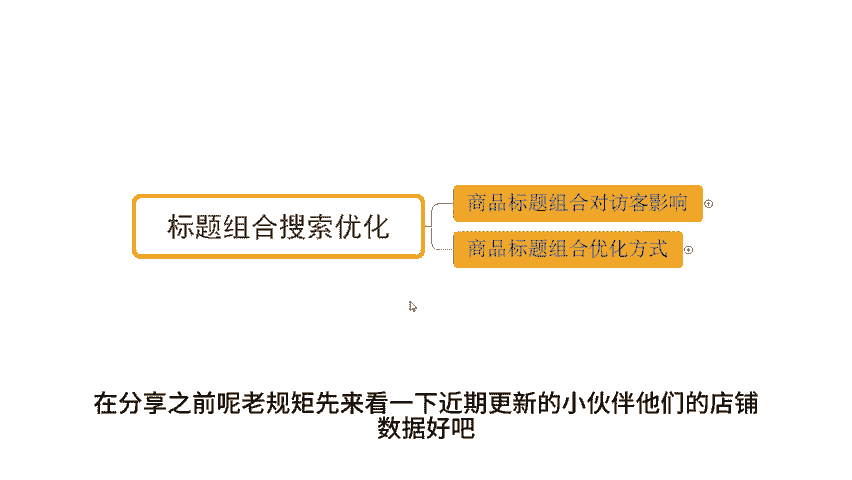

可以看到，像这个店铺呢，原本是一个您访客的新店啊，没有任何数据的啊。那么跟着实操之后呢，我们首先通过市场分析和竞争分析完成了我们的报款定位啊，通过我们报款选品啊，完成之后呢。

上家商品之后不断的在操作优化。我们上面数据可以看到后期呢整体访客也在不断的增长啊。到后面的话一天访客呢做到了12000啊，一天的这个订单呢做到了1900多单，转化率呢做到15。68啊。

还有像这个店铺可以看到，原本访客呢只有几百个。那么通过产品的调整，通过我们SQ的优化呢，也在不断的提升我们上面群众。可以看到后期呢访客从最早的几百个呢做到了一天1万一一天的订单呢做到了1300多单。

转化率呢做到了11。88啊，还像这个店铺原本访客呢在5000左右啊，那么通过不断的调整优化之后呢，访客也在不断的增长啊。那么到后期呢一天的访客呢做到了20四一天的这个订单呢是3200多单。

转化率呢做到13。06啊，也是非常不错的。那么可以看到，不管是这种零访客的纯新店也好，还是说一些有基础有数据店也好。那么通过实操，那么也都是可以得到一个好提升的。

那这些店铺呢也都是通过战略的方式来操作的。如果说你想要知道如何通过战略来操作拼多多店铺，如何通过战略来打造爆款。OK建议也可以仔细观看我分享的视频，好吧。

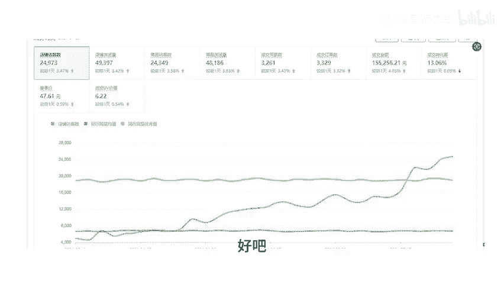

那店铺操作呢对于我们很多的新质小白来说呢，会有到很多的困难，这个很正常啊。如果说你有店铺操作方面的问题啊，需要资料的呀，可以找我。有时间的话，我也可以带着你一起去实操坐店啊，就像这些小伙伴一样的。

我们一起能够有到更好的方法，包括说有到更加完整的操作思路，来让我们店铺呢达到更高水平。好吧。OK那到底这个标题组合搜索优化呢，对我们的反馈有什么影响？我们来看一下啊。首先。

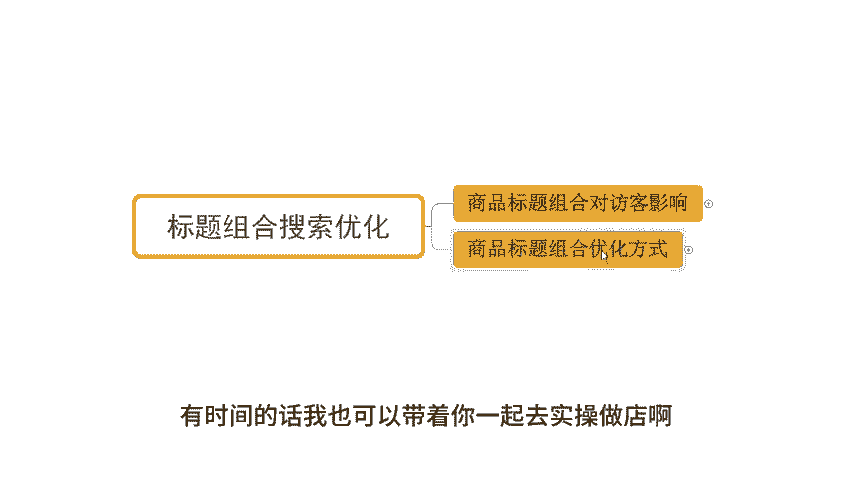

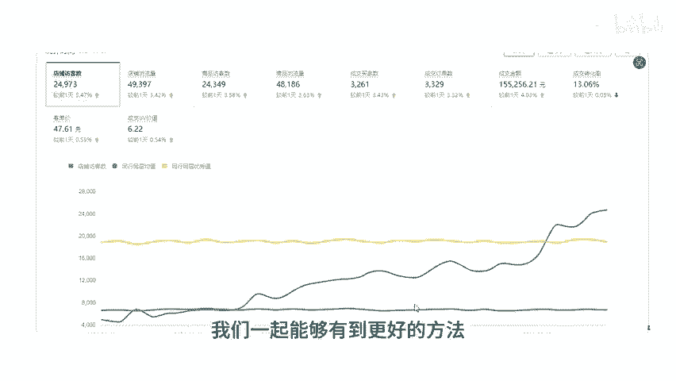

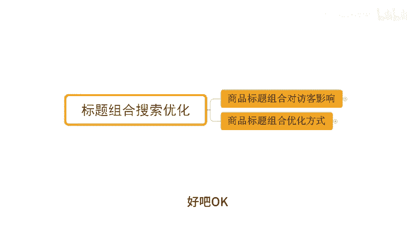

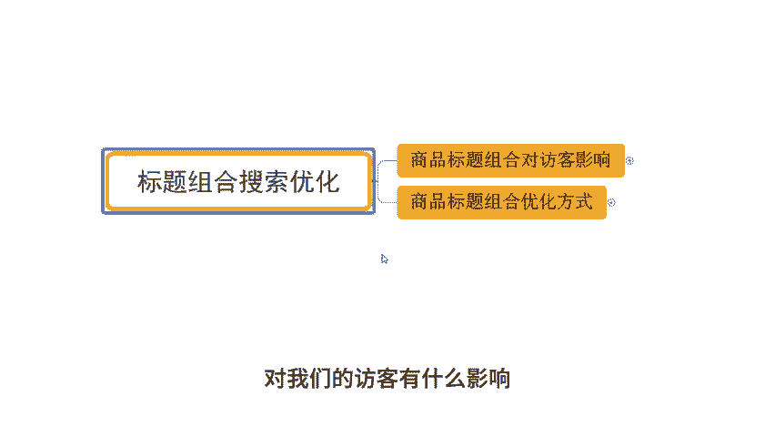

影响的因素呢是有多个维度的啊，这个东西呢我们需要具体去分析啊。第一个点呢就是关于我们啊关键词和商品的匹配度的问题。那如果说今天我们找到这个产品对吧？啊，我们做了这个标题。

那么它的关键词和我们的商品不匹配。

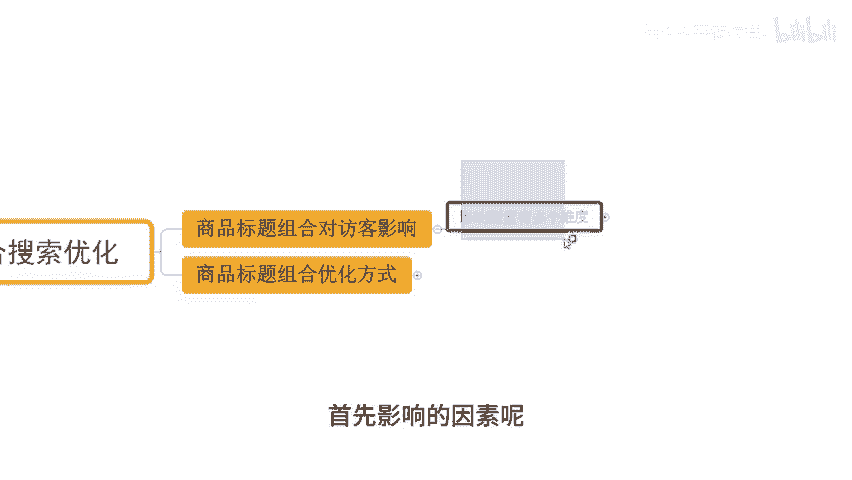

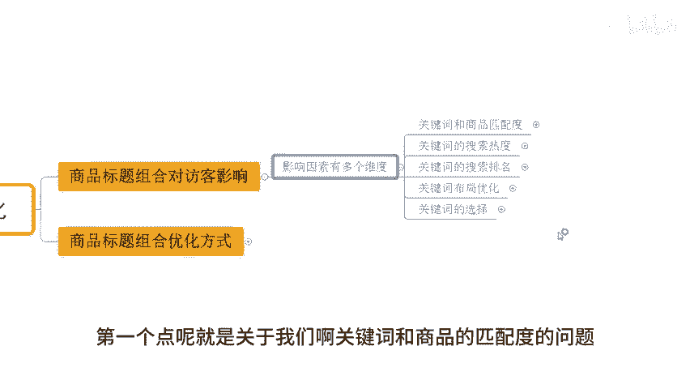

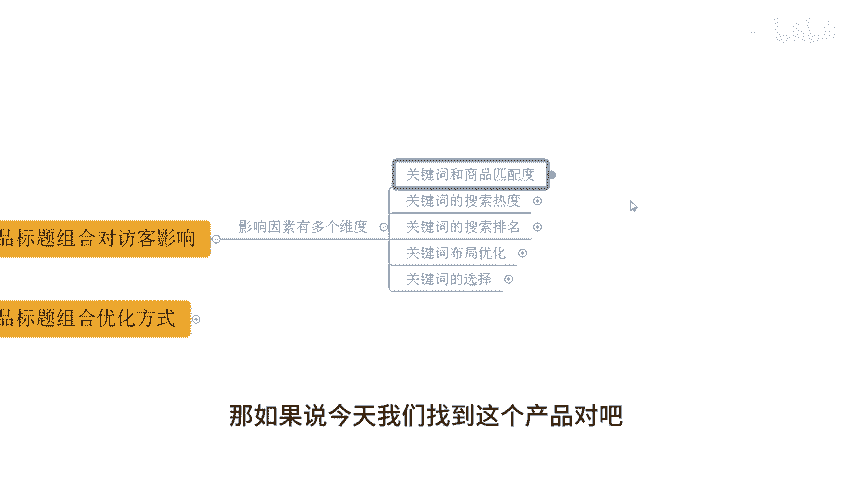

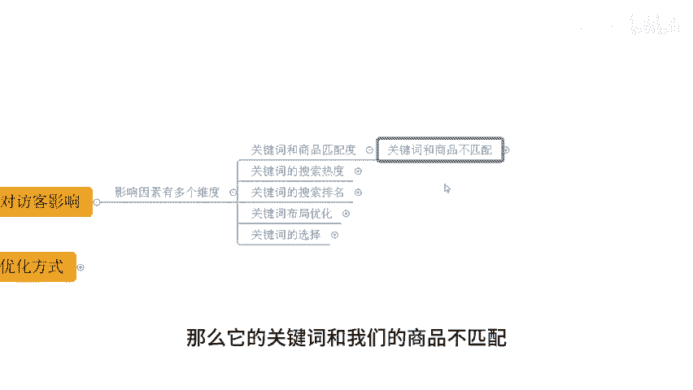

这个时候呢，就会导致一个问题，就是我们产品的曝光可能会比较少啊。那么为什么比较少呢？因为它本身就不匹配啊，本身就不匹配。所以这个时候呢，产品的权重对于当前这个不匹的关键词呢，也会比较弱啊。

所从而影响了我们产品的曝光。包括说我们产品即使说能够去获取到曝光的情况之下呢，因为我们的设词和我们的商品不匹配。那么用户呢他的需求和这个产品不一致的情况之下呢，用户点击也会很少。当点击反馈很差的时候。

平台也会判定当前这个关键词和我们商品啊，对于我们商品来讲的话，是一个呃可能数据反馈比较差的关键词的话，后续推荐也会减少。从而影响了我们店铺访客的过取啊。那么再来就是我们的关键词的所入热度啊。

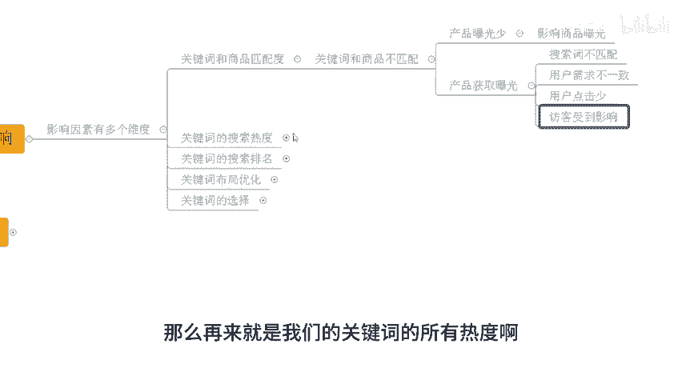

每个关键词呢都有了自己的热度啊，都有了自己的一个搜索需求。那如果今天我们标题里面的关键词搜索热度比较低啊，那么这个时候呢就代表说搜的人会比较少。那如果说是这种情况呢。

我们本身商品的呃整体的搜索数据呢就会很低。从而让我们整个商品的访客呢也会受到影响。当然呢。那么如果说我们产品本身是没有到一个很好的排名，那肯定是一样的，对不对？就这里一样的啊。那么我们上面排名这个问题。

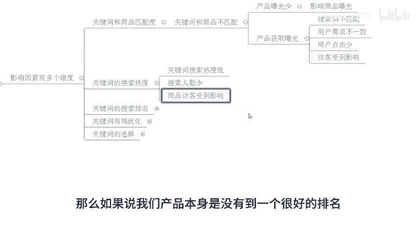

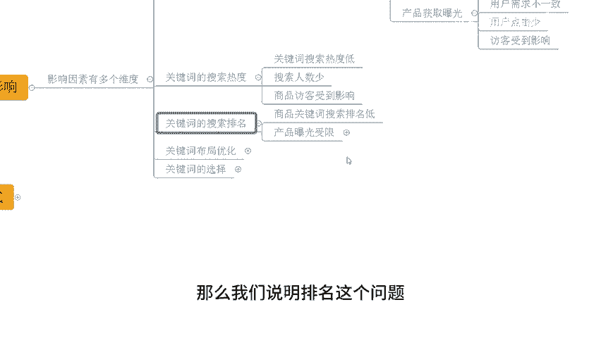

当我们产品的关键词排名很低的时候，那么这个时候哪怕我们这个产品的关键词热度很高，那我仍然曝光会受到限制啊，这是一个非常重要的点啊。所以说商品的访客呢它也会受到影响啊。

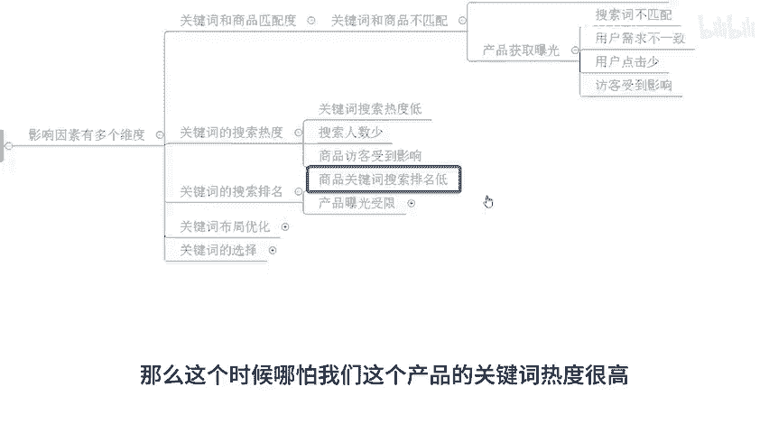

那么对于我们这个关键词呢，它哪怕是有到一个呃很少的竞争对手啊，那么我们产品没有曝光的情况之下呢，你也不可能有到很多访客，是这样子的一个情况啊。那再来就是我们关键词的一个布局优化啊。

那么关键词的组合匹配方式呢，对于平台来讲呢，肯定是会有到一个。

这个方式方法的啊，那么它呢也会影响到我们的一个产品的访客。那关键词匹配方式呢会分为精准匹配跟广泛匹配两种模式啊。那如果说我们的产品关键词组合的时候呢，是一个精准匹配的方式的话，那么这个时候呢。

用户在进行设入这个对应关键尺损，它的匹配度会更高。从而呢在某些情况之下呢，产品的排名会优先展示啊，从而呢能够得到更多曝光。但是如果说我们没有做到位这个点的话。

那么我们产品呢可能在曝光获取方面呢也会有所下降哈。

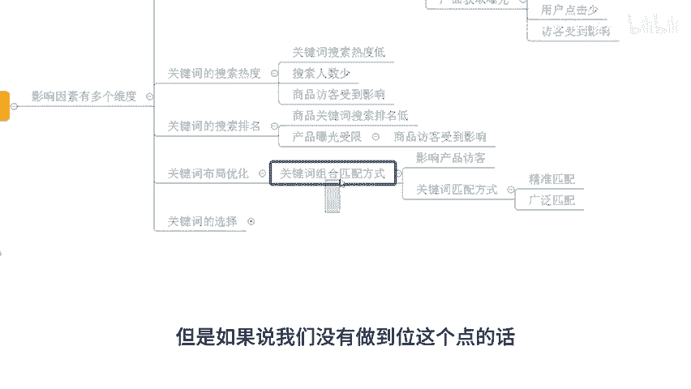

那另外一点是我们关键词选择啊，在关键词的选择方面呢，我们可以去利用到一些营销词和卖点词啊。那么这样呢可以通过这些营销词和卖点词呢来增加我们产品的吸引力，从而来获取到更多的点击或者更多的这个访客啊。

那如果说我们没有做这些东西的话，可能我们整体点击率呢也会偏弱啊，包括我们整体的这一个用户获取呢，也会能力比较弱一点。那么导致我们的一个访客损失。再就是我们可以去使用的更多属性词和类目词。

那么这些词呢它能够去更好的啊描述我们产品啊，从我们的包装规格材质功能等啊，那么等等方面来进行下手呢，有利于去提升我们买家的精准度啊，从而来来吸引到啊对应商品的一些需求的用户啊，完成我们的产品的帮装获取。

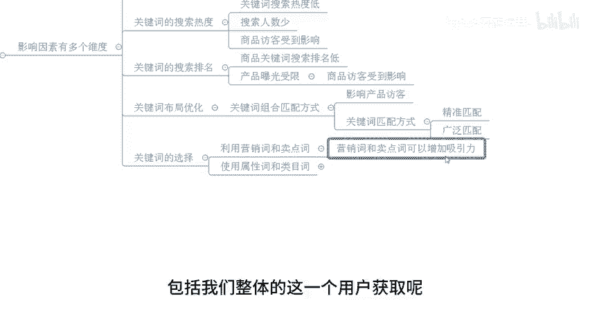

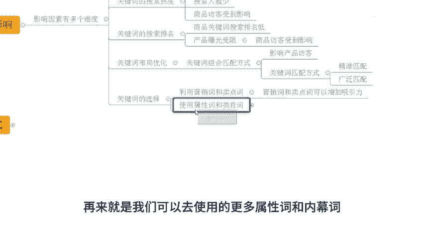

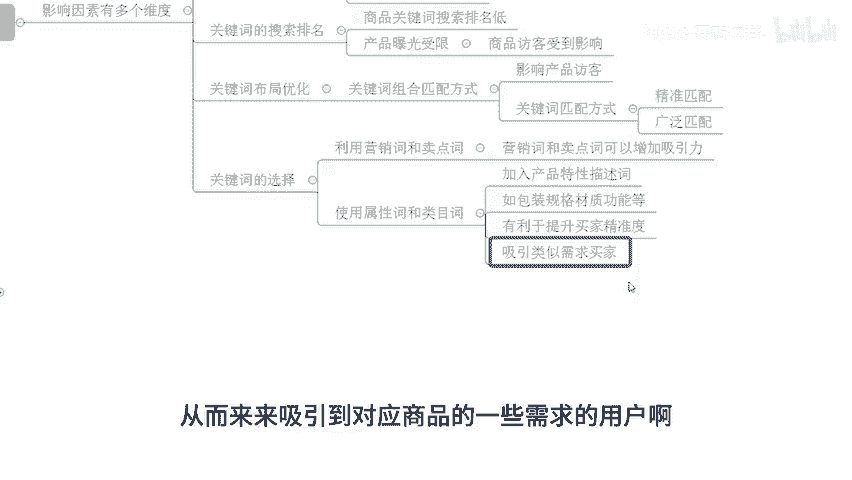

那说了这么多，我们应该如何去完成我们标题的组合优化呢？那它优化方式是什么样子的，来看一下啊。

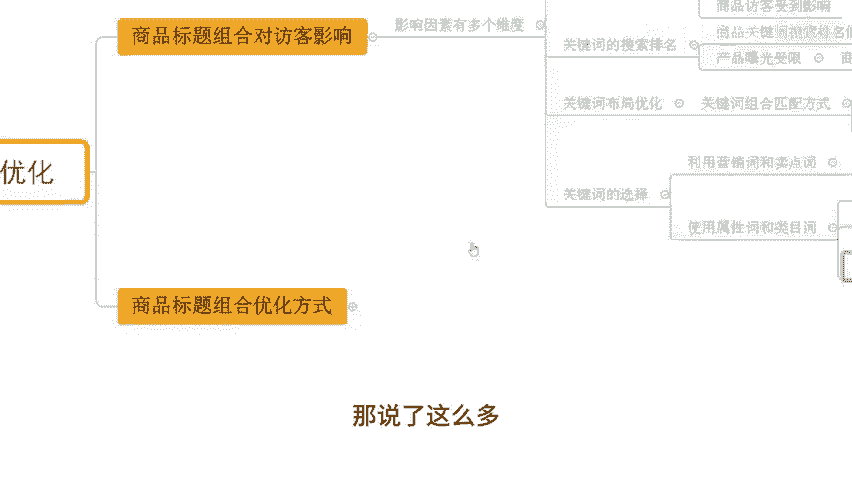

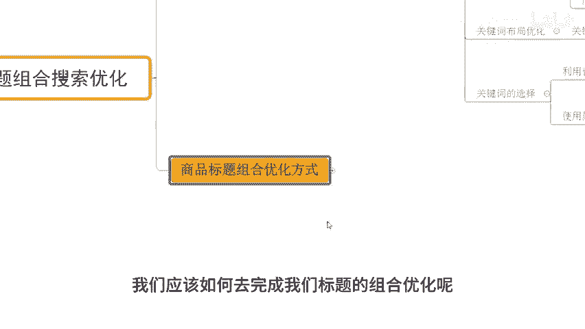

操作方式呢并不复杂。

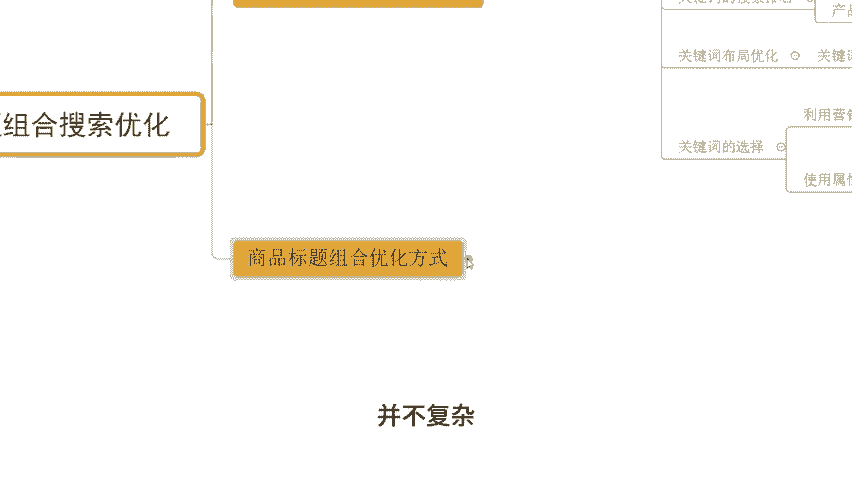

首先第一步啊第一步。那当我们要去做一个产品标题的时候呢，那么我们首先要去确认好我们的主持，我们要做好主持的定位啊，主持呢一般就是我们产品的类幕池啊，包括名称啊，这些方式来的啊。

比如说我们去做一个这个桌子啊，那么桌子是我们的类幕词，对不对？但是这个桌子具体是干什么，它的用途是什么，很关键，对吧？当然它的名称呢也可以是桌子，对吧？当然呢它具体的一个功能啊。

也可能会成为它的一个名称，比如说书桌啊，餐桌啊啊等等啊，对吧？啊，那么我们有了这样的一个定位之后呢，我们要搞清楚我们后续的一个发力方向和运营方向那比如说我们这个产品呢它就是一个啊这个书桌。

那我们可能就以书桌来作为我们产品主持。那通过这个产品主持训定好之后呢，来完成后续的一个关键词的获取啊，这样呢我们后期呢更多关键词呢会可能会更加精准。

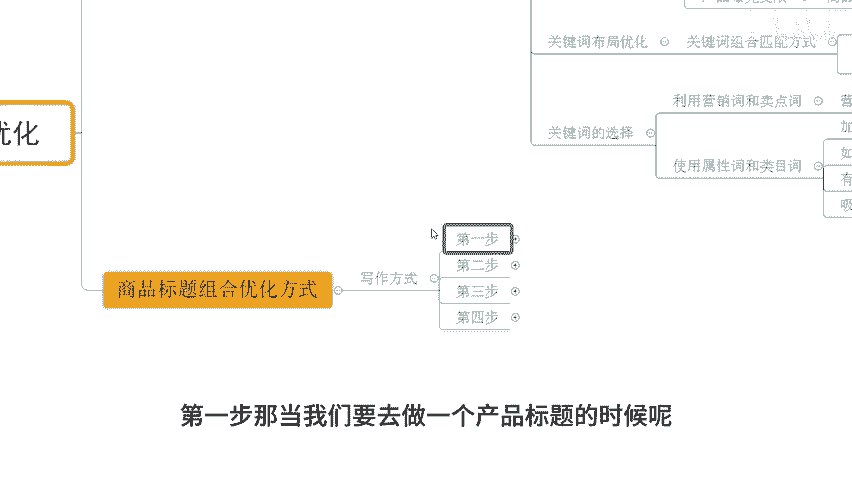

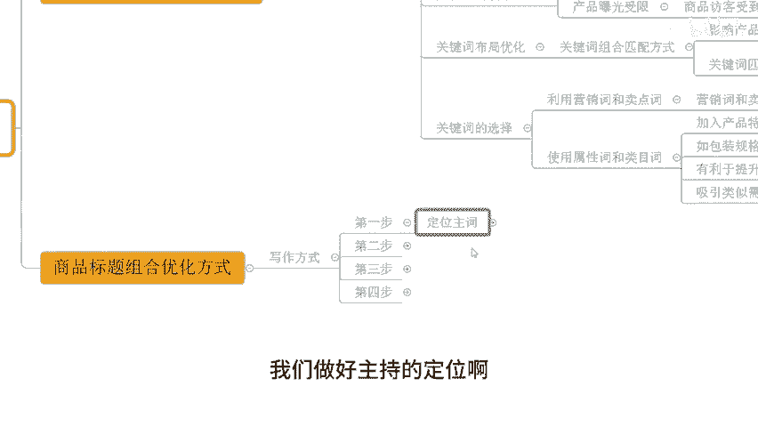

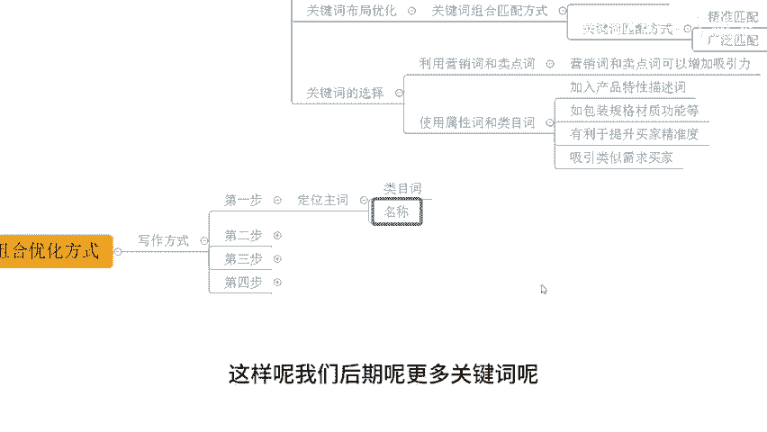

点啊，比如说。第二步，我们要确认我们的关键词的时候呢，对不对？我通过我们的下拉框来找到一些符合产品的关键词啊，那如果说我是书桌的话，我可可以直接搜索书桌，那么跟我们产品匹配的商品呢。

这个关键词呢会更多更准确一点，对吧？但是如果说我是用桌子这个关键词去搜索的话，桌子这一个词搜索出来的结果呢，可能我们产品呢精准度没有那么高。即使有个别跟我们产品匹配的一个关键词的话。

它可能也会存在说一些比较大的差异啊，那么也会导致我们后续可能点击方面呢，包括说我们后续转化面呢受到一些影响，是这样子的数据反馈呢也不会太好啊。所以在这一步的时候呢，我们要确认清楚。

但是这里呢有一个点啊非常非常重要。就是我们商品的主持呢，它是可以有很多个的啊，那么通过不同的这个方式来进行这一个定位的话，它也是不一样的。我举个例子啊。

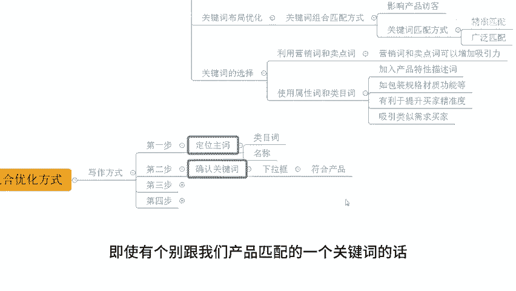

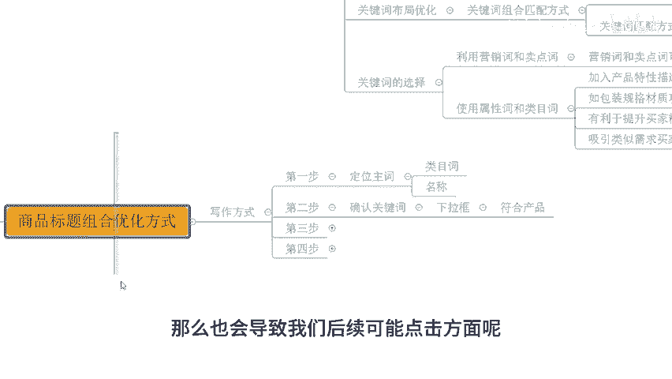

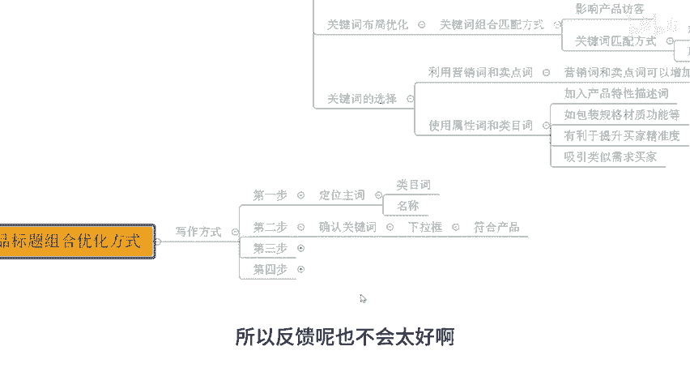

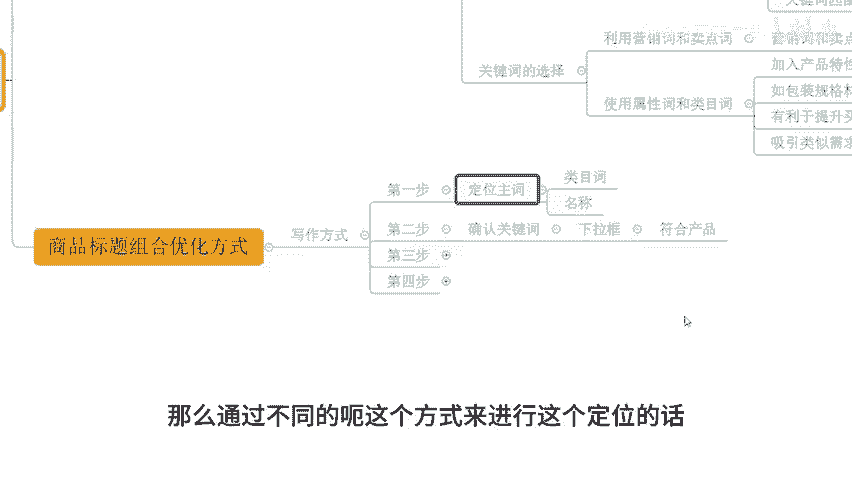

那么呃我们就说这个呃勺子对吧？我们叫勺子啊，那么勺子这个东西呢，它是。有到不同的用途的啊，它有汤勺，对吧？啊，还有到这种啊，就是普通的啊，我们吃饭用的或者是呃吃这个其他的一些这个食物的一个勺子，对吧？

他有的他有到不同材质，对不对？有不锈钢的啊，也有陶瓷的对吧？那我们要定位清楚，定位精准的话，我们也会去把这些方面呢来进行细分。那如果说我们有去有到一个很好的明确的一个定位的话啊，对不对？

我们去做的时候呢，可能也会受到一些影响啊，包括说我们在做的时候呢，我们可以用到多个词去做都可以的，对吧？我可以是勺子，我也可以是汤勺，我也可以是陶瓷勺子，对不对？都是可以的啊。那用到这些词去做的时候呢。

我们要啊一个标题里面存在多个组持的时候呢，记得。不要超过两个。超过两个的话，可能这个后续的一些修饰词啊，一些属性词啊会特别的分散，没有办法去到一个很好的纵深跟聚焦。

导致我们后续的一些关键词呢会呃没有办法得到一个很好的曝光啊，所以这点非常非常重要啊。那再一个呢就是第三步啊，第三步呢就是提验冷门词啊，体验冷门词呢是为了帮助我们完成我们产品关键词权重的获取啊。

那么它呢其实就是对我们产品进行一个下定义的一个操作啊。那通过我们对我们产品的功能或者特性进行一个呃这个描述。

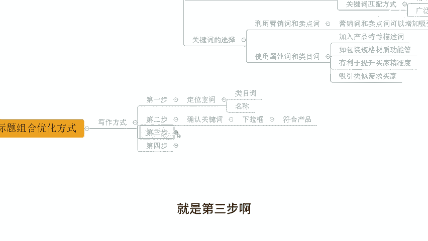

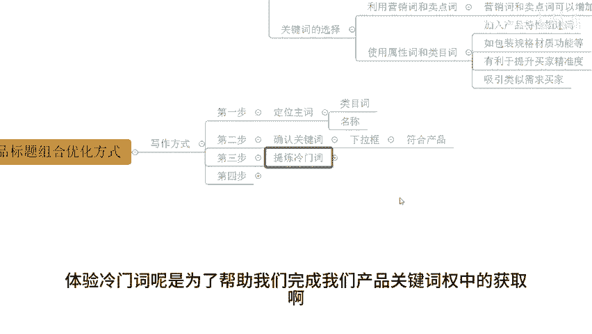

来定位啊，那后续呢这一个词呢会代表我们产品啊。比如说我举个例子，今天呢我们有很多人去用到苹果手机，对不对？那在搜索的时候呢，我们可能很多人他就不会去搜手机了。他可能直接搜苹果，对吧？当搜苹果的时候呢。

可能会出现出很多的这个手机啊，那么这个时候。苹果就是我们对这个手机它的一个定位，也是我们对它下的一个定义。当然那它是一个品牌词，对不对？所以这个地方呢提验冷门词的方式呢，可以是品牌词。

也可以是其他的一些对我们这个商品功能的一个定位啊来下一个定义也都是可以的。这里的话要注重点留意啊品牌词的一个操作难度呢会比我们对使用的方式或者功能的定义定义啊，要更难一点啊，因为它的受众群体会更少啊。

所以呢我们要去做好这方面的操作。当然这个地方呢这样去讲，可能因为时间关系没有办法讲的特别详细。当然理解可能会比较困难，但是没办法啊，大家可以去按照这个思路去做一做啊，那么后续呢我们操作的时候呢。

可以通过这个下定义的冷门词来组合热门关键词来操作，那么可以帮我们完成更好的商品抓取啊，并且呢提升我们部分关键词受热度啊，从而呢来带动我们产品的权重啊。所以这点大家注意一下。

然后最后呢就是我们关键词组合关键词组合的话，我们提到过。

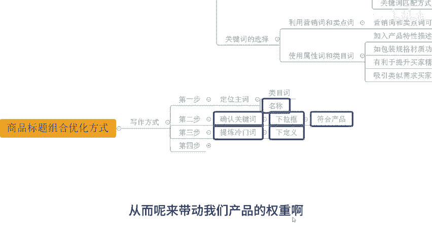

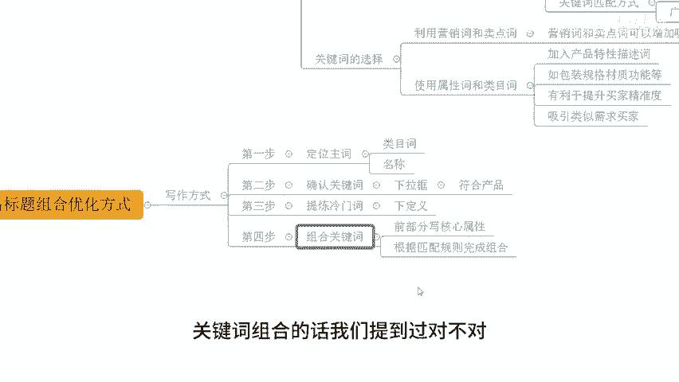

对不对？我们会有到精准匹配跟广网匹配。那么我们在做的时候呢，把这个匹配方式给把控好。同时呢在标题的前半部分呢，尽可能写上我们的一些核心词和属性词或或者是我们热搜的一些词汇啊。

那么这样呢对于我们用户搜入的时候呢，看到这些描述的时候，也能够去起到一个引导点击的作用。同时呢我们在做的时候呢呃把我们的这个匹配方式啊，完整的啊这个匹配规则融合到我们组合的一个过程中来啊。

来帮助我们能够拿到一个更好的推荐曝光就可以了。好吧，那这个东西做好之后呢，当我们产品没有什么太大毛病的时候呢，就可以得到一个更多推荐曝光。从而呢我们整体访客也会得到增长啊。

那么以上呢就是我们标题组合搜索优化。对于我们访客啊提升的一个一个玩法的一个分享啊。那么希望呢大要有帮助啊。那还是那句话，如果说对于店铺操作方面，你有什么问题啊，或者需要资料的呀。

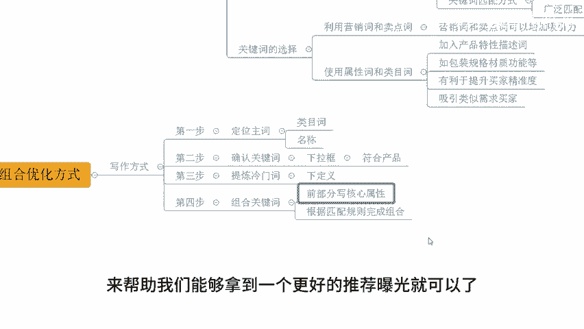

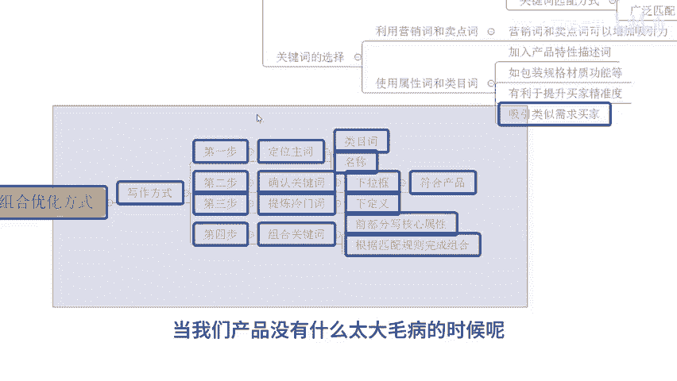

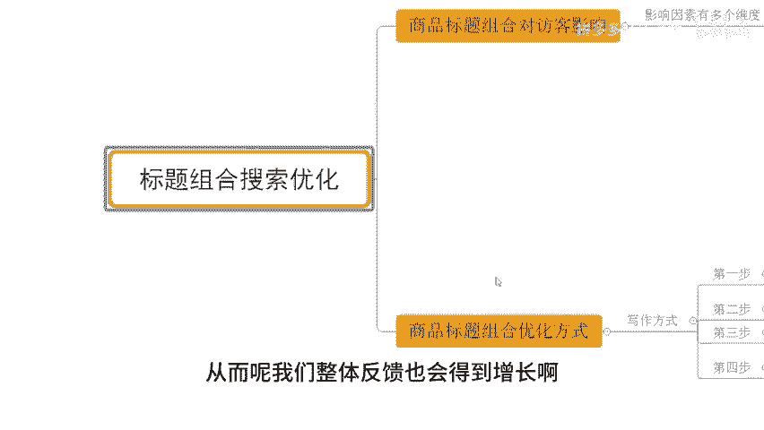

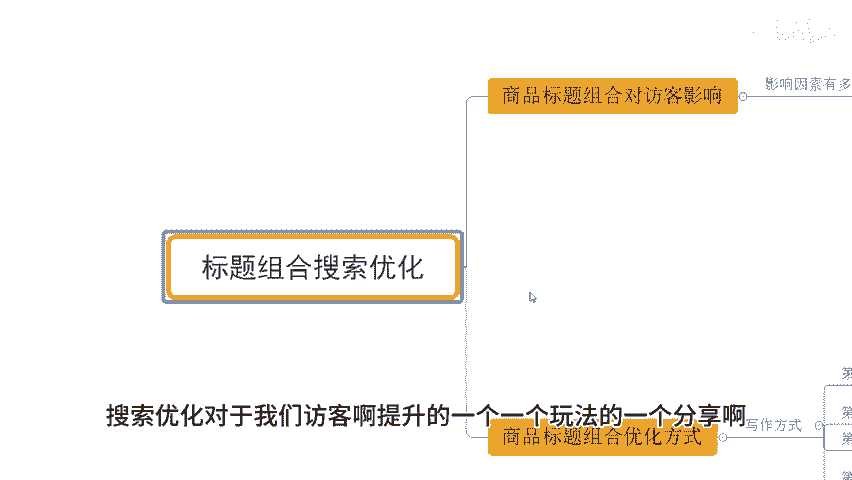

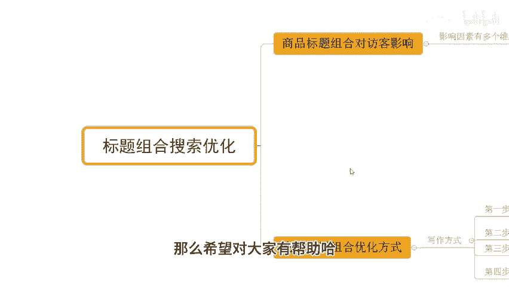

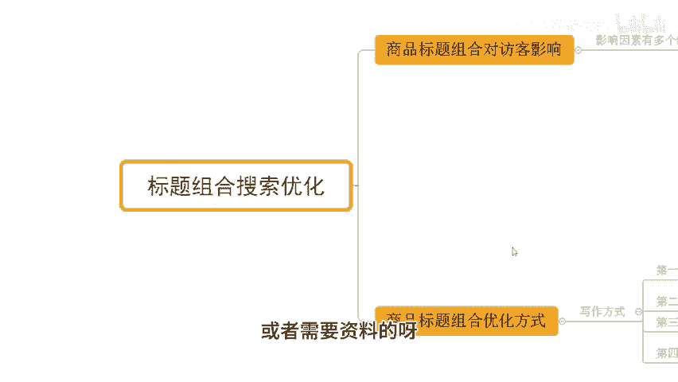

可以找我，有时间的话，我可以带着你一起去食操坐店啊。像像这些小伙伴一样呢，我们能够有到一个更好的方法，能够让我们店铺呢达到更高水平。那么闲话不多说，今天的分享呢就到这里，我们下次见，各位，拜拜。

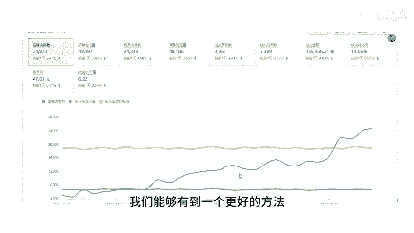

