# 拼多多开店运营-新手电商运营实战指南，B站最全拼多多零基础入门教程！拼多多运营秘籍，小白也能成电商大亨！轻松上手拼多多，拼多多新手开店赚钱攻略 - P41：041 原创图片推荐加权 - 拼多多开店运营- - BV1xms8eSEVs

。Yeah。hello，大家好，我是西楼。那么今天给大家分享的内容呢是我们拼多多店铺运营没有访客，怎么办中的原创图片推荐加权的内容啊。

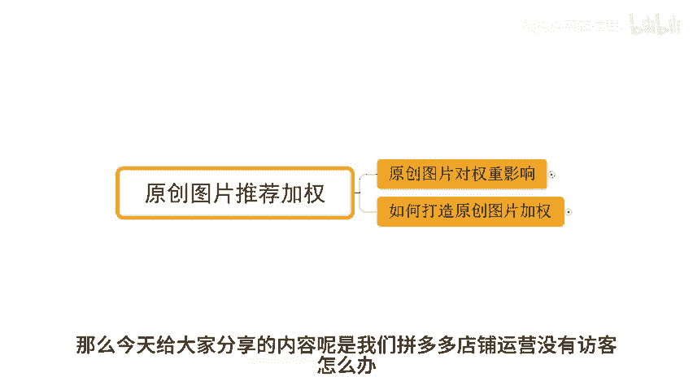

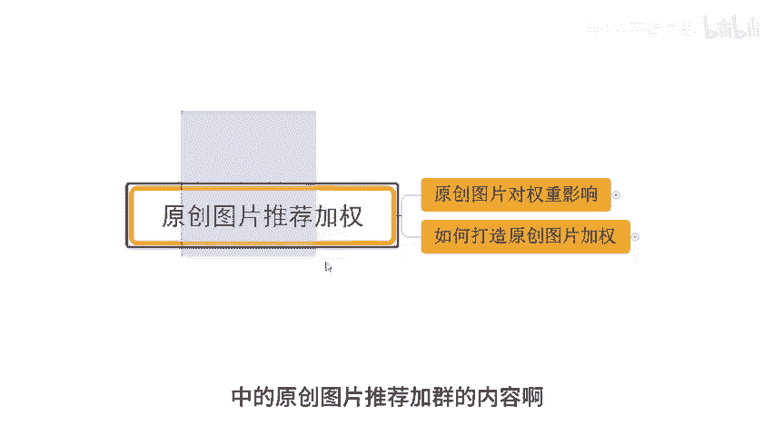

在费养之前呢，还是老规矩，先给大家看一下金期跟的小伙伴他们的店铺数据，好吧。

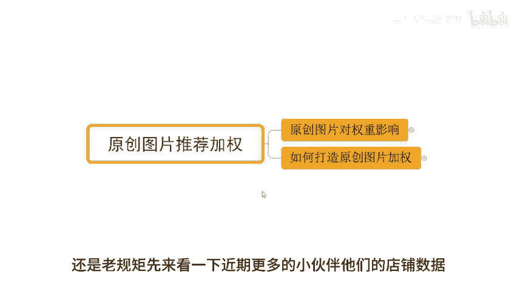

可以看到这个店铺呢是一个零访客的新店啊，局长那么这个店铺呢，我们首先完成了我们的市场分析和竞争分析，确定了我们的产品定位啊。通过完成定位之后呢，来确定了我们后续的一个产品啊组推方向。

那么完成了我们的选品。那当我们产品上掉之后呢，在不断的通过我们商品的操作啊来完成我们产品群众获取啊，通过数据提升可以看到啊，那么沉淀之后呢，访客也在不断的增长啊。那在后期的话。

一天访客呢做到了12001天啊，那么访客啊1200的情况之下呢，我们的订单一天是1900啊，那么转化率呢做到15。68啊。那同样的除了这个店铺之外呢，还成这个店铺。那原本访客呢只有几百个啊。

那跟着实施之后呢，通过我们的产品结构调整，通过SQ的一些调整等等啊，来完成了优化。那么访客呢也在不断的提升啊，后期的话一天的访客呢做到了110一0，一天的订单呢是1300多单啊，转化率呢11。88。

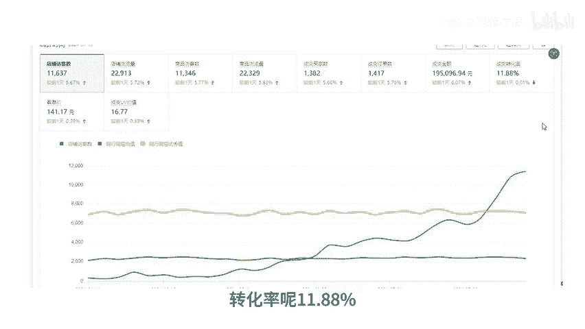

那么同样的还像这个店铺也差不多啊，一个样子的啊，就是原本呢访客是将近5000啊。那通过不断调整优化之后呢，访客也在不断的增长啊，后期呢一天访客呢是做到了24000啊。那一天订单是300多单啊。

转化率的3。06啊，也非常不错的。所以说可以看到啊，像这些呃有基础的也好，有数据的也好，还是说这种纯新的也好，其实跟实都是能够达到很好提升的。那么这些店铺呢也都是通过自然流的方式来操作的。

如果说你想知道如何通过自然流来操作店铺，如果通过自然流来达到爆款OK那么建议可以仔细观看我分享视频。好吧。

店铺运营呢对于很多的这个新的小白来说呢，会有着很多的问题。啊，这很正常啊，如果说你在店铺操作方面呢有遇到困难，遇到问题啊，或者需要资料的呀，O可以找我啊。有时间的话呢，我也可以带着你一起去实操坐店啊。

就像这小伙伴一样的，我们一起能够有到一个更好处的方法，能够让我们店铺呢做到一个更高的水平。好吧。OK那么原创图片对于我们这个权重的影响，到底有哪些呢？我们来看一下。

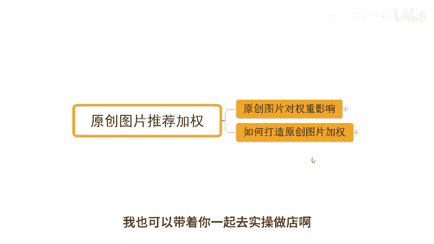

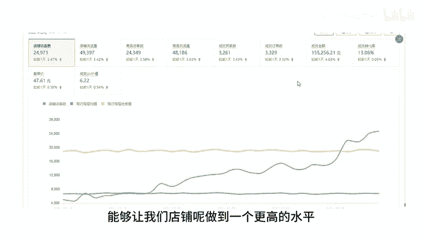

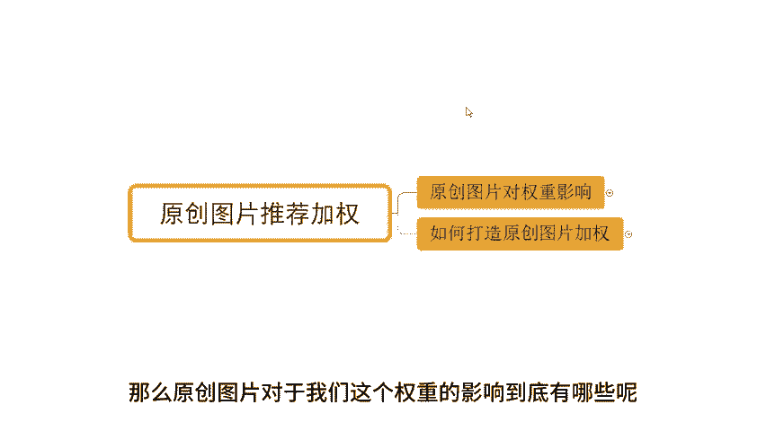

首先呢，平台他对于新品是有考核的。

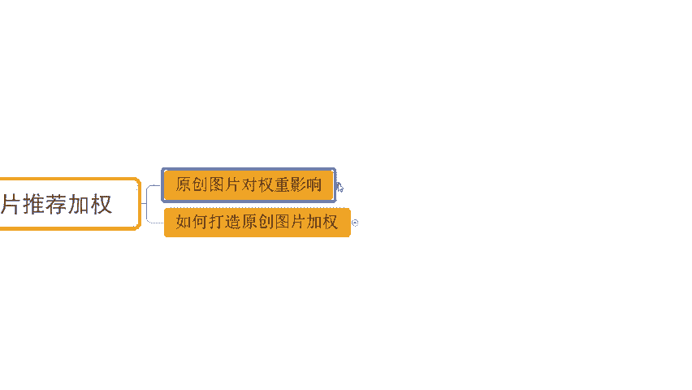

那么这个新民考核呢，其实重点来讲呢，是我们的一种推荐的机制啊。

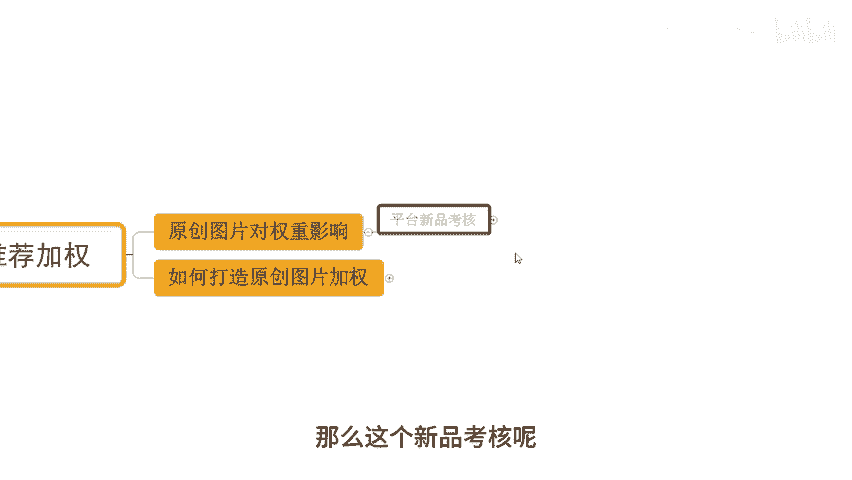

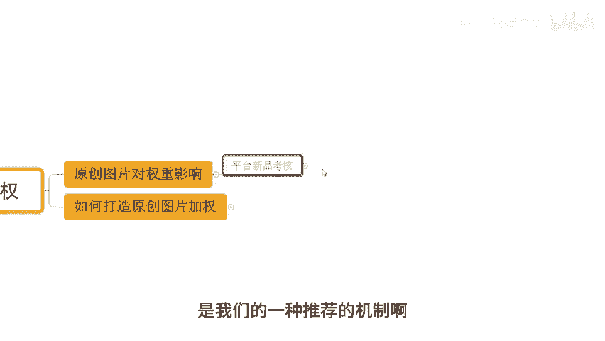

那对于这些推荐机制来说的话啊，那我们是可以通过它来完成我们更好的产品的曝光，以及我们竞争力的获取的那主要考核的内容呢就在于两个点啊，一个呢是我们上面的图片。另外一个就是我们上面的标题。

那么这些考核如果达标OK那我们的产品呢是可以得到一个很好的新品加权，从而呢能够得到更多推荐曝光。那么新品加权的逻辑到底是什么呢？来看一下啊。

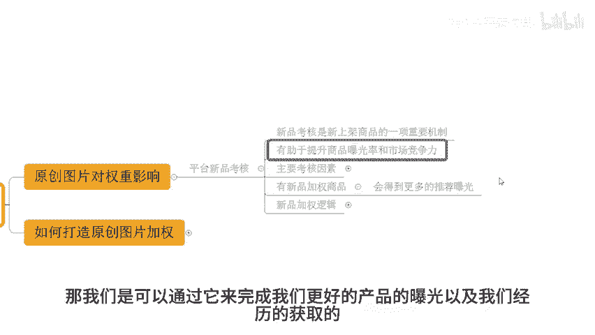

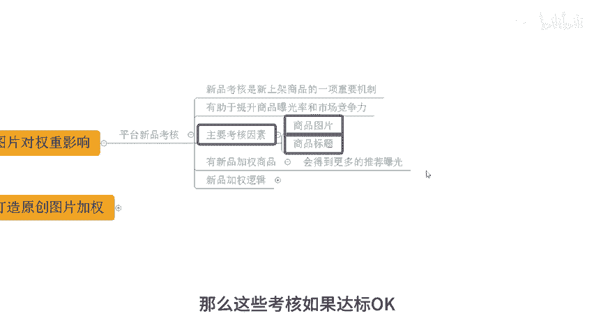

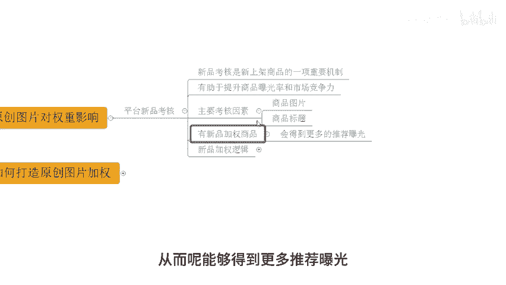

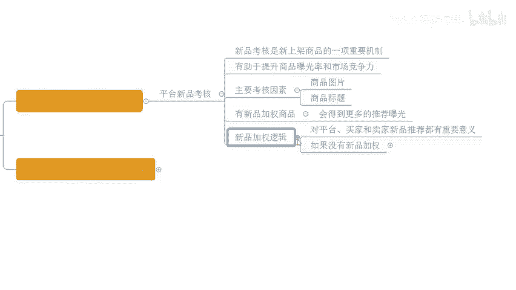

对于我们平台，对于我们买家，对于我们卖家来说啊，新品推荐呢他都是有着非常非常重要的意义的啊，这一点是毋庸置疑的。

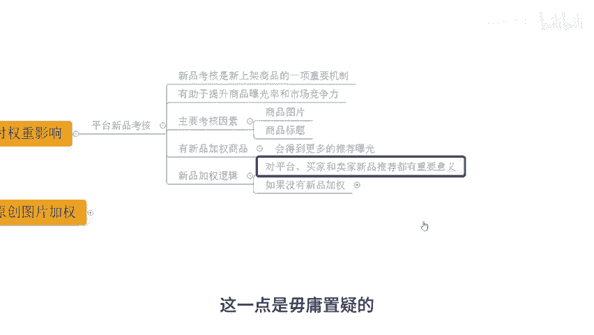

如果说没有姓名加权。那么这个时候呢，平台上的一些商品啊，包括说我们的用户啊，包括说我们商家呢，其实都会非常非常难过啊，什么意思呢？来，对于平台来说啊，那么如果说没有姓名教学的话。

那么展示靠前的商品呢都是一些数据好的老链接啊，我们可以这样理解。

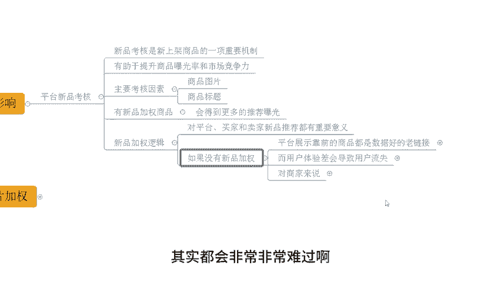

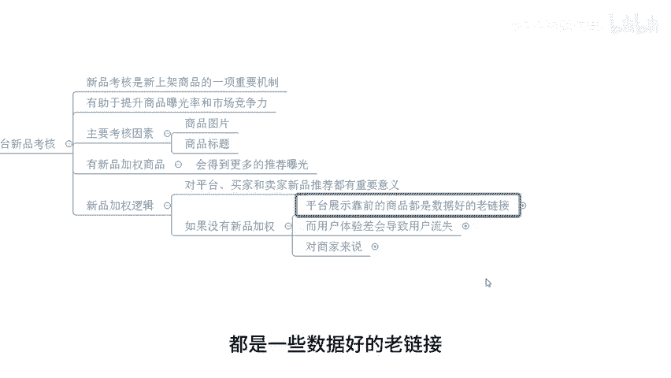

那么这个时候呢，就会遇到一个问题。用户他就很难有到新鲜感。产品的迭代呢也会受到限制。那么我们的买家体验呢也会很差啊，对吧？就比如说我今天我去买一个东西。我就买了，我也看了，对吧？哎。

今天这个平台上呢有一个产品是一个爆款来的，哎，我觉得还不错。我买了他呢展示的位置很靠前。过几天之后或者过一一段时间之后，我还要去买。是这个产品很不错啊，但是呢他可能也会有到一些这个新的东西出来，对吧？

那如果说他展示的商品永远就是这一个卖的很好的产品。他没有迭代。对于我来说。我对这个产品可能有需求，对吧？但是他的需求。总会有到一个这个呃实现的对吧？到了一定的这个时间限制之后呢，我可能也会产生一些业务。

没错吧。那么久而久之呢，那我可能对于这个平台的一个使用也会减少。因为他没有办法给到我更多的体验，给到我更好的产品。永远就是那一个东西。那么就会导致呢，我们的用户。

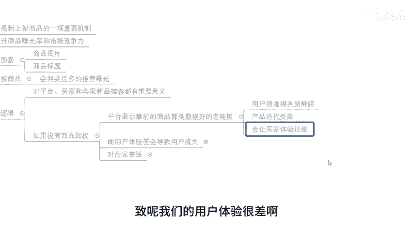

体验很差啊，从而呢导致用户流失。当这个用户流失的时候呢，好，那么我们的平台。

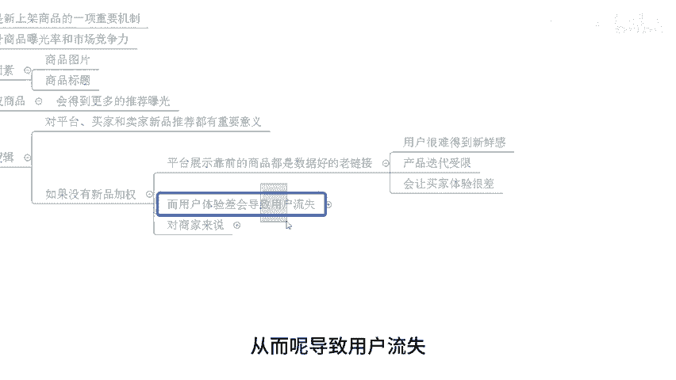

就会失去这一部分用户，同时呢也会导致我们的市场份额下降。所以平台它是不希望出现这种来这种情况来的啊。那包括说我们作为买家来说，我们也不希望我们所使用的平台是一个一成不变的。

永远都是同样的商品的这个平台啊，他需要变化。那对于我们商家来说呢，OK那如果说排名都是被老链接垄断的话，那么我们作为新店，作为我们发布的新品，他没有办法获取到一个正常的曝光。那我们的发展也会受限。

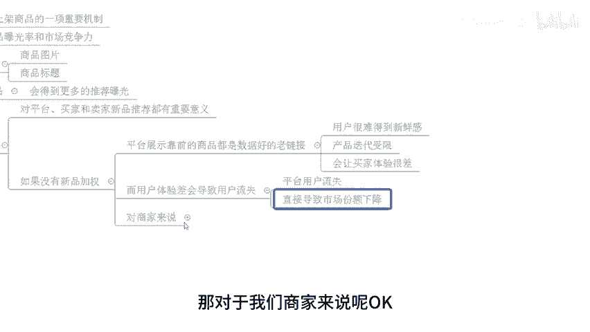

没有机会。你没有机会的话，那么就不会有到更多的新鲜的血液进入到我们的平台。那么平台上的店铺呢，永远就是那几家平台的商品呢，永远就是那几个。那么这个平台就死掉了。

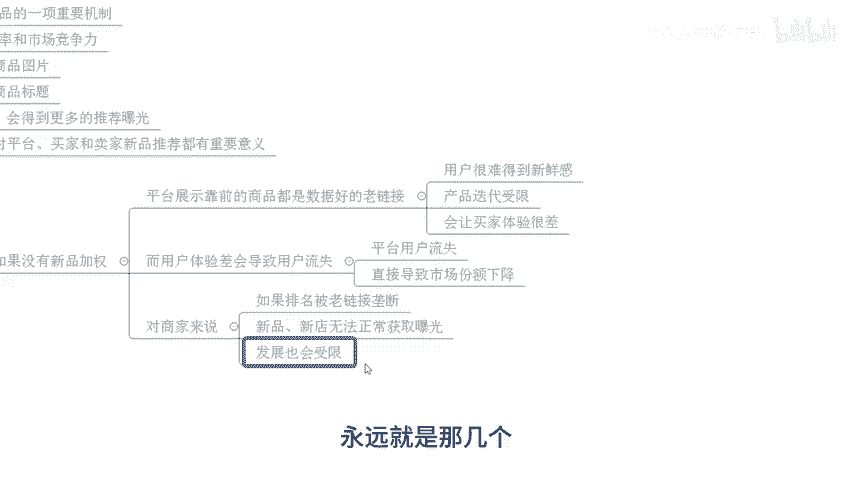

啊，所以说我们平台呢，他对于我们的呃这个呃新品的考核和推荐呢是非常非常重要的。而新品的考核就重点会考核到图片板块。那么换句话说，图片的一个影响，影响到我们新品推荐，影响到我们产品的曝光获取。

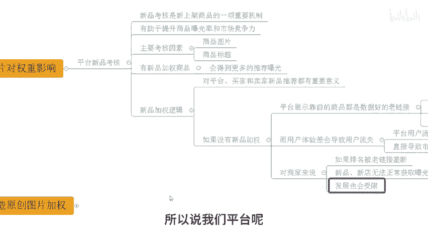

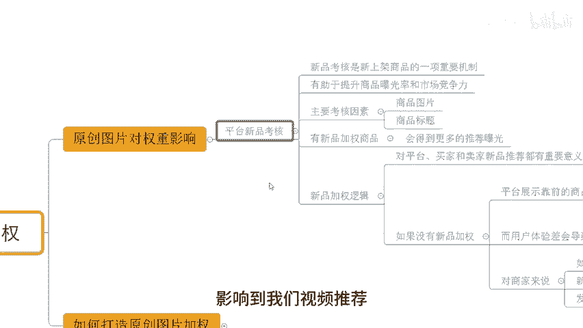

啊，那我们如何去打造一个具备原创图片加权的这样的一个产品？

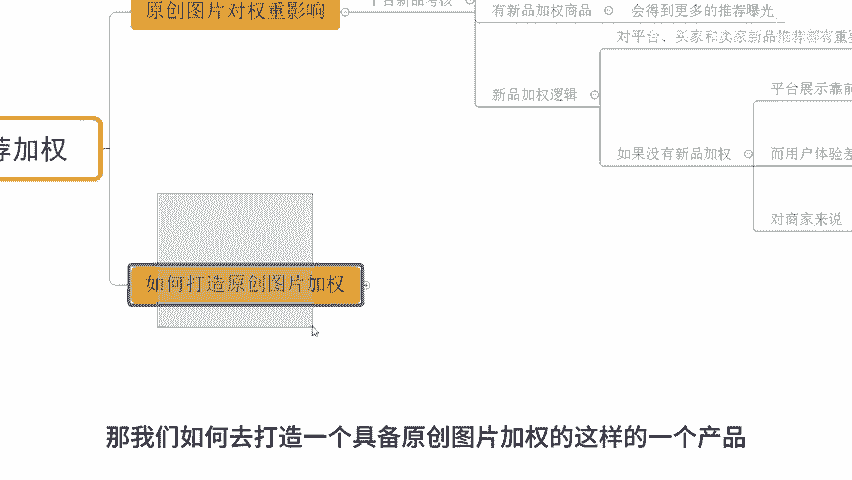

这很关键啊这很关键啊。那么来我们重点来说一下，首先是原创的判断方式。

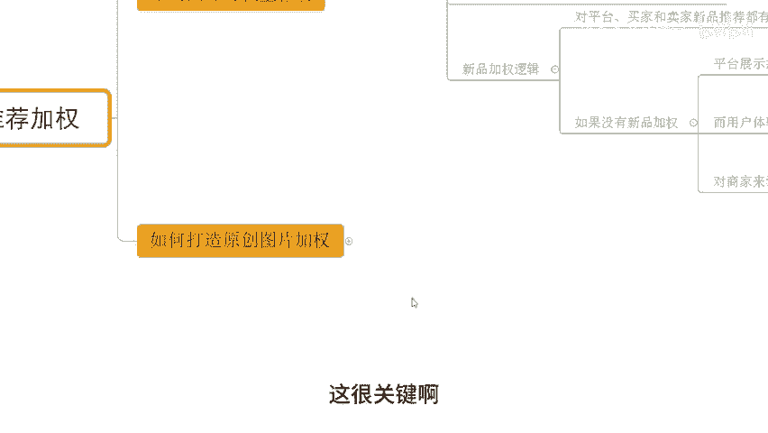

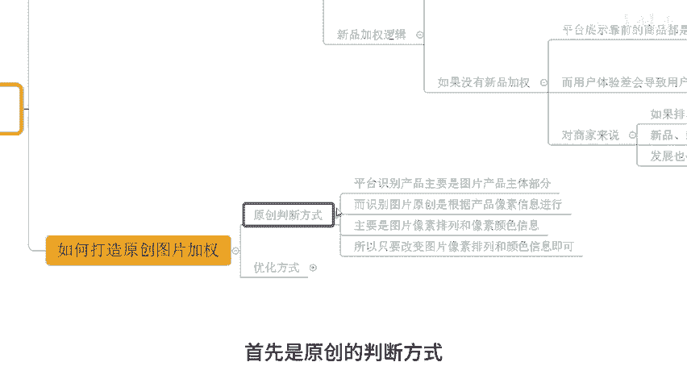

那我们要搞清楚一个事情啊。平台呢它识别我们的。产品的时候对吧？它识别的是我们图片的商品主体部分。这一点大家搞清楚。所以说我们的产品的这个图片啊，商品主体部分如果说没有明显的变化，那么你可能识别出来呢。

它就是同款或者是相似款，对吧？这一点大家搞清楚，那么对于图片的识别呢，平台或者是互联网，它是根据整个图片的像素信息来进行的。主要呢就是我们图片的像素的排列以及像素的颜色信息。

所以说这个图片如果说啊我们的像素的排列和颜色信息发生了改变。那么这个图片呢，它就跟原本是有区别的。平台的识别呢，它就是一个单独的图片，他们俩可能相似度比较高，但是他们俩不是同一张图片这一点。

我们搞清楚啊。那么。所以以此我们在后续进行原创图片打造的时候呢，就可以通过它来作为一个突破点，对吧？那么怎么怎么怎么来做呢？有个方式什么样的呢？来看一下。

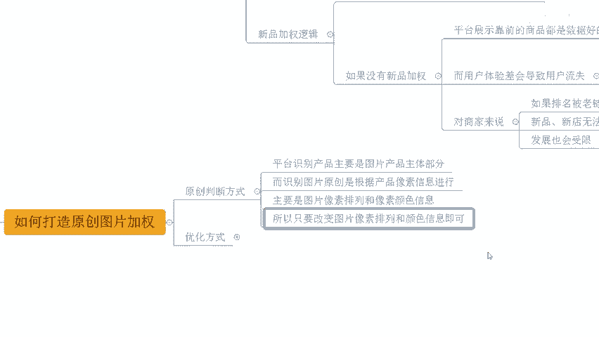

第一步，我们可以把我们需要去做调整的图片呢放进PS里面来。那么这个图片呢放进PS里面来之后呢，OK接着进行我们第二步。第二步呢，我们去找到一张颜色比较复杂的图片。

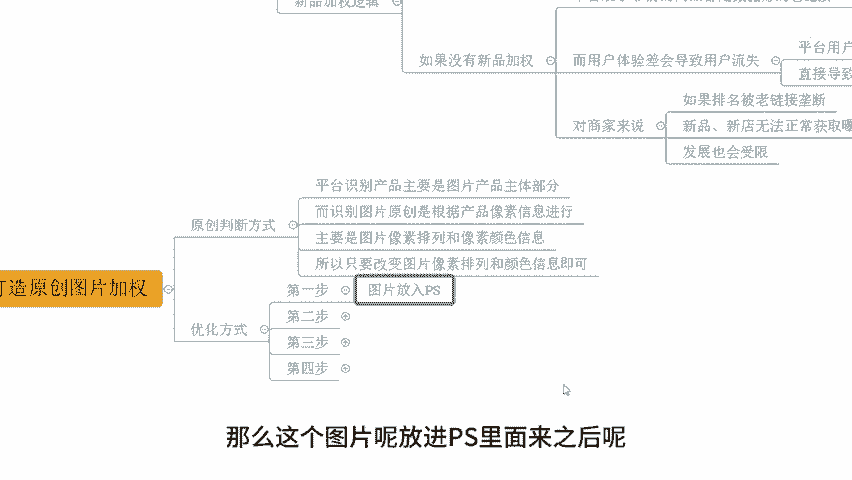

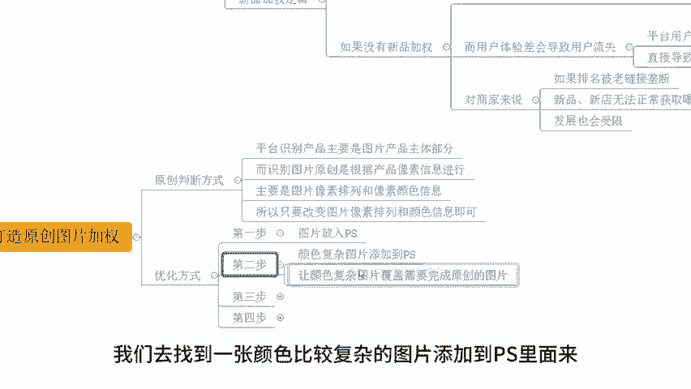

添加到PS里面来。然后呢，让这一个颜色非常复杂，图片呢覆盖掉我们需要完成原创操作的图片。那么当这两个图片啊。进行一个合并之后，当我们的颜色的图片啊，复杂的图片呢覆盖掉我们原本的图片之后，这个时候呢。

我们再来进行第三步啊，让我们颜色复杂图片呢把它的。

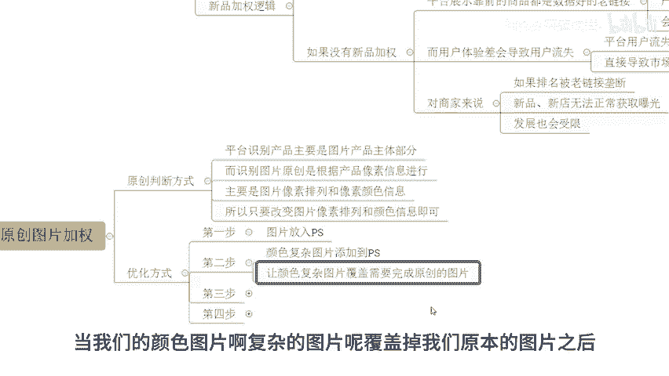

普托明度调低。调到多低呢，不影响正常观看我们另外一张有产品的这个图片就可以了。一般不透明度呢在1%到2%啊，那么这个时候。产品。平台识别的时候可以很好的识别出来。

可能我们产品也会有到比较多的同款和相似款。但是因为我们这样的一个操作呢，那么我们的图片它的颜色信息会发生改变。它的像素之间的分布情况啊和原本的图片是不一样的。所以这个时候呢。

我们的图片的原创它是可以做到的。当完成原创的时候呢，好，那么我们就可以得到推荐加权就可以得到我们的新品加权。那么有小伙伴可能说，那这个东西。

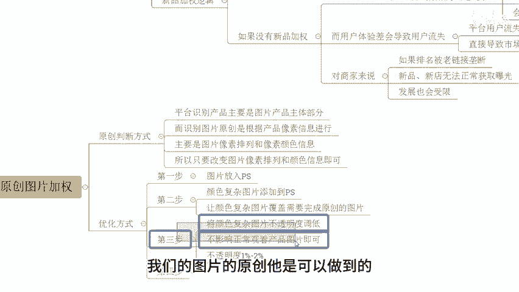

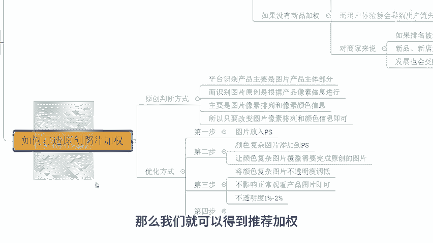

那他既然说同款和相似款还在会不会还是比价呀可能会存在比价啊，他不能完全规避这个同款和相似款，但是可以帮我们完成原创的一个加权啊，是这样子的。那么最终第四步导出保存就可以了。啊。

比较简单的方式好吧O那么这个呢就是我们原创图片加权的一个操作方法啊，那因为这一个过程呢是需要我们去操作的，可能通过操作步骤的方式讲解呢，有很多小伙伴不是很理解，这个没关系啊。

如果说你在店铺运营过程中有什么问题呀需要资料的呀，可以找我啊，那么同样的还是那句话，如果说有时间的话，我也可以带着你起去实操做店对吧？这样这小伙伴让我们一起能够有到一个更好的作方法。

让我们店铺呢做到更高水平，好吧，O那么今天的视频呢到时结束，我们下次见，各位，拜拜。

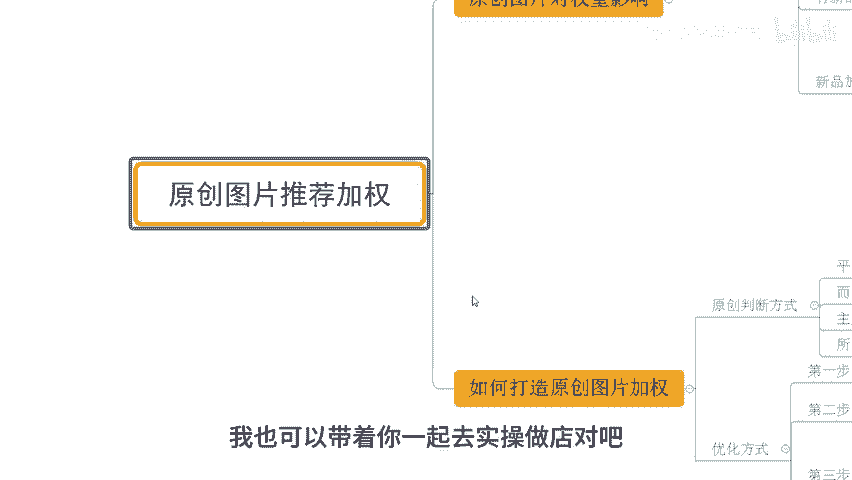

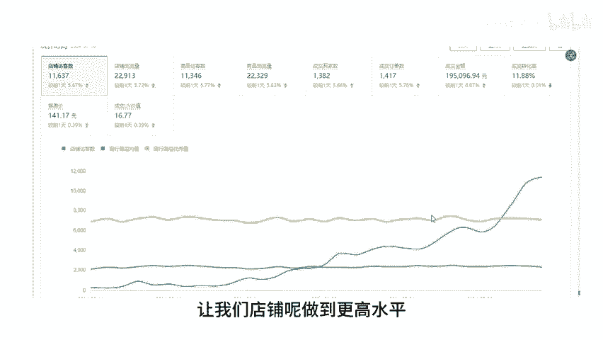

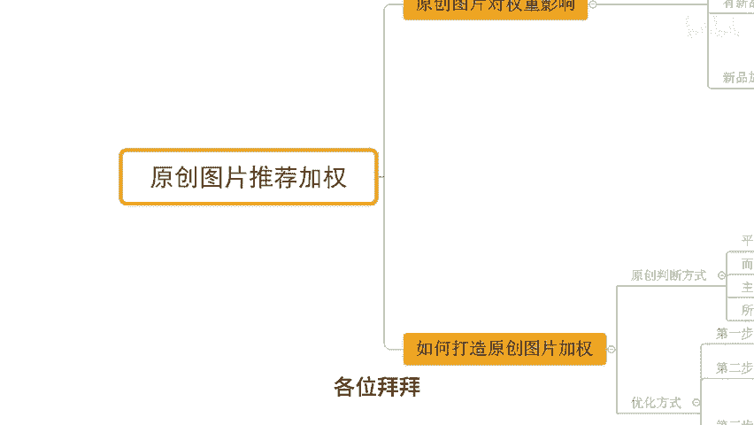