# 拼多多开店运营-新手电商运营实战指南，B站最全拼多多零基础入门教程！拼多多运营秘籍，小白也能成电商大亨！轻松上手拼多多，拼多多新手开店赚钱攻略 - P42：042 创意主图引流加权 - 拼多多开店运营- - BV1xms8eSEVs

hello大家好，我是谢楼。今天给大家分享的内容呢是我们拼多多店铺运营没有访客，怎么办中的创意主图引流加权的内容啊。在分享之前呢，按规矩啊，先给大家看一下近期跟着实尚小伙伴他们的店铺数据，好吧。

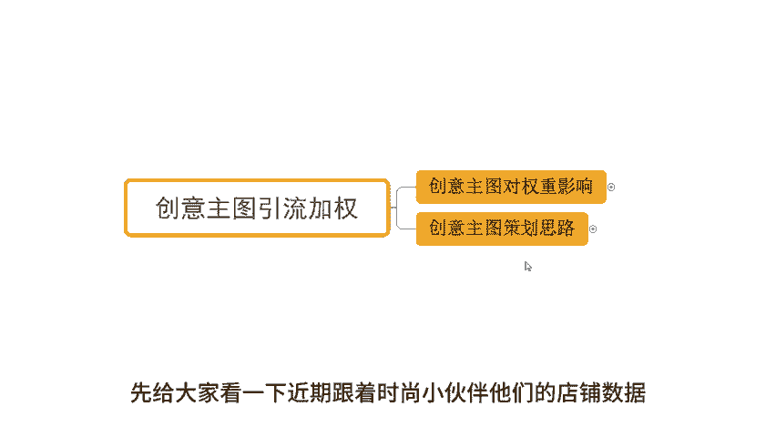

可以看到像这个店铺呢，原本访客在3000左右啊。那么呃这样的店铺呢，我们首先也针对到我们产品呢进行了调整跟优化啊，包括像我们的啊商品的价格呀SQ的一个布局啊等等啊，那完成的优化之后呢。

访客也在不断的增长啊，到后期的话一天访客呢做到了1030一天的订单呢是2100多单啊，转化率呢做到了16。17啊，还有像这个店铺可以看到原本访客呢只有几百个对吧？那同样的那经过调整优化之后呢。

完成了我们产品的商品结构的一些布局的一个调整啊，那访客也在不断的提升，到后期一个小的爆发之后呢，访客做到了一天1万多啊。那么订单的话一天是1300多单，转化率呢11。88啊。还有像这个店铺可以看到。

原本访客呢在5000多啊，那通过调整优化之后呢，访客也在不断的增长啊。当然呢这期间有些波动啊，但是问题不大，后期的话一天访客呢做到了2000一天的订单呢是3200多单啊。

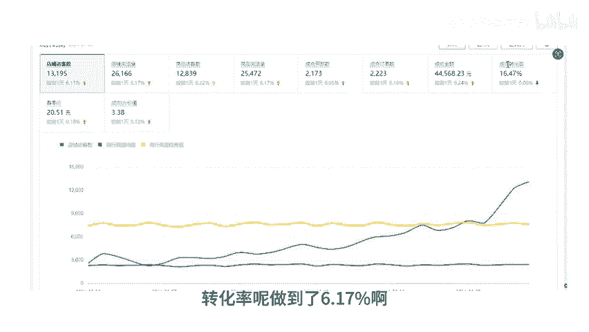

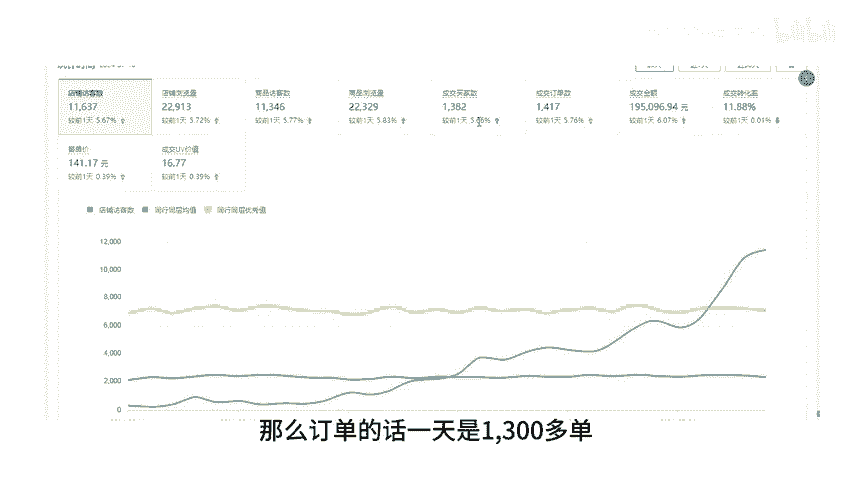

转化率了13。06%啊。当然了，这些店铺也都是有一些所谓的基础有数据的店铺啊，同样的一些零基础零访客的新店啊，跟能实上也是可以到好好提升的。可以看到现在这个店铺对吧？原本的访客是零啊。

一个完全没有访客的一个店铺啊。一个纯新店来的。那么这个店铺呢跟了实之后呢，首先我们通过了这个市场分析和技准分析，完成了我们的爆款定位啊，完成了我们的选品动作啊。那做完选品之后呢。

产品上架之后再不断的操作优化我们上面的数据啊，通过一段时间累积之后啊，商品群众得到一个得到一个沉淀啊，那么后期呢访客也不断的一个增长啊。

那后面的话一天的访客呢做到了120一天的订单1900多单转化率呢15。68也是非常不错的。那么像这些店铺呢也都是通过自然流的方式来操作的啊。如果说你想知道怎么通过战流来操作店铺。

怎么通过战略来得到爆款O建议呢可以仔细观看我分享视频好吧，那店铺运营呢对于我们很多的小白来说呢，会有到很多的困难。

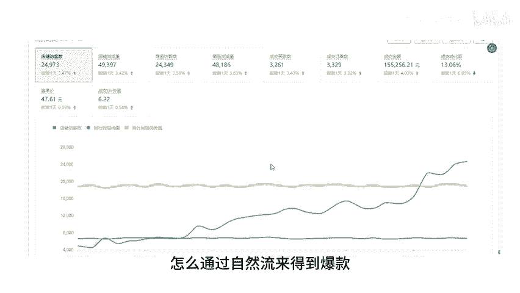

这个很正常。因为你自己不懂嘛，对吧？对于一个陌生的领域，你有很多的困难，很多的问题，再上不过了。如果说你在操店铺的时候呢，有遇到问题，你需要资料的，OK可以找我啊。那有时间的话呢。

我也可以带着你一起去实操做店啊，就像这小伙伴一样呢，我们一起能够有到更好的操作方法，让我们店铺呢达到一个更高的水平。好吧，OK那么关于我们这个创意主图对于我们群重的影响呢，我们首先来搞清楚这个东西啊。

那店铺操作来讲的话，创意主图呢，它是一个非常非常重要的一个板块啊。那首先呢我们可以通过用户行为来进行一个分析。

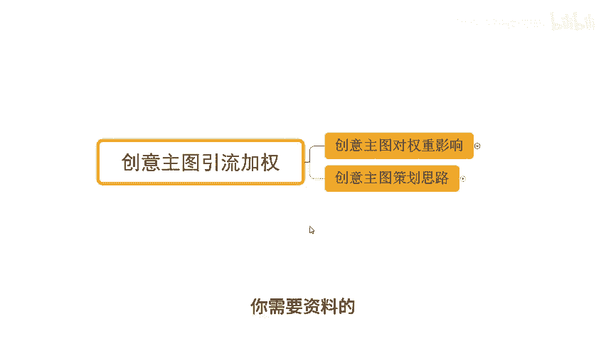

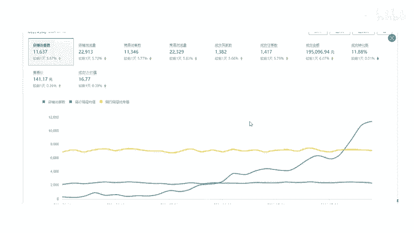

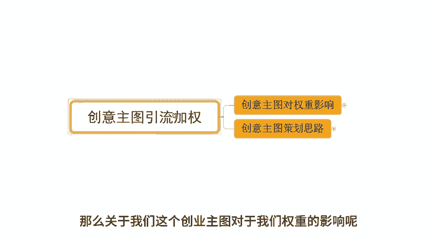

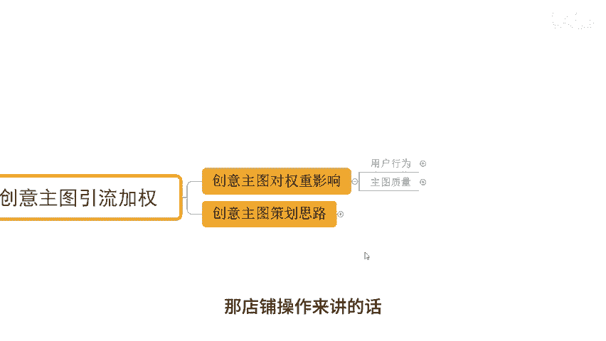

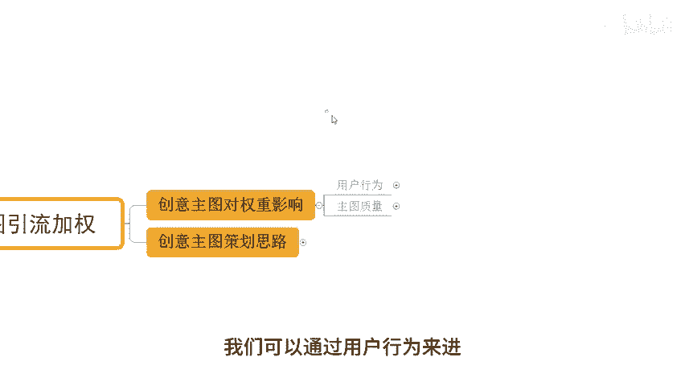

平台呢他们对我们的这个啊商品的点击啊、浏览啊、收藏啊、转化等等啊，这些各种各样的一个用户行为呢都会进行统计，还有分析啊，这是必然的啊。那么在这个过程中呢，这些分析的结果啊。

它是会影响到我们上面的权重的啊，这个东西很关键。

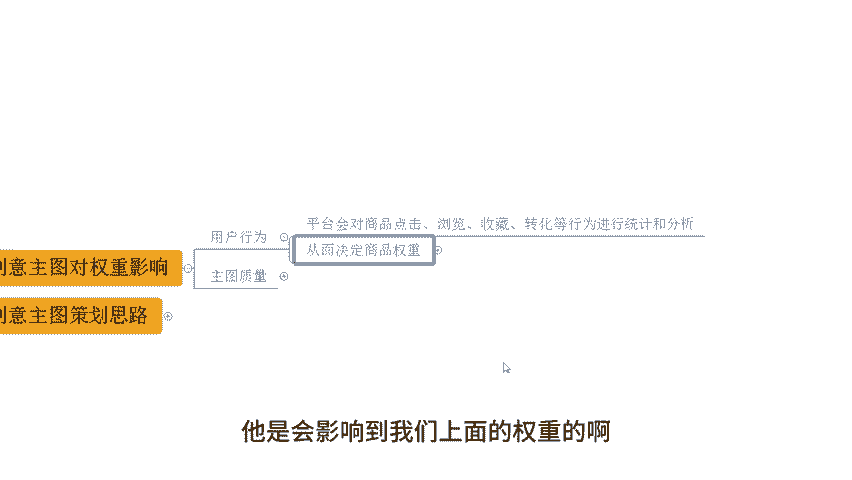

而主图呢作为我们用户最先接触到的一个视频元素啊，所以它会直接影响到我们用户的点击率，还有关注度。那么换句话说呢，如果说你的主图没有一个很好的吸引力啊，作为我们的消费者来说。

它对于我们产品的关注度比较低的话，对于我们点击率比较低的话，OK那么抱歉了啊，后续你的商品的权重。

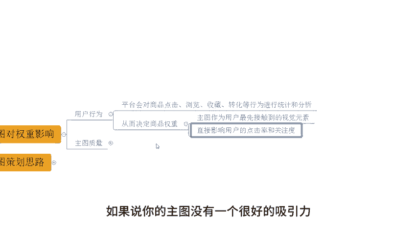

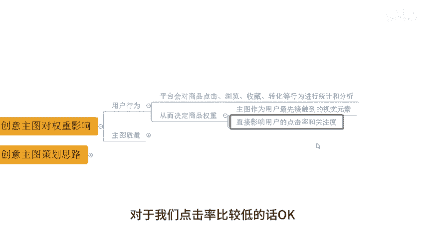

就会受到影响。你同样曝光情况之下，你的访客没有别人多，平台就会觉得哎别人。不喜欢你的商品，或者用户更喜欢别人的商品。当然呢，同样的，那么当我们的访客在整个点击板块结束之后呢，进入到我们店铺之后，对不对？

它会形成一个啊更多的动作，包括浏览深度啊，包括说我们的产品的转化呀对吧，包括说我们的成交额呀、优惠价值等等。

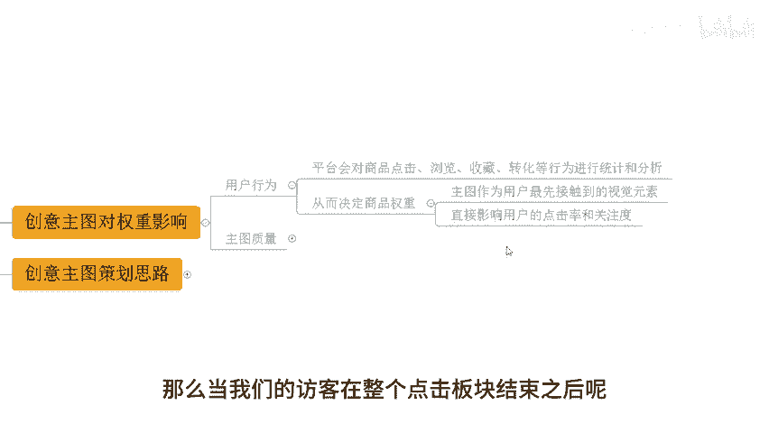

那么这些数据层面上来讲，你还是没有到一个很好的反馈的话，那么抱歉啊，那么你可能就会被打入冷宫，里就是个垃圾，对吧？那么就不会给你推荐曝光，所以这个东西很关键啊，那么再一个呢就是我们的呃主图的质量啊。

这个东西也很很厉害了啊。那主图呢，它能够更加具备吸引力，对吧？能够更加准确的表达我们商品的特点跟价值，能够去提高我们用户点击率和浏览深度。那么这样呢就会以对我们产品呢带来一个更加好的正面的影响。😊。

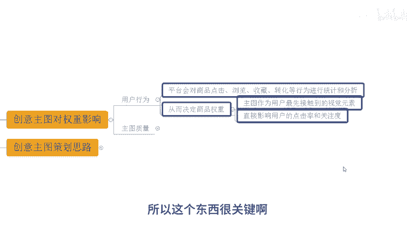

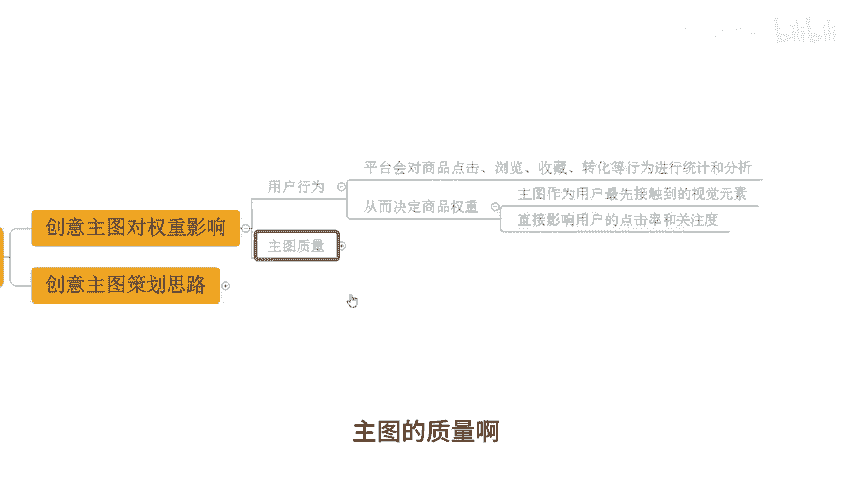

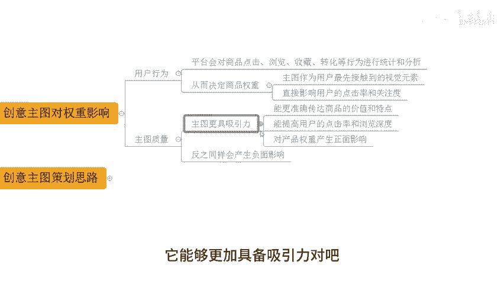

那么这里呢所谓的图片质量一个是清晰表达我们产品的特点。那么另外一点呢就是我们图片确实它有到一个比较好的展示啊，它能够去有到一个很好的审美啊，它能够有到很好的视觉输出，它的一个图片的质量很好啊。

清晰度很高，而不是像打完马赛克一样的很模糊的一些图片，好吧，那如果说这样子的话，对吧？图片有很模糊，又没有很好的展示，我们上面卖点，那么他就会对我们产生一些负面影响，用户会觉得哎这个店铺的图片这么垃圾。

这个店铺它是不是一个卖盗版的店铺啊，这个店铺是不是就质量就不是很好啊，那么我是不是就应该去找到一些图片表现更好的店铺去买东西更靠谱更安全呢？对吧？作为我们自己是消费者的话，我们也会这样想。

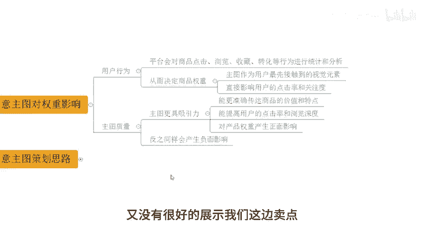

一个连产展示图片都做的很垃圾的店铺，你敢在他店铺里面去买东西吗？多多少少心里面会发怵啊啊，所以这个点呢大家注意一下。

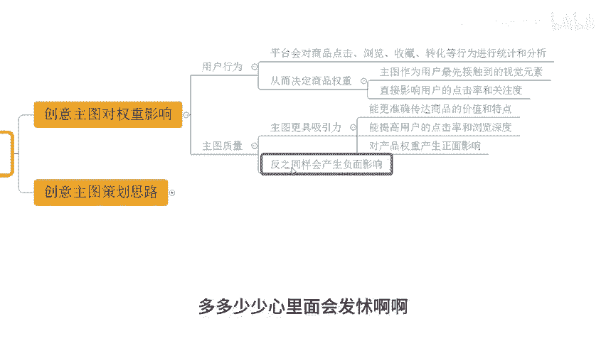

那我们来重点说一说图片这个主图的一个策划的思路。好吧，这个东西呢我们要搞清楚它啊。首先第一点呢，就是我们主图设计的要求啊，大家清楚啊，那么主图呢一定是需要清晰明了的。

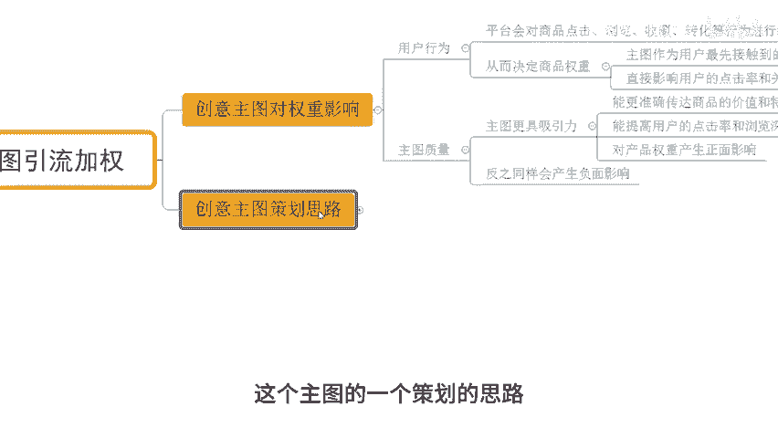

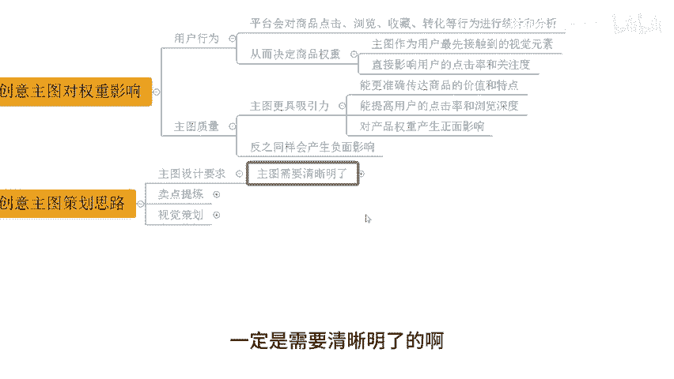

啊，这个点很关键，能够去准确的展示出我们产品的特点和优势。一张图片，一个主题文案呢能够去引起买家的兴趣啊，这样的一个特点才是一个好的图片。那从而呢能够去更好的引导用户完成点击啊。

这是一个好的图片的一个要求。

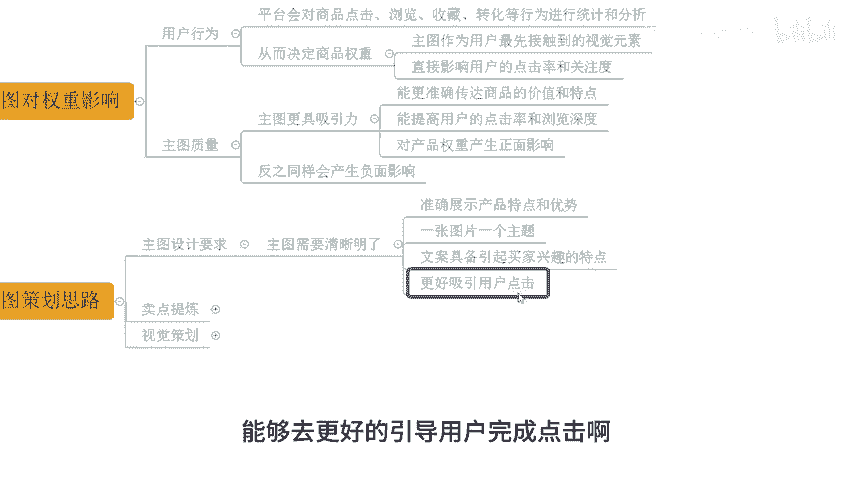

那么这里呢就会拆分成两个板块，重点要去我们进行一个呃这个操作啊，一个呢就是我们的。

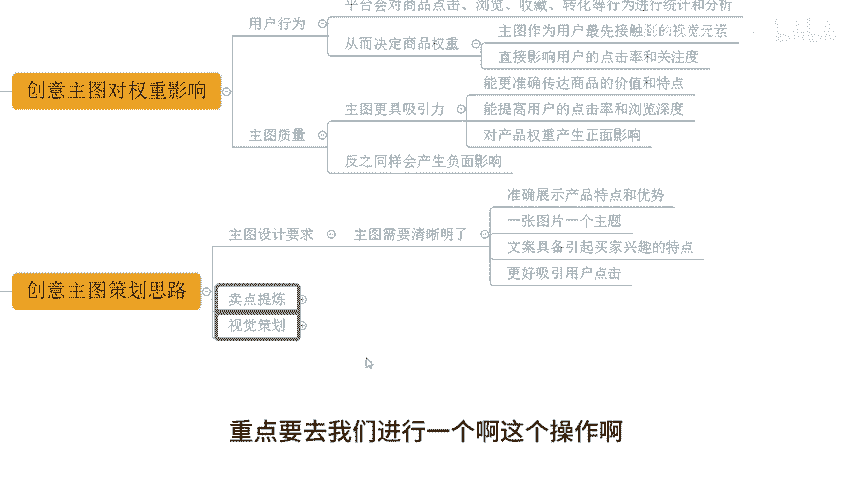

慢点停电。

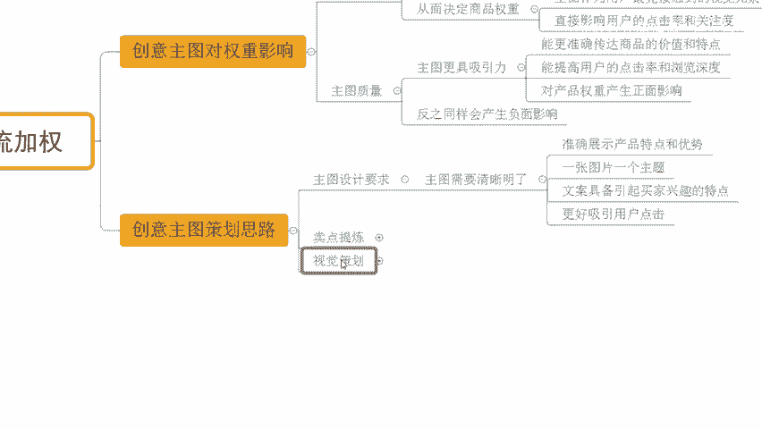

另外呢就是我们自由策划。那卖点提炼是什么呢？卖点提炼就是要找清楚我们产品真正意义上，对于我们消费者来说具有吸引力啊，能够去打动消费者，能够去戳中消费者内心的一个东西。让我们消费者呢能够认可我们产品。

能够去啊更好的接受我们产品啊。所以呢我们在体验的时候呢，会有到一个过程，有到一个思路啊。那么思路呢这边可以看一下啊，首先第一点呢是问题啊，问题是什么呢？

就是我们买家在针对到我们商品进行使用或者是购买这个过程中的一些痛点和需求。

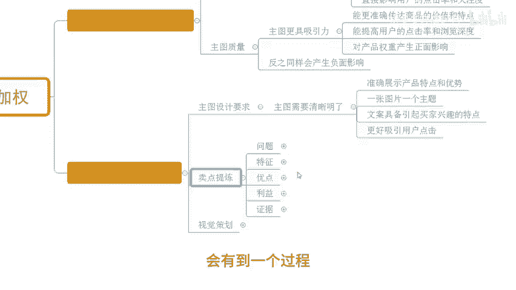

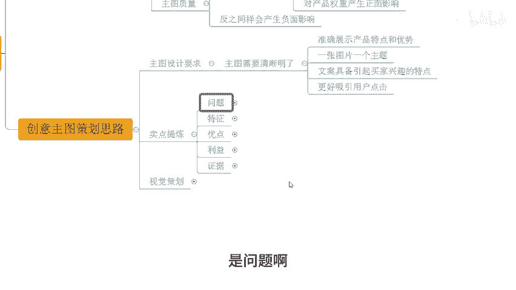

当然呢，不是说是针只是单独针对到我啊，是我们这一类型商品啊。我们搞清楚用户真正意义上买我们这样的产品，他需要解决的问题是什么？他在使用或者在购买我们这一类型上品的时候呢，他会有的哪些。

不方便点或者是哪些疑惑，哪些疑虑搞清楚。

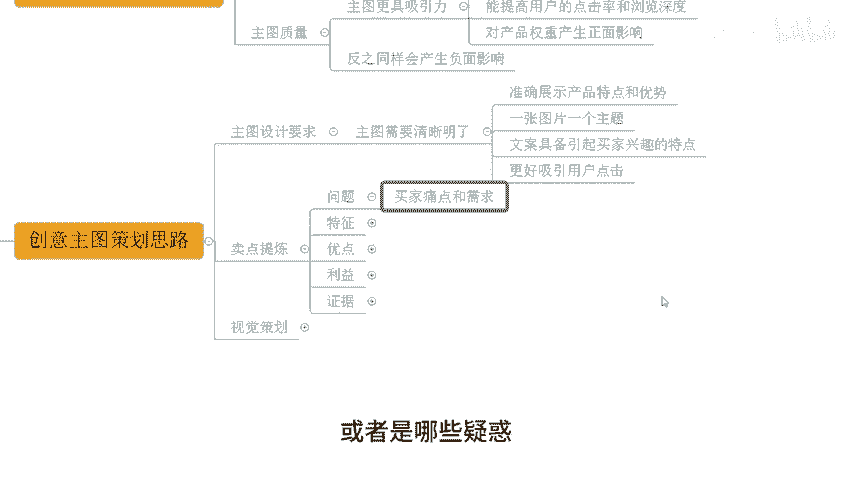

搞清楚之后呢，好，那针对到用户的这些所谓的需求，所谓的痛点。那我们的商品那有什么样的一个商品特征可以解决这些问题？对应的我们解决这些问题的特征，它能够有到什么样的一个优点。它跟我们同行对比来说。

优势在哪里？

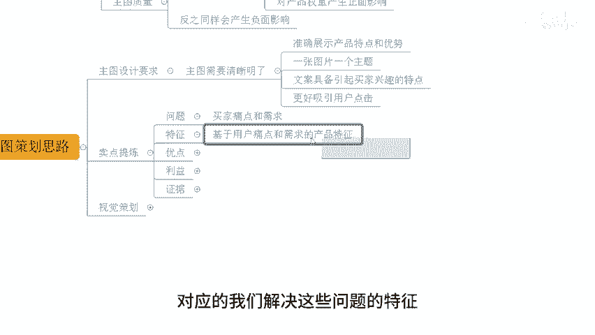

那么同时呢我们的优势，我们的优点呢能够给我们的用户带来什么样一个好处啊，这个我们搞清楚搞清楚之后呢，好，我们再往后面呢提交一些所谓的我们的优点的一些证据就可以了。那所以换句话说呢。

我们的卖点呢是需要用用到我们的利益点啊优点特征来进行组合的。一般的情况之下呢，我们的这个卖点提炼的话，文案输出是主标题副标题加上一个说明。主标题的话就是我们的利益点啊，副标题可以是特征可以是优点。

也可以是痛点啊，那么在说明呢就是我们的证据啊，这里呢就不再去过多赘述了。大家可以参考这样方式。那做好这个东西之后呢，再就是我们的视觉策划啊，视觉策划呢是重点去体现出差异化。

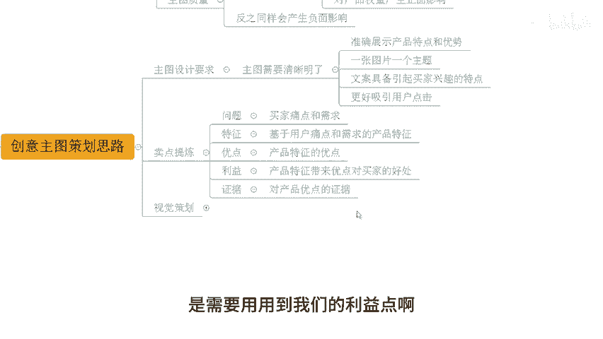

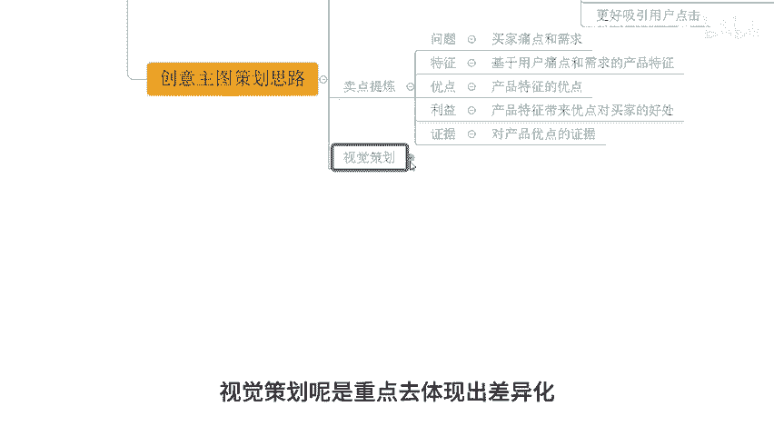

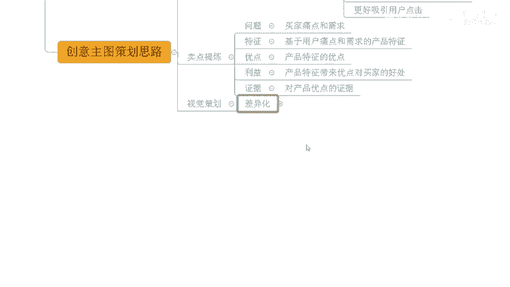

那么差异化的一个表达呢可以很好的去帮我们完成我们产品的吸引人眼球的一个操作。我们要让我们用户能够更好的看见我们产品，对吧？同时呢在这个差异化的过程中呢，我们产品的展示产品的一个图片输出的审美。

一定要在线啊。这个东西你确实啊不能说是为了差异化而搞得特别难看啊，就很很尴尬啊。那么差异化的表达呢两个方向啊，可以去超参参考啊，一个是颜色差异化，一个是展示差异化啊，颜色差异化呢可以是我们的产品颜色。

也可以是我们产品的这个呃图片的背景颜色，也可以是我们这一个呃对比的颜色等等都可以的啊。什么意思呢？举个例子。

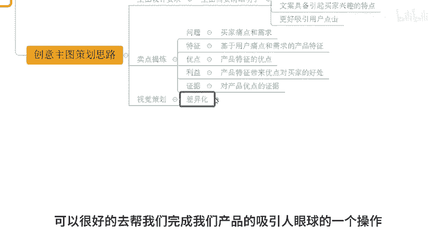

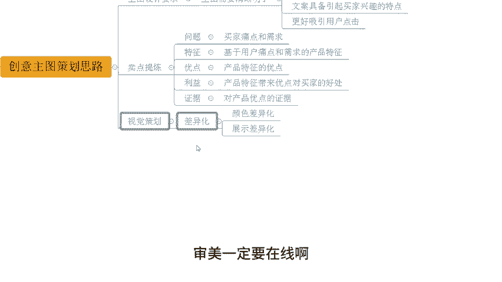

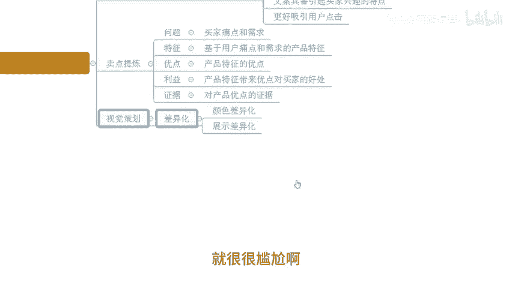

我们以产品展示这个颜色差异化来讲啊。今天我们卖的是一件衣服。啊，我的同行呢可能展示的颜色呢都是黑色白色啊。今天我一个人，我的产品颜色呢，找一件红色的衣服，找一件黄色的衣服，反正就是一件特别显眼的。

跟我同样颜色不一样的衣服。那么这个时候。我的商品在用户进行浏览的时候，对吧？它滑动这个手机界面的时候就会非常突出。我就能很好的吸引用户眼球。当然呢前提条件是我们这个颜色确实是用户需要的。

而而且呃最起码保证一个点是用户不反感的啊如果说我们这个颜色确实很丑很难看，就没有人愿意去买这种颜色的话，你去做出来就确实也很尴尬，对吧？就不要去这样做，当然呢最好的方式呢。

就是说哎是有很大量用户对这个产品颜色有需求的。比如说他们有很多人去搜黑色，那我今天做一个黑色，当然呢，如果是这种情况的话，可能我的同行也会有很多人做黑色，对不对？

那么这个时候呢就要去用用到一个背景的颜色产异化。同行的颜色背景呢可能是灰色，可能是白色，可能是黑色，对吧？OK那么我的背景呢，我就用红色、黄色、绿色对吧？等等，各种各样的颜色跟我们的同行进行区分。

让我们的产品颜色呢在整个展示图片过程中呢能够更好的突出出来，能够让我们图片呢更好的吸用户眼球。那么这个是也是产业化。再来说一说我们的展示差业化啊，展示商业化呢就是我们表达的形式，产品表达形式啊。

那还是以依服来举例子的话，如果说我的同行。他们是这个用模特拍的对吧？好，我今天就用一个平图拍的图片。那么展示形式跟我的同行不一样。那么我们也可以让我们产品呢在整个的浏览过程中变得比较显眼啊。

那么我们同行都是用皮肤拍的。那么我用挂牌，我们同行呢都是用到一些这个完整图片的整个商品展示出来的，我可以用到一些局部细节的一个展示来进行表达也是可以的啊。

那么这样呢我们产品也可以啊更加的突出或者更加显眼一点。好吧，那么有了这样的方式操作的话，OK那我们的主图就会变得更加的有创意，更加的吸引力，带来更好的点击，从而带来更高的权重得到更多的访客。好吧。

OK以上呢就是我们。

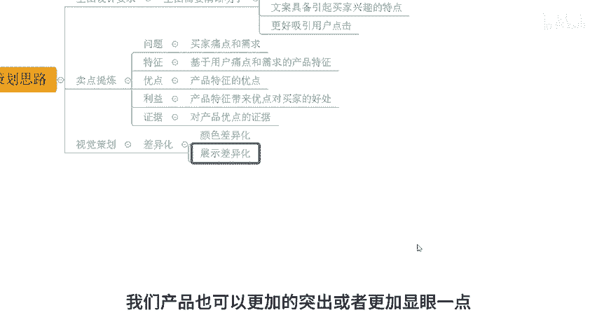

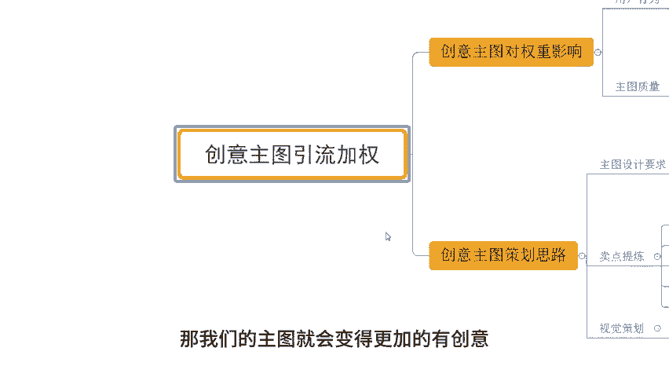

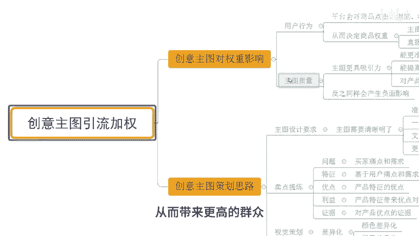

创业组织对我们权重影响的一个分享啊，感谢各位的一个观看啊。当然还是那句话，如果说你在店铺运营过程中有遇到什么问题啊，有需要这个资料的呀，可以找我啊。如果说是有时间的话，也可以跟着一起实操，对吧？

就像这些小伙伴一样呢，我们一起能够有到一个更好的收作方法，让我们店铺呢达到更高水平，好吧。那么今天的一个视频费呢就到这里，我们下次再见，各位，拜拜。😊。

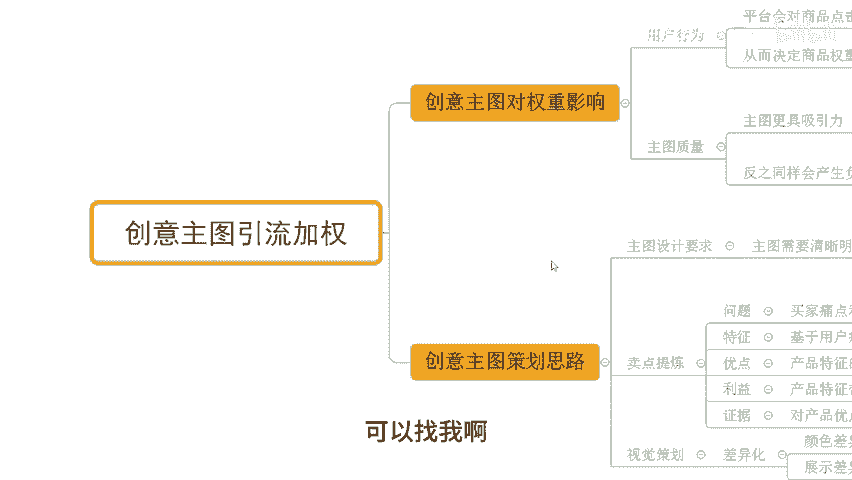

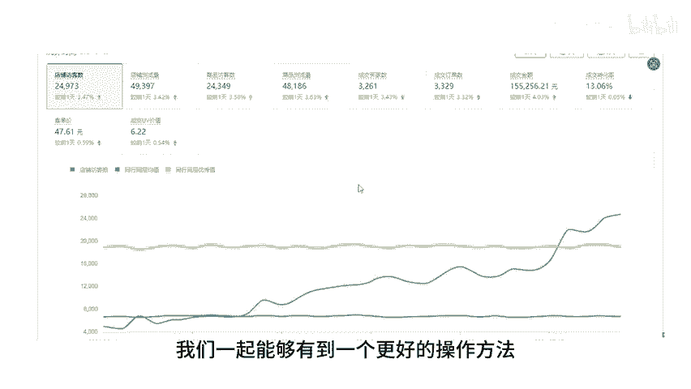

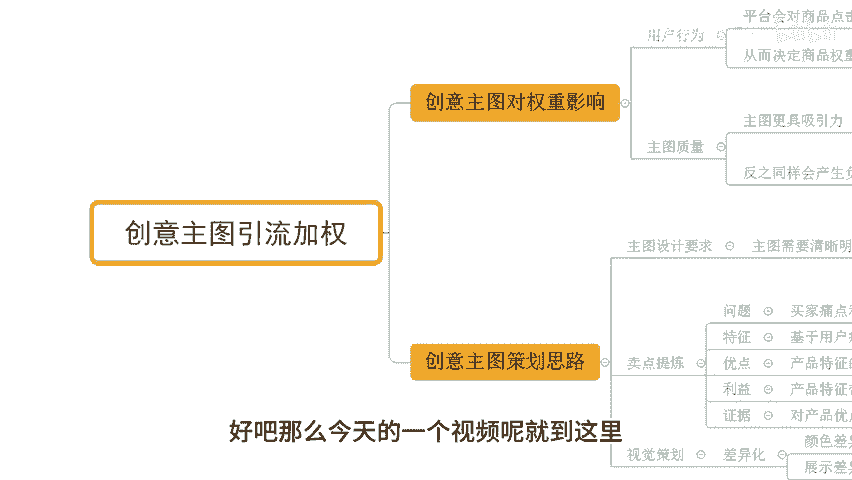