# 拼多多开店运营-新手电商运营实战指南，B站最全拼多多零基础入门教程！拼多多运营秘籍，小白也能成电商大亨！轻松上手拼多多，拼多多新手开店赚钱攻略 - P43：043 活动提报扩大曝光 - 拼多多开店运营- - BV1xms8eSEVs

hello大家好，我是西楼。那么今天呢给大家分享的内容呢，是我们拼多多店铺运营没有访客怎么办中的活动提报扩大曝光的内容啊。在分享之前呢，老规矩先来看一下近期跟着时尚小伙伴他们的店铺数据，好吧。

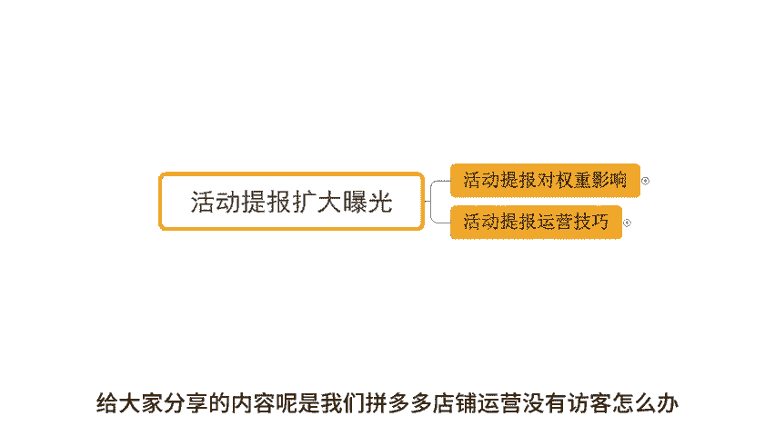

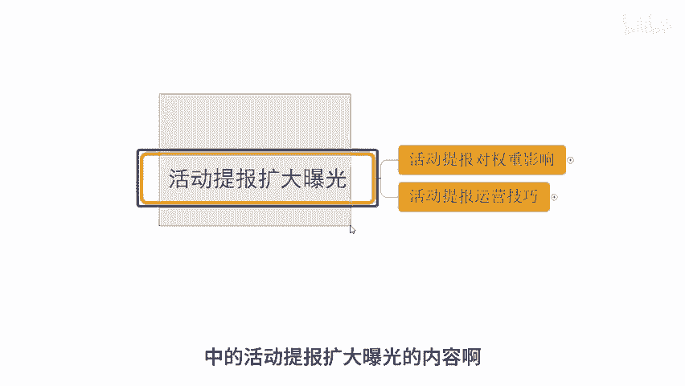

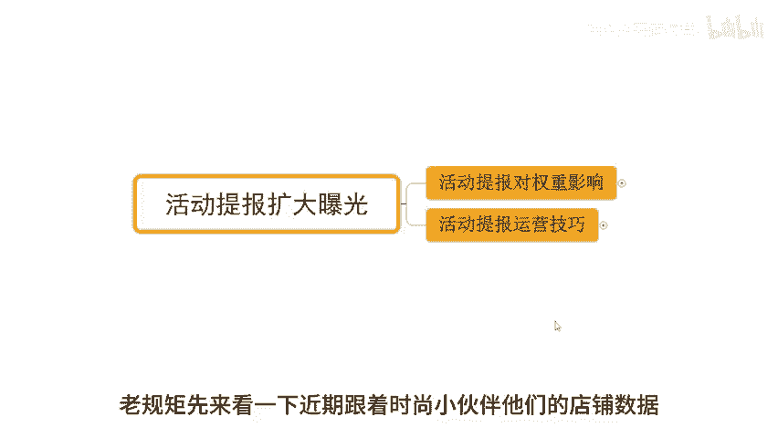

可以看到像这个店铺呢，原本是一个没有访客的一个新店啊，从最早你朋友开始跟他实操的。那么这个店铺呢啊首先呢我们就完成了我们的这个市场分析，完成了我们的竞争分析。那么做好这些分析之后呢。

来确定好我们的后期运营的方向啊，确认了我们的爆款啊。那么确认好之后呢，完成货员对接，就开始上架商品之后来进行新品操作。那么经过一段时间的新品操作之后啊，产品的权重得以累积。那么后续呢访客就开始增长。

可以看到啊，那么整体访客呢。上升的趋势是非常良好的啊。从最早的临访客呢，到后面呢一天。做到了1200的访客，一天的订单呢是1900多单，转化率呢做到了15。68%啊，非常不错。

当然呢除了这种新店啊跟着实效可以有到一个非常快速提升之外，那么一些有基础的有数据的店铺跟着实同样的是可以得到一个很好提升的，可以看像这个店铺。那原本呢他的访客在这个3000左右啊，那跟着实操之后呢。

我们通过产品的结构调整，通过SQ优化，通过我们活动策划的一些优化啊，那么也完成了我们权重的增长啊，那么访客也在不断的提升。到后期的话一天的访客呢从原本的3000左右啊，做到了1000的访客。

那么一天的订单呢是2100多单。转化率呢做到了16。17啊，也都非常不错的。当然还像这个店铺可以看到啊，那原本呢只有几百个访客对吧？那跟着实之后呢也是啊通过优化调整之后呢，访客在不断的增长啊。

而且上升趋势可以说是非常。

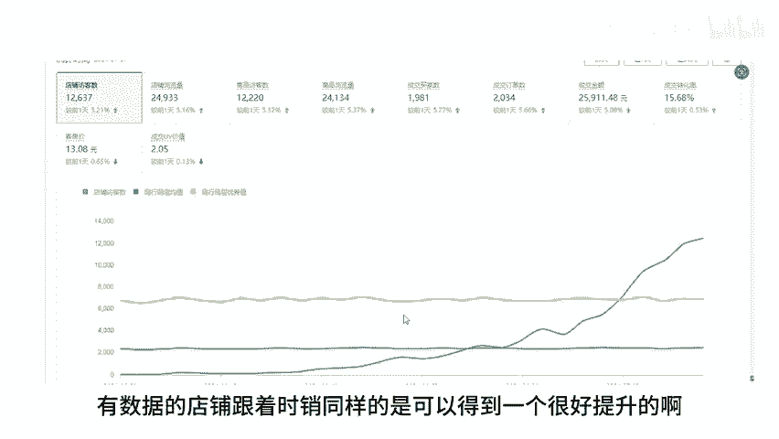

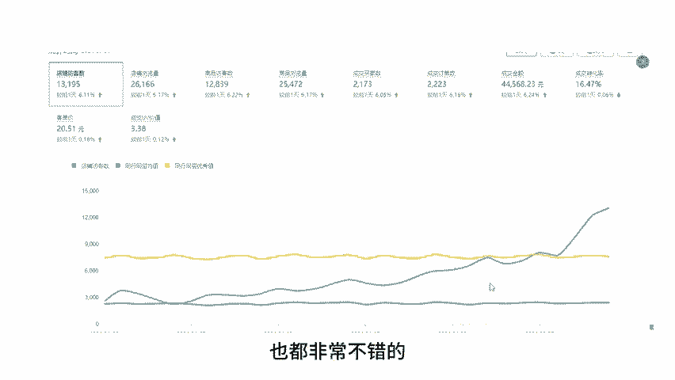

呃，不错的啊。那么到后期的话，一天访客呢也做到了1000啊，一天的订单呢是1300多单，转化率呢11。88%啊。当然这个店铺呢数据量没有之前店不大啊，因为他的客单价比较高，100多个客人价的啊。

OK的啊，那么这一店铺啊，它也都是通过啊自然流的方式操作的。这里这一点大家注意一下，如果说你自己真的是想要去通过自流打到店铺，你想通过自然流来做爆款的话，OK建议呢可以多观看啊，我分享的视频好吧。

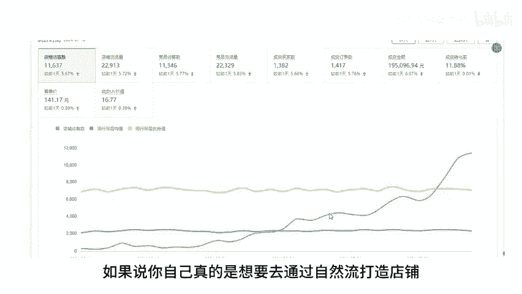

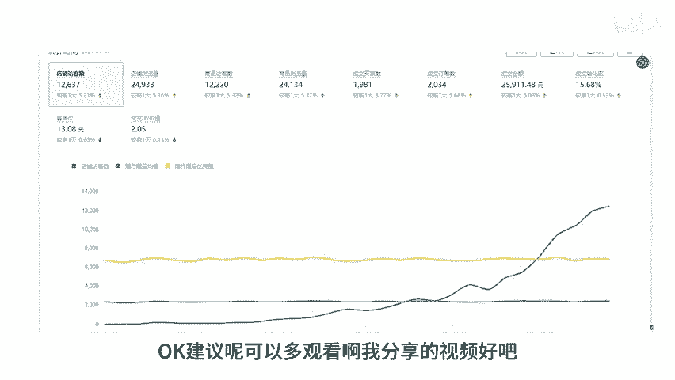

那么店铺操作呢，对于我们很多的新的小伙伴来说呢，会有到很多的困难啊，这个很正常。因为本身是一个陌生的领域嘛，对不对？所以说如果说你在这个店铺操的过程中有遇到什么问题啊，或者需要资料的呀，可以找我啊。

当然呢有时间的话，我也可以带着你一起去实操坐店啊，就像这些小伙伴一样呢，我们一起能够去有到一个更好的方法，能够去把我们店铺呢做的更好好吧，当然呢跟我实操这个是需要付费的啊。

O那么活动提报扩大曝光到底对我们产品解决访客问题有什么样的帮助，那首先我们搞清楚活动提报对群众的影响是什么？好吧，来可以看到。那么首先第一个点呢，活动提报呢他可以帮助我们曝光渠道啊得以增加啊。

那么不管我们是报名什么活动啊，我们只要报名活动之后，我们的曝光渠道都会增加啊。比如说像我们的领券中心对吧？像我们的这个啊9。9块特卖啊，像我们的这个秒杀等等，各种各样的活动，它其实都有。

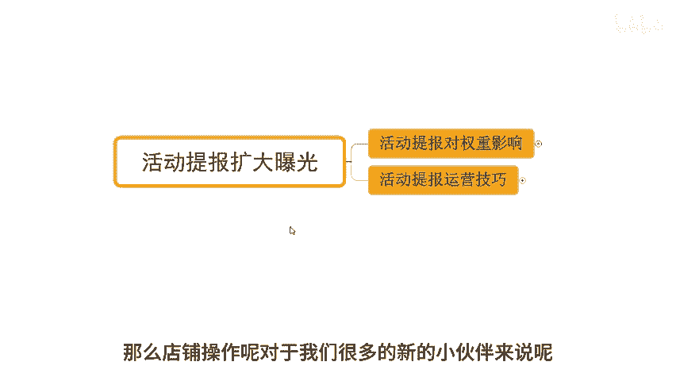

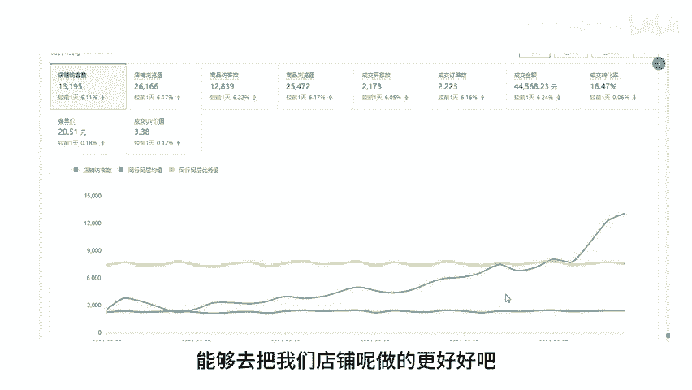

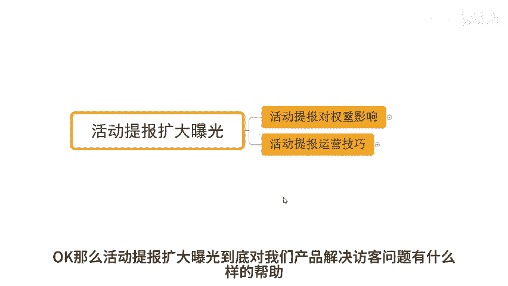

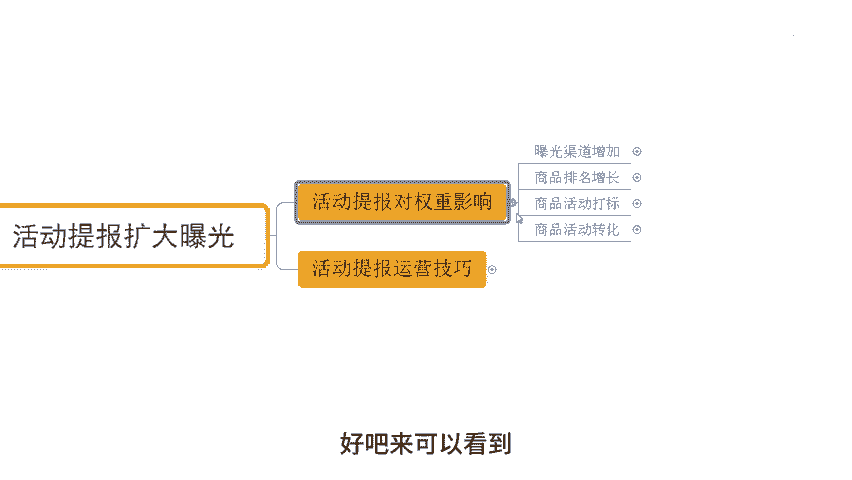

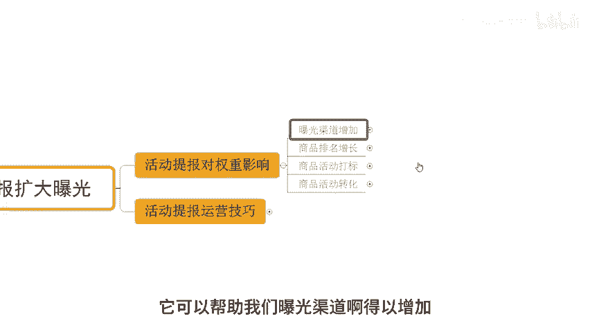

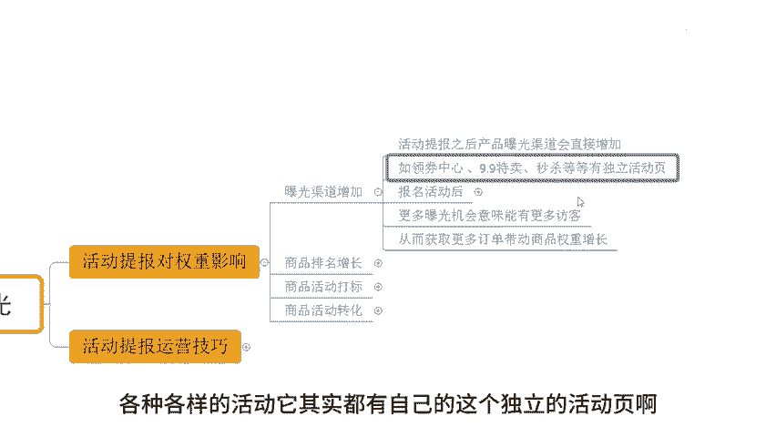

自己的这个独立的活动页啊。那么报名活动之后呢，OK我们的产品就可以在对应的活动页获得展示机会。

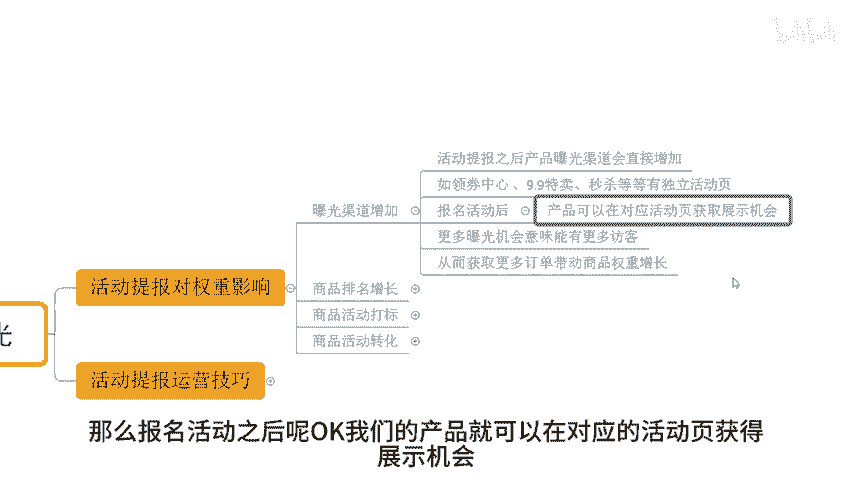

那么这个时候呢，你相对于之前的产品来说，你就可以得到更多的曝光渠道。进行我们产品展示。那么这个时候呢，也意味着呢我们能够去拿到更多的访客啊，从而呢带动我们店铺订单的增长来提升我们商品的权重啊。

是这个样子的哈。

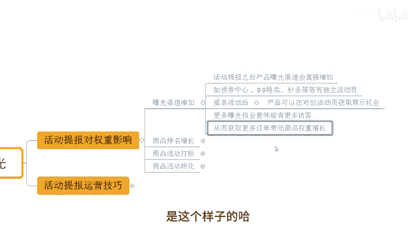

那除此之外呢，还有就是我们商品牌面的增长啊。

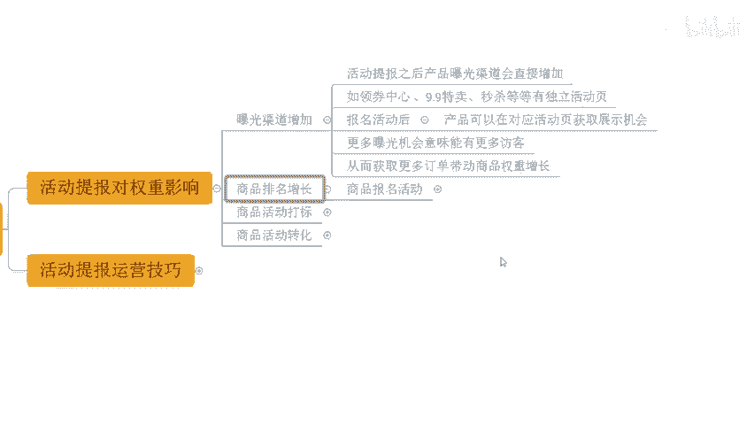

那么商品报名活动之后呢，OK的平台呢也会给予到我们商品呢进行对应的活动权重的一个加权啊。那么这个加权呢是针对到搜索端口的。那么搜索推荐呢，它是直接针对到我们关键词的啊。那么关键词的排名增长呢。

就意味着我们能够在对应关键词里面拿到更多的曝光，拿到更多的访客，从而呢带动我们店铺呢得到更好的权重的一个增加啊。那么呃这里呢可能这样的一个理解，大家可能还不是很好明白啊，那么我们没有关系啊。

我们来举个例子，打个比方，一开始呢我可能是呃有到10个曝光词。那么另外还有很多词呢，其实我也是有一定权重的，只不过权重相对比较低，它没有太多的曝光或者是没有曝光。那么这种情况之下呢。

O我在报名活动之后可能有更多的关键词除了我原本曝10个曝光词之外的更多关键词。因为我做了活动，得到了平台的搜索推荐。所以呢我所有的关键词都会得到一个搜索推荐的加权。而那么会有到更多的关键词。

因为这个加权呢，它的排名更靠前，从而呢我这些关键词可以得到一定曝光。那么带动我们店铺访客的增长啊，这是一方面，另外一方面呢，原本我有曝光的这些关键词呢，因为这一个搜索推荐呢也可以拿到更好的展示排名。

从而呢得到更好的产品的展示，拿到更多的曝光，拿到更多的点击，拿到更多的访客啊，带来更好的商品数据增加我们的商品权重是这样的啊O那另外还有一点就是我们活动。

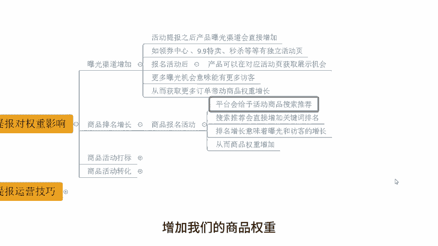

商品的一个达标啊。

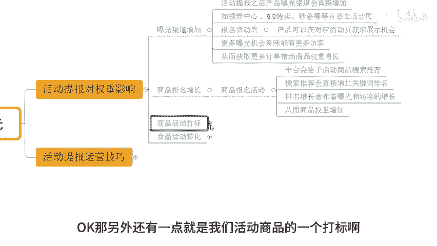

报名活动之后呢，我们产品呢是会呃进行一个打标签的啊，那么这个标签是活动标签啊。那在我们商品的标题前面都会展示出我们对应的活动标签。比如说我们的五一大促啊，618大促啊，对吧？

双十一大促啊年终大促啊等等啊，各种乱七八糟的一个活动啊，那么这些活动标签在我们商品的名称啊，也就是我们标题前面进行展示的时候呢，是可以来帮助我们更好的吸引我们买家注意力的啊。

同时呢这些活动信息呢也能够增加我们用户的信度啊，从而呢增加我们商品的转化，带动我们商品的点击得到更好的群众啊。

所以说活动打标呢对我们店铺来讲也是有到非常大的意义的啊那么另外一点是活动转化了这个东西呢是最直接的因为拼多多的用户呢他对于价格呢是非常非常敏感的啊，所以说报完活动之后，那我们的商品价格呢会降低。

那只要我们商品价格呢确保是有一定的优惠力度的话，那么这个时候呢。

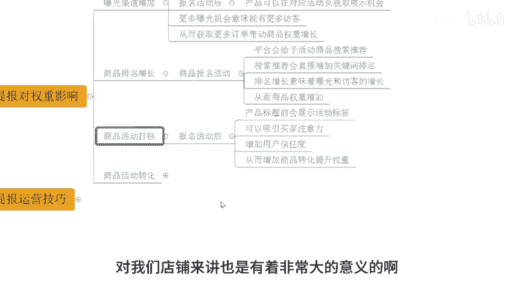

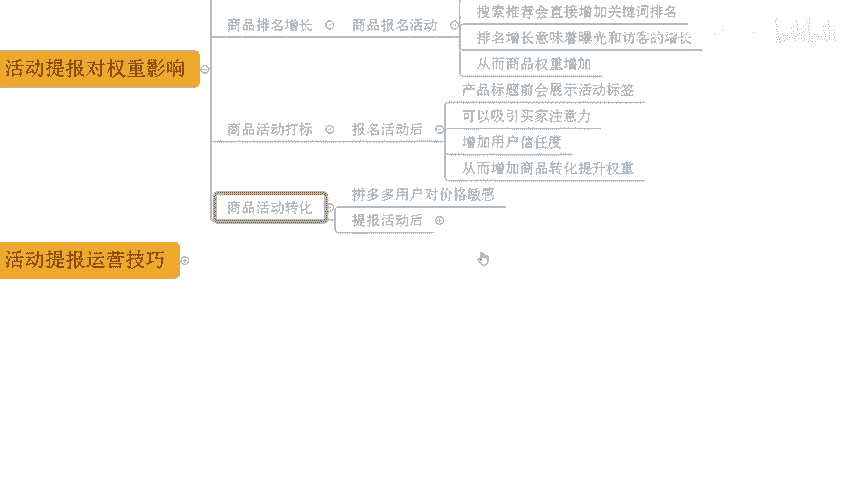

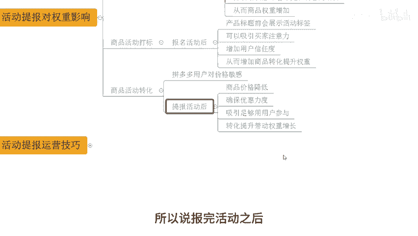

可以吸引到足够的用户来参与活动的转化率呢会大大增加，从而带动我们上品群众的增长。好吧，所以说报名活动对我们产品群众有没有影响，有而且非常多影响啊，甚至说是一个非常非常重要的点哈。那么对于我们店铺来讲。

如果说我没有访客，我应该通过什么样的方式来达成我们店铺访客的增长。我应该通过什么样的方式来提报活动啊提升我店铺群众呢？O我们来看一下啊，活动提报的一个技巧。好吧。OK首先呢我们来说说提报的策略啊。

提报策略的话，这里首先第一点啊，我们在商品发布之后啊，价格呢要设置高价。

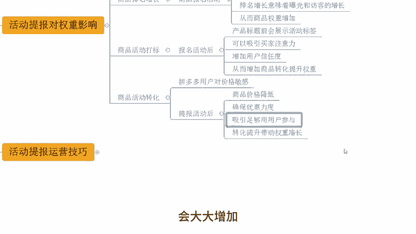

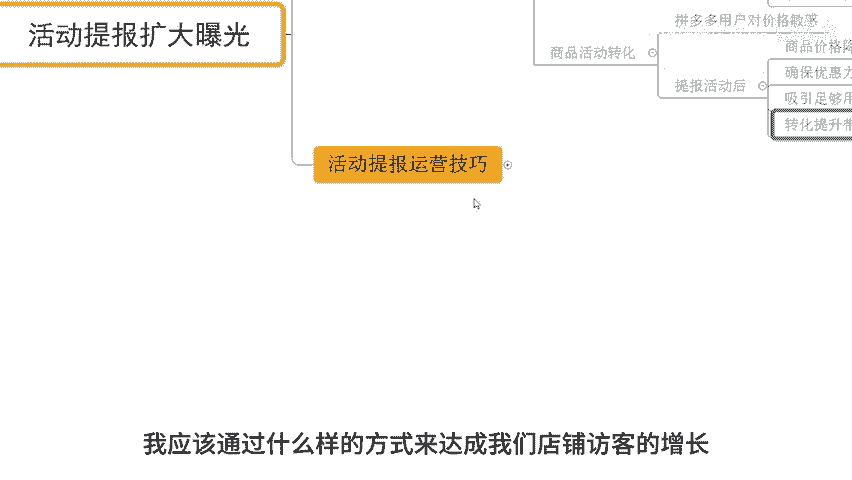

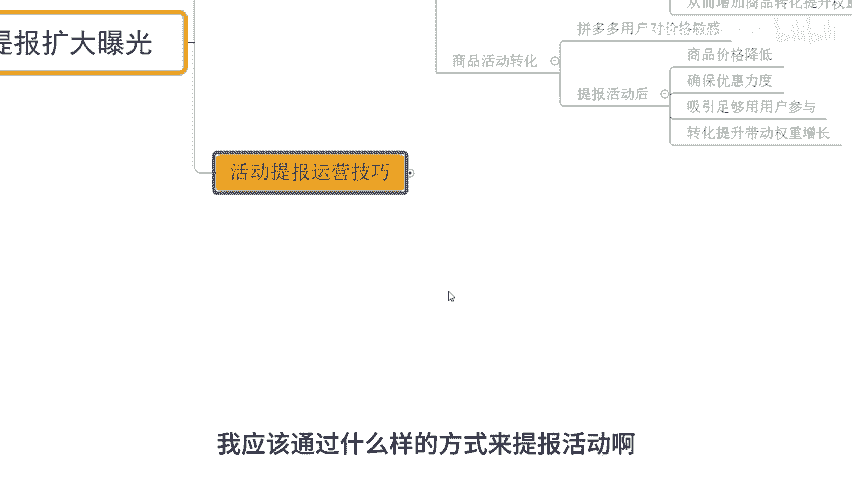

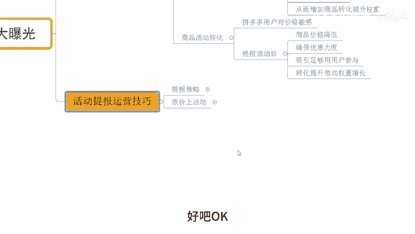

嗯。或者是我们在商品发布时吧，这个地方应该是这样子啊，方商品发布时可能会更加准确一点啊。商品发布时啊，那么这个商品发布时呢，就是我们一开始在进行产品发布的时候啊，我的价格要设置的高价啊。

那设置高价之后呢，我们来设置优惠券啊，然后再去提报折扣活动。

举个例子，什么意思呢？哎，我们在进行这个活动这个提报的时候呢。

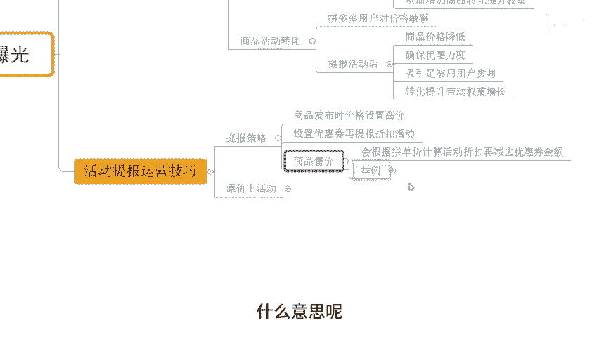

首先啊我们的拼单价呢就按照我们活动价的折扣啊，再去减去啊优惠券的金额的方式来来操作啊。来，比如说我的呃上面的拼单价对吧？是100块，或者说我先把活动价放上面吧啊。

我的活动价呢哎假如说是一是这个活动折扣是5折啊，那我活动的价格呢，我希望它是50块。

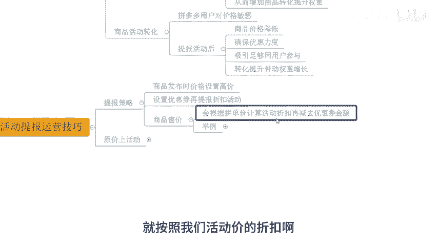

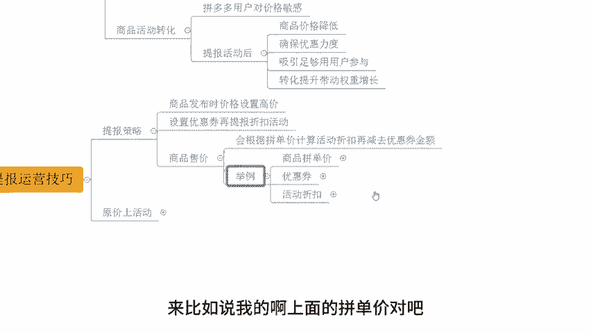

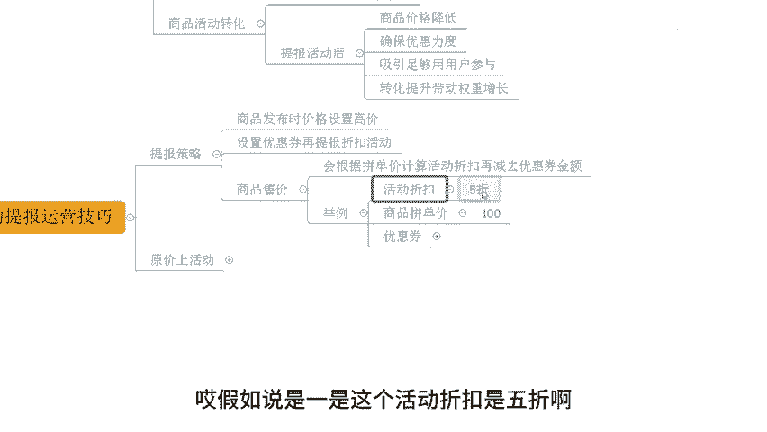

啊，我活动的价格呢，我希望它是50块，对吧？那么这个时候呢，我的商品的拼单价就是100块，对吧？但是如果说我再要去设置到一个优惠券，是40块钱啊。假如说我需要去设置一个优惠券是40块钱啊，注意了。

那么这个地方呢，我们的商品的这个价格啊，就会从原本的呃50变成10啊，变成10。那么或者是我这里如果说我的活动价最终我需要卖的价格就是50块钱的话，那么这个地方呢，我一开始设置的这个拼单价呢。

就应该是呃50加上40再乘以2，也就是啊180。

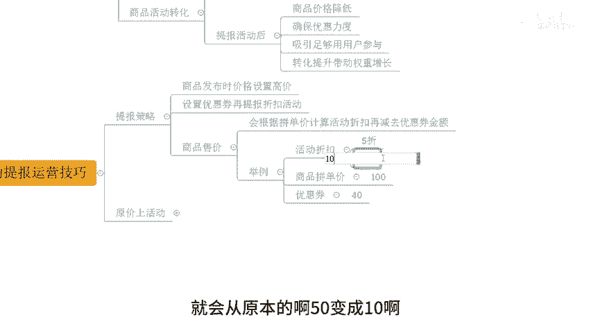

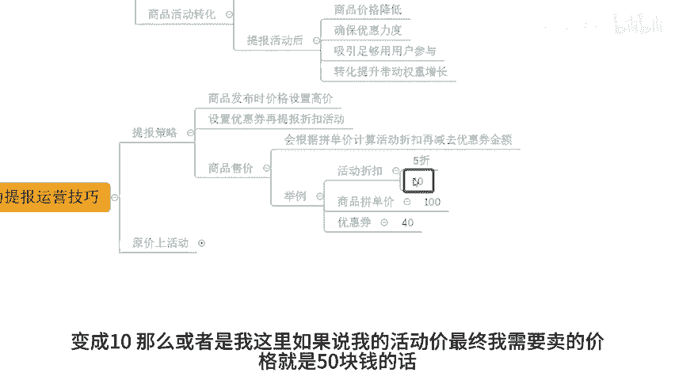

那么为什么要这样去做？这里我跟大家说一下，因为如果说我们直接去设置一个活动价格的话，那么后面呢我们肯定还会面临着优惠券的一个问题，对吧？所以说我们要把优惠券的金额呢预留出来。

那如果说优惠券的金额比较小其实意义并不大。优惠券的金额呢要大于5块，甚至说大于20啊，在某一些价格来讲，就比如说我们这个几10块产品来讲啊，大于20。

那么它对于我们产品转化和我们这个人群的触达来说是非常大意义的，非常大帮助的。所以说我们会需要去做这样的一个金额。但是如果一旦啊这个金额跟我实际的售价或者是跟我这个发布的拼单价啊，占比超过50%的话。

那么这个时候是无法发布的。比如说我一开始设置的这个呃。

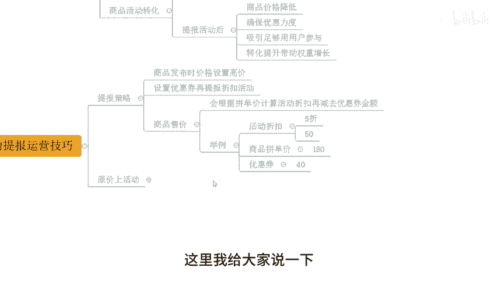

最终的这个售价啊，假如说是10块钱的话啊，那么我们一开始设置的这个。

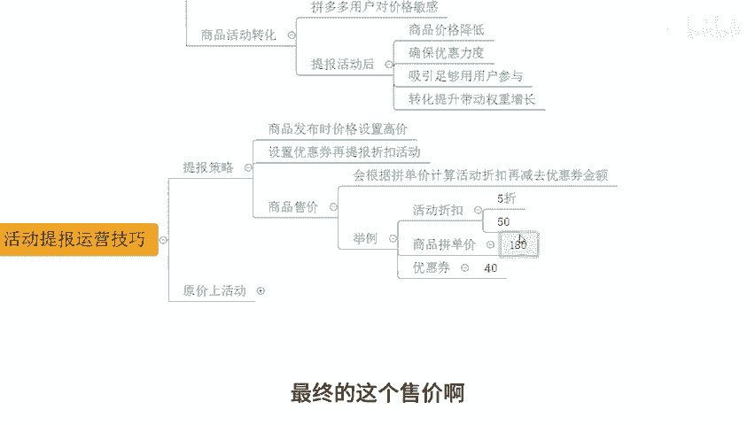

呃，这个活动价啊这个这个拼单价啊这个拼单价啊。假如说是100块对吧？啊，假如说是50块啊，假如是50块啊，我是没有办法去进行一个很好的这个优惠券的发布的。因为优惠券的优惠券的一个金额太大了啊。

50和事实呢，它的差额太大了啊啊这个这个差差额太小了，差额太太太小了，折扣的一个比例太小太太大太大了啊。那所以这个时候呢，我的事实的优惠券是无法发布的啊。所以说我就需要去让我的这个呃。😊。

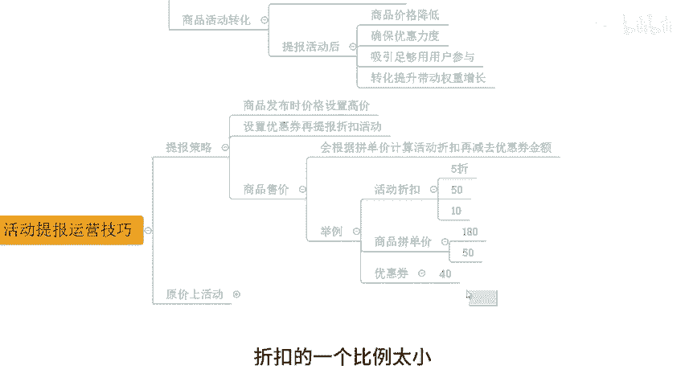

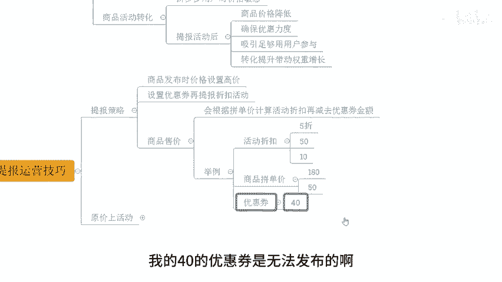

拼单价啊变得比较大一点啊，所以说这个时候呢，可能我的拼单价就是100块啊100块。那么100块的时候呢，它的差值呢是在50%以内啊50%以内啊。所以说这个时候呢。

他是可以这样发布40块的券的那发布40块券的话，OK我们打完5折之后呢，产品价格是50。那么再减去优惠券的金额呢，就可以得到一个10块的一个最终销售价格啊。所以这样子呢对于优惠券的一个力度。

对于我们展示的一个方向来讲，它是有更好的一个帮助的。当然这个只是给他家举个例子，具体金额你们可以自己去自己去这个参考自己的产品啊。O那么可能像我们说确实啊，那你这样说我能够理解。

但是呢我在报名活动的时候会有到一个问题啊。

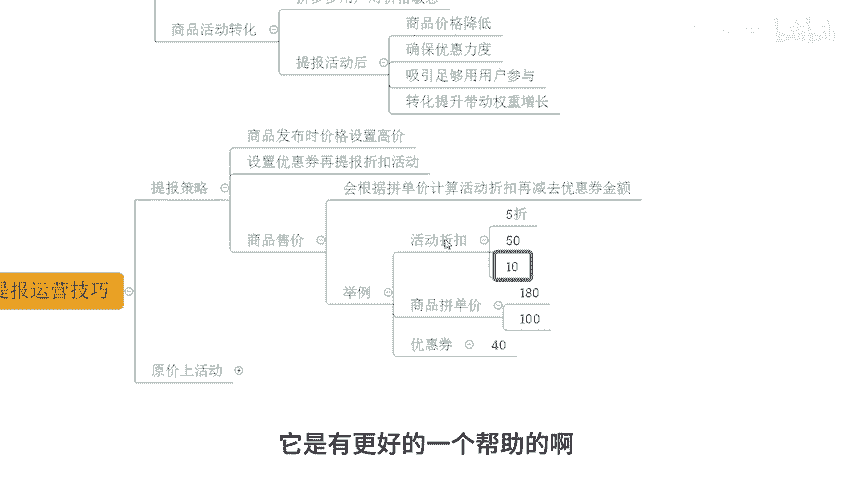

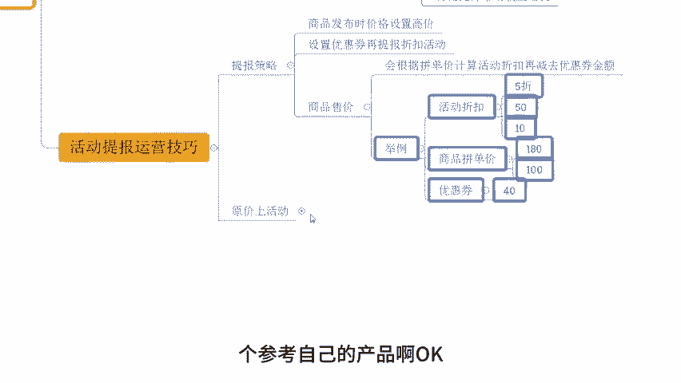

不是我想去设置几折就几折呀，对吧？平台可能会压我价格呀，甚至我的价格呢会很低，对不对啊，就是我们平时遇到的问题。

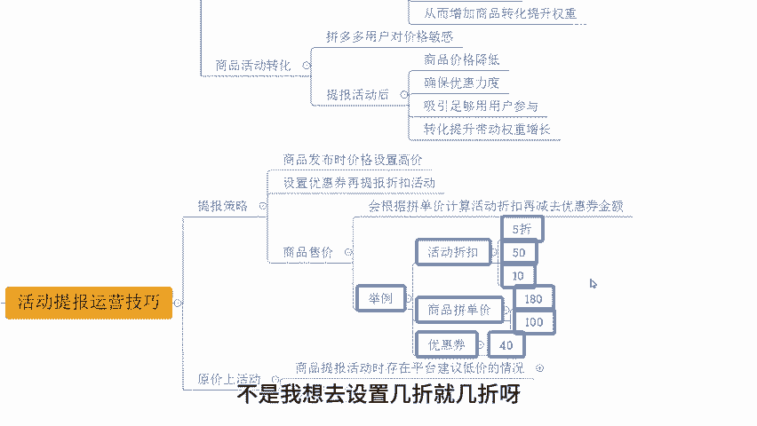

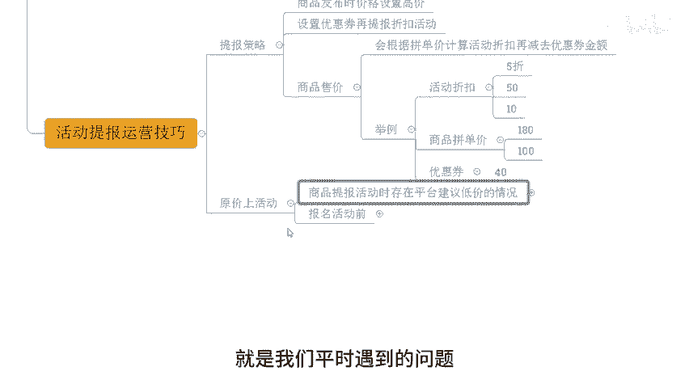

报名活动的时候呢，平台建议价特别特别低啊，高了之后你就报不上去啊，这种情况呢其实很麻烦，对吧？那如果说你啊遇到这种情况的话，你去报。😊。

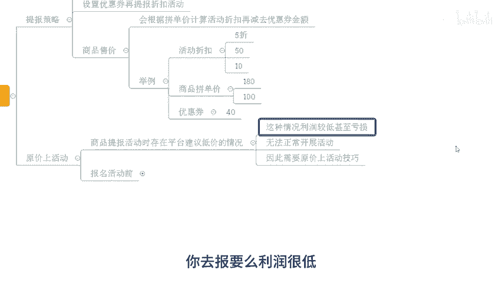

要么定润很低，要么就会亏损啊，你是没有办法正常去看这个活动的。因此呢我们就需要去设置一个东西，叫做原价上活动的绩效啊。那么在报名活动之前呢，我们先不要去啊进入活动的这个提报页界面啊，我们先去干嘛呢？

针对到我们的商品SQ进行调整。注意啊原本的SQ呢，你不要去删除，不要去修改。因为你删除修改的话会上我们这个产品的权重受到影响。产品的权重呢是根据我们SQ来进行计算的。

而我们的所有的数据呢是以最终的SQ的一个数据情况来进行记录啊。那么你原本的这个SQ只要修改，只要去删除。那么平台就会判定你可能是有偷换商品或者是其他些因素影响，导致可能会刷新我们的这个SQ的权重。

那原本的这些历史的数据呢就会损失掉啊。所以这个时候呢我们可以新增SQ而新增SQ呢，我们就可以通过我们希望设置的一个最终的价格活动价格啊来反推我们的这个平单价。

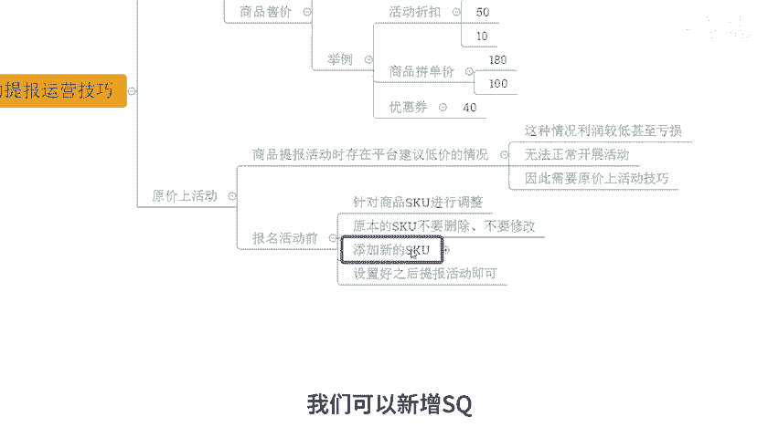

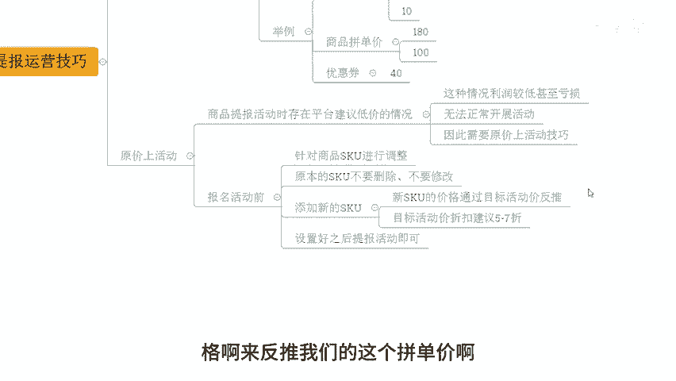

啊，就以我们刚刚举的这个例子来说，对不对？我希望我最终的价格是10块钱。我想要设置1个40块的券，那我们最终的一个拼单价呢就要100块钱，对吧？我想要去卖50块钱啊，那我要去设置1个40块的券。

那我最终的拼单价呢就是180块钱。那我们需要去反推，那一般建议呢活动价格呢折扣设置在5到7折。反正以这个价格去设置就可以了啊。那么这样呢设置之后呢，活动通过率是比较高的啊。

那么对我们后期呢达到平台的推荐拿到帮助呢也是比较大的。OK啊，那么以上呢就是我们关于活动提报，扩大曝光的一个分享啊。当然呢可能很多小伙伴不是很理解。

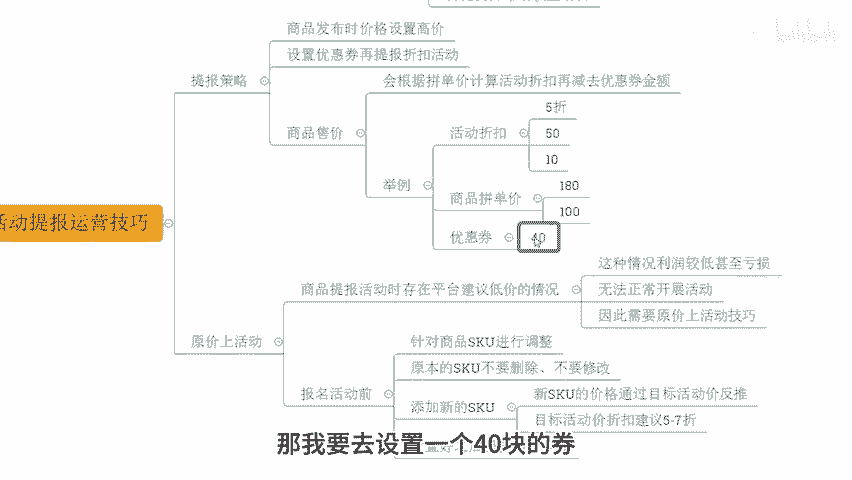

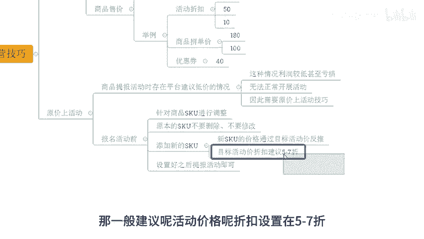

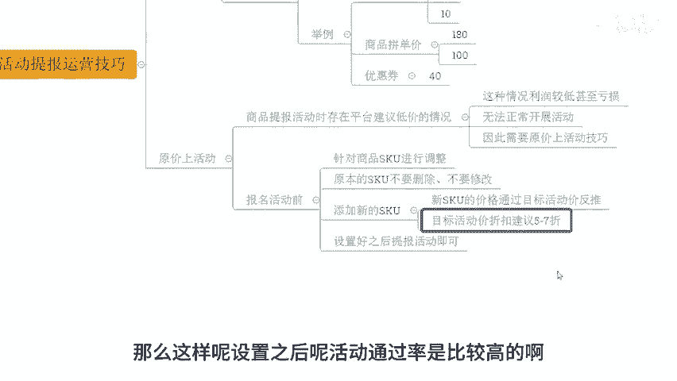

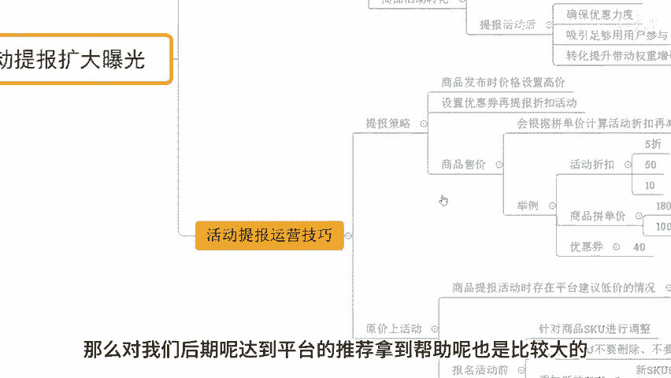

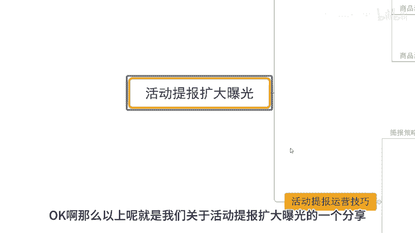

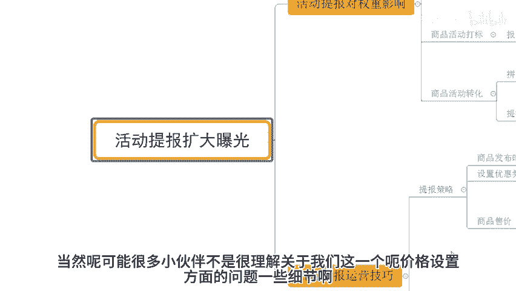

关于我们这一个呃价格设置方面的问题，一些细节啊。那如果说没有听明白，没听懂的话啊，也欢迎大跟我交流沟通。好吧。嗯，还是那句话，如果说店铺操作有问题，有需要的资料的可以找我啊。如果说是这个有需要跟实操的。

也可以找我。当然还是那句话，实操是需要付费的啊，就像这些小伙伴一样，那么我们可以一起呢有了一个更好的方法。让我们店铺呢做到更高的一个水平。好吧。OK今天的分享呢到这里结束，我们下次见，各位拜拜。😊。

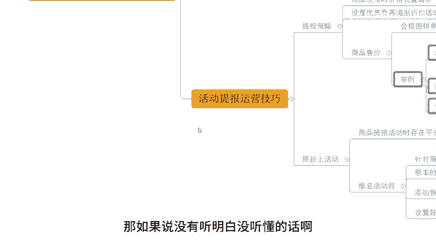

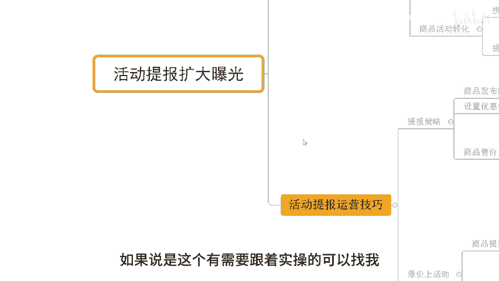

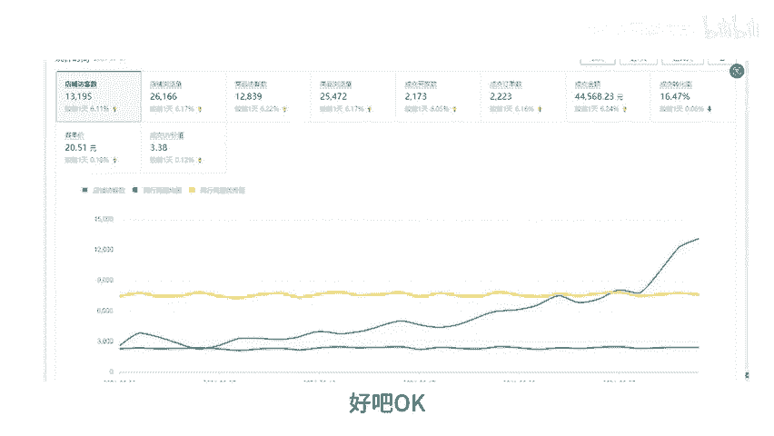