# 拼多多开店运营-新手电商运营实战指南，B站最全拼多多零基础入门教程！拼多多运营秘籍，小白也能成电商大亨！轻松上手拼多多，拼多多新手开店赚钱攻略 - P44：044 店铺直播推荐加权 - 拼多多开店运营- - BV1xms8eSEVs

hello，大家好，我是西楼。今天给大家分享的内容呢是我们拼多多店铺运因没有访客，怎么办中的店铺直播推荐加权内容啊。在分享之前呢，老规矩先给来看一下近期跟着石他小伙伴他们的店铺数据，好吧。

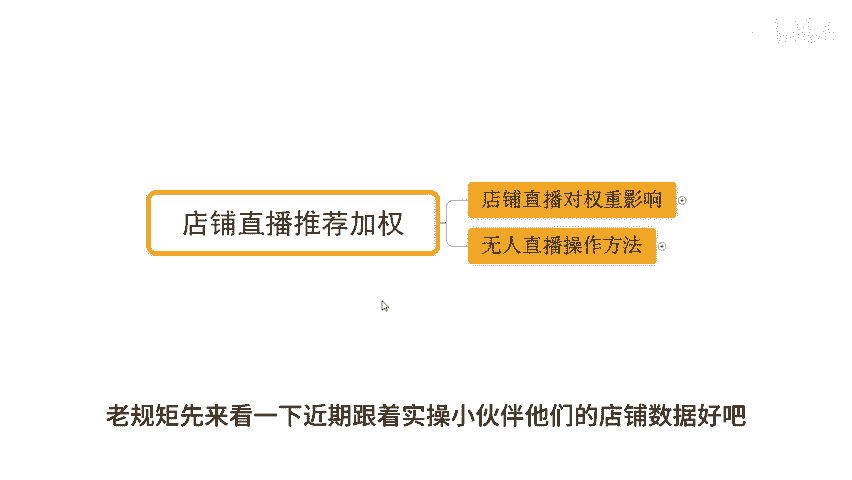

可以看到，像这个店铺呢，原本访客呢只有几百个啊。那么跟到实效之后呢，通过产品结构以及SQ调整的优化啊，那么访客也在不断的增长。到后期的话，一天访客呢从原本的几百个啊做到了一天10一0。

那么一天订单呢是1300多单，转化率呢11。88%啊。还有像这个店铺可以看到啊，原本的访客在3000左右啊，那么跟着实操之后呢，访客也在不断的增长啊。到后期的话一天访客呢做到了13000啊。

一天的订单呢是2100多单，转化率呢做到了这个16。47%啊，还有像这个店铺可以看到啊，原本访客呢在5000左右啊，那么跟着实操之后呢，整体访客也在不断的增长啊。那后面的话一天访客呢做到了24000啊。

一天的订单是3200多单啊，转化率呢13。06%啊。当然了，除了像这种呢有基础有数据的店铺之外啊，那么一些零访客的新店啊，也是可以跟着实操达到一个的效果的，可以看到像这个店铺啊。

原本呢是一个零访客的新店啊。那么跟着实操之后呢，从原本的零访客啊，那开始不断的提升到后期的话，一天访客呢做到了12000啊，一天订单呢是1900多单，转化率呢15。68%啊。那当然了。

这些店铺也都是通过这个自然流的方式来操作的啊。如果说你想要知道如何通过自然流来打造店铺，如果通过自然流来做爆款的话，OK建议可以仔细观看我的视频，好吧。

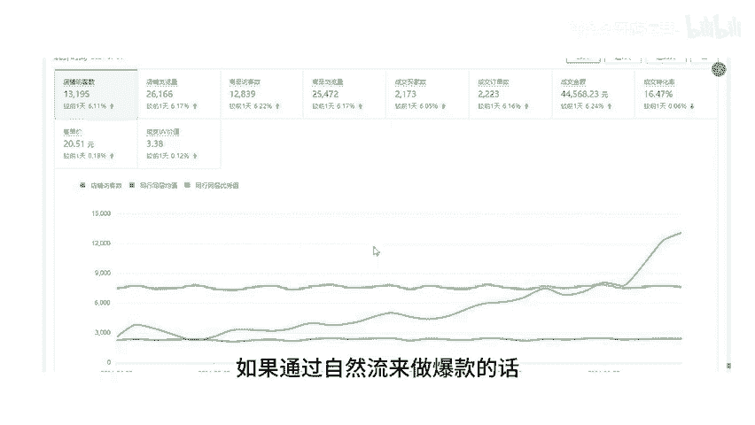

那店铺运营呢对于我们很多些小伙伴来说呢，会有到很多很多的困难啊，这很正常。因为毕竟是一个陌生领域嘛，对吧？那如果说你对于店铺操作有遇到什么问题呀，有需要资料的呀，O可以找我啊。当呢有时间的话。

我可以带着你一起去时操做店啊，像这小伙伴一样呢，我们能够有到一个更好的方法，让我们店铺呢达到更高水平。当然呢跟着我时操做店呢这是需要收费的啊。那么不过有点可以放心啊，我这边不是培训教学各有菜的啊。

大家可以放心不用担心啊那么既然说这个店铺直播推荐有加权呢，到底店铺直播对我们众有什么影响呢？我们首先看一下啊那在我们店铺运营来讲的话，O我去做这个直播，他首先呢是可以去帮我店铺呢曝光渠道进行增加了。

这是一个非常非常重要点吧？因为店铺直播呢本身就可以拥有一个直播渠道的一个流量入口啊那么他是可以得到一个更好的产品展示的一个渠道的啊，从而呢能够。

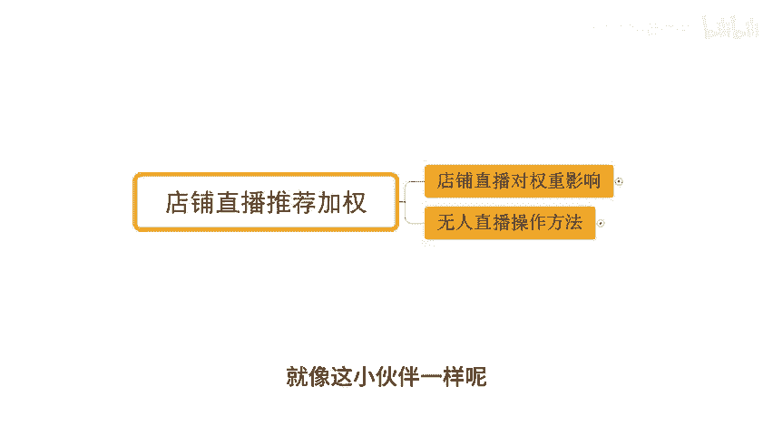

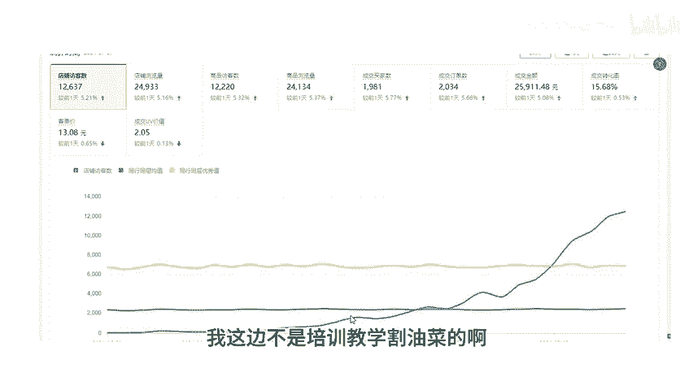

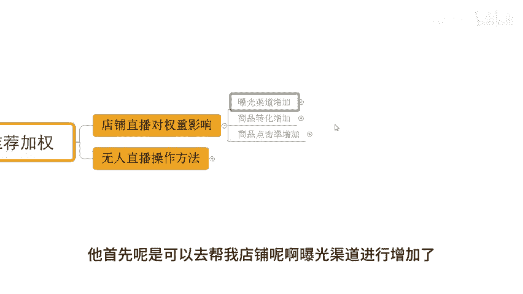

帮我们上面呢拿到更好的产品曝光，得到更好的这个呃转化甲醛哈。当然呢，除了这地方之外呢，还有一点就是什么呢？就是呃我们有这个相似款或者同款的商品在进行直播的时候的，他有的时候会进行推荐啊。

推荐会直接推荐到我们同款跟相似款的这个商品详情页啊。那么有人可能会点击我们的这个呃直播入口就会进入到我们的店铺来啊。所以这个时候呢，你去做了这个事情之后呢。

你的曝光实际上是可以得到更好的一个这个扶持的啊。那么另外一点就是对于我们商品的转化呢，是可以进行增加的，对吧？那直播的一个商品呢，对我们商品来讲，它的展示哈会更加的直观。

那用户呢也可以更好的了解我们的商品啊，所以说呢通过我们的主播进行讲解的话，那么可以更好的去展示出我们产品的卖点。

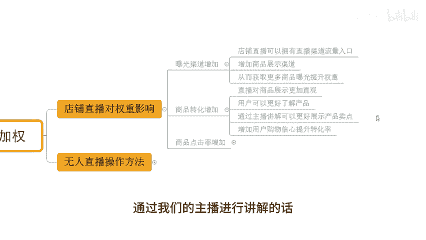

那么对于我们消费者来说呢，他也会更加有信心啊，所以呢转化率也可以得到大大提升。当这些数据增长之后，对吧？我的曝光渠道增长了，我的转化增长了，那我们商品的整体的销量数据呢也都可以得到很好的提升。

那你说我们的权重它不增长吗？对吧？那不增长不可能这增长是必然的，对不对？那另外一点就是可以帮我们商品呢达到一个点击率的一个增加啊，什么意思呢？店铺开启直播之后对吧？

不管是我们的商品呢还是我们店铺的露出界面呢，都会有到这个直播中的一个啊动态图标的一个一个东西啊，那么这个呢是可以帮助我们更好的去获续点击的啊，因为我们这样的一个图标会展示呢会更加吸引人吧，对吧？

让我们用户呢可以更好的看到我们产品。那么这个时候呢点击率提升之呢，我们商品呢在点击版块来讲的话，它的权重也会更高那得到了后续的一个平台推荐的也会更好。当然呢说到这个地方可能很多小伙伴都已经清楚了。

那直播确实呢对我们来说呢是有了很多帮助的。但是是不是说我现在作为一个新店，我就马上需要直播呢其实并不是啊。

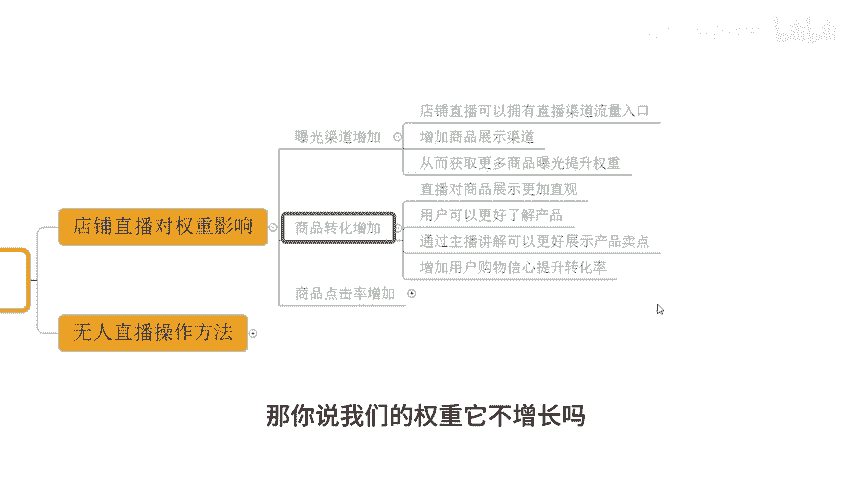

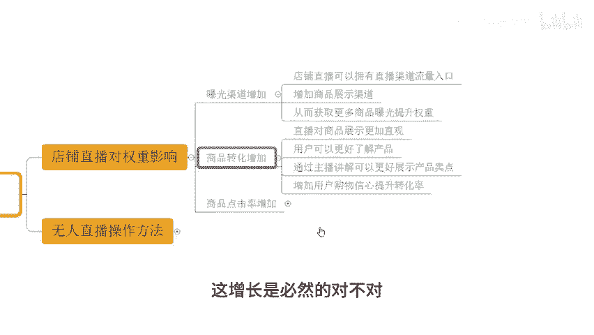

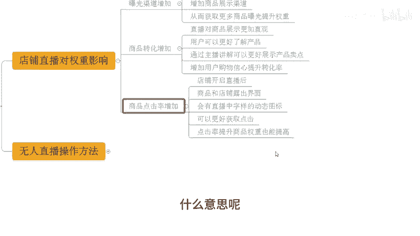

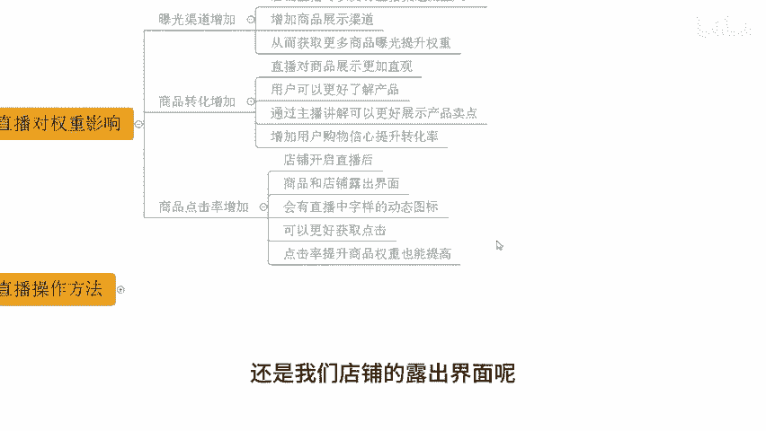

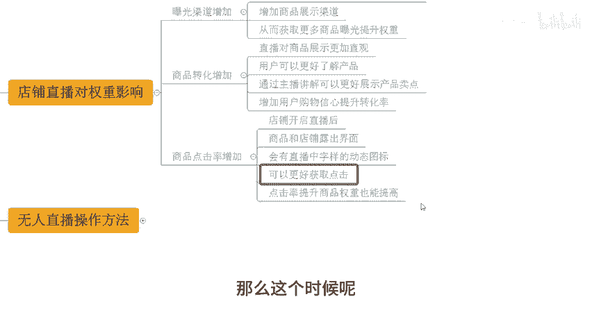

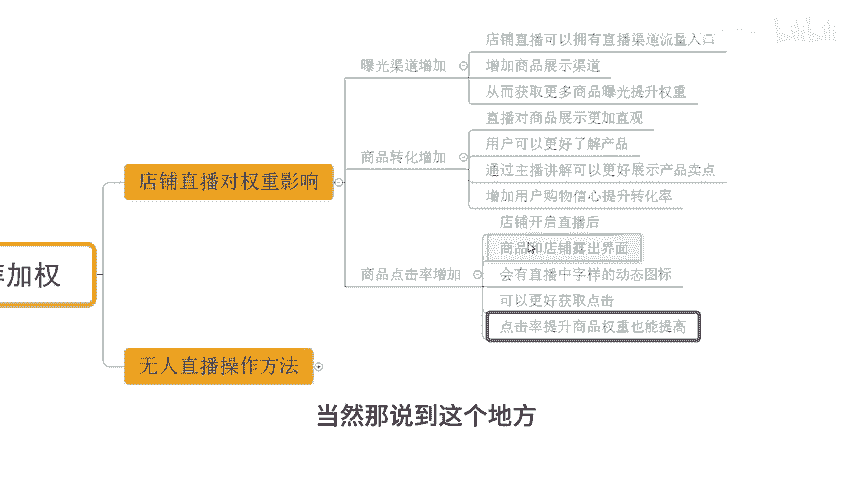

那直播呢虽然说是呃跟我们商品的这个权重啊没有特别大的直接关系啊，但是它对于我们产品的一个啊要求还是要有的啊，那一般情况呢我们讲我们产品呢要有到一定的这个人群覆盖范围。

包括说我的店铺呢会有到一个比较良好的DR评分啊，那么后续我才去做直播呢，它的一个直播端口的推荐报告会更好。如果说你做了直播，对吧？直播里面一直没有数据没有产出，那么一样的啊。

那么你可能也很难去拿到一个很好推荐啊，所以这个点大家注意一下，当然呢我们有很多方法可以帮我们完成这个所谓的直播推荐的一个操作啊，但这里呢就今天就先不讲这个这么多对吧？

那么呃这里呢重点说明一个东西叫做无人直播，对吧？这样的一个方法啊。因为我们很多人如果说你去做直播的话，你的投资成本其实比较高啊，这个东西不太适合我们绝大部分人啊，如果说你去找真人主播。

那么你的成本会很高，你自己去播的话，也会浪费你自己比较多的时间。

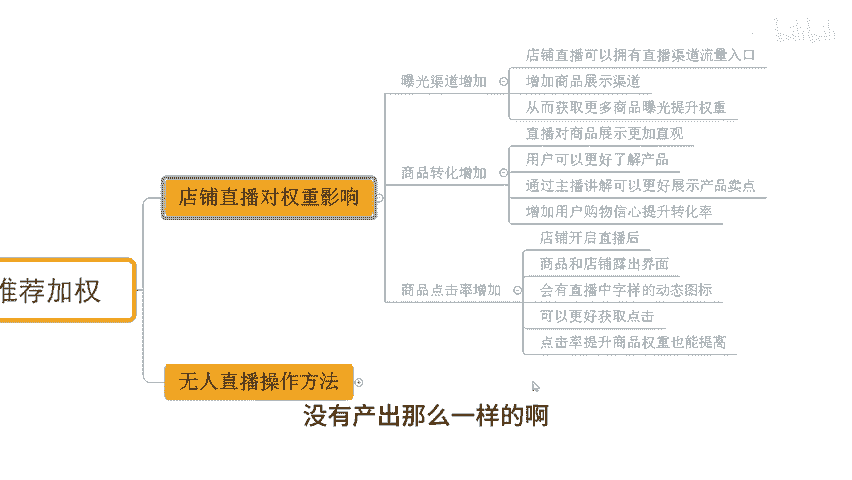

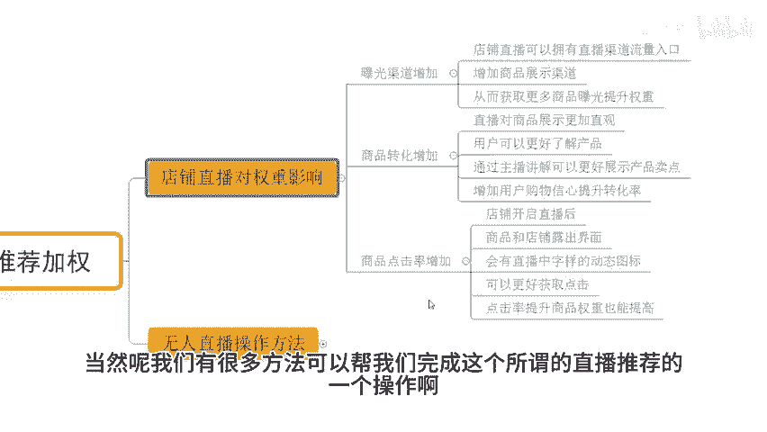

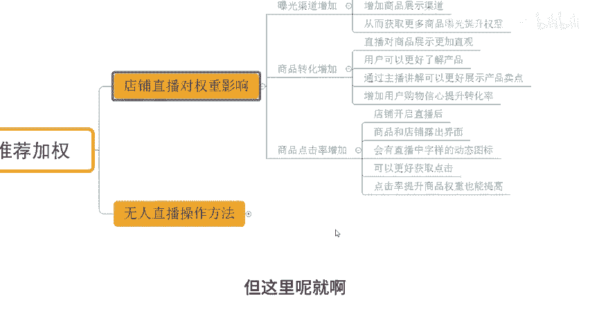

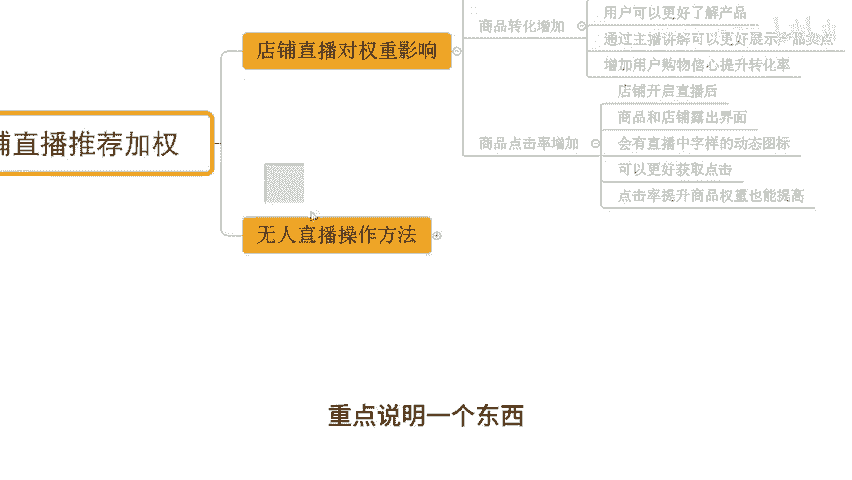

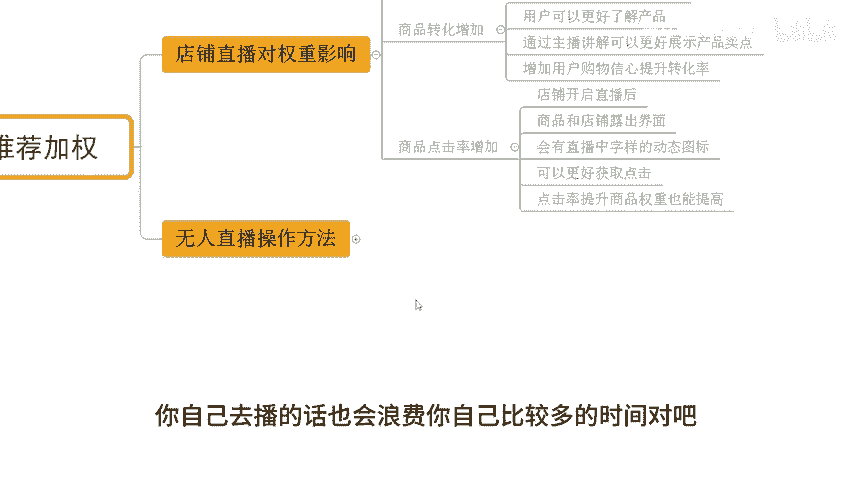

对吧那么无人直播呢是可以帮我们解决这个问题的那我们作为重点来说一说无人直播的一个方法。

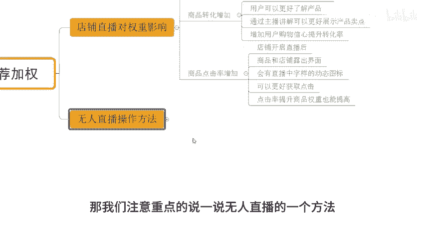

那么无人直播其实呢它没有什么特别玄乎的东西啊，其实道理很简单，就是说我们通过直播渠道进行啊这个直播的一个设置啊。那么但是呢在直播设置里面呢可以去循环的去播放，我们希望展示的一个直播内容啊。

把这个直播内容呢通过视频的方式录制出来之后，在这个直播间里面进行循环播放就可以了啊，就这么简单啊，它的逻辑就这么简单啊，那所以呢它的一个操作呢其实分为两个部分啊，重点来讲，一个部分呢是视频的制作。

另外一个部分就是直播设置啊。那首先我们说说视频制作的部分。视频制作部分呢是我们需要在无人直播开始之前提前去准备的啊，那么我们可以针对到我们的产品进行讲解啊。

那这个讲解呢是需要我们重点去策划的讲解内容呢需要是以我们用户的痛点来展开。那么以用户的痛点和这个需求来进行一个说明的话，可以更好的引起我们买家的共鸣啊，那么内容呢每一个点。

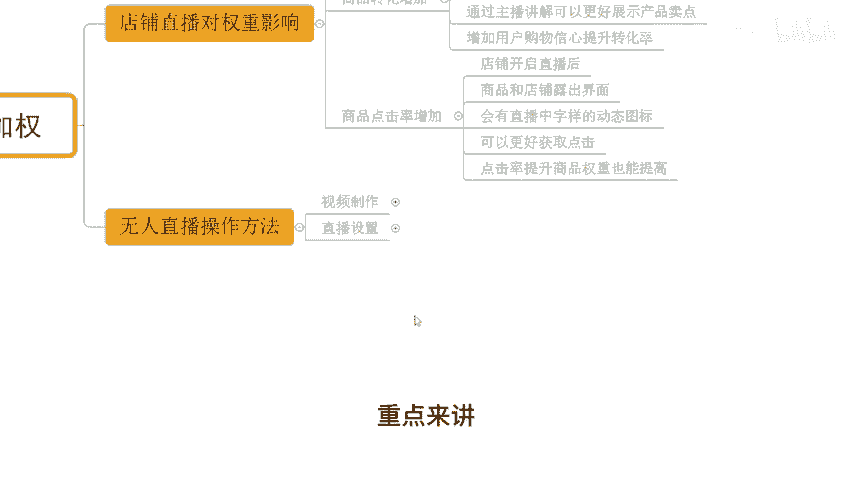

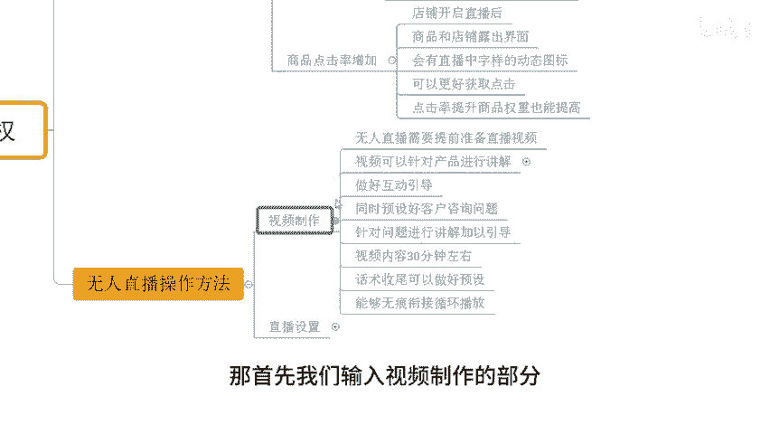

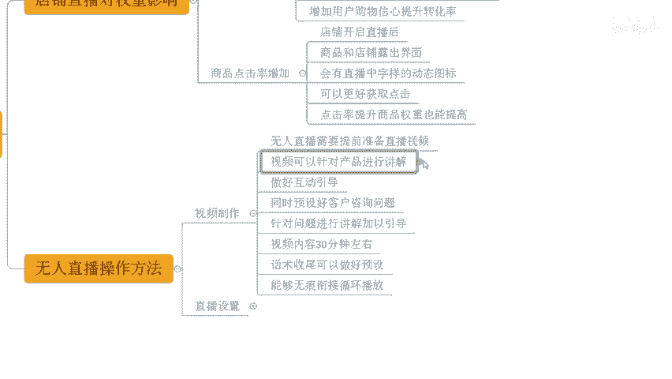

不超过5分钟，并且这一个过程呢是希望能够去以呃互动的形式来进行展开。那么我们可以通过啊作为这个商家的角度啊，通过呃作为假设啊打比方的方式来进行一个痛点的剖析，然后来进行说明啊。

或者是一个提问的方式来进行痛点的说明啊，都是可以的。那么5分钟一个小的知识点，小的内容，小的这一个痛点展示啊。那同时呢啊整个的语言呢需要幽默，需要能够去吸引人，需要能够让人觉得有亲和力啊。

那么这是一个比较考验我们文案功底，或者是我们的表达能力的一个部分啊。那整个视频的内容呢，把这些所有的产品细节，以这种方式来进行讲解之后啊，在这个过程中呢，引导好一些互动的一个这个步骤啊。

那让我们这个直播间里面，哪怕是视频播放的时候呢，也要让人觉得它不是在放视频，它是有人在跟我聊天跟我沟通，能够引导很多人来进行一个比如说公屏上给我啊扣扣数字啊，或者是点赞呢或者其他些。

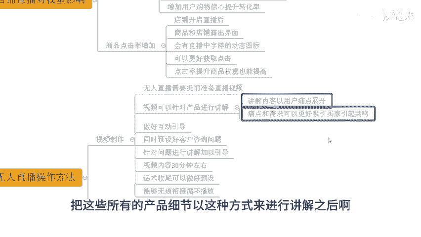

动作啊来保证我这个直播间的一个互动性啊。那么这些问题呢，我们提前预设好，然后去引导好我们的用户呢来完成这样的一个互动就可以了。那么整个内容呢30分钟啊左右啊。

可以长一点啊可以长一点那这里呢长一点的时候呢还有一个点就是说什么呢？我们的这个视频的结尾收尾的部分呢一定要去设计好啊，那这个收尾部分要跟我们开头部分呢做好一个衔接啊。

他是能够去让人很难发现一个循环播放这样的一个一个一个动作的。那么这样呢我们在后续这个视频推广的时候啊，万一有人是刚好最开最结尾的时候进来啊，然后再到我们最开始的时候一直看他也不会觉得很突兀啊。

也也会觉得这个东西就是这么回事啊。O。

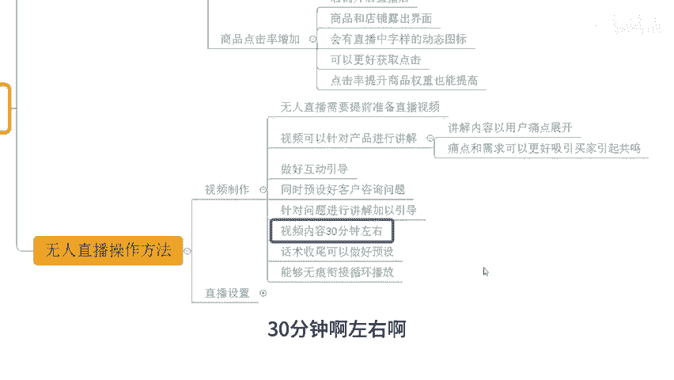

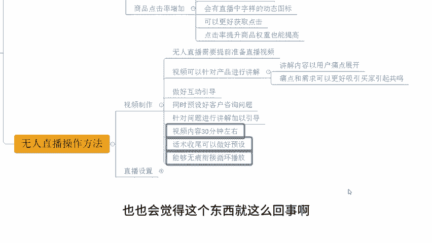

那么这个就是我们视频制作的一些要求或者这些小的细节吧啊。那么按照这种方式呢，我们把它做出来之后呢，O就可以开始我们直播的一个设置了啊。直播间的设置呢其实并不麻烦啊两个部分啊。

因为我们现在呢平台呢是已经下架了这个视频端口啊，它不能像我们以前一样直接在直播间里面去设置视频的自媒体播放啊，所以现在我们需要去通过这个摄像头功能去操作啊。所以说我们首先呢先要去打开OB啊。

在OB里面呢去设置好我们视频源的播放以及循环播放。再把这个软件呢整体状态呢设置成摄像头的一个模式啊，那么这个时候我们再打开这个多多直播的时候呢，通过多多直播进行直播的时候呢抓取摄像头呢。

我们就来抓取到我们这个B的一个软件啊，就可以了。这个时候多多直播抓取的设这个摄像头软件是B来帮我们完成视频播放啊，那么它就是一个视频。

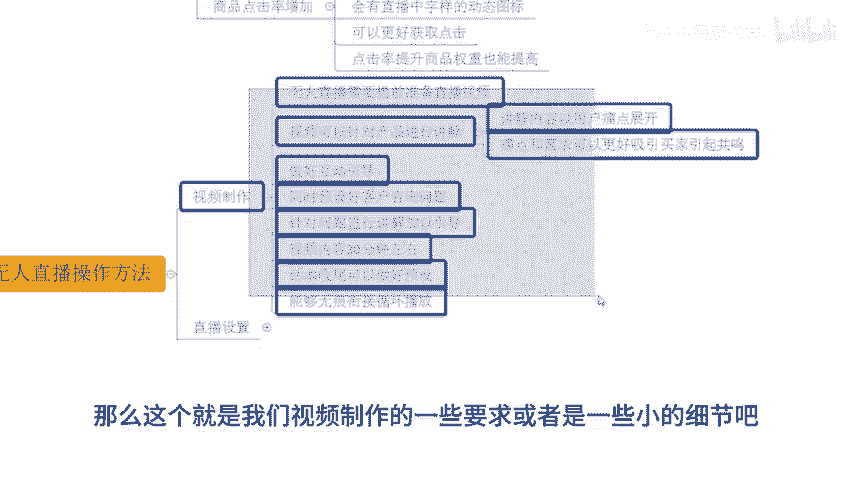

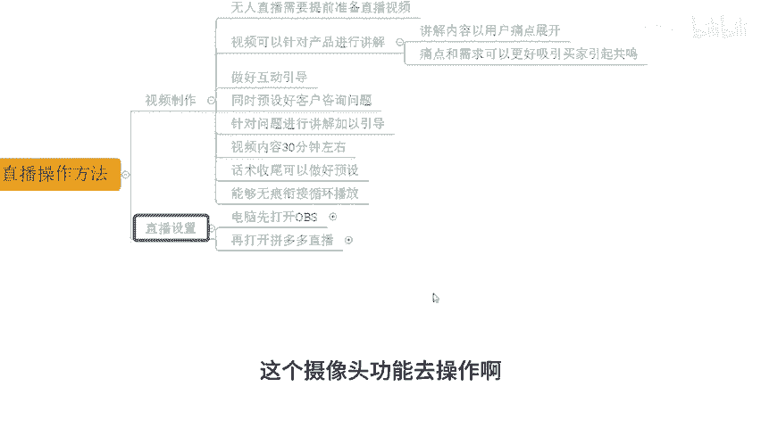

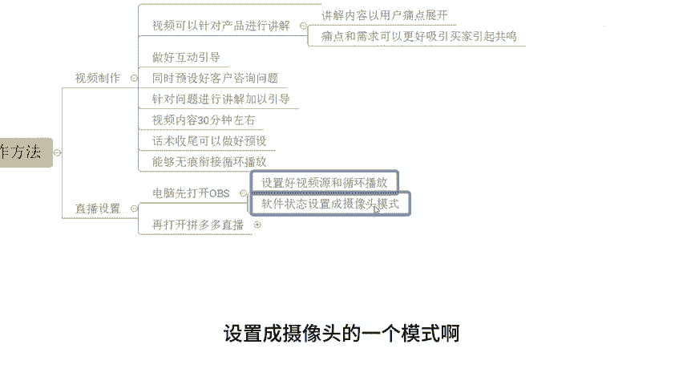

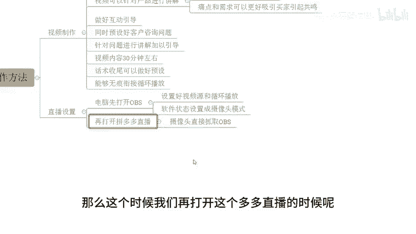

无人直播的一个操作方式。那么呃在整个的一个运营过程中呢，这样的方式呢可以帮我们节省到非常非常多的一个时间成本跟操作的一个成本啊。那整个的效果呢也还是不错的通过我的测试的话。

基本上呢店铺的这个直播端口的操作的话，像正常来讲比如说我原本的访客只有100个。那我做了无人直播，它的一个访客呢可以做到130个。换句话说呢它的一个加成呢可以做到30%啊。

做的好的店铺呢可能是40%了一般的店铺呢可能也会有到10%左右的一个加持啊。那所以说对我们店铺来讲你只要去测试一个东西就可以帮你完成店铺访客的增长话得是非常好的一个事情啊。

当然呢有小伙可能会觉得那这样的方式对我的收入板块它不是没有什么加权嘛，对我的自然流获取不是没有。首先第一个点直播端口就是自流对吧？就是我们通过免费的方式去做的一个事情，那另外一点的话，我们要做的。

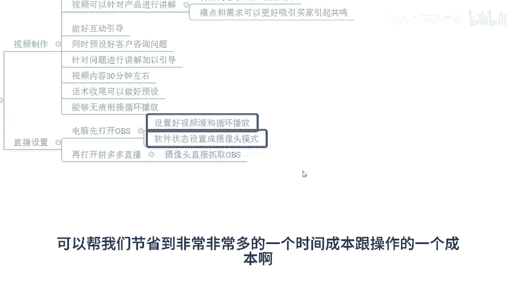

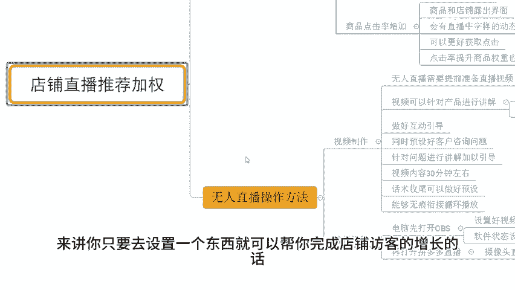

是数据的累积。他通过直播间的数据进来，能够累积到我商品一个数据，对不对？那后续数据累积量比较多了之后，同样的他也会对我们的自然流的一个搜索啊有帮助啊。所以这点大家搞清楚。OK啊。

那么以上呢就是我们关于这个呃店铺没有访馈者办中的这个店铺直播推荐加权啊这样的一个分享啊。

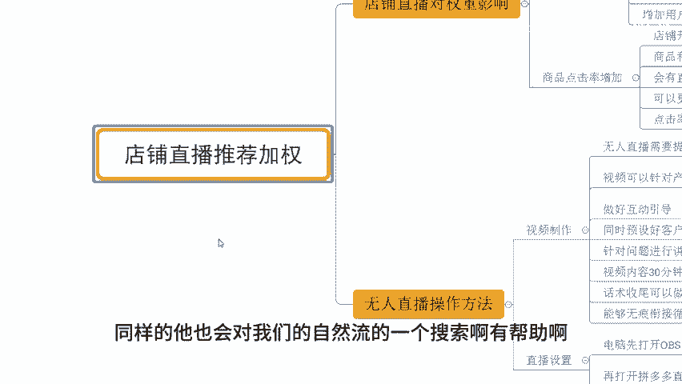

那么如果说你还有什么电摩操作方面的问题啊，需要资料的呀，OK可以找我。还是那句话，如果说有兴趣想要跟着实操，也可以直接找我啊。那么当然了，跟着我实操呢是要付费的啊。不过呢。

唯一有一点大家不用担心的什么呢？😊，我不是平时机会小学喝韭菜的啊，不用担心被歌是吧，就跟这小伙伴一样的，我们能够具来个更好的方法，然后让我们的店铺操作呢达到更高水平。好吧。OK今天的视频到这结束。

我们下次再见，各位，拜拜。😊。

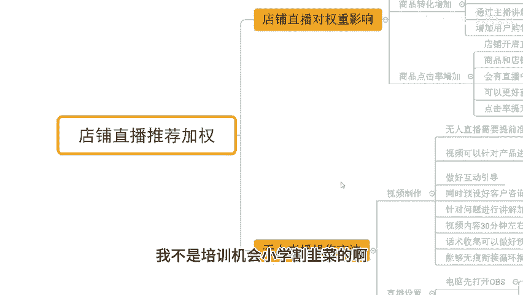

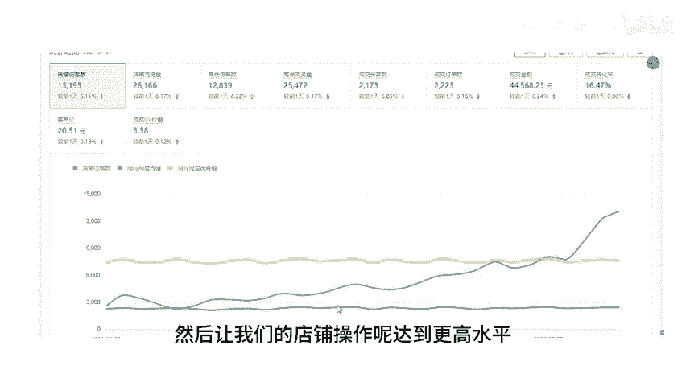

