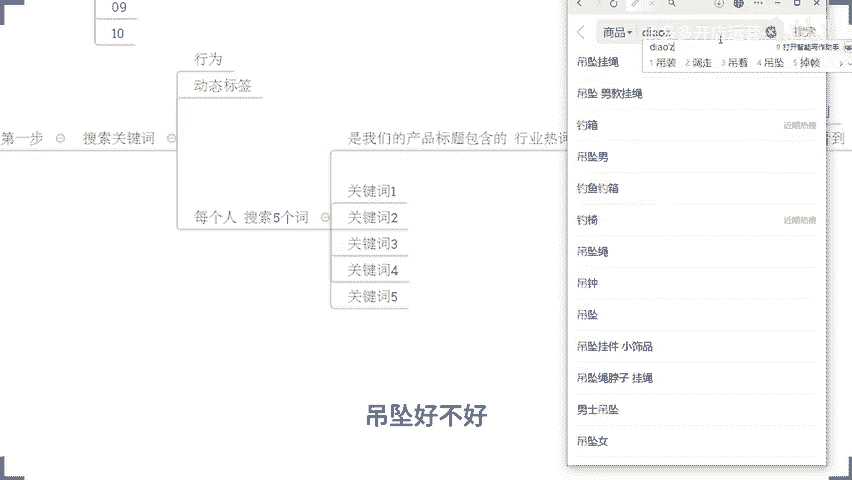
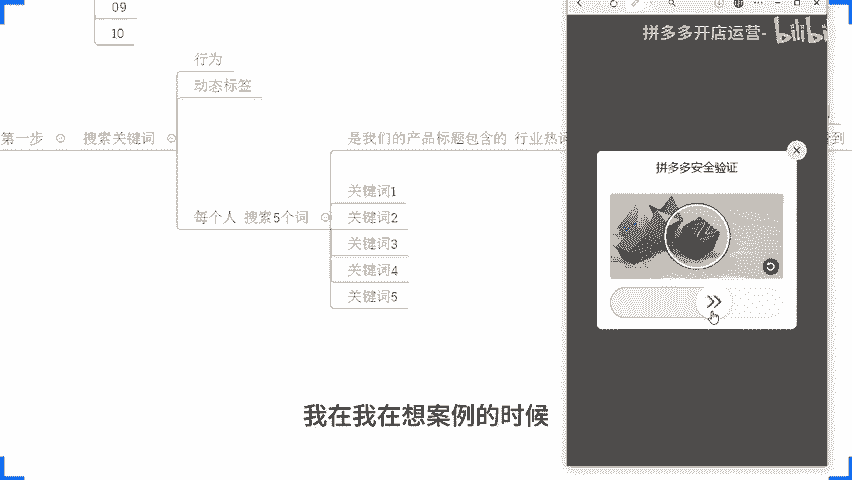
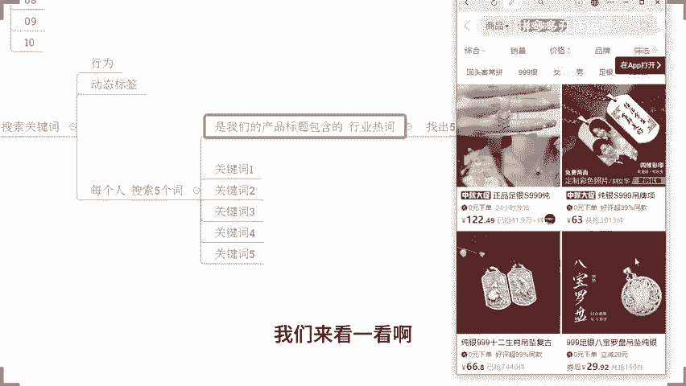
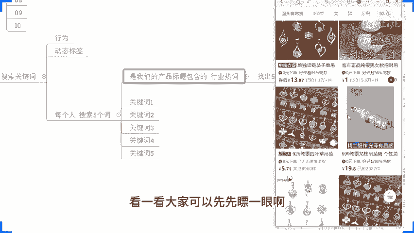
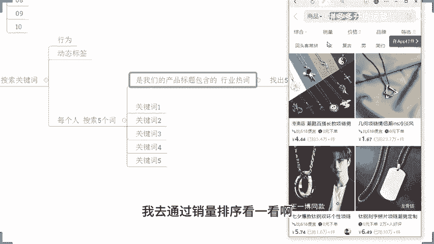
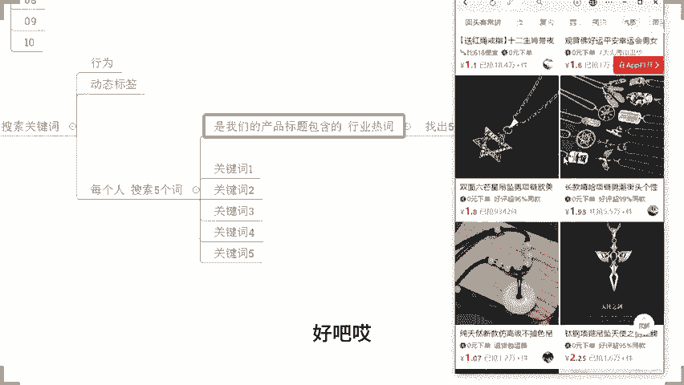
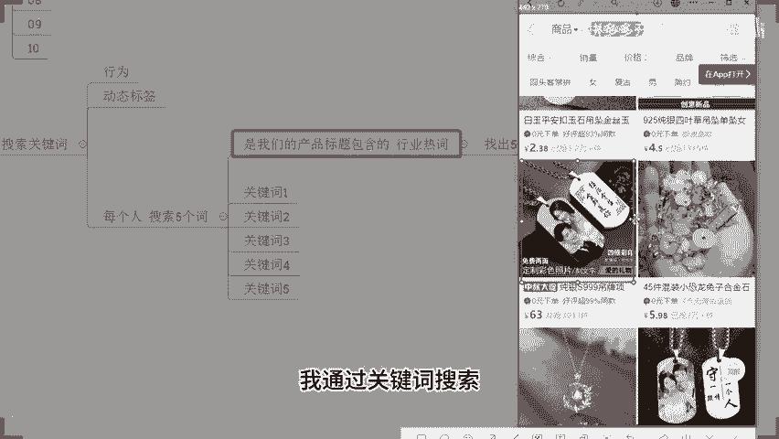
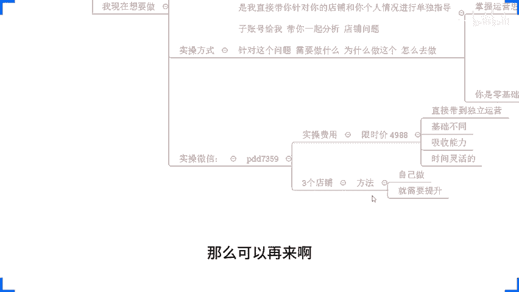

# 拼多多开店运营-新手电商运营实战指南，B站最全拼多多零基础入门教程！拼多多运营秘籍，小白也能成电商大亨！轻松上手拼多多，拼多多新手开店赚钱攻略 - P46：046  拼多多新品起款实操 搜索截流爆单黑科技 - 拼多多开店运营- - BV1xms8eSEVs

现的可以一起把你们心目中的答案发出来啊，干不干啊，好不好？先问一下啊，先问一下啊O起峰说干啊，只有起风一个人觉得干吗？啊，只有起风一个人觉得干吗？对？其他人呢唉啊OK压舌战士说干啊纯干货O啊好。

那我希望的话啊各位在直播分享过程中呢，能够实实在在的啊给大家分享更多东西，能够对大家的店铺云有帮助啊，这是我做分享的一个最主要的目的啊，其实没有那么多花里胡哨的想法，对吧？那我做分享呢。

它只是一个分享而已。😊，啊，这个只是一个分享而已啊。😊，他不是上课，所以这一点大家搞清楚啊，那么这里呢就有到一个要求，就是说大家能够在直播分享过程中呢，真正意义上跟我保持沟通和交流。啊。

因为只有我充分的了解到你们的一个状态，你们的状况，对吧？我才能更好的去分享。那么你们才能够得到更多。这个就说的很很简单一个道理啊，对不对？那如果说我不清楚你们的状态，你们是有基础还是没基础。

我不知道那我当做都是没有基础的那给你们分享一些非常入门，非常浅显的东西，这样的话，其实对你们的帮助可能有限，对吧？虽然说可能也会涉及到一些细节部分，你们可能以前没有听到的地方。

但是同样的这样的内容呢帮助是有限的，对不对？所以只有你们的情况充分反馈给我，我才能够很好的知道你们的状态之后呢，给予你们更多帮助啊，那么所以呢积极互动非常非常重要，而且尤其是在于什么呢？

在于我跟大家确认我分享的某一个知识点的时候，我跟大家确认哎，你是否能够听懂，能够听明白的时候，一定要告诉我答案，对吧？哎，你听得懂，你跟我说一下，听不懂也跟我讲一讲啊，那么这是一个啊。

那同时呢在我分享过程中呢，还是那句话，对不对？😡，我是喜欢问问题的。那么这些问题呢，没有任何要刁难大家的意思。😡，只是为了让大家能够去带着问题去思考。啊，那么当你能够充分的带着问题去思考的时候呢。

OK那么这个时候你对于当前这个内容的吸收跟理解其实会更容易一点。对吧同时呢你也不容易去开小差，对吧？也能够让我更加清楚知道你们的一个状态啊。所以说这个点大家注意一下。那么当我问答问题的时候呢。

你们也要针对性的去思考，并且积极的回答我好吧，这是第一个点啊，各位来，这个大家没问题，能够接受的话，公屏上呢可以打一个一，好吧，能够接受的话，公民可以打个一。😊，好，OK啊OK那么在整个的分享过程中啊。

丫缩算是你这个二抠的有点有点突兀啊，咋咋地啊，调皮了，是不是？😊，啊，两个一是吧OOK啊，1加一等于2是吧？OK那在我们整个的分享过程中呢，还有一点啊，就是说呃我们每个人肯定会有自己的店铺操作问题啊。

这个是这个是肯定的啊，这个是肯定的。那么这些问题呢嗯肯定啊，你们也希望能够寻求一个答案，对吧？这个我觉得是。😊，正常的啊也是合理的啊。那针对到这些问题呢，大家如果说需要答案，没关系，可以问。但是呢在。

分享过程中啊，那么问题的解答呢仅限啊当前内容。相关的啊，仅限当前内容相关的啊，是这样子的。如果说是跟我当前分享内容不相关的问题呢，你们可以等到我下播了单独问我。😊，我也非常乐意给大家进行解答，好不好？

因为在直播过程中的话，如果说每个人问一个问题，而这个问题呢跟我们分享内容不相关的话，那可能会导致整个的内容呢会就是比较脱节啊，那么东一下西一下，对吧？那一些技术比较差的小伙伴们或者是一些新的小伙伴们。

他们可能完全没办法吸收啊，所以这个点呢也大家能够去理解一下啊。OK的啊，那么这是第二个点啊。然后呢，还有到最最重要的第三个点。😊，啊，最最重要的第三个点什么呢？就是说大家在整个的备案过程中，对吧？

肯定是可以有到一个吸收跟帮助的啊，这个是这个是肯定的，毋庸置疑的。但是啊各位。那么你们呢我相信也有很多人每天呢会去了解很多的这个这个所谓的干货，对吧？会研究很多很多的黑科技，是不是？对不对？来。

我问一下，每天自己有花费掉一定的时间去做这个所谓的。干货的一个一个吸取的对吧？去了解一些玩法呀或者研究规则呀。会有的小伙伴呢公屏上现在可以打个6好不好？来，我确认一下啊。

就是你自己每天都会有这样这样的一个呃安排啊，有这样的一个意识去做自己的一个提升的那公民可以打个6啊，我来看一看。😊，OK起风这样子的啊，是有灵犀这样子的OK啊呃其他人呢其他人都是都是这个被动的吗？啊。

没有主动是吧？OK啊这个泥沙。😊，也是有这样的一个习惯啊。好，我说一下啊。那如果说你们真的去有这样的一个意识的话，其实你会发现一个问题，确实你每天可能也会去看很多东西，对吧？但是呢你看这些东西的时候呢。

😊，当时觉得很爽。对吧当时觉得很爽。啊，感觉这个就要起飞了呀，感觉这个我的我的这个脑子都开始痒了，对吧？这个长脑子了，在对吧，当时觉得很爽，但是爽完之后呢，发现哎。😊，感觉不对劲儿啊。

就是有一种感什么就是无从下手。对吧哎，不知道怎么做啊，做的时候呢，可能甚至你说哎做了哎，我也去做了啊，我我真的去做了，我也认真的去做了。而且我做的我觉得已经做的很到位了。但是做了之后发现什么没效果。😡。

有没有这种情况来，如果有的话啊，公屏上再一次打个一好不好？哎，就你说哎碎片化的爽，对吧？没有系统化对吧？确实是这样子的啊，这个很正常啊很正常。那这里我说一下啊，为什么呢？其实道理很简单，有的时候呢。

因为本身这些所谓的干货，所谓的这些黑科技啊，对吧？你们当时看的时候觉得哎确实还不错，但是这个方法它是不是符合你。😊，店铺。不一定对吧？他是不是符合你当前的情况，不一定对吧？虽然说可能他真的是有用的。

但是你看完之后，你可能去做的话，他因为不符合你店铺，所以你做了没有用。😡，知道吧？包括说有的时候呢这个方法它不仅只是单纯的这一个方法而已，它是需要有到成体系的整个操作流程来相互衔接的。

而你只做了某一个步骤，所以你会发现可能做了之后没有用。甚至说做了之后呢，他需要一个时间反馈的。但是你没有这样的一个合理的时间安排。你今天试一试这一个，明天试一试那一个试完之后呢。

它根本就没有开始呃有效果，你就已经换下一个方法再试了，对吧？那你试来试去。😡，啊，最后就发现什么呢？时间花掉了。啊，时间花掉了。对吧然后呢，哎钱也花掉了。😊，最后呢，店铺没有效果。😡，啊。

就这么一个情况。那所以我今天分享的第三个点啊，重点跟大家强调第三个点什么呢？那今天确实也会讲很多的东西啊，确实也会给大家去分享很多的干货啊，这个没毛病。但是大家一定要结合到你自己。😊，实际情况对吧？

确实你自己没有做到位，确实符合你店铺情况的。OK那么你去做好吧，你不去做也是没有意义的。但是要符合你店铺。这也是为什么是很多小伙伴选择跟着实操的原因啊，因为跟着实操的话，它是能够针对到店铺去分析。

有到一个实际问题的解决方案出来，是这样子的，好不好？OK啊，多的我就不多说了，时间已经到了啊，时间已经到了。😡，来啊，那么就开始今天的分享吧，好不好？各位来呃在最后确定一次啊。

所有人在直播间的小伙伴们声音各方面没有问题的。公屏上六走一波好吧？确认一下啊确认一下啊，那么就直接开始了啊，都没问题的话，确认一下，没问题，直接开始啊，那么听清楚了啊，在分享过程中的话。

大家记住个事情啊，就是说呃这个注意力要要集中啊啊，注意要集中啊。那如果说有不清楚不懂的地方呢，一定记得第一时间反馈给我啊，跟我讲清楚啊，不要自己在那里闷不更生的啊，这个很关键啊。

O今天呢要分享内容呢叫做拼多多新品起款实操搜索截流爆单黑科技对吧？这这么一个玩法啊。那么这个玩法呢，其实它没有什么特别玄乎的，也是基于我们平台的一个算法底层逻辑来展开的。但是它很有效啊，但是它很有效啊。

那么在分享之前呢呃我还是。😊，呃，跟大家说一说最近的一些情况吧哈，因为呃讲真的，我发现你们很多小伙伴呢对于店铺啊，对于拼多多运营啊这个一些规则变化呀，一些动态呢真的了解很少，没有那么多的一个洞察力啊。

所以今天我们先在正式分享之前先讲一个事情啊，就是把这个东西讲一讲啊。呃，各位。😊，拼多多呢目前的这个规则啊或者一些玩法呢，它其实在不断的变化啊变得很快啊，最近呢尤其频繁啊变得很多。

那么像马上呢又会出现一个新的活动调整啊，就是百亿补贴。各位有没有人知道的呀，有没有人知道的呀，百亿补贴马上又要改，要要变化了啊，百亿。补贴啊，百亿补贴啊，最近有变化了啊，知不知道有知道的打一。

不知道打2啊，来更快所有人啊，这个地方一定给我动起来啊，好不好？所有人给我动起来啊，知道的打一，不知道打2啊。😡，我的天呃，不是你们你们都不知道吗？这么多人啊，一个都都没有这个知道的呀。😡，好啊。

OKOK啊，那么问题来了啊，兄弟们。😊，那。哎，还是我上次说的那个事情，对吧？还是其实还是我上次说的那个事情，你想一想，如果说你做一个店铺啊，你做店铺，那平台它有什么样的一个变化。

你不知道你没有在第一时间。😡，去响应他，或者你没有提前去布局。😡，那么相当于呢你就是比别人起跑慢，对吧？是不是？😡，是不是别人起跑慢啊？那当你起跑比别人慢的时候，你说你能够跟着别人竞争吗？

其实很多时候就这样子的呀。😡，你没有办法去了解到这些信息，或者你真的没有这种意识去了解这些信息的话，或者你不具备这样的一个分析能力的话，OK的。那么你在针对到平台竞争的时候呢，你就会陷入被动。😡。

那么这个线路被动之后呢，你整个的操作。就会之后提升就会缓慢，好吧，所以这个是很恐怖的一个事情啊，好不好？这是很恐怖的一个事情。对啊，哎，我又看到一个这个小伙伴普导啊，葡导今天也有这个呃。😊，啊。

葡萄等下跟你说吧，啊很有意思啊，我觉得真的啊，你你你今天来直播间的这个这个经历很有意思啊，OK。😊，好，先不先不说别的吧，我说说变化吧，说说变化啊来啊变化是什么呢？😡，百亿补贴啊在。

9月10号会有新的规则生效啊，会有新的规则生效。新规啊，那么这个新规呢有哪些变化呢？首先第一个之前呢百亿补贴呢，它考核的是我们的店铺领航员。啊。店付你行像大家都知道吧。😡，来知不知道哎哎哎哎哎。

一一发出来了啊，一一发出来了啊，说这个为了进一步规范这个百亿补贴呢，在这个呃26号啊到一号呢会有一个公开意见这个征集对吧？10号会生效新的规则啊，OK发出来了，发出来了啊。好啊，不错啊。

是有经已经看到是吧？看到就行啊，看到就行。那么这个新规呢，它当时就是说把这个百亿补贴原本考核领航员的部分又换成了我们店铺的综合体验星级。😊，啊，他更换了啊，更换成店铺综合体验新级。啊，是这样子的啊。

那么这个呢其实说白了啊，就是它的考核范围呢更加的细节了。以前呢是相当于是整体的啊，以前是整体的，现在呢是这个更加细节，更加细致的部分啊，回去了，这倒不是回去不回去的问题啊，这倒不是回去不回去的问题。

是这样子那么这一个考核维度呢，原本呢是呃各种的综合数据对不对？啊，有这个什么店铺的数据呀，商品数据呀，店铺的这个品质商品品质啊，物流服务啊，店铺活跃度啊等等啊，这些乱七八糟的东西啊。

那现在它更加聚焦了啊，更加聚焦了啊啊主要就考核到是我们这个呃店铺的这个数据啊基础啊，像我们的这个评分对吧？这个板块啊，啊，主要是这个板块啊，那么是这样子的。😊，相当于呢它更加聚焦了啊。

考核范围更加聚焦了啊。那么同时呢它生效的部分，这个其实不是重点啊，这个其实不是重点啊。大家注意听啊，现在说这句话可能呃你们听过之后得忘掉它啊，因为这个东西不能到处去说的哈，好不好？呃，听听清楚啊。

各位啊，这句话你们听到就算了，这里我就不写字了啊，我就直接口述一遍啊，我直接口述一遍啊。那么。😡，这个新规里面呢特别强调了一个事情啊。

就是说平台不对商家的资质、商品信息内容的真实性、合法性、有效性等等乱七八糟东西啊，承担任何的责任。😡，无论平台的审核结果如何，在任何情况下，商家对其参与的活动有全部这个独立的法律规范的一个约束啊。

承担全部的法律责任是这么一个情况的。各位这句话，大家现在有听到的话啊，已经听见了的话，扣一啊，来动坏。我给他解释一下什么意思好不好？刚刚这句话大家如果说有听到因为我没打出来嘛啊，我没打出来。

这个这个东西不好打出来的啊，没听懂是吧？没听懂没关系，没用没关系啊，现在你已经听到了就行。听到了所有小伙伴听到打一啊，我给他解释一下这个什么意思啊，我给他解释一下什么意思。😡。

这句话呢其实道理就很简单啊，这句话的道理很简单。因为这个东西呢呃就呃大家就认真听就可以啊，听就行啊。这个我不能说不能打字打出来啊，这个东西有点敏感，就是说平台。😡，不承担任何的法律责任。

如果说你的产品出了问题，你的商家资质出了问题，你的商品出了问题，你有这个内容违规等等这些东西啊，所有的情况之下呢，OK。😡，商家自行承担。以前是没有这样句就写出来的，以前没有写出来啊。

虽然说是我们大家都知道是这么个情况啊，就算是产生纠纷，也可能这样处理，但是以前没有写出来，而现在写出来了。😡，写出来的意思。大家知道什么意思吗？😡，后期平台的发展方向，上次我有说过，对吧？

上次上次直播的时候，我有说过一个事情嘛，对不对？我说平台现在呢是要走正规化，对吧？正规化。😡，啊，正规化哎呦哎呦又有呃，11又把它这个发出来了1。😊，一一又把这个规则发出来了。好，OK上次我有说过啊。

宣多平台呢现在是要走正规化，对吧？那么正规化就意味着他要对一些劣质商家啊进行。😊，诉清。知道吧？😡，这个是官方都明确说出来的事情，他要对那似商家啊打错字，商家商家。😡，他要对劣子商家进行诉清啊。

那后续呢对于一些玩擦边球的这种商家啊，很有可能，那么就要进行法律层面上的追责。各位能懂意思吧？为什么他会把这个规则写出来？就是为了产生问题之后。😡，啊。

就是为了产生问题之后来确保啊不是我们的问题卡麦了吗？😡，卡了吗？现在现在好了吗现在好了吗？😡，啊，断断续续还有这种情况的。来来来来来来呃，现在现在OK了吧，现在OK了吧。😊，啊。

反正每次啊你看看我都说了嘛，你们你们不要把这些敏感的东西发出来啊，这个东西对吧？我都不敢打出来，对吧？我都不敢打出来啊。😡，没声音了呃，这样子这样子这样子。😊，这样子啊，我等你们。

10秒钟吧啊10秒钟时间。啊，我等你们10秒钟时间啊，然后没声音的。😊，退出文件啊。好吧，没声音的，退出重进啊，好吧，来来来来来来来，我等你们啊等你们，顺便我喝口水啊，顺便喝口水啊。😊，有声音是吧。

可能有部分小伙伴呢，他就是这个呃确实像设备问题啊，网络问题啊或者其他方面原因都有可能啊这个东西。😊，呃，因为我这边目前就平时啊如果说真的是卡的话，我这边会显示这个网络啊延迟比较高之类的嘛。

会显示今天是没有显示的啊，所以我不确定是什么情况。😡，都没问题了吧。来，现在所有人ok没问题，公屏上打个一好不好？所有人没问题的话，公屏打个一，我们我们继续开始啊，好吧，所有人都没问题的话。

我们现在公屏打一啊。😊，O啊O ok ok。😊，那你看啊你看像像我们做分享啊，像我做分享的话，你可以看到对不对？我不会去给你们照本宣科的给你们去讲课程，讲课件啊。

我更多的呢是讲一些真正意义上可能对你们来讲会呃对你们的运营思维啊，对你们的后续操作方向，有一点帮有一些帮助的东西啊，好吧？那刚刚呢我们讲到的这个东西啊，刚刚我们讲的这个东西，对吧？呃。

那么这个规则是有更新了，是有玩法要更新，对不对？那么是因为平台要正规化啊，这个东西呢上次直播的时候我有说过啊，这是官方的啊，这是拼多多平台它的执行总裁，他的CO发表的言论啊，平台要走正规化。

要扶持优质商家要驱逐那些劣质商家啊，要对他们进行打压了啊，所以这个打压的方式，当你们有看到这样的规则更新之后。😊，那么其实心里面就有一个数，就是说哎那平台可能会针对到这一部分人。

就是玩擦边球的这些劣质商家进行法律层面的诉清，各位这个逻辑现在大家能够明白的话，公屏上打个6，好吧，这个逻辑现在公屏上嗯如果说能够理解的话，公民可以打个6。因为我规则更新之后。

在明文呈现出来法律责任的这个呃，这个这个权限范围的时候，对不对？进行追责的话，那么他就更好更容易去约束了，不然的话就会有一些模棱两可的部分，对不对？会对平台呢可能有一些呃不好的影响，对吧？是这样子的啊。

那么对于这样的操作呢，呃，有了这样的一个信息出来之后。😊，那么我们就要知道了啊，如果说你现在是在玩一些擦边球的玩法，你自己是在做一些擦边球玩法的话，OK要及时调整。而且另外一点啊。

如果说我们确实是有在正规经营的情况之下。好，那么把你的店铺服务做好，那么平台是有扶持的。啊，把你的店铺服务做好，平台有扶持，知道吧？店铺评分，店铺综合体验分，包括说我们的银行员各种乱七八糟东西啊。

这些能够去体现出服务品质的，能够体现出商品品质的这种这种这种渠道啊，把它做好，都有扶持啊，好了啊，这个是一个题外话啊，这是个题外话。那这个题外话呢，一方面是给你们讲一讲这些新的东西出来的一个情况。

另外一方面我是要告诉大家一个重点什么呢？当你们要去做这个平台的时候，对吧？我要去做拼多多的时候，那么拼多多平台它的一些新的东西出来，你要去关注它，并且你要去根据平台的这些新的东西出来之后。

它真正意义上背后隐藏的一些逻辑，你要去分析它各位能明白我意思吗？😊，虽然说刚刚分享的这个东西，它不是什么实实在在在我们店铺里面去实操，能够去解决问题的部分。

但是是你们要未来在运营过程中要学会的一个思考问题的方式。各位能够明白的话，公屏上啊确实觉得有用啊，来确实觉得有用，公屏上打个一啊，能够理解我表达的意思，能够去了解到如何去分析这些问题的这个逻辑。

懂得如何去进行一个深层次的啊信息的一个获取的公屏上可以打个一啊，好不好？那么这是一个非常非常重要的点啊，当然这个不是我们今天出现享的主要内容啊，这不是我们主要内容啊，店铺评分做好啊，店铺评分做好。

这个只是一个最起码的东西吧啊O。😡，好，那我们继续往下啊继续往下。那今天分享内容呢是什么呢？是我们刚刚说的叫做拼多多新品期款实操，对吧？搜索截流爆单黑科技。那么我现在问大家一个问题。😊，你们觉得。

截流是什么？嗯，你们觉得截牛是什么？😡，或者我换一个话题吧，因为说这个截流可能比较抽象一点。我说或者我换一个话题啊，那我们的商品。😡，啊，我们的商品对不对？我想要让他有流量。😡，啊，我想要让他有流量。

对吧。啊，回答说截流就是截取流量啊，然后陈悦说是抢流量啊，呃我我我一开始还觉得可能这个这个这个讲起来会比较比较比较这个就这个纠结啊，比较不好解释啊。没想到你们直接从字面意义上来来来来进行讲解的话。

好像也可以啊哈这个东西好像也没有我想那么复杂啊。那我我那我再问一下啊，那。😊，我们想要截流，我们想要去抢流量，对吧？那我们商品需要。具备什么样的条件？来，这个是一个很具体的问题了啊。

这个是一个很具体的问题了。那如果这个问题你有知道答案呢，可以把它发出来。如果说不知道。😡，打问号。啊，如果说这个问题你知道的，可以把答案发出来。如果说不知道打问号啊，然后这个丫哨说唉，吸引眼球。😡，啊。

吸引眼球，还有吗？啊，陈月不知道嗯，OK。😊，呃，这个是这这个这个字是是读啥呀？这个是字吗？嗯，这个字这个字念字吗？😮，一个是啊一个鸟对吧？这个字我倒真的忘读啥了啊，赤吻是吧，是这样读吗？啊，赤是吧？

赤吻是吧啊，不好意思不好意思啊，赤吻啊，说这个不知道ok其他人呢来葡萄，你知道吗？😊，不让你知道吗？😡，啊，也不知道是吧。😡，O okK那那那我们就不纠结了，那我们就不纠结了啊，呃就直接直接分享吧啊。

就直接分享哈。😊，抢同行的流量抢同行流量啊，OK抢同行流量啊抢啊打错字啊，抢啊OK好，那我们现在来一起分析一下这个逻辑啊。今天呢我们的商品啊，现在有一个商品呢，我们讲它是一个爆款啊，它是一个爆款啊。

它和我的商品呢可能是比较接近的啊，比较接近的啊啊比较接近的接近啊，就是跟我的商品是比较接近的。这个爆款呢是同行的啊，那我们讲这个产品呢，它就是商品A啊，它就是商品A好吧好。那我们的商品呢是商品B啊。

我们的商品是商品B。😊，那么A是爆款啊，注意啊，A是爆款，所以A商品呢它的排名很好，是不是？😡，各位这个这个大家同意吧？A，他是爆款啊，所以他的排名很好啊，大家同意的话扣一好吧，同意的话扣1。😡，好。

OK同意是不是？好，那就行啊。那当A的产品是爆款，它的排名很好的时候，这个时候呢它其实整体的数据反馈也会很好。😊，啊，数据反馈是很好的对吧？同时呢它还会有到。😊，相对稳定的人群啊，这个是A产品啊。

它成为爆款之后所具备的一些基本的一个一个一个条件啊，基本的一个条件啊。那么现在我们做的产品呢是产品B啊，好吧，我们做的产品呢是产品B。那产品B呢是我们刚刚上架，它是一个新品。啊，它是一个新品。

那如果说我想让我的产品B去完成产品A的截流，那么首先要做的第一件事情就是让系统判定我们的商品B和商品A啊和这个爆款啊，他们两个之间呢哎是有关联的是吧？他们之间是有关联的对吧？各位这个这个没问题吧。😡。

他们两个之间要有关联啊，让平台觉得我们的产品B和爆款商品A啊，他们两个。😡，至少来说，需求的人群一致。啊，能够去呃用我们的商品B起到替换A的一个作用。D能替换A。啊。

在某种意义上来讲是要有这么一个作用的，对不对？那么让这两个产品呢形成一个呃相互竞争的关系，对吧？那怎么去做呢？😡，不急啊，一会儿我详细讲解的啊，但是前提条件还有一个点，就是那他们两个可以竞争，对吧？

我们也知道他可以竞争，肯定会有竞争的对吧？但是有一个问题啊，那我们的商品呢是一个新品啊，是一个新品，是刚上架的，而商品A呢是一个成熟的产品，对吧？那么他们之间产生竞争的话。😊，那。😡。

为什么我们的B商品能够去得到更多的数据，或者在某种意义上能够和我们A竞争呢？对吧。😡，A已经很成熟了。而已经很吃熟了。那B是一个新品，它没有数据，后来数据很少。这种情况下怎么去跟他竞争？😡。

竞争不了的对吧竞争不了的。所以说我们想要让B商品能够和A商品竞争的同时，就是第一点，让他们两个产生关联，对吧？让他让系统判定B能替换A，他们的人群的需求是一致的，并且在某一些数据层面上啊。

我们的B要比A。😡，优秀。啊，比较别优秀。各位。道理很简单。😡，我相信这个道理一讲大家都清楚，各位没错吧，是不是这个道理？😡，这个这个逻辑如果说okK大家能够明白，能够理解，确实是这个样子的。

公屏上再一次啊打一个6好不好？再一次打个6啊。😡，是不是就像我们我们这个跑步一样的，对不对？就我们跑步一样的，你说谁能跑的赢啊，A就是这个跑到前面的人，他已经跑了就行了。那你说你作为B，你去后面追。

你怎么追得上他，要么你跑的更快，对吧？要么你跑的更快啊，要么你的起点更靠前，对吧？😡，是不是起跑时间不同嘛，对吧？起跑时间不同嘛，那其实的问题就在于什么呢？在于我们的商品币如何去实现这样的一个数据变化。

是不是OK的啊？那么这个地方呢大家不用着急，也不用担心啊，方法有很多操作方式也有很多啊，操作方式也有很多。那么呃就直接开始啊，就直接开始好吧。那么当然了这个方法啊，我说过的啊，它是一个基于我们底层逻辑。

😊，啊，来展开的一个玩法。而这个玩法呢，其实我已经用了很久了，只不过这个方法呢，在不同的时间啊，不同时间，它的具体的核心数据是有变化的啊。啊，那么每一次呢也都会根据平台的考核规则不同呢。

由于针对某一些数据产生变化。但是整个的方法的底层逻辑是不变的。因为平台的算法它是没变的啊，只不过在算法的时候，某一些数据的权重考核它会区分，对不对？那么OK我们来看一看啊，各位给大家看一看这一个店铺啊。

😡，来，各位有看到这个数据的话，公屏上现在可以打个一了啊。有看到这个店铺的话，公屏上可以打个一啊。这一个店铺呢是一个最早临访客的新店啊，这个店铺呢是一个最早临访客的新店啊，从最早临访客开始。

一个新店新品上架之后就是用到了这一套玩法在做的。😊，啊，那么做的过程中呢，用了这个方法之后，快速的去在前期累积上品权重之后，形成后续的一个数据爆发，对不对？在很短时间访客就破千了啊。

可以看到在前面啊几天时间就破千了啊，没凑到几天把就破千了啊，后面的话数据增长也是非常快速，它后期的话一天访客做到16000啊，看到没有？1600的一个访客啊，那么一天订单是1800多单啊。

这个店铺呢做的是那个呃黄色的小米啊吧吃的那个啊煮粥的小米啊，我不知道大家有没有吃过，有没有有没有买过啊，客单价呢不是特别高啊，18块多啊，但但这个客单价啊，在这个类目里面已经不算便宜了，不算低了啊。

不算低了啊。那么转化率呢做到11。35的啊，也都还不错啊，也都还不错。那么怎么去玩的啊啊，但它是谁不重要啊，做的是怎么玩啊。那我们来说一说啊。😊，首先第一个事情呢，各位来，我们来说一下啊。

在整个操作过程中，我们讲我们需要让我们的商品和竞争对手呢产生关系，产生关联。要让我们的商品呢让平台判定我们的需求是一致的。并且在某种意义上来讲，我们的数据要比同行更优秀，对不对？那怎么做呢？

OK首先第一件事情。😊，啊，第一件事情。啊，那我们要去养标签。啊，我们要去养标签啊。那么什么叫养标签呢？各位有没有人知道的？😡，有没有人知道的？知道的话啊，公屏上打个一啊，不知道的，公屏打个2啊。

我看一下啊，如果说呃都知道呢，这个地方就直接跳过。如果说不知道呢，就说一下啊。如果说不知道，我就说一下。😡，呃，不是都不知道啊。😡，啊啊有优不知道的优不知道的啊优不知道的啊呃，终于出来一个知道的了啊。

😊，OK啊呃，其他人呢？😊，其他人呢呃目前就几个小伙伴不知道这个要这个去讲一下的这个代价有点大啊，比较比较花时间啊。这个没我觉得非必要就不去不去说这个事情都都OK的。😡，不知道的打2啊不知道的打2。

我看一下有多少啊，如果确实比较多的，我就我就说一下啊，我就讲一下啊。😡，呃，OKOK啊，看的是有必要讲一下啊，有必要讲一下啊。OK。😊，那这个地方我说一下吧，说一下说一下啊说一下啊啊，这样子说一下啊呃。

来来来来来来来注意听啊，注意听。😊，其实标签这个东西呢比较简单啊，没有那么的复杂。只不过呢呃有点浪费时间。我的意思就是啊所以没没必要去讲，来说啊，那么呃对于我们的产品来说。

今天啊各位假如说啊各位假如说啊。😡，啊，假如。啊，假如啊假如啊。各位。哎。今天这个我看一下啊，这个兔兔仔啊，兔兔仔啊，好吧，假如说兔兔仔啊，或者假如说这个呃陈月啊，假如陈月吧陈月啊，假如陈月啊好吧。

陈月买房了啊，好吧，假如陈月买房了啊。😊，好吧，陈月啊，假如说陈月买房了啊，那么他买房了之后。😊，他的这个家呢哎还没装修对吧？他要装修嘛，他要装修。😡，那么他要装修呢，他就需要去买建材，对吧？

是不是他需要买建材啊呃，什么这个。腻子粉哪对吧？电线哪、地板哪、水泥啊啊对吧？啊，这个空气砖哪等等乱七八糟东西啊，各种东西啊各种东西。啊，那他他要去买这个东西啊，那今天各位我问一下啊。

他如果今天去搜索了。他还没有下单。那么平台会不会判定他对这些建材有需求？各位会不会？会的话，公屏上打个一啊。会的话，公屏打个一。OK啊OK会对吧？会啊，那么这个是必须的啊，这是会。

那这个时候啊他把所有的东西都看了差不多一遍了啊，但是唯独他没有去看这些这个五金件，对吧？😊，啊。他其他的这些什么电线呢，对不对？呃，这个开关哪，插座呀，对吧？呃，腻腻枝粉、水泥呀对吧？呃。

石膏线哪各种东西他都看完了，对吧？啊，地板也看了，对吧？墙纸也看了，他就是没有看五金件，那我想问一下，那五金件它会不会被判定有需求。😡，嗯，会不会会的话啊，公屏上还是老规矩啊，再一次打个一啊，好不好？

如果不会打个2啊。😡，OK啊，陈月说不会啊，会的啊，其他人都是说会的啊，陈月记住啊，会的啊会的。虽然说你没有去搜索。但是平台根据你的行为，他也会判定你对这种产品是可能有需求的啊，是可能有需要。

没有说这个需求百分之百啊，但是你是有需求的啊，也是有需求的。有的时候呃算法比我们更懂我们对吧？所以这个时候呢，那我们就会知道标签呢在对于我们个人的需求标签来说，有两种一种呢是你有这种行为的。😊，啊。

有这种行为的啊，对吧？你有去搜索，你有去浏览，你有去这个点击。对吧这个行为啊，那么另外一种行这个标签呢，就是你可能的一个需求。也就是我们俗称的猜你喜欢嘛。😡，是吧是不是啊。

所所谓的猜你喜欢就这么个东西啊，根据你的历史行为，根据你当下的一些行为来判定你对某某产品可能有需求啊，是这样子的啊。那么这些都是标签，这个标签呢是我们人需求的标签啊，这是人的需求标签啊。

那么现在啊假如说有这样标签的人啊，我今天啊注意啊，我今天我不是做建材的，我也不是做家具的啊，我不是做建材的，我也不我也不是我呃我也不是做这个呃这个五金建的啊，我也不是做那种基术建材的啊，我是做家具的啊。

假如说啊假如说啊假如说我啊做家具的。😊，啊，我做家具的啊，那么这个时候陈瑞他有去看了五金件，看了这些各种各样的乱七八糟的这个基础建材，他也看过，也买过了啊。那么他现在哎又来看了我的店铺，看了家具啊。

看了我的店铺啊，看了我的店铺啊，看了我的。谁看了我的陈月啊陈月，他看了我的啊，他看了我的。那么这个时候平台就会判定啊一个事情就是对这些东西啊，对这些东西有需求的人，对吧？对这个建材有需求的人啊。

他可能对我这个家具也有需求。😡，各位能懂什么意思吗？能懂的话，公民打一。😡，嗯。对这一个建材有需求的人，对我的家具也可能有需求。😡，所以后面呢陈悦这样的人，他看了我的产品，对不对？

那平时就会这样去去判断，哎，对陈月相同的标签的这种需求的人，对我的产品是有需求的。我们俗称就是他的一个行为习惯，把他的人物标签强加到了我的商品标签上来啊人。😡，啊，人群吧人群标签。啊，给商品达标。

是这样子的啊，那同样道理啊，如果说有的人他直接去看了家具，比如说陈远啊，他今天在看我的商品之前，他看了这种各装修的建材，他先去看了家具。😡，啊，他先去看的家具啊，这里我们把它移一下啊，他先去看的家具啊。

😊，他先去看了家具啊，这个时候他看完家具之后啊，再来看我。😡，好，那么这个时候呢，同样道理就是。类似有这种建材需要的人，类似有类似家具需要的人，他们对我的产品也感兴趣。

于是乎我的商品就对这一部分人是成为了他们的什么。😡，需求商品也就俗称打上了对应商品的人群标签。各位明白的话，公屏上打个6。这就是标签啊这是标签啊，明白了，打个6啊，明白了打个6啊。

那我们刚刚一开始说了这个事情，对吧？我说哎那我的商品如果说要跟同行来进行竞争，我首先要让我的商品呢和我们竞争对手这个爆款呢，它能够产生关联，能够让我们的需求的人群一致。😊，大家知道怎么做了吧。😡。

大家知道怎么做了吧，对吧？哎，那就是让这个人陈月啊，他是已经对我们的爆款商品有需求的人，对吧？他去看了我们的家具爆款，然后又来看我的这个行为就足以让我们产生关联，就足以打上标签。

只不过这个标签能打的多深，能做的多深。ok后续还有很多的操作啊，是这样子的好不好？那么怎么去做怎么去玩，好吧？大家注意听一下啊，几个几个这一个细节啊，几个细节啊，整个操作呢ok我说一下啊，我说一下啊。

4天啊，整个操作呢，4天啊，今天这一个操作的话是一个具体实操的部分了啊，实操。😊，具体实操的部分啊，4天啊4天。那么各位注意看啊，第一天。😊，啊，第一天。这个第一天呢，实际上是我们产品上架的当天。

也可以是我们上架的前一天都可以啊。但一般情况下呢，在我们产品上架的当天去做啊。啊，产品上架。当天。啊，当天啊第一天啊第一天这一天的话，我们自己商品不用去做任何操作的。注意啊，这一个操作啊。

第一天这个操作我们自己商品呢不用去做任何操作的。因为我们商品在这一天的时候呢，是没有入池的，也没有被收入的，你去做这些东西没有用啊，记住了啊，那么这一天干嘛呢？来听清楚了，兄弟们，你们先去养标签啊。

第一件事情就是第一件事情，养标签啊，怎么养？养账号标签。😡，找到10个人，各位10个人能找到吧。😡，10个人能不能找到能找到的话，公民扣个一啊，10个人你去找10个人能找到公民扣个1。😡。

如果说10个人，你说爱7楼不行啊，10个人我找不到啊，最少5个人啊，最少5个人啊。然正一般我自己的话，我是操操作10个人啊，随便什么年龄段都可以可以啊，可以啊，这个最好注意啊最好是。😡。

最好是符合产品的人群啊，这个性别。年龄的啊最好是这样子啊，如果没有okK没关系，随便找随便找啊。因为我们是要去打标签养标签嘛，这个东西无所谓啊，平台虽然考核这个静态标签啊，平台会考核静态标签。😡，啊。

平台会考核进的标签，但是是动态标签。啊，为主。什么是技能标签？我我我又给自己挖坑了啊，说了一个不该说的词，对吧？😊，静态标签呢就是我们刚刚其实提到过的，就是这个人他的性别年龄，对吧？比如说像我7楼。

对吧。呃，我18岁对吧？我男我是一个清纯善良的小男孩啊，我18岁是吧？OK那平台就会觉得哎西楼就是1个18岁的人，就是一个这个男生，对吧？哎，呃，这个像你啊这个SUE啊，对吧？像你啊你是一个女性对吧？

你20岁啊，那你就20岁的女性啊，这是静态标静态标签啊，你固定的啊，这个东西不会变啊，不不会变啊，他不会随着你的这个时间的推移发生改变啊，你的性别肯肯定跟着时间推移不会变的，对吧？

而这个年龄呢随着时间的变化而变化。但是这个变化是固定的，恒定的，知道吧？这叫静态标签能够明白，能够理解公民打一。😊，好吧，能够明白，能够利解公平打一啊，这是进内标签啊。那么动态标签是什么呢？哎。

这你咋出字啊，动态标签啊。😡，动态标签呢就是说当下你的行为。😡，对吧你上面我刚才说的这个搜索的行为啊，你浏览的行为，点击的行为啊，这个行为就是你当下的这个动态啊，动态标签啊，那么它是会变的。

你不同的时间去做了不同的事情。那么当下你的标签就不一样啊，那这10个人找过来干嘛呢？哎，找过来之后，我们去做一个事情啊，把这些人呢你去做一个编号。😊，好吧，把这些人呢去做一个编号啊，好不好啊。

你自己的编号啊，你从从1到10嘛，对吧？01啊到10是吧？你自己做一个编号啊，这些是你自己编好就号就可以了。然后呢，每个号码呢对应到一个人啊，每个号码对应一个人啊，这里呢我就不去写了啊。

具体哪个是哪个我就不写了啊。比如说呃这个01啊，可能是你的这个前女友啊。😊，啊，00可能是前女友对吧？那0二呢可能是呃，这个前女友的这个男朋友啊，前女友。😊，嗯，男男朋友啊，好吧。😊，呃。

然后这个林三呢，可能是前女友的闺蜜啊。是不是啊，类类似这个意思啊类似这个意思啊，好吧，类似这个意思啊，就是不同的标签啊，这个不同的编号呢是同是不同的人啊，不同的人。然后这些人干找过来干嘛呢？好。

听清楚了，找过来之后呢，我们做一个事情。😊，去搜索关键词。那么搜索关键词，这个就是我们的行为了，对吧？就是行为标签啊行为标签。啊，这个行为呢就是来强调我们的动态标签一个东西啊，动态标签啊。啊。

那么去搜索这些关键词，搜索的时候呢，我们去每个人啊每个人。啊，搜索5个词啊，这是第一步啊这是第一步啊第一步。第一步，搜索关键词，每个人搜5个词。那么这五个词呢是我们标题里面啊。

这五个词是我们的产品标题包含的。行业热词。啊，各位。来这里没问题的话，公民打一。😡，到这一步没问题，公民打一啊，每个人去搜5个词啊，注意啊，每个人去搜5个词啊。那么这里的关键词呢，比如说呃关键词。😡。

关键词。一啊听的太爽了，舔个沿线。关键词2啊，吸烟有害健康啊，这个小朋友啊，西烟有害有害健康啊。关键词3啊。😊，关键词3啊关键词4。关键词5。啊，关认识5啊，这几个关键词是我们产品包含的这个行业热词啊。

是我标题里面包含的行业热词。那么这个词呢是我一开始在做我产品的时候，在编辑标题的时候就已经有的啊，就已经写好的。那么找到这些人第一步去搜这些词，搜的过程中呢。好，现在就做一个事情，去找出啊。

去找出5个产品。啊，那么这5个产品呢最好的状态呢是不同的人啊，每个人。都能看到啊，并且呢用每个词。都能看到。各位。这个可能就理解起来会比较比较容易犯迷糊了，对不对？可能就不知道怎么操作了。

也需要需要给大家演示一下吗？需需要演示一下。😡，需需要演示一下，如果需要的话，我我直接操作一下，给他演示一下啊，都没问题的。好吧，要是吧呃，其他人呢？😡，来需要的公屏上打个6吧，好吧好？

来想要想要演示一下，公屏打个6吧啊，我看一下看一下。😊，感觉感觉就只有你们几个需要啊。那这样的话，这个地方呢，你们就单独在下播之后问我吧，好不好？😡，我看呃呃啊突然又冒出来这些人啊呃。

来来来来来来来来来，我问一下啊，其他人是怎么想的啊，其他人是怎么想的？本来我说这个部分呢可以可以直接下播再单独单独去沟通都没问题的啊。因为这个其实呃通过这个文字应该是能看懂的啊，应该是能看懂的啊。😊。

感觉你们今天这个什么情况啊，积极性不高啊，是在做笔记吗？嗯，回答问题的这个这个速度很慢啊，是在做笔记吗？来有多少人在做笔记的，问一下。😡，嗯，有到你做笔记的。😡，能能看懂是吧？OK启峰是能看懂的啊啊。

在我的直播间啊不需要做笔记啊，在我的直播间不需要做笔记啊，听清楚了啊。那么你把每一个步骤呢，你尽可能的去听懂它，跟我互动。😊，这样子对你的帮助更大。因为你记笔记的时候呢，会有到一个问题。

就是可能有的时候语速比较快啊，我在讲一句话的时候呢，你还在记，我已经讲另外一句话了。这个时候呢，你可能都没听到，都没听清楚，都没听懂。😡，到后面更麻烦一点啊，所以这个呢大家注意一下啊，不用做笔记啊。

认真听，能够去听懂它最关键啊，好不好？方法的话其实没有那么的复杂啊，大家听懂的话就可以操作的啊，好不好？O那呃整个的操作的话，我快速演示一遍吧，好不？快速演示一遍吧。来所有人所有人啊有在认真听的啊。

公屏上扣个一啊，所有人有在认真听的，公屏扣个一啊，给大家演示一下啊，好不好？来动动快啊，我看一看，有多人在认真听的啊。😊，对吧你说你这个记笔记也好，干嘛也好，对吧？那最起码说你在目前在有些认真听啊。

你要让我知道你的一个状态啊，好不好？O了OK了啊，还行啊还行啊，还行好来啊，这个是拼多多啊，这是拼多多，大家看到吧，对吧？那现在呢我们去搜索关键词，你们做什么产品的，来，我搜一下啊。

我来搜一下你们做什么产品的啊，来来来来来，这个陈月来，你说一下吧，你做什么产品的对吧？刚刚对吧？一直说陈月陈月的对吧？来陈月，你说一下啊，做饰频是吧？视频OK啊，视频。😊，呃，首饰喽。

小首饰还是这个装饰啊啊。小首饰还是装饰啊，首饰是吧？O啊那比如说我举个例子啊，比如说我举个例子啊，今天我们说一个这个呃吊坠吧吊坠好不好？假如说我们今天做了一款吊坠好吧，啊，也是首饰来的啊。

我们就这样举例子好了啊，O啊，你们看啊，这就是这就是问题啊。如果说你们经常在公屏上冒泡啊，让我能够对你有更多印象呢，很大概率啊，我我在我在做这个呃我在我在想案例的时候就能第一时间想到你，对不对？

这就是区别啊，你看陈月啊公屏上冒泡啊，让我看到他，让我记住它的话，O的啊，那我在想案例的时候呢，我也会想到它对吧？这就是差别啊，这个你们你们不能怪我啊。

只能怪你自己可能有的时候跟我沟通互动的时候呢没有给我产生很深刻很深刻的印象啊，对不对？但是不重要啊，重要是什么呢？重要是方法啊，大家可以看一下啊，大家可以看一下啊，来来来来来来来来，所有人注意看了啊。

今天。😊。

我们做的产品呢是吊坠，对吧？那么吊坠这个产品呢，它有很多的关键词，对不对？包括像我们下拉框里面有很多的这些呃热搜词啊，可以看到啊可以看到今天呢我们做的吊坠呢，比如说哎我有做一个呃。😊。

吊坠项链、吊坠、纯银、吊坠配饰对吧？吊坠项链女款吊坠这个女啊都是我的关键词。当然这些关键词呢是一些这个热词大词，这个没错啊，但它不够精准，但是无所谓啊，我们只是演示一下。比如说今天我去搜了吊坠纯银啊。

假如说我做了吊坠纯银这个词，这个是我的标题里面包含的关键词啊，好不？这个是我标题里面包含的关键词，哎，我去搜索它搜索了之后啊，我直接通过镶量牌去打个比方啊，我们来看一看啊，都是什么产品啊。

来各位我们可以一起往下翻一翻啊，看一看，大家可以先先瞟一眼啊，大概知道是什么东西就可以了啊。好吧，大概知道是些什么什么什么东西啊，好不？然后这个时候呢我的产品呢，它除了是吊坠纯银之外。

它还是什么还是这个吊坠这个这个这个还有一个词什么？刚刚是还有一个叫什么词来着？吊坠项链对吧？吊坠项链啊，这个词呢也是我的也是我的关键词，也是我标题包。😊。

词对不对？我也去搜索了这个词。搜索了之后呢，同样的我老过去我去通过销量排序看一看啊，我们来看一看啊这里面有没有刚刚有看到过的产品，好吧？哎，我们来看一看啊啊，如果说你说哎像这个吧。

像这个我记得刚刚是有看到了，对不对？😊。

打个比方啊打个比方啊，我们就不去不去纠结它，不去找了啊，刚刚是搜索吊坠这个呃纯银的时候，是不是也有个类似的产品啊，是不是他我我不确定啊，是不是他我不确定啊。但如果说我们去做这个事情的话。

我要去确定一下是不是它知道吧？现在假如说刚刚我们搜索的时候就是它啊，好不好？假如说我们刚刚那会搜索的时候，就是它啊，那么这个产品呢哎我通过关键词啊去搜索啊，我通过关键去搜索几个关键词呢，我都能找到啊。

都能找到这种产品呢我去找5个出来啊，这种产品我找5个出来。各位能理解的话，公屏打一啊，我通过吊坠项链吊坠纯银吊坠女等等各种乱七八糟的词，我的5个关键词去搜索去看啊。

然后每个人去搜都能搜得到每个词去看也都能看得到啊，这个产品呢我找出来，找出5个啊，找出5个啊，找出5个，这种产品找出5个啊，那么这个时候呢，它就是我的进。😊。

3。对手啊，他们就是我的竞争对手。为什么是我的竞争对手呢？因为这些产品他能够被收到的关键词啊，他能被收到的关键词是和我的产品。😡，符合的是不是这些关键词和我的产品符合的啊，当然呢。

如果说我们要去确定的话，当然在款式上呢，在这一个呃呃这个这个具体的这个风格上呢，也要也要是比较接近的啊，这样才可以的理解是吧？好，OK那这个时候呢这种产品找出来，它就是我的竞争对手。而且这些产品呢。

它一定是高权重的。😊，爆款。😡，为什么？因为它各个关键词每个人都能看得到。😡，是不是？所以他一定是爆款，一定是高权重的啊。那如果我能够去把这些产品的流量蹭到OK那我的产品也能够拿到非常不错的排名。

也能得到很好的产品展示，能够明白，能够理解公屏上现在可以打一个一。😡，好吧好，来动作快啊，那么这些产品呢，我们说它是呃竞品。啊，他是竞品。啊，一啊，然后精品二啊一直到精品5啊，竞品2。啊，竞品3。

竞屏是竞屏5OK这个是我们一开始确定好的啊，那这个是第一步啊，这是第一步啊，这是第一步先去做这个事情。做完这个事情之后，各位接着第二步。啊，接着第二步啊，第一步搞定啊，接着第二步，第二步干嘛呢？

这些人哪些人10个人嘛，对吧？这10个人。😡，啊，这10个人啊这10个人啊，谁1到10这10个人对吧？啊，这10个人。现在做一个事情，什么事情呢？每个人呢再去搜索一个关键词。比如说。一。啊。

比如说一搜索关键词一2，搜索关键词2啊搜索关键词一对吧？以此类推啊，每两个人分配到一个关键词。这个时候呢，10个人把5个词分配完，各位来O没问题呢，公屏上打个6好不好？这一部分okK没问题。

公屏打个6啊。这个是第二步啊，第一步去搜搜完去看就可以了。啊，不用点击不用点击，然后接着第二步10个人每个人分配一个词，对吧？10个人每个人分配一个词，也就是每个词呢有两个人去搜索。那么搜索的过程中呢。

OK再用到这些人呢去对应的浏览某一个产品。😊，比如说。一啊，你的前女友啊前女友搜索了关键词一，然后呢去浏览的商品一，对不对？接着呢第二个啊你前女友的男朋友呢哎搜索了关键词一，她去浏览的商品2啊。

竞争对手2啊竞争对手2啊，那么以此类推啊，再往后呢第三个人啊，你的这个前女友的闺蜜啊，浏览搜索浏览的关键词2啊，浏览的这个产品呢是竞争对手标品2啊，这个竞品2啊，那么再往下呢。

哎我们的竞品3啊啊以此类推竞品4啊，每个人分配到一个词，分配到一个产品去浏览对应的商品啊，去浏览对应的商品啊OK来各位。😊，那么一直到后面第10个人啊第10个人。

这个时候第10个人搜索关键词符浏览我们的竞争对手一您的竞品一啊。好，那么这一趴这个步骤呢就是让我们的这些人通过不同的关键词浏览不同的产品，而且呢让这些词这些人和这些产品分别都发生直接或者间接的关系。

各位能明白公屏打一。啊，你们可以看一下啊，关键词一啊，他是有两个人去浏览的，对不对？那么他们分别浏览的是商品一和商品2，竞争对手一竞争对手2。那么换句话说，这个时候竞争对手一和竞争对手二呢。

他们跟关键词一，他们是紧密相连的，对不对？他们都是用的同一个词嘛。那这个时候呢。😡，这两个产品相互之间是有关系的，他们是竞争关系，对吧？那么。😡，一和二呢，这两个人他们的需求都是收了同样的关键词。

所以他们的需求也是产生了一个关联，他们是一样的需求，对吧？是不是？那依此类推呢，他们的人这些所有人所有词所有的商品都是有关联的啊，都是有关联的啊。OK这是第一天啊，这是第一天我们要做的这个事情啊。

这是我们第一天做的事情啊，那么。😡，准备工作到这里结束。第一天。那么接着第二天。啊，这是第二天，第二天是我产品上架的第二天啊，比如说我头一天编辑商品发布了，对不对？但是我发布之后。

其实我的商品还没有被平台收录。因为平台收入呢是在晚上凌晨之后，到第二天早上更新系统收录商品了，对不对？所以在这个时候，第二天，其实是我们产品被平台收录的第一天。😡，啊，是我们商品被收录的第一天啊。

所以这个时候我们这个时候要做一个事情什么呢？这10个人之前已经打上了行为标签，打上了需求标签，对不对？那么来到这一天之后进行第一个操作。😡，啊，进行第一步操作来怎么操作呢？通过搜索这些关键词啊。

通过搜索这些关键词来完成对我的商品的浏览。😡，啊，谁玩到商品去了，谁的商品，我的商品。😡，我的上米啊，各位。那么完成对我上面浏览这个动作，各位来回过头来到最上面去，我们看一看之前有说过这个事情的。

对不对？他是干嘛？😡，这是干嘛？来，各位，我考给大家这个步骤是在干嘛？😡，这个不知是在干嘛。😡，嗯。😊，这个不都道是在干嘛？哎，打标签没错啊，打标签养标签啊，对，都可以的啊。

那么这个时候就会让我们的商品被打上对应这些商品的需求标签啊，是这样子的。同时呢我们的商品呢也会和这些商品发生关系，平台会判定说哎有这些商品同样需求的人群，对我们商品也是有需求的。

于是我们的产品在对应人群面前可以被推荐。😡，在对应商品人群啊会被推荐这样子的啊，这个其实就这么个动作啊。那么这个是我们要第一步操作的事情啊，第一步操作的事情啊，通过这一次完成这个操作啊，完成这个操作。

对，那么这个操作啊，是我们首先这一天第一时间要先做的一个事情啊，那么这个动作呢其实就好比说呃是给这一个给这一个。嗯，怎么说呢？给给这个海绵啊，给这个海绵啊，丢进了原本的一个带有颜色的一个水水桶里面去。

对不对啊，或者颜料的桶里面去啊，那每个商品呢它的标签就是一个颜色嘛，都是一个颜色的，对不对？那把海绵丢进去，染个色，染完色之后呢，再丢到我们这一桶白的这个纯的这个自来水里面去啊，或者纯净水里面去啊。

我们是没有标签的嘛，对不对？我们是新品嘛，所以我们是比较纯净干净的一个一个水桶啊，没有任何颜色。但是呢把他们的颜色丢进来之后，哎，我们就会染上色，打上标签啊，这么一个动作啊。

那么这个动作呢是第一步这一步操作完之后接着呢进行第二步。😊，啊，接着进行第二步。那第二步是什么呢？OK各位。😊，第二步，认真听啊，这一步呢就比较关键了啊，这一步就比较比较关键了，还是我们这些人。

让他们呢浏览完我们上面之后，接着呢再一次呢用对应的关键词对应的商品去浏览这些竞争对手啊。但是这一步的操作呢，注意了啊，简单浏览就行。啊。什么叫简单浏览呢？就是我搜索到它之后，随便点进去看两眼，退出来啊。

不用去做多的动作啊，简单浏览啊，简单浏览。那么这个动作是干嘛呢？注意啊，因为昨天我们已经浏览这些商品了，打上了标签了，对不对？那么这一天呢我再一次去浏览啊，可以强化这个标签，这是第一个啊，这是第一个。

那么另外一个呢在浏览这些商品之前，我还浏览了我们的商品，那么再一次强化这个关联啊，是这样一个动作啊，这样一个动作。那么同时因为是简单浏览这个行为，就会让平台判定我们对这些商品呢，可能有兴趣。

但是它对我的吸引力，一般。😊，懂不懂？各位能懂的话，公民打一。😡，因为我进去之后看了两眼，我走了。😡，所以让平台判定呢这个商品对我的吸引力一般啊一般。那么对我们的商品呢在浏览的时候呢。

我们可以做深度浏览，也就是浏览的停留时间长一点啊啊，这样子的那同时在这个动作的时候，完成这个指浏览之后，听清楚了，找出两个人。😡，比如说。比如说这个一还有这个三啊，比如说这个一和这个三啊。

那么这两个人呢对我们的这个竞争对手呢去进行一个下单不付款，或者是下单付款之后再退款。啊，下单付款之后再退款啊，好吧好？那么导致这个店铺的这个订单呢是没有成交的啊，好吧，天才还好吧还好吧。

其实这就是规则啊，这就是规则，这是玩法啊。好吧，那么这个动作呢，做完干嘛的不着急，我们进行第三步，做完第三步你就知道了啊，第三步。😡，啊，第三步。第三步呢，还是这些人，还是这些词，还是浏览我们的商品。

但是注意了这个浏览的动作呢，听清楚了。高频次啊高频次啊高频次意思就是。浏览了很多次啊，而且很频繁啊。那么注意啊这个频次多少呢？之前在我们之前的一段时间啊，在8月份之前啊，这个频次我当时有跟大家说过的。

每间隔一个小时，对不对？但是在这个月大家注意了啊，大家注意了，你尽可能的频率高一点啊，因为平台目前的版本更新，它的算法呢搜索的时间会缩短。所以现在的时间呢，你尽量的啊。😡。

30分钟也就是半小时吧半小时吧，我这样写吧，半个小时吧啊，相当于呢你会有到非常高频次去去做这个事情。那么做这个动作呢，第一个啊它的这个频次很高，可以增加我们商品的搜索热度啊，搜索热度。😡，第二个。

我们产品的这个反复浏览呢会增加我们商品的需求。啊，平台会判定我们的产品需求很高啊，那么这是我们要做一个事情。那另外一点呢，反复浏览了这个动作呢，也可以帮助我们去增加我们的用户粘性啊。

让别人判定用户粘性高。😊，啊啊，这个动作啊，那么做完之后听清楚了，在我们下午啊下午啊，你可以，当然你也可以是白天什么时候都可以无所谓啊，因为我们要多次浏览嘛，所以你尽可能浏览很多次之后再去成交啊。

所以说这这么一个情况啊。那么这个时候呢，一般情况下呢，我是选择在下午啊，下午的这个5点到晚上8点之间啊，那么你把之前一和三找到。😊，啊，一和三找到干嘛呢？来到我们的店铺进行成交。啊，下单付款啊下单付款。

啊，下单付款。那么这个动作OK搞定啊，就是我们第一天要操作的一个事情。那么这个动作搞定他干嘛呢？来我说一下，很简单，那用户在进行这个竞争对手浏览的时候，他的兴趣缺缺了，对吧？平台觉得唉好像吸引力不够啊。

对吧？这些竞争对手啊，这些竞品啊，他们的吸引力好像一般呢啊吸引力一般啊，然后呢，这个时候呢，我们的商品呢又有一个高品质浏览，所以这个时候平台就会判定哎我们的商品对这些人呢有巨大的吸引力，对吧？

与此同时在这些爆款店铺成交的人没有成交，跑到了跑到我们店铺成交了，于是平台会判定我们的商品对于平台的这些用户来说有极大的吸引力，用户更喜欢我们商品，于是针对到这些商品的标签用户就会对我们的产品。😊。

进行大量的推荐。各位来到这里能够明白，没问题，公屏上打一。与系统博弈。对，这句话说的有道理啊有道理啊。那这个时候各位注意了啊，各位注意了是我们第一天要操作的事情，对吧？就像我之前讲的，哎。

我们有三天的操作。那么第二天第三天呢，我也说一下啊，我也说一下啊啊，我也说一下啊，第二天第三天其实没有那么复杂了啊，第二天第三天其实就没那么复杂了啊，我们来看一看啊，第三天。😊，啊，第三天。

那么这一天呢，是我们系统收入的第二天。那么这一天的时候呢，第一步不用做了啊，就是你你上来先浏览我们产品，这一步是不用做的啊，这一步不用做的，我们可以直接做第第二步就可以了。这个变成了第二第一步，对不对？

这个变成了第一步。😡，那么这里呢原本是一和三嘛，这个时候就不是一跟三了啊，就不是一跟三了啊，而是什么呢？05。😡，啊，05哎。对，这里啊0507啊07还有09。啊，050709那，三个人啊三个人啊。

那同样这里也是一个道理的，这里也是一个道理的啊啊，原本是01跟03，那现在变成了呃05啊，0507啊，0709啊，这这是第二步啊这是第二步啊，第二步。然后第三天搞定啊，第四天啊第四天第四天的话。

这里就是我们呃。收入的第三天啊第三天。啊，第三点，同样的第一步不要了啊，然后第二步变成第一步。啊，然后呢，第三步变成第二步，一共就这些操作没有那么复杂，对吧？只不过呢。

这一天的时候就剩下24680这这5个人啊，24680这5个人。啊，5个人一起来操作这个动作啊，下面这个地方一样的道理。OK搞定它啊，那做完这个动作之后会怎么样呢？来给大家看一下啊。😊，很简单。

上来的时候呢，首先我们在第一天的时候操作我们的标签，但这一天呢会去养我们的标签权重，也会去做我们产品的商品人气啊。所以这一天你们会看到我们产品是有访客的，而且访客不少啊，而且访客不少。

当然这个数据大家看的不是很清楚啊。那在这个动作的时候呢，做我们商品人气的同时我们已经在养标签了。第二天开始这些用户呢进入我店铺高品质浏览，并且达成成交，对吧？一直到第三天第四天啊，养到这第四天的时候。

好，我们商品的标签已经很好了，同时成交数据已经有了。😊，那么人群权重性有的时候会平台进行推荐啊，看到没有？这里第四天的时候，访客啊，这是第五天啊，第五天访客是有在增长的。各位有看到吗？有看到扣一啊。

来这里啊这里这个数据可以看到啊，这边是比较多的，然后往下走到这里是有一个增长的，只不过因为这个访客数据不是很多的情况之下啊，后期数据比较大，所以看的很少，但这里是有上升的啊，但这里是上升的啊。

而在上升过程中，我们把产品的转化板块做好这个转化板块怎么做做好我们的产品的仿比价做好我们产品的价格指引等等啊，做好我们产品的这个图片策划啊，那么这搞定之后O那么商品的流量呈现能力是没问题的。

所以转化会比较高。那么整体转化高的同时呢，访客就会不断的增长。看到没有？当数据累积一段时间之后就形能爆发啊，到这个时候的时候呢访客已经破千了啊，访客已经破千了啊，再到后面一步一步的数据放大。😊。

再结合到活动的一个推广运营。OK后期的话访客这看了么？从零访客干到了16000来数据数据觉得还不错的啊，兄弟们公屏打个6好吧。😊，觉得这个数据还不错了，公民可以打个6，好吧。

从零访客到后面一天访客1600，一天订单1800单啊，转化率11。35。😊，用这个方法。啊，就这个方法啊。所以说方法呢我可以很详细的给大家进行介绍，并且讲解给大家听啊，大家可以去操作啊，大家可以操作啊。

我绝对没有说是给大家留一手这样的一个想法啊，好吧啊，如果说你是真的啊有关注到我的话啊。😊，你真的是有关注到我的话啊，有没有发现一个问题，就是呃西楼这个人啊，他不是那些培训教学卖课程那种的什么讲师，对吧？

不是啊，那我更多做分享的时候呢，我真的是实实在在的啊，实实在在的我在分享干货啊，那我也希望大家能够去掌握到更多东西。但是这里我也要强调一下啊，兄弟们，我要说清楚啊。那么虽然说我尽可能的讲的很详细了。

但是店铺操作呢，他一定不是说用到单一的某一个玩法就可以的。😡，那就像我今天分享的这东西，各位大家觉得干不干？觉得干的话，公屏打个干好吧，来今天分享的内容。😡，干吗？嗯，干吗？干不干？

所以呢你你抱着自己良心啊，你抱着自己良心，你如果觉得干的话，公民打个干好不好啊，你还是有货的是吧？可以的啊，感谢你的认可啊，觉得觉得这个内容还不错，确确实干了啊，公民打个干字好吧啊。

咱们就实事求是就好了，对不对？啊，我们也不用去说故意吹风我之类的，不用啊不用啊，你觉得唉不咋地啊，你觉得没没东西啊，那你可以直接喷我都可以的啊，无所谓啊，无所谓好吧，那这个东西啊。

我虽然说已经尽可能的啊去给他分享了，对吧？当然你们也觉得很干，对吧？这里我也觉得很欣为啊，至少来说我这么辛苦的分享你们认可我，我觉得就就就是一个非常大的一个一个一个鼓励吧。

啊所以这个过程中呢这个内容很干，我也实实在在在分享，但是店铺操作，就像我说的他不是说单一的某一个方法啊，店铺操作它不是单一的某一个方法啊。😊，那某个方法啊，那今天这个东西虽然说很干。

那我相信也有很多人可能听懂了，能够去操作，也愿意去做，对不对？但是我说一下啊，但是我说一下啊，你在操作过程中，这个资源都无所谓啊，这个资源都无所谓的啊，资源是小事情。😡，你们找10个人找不到吗？

我相信都能找得到，对不对？所以这个资源不是问题啊，资源不是问题。但问题是什么呢？注意了啊，这个方法虽然说很干，但是它是有很多的细节，在我们今天分享里面是不可能去讲的那么详细的。比如说那我们的产品。😡。

对吧那产品如果说一开始你没有去做好一个很好的定位。😡，对吧那么你的产品竞争力不足，那么在后续你跟这些爆款竞争的时候，你是打不过人家的对吧？包括说你在产品的SKU策划的时候，对不对？

你没有一个好的这个成交的引导啊，你的转化率不够。😡，啊，你的转化率不够。😡，那么你也仍然没有办法说，像我今天分享这个店铺案例这样子，对吧？很好的数据成交之后，带来很大的数据提升，这个是不可能的。

所以是这样子一个情况啊。那我们在做的时候方法有很多。但是更多时候呢就像我说的，我们要考虑到更多的细节啊，我是尽可能愿意去分享更多的东西给你们的啊，那如果说你自己目前来讲是真正意义上想要去做店铺。

想要好好去做好店铺，想要去提升的好，那么现在呢确实今天的方法，你能够明白，能够其实能够理解你能够吃透它，能够搞懂他的逻辑之后，你可以去参考啊，你可以去操作啊，但是如果说你自己没有把细节把控到位。

你做不好对吧？那么你也不要回来骂我，骂不到我的啊，我先跟大家说清楚这个事情，对吧？我没有留一手啊，方法肯定是肯定是很干了，已经是很细节的东西给你们分享出来的啊，那么如果说你是自己操作，你没有方法的。哎。

你说。😡，啊，我现在啊我现在想要做，但是我不会。啊，但是我不会。啊，我觉得我自己操作不好，OK了。😡，那么可以跟着实操。啊，可以跟我实操好不？这是可以的啊这是可以的啊。

那如果说你自己确实觉得哎我自己做不好的，可以跟我实操。那么这个呢我可以带着你就像这个小伙伴一样呢，我一起带着你去分析店铺的问题，那每一步我们要做什么对于这一步的操作。

我们为什么要做怎么去做给你详细的分享清楚之后，后你按豆就班的去操作，这样子呢对你的这个运营方法的一个提升，这个掌握啊也会更好。对你的这个呃店铺的数据提升也会更有帮助。好吧，是这样子的啊。

那么如果说有兴趣小伙伴呢O的啊，可以公屏上打个6好吧，有兴趣跟你实操，可以公屏打个6啊。那小朋友说哎我做两个月了还是不行。其实讲真的啊像你们做几个月店铺做不起来，这种大有人在啊，这个不是一个两个的。

真的很多人都这样子的，为什么呢？没有方法不懂操作啊做的时候呢就是说说难听一点吧，就是在再试对？我今天看到一个方法我去试一试，明天看到一个方法我去试一试，到最后试来试去花。😊，电也凉了，就这样的。

是不是很正常很正常啊？那么O的啊？如果说是O想要跟实操的话，好，那么这里呢我也说一下啊，我也说一下啊，跟我实操呢，这个东西是要收费的啊，我先说清楚啊，跟我实操是要收费的啊。如果说愿意为自己店铺投入。

愿意为你能力提升投入的，O可以留下来听一听啊，如果说就是说哎我就是过来这个白嫖的啊，我就是过来白嫖的，我就是想听一听，你分享这个干货的，O现在可以出去的啊，这个后面就没有这个没有这个内容分享了啊。

你可以出去啊，如果说你想要去好好提升的O了，那么剩下时间可以听一听啊，啊，反正我这个人呢也比较直接做技术的人，我也不会去给你们讲那么多这个大道理，对不对？我也不会去哄着你做店是吧？

如果说你做店能力提升赚钱，你要我哄着你的话，那么抱歉啊，在我这里你得不到这种待遇，对不对？你可以离开啊，你可以离开啊。那对于店铺招来讲的话，O那么可以认真听一下啊，虽然说跟我实操是收费的。

但是不是说你愿意花钱就可以的。😊，啊，我是我也是有要求的，不满足我的要求，对吧？不符合我的要求。那抱歉啊，你给钱也是不可以的啊，毕竟的话我要对你负责，要对我自己负责啊，毕竟的我要对你负责。

要对我自己负责啊。那么什么要求呢？来，我说一下。😡，针对到我们整个的店铺操作，你对于店铺的提升，对于能力提升一定是什么呢？一定是能够做到脚踏实地的。😡，啊，你如果说是那种浩高骛远的话。

今天呃这个什么都不干啊，明天就想说爆单对吧？那么这种扯淡啊，不用来不用考虑啊，不用考虑啊，这种不用考虑啊，那一定是脚踏实地的能够真正意义上长期坐店，好好坐店的啊，把坐垫啊，把运营啊，当做事对么？

当做一个事业的啊，一个事业的啊，这样的OK了，你可以来啊，你可以来啊。那么其中呢有一个最起码最基本的要求就是什么呢？周一到周六。😊，啊，白天时间啊，你除了吃饭时间之外，你能够抽出一个小时以上。😡，啊。

一个小时以上啊，你要跟我实操的啊。那么最起码我们这个时间要有的，对不对？我们要沟通清楚店铺的问题，对吧？嗯，你说你店铺的问题在哪里？这个问题我们要做什么怎么做啊，我们要沟通清楚，这是一个小时最起码的。

当然这一个小时时间呢，不需要完整的一个小时，碎片化的时间就可以的。😡，啊，顺便化钱就可以。各位这个能做到吗？来啊肯定是想长期做是吧？现在工作都是了啊，很多小伙伴也这样子的，很多小伙伴也这样子的，对吧？

想要说是好好做点，长期做店啊，于是乎呢就直接辞工做全职去做。但是我说实话啊，如果说你自己目前来说运营能力还不足的情况之下，而且是考虑自己先去试的话，O那么最好呢你还是兼职啊，你还是兼职。

如果说你是跟着实操，对吧？那你可以实效实效工作去做。因为这样子呢你有到一个好的方法去支撑的话，你操作起来会更快，而你自己试的情况之下，你没有方法的时候，你的试的成本会很高，时间会很长也会很浪费。

所以呢风险会比较大一点啊，两个小时都可以是吧？没问题是吧？好所有人啊来没问题的话，那我继续说啊实操方式啊，我来说说实操方式啊。😊，啊，我来说说实操方式好不好？那么听清楚了啊，跟我实操作垫的话啊。

这个实操方式听清楚不是上课看视频啊，好不好？不是上课看视频啊，不是上课。看视频看资料。听清楚啊，不是上课看视频看资料啊，这里不是啊，不是不是上课频，不是上课，不是看视频看资料啊。😡，那么是什么呢？

我说一下啊，听清楚啊听清楚是什么呢？是。我直接代你啊，针对你的店铺和你个人情况进行单独指导。啊，针对到你的个人情况和你的店铺情况进行单独指道什么意思？比如说OK今天这个葡萄啊，你跟我实操了，对吧？好。

你把纸账号开给我。😊，啊，我带着你一起分析。😡，店铺问题。那么找到店铺问题，并且呢我们要搞清楚解决方案，对吧？针对这个问题需要做什么？为什么做这个？然后怎么去做啊，这些给你讲清楚。那么这样呢。

你就可以很好的去掌握运营的思维，并且去了解不同的问题的解决方案。啊，找出解决方案。啊，这是我们要去做的一个事情。那么如果说有小伙伴是还没有开店的对吧？来，我问一下啊，有没有人是没开店的呀？😡。

有没有是是没开没开店的？😡，嗯，都都开见了吗？😡，都开店了哦，那还好那还好啊，那还好都开店的话还好啊，还没上品是吧，这个还没上品啊，已经开店了，是不是？😊，那么呃如果说你是还没有开店的啊，还没有产品的。

那么赵总听清楚啊，我说一下怎么玩的啊，那么怎么说一下，我说一下啊，怎么玩的啊，那直接干嘛呢？直接我带着你一起分析店铺啊，分析市场，搞清楚我们的店铺的这个呃进入的这个市场，它的一个体量怎么样。

他能不能做啊，我们的竞争对手是谁，然后完成爆款选品，再到我们的产品上架啊，我这里我写一下吧，我写一下啊。如果说你是呃没开店的小白。😡，啊，心手小白啊新手小白啊，那么来说一下啊，那首先第一步呢。

我带着你做市场分析。😊，对吧然后呢，再做竞争分析。啊，然后再去做我们的爆款定位或者是爆款选品吧啊，爆款选品。😡，那么做完之后，OK继续往下再做我们的店铺搭建。😊，啊，并铺搭建。再往后呢。

okK我们的新品上架。😊，啊，商品布局。啊，那么再到我们的呃排名优化。再到我们的活动提报。啊，等等啊，包括后面的还有这个付费推广啊，对不对？哎，付费推广啊，哎，还有我们的一些数据分析啊。😊，啊，等等啊。

这所有的每一个环节，那一步一步的我带着你去操作，去分析，去掌握它啊，这是对于小白的。那么简单的来说，那么根据我们的个人情况，你是零基础，从零开始。😡，啊，如果说你是有基础，有店铺的哈，我们直接针对店铺。

针对你的个人情况来展开，就这么简单啊，这是实操方式啊。来各位方式跟时间都没问题。小伙伴确实想跟实在小伙伴公屏上打个一，好不好？来这么快。😡，啊，不能快啊，方式跟时间都没问题了，现在都确定了，没问题了啊。

OK公民可以打个一啊，好吧？O啊，葡萄林陈月啊都是OK的对吧？好，那行啊，那这里我说一下啊，那想跟我实的小伙伴，现在呢可以直接干嘛呢？加我的实操微信。😊，啊，可以直接加我的石头微信啊。

那么石兆微信多少呢？来看一下啊。😊，PDD7359啊，这是我的迟操微信啊，这是我的实招微信啊，你们可以加一下啊，想看的词材小伙伴可以直接加啊，包括像我们的优步精良啊，优步精良鲜扎皮，对不对？

来这个词招微信啊，大家可以加一下啊，大家可以加一下，包括陈月，包括说我们的林，包括像我们的这个呃葡萄，对吧？包括像我们的乱写乱画啊，刘月啊，小朋友啊都可以加一下，都可以加一下啊啊，都可以加一下。😊，啊。

都可以加一下啊，那么店铺操作来讲的话啊呃费用多少是吧？O啊O啊，那我说一下费用啊，说一下费用啊，想看实操小伙伴可以加微信啊。然后费用方面，那么这里我也说一下啊，费用方面我也说一下啊，那么来可以看一下啊。

费用呢目前呢不高啊，当前的这一个实操费用啊，实操费用啊，不高啊，限时价呢。😊，啊，现实价呢只要4988啊只要4988啊。那么这个价格呢听清楚了啊，听清楚了，兄弟们是直接带到你可以独立营的。😡，啊。

这样是吧我通一下啊，我通过一下通过一下啊，通过一下啊，OK的啊，OK的啊，那线的话啊通过了通过了啊通过了啊，然后呢，这个呃多余通过了啊，小朋友通过了啊，好不好？然后这个输入中啊通过了啊。

OK ok ok ok ok啊，不着急不着急，不一个一个来一个一个来啊，一个一个来。然后带到独立于什么意思呢？各位我说一下我说一下啊。😊，OK啊呃，洗护啊洗护啊通过了通过了啊通过了那。😊。

OK陈月啊陈月啊O啊啊一个一个来啊一个一个来啊啊，通过了啊通过了啊通过了啊。那么一个一个来啊，那针对到我们这个独立运营什么意思？这里我也说也说一下啊，我也说一下啊，听清楚独立运营什么意思呢？

就是说你能够脱离我的帮助之后，自己完成店铺操作啊，自己完成店铺操作啊，能够去知道店铺在不同阶段要做什么，并且能够把它做好，能够做出爆款来，正在独立运营。另外一点的话，我说一下，那么在你独立运营之后。

不是说我就不管你了啊，那么有任何的店铺操作方面的问题啊，品台有更新啊，你都可以直接找我，相当于我是你的店铺顾问，而且是没有额外收费的好吧，而且是没有额外收费的啊，那么这个就是实操的一个费用啊。

那对自己店铺操作来说，那你觉得你有需要的，确实有必要跟着实操的，确实自己能力有欠缺的，确实想要把店铺做好的O那么可以直接加啊。😊，然后呢，确定不的时仓可以在公屏上或者微信上啊跟我说一声，确认一下啊。

确认一下啊，确认一下。然后呢，可以直接确认一下之后呢，我把付款方式发给你啊。然后呢，这个呃名额确定下来之后，我们下播直接开看啊。😊，那么像这个。像这个呃葡萄啊葡萄OK啊，我通过了啊通过了啊，通过了啊。

OK的啊呃可以直接这个确认好确认好啊。O啊呃，留烨说哎呃可以接受啊，多长时间O我说一下啊，来，兄弟们，你们是不是也有很多小伙伴这个有这个疑问的。哎，那楼，你这个费用的话，是是这个贷多久啊。

是这这个怎么怎么个怎么个时间限制啊，对吧？怎么带的是吧？来，有没有这样的一个一个一个问题的。来，有的话公屏打一啊，我一起说一下啊，我一起说一下好吧，我一起说一下。😊，来来来来来来来啊。

动得快啊动得快啊来。😊，OK了啊，那么这里我说一下OK啊阿泰啊OK通过了通过了通过了啊。那这里我说一下啊，所有小伙伴啊，听清楚了，跟我实操的话，因为我们每个人的基础不同啊，听清楚啊。

因为我们每个人的基础不同啊，我们每个人的这一个呃吸收能力不一样。😡，啊，吸收的一个能力啊吸收。嗯。吸收能力不一样啊，所以说我的时间方面呢是没有做过多限制，最终呢是以独立运营为考核标准的啊，是这样子的。

那么时间是灵活的啊，时间是灵活的啊。OK刘瑞没问题，公民打一。😡，啊，时间是灵活的啊，最终以独立运营为标准的啊。O的啊。那么刚刚加我的小伙伴啊，可以确认一下啊，确定下跟个实操的话。

可以直接微信或者直接公屏上说一下啊。那么我把这个实操的一个付款方式发给你啊，费用安排好，下播我们直接开看啊，然后这个呃小朋友啊，小朋友啊，我已经发你了啊，小朋友我已经发你了啊，呃，O啊。

可以抓紧安排一下，搞定之后呢，截图给我就可以了啊。好不？小朋友啊可以抓紧时间确认好啊，安排好之后呢，费用截图给我就可以了啊，然后刘月这边是O的是吧？你理解了是吧？ok啊，那就行啊就行啊。

然后呢还有很多小伙伴会说哎呃龙，那我呢也也确实呢想要跟着你实操对吧？但是呢我我不确定啊，那跟着你实操之后呢，能不能做好店铺啊，这里呢我也说一下啊，大家可以看一下啊，大家可以看一下啊。😊，啊，来来来来来。

大家可以看一下啊，大家可以看一下啊。那么来啊，针对到很多小伙伴啊，店铺呢也都会去就是陷入一些瓶颈啊，或者是不知道怎么做，对吧？像这小伙伴对不对？做书包的可以看到啊，也是更实操的。之前的访客可能看到啊。

在2000左右，000不到啊，O啊O啊，小朋友啊啊有看到有看到啊啊，恭喜小朋友啊，恭喜小朋友啊，成功拿下一个名额，好不？恭喜小朋友成功拿拿下个名额，加入系的实操啊，那么小朋友啊。

我把这个信息记录表发给你啊，你填写一下啊，我把信息记录表发给你啊，你填写一下啊，填写好之后呢，回转给我啊，回转给我啊O。😊，OKO okK啊，我的天啊，葡萄说实话啊说实话啊呃。

我觉得啊真的你现在的情况呢，你想要去好好做店的话，其实完全可以直跟实操的对吧？想想办法可以跟着实操的啊。那么呃对于店铺操作来讲的话，宜早不宜晚，你说是不是？😊，O的O的啊，然后呢可以看到这边对不对？

很多小伙伴说，哎西楼，我确实我也想跟着你实操，但是我不确定我店铺能不能做好，哎，能不能带来看一下啊，像这些小伙伴啊，也都是跟着实操的，对不对？那么其实说实话啊。

店铺操作呢啊对于我们整个的这个方法来讲的话，其实有很多的一些玩法，也是我们需要去了解的对吧？那么呃店铺数据的可以可以看到对吧？很多小伙伴也是从零开始的那像这个店铺最早是零访客的，也是跟着实操的，对不对？

最早呢是零访客到后面的话，一天访客1万00啊，包括像这个店铺啊，也是零访客的起来的对吧？到后面1000的一个访客啊，那所以方法呢很多，如果说你自己有方法懂运营，O那么你可以自己做。如果说你自己不懂方法。

不懂运营O那么可以直接跟着一起一起来的啊，好吧？所以是这样一个情况的啊。😊，然后像这个呃那心的话说，现在是水果店铺，冬季还有披草店铺可以吗？可以呀，可以呀，为什么不可以呢？我说一下啊呃。

跟我实操做店的话啊，我是代理这个人啊，我是带你这个人，是际让你掌握运营方法啊。那么在代理的同时呢，O的，一个人可以带三个店铺啊，三个店铺啊，三个店铺。那么当你能够真正意义上掌握方法之后。

你说哎我想去做更多的店铺，想去做更多车展都是可以的啊，那个时候就很轻松了，理解吧？所以说这个ok的，像你说的这个水果啊皮草都是没问题的。来，我给你看一下啊，水果店铺好不？我来给你看一下水果店铺啊。

前前段时间刚好是有一个哥们啊，跟着实操的一个哥们啊，也是做水果的，来给你看一下啊。😊，来啊。来。来来来来来来来这个乐心的话，有看到吗？有看到扣一啊，有看到扣1这个店铺做水果的啊。

这个店铺做水果的啊啊10多块的一个客单价，客单价不高啊，看单价不高啊。但是做的是这个三斤的一个一个这个小的苹果，三斤的一个小苹果啊，可以看到啊，单价不高三斤的一个小苹果啊。那么到后面的话。

一天的访客呢也是从很很短的一个时间里面啊，从零访客干到了一天9000多访客将近一万访客。注意啊做的是自然流啊，做的自然流，一天的话1500多单啊，16。09的一个转化率，转化率非常高啊。

但然因为它客单价不高啊，它客单价不高啊，因为啊确实价格方面有有一个原因啊，它转化率比较高一点啊啊，所以说它的转化率可能比较多一点啊，而像你说的这个皮草啊，同样的来我给你看一看去年跟着的一个做皮草的店铺。

好吧。😊，我给你找一下啊，去年作品少一个店铺啊。呃，可以的话，没问题是吧OK那我直接来呀，直接来就好了呀，对吧？来给你看一下，去年一个做做皮草的店铺啊，一样的啊一样的，我给你找一找啊。呃。

像我这里啊带带店的话，就各个内部其实都有的啊都有的啊。那么呃很多店铺呢也其实做的也蛮蛮不错的，蛮好的啊。呃来来来来来，我找一找啊。😊，呃，因为时间比较早一点啊，我来我得往后翻一翻啊。哎有，时间有点早啊。

这个就确实还一一下子一下子没那么没那么好找啊，但是问题不大啊，等啊，等一下吧，等等我一下吧啊，等我一下，我找一找啊呃，去年的一个做皮草的，我看一看啊。嗯。来来来来来来走了走到了走到了来。来。

有看到吗有看到吗？😡，有看到吗？有看到吗？来。微信文化有看到吗？😡，来去年的啊去年做皮草的啊，去年做皮草的啊，去年做皮草的。所以说产品方面的话OK的，我觉得这是没问题的啊。重点的话其实方式方法问题。

对不对？那能够有到好的方法，这个很关键啊，那你如果说自己目前说实话啊，包括我们其他小伙伴一样的啊，来所有在直播间的小伙伴啊，有在认真听的，可以公屏扣个一，好不？像我们的这个呃林啊，像我们的林还有优步啊。

优不劳精酿先扎啤对吧？啊，白先生啊，包括尤梨小二啊，心有灵犀啊，这个呃洗护加青对吧？包括我们的浅修嫣然啊等等啊，各位小伙伴们啊，那么来啊，我说一下，我说一下啊。😊，店铺操作来说的话啊。

其实很多小伙伴会觉得哎呃我自己觉得这个店铺操作真的是感觉有点有点不太好操作，做不动啊，为什么做不动？其实更多就在于说你自己的方法问题，懂吗？😊，啊，没有问题。如果说你自己懂运营，有方法，OK啊。

完全可以自己做。😡，对不对？那么这个就是实话实说的啊，那如果说你自己没有方法不懂原因，那提升是必然的，你就需要提升。😡，而现在这个时间节点的话，就是很关键啊。马上后面的话，各种节日对不对？

再往后呢是双十一。😡，双十一会直接在这个我们呃10月中旬的时候所流量。换句话说，留给我们时间也就也就只有一个半月。而这一个半月里面有各种活动。而这些活动的话，平台的商品都会进行冲量。😡，啊。

都会进行冲量。而这个冲量过程中的话，如果说我们现在没有去做到位的话，对吧？如果说你自己现在目前没有去操作的话，OK那么你在未来这段时间里面，你会陷入被动。同常冲上去之后，你你自己没动。

那么你的操作难度投入成本几何倍数增加。😡，啊，情况就这么情况啊。那么如果说okK了，你自己确实是想要好好干的。好，那么可以接来啊。😡。

