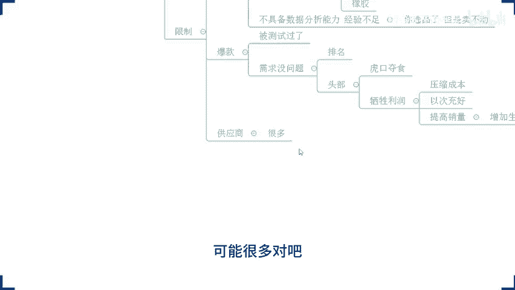
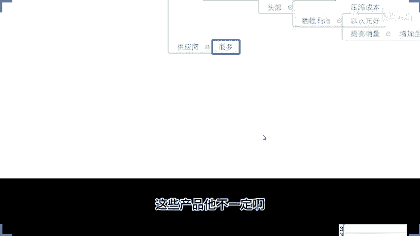
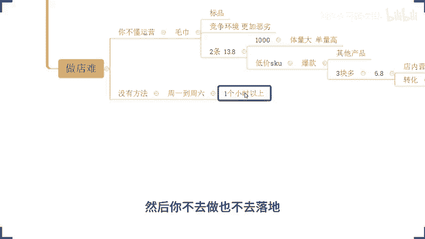

# 拼多多开店运营-新手电商运营实战指南，B站最全拼多多零基础入门教程！拼多多运营秘籍，小白也能成电商大亨！轻松上手拼多多，拼多多新手开店赚钱攻略 - P48：048 拼多多店铺运营必备 如何建立行业壁垒 - 拼多多开店运营- - BV1xms8eSEVs

那么对于整个的店铺操作来讲的话，另外还有一点要重点提醒大家一下，就是在我们整个店铺运营过程中呢。那么对于我们的店铺操作啊，对于我们的这个呃数据提升它不是说你去看了多少的视频，听了多少的直播就可以的。

而是你需要实实在在的去做的啊，所以说今天如果说你唉确实有听到一部分东西是吧，是适合你的是符合你当前店铺情况的，记得去实操啊，去实操。因为店铺数据啊，店铺数据是做出来的啊，是做出来的好不好？O三个点啊。

大家能够明白能够理解的话，公屏上呢可以打一个6吧，好不？来三个点啊能够明白能够配合，能够理解的话，公民可以打个6还有这个3分多钟时间啊，到了我们两点钟啊，还有3分钟多钟时间啊，还有3分多钟时间。

那么最后呢我再确认。一次啊，目前所有的小伙伴能够清楚的听到我声音的，能够清楚的看到我这边电脑桌面的声音各方面都没问题的话，公屏上来。小一走一波，所有人动起来，我要确认一下啊，声音的画面都没问题啊。

声音啊和画面啊和画面。都没问题啊都没问题，公民扣1啊公民扣1。OK ok ok啊，那么我就当做默认是你们都没问题了啊，这个画面都没问题，然后声音也没问题了啊。等一会你跟我讲，哎，不好意思戏喽，我看不到。

哎，我这个声音听不清楚，那是你自己的问题啊。那其实我们提前几分钟时间去开播呢，更多时候呢就是对于我们设备的一个调试嘛，对不对？那么提前把这个东西都准备好啊，把自己的这个呃设备调好对吧？OK的啊，好了啊。

😊，那今天分享内容呢叫做拼多多店铺运营必备。如何建立行业壁垒？那讲真的啊，这个问题呢，其实今天我一开始在发布这样的一个这个直播分享通知的时候呢，是有人问我的。哎楼这个行业壁垒是什么意思啊，对吧？

嗯这个我没明白，我说没关系啊，那你等会直播时你过来嘛，对吧？到时候会讲的很清楚的。他说好的啊，是这样子。我相信啊可能也有很多小伙伴呢在目前来说，对于什么是行业壁垒。它是什么意思，可能不是很明白。

不是很清楚啊，但是没有关系，等一会儿分享的时候呢，你会非常的清楚，非常容易理解到这个概念啊，并且能够去真正意义上找到你一直以来困惑的一些问题，他的一个答案是什么？好吧？那么对于店铺运营来讲的话啊。

我们能够去有到一个比较好的发展空间，能够去建立一个行业壁垒的话，那我们后续呢店铺的成长周期就会比较长，数据也会比较稳定，所以。😊，这个是我们大家需要去这个注意的一个点啊，那么。店铺操作呢？

需要我们做的东西，对运营来说其实说多嘛也不多，但是说少呢也绝对不少。但是更多的呢是一些细节的到这个地方啊，那么细节做到位呢，店铺自然而然是能够去有到一个更好的提升的啊，O啊，那么时间差不多到了啊。

时间差不多到了，那就直接开始了，好吧，那么今天呢首先开始我问大家的第一个问题，这个问题呢大家认真思考一下，好吧，把你自己认为正确答案呢，可以发在公屏上，对吧？就像我讲的啊，其罗做直播分享呢。

不会去给你们讲课件之类的东西，对吧？更多的呢是引导你们的思维的一个变化，能够去帮你建立一个完整的运营思维啊，所以这个东西比较重要一点啊，好吧，那么第一个问题是什么呢？OK来看一下。😊。

对于店铺运营来讲啊对于店铺运营来讲，那么什么是核心？啊，什么是核心啊，这个问题啊这个问题来大家思考一下啊，把答案发出来。😊，把，答案发出来啊。对于店铺的对于店铺运营来讲啊，什么是核心啊。

这个问题很重要啊，也很关键啊也很关键。虽然说这个问题非常的基础，但是我希望大家能够在第一时间把你自己认为正确答案发出来来动的快啊。如果说不知道哎，你，我对于店铺运营来说，我不懂啊，我是一个新手。

我就是一个小白，我对这个东西我完全不知道没概念的OK你可以打一个问号啊，你对这个东西没概念不清楚的，你可以打一个问号啊。然后呢，如果说你自己心里面是有答案的呢，可以把答案发出来啊。

所有人啊这个问题针对到所有人的啊，我希望你们所有人都能够去认真思考，并且呢去积极回复一下好吧，来动得快啊来。😊，呃，在直播间的所有小伙伴们认真思考这个问题啊，好吧，把答案发出来啊。

然后像这个发言人7月棒极致奋斗者野生奥特曼，对吧？还有木木啊，还有一，还有我们的声宇，还有事在人为等等啊，各位来可以开始了啊，开始你们的表演啊，把答案发出来啊，然后呢，这个那说呃是图片。

还有SKU啊打了一个问号啊，打了一个问号图片啊，SKU啊，打了一个问号啊，我也不知道你这个是为什么会有一个问号出现啊，然后棒说哎是销量。😊，呃，我不知道是不是我问题表达的一个方式。

让你们产生一些错误的一个这个理解啊。然后7月说是利润啊，利润。呃，这个我我实话说，我我不我不太清楚是不是我这个问题问的让你们产生一些歧义啊。😡，嗯。运营不是想办法搞流量嘛？

然后也是奥特曼说OK那你你所以所以说你的答案是什么呢？在运营中啊，什么是核心呢？嗯，在运营中什么是核心呢？嗯，来说一下，好吧。😊，嗯。啊，就提升转化率是吧啊，转化率啊，新息来说是转化率。嗯，然后呢。

这个SH说哎保持利润的增长哈。那各位还有不同答案吗？来可以可以说一下啊，还还有不同答案吗？😡，还有没有不同答案？然后淼淼说是这个店铺布局啊，店铺布局。还是说是浏览量啊浏览量。每一个阶段的核心都不一样啊。

O ok ok野是奥特们这样这样讲的，确实啊确实因为呃可能是我今天这个问题问的时候呢，这个没有特别聚焦到某一个点啊，我只讲是我们店铺运营中什么是核心啊，是这样一个问题。但是呢我看到你们答案的时候。

其实我已经我已经有感觉了。可能可能因为我们每个人的思想和我们每一个人对于运营的理解或者所处的一个阶段不同吧啊，所以这个答案呢确实有点有点这个千奇百怪的出现啊，好吧。

跟我所一开始预期的这个答案呢也产生了很大的一个分歧啊啊，这个有点差距点比较大啊。但是我还是想看一看你们的一个回答，对不对？所以呢呃这个就就一直在保持这样的一个节奏，问大家。😊，然后也是奥特曼说，哎。

那每个阶段都不一样啊。OK那我我问一下啊，来也是奥特曼，那你所认为的每个阶段不一样，在我们新店开店的时候，什么什么是核心呢？你可以说一下啊，你可以说一下啊，好不好？也是奥特曼，你可以说一下啊。

然后其他人啊其他人啊，那么如果还有要补充的啊，还有什么答案要补充的，可以把答案发出来。😊，如果没有的话，公屏上呢可以打一个一好不好？如果说就像我说的，你对这个问题呢，你是没有概念的啊，哎。

为什么我这数字键啊ok有点有点不太好按啊。如果说你对于这个运营的是完全不理解的，O打问号啊，打问号就好了啊。如果说有答案的呢，可以把答案发出来啊，动的快。所有人啊再次确认一次啊，有要补充的。

可以把答案发出来，没有要补充的O的，觉得是这样子的，扣个一。然后对于对这个问题没有答案的，问号走起来啊，再确认一次啊，再确认一次。如果都O了，都没问题了。那我们就开始分享啊。😊。

OK奥特曼说我现在的这一个情况呢，就是想要去搞流量，搞转化。好，那大概知道了哈。😊，那么对于我们店铺运营来说呢，确实就像我们也是奥特们说的一样，对吧？在每个阶段呢会有每个阶段的核心跟重点。

我需要有到一个主要的这个运营方向。但是在对于店铺运营来说，我们真正要去做到的核心啊，在不管你是在任何阶段啊，听清楚啊，不管你是在任何阶段，其实我们都可以用一个东西来概括啊，什么东西呢。市场。占有率。啊。

我不管你在任何阶段，对吧？那我一开始做新店的时候，我也要我要想去突破我的数据，那我要打开我的市场啊，对吧？我在后期店铺运营到一定阶段之后，我要保持我的数据增长也好，我要去让我的数据维持稳定也好。

那也是要去把控住我的市场，对吧？😡，这个没毛病吧。那么在整个这个过程中呢，前期也好，后期也好。那不管你是属于什么样的一个阶段，在数据层面上来讲，我们说我们需要去能够有到流量，有到转化呃。

能够保持利润的增长，能够有到一个呃比较好的这个呃销售数据，对吧？哎，那么这个过程中呢。😊，能够帮助我们实现这些数据的基础。那么也就是我们所认为的另外一个核心板块，就是我们的产品，各位同意吗？

刚刚我这样讲的话，大家能够理解觉得确实是这个逻辑的啊，同意的话，公屏上可以扣个6好吧，这个不是什么运营技巧啊，这只是最起码的一个基本概念而已啊，也不是什么高深的技术，对吧？

只不过呢是跟大家去探讨这么一个逻辑在里面啊，能够让他去更好的融入进来啊。那么在这个过程中，我们说产品很重要，对吧？唉，你们也应该经常听到人说吧，对不对？哎，在我们做电商也好，做什么事情也好，对吧？

那么产品是核心啊，你产品能够有到一个好的产品的话，你才有到好的市场，包括说我在分享视频的时候，也经常说到货，哎，我们要去做好一个店铺的话，产品很重要，对吧？为什么呢？有句话啊，我再次强调一下啊，那么。

😊，三流的产品啊三流的产品。需要一流的运营。注意啊，而一流的产品。😡，只需要三流的运营。各位。明白吧？那如果说你现在对于店铺运营来讲，你的能力啊，你的运营技巧。

你的营销技巧等等这些手段相对比较薄弱的话啊，那我默认啊可能你是属于一个三流运营的一个角色，对吧？那么这个时候呢，你想要做好店铺的话，你可能就需要一个一流的产品去给你。是不是？那么这样呢。

你才能够去在做的过程中，可能更容易成功，能够更好的打开市场，对吧？OK现在人说哎，那什么叫做一流产品对吧？什么样的产品才是一流的对吧？这个问题呢？OK首先我们一起来探讨一下啊。

首以我们一起来探讨一下来你们的店铺。😊，商品是哪里来的？是自己去通过市场分析找出来的，扣个一啊。是。😡，随便的啊去呃网上看到了一些所谓的爆款。OK那么你扣个2。啊，你扣个2，然后你自己是厂家的。

你扣个三啊，厂家啊扣个3啊，来，我看一看你们你们的一个情况啊，好不，来那么快。😡，来，其他人呢其他人呢直播间这么多人就只有这几个是是有在做的吗？如果说你没有在做啊，你说H7楼，我现在店铺还没开。

我还没没有产品OK打问号。😡，好吧，还没有开店的啊，没有做的，没有开店啊，打问号。😡，那么针对到我们不同情况，实际上我们需要注意的事项是不同的啊。所以这点的话，我需要知道你们的一个状态啊。

如果说你们是呃有去做过一些分析的对吧？然后或者是有去找到一些所谓的。爆款的OK那我们可以以这个角度来出发来去分析来去分享啊。如果说你们是厂家的OK那我们从厂家的角度来去分享，对吧？啊。

那么不同的角度我们去选择我们后续经营方向是不同的，包括说你说我还没开店，对不对？那么也是不一样的，好吧？OK的啊，OK的啊，呃，有厂家啊，厂家有蛮多的啊，然后呢，也有很多小伙伴呢是跟款的。

找到一些平台的一些爆款，对吧？然后呢呃有小伙伴说哎我就是个分销，对吧？我就是个分销。所以说你是呃完全没有说是选品之类的对吧？你只是说供应商给你什么，你就做什么，对吧？😊，是吧那么这种情况的话。

你们可以扣个4好吧好啊，你也不是厂家，也不是什么去找爆款，也不是自己通过数据分析去选品的对吧？你就是有个一个对接的一个供应商，他给你什么，你做什么，那么这种情况扣个4好吧，来啊，再确认一下，再确认一次。

好吧，动作快啊。😡，工作快啊。好啊好啊好，那么大概呢情况呢我都清楚了啊，大概情况呢我都清楚了。而且这个扣4的还这么多啊，我我真的没想到，我真的是没想到啊，我真是没想到会有这么多扣4的。😊。

这个这个有点有点有点过分了啊，有点过分了。好好了，来来来来来来。😊，啊，我我问我问大家一下。😡，哦，你们是自己去做数据分析的，去去分析过市场的对吧？了解过市场体量的啊，有一有一部分小伙伴是这样做的对吧？

然后呢，有一部分小伙伴呢是做了一些平台的爆款，有一小伙伴呢是找到一些供应商给我们供应的一些产品，对吧？他给了我们我们自己去做，然后还有一部分小伙伴呢自己是厂家来的对吧？我店我这个工厂呢就这些货。

就这些品，那我去放到平台去卖，就这么简单，我通过线上呢去拓展我的市场，对吧？就这个情况啊，那么大概是这个意思。然后还有部分小伙伴呢可能就比较少个别的啊，是还没有开店的啊，那么对于我们店铺运营来说，😊。

这些个情况它是客观存在的。但是不管你是哪一个情况，你的产品都会在平台形成竞争关系。是不是你的竞争关系会一直存在的。😡，那么这个时候我想问一下，你们的优势是什么？😡，嗯。

你们跟同行其他的商品你的优势是什么？这个问题思考一下，好吧，换句话说，你。😡，凭什么啊认为你可以成为爆款？这个问题啊，大家认真思考一下。如果说这个问题你没有想过的那我只能这样跟你讲了。

你凭什么能做好店铺呢？😡，对吧OK有小伙伴说，哎，我优势就是价格，我价格便宜啊。😡，可以啊，价格优势在平台上呢，目前来说可以这样讲吧，算是一个具备绝对统治力的一个东西，对吧？然后这个呃发言人说，哎。

我自己有货啊，我这个价格我也我也有优势，对吧？哎，不错啊，不错啊，可能是厂家吧，对不对？发言人你是厂家吧，对吧？来。😡，啊，发言人，你是厂家吧。嗯。你是厂家吗？发言人。我记得你之前说的是呃。

你是去平台上找了一些爆款是吧，做跟款的嘛？啊，不是厂家对吧？啊，那你这个这个价格优势是怎么建立的呢？😡，嗯。😊，你的价格又是怎么建立的呀？😡，对啊，比较单纯的比较好奇啊，单纯的比较好奇。抢货啊抢货。呃。

🤧嗯。那这样子啊这样子呃。今天的话我先说一下本身的话这一个呢我我也我也说过的，我我不是我不是给大家去上课之类的啊，只是一个分享啊，只是一个分享。那么呃。所以说今天呢有到像这个发言人这种情况呢。

我还是比较好奇的，好吧，所以我还是挺希望说能够看到发言人的店铺啊，然后呢呃一起来探讨一下这个话题的。刚好呢也是刚好是符合我们今天讲的这一个分享的这个话题的主主题嘛，对吧？😊，啊，他垄断啊。

我不相信这个市场上有垄断，尤其他还不是厂家啊，尤其他自己不是厂家。这种情况的话呃，垄断有点不太现实啊。当然呢，除非就这个产品啊，除非就这个产品呢，实能是呃有一些什么核心科技，核心技术在里面，对吧？

但是在拼多多，你说这种产品啊有点不太现实，是不是？啊，对啊，不可能垄断的啊，这个不可能垄断的啊。啊，吹谁。那呃范先生方便吗？我想问一下方方不方便啊，方不方便？方便的话。

可以可以我把二维放二二维码放出来之后扫一个码啊。我们我们看看你店铺的产品，然后一起来聊一聊这个话题方便吗？因为你这个呢可能在某种意义上来说啊，是比较有优势的一个市场，对吧？你可能也不太愿意给别人看啊。

所以我先征求一下你的意见啊，如果方便呢，我们可以拿来探讨一下啊，如果不方便就算了啊，如果不方便就算了。这个东西不强求啊，不强求，好吧。😊，价格再低也低不过厂家啊，确实这样子的啊。而且就算不是厂家。

我跟你们讲啊，就算不是厂家，也会有也会有到很多的一个这个商家啊，他们会特别变态的啊，会把这个价格打的很低啊，也会有的啊也会有的。😊，啊，也起大家好奇心，我我都好奇的我都好奇的。因为他首先他不是厂家。

他是去跟款跟爆款的啊啊，方便算了啊，方便算了啊。然后呢，他跟我讲他有货啊，然后有价格啊，我就觉得很好奇。那还还有一种可能啊，可能就是这个以时充好的啊，有这种情况啊。

所以他还他他才会有到一些呃价格方面的优势，或者是能够去就说吹谁的。😊，不要这样子去揣测人家嘛，对不对啊，不要这样揣测人家啊，不不一定啊不一定啊啊，O啊行了行了行了，那既然这样子我们就不去耽搁时间了啊。

好不好？各位啊，我们我们就我们就不去耽搁时间了啊，兄弟们啊，看来有点东西是吧？那不知道啊，这个就不知道了啊，好了啊，那么呃我为什么要去讲这个话题呢？我为什么要讲这个话题呢？因为首先第一个点。

各位我要跟他家确认一个事情，就是我们想做好店铺啊，如果说在前期的时候，你没有一个好的产品的运营的思路，你没有一个好的产品定位，那么你在做的时候，肯定会受到很多的限制啊，这个是肯定的。😊，啊。

这是肯定的啊。比如说第一种对吧？哎，你说我有去做过一些数据分析，来，刚刚是有扣过一的，说去做过数据分析的人是哪一些？来现在公屏上打一个8好不好？我看一下啊，好不好？来，现在公屏上打一个8。

就是第一种情况是有做数据分析去选品的，供屏上打一个8。😊，啊，然后来重点来一个一个来跟大家讲一讲这些限制是什么。那我们应该怎么去调整它，好不好？😡，OK啊，那么第一个情况啊，哎。

我自己呢现在去做了一些数据分析，我去通过我自己的一个呃这个定义啊来做出的一些爆款的预测啊，找到了一些潜力爆款，对不对？那么兄弟们记住了啊，这一个东西呢，首先第一点呢，它需要一定的经验。😊，啊。

他需要一定的经验啊，第一种啊第一种分析这种啊他需要一定的经验啊，这是必须的。除此之外呢，他还需要有到一个比较好的数据分析能力。啊，另外一点的话，更加重要的一点是啊它还是有赌的成分的啊。

它有赌的成分在里面的。为什么这样说呢？因为拼多多的数据呢，它是不公开的。😡，啊，他是不公开的啊。如果说你们是借助的一些所谓的第三方的软件去做的这个所谓的分析的话，OK那么我告诉你这个数据完全不可信。

没有任何的可信度啊，没有任何可信度的。因为拼多多官方数据它是不不按这个去去做对接的啊，那么你们所看到的这些所谓第三方的数据呢，只是。😡，通过爬虫数据软件啊去爬出来的些数据，甚至于更多时候呢。

我称之它为什么自嗨。好吧好。😡，他根本就没有任何的数据依据的啊，只是通过自己的对于前端数据的一个一个记录啊，更新数据的更新来做一个预测而已啊，是这样子的。所以这种情况啊。

如果说你是借助第三方的工具去做的。OK那抱歉啊，不行的，那么有什么样的方式可以让我们在分析的时候呢，更加的严谨一点，或者更加的具备一个呃科学的依据呢，O我跟他说一下啊，那么道理很简单，你就只能是下苦功。

啊，只能是下苦功啊，花费大量的时间跟精力啊，原来这样子是吧，那必须这样子的，你们有你们有没有这样的，就是你明明看到说这种软件里面说哎这个产品就是一个呃这个南海产品。😡，对吧一些数据分析软件经常给你们推。

哎，某某产品是哪儿产品。哎，你去上架产品了，你上架之后，你发现没流量。😡，有没有来，各位有没有这种情况的？有的话，公屏打个一好不，有的话公屏打个一。😡，如果说你是有遇到这种情况的，公屏打个一，好吧。😡。

所以说这种情况的话就很常见，也很现实。你如果说依赖这种所谓的软件，所谓的这种工具去做这个事情的话，OK了，扯淡啊，你根本不可能做的很好。因为什么呢？你们想一下啊，说我说句我说句这个可能比较伤自尊的话啊。

但凡是脑子正常的人，他都能够去用这些东西去看出来这个所谓的所谓的产品是个男孩，对不对？那么既然说所有人都能看得到，都能知道的话，那你觉得他可以是男孩吗？他可能是男孩吗。😡，对吧。能能懂这个逻辑吧。

那么这种情况，你说他是男孩，说出来你自己都不信吧，对吧？😡，而且更重要的是，平台发展这么多年了，真的还有什么所谓的南海吗？我跟你讲，现在已经没有真正意义上所谓的南海了。

更多的呢是去深挖细分的产品的人群和类目啊，细挖这些需求，然后去做一些红海市场里面的蓝海需求产品啊，是这样子的啊，那么这个下苦工怎么去下呢？我给大家举一个最最简单的例子啊。

当然这个东西呢像很多的数据分析软件，他们也是这样去玩的？其实啊怎么玩呢？来我给大家举一个例子啊，比如说今天我对某一个产品感兴趣啊，什么产品呢？呃假如说啊假如说是这个这个这个这个个这个篮球吧，好不？

假如说是蓝球，好不好？哎，红海和蓝海什么意思啊，我的天。😊，啊，这个问题问的好啊，有有没有其他人不知道的，洪海和南海什么意思？😊，啊，对吧？是的，一般赚啊赚钱东西一般不会公开的。大家都看到基本不赚钱。

对，就这意思啊，就这意思。来啊呃，洪海跟南海有没有其他人不知道的？😊，嗯。😊，红海跟南海还有有什么其他不知道的？呃，这样子吧这样子吧，我我给你我给你举一个举个举个例子啊，我给你举个例子啊，这个还是知道。

对不对呃，像我们像我们。😊，在这个呃。呃，这个这个这这个比比如说啊比如说这个雷达啊，比如说雷达对吧？它在监测到有目标的时候啊，对吧？我给你举个例子啊，雷达在监测到有目标的时候呢，它会形成一个红点，对吧？

它会形成一个红点啊，然后呢，在你整个的界面里面啊，如果说没有目标，对吧？那么这个地方呢就是一片蓝汪汪的东西，对不对？啊，那么这个蓝汪汪的东西呢，就是我们所能够占据的市场份额。那如果说有竞争对手进来了。

那么你的红点就会变多，又又来了一个又变多一个。当这一个整个界面上全都是红点的时候，那么这一片海洋里面全都是你的竞争对手的时候，全都是你的同行的时候，你的机会就变少了，能够理解吧？😊。

那么同时呢需求它是固定的，对不对？需求是固定的。那么如果只有你一个人的时候呢，那么你在做的时候，它的市场份额就会比较大。如果说做的人越多，那么你们每个人分割的市场份额就越小，你的机会就越小，就这意思啊。

就这意思，你可以你这样理解，你可以理解为红海就是你去做的时候呢，竞争压力很大，竞争的人很多，很难做起来。蓝海就是只要你是个产品发布出去，那么你就能卖货，就能卖的很好好吧，你可以这样想啊，可以这样想啊。

OK那么我们现在来举例子啊，我们说篮球啊，好不好？各位。😊，篮球这个东西应该都熟悉吧，对不对？😡，呃，不管你是男生还是女生，对吧？不管你是这个成年人还是未成年，我相信对篮球都应该熟悉的啊。

我们先不说你打的好不好，对于这个产品应该熟悉的对吧？啊，他就是一个球，对吧？他就是一个球。这个解释很完美啊，它就是一个球啊。那么呃对于篮球这个产品呢，如果说今天我们去经营它，对吧？

如果说我们今天去经营它啊，好，打个比方，那么它是会有到正常的正常的这一个呃比赛级的对吧？比赛级的。😊，对吧正常的比赛级的好不好，是不是还会有到这个呃分年龄段的对吧？可能有有这个成人的啊，有成人的啊。

有成成人的成人使用的啊。😊，啊，有这个小孩子的啊小孩子的啊，有儿童的。对吧有儿童的啊，然后呢还会有到什么呢？如果说我们按照按照这个材质分的话啊，它有不同材质，对不对？有皮革的啊，有橡胶的。😊，各位啊。

这个这个都都明都明白吧，都没问题吧，这样的一个分类大家都清楚吧，没问题，能够明白公屏扣1。😡，啊，能够明白，没问题，公民扣一。动作快啊动作快。那么这个如果说都明白的话。

那我们来说一说这个下苦功的苦功怎么下啊。假如说今天我要去做篮球，对吧？好，那我就去搜一搜篮球啊，我搜完篮球之后干嘛呢？哎，我去看一看啊，在这个市场里面都是哪些产品在卖，卖的是比赛级的呢？

还是卖的是一些就比较常规普通的啊，卖的是成人的呢，还是卖的是儿童的，对吧？那么材质呢是皮革的呢，还是这个橡胶的，对吧？😡，各位能懂吧？那么呃包括像皮革呢，它有这种光面的，也有这种磨砂的这种感觉的对对啊。

有这种这种产品的材质的啊，那么呃尺寸不同啊，材质不同，对吧？包括还有甚么品牌不同啊，还有使用的人群不同，那么它就可以拆分成不同的市场。如果在这里面啊，今天我们说我们看啊这个篮球这个市场里面呢。

我们就收了之后，90%的销售的商品呢都是成人的，只有10%的产品呢是儿童的。那今天我去做的话，我可能会认为做篮球的时候呢，我。😡，做成人的市场份额会更大一点，机会更多一点。😡，各位能懂吗？😡。

这个应该没问题吧。这个也没问题吧，对不对？那么但是有一个问题在这里有很很重要，就是哪怕有90%的都是成认的呢？那我还要去细分在这个市场里面又会有到什么样的一个材质，什么样的品牌等等啊。

那么在这百90%里面啊，比如说皮革的。😡，啊，皮革的啊他又占了70%。啊，皮革的占70%，然后橡胶的呢占了30%。对吧现胶的在30%。那么这个时候其实往后越来越细分，越来越细分，对吧？

通过人通过这个使用的场景，通过我们的这一个材质等等，一步步往后细分细分出来之后呢，就可以找到真正意义上。那么在市场里面占比比较大的这种产品。😊，对吧。那么这个时候呢，我们在做的时候，哎。

我可能说对于新手来讲，我去做的话，我要考虑到我去找到的这个市场范围。这个它市场容量是足够大的。所以会优先考虑比较大的这个市场体量的一个产品。因为它的机会可能会更多一点，对吧？

但同时呢我要去知道的是我能不能对接到类似的货源，并且在这同样的产品里面，我能否有到一定的竞争力。啊，我能否有到一定竞争力，各位这个这个这个能理解吗？嗯。😡，比如说我们今天就讲到这个地方，对不对？

我看到儿童的只有10%呃，成人的有90%。哎，我选择做成人的啊，那么成人的里面呢，它里面会有到材质，杨种，对不对？皮革的占70%，相橡胶的30%。嗯，那我选择做皮革的。但在皮革里面呢，我们去看一看啊。

那么这些人他们都是卖的。😊，啊，什么价格对吧？卖的什么价格？那我去对接货源的时候，我的货源的价格是多少啊，货源我能不能找到啊，找到的价格是多少？那我有没有利润空间，我在做的时候呢，我这个呃这个成本。

我要去拿多少的利润啊，加上这个利润之后啊，我能够去经营的话，那么我们对同行来对比。😊，产品有没有优势，对吧？我要告诉我的消费者，他能选我，而且选我的话是有有好处的。那么这样呢，我才能够去卖得动我的货呀。

对不对？不管你后期怎么卖，你始终得转化，对吧？各位。😡，OK的话能够明白扣1。啊，这个就是一个比较简单的一个逻辑，对吧？而我们在这些数据分析软件啊，如果说做的比较优秀的话。

它也会这样子去细分出来每一个数据，然后再进行筛选，得出一个这样的一个结论啊，是这样子的啊。那么这是分析。但是你们本身很多小伙伴呢不具备。数据分析能力。同时呢，你的经验不足。

在我们平台数据不公开的情况之下，你经验不足的话是一个非常致命的弱点。所以就会导致一个问题，就是你选品了，但是啊卖不动。😡，啊，这就是很严重的一问题。好不好？OK那么再来说一说跟爆款的这种情况啊。

跟爆款这种情况呢，有没有好处有好处。😡，那么好处什么呢？好处这个产品已经被测试过了。对吧他的市场需求肯定是没问题的。所以说我们去做的话，它的市场体量是在那里摆着的。我们能够去把产品的排名打出去。😡。

那我的产品呢就有机会卖的很好，但是呢它的难点也在这个地方摆着的。因为这种产品呢它是爆款，所以一定会有到一些头部商家已经卖的很好了。那么我们去做的话，相当于就是虎口夺食。那么怎么躲呀？大部分情况下呢。

就会说我们去牺牲。利润对吧？然后呢，把排名先做出去，把销量先打出去，然后再想办法压缩成本。啊，是不是来，我问一下这个奥特曼，你是不是这样玩的？😡，你是不是这样玩的？😡，对吧因为跟款嘛。

你你能够去跟款做爆款的话，这个时候产品的话，平论上肯定是已经有很多产很多很多这个同行的啊，那么压缩成本最简单的方式。😡，以是中好。啊，然后再正常一点就是再健康一点的呢，就是通过要通过我们的提高销量。

去什么增加生产力。啊，增加生产力。然后来降低我们的生产成本啊，这种情况。但是如果说不是厂家的话，这种情况可能用不到啊，那么更多呢不是厂家情况下呢，就是以之送好了，对吧？所以这个情况来的啊。

那么再往下我们再来分析，就是我们讲的供应商的这种情况。你们供应商给产品的这种情况呢，是大多数今天在直播间里面就是这种情况啊，供应商啊，那么这种情况有一个问题，供应商给我们的产品呢可能很多，对吧？

也可能就那些但是有一个点就在于什么呢？这些产品它不一定啊，它可能很好，可能很好，但是不一定适合拼多多。😊。

如果说它适合拼多多，如果说他在平台上确实有一定市场体量OK那么我们就要想办法去把我们的市场体量做出来，并且能够去有到更好的平台推荐群众啊，那么这就可以了。那如果这个产品是有一定的啊市场体量的话。

只要我们的价格不是特别的奇葩，对吧？只要我们能够去做好方比价。那。房比价啊，那么在操作过程中呢，也不会说有太太烂的一个效果啊，是这样子的。那么再来说一说最重最终的一个情况，厂家对吧？

厂家呢因为受到自己产品的限制，可以说是有好处啊，也可以说是有坏处啊，如果说厂家我们可以换句话说，它就是供应商的一个开店而已，对吧？它的产品是符合市场的，那么它本身自己是厂家的话，优势就很明显。

但如果说它的产品呢没有优势，没有去体现出我们的竞争力的话，O那么就很难。而大多数人在进行产品运营的时候，不会自己建立优势。这个是很关键的一个点，甚至不懂得哪些产品能够去更好的迎合市场，这就很关键，对吧？

😊，那么现在呢我们再回过头来说一说。什么叫做行业壁垒？好吧，把我们这里啊产品哪里来了，这个问题解决掉之后，我们再回来说一说什么叫行业壁垒啊。我们讲做生意啊，兄弟们一定要做有门槛的生意，对不对？😡。

这个这个话呢我相信你没有听过啊，也有很多人这样去做，对吧？于是乎呢有人选择去做药品，对不对？有人选择做药品啊，有人选择去做什么呢？呃，做这个书籍。😡，对吧书籍。啊，有人选择去做这个农资，对吧？

等等对不对啊，都有的都有的对对对对对，都有的啊。那做这些的原因为什么呢？因为这些东西呢，它可能比较需要一些资质，相对于比较麻烦一点啊，不是说什么人都能开店，或者是开店的时候呢，很多人他嫌麻烦就不去做。

于是乎感觉这个东西呢，他做的时候呢，有门槛，所以机会会更多，对吧？竞争对手会少，但是实际上啊但是实际上高客单价的是吧？也是这样啊，你这样，但是实际上我告诉大家，不管你做的品类是什么。

不管你做的产品是什么，在当下这样的一个大环境下面啊，已经没有什么绝对的南海不南海的问题了，只要你不具备运营能力，你做什么产品，它依然是一个非常残酷的，非常严酷的这样的一个竞争环境，知道吧？

你没有运营能力的话，你想把店铺做好的话，它门槛再高。那么对你来说它仍然是一个。😊，啊，很难成功的。各位。😡，能够明白能够理解公民打一好不好？能够明白能够理解公民打一啊。那么我们怎么去做好店铺这个东西呢。

是我们一直以来作为运营也好，作为这个新手小白也好，比较关心的一个话题，对不对？OK那么现在我就来问大家一个问题。就像我们的野生奥特曼，他应该是比较有发言权的啊，他应该是比较发比较有发言权的啊。

你们在做店铺的时候，你们一开始去各种分析了，对不对？去找了很多的爆款，或者做的很好的一个潜力爆款的分析，或者去供应商给了你产品之后，你去上架。各位，我想问一下，你有没有发现？😡，啊，有没有发现一个问题。

什么问题呢？你的进价啊你的进价。啊，你的进价比别人的。卖价啊卖价啊还要高。啊，这个问题所有人我相信都有看到过吧。不管你是拿货的还是厂家，对吧？应该都有遇到过吧。😡，有没有遇到过？😡。

有没有遇到过来有遇到过的供应商打个有好不好？😡，嗯。😊，有是吧，其他人呢？😡，都有遇到过嗯，都有遇到过，还有更多人遇到吗？来我看一下，或者有去关注过这个事情吗？😡，那，现在问题来了啊，现在问题来了。

那这个这个问题我讲完之后啊，这个问题这个问题我讲完之后可能啊呃可能会会让这个呃野生奥特曼啊可能会跑过来骂我啊，我我我猜测有这种情况，有这种概率啊，因为这种操作，今天我一分享完之后呢。

可能就相当于在砸他的饭碗啊，因为他玩的套路可能就被我讲透了啊，他玩的套路可能就被我讲透了。当然啊也有可能啊他玩的套路跟我说的这个套路不太一样啊，啊，那就问题不大了啊，那如果说一样。

我这里也是奥特曼我先说一下啊，那如果说我分享的这个方式，分享的这个套路跟你现在用的方法是一样的。那么呃请你原谅我啊，请你原谅我，我先说一下啊，因为这只是一个分享而已啊，好不好？只是一个分享而已啊。

没有别的恶意啊，好不好？那么来啊。😊，遇要这种情况怎么办？我问一下。😡，遇到这种情况怎么办？哎，我的拿货价比别人厂家比别人的这个发货价比别人的卖价啊还要高。这种情况怎么办？各位，你们会怎么样？😡。

注意啊，已知这个产品呢确实有市场啊，这个产品确实有市场啊。那么这种情况呢，你的价格很贵，你怎么办？😡，思考一下啊，然后呢把答案发出来好不好？放弃了是吧？哎，有多少人选择放弃的来选择放弃的打一个2好不好？

选择放弃的打一个2好不好？来动快啊，我看一下啊看一下啊，我看一下，哎，如果说对这个东西你觉得就没法做，放弃了。你打一个2啊，或者你对这个东西，你觉得我我自己就是新手，我完全没概念。

我不知道怎么玩OK也可以打一个2啊，动快，我看一看啊，所有人动起来啊，好不好？有答案的自己有想法的，可以把答案发出来，让我清楚知道你们的状态。😡，不然的话，我是没有办法继续给你们分享的。😡，啊。

动么快啊，直播间这么多人，兄弟们，你们就就这几个在认真听我这个问问题吗？在跟我沟通互动吗？啊，如果这样的话，那你来直播间干啥呢？对不对？这就很尴尬啊，兄弟们。😡，可以把你自己最真实想法说出来啊，好不好？

如果说不清楚，如果说你觉得你你想放弃，OK扣个2。😡，好啊好啊好，刚刚我们不是一开始的时候就讲到这个词吗？行业壁垒对不对？来，现在你们知道什么叫行业壁垒了吗？😡，就是增加别人进入这个市场。

进入这一个行业的门槛，或者给他塑造一个障碍。给他建立一个障碍。能能明白吧？各位能听明白吧？这个就是制造障碍啊，好吧，这就是制造障碍。然后呢，对于我们店铺运营来说啊，那么你能够去把你自己的产品卖出去。

同时你要抵御后续的竞争风险，这个是最重要的啊，你能把产品做起来。😡，这个算你有一点本事，但是不是真本事。你真正有本事是什么呢？你能够守得住。啊，你能够守得住。啊，你能够手哎，怎么老是打错字啊？啊。

你能够守得住这个才是真本事，知道吧？价格低五节是吧？好。😡，好好好，来啊来啊。😊，嗯，来，我问一下我问一下。我问一下呃，这样子这样子我问一下哎呃，雅欣。😊，亚欣。雅西在不在？😡，在不在？😡。

刚刚你是有说这种情况你会放弃了，对不对？在是吧？OK啊，那么呃雅新呢，我给大家介绍一下雅欣啊，雅新呢他自己啊本身对于电商运营呢是基础基础比较薄弱的啊。但是他哥呢跟他一起呢就就就就不知道怎么想的。

就突然一下就说想要做电商上来就砸了10万啊啊，反正十多万吧啊。😊，反正反正反正十多万啊反正十多万，对不对呃，去找工厂代工，做了一大批的猫砂。对吧。现在能不能做起来，不知道。😡，啊，现在能不能做起来。

不知道啊，其实我还想问一下，能不能直接去他那里买货进货呃，这个东西我觉得你你想多了，因为他就是在厂里代加工出来的啊，成本成本正常来说不会太便宜的。😊，我给你这样讲吧，成本正常来说不会太便宜啊。好吧。

那么呃这种情况啊，这种情况产品卖卖的出去是一回事，对不对？然后卖的出去的同时，有一个非常重要的点什么呢？就是比如说现在我们这个猫砂做报了。😊，当你真正在开始报单的时候。

你就会发现有很多人跑过来跟你竞争了。😡，对不对？那么这个时候怎么办？如果说你没有办法抵御这个竞争，那么只会导致一个问题，就是你。😡，被别人干死对吧？你会被别人弄死啊，弄死弄死你了之后呢哎。😡。

弄死你了之后呢，他就可以什么抢占你的市场的数据，你的销量就被他抢走了，对吧？像刚刚一开始的时候呢，呃，这个也是奥特曼啊，他不就是这种情况吗？哎，我看到别人是爆款。我看到别人是爆款啊。

那么这个产品卖的很好。😡，我就跟着去做。😡，如果说这个产品他能做的情况之下，我能够去有到更多优势去做的话，OK那么市场就是我的了。😡，对吧这就很现实的问题。那么这种情况是比我们一开始看到别人价格高。

我们去呃这个放弃它要更惨的一个事情。就是我能够去你已经开始做了，并且能够做起来了，对吧？后来被别人强调去了，各位这个这个意思他能懂吧？就是我我要强调的什么呢？😡，打江山其实可能有的时候容易的。

真正难的是守江山啊，就这个意思。😡，啊，那么做电商一样的道理，对不对？你能够去把产品做出来，能够去把货卖出去，是你的本事。但是你能不能一直卖，你能卖多久，这个就是要你能够去把市场锁住了啊。

而行业壁垒呢就是能够去建立这样的让同行进来。😡，让同行进来的时候。望而生畏。对不对？就跟你们一样，哎，我的天，我的进价比别人的卖家还P还要高，对吧？我做不了算了，不做了，那么他就放弃了啊。

你就可以能够什么能够一直在这里做，或者是你能够减少一大波的跟你竞争的人。😡，啊，那么怎么去做呢？各位。😡，来。你们做什么产品的？你们做什么产品的？来，我问一下你们做什么产品的？我问一下。

我来我来拿你们产品来举个例子啊，我来拿你们产品举个例子，好不好？😡，图书。O。就来说图书吧，好吧。图书啊，其实产品是什么不重要啊，重要的是能够把这个逻辑搞清楚啊，好吧？产品是什么可能不太重要。

重要的是把逻辑搞清楚啊。那现在呢所有人啊现在呢所有人有在认真听的，现在赶紧公屏上扣一个一啊，我确认一下。那么这一趴如果说你没有认真听，你也没给我反馈，你说等一会儿你讲，哎，希统我没有听到，我没听清楚。

啊，你能不能再讲一次，一边玩去。好吧？我只能这样跟你讲了啊，我尽可能的能够在有限的时间里面帮大家把思路理顺，能够尽可能多的把能够分享内容给大家分享的更多更清楚更清晰。但是呢你自己要认真，你自己不认真。

你又不愿意配合，对吧？你说让你扣个数字，你又不扣，那分享过来之后，你说哎统我没听到，你再讲一下好不好？一边玩啊，一边玩啊，好吧？那么来啊图书这个产品按照正常来讲。😡，如果说我们去进货。啊。

如果说我们去进货啊，那么就是几个这种呃图书的这个网站啊，这个这个网站呢呃我相信应该都清楚的啊。如果说不知道的，可以下播之后再问我都都没问题啊，相对来说它的价格啊，相对来说它的价格是固定的，对不对？

相对来说它的价格是固定的啊，对吧？相对来说价格是固定的啊，那么也会有到一些价格真的很低啊，也会有到一些价格真的很低。比如说我随便举个例子啊，今天呃我去卖了一个什么这个呃，考证的一些辅助的一些工具书啊。

工具书。😊，啊，我去买我去卖的是一个什么这个工具书啊，这种呃这种东西啊，它的价格呢是很固定的，对不对？😡，那么我去做的时候呢，比如说这个产品我拿货价啊，听清楚啊，比如说我拿货价啊。😡，20块好不好？

比如说我拿货价20块，这个时候我们就会发现你有同行，它的售价就是卖的19。9块啊。😡，啊，这个是我们自己啊我们自己卖的是20啊，我的拿货价啊拿货价20拿货价20啊。那我想盈利的话啊，我想盈利的话。

我肯定得卖20以上。😡，か吗？啊，其他人卡吗？现在怎么样？😡，现在怎么样？现在好了没有？😡，现在好了没现在好了没？卡了吗？现在好点没？我我这边刚刚确实有看到这个弹窗啊，说这个网络这个延迟性质比较高啊。

现在考还现在好了是吧？现在好了是吧？OK ok ok ok好事多磨啊，好事多磨。呃呃，这个这个这个这个这个坠落轨迹啊，你这个问号是是怎样？😊，你这个问号是怎样，是是哪里不清楚吗？😡。

我刚刚我刚刚是讲到说哎，我今天去进货了，对吧？我去我去卖这个工具书啊，我去卖工具书啊。那么我自己的这个定价呢，OK因为我的我的拿货价啊是20块，所以我想要盈利的话，我肯定要做到20以上，对不对？😡。

各位能懂吗？我要去盈利，我要做20以上，对吧？这个应该都好理解的啊。呃，没问题吧，到目前没问题的话，公屏扣个一啊，所有人确认一下，没问题，我继续往下啊，没问题，我继续往下啊。

因为我不确定你们是哪个地方开始的，开始这个没听清楚的啊。😡，O ok ok ok ok。😊，那呃其他人没有回复的话，我就默认是都可以了啊，好不好？好来啊，继续。😡，那么这个时候我们自己去上架做的时候。

发现哎，我要做20的话，我要做20以上，我才有利润，对不对？我可能说我做25、28、29、30对吧？都有可能，但是不是我想做多少钱就做多少钱。😡，对吧我如果说可以的话，我能做1000块钱，可不可以？😡。

但是市场不允许啊，对吧？市场不允许啊，你的买家不买单没用啊，对吧？你给他写个1000块钱行不行啊，买家不买单，你卖给谁去啊，没有意义，对吧？那我首先得保证我的产品是有人买。😡，那么他的产品价格呢是符合。

市场啊能够去满足用户需求的啊，是这样的一个情况的这个前提是在这你的啊。那这个时候呢我我发现一个问题就是哎我拿货的这个产品，我的同行。😡，啊，我的同行对吧，他的卖价呢19。9块。😡。

就是我们刚才说的这种情况，对吧？哎，他的这个卖价呢比我的进货价还便宜。😡，啊，他的卖家呢比我进货价还便宜，那怎么办？😊，OK的啊OK的。那么这个时候。😊，其实有很多种方法。

当然图书这种产品呢还是比较极端的啊，图书这种产品是比较极端的啊。那我们就要去问啊，我们就要去问我的供应商了，那这个价格是统一的这个呃代发价格，还是说有有下降的这个空间的啊。比如说我一天卖个20个。

我一天卖个50个，或者我一天卖个100个，它还有没有下降的空间，我还能不能把这个成本压的更低一点，你要提前去跟你的供应商沟通。😊，各位能懂吗？😡。

能够明白公平打一啊能够明白公平打义这一个你要提前确认好的。假如说啊假如说现在啊我已经跟我的供应商确认过了啊，供应商说行，呃，我现在先给你这个价格，你一天如果说能卖到50个啊，你一天能卖到50个，对吧？

呃，我我帮你发货，能卖50个的话，一天啊，ok我可以给你呃，比如说19块钱。😡，啊，给你便宜1块钱。能懂吗？能够明白公屏再一次打一个2，好吧？能够明白的话，公屏上再一次打一个2啊，好不好？

这一个是我们需要提前去跟我的供应商确认好的啊，是需要提前确认好的。如果说可以的话，好，那现在我们怎么做呢？😡，操作其实并不难了啊，很好理解了，对吧？哎，那既然说我的同行卖的是19。9块。

他一单赚个9毛钱。按照我们的理解的话，我一天卖50单的时候，我就可以赚9毛钱一单对吧？那如果说我可不可以跟供应商再次确认呢？我一天卖100单的时候，能不能再便宜一点呢？

我一天能够卖200单的时候可不可以再便宜一点呢？O确认好对吧？把我们的价格实际的后续这下量空间确认好，如果说能够有下量空间啊，那我可以直接把价格往下打比如说今天我要去做这个产品的话啊。

当然我不是说你们可以直接这样去做啊，我只是把这个套路分享给你们，你们一定要灵活，不要说死盘硬套的啊，没有意义啊，好不好？那这个时候我的供应商说卖50单19块没问题，怎么做呢？😡，我就直接卖19块钱。啊。

我当然我只是打比方啊，你们可以自己去参考啊，我直接卖19块钱，我卖19块钱怎么办呢？好，这个19块钱呢，就相当于是我的成本价了，对吧？只要我能够卖到50单，我是不亏的。😡，各位能懂吗？销量。😡。

能有50个，我不亏。啊，小想没有50个我不亏。那如果说在50个之外，比如说一天卖到100单了。😡，它还有下降空间，对吧？超过50个之后还有下降空间。OK那么这个时候后续呢我就是能够去有有什么有盈利的。

😡，啊，这个是比较极端的一种一种一种操作啊。当然我只是给你们解释一下这个逻辑啊。那么这个时候okK有人可能会说，那你怎么能保证说你这个产品你亏本下去做做了之后，你能保证你不亏能卖出50个呢？

OK那么这里注意了，这里注意了。因为这一个产品我们清楚知道我的同行，它的价格是比我贵的。😡，我的产品是能够干嘛呢？能够去有到啊竞争力的，我的价格比较低，有竞争力对吧？所以在做的时候呢，一开始前期的时候。

我们。做好铺垫。做什么铺垫呢？我们要去做一个竞争夺权的啊，我们要做夺权。我要让我们的产品和对手的产品形成一个产品的关联，它的标签啊标签要进行关联，让我们的消费者和对手消费者呢一致。当有人搜索的时候。

因为同行的产品数据比较好，他的排名靠前。但是这个时候他的人群和我们一致的时候，我价格低，就会对我产品进行推推吗？推荐。对吧这个推荐呢有很多地方包括详情页，包括说订单成交之后的这个推荐啊啊。

成交推荐啊啊各个位置都会有，包括首页也可能会有，对吧？啊，然后这边小伙人说可是可是什么，可是可是这个东西我怎么怎么是不是这个问题，就是我怕他他会亏是吧，是这个问题吗？😡，是这个问题吗？😡。

那么这里啊这里啊你注意了啊，如果说一开始我们做好这个产品标签的关联之后，那么当我们价格有优势的时候呢，平台就会针对到对手人群完成推荐。那么我们的商品的订单，我们的转化是不会太少的。😡，而这个过程中呢。

它是一个此消彼长的过程。当我们产生订单的时候，就意味着同样的订单在流失。啊，那这个时候呢，我们的权重会越来越高，平台会判定。喜欢。或或者是需要这个产品的人啊，喜欢这个产品的人。😡，啊，当然这个产品啊。

这里啊是指的同行。喜欢同样这个产品的人啊，或者需要同样这个产品的人，更喜欢我们的产品。😡，啊，形成后续的推荐。形成后续推荐啊，那么这个时候呢，我们就可以保证我们销量的稳步提升啊，但是。啊，有人可能会说。

那我做生意也不能说背着被亏损的风险呢，我也不做慈善的对吧？我要赚钱啊。😡，各位是不是这样子？是不是这样子？嗯，是不是这样子的？你们有多少人做生意，是是想做慈善的，来扣个一，是想赚钱的，扣个6好不好？来。

我我看一下。😡，我看一下啊，有多少人做店铺呢？是为了这个做慈善的扣个一啊，想赚钱的扣个6啊，我看看啊，我看看。😊，来OK啊，都是为了赚钱来的，对不对啊？那么雅欣啊，那你这个地方你就要认真听了啊。

这个地方你就要认真听了啊。😊，呃，您说是啊，我的问题是觉得难道只要保证盈利就可以无限降价吗？不然呢。不然呢。这这个就是这种玩法的恶心之处啊，这这个就是这种玩法的恶心之处，我把价格打死。

让我的同行无路可走。我自己独占市场啊，就这个玩法的一个恶心之处啊啊，这个不是教你们去打价格战啊，我只是分享给你们这些套路跟玩法而已啊，各位注意了啊，那么在这个过程中，我们刚才也提到过，哎。

我不可能是做慈善的，我要赚钱啊，我去亏本卖，我傻逼啊，对吧？是不是我怎么能这样干呢？O来注意看了啊，今天是我们看到了这个产品是爆款，我们也看到了这个产品，它的拿货价20块，而我的同行卖19块，那怎么办？

注意了，有一个更加恶心的玩法好吧？一个更加邪恶的玩法啊，大概率啊大概率啊大概率啊，今天我们说的那个呃这个这个奥特曼啊，他一开始说他店铺呢是做爆款的跟款的对吧？然后呢。😡，他自己是拿货的啊。

然后呢他有价格优势，可能他就这个玩法来的。什么玩法呢？就下面这个玩法啊，注意了，注意了，我分享一下啊，我分享一下啊，这个玩法你们要注意了啊，什么玩法呢？来。😊，图片。SKU价格啊啊等等啊。

各种乱七八糟的东西。我做的跟同行一模一样啊，我做的和同行。一样。那做了跟他一样之后呢，唯一做了一些区别是什么东西呢？OK我在我的详情里面。😡，啊，添加一个东西。添加什么东西呢？添加一个新款啊旧款的说明。

好吧，我把这个同行卖19块钱的这个呢，我把它说成是旧款。😡，对吧然后我另外去找到一个产品，也是同样功能或者同样的产品的。只不过它的成本可能比较低，价格比较便宜的啊，那么我们把它称之为新款。😡，好吧。

我们把它称之为新款啊。那么这个时候我在详情页里面做好这么一个说明。😊，注意啊，旧款呢就是我们图片的产品。啊，新款呢是我找的低价商品。好吧，那么这个时候我在详情页里面告诉我的消费者，哎。

你在这边下单之后呢，我新旧款随机发的哟，对吧？我新旧款随机发的啊，那呃产品是一样的，新旧款随机发的啊。那么加这个更新换价之后呢，我也没有加价之类的，你反正你说的漂亮话说说说一点啊，好吧。

让人呢知道有这么个事情就可以了。那么当用户下单之后呢，我们的价格按照同行价格去做。比如说他做19。9块，我们就做19。8块，旧款啊，我们旧款给他做一模一样的SKU去跟他进行比价。😊，啊，去跟他进行比较。

这个比价呢会导致平台。给我们推牛。啊，会有这么一个情况啊，然后低价的这个商品呢，OK了。我们在正常发货的时候呢，就发这一种。😊，发货发这种。各位。😡，能够明白能够理解公屏上打个一。

这就是以次中好的一个套路之一啊。当然呢这个以次中好呢，其实是呃。这个相当于是AB的一个款式操作啊，AB的一个款式操作品牌不一样，怎么办？没有。如果说你会涉及到品牌的话，那么就相当于是标品了，知道吧？啊。

知名品牌的话，你肯定就没法这么玩的，对吧？你只能是受到平平台的一个一个控价啊。如果说你是这个小品牌。😡，是这种无所谓的了啊是这种无所谓的了啊，好吧，这种无所谓的了啊。然后像雅欣啊，你本身做这种猫粮。

对吧？啊，你你做猫砂啊，不是猫粮啊，对吧？你本来本来做猫砂，对不对？那你其实最开始的时候呃，如果说你没有在一开始去自己做包装，自己去生产，只是在发同行的货的话，其实这个套路就可以玩的，知道吧？

你包装就可以完全用你同行的包装就好了。😡，对吧前期的时候你拿货就跟同行拿，起量之后自己做，知道吧？或者你起量了之后呢，自己做的发一部分，同行那边拿一部分货，他也不清楚，也不知道的，而你的价格会很低。

对我知道你自己包装，我知道你自己包装。😡，而你自己包装的话，其实说白了你们本身没有任何品牌竞争力，你去做的话，你就不用考虑品牌不品牌的，你就会只会考虑一个事情，就是跟别人进行一个价格比价就好了，知道吧？

你这种情况你就不是说去跟款的问题了，能够理解吗？你这个不是跟款去比价的问题啊，这个套路这个套路我只是给你们分享出来。不是说你们就可以每个人去照搬啊。一开始我就说的这个事情的啊，流量怎么办？哎。😡，哎呦。

我的天，你们为什么会考虑你这流量怎么办？这个问题来。😡，一模一样的产品。作为平台。一个卖10块，一个卖9块。平台推谁？可能你说哎平台是推销量高的对，销量高的是实0块，就这个他销量高。😡，它销量高没错啊。

它销量高的同时呢，我是不是也会有推荐呢？😡，对吧我是不是也会有推荐呢？而这个推荐可能并没有那么多，但是我们要想办法把它做多怎么做。一开始我就去说了，我们要去让我们的商品和竞争对手的标签产生关联。😡。

这个过程的话啊就是我们做人气权重和竞争夺权的一个操作。比如说一开始的时候，我找了一帮子人。啊，我找了一帮人，他们跑过去浏览同行的商品。可以吗？这一帮子人跑去浏览同样的商品。

那么这帮子人呢会不会被平台打上商品的需求标签呢？😡，会不会？😡，会的话，公民打一。会的话，公屏打一，动作话。嗯。😊，怎样？其他人呢？😡，其他人怎么想的呢？不是你们你们在干嘛？你们这个效率太低了啊。😡。

你们这个效率太低了啊，是是没听懂还是不愿意听啊？我问一下，我问一下，是没听懂还是不愿意听啊？😡，如果说你们觉得这个内容对你来说没帮助，不愿意听，也可以说的啊。这个没关系，本身这个不是上课啊。

只是分享而已，只是一个让我们相互之间有一个交流，能够去让你们减少一些走弯路的过程做了一个分享啊，是这样子的。所以你们能够听明白，能够对你有帮助，这个很重要。😡，对吧但凡是听我直播的。

应该都会发现一个问题。西楼啊做分享，做直播的话啊，很少去给你们什么呃，这个按部就班的去讲什么课程，讲什么课件啊，讲课件啊，讲课程。啊，这种很少的，更多的时候呢，是根据你们的实际情况。

去分享出你当前的一些这个问题的解决方案。是这样子的。所以说你们你们一定要把你们的情况说出来，好吧，你们一定要把你们的情况说出来啊。😡，因为我就觉得很难搞啊哎。来来来来来。

是有有多少人有在这真听直播的来公屏上打个6吧好，来配合一下配合一下啊。有在听的公屏打个6，好吧。😡，我就感觉很奇怪，是是是现在这个天气热的，一个一个的都睡着了吗？就感觉每次问你们问题的时候。

总是回答那么慢啊，这是啥情况啊？😡，对吧都在呀都在。那为什么每次问你们问题的时候回答那么慢呢，对吧？😡，是不屑于回答这个问题吗？觉得这个问题太傻了，是不是啊，还是还是什么情况？😡，okK ok ok啊。

那既然说都在都在听啊，都在听的话那么难啊呃，醉了醉意了啊。😊，哎，不是我问一下啊，对我还是我还是比较好奇啊，我我还是比较好奇。😡，呃，对，就是这个问题啊，有多少人在在记笔记啊？😡，有多少人在记笔记啊？

😡，来有在记笔记的，公屏打个一好不。😡，我的天，我我说一下我说一下，不用记笔记啊，兄弟们，你们搞啥搞，你知道吧？你去记笔记的时候，有一个非常非常严重的问题是我在讲的时候，你根本就可能就注意力没那么集中。

你知道吧？你在我因为我语速有的时候比较快一点啊，那你在记笔记。当我分享到下一个点在记讲别的东西的时候，你可能还在记第一个问题，到后面你会发现一个问题就是上面第一个点你记得模棱两可的。下面我已经讲完了。

😡，你每一个步骤，每一个点的时候，你认真听跟我沟通清楚，确认你能够记得住，这个才是关键的点。如果说你实在是你说哎我我这个技术比较弱啊，我我现在尽可能的去认真听啊。你说你最后你没听清楚，没听明白。

只要真的是你有在认真听，你至少来说公屏上我有见过你这个人，你说你没听懂，我可以给你再次讲的，知道吧？你可以单独单独下播之后问我都没问题的，知道吧？这个很重要啊，那你如果一直记笔记的话。

你可能可能就是跟那个猴子掰掰掰那个玉米一样的对吧？掰一个扔一个人啊，那就没意义了啊。😡，好吧，好了好了啊啊，不扯那么多了啊不扯那么多了啊，那我们继续啊，那我们继续。😊，当我去找到这一帮子人，对吧？

去完成竞争对手的商品浏览的时候，打上了商品的需求标签。这个时候这一些人啊这些人他有了标签之后，如果说来到我的店铺啊，或者我的商品进行浏览。😡，啊，进行浏览啊打出字啊，进行浏览。😊。

是不是意味着我们的商品也会被这些人打上对应的这种产品的需求标签？😡，啊，也会有需求标签啊产生。什么意思呢？对这一个高销量商品感兴趣的人，对我们的产品也感兴趣。😡，听懂这个意思吗？对高销亮啊爆款。

感兴趣的。人对我们的商品也感兴趣。那么如果说这些人他不仅对我们的商品感兴趣，他在同行那边甚至有下单之后退款跑到我店铺来下单。是不是意味着平台也会判定说喜欢这个高效量上面的人更喜欢我们的产品。

我们的产品它在某种意义上来讲更具竞争力。因为这些人他在同行没有下单，到我们店铺下单了。他在同行下单之后退款了，跑到我们店铺的些人了，而且我们价格还更低。各位能明白吗？能懂的话，公屏上打个一。😡。

所以你说你说难不难？其实真的很多时候不难的。😡，很多时候真的不难的，只不过更多的时候呢，是你们缺少方式方法。😡，对，低价截流啊，这个东西哪怕我不去操作啊，这里我说一下这个东西我哪怕不去操作。

因为我价格更低，那么它也是会有截流效果的。😡，那么这个就是行业壁垒。当我的价格能够去垄断市场的时候，当我突然来到这个平台的时候，没有办法跟我竞争的时候，我就成功了。而创创造这种条件的话，有很多种方式。

对吧？就像我讲的，我们通过呃这个压缩成本的方式去做。我们通过已知说好的方式去做等等都可以。😡，只要你能够玩的转，只要你能够去把这个套路玩六，对吧？让你的客户来到你店铺下单。

并且呢能够控制好你的评论OK就行了。😡，是不是？你说做店铺难吗？啊，可能你们很多人说做店铺很难，对不对？来，我问一下，有多少人觉得做店铺难的？😡，嗯，坐垫难有多少人这种感觉的来公屏上打个蓝字，好不好？

觉得坐垫铺很难的啊，公屏打个蓝字，我看一下。😡，啊，曾说懒死了。难死了啊，OK了啊啊不难也不容易啊，发起人呃，这个发发言人说不难也不容易。之前又说难啊，忘信说难啊，然后这个说难得很啊，难的人说太难了。

我不会难难啊，难难，你肯定难，因为你的名字叫难难啊。😊，对吧那为什么这么难呢？嗯，为什么这么难呢？😡，因为什么你不懂运营呀，就这么简单。当你真正意义上懂运营之后，你会发现店铺真的没有我们想象的那么难。

对吧？来，我给你们看一下店铺啊，好吧，来，各位有看到这个店铺吗？有看到的话，现在公屏上可以打个一啊，这个店铺有看到公屏可以打个一啊，有看到公屏可以打个一。😡，这个店铺做的是毛巾。啊，这个店铺做的是毛巾。

兄弟们，毛巾都用过吧，没有人没用过吧，对不对？毛巾啊，你们洗脸洗澡对吧啊，都会用的毛巾，甚至说我们去这个洗碗也有毛巾，对吧？毛巾肯定都用过，都见过的啊，毛巾这个东西标品吧，是不是标品。😡，毛巾标品吧。

对吧？当然毛巾呢它也会有到一些品牌啊，也会到一些品牌，这是标品来的啊，这是标品来的。那么标品呢，它的竞争环境更加恶劣，对吧？它相对非标品来说，它的竞争环境。😊，啊，更加恶劣。啊，更加恶劣。啊。

更加恶劣啊。那所以说你说你店铺运营难，你会有标品运营难吗？而且毛巾这个品类的话，还有的很多的一些头部的品牌商家，对吧？什么这个洁丽雅呀，对吧？啊等等这些品牌对不对？那你说你的你的产品难有这种产品难吗？

那人家照样可以做起来呀，啊，这么厉害，我丢啊，还好还好还好对吧？他最开始的时候可以看到啊，他最开始的时候可以看到啊，访客呢只有多少10千不到啊，卡了吗？😡，哎呦，怎么回事啊？

这个这个这个感觉每次啊每次这一个。有好事多磨的感觉，现在好了吗？现在好了吗？现在好了吗？😊，啊啊，肯定是没有啊肯定是没有OK啊，可以看到啊这里啊这里这里是吧？最早的时候呢，他访客呢只有多少呢？

1000多啊，1000多1000左右啊，1000左右，卡在这个位置卡了有一个好几个月了啊，这个这哥们啊，这哥们我说一下啊，这哥们我说一下啊，这个哥说一下，他也是一个代发的一件代发的一个一个小小小伙子啊。

一个小伙子访客卡了1000多上不去。😊，啊，房正卡到1000多上不去，死活上不来。而且当时他的客单价很低啊，当时的客单价只有13块多啊，当时的客单价只有13块多，13块多的话是卖两条。注意啊。

13块多的话，他卖的是两条毛巾啊。😡，啊，两条啊条。13。8块啊，当时他差不是个价格啊，具体具体13。几块，我忘了，反正13块多啊，那么两条。那这个时候呢，他当时做的时候做不动啊。

访客到1000多上不来了。😡，啊，反馈他人先都上白了。后面他说哎，不行，秀这个我真的是搞不懂了，你能不能帮帮我啊，你能不能给我看看怎么去解决。好，后面他跟着我来实操，你们想不想要知道我怎么怎么带来做的？

😡，原判知道。铁们知道的，当时从访客1000多一直干一直干，干到后面看到没有？1000的访客啊，一天卖1600多单，差不多比他访客还多了。当时对吧？1600多单比他那天访客还多了啊，看到没有？9。

72的转化率啊，9。7的转化率对不对？20多的客人价，客单价也提提上来了，对吧？整体的这个单量也提升上来了，访客也上来了，对吧？想是吧？很想是吧，多少人想的来想的话，公屏扣个一啊，我看一下。

给你们说一下他怎么玩的啊，我给你们说一下他怎么玩的啊，如果想的话，公屏扣个一，我看一下啊。😡，来，动着快啊。就就就这几个呀，不是其他人呢不想吗？不想知道他怎么从原本的访客1000多做了1000多单的吗？

嗯，就就就你们就这么这么高冷的。😡，店铺就这么这么牛吗嗯。😡，这是我的天，这多少时间你看得到的呀，从最早的1000多访客到后面1000多单一一个月时间啊。😡，看到没有啊，这是这是最早一个月前的数据嘛。

这到后面的话，一天的，1000多单是一个月后的数据嘛，对不对？😡，是不是啊，是不是那怎么做的啊？其实店铺操作的话，你方法掌握好之后呢，提升起来是很快的这也是拼多多的魅力。拼多多最大的优势就是体量大。😡。

单量高啊，这也是为什么很多人选择做拼多多的原因啊，那么他当时怎么做呢？OK我跟他说一下啊，用到的就是我今天跟你们分享的这套玩法啊。那么一开始的时候呢，它确实有在做，确实他的同行呢也是价格呃压的很死。

但是没办法，它没有任何价格竞争优势。后面呢我们就做了一个套路。什么套路呢？就是通过低价的SKU来进行节流。😡，啊，通过低价SQ进行截流。那么截流的时候呢，正常图片呢用的是爆款图片。啊。

正常图片呢用的是爆款图片啊，那么用了这个爆款图片之后呢，哎。😡，我们上架商品的时候，我们的正常的SQU呢用到的就是有利润的价格。只不过我们的低价SQU呢用的是其他产品啊。

这个我就不去解释什么叫其他产品了啊。当时呢这个其他产品呢成本不高，其他产品呢一条发货的这个成本啊到我们的运费一起啊，成本3块多啊，3块多。😡，3块多啊快啊3块多。3块多啊，发货的成本一起是3块多啊。

这哥们啊他当时呢会源还不错啊，货员还不错啊，反正价格比较低啊，做了这么个价格。那当时就给他说了一个套路，什么套路呢？你不用管亏不亏，你把这个第一个SQ呢，把它的价格呢就做到比如说同行卖的是7。8块。

你就卖6。8块，对吧？你把它做的低一点啊，你把它做的低一点，但是真正意义上用户进来之后，okK我们在店内呢做营销活动。😊，啊，店内。嗯，店内营销，然后去把这个产品送给消费者。只要进来的人。

他都愿意去嫖一个吧，对不对？那么这个时候呢，好，我们就完成了转化的拉升啊，完成转化拉升。当转化拉升之后，整体的店铺数据呢会呈现出一个快速上升的过程。啊，那么当我们权重上升，排名上升呢，OK后续呢。

那么盈利就首到行为了。因为用户进来的时候呢，他不会去选择购买这正常用户啊，他不会选择购买这个产品的。因为我们的图片是另外的产品，对不对？那么正常用户呢，他也会选择购买一些我们有利润的这种产品。OK的啊。

所以说你说难不难，也不难，只不过更多细节可能你们自己不会操作而已啊。通常说自己做三个月基本稳定了，都呃很稳定，基本都是零，有比我惨的吗？那我相信可能大有人在啊，那如果说你们现在今天在直播间小伙伴们。

你自己觉得店铺操作难的，然后没有方法的。😡，啊，没有方法的好吧，没有方法的，OK的，也可以跟着实操好吧？有兴趣的小伙伴呢可以公屏上打一个一好吧？有兴趣的小伙伴公屏可以打个一啊。然后呢。

我说一说具体的这个呃要求，包括说一些方式方面的一这个问题啊，那么觉得确实合适，可以跟着来。但是这里我要说清楚啊，不是所有人啊，都能跟着跟着这个实操的啊，我是有条件的啊，我是有条件的，也是有要求的啊。

那么同时呢这个也是有门槛的，对不对？那么啊本身呢这个实操呢是是要收费的啊，这个我先先先说先说清楚啊。然后呢，也不是说你愿意花钱跟着实操就可以的啊，就是这样子的。那么你在整个的这个实操过程中的话啊。

你必须是能够真正意义上能够去啊长期坐店并且啊能够去干嘛呢？抽出时间去做店的，什么要求是吧？难得说什么要求来，我说一下啊，那么你在周一到周六啊。😊，这周六。啊，周一到周六啊，白天时间啊。

你能够抽出一个小时以上啊。啊，一个小时。以上啊跟着实操。那么我们需要沟通清楚店铺的问题，你需要去安排时间去落地执行啊。如果说你只是说啊花了一点钱，对吧？跟着实操说光光嘴巴说说对吧？

然后你不去做也不去落地，那么等于您的，这种不要来，所以做店铺的话，你实实实在在。😡。

