# 拼多多开店运营-新手电商运营实战指南，B站最全拼多多零基础入门教程！拼多多运营秘籍，小白也能成电商大亨！轻松上手拼多多，拼多多新手开店赚钱攻略 - P49：049 拼多多整体运营思维 新品获取平台推荐曝光 - 拼多多开店运营- - BV1xms8eSEVs

呃，已经开店的小伙伴呃，目前店铺情况怎么样？有没有小伙伴目前店铺情况是比较迷茫，不知道怎么操作，想要去让我给你指导一下的，可以先给你们看看店啊，都OK的，好吧，来，有没有有没有这种情况的？😡。

有没有这种情况的？有的话可以可以冒个泡啊，可以说一下哈。那我们可以先扫码看一看店铺哈。OK黄胖子是这样子是吧，想看一下店铺是吧？O ok ok啊，其他人呢其他人呢？😊，其他人呢。

我看你们今天这个不够激情，不够热情啊，怎样，是这两天天气比较热，对吧？都无精打采的吗？还是怎么样的嗯。😡，不，我的天，我们直播间这么多人就只有黄胖子想看看店铺吗？其他人店铺都没问题是吧。

还是说你觉得店铺数据比较差，不好意思拿出来看。😡，来来来来来，黄胖子，你手机准备好啊，好不，你手机准备好好吧？来准备好了的话，公屏上打一个一啊，准备好了，公屏打个一啊。黄胖子啊，手机准备好公屏打一啊。

然后我把这个店铺的二维码放出来啊。OK那我先看看你店铺情况啊。然后今天的话我们就以开店之后的一些小操作啊，具体的玩法来分享啊，分享的内容呢就是我们整体运营思维和平台曝光的获取方式啊，好吧。

分享这些东西啊，能够帮助大家去完成我们店铺的新品操作。包括说我们群众的获取啊，这一个是一个非常关键的点啊，来来来来来来来呃，黄胖子啊来扫码吧啊，扫码吧。扫扫码之后啊，快速点击确定啊，扫码之后呢。

快速点击确定啊。😊，怎样搞定没？😡，搞定没？因为因为有的时候为点延迟啊，所以你们那边可能呃这个扫码会这个码会展示出来比较慢一点，有可能会会甚至会出现过期的情况啊。这里文说啊，所以动作要动作要快啊，好吧。

😊，嗯，O。呃，这个是你的吗？这个是你的吗？黄旺子好像是你的吧，我今今天早上截图给我看过啊，是你的吧。嗯，我看一看啊，店铺名叫曹焕啊，曹焕鞋店是你吧。😡，是不是你。嗯。是的是吧？OK啊OK啊呃。

做鞋子的啊，做鞋子的啊，看这个店铺名字做鞋子的。然后我们来看一看啊，它具体的产品情况。说实话啊，这个店铺呢呃给到大家来看的话，我相信呢大家是很有感触的啊，为什么说很有感触呢？

我们可以看看这个店铺的数据啊，其实呃可能目前来讲啊，大多数的小伙伴呢，店铺呢也就是这个样子的啊，每天呢访客呢不多啊，只有那么几十可能百八个，对吧？然后呢，整个店铺呢也转化很少，订单也很少，对不对？

所以最后呢就导致一个问题。😊，各项数据呢都是飘绿的啊，没有办法去得到一个很好的数据反馈啊。今天早上呢这个黄胖子也是给我有是今天早上昨天啊我忘了啊这个这个感觉我的这个记忆有点混乱啊，是今天早上好像是对吧？

当时有给我看过啊，还是昨天晚上啊，当时呢他给我看的是最近30天的一个数据，然后呢转化率比较低啊，当时我也说过这个问题，后来呢有看了一下最近7天的转化率，当时也是说很低啊，那么转化率持续降低。

持续走低的一个过程的话，会有到一个非常严重的事情，就是什么呢？整体的访客数据也会呈现出一个一直往下走的一个趋势，那么这个是非常非常严重的问题啊，昨天是吧行啊，那呃今天在我们直播间的小伙伴们。

你们可能有很多小伙伴呢也是属于一个新店也是属于一个店铺数据不是很好的一个状态，对吧？包括也有很多小伙伴呢是还没有开店的，正准备开店的情况啊，都有的。😊，那么如果是这种情况的话。

其实店铺运营呢就有到非常多的细节需要我们去注意了。好吧？这个是非常非常重要的一个点。那什么样的一个点呢？来，我们看一看今天分享的主要的话题，什么呢？

就是关于我们拼多多新品获取平台推荐曝光的一个逻辑跟原理啊。那么再一个呢就是我们整体店铺的运营思维啊，那么来各位我想问一下啊，现在啊各位注意了啊，这个问题我一定希望大家能够去认真思考一下啊。

把你认为最真实你自己心目中最真实的答案呢，发在公屏上，好不好？什么问题呢？😊，店铺运营难吗？或者是换一个话题吧，起电啊起电缆吗？😡，嗯，或者起电缆嘛？来。

各位把你认为就是你自己目前的最真实的感受发在公屏上，好不好？你觉得难，你就打一个难字，你觉得不难就打一个不难，好吧？包括我们还没有开店小伙伴们啊，都可以把你自己最真实感受发出来，好不好？😡，okK啊。

目前啊给到我反馈的全是说蓝蓝啊，对吧？甚至还有颤音啊，蓝啊啊，对吧？是吧？是这样子吧？😊，啊，黄帽子这个这个这个波浪线啊还是可以的啊，OK肯定难啊，要不然不会来这里是吧？okK ok啊。

你这个话说的很有道理啊啊，要死了，我的天。😊，行行行行，来难对不对？那这里呢首先我要告诉大家，如果说你认为店铺运营难。😡，其实并不是因为你的运营能力弱，好吧，很多人就是我见过很多人。

不管是呃做了一段时间也好，还是刚做店也好，还是说还没有做店也好，对吧？其实在你们参与到店铺运营这个环节过程中，在你们进入到这个行业过程中，都或多或少了解了非常多的一些运营知识。😡，啊。

很多人就这样子的对吧？那么真正意义上了解了很多运营知识的情况之下呢，你做店的时候，你会觉得难，其实并不是真的做店有多难。😡，而是因为什么呢？而是因为你所掌握的这些知识呢是比较碎片化的啊，这个很关键啊。

你所掌握的知识啊是碎片化的，它不成体系，没有一个完整的思路。所以说你在做的时候呢，你会发现。你无从下手。啊，无从下手。对吧然后呢，你会觉得比较迷茫。😡，好吧好，你会觉得比较迷茫。那么来啊。

今天所有人觉得店铺运营难的，现在可以注意了啊，像我们今天有看到的这个店铺，对吧？它是有一定数据的，一定访客的对吧？那么我们如果要去做这样一个店铺啊，我们怎么去做来现在啊已经开始打笔记了是吧？可以的啊。

那么记好笔记啊，那如果说有不清楚的地方呢呃，这个地方我我我我的一个建议啊，只是个说实话看到这个记笔记，我其实有点慌的啊，呃，我以前呢我经常说一句话，我说你们在我的直播间呢，你不需要做笔记，对吧？

我以前经常说这样说，那我会尽可能详细的把各种的细节给大家讲的很清楚，所以你更多的需要的是什么呢？能够去真正意义上在我分享过程中呢，这个思路带上啊，跟上我的思路之后呢，去吸收理解到它，对不对？

那么如果有不会的地方呢，你做笔记单独问我都可以的，或者直接提问都是可以的啊，吸收理解。😊，关键对吧？那做笔记有一个坏处什么呢？就是我讲的时候啊，你可能在记对吧？但是呢我讲的时候你在记的过程中呢。

你没有吸收理解，导致你记的这个内容呢就东一句西一句之类的，或者是有一些偏差。最后呢你是没有办法去完成操作的啊，好吧，所以这也是一个比较比较重要的一个点啊，这里要说一下啊，来啊就不废话了啊，不废话了。😊。

今天啊我们这个店铺啊各位今天我们这个店铺它是有一定访客的，对不对？像目前来说的话，它店铺呢一天是昨天啊，就我们就说昨天好了，是220个访客啊，他昨天的访客是220个访客。那么昨天的订单呢是四单啊。

是四单。那对于我们店铺来讲，我们如果说有访客不转化。各位，我们应该怎么做。来，我问一下啊，这个问题大家一起回答我一下，有访客不转化，我们应该怎么办？😊，如果说你能回答出这个问题。

那么其实你就已经具备了一定的运营能力了，对吧？就证明说我之前讲的这个事情，大家的运营能力是有一定的基础的，而不是说像你们想象的啊，完全没基础或者自己是新手怎么样的，对吧？来可以思考一下，回答一下啊。

这个答案应该是非常简单的啊，这个答案应该是非常简单的啊。当我有访客。😡，啊，有访客。啊，转化率。第一，应该怎么做？来这个问题思考一下思考一下。呃，黄胖子说推活动啊，还有吗？还有吗？嗯，还有吗？来欣欣然。

你说一下应该干嘛？然后福生说，哎，我们应该优化商品啊。😡，黄胖子说是推活动，然后这个福生说优化商品。然后呃尕娘说是这个调整价格，调整价格和SKU啊，然后柳木子说房比价。王米下还有吗？来还有吗？

还有没有要补充的？😡，还有没要补充的？今天啊今天我们在正式分享一些基础的新品操作之前呢，我们先来说一说这一个实际店铺操作问题，对吧？就以这个店铺来说明啊，就以这个店铺来说明啊，我们有数据已经看到了啊。

我们数据已经看到了。那么持续这样的数据我刚刚讲了一定是不行的，反客会持续下降，对不对？OK这个既然说哎找人做单子啊，😊，做单子啊，好呃，黄帮你说仿比价拼多多不是在打击这些吗？呃，这个打不打击。

可我们做不做是两回事啊，对吧？拼多多他也打击我们去做销量，也打击我们做评价，对吧？我们也都在做啊，是不是？所以有的东西呢它打击是证明它有效，各位能听懂吗？来这个能听懂的公屏上扣个6好不好？它打击啊。

是因为有效啊，打击是因为有效。如果说这个东西它是没有用的，没有意义的，平台也不会打击了，是不是？所以我们该做的还得去做，知道吧？😊，你懂我意思吧啊，富贵险中求嘛，对不对？你什么东西都听官方的。

你都听他的，你还你还做什么店嘛，对吧？对吧？就没法做了很多东西啊，好不好？胆子要大一点有东西啊，O啊，来那我们回过头继续看啊，刚刚我问了大家这个问题。

我说有访客转化率低怎么办那我知道可能有有确实有小伙伴啊，确实是刚开始坐垫或者是没有坐垫的，你基础比较弱的。来，如果说你是这种情况的，对这个问题完全没有概念的，现在马上公屏上打一个问号，好不？

我来确认一下，大家是否是有在这真听啊，刚刚已经回复过我的，已经给过答案的O了啊，我就已经看到了对吧？就不用再在在这个扣问号了啊。那么呃其他那些如果说既没有给答案，又没有扣问号的那你这个摸着自己的左胸啊。

好好想一想，你在直播间里面是干嘛的如果说只是为了在这里对吧？听听我的声音。😡，对吧看看我分享内容到底是什么意义不大的。你要作为一个参与者，而不是一个什么旁观者，好不好？各位注意了啊。好。

那么我们继续往下说，刚刚我们问的问题呢，叫做有访客转化率低怎么办？大家给了我很多答案，对吧？唉，有说去推活动的，这个是黄胖子说的，也有人说是优化商品的，也有人说是调整价格SQ的，也有人说是仿比价。

也有人说做单子的。那么这里听清楚了，做单子这一个动作呢？😡，记住了啊，做单子这个动作呢，他可以做啊，但是是最后的手段。啊，但是这个是最后的。最后的手段啊听清楚了啊，这个是最后的手段啊。

不要上来就去干这个事情，没有意义。为什么呢？我们如果说有访客不转化，我们要搞清楚我的访客是否精准。如果访客精准，他又不转化的话，我们要做的是引导真实转化，让我们的用户能够什么进入我店铺之后。

被我的商品所吸引完成下单这个动作，而不是我自己去做我自己做。10个访客，你可以做100个访客可以做1000个访客，你还做吗？1万个访客呢你还做吗？对不对？你可能就没法做了啊，你可能就没法做了。

改销量还有用吗？呃，怎么说呢？改销量它其实一直就只是一个产品的销量展示的一个方式而已，它能够去帮我们完成这个动作啊，它只是一个销量展示啊，销量的展示的一个数据啊，这样的一个东西而已啊。

它能够去有一定的啊促进啊转化的一个效果啊，它能够去有到一定的促进转化的效果。因为我们这个商品销量高嘛，对吧？转化。啊，他销量高的话，用户可能信任度会多一点啊，信任度会多一点。哎，这个信任人就说哎。

销量多，他展现率不高吗？他这个对展现没有任何帮助啊。啊，这个改销量的销量啊，它对展现对排名没有帮助的啊。改销量的销量啊对转呃对展现。和排名没有帮助啊没有帮助啊。换句话说，他是不记录这些权重的啊。

他不记录我们排名考核的权重的啊，听清楚了好不好？这句话大家记一下啊，那我们在做的时候呢？回过头来看一看啊，那我们这个店铺刚刚我们说到他一天的访客200多，对吧？包括说之前每一天呢也有一点访客。

那回过头来，我们来做一个事情。我们要搞清楚的是是哪一个商品它有访客，访客有多少，没问题吧。各位知道怎么看吗？😡，知不知道怎么看？如果说不知道怎么看的，现在可以公屏上打一个一啊。好吧。如果说不知道怎么看。

想要知道的，公屏上可以打一个一。如果都知道呢，这个就不去展示，因为这个只是一个后台的最很小的一个细节而已啊啊，因为这个只是后台一个很小细节而已。所以都知道的话，就不需用去浪费这种时间了啊，我来看一看啊。

😡，OK啊，也有这么几个啊也有这么几个，那我就照顾一下你们吧，好吧，我就照顾一下你们好吧，来啊，可以看到啊可以看到在我们的这个商品数据这边啊，点击商品数据啊，数据中心商品数据这边啊，好吧好？

那么下面呢会有到一个商品明细啊，有一个商品明细啊，在这边呢是可以看到我们过去每一天啊，也不是每一天吧，😊，嗯。系统的统计范围内的啊，每一天的数据啊，你看这样准确是这样这样说啊，来像昨天对不对？

访客多的是哪一个这一个呃，什么水晶高跟拖鞋，就是啊水晶高跟拖鞋对吧？65个访客1。1。54的一个一个这个成交转化率，对不对？还有一个什么呢？什么浅口的什么防滑的这个这个这个这个。😊，呃。

什么糖果色的水鞋对吧？这么个东西啊啊，1。61的转化率啊，1。6的转化率对不对？然后还有更多的这些就访客就只有十几个、二十几个啊，还没有什么太多数据。那么像这一些产品啊，各位注意了啊，像这一些产品。

因为它整体的数据呢，访客数据会比较少一点。所以它的成交概率呢相对也会比较低，它会有到一定的偶然性，这一个OK吗？这个OK吗？能能明白什么意思吗。😊，啊，能明白什么意思吗？😡，如果能明白的话。

公屏上打一个6好吧呃，访客数据特别少的情况之下，对吧？只有十几个几一二十个这种的啊比较少的情况之下啊，它的一个成交呢就会有到一定的偶然性。因为它的访客基数太少了，啊，访客基数太少了啊。

那么这种情况之下呢，我们就需要去关注到这些产品啊，然后针对到这些产品呢也要做好内部的优化，哪些优化呢？包括像我们所熟知的销量评价等等这些东西对吧？还有就是我们的SKU啊，这些优化啊。

包括像我们有访客的这些产品啊，有那么几十个访客了，对吧？一天有那么五六十个访客。哎，它一天的转化率呢只有1%2%不到转化率也比较低的那我们要分析原因，是不是我产品的这个评价很少。

是不是我产品的这个价格有问题，是不是我产品的这个SQ布局有问题。如果说产品价格偏高，那我们可以上活动去把价格往下打一打，对吧？放一些店铺的优。😊，券来促进转化。如果说我们店铺的DSR评分比较差。

我们要去拉评分。如果说我们产品的这个SKU啊，它的一个布局有问题，我们要调整SQU对吧？做好我们的呃仿比价呀，做好我们的这个产品的价格指引啊，这些东西做好啊，这些东西做好好吧？但是归根结底啊。

最最重要的还是要把访客给拉上去，对不对？你说你有几十个访客，它成交概率是不是也会偏低一点啊，也会有到一定的偶然性，对吧？那如果我们访客它的转化率比较高，能够去沉淀出一些高精准的用户的话。

是不是也会更好一点？嗯，没错吧？那目前来讲的话，我们产品呢是有展示的。这个展示的访客呢，它可能是对产品感兴趣的。但是不一定是很精准，对吧？那我们要在这些用户里面呢筛选出一些精准用户。

所以我们要刺激这些用户的转化来满足平台针对到商品标签的考核。啊，是这么一个东西啊，这一点大家注意一下啊。OK啊，下面标签考核。那么这个标签考核呢，是以成交。😊，啊，人群来确定的。啊。

是以成交人群来来确定的啊。那么这个过程中，就像我刚刚讲的，我们可以干嘛呢？我们可以去呃分析我们的价格，对吧？是不是属于啊符合我们目标人群的。同时呢我们产品的价格是不是虚高，要不要去什么调整价格。

要不要去用到一些优惠券呢，或者其他活动来刺激转化，对吧？同时要去考核到我们的什么UV这个SKU啊SKU啊，它是否有做到防比价是否有去做好价格指引。啊，这些东西都搞定它，那么这些东西都没问题。

那么在产品没问题，款式没问题的情况之下，转化率一般是不会太低的啊，你们可以看到来给他看一个店铺啊，好吧，来给他看一个店铺来各位有看到的话，公屏上打个一好不？来现在啊所有人有看到的话，公屏打个一啊。

那么像这个店铺来像这个店铺，各位来有看到吧。😊，那么这个店铺呢，从零开始的一个新店，对吧？从零开始一个新店啊，最早是零访客的。那么一步一步的从最早开始有访客开始啊，慢慢慢慢的数据累积沉淀开始提升啊。

到后期不断的增长爆发。那么总零访客做到了19000，将近2万访客2300多单。一天啊200多单一天啊，那么他就是因为能够去把我们用户进行一个促进下单的动作，提升我们产品转化。

所以它的访客能持续的一个增长啊，好吧，能够促进转化刺激消费啊，那么访客数据就可以持续增长啊，整体飘红。还好吧，这个店铺也没有说整体飘红吧，它转化率后面客单价之类的是有点往下掉的。看到没有？转化率啊。

包括说这个呃客单价还有这个UV价值啊，UVUV价值都是有点往下掉的啊。那么因为它后期呢是有做活动嘛啊，在这个阶段啊，我说一下，在这个阶段呢，后面啊后面啊它是有做活动的，所以它后面的整体的客单价。

包括说整体的这一些数据呢有点往下掉啊，但是问题不大啊，它达到一定的成长这个数据之后呢，只要能够去满足优秀的考核标准的话啊，它整体数据呢。都是会往上涨的啊，起码来说访客不会掉啊，像我们这一个店铺呢，对吧？

刚刚大家有看到这个店铺呢，它就是因为整个的数据表现呢有点呃转化跟不上啊，导致呢最后呢整体的访客呢呈现出一个呃下降的一个趋势，对不对？可以看到这个店铺啊，从这个10号开始持续的一直往下降啊。呃。

我问一下啊这个。😊，黄胖子，你的这个店铺啊是当时是做付费推广，还是说自然流量啊？来，我问一下。😡，嗯包括你目前啊包括你目前，我记得好像你你你昨天是跟我说过，是不是当时是说是有有在做付费是吧？😡，对吧哎。

对。那么来啊，各位当我们去做付费的时候，这里我顺便提一嘴啊，你如果说产品的转化跟不上，你做了再多的付务费啊，你做了再多的付费，产品的权重也上不来的。付费推广这个行为啊，它最终是不能直接给我们增加权重的。

他只能通过付费推广的数据给我们带来权重。我们的数据想提升。我们所以想么想变得更好。那么你一定是产品有到一个很好的转化能力，流量承接能力。不然的话你做付费做的越多，店铺死的越快，好不好？

这里大家注意一下啊，现在付费在亏一停就就停了一部分很正常，就你现在这个这个转化率啊，上不去的话，你肯定会亏的呃，我不确定是你款式问题还是价格问题啊啊，这个东西我不太确定啊。

但是呢像我之前我昨天好像也跟你说过，对不对？也这个优化的一个方向是吧？产品的价格方向啊，包括说我们SQ的一个布局方向要调整的，达到多少比较合适，看品类啊，这个没有固定的，看品类啊，看品类正常来讲的话。

像他做的这种凉鞋啊，女鞋这种的起码得40%以上吧，正常来讲的话，这样子的啊，你可以看到像我这个店铺来这个店做的是这个劳保手套啊，这个店做是劳保手套。看到没有转化率做到12。07%，我跟你讲，这个12。

07，也只能算是劳保手套这里面啊相对比较ok的一个转化，还不算特别变态，特别优秀啊。呃，之前在去年的下半年的时候啊，去年下半年的时候，当时也是有一个哥们儿啊，做劳保手套的，当时呢也是更实操啊。

店铺的这个转化率呢直接做到22%的啊，这个我记得很清楚啊，当时我还拿出来也也给大家看过的，但是可能啊因为你们是最近才关注到我的可能对这个店铺不了解啊，当时有这么一个店铺的啊，转化率做到22%啊。

因为产品的精度不一样啊，它流量精度不一样，包括说我们对于转化的一个促进，它的一个引导方式不一样啊，所以它会有这样的一些差别，对吧？你们可以看像这个店铺来这个店铺做洋葱的啊这个店铺做洋葱的来有看到吗？嗯。

有看到吗？做洋葱的啊，看到没有？16。09的转化率啊，洋葱所以说产品不同的话，其实转化率也不一样。但是你需要的是。不断的去优化，促进你的转化提升，让你的转化能够达到一个行业比较优秀。

甚至是几近变态的一个状态啊。这个时候你才能够去形成一个非常好的持续的增长啊。呃，我跟他这样说吧，我自己啊，我自己的这个店铺啊，有一个卖食品的店铺啊，我自己有一个卖食品店铺，具体什么产品，我就不说了啊。

我只能跟他说说类目啊，食品啊，食品啊，我自己做食品的这个店铺呢，转化率常年在30%以上的。😡，啊，常年在30%以上的啊，好吧啊，店铺就不拿出来给大家看了啊，比较麻烦一点啊，懒能弄啊懒得弄啊。

大家知道就可以了。所以你们需要知道是什么呢？你需要持续的去优化，促进你的转化啊，这样才能够得到一个访客增长啊，那么它的访客增长啊，它的访客增长怎么去提升转化拉升，对不对？转化拉升怎么拉升。

我刚刚提到过的几个点去观察去分析你的价格有没有问题，SQ有没有问题，这对都做到位，评价有没有问题，对吧？都做到位。如果说这对都做到位了，图片也都O的啊，包括你也去用了一些营销手段来刺激这个刺激转化。

转化还是跟不上的话，那么大概率可能是产品有问题。😊，啊，大概率可能是产品问题啊。所以这个东西的话就是呃这个大家需要去注意的啊，SK怎么调整啊，这个这个我我有我有讲过的呀。

这个我有讲过的呀啊这个我有讲过的啊。呃，我我给大家再一次说一下，吧不好。我要再次说一下啊。😡，那么价格指引这个东西呢，我经常跟大家说，你们在座的各位，应该有很多人我都说过。

你们店铺呢产品只是一个简单的展示而已，对不对？哎，没有一个很好的刺激转化，引导转化的作用啊。这个产品的SQ是需要优化的来，我有说过这句话，我有跟你讲过这句话的小伙伴们，现在公屏上呢可以打一个一好吧好？

来，我确认一下啊，我确认一下啊，我确认一下啊，来动么快。😡，动快啊啊，那如果说我有跟你说过这句话的，说明你店铺这个产品价格方式设置方式SQ的设置方式一定是有问题的啊，那么包括说设置的方法呢。

我肯定也是跟你们说过的啊，那一定要去做，你们有多少人做了，我是不知道的，反正之前我是经常会跟你说完之后会去跟你说哎，你有没有改啊，对吧？有很多小伙伴是哎我这两天麻啊，怎么怎么地啊，就没改啊。

我我每次我遇到这种情况，我都会觉得很恼火，对吧？啊，我之前都都是这样子跟大家说的这个事情啊，之前视频看到过对吧？但是云里无理的O没问题啊，来，我们就以这个产品举例子吧，好吧。😡。

我们就以这个产品来举例子啊，好不？我们就以这个产品来举例子啊，来可以看到啊。来兄弟们一起来看啊，这一个产品呢它是一个凉鞋啊，一个凉鞋啊，一个凉鞋啊，那么它的SKU呢是分为几种颜色啊，四种颜色对吧？

四种颜色浅浅橙色啊，浅橙色粉色紫罗兰还有浅蓝色啊，4种颜色，那么尺码呢从36码到40码啊，每一个颜色每一个尺码呢，它组合都可以形成一个SKU对吧？这个大家都知道的啊，这个大家都知道的啊。

那么这个时候正常我的用户进来我店铺之后呢，它会去干嘛呢？选择自己喜欢的颜色，选择自己喜欢的尺码或者是适合自己的尺码，对不对？哎，我的脚是穿37码鞋子，我就选37码，我的脚穿40码鞋子，我就选40码。

对吧？然后再选择我自己喜欢的颜色就这样子的啊，就这样子的。😊，但是有一个问题，他选完之后，他一看哎哎，看到一个3，比如说这个这个这个比如说这个啊，比如说这个啊呃，浅橙色38码啊，比如说这一个啊。

比如说这个那用户呢，他打开这个店铺的SQU之后，他选择了这个SQU。

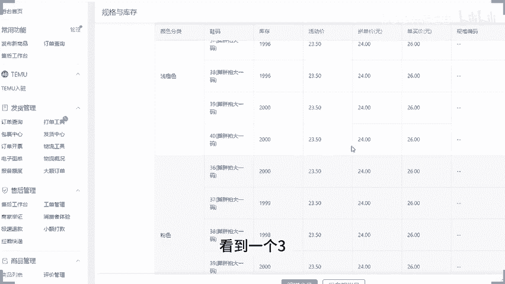

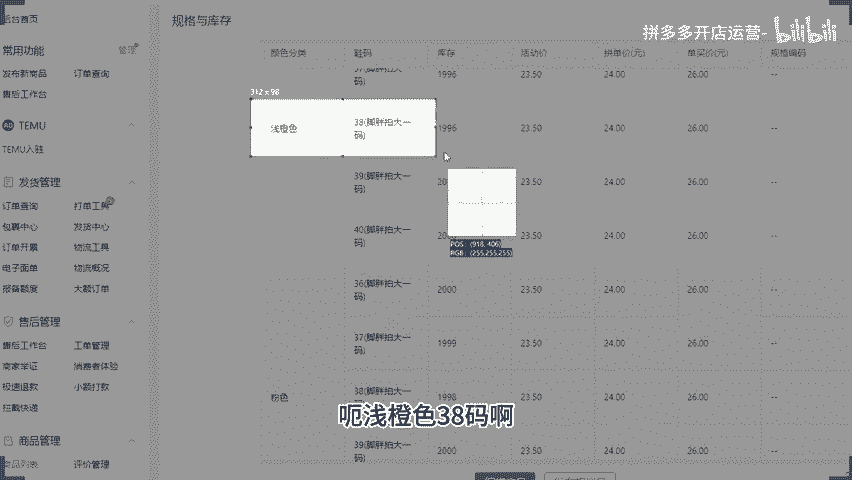

他就会看到这1个SQU呢，目前卖的价格呢还是有参加某某活动啊，具体什么活动咱们也不管他啊，可能是店铺活动，可能可能是平台大促啊，都不管他。活动价格呢是23。5块啊23。5块。它的拼单价呢。

一口价拼单价呢是26啊，它的这个单买价啊单买价26。😊，然后呢，哎他也会觉得。好像。价格还有点东西啊，有点有点有点小小小的优惠啊，但是他最终感受到的是这个价格啊，23。5块对吧？他会什么？

他会根据我们产品的图片来来去判做一个基础的判断，他会跟他自己心里面的认知，做一个基础判断。他会觉得唉这个东西值不值。😊，哎，这个价格合不合适，它会有这样的一个一个什么一个这个判断的一个一个方式啊。

那如果说我们的产品它的心理价位比较低。可能是没有办法去促进转化的对吧？他只是看到了这个产品规格颜色价格而已啊，那怎么做呢？来看一下，我们在做的时候啊，可以把同样的规格做出两个。

比如说今天我又去发布了一个浅橙色这样的一个SKU这个时候呢，我发布了这一个浅橙色SQU呢会和原本的其他尺码呢再一次组合成一个新的规格，对吧？那么这一个浅橙色呢，我可以去做一些营销词，啊，营销词，对吧？

放在前面或者放在后面都可以的对吧？比如说哎我们是这个新品特惠。比如说新品特惠啊，然后呢，97%。用户选择啊打个比方啊打个比方啊打个比方，我们就这样写在那里啊，我们就写在那里。

那用户我们把这两个规格呢放到一起挨到一起去啊，用户看到这一个浅橙色的时候呢，也会看到这一个浅橙色。😊，来能够明白的话，公民打一。啊，能够明白公民党一啊。那如果说作为消费者，你自己看到同样的两个颜色。

一个前面有写新品特惠，97%用户选择的时候，你会不会去选一下看一看。嗯，会不会觉得会的可以打一个6啊，觉得会的可以打一个6啊，觉得会的可以打一个6啊来。😊，OK那么现在注意了啊。

浅橙色这一个呢是我第一个SKU它是默认展示的。所以这个时候用户过来看到的价格呢就是这1个23。5块，对不对？那如果今天我们做的这1个SKU对吧？你经常买东西受到这个影响，是不是？

那如果说今天我们选的这个SQU他卖的价格啊，记住了，😡，21。5块呢。啊，打个比方啊，他是21。5块呢，那你会不会觉得哎，我这个又额外的便宜2块钱啊，我我觉得买这个划算呢？😡。

因为他一开始的心理认知被我们上面设置的这个价格做了一个价格锚点。啊，理解吧，做了一个价格锚点啊，定位到了23。5块。然后他再看到他的时候，就会觉得哎他有优惠。啊，他有优惠啊。

那么这个是可以帮我们出行转化的。当然这里的话我们在做的时候，这个价格肯定不是做21。5块啊，我们可以把它做成23。5块。😡，然后呢，把这一个浅橙色的价格呢做高一点啊，比如说做成33。5块啊，28。5块。

总之价格差距可以稍微做大一点啊，价格差距可以稍微做大一点，这样子呢刺激会更加的直接或者更加的明显啊，好吧？OK来懂了的，明白的，现在公屏上可以打个6，好吧？懂了的，明白的，现在可以公屏上打个6。😡。

当然了这个部分呢，刚刚可能很多小伙伴会说，哎，谢楼是你说的这个呢，好像是有道理的，我也能够听明白。但是有一个很关键的问题啊。😡，他这个店铺呢是有访客的呀，对吧？他这个店铺是有访客的，虽然说访客不多。

只有那么几百个啊，只有那么几百个。但是呢我的店铺是没有访客呀，这怎么办？我连访客都没有怎么办，对吧？我是新店，我连访客都没有怎么办来。😡，不用担心啊。没有反客啊访客啊，不用担心。

这个就是我刚刚一开始的时候有问过大家一个问题的，对吧？你觉得做店难吗？嗯，不难的不难的，你没有曝光难不难也不难的，没有反过难不难也不难的。你没有转换难不难也不难的。我们要找到问题，并且解决问题就可以了。

真正意义上你觉得做店难是因为你还不具备完整的运营思路，知道吧？那为什么这样说呢？来各位给大家讲一下啊，我们就以这个店铺来举例子好了啊，我们就以这个店铺来举例子好了，好不好？兄弟们。

假如说啊各位来我问我问大家一下啊，我问大家一下啊，假如说今天我们也是做这个劳保手套，或者我们就说做这个鞋子吧啊，我们就做这个鞋子好了，好不好？假如说今天我们也做这个鞋子的啊，我们做这个鞋子的啊。

他的客单价呢，刚刚有看到过的对吧？15块的客单价啊，15块的客单价啊，好不？它的客单价呢？15块啊在这边。😊，看到没有？客单价15块啊，我们就当客单价20块，好不好？来。😡。

今天我们的一个店铺啊做的鞋子啊，我们现在以这个来举例子啊，做的是鞋子。啊，他的客单价呢20块钱。啊，客单价20块钱。那么现在我问大家一个问题啊，假如说他的利润一双。2块钱啊。

假如说啊注意我说的是假如啊假如说他一双2块钱，各位。我一天想要通过这个店铺产生500的利润啊，假如说啊我需要卖多少单呢？嗯，我想要一天做出500的利润。啊，毛利吧啊毛利吧，我们这样写毛利吧。

这样子可能好算一点啊，我们就不用考虑人工成本这乱七八糟的东西啊，我一天要做500的毛利，我要卖多少单？😡，来，各位这个问题应该好解决吧。😡，一单2块的毛利啊，一单2块利润呢，今天我们要做500的啊。

做做做500的利润啊啊，做500的利润来多少单？😡，啊，哎呦这个数字好像不太急啊，我们我们我们说做1000的利润吧，好不好啊，我们做1000的利润吧，好吧？这个这个这个对250点太敏感了啊啊。

做1000的利润啊，做1000做1000的利润啊，好不？来，各位动说话啊，把答案发公屏上啊，这个应该好说了吧，对吧？这个就不会太敏感了，对吧？也不会觉得特别难受贴这个数据啊，好不好？

O那我一天要做500单，对吧？😊，啊，我要做5百单好。那我为什么要带着大家去说做这个事情呢？其实道理很简单。各位，我们做店铺的时候呢，就是这样子的，你要去设定好目标，然后确定好我们各项数据再进行反推。

这个时候你有了清晰的目标之后，你去操作店铺呢就会容易很多。那什么意思呢？一天500单，那我店铺如果说转化率能够做到5%啊，我们现在也不是5%吧吧，我们就说以这个店铺来举例子啊。

我们就以这个店铺来举例子啊，那么我们就以这个店铺来举例子啊，它平均的转化率2%是有的啊，平均转化率2%有的，对不对？最近7天我们看啊2。7%啊，207%，我们就说转化率2%啊。

我们就以这个店铺来举例子啊，假如说我转化率做到2%。😡，来，各位，那我一天需要多少的访客能算出来吗？各位能算出来吗？😡，我一天卖500单，2%的转化率，我一天要多少的访客能算出来吗？😡，嗯呃。

25000是吧。其他人呢有没有有没有有没有其他人在算的嗯，有没有其他人在算的来把你们计录好的答案呢发出来。如果说不会算的啊，如果说不会算的啊，听清楚了，公屏上呢啊打一个呃，问号就可以了，好不好？😡。

我的天，这。不好意思啊，我这个实在抓撑不住啊。新燕南，你这个1万怎么算出来的？😡，你这个1万怎么算出来的？😡，这个口算都能算出来啊，500单的话除以0。02嘛，对吧？500除以0。02嘛，这肯定是多少。

25000嘛，对不对？肯定2500啊啊，这个时候我的访客就需要25000。😡，25000的访客啊2500访客。好，25000的访客大家觉得多吗？😊，来2万盒的访客大局多吗？😡，杨回访客大学多吗？多是吧。

很多吧很多啊OK。那5000的访客呢，我确实觉得那作为我现在我是一个新手来说，我太难了，对吧？这个东西我做不到啊，做不到怎么办呢？😊，拆分嘛。拆分就好了呀，对吧？那如果今天我能够去做出10个链接。啊。

我能够做出10个链接。每个链接2500访客。过分吗？你说啊好过分啊，对吧？我现在店铺都没这么多访客，好过分。那我如果说做出20个链接呢？😡，嗯。对吧我做出20个链接，每个链接1250呢过分吗？😡。

过分吗？过分还过分啊，我的天，你们这你们这坐垫真的是坐的有点太难受了啊，这个已经太简单了。我觉得啊我觉得这个已经太简单了啊啊，这个这个真的是太简单了，这个是。😡，呃，几10千0多访客对我来说。

这个就是刚开始起的一个新号新店而已啊，这样的一个数据来的啊。呃，那如果说你觉得这个还南。啊，如果说你觉得这个还难哇天1000多访客也太难了，对吧？那如果这样子的话，好，来。

我们我们我们再再把这个数据说的再再小一点，好不好？我们把这个数据说的再小一点是吧？你不可能说上了今天第一天新店你就做出这么多，你肯定是有个过程的嘛，对不对？

我们可不可以前期的时候把这个目标稍微缩小一点点，对不？😡，可以吧。我们去拆分它啊我们去拆分它。那我现在啊一个店铺，一个链接，对吧？我们就来就来说这个店铺好了。😊，就要说这个店铺好了。

那他现在呢呃有两个链接，一天一个链接是有60个访客的对吧？但是会有相似商品的问题吧，这跟相似商品有什么关系啊？这个销商品没关系啊，这个销商品没关系，你指的是店铺平台的一个一个一个推流。

所以不会给他推太多流量，是不是？是这个意思吗？就平台会限制你的这个其他其他链接的一个曝光，对吧？啊，店铺只有一个一两个链接会有有有数据啊，这种情况有啊，这种情况有，但是有这种情况的原因是大家不会操作啊。

有有这种情况的原因，大家不会操作来，我为什么这样说啊，我为什么这样说，各位。😊，来。这个店铺啊这个店铺各位做手套的。😡，做手套的啊，劳保手套都用过吧，那个帆布的帆布手套。😡，都用过吧，都见过吧。

也不是用过吧，对吧？可能有的人可能家庭条件比较好，像城里的长大了，就见都没见过的啊，也有可能啊。那可能一些农村的或者是呃有干过活的都都有用过的对吧？啊，应该是有用过或者有见过的啊。

那么这种东西你觉得他有他他每个产品都是一样的那我店铺里面做多少个链接合适呢？做一个呢，做两个呢啊，还是做三个呢，还是做10个呢？来，我给他讲一下，这个店铺照样的可以去做多个链接啊，你是开挖机的是吧？哎。

这么巧的啊，我也会开挖机啊，我也会以开挖机啊。😊，哼。我是呃。😊，那个那个那个那个那个叫什么怎么怎么读的来着啊，蓝翔怎么读的来着嗯，英文怎么读的？补lu补啥来着啊。😊，如 fly对吧？如 fly。嗯。

嗯。上次看那个段子啊，上次看那个段子啊，这个蓝翔啊一听哦，好拽的时。😊，不不开玩笑不开笑，抽远了抽远了啊好，抽远了。那我们做店铺的时候呢，对吧？你就说这个店铺做手套的，它也都是同样的产品。

它同质化更严重。你不要光说自己店铺会有这个限流的，对会有你这种这种说这种情况呢，它跟别人店铺呢也会有同质化的竞争，对吧？按道理来说，他也很难操作的。那么这个店铺呢，它同样能够做出很多链接的。

这个店铺当时在你们看到这个数据的时候呢，是有4个链接是已经有流量了啊，四个链接啊。😊，他是有4个链接已经流览了啊。四个链接。第一个链接呢是有8000多的访客啊，当时是有8000多的访客啊。

一个链接是8000多的访客啊，然后剩下链接呢基本上都差不多啊，基本上差不多。他当时主推了一个爆款做活动上去的啊，活动推上去的啊，可以看到啊，活动推上去的差不多就占了有个呃将近有一半的数据了啊。

另外一半的数据呢是另外三个链接的，它是轮流在上活动啊，轮流在上活动。啊，那么一个链接上活动的时候，另外几个链接呢做备用啊。那么另外一个活动，这一个产品呢下活动之后呢，另外的活动再补上去。

那它现在啊截止到现在呢，它是已经又重新做了几个新链接出来，在一起在跑这个事情了啊，做进价呢，做进价，做这个进这个秒杀，做秒杀啊，做平台大促，做平台大促啊，做这个低价引流，做低价引流。

不同链接会有不同的打法，那么这个时候呢，它不存在说竞争关系，因为它的定位不一样，知道吧？当你把你的定位错开之后，你所说的这种啊同一个店铺里面多个链接相互之间平台不会推荐的情况呢是会是会忽略掉的。

能够理解我意思的话，公屏打一啊，所以说你说你店铺里面会受到平台的限制，还是自己操作和玩法的问题啊，你要学会去区分开我们的引流途径跟平台的推荐的一个什么这个这个范围啊。

你把推荐范围给它区分开啊那么来啊继续往下那。😊，如果你说今天我们讲的哎你知这个10个链接多了啊，100个链这个20个链接多了啊，没有办法做那么多，那我链接可能少一点，对吧？

我前期目标少一点一样的啊一样的多个店铺同一个品可以这样可以这样操作啊，但是有一点要注意啊，多个店铺的话，你的店铺登录的IP要区分开啊，不要在同一个店铺IPIP下登录啊，不要在同1个IP登录的啊。

这样的话，同1个IP下面登录的话，平台它虽然说不会说直接给你判定是什么重复铺货这种的，但是也会去干嘛呢？进行一个限制啊，你这1个IP下面你可能只有一个店铺能拿到曝光。其他店铺可能就很少数据理解吧？

它会限制你的曝光啊，也会有这种情况的。所以我们需要把IP区分开啊，O那么做这个过程中呢我们可能还是同学们说你这几千个访客我怎么做的这个东西也很难做出来呀，对不对？那我们回过头看一看啊，新品的推荐啊。

新品推荐啊。😊，之所以你们觉得访客难做，是因为你的推荐访客上不来。那么推荐访客怎么做的，就重点说一说新品推荐啊，就重点说一说新品推荐啊。各位平台对于我们商品的推荐啊，产品在一开始发布的时候。啊。

一开始发布的时候会考核我们的新品权重，对不对？会考核新品权重。那么这个时候呢，你是有新品推荐的。如果说你的产品跟同行是一模一样的，你的图片也都是一模一样的。你不具备原创性的话。

那么这个时候你的新品推荐会弱啊会弱啊。如果说你的产品原创度比较高，你的同质化没那么严重。OK那么你的新品推荐呢就会更强啊，那么它的弱更强呢会进行我们商品原创度的一个考核。这个是一个非常细节的部分。

我们大多数小伙伴呢是没有做到位的。啊，我们大多数小伙伴是没有做到位的来，什么意思呢？我们可以来看一看这个店铺啊，各位呃，你们你们现在啊你们现在啊来各位。

你们现在啊在直播间的小伙伴们可以去尝试做一个事情啊，可以去尝试做一个事情，什么事情呢？来，我们来收我们来以图收款，收一收，看一看这一个图片有多少同款，好不好？来。😊，唉，直播间小伙伴们啊。

有没有人愿意去做这个事情的？有的话可以公屏上打个一啊，然后呢拿出你的手机，打开你的拼多多啊，打开你的拼多多。然后呢，用到这一个呃已图收款功能啊啊，打开你的主页之后呢。

用你的这个啊顶端右侧的拍照功能啊有用到右侧拍照功能呢去看一看啊，以图收款啊，来看一看这一个有没有一模一样的图片啊，有没有这样的图片有多不多啊，多不多啊，各位可以看一下啊，可以看一下啊，可以看一下啊。

各位啊，有操作吗？有操作吗？啊，有看到有这个一模一样的图片吗？😊，很多是吧啊，黄胖子你有看过，是不是其他人你有看过吗？来，有去操作这个动作的小伙伴，公屏上呢，现在可以打个一，好不好？有去看到过的小伙伴。

公屏上现在可以打个一啊，动作快。😡，好啊好很多，对不对？好，那么这里啊我说一下我说一下啊。😊，平台它会进行新品推荐，这个推荐的原理是什么呢？跟他说一下，首先，如果说平台推荐商品，他不推荐新品的话。

都进行数据考核。那么这个时候我们的新品是拿不到曝光的啊，至少有十几个是吧？好，OK来这句话没问题吧。平台如果推荐商品的时候，不推荐新品的话，都进行数据考核。那么我们在平台上上架的新品是没有曝光的。😡。

你很难拿到保关，甚至你去做付费推广，你都很难拿到保关。😡，知道吧？各位这句话没问题吧，能够记住吧，没问题的话，公屏打个6啊，没问题，公屏打个6啊，这句话大家记一下，那为什么这样说呢？你想嘛。

今天我要去买一个东西，对不对？我去搜索关键词了。那么这个时候我搜索完之后呢，平台不会推荐新品的时候呢，它只按照数据考核的话，那么展示在前面的位置一定是有数据的新品，这个商品是吧？

那么有数据的这些商品的话，它就会考核数据。😡，谁数据表现好，谁在前面，谁数据表现差在后面。那作为我们是新品的话，即使我自己去做了销量，那么你的数据呢也会啊。😡，较少。那么数据较少的时候呢。

你的排名就会靠后。这个时候你的曝光就很少，机会就很少。😡，对吧那么平台上呢都是一些老旧的商品在前面啊。😡，啊，老旧的。商品在前面。那这个时候呢，用户的啊。用户体验就会很差，对吧？没错吧。

那我们平台呢希望的是我们产品能够去满足到更多人的需求，并且呢能够让我们的用户呢在我们平台上都会有到呃更多喜欢的商品来满足用户的一个什么一个购买的一个需求，对不对？所以他会对我们的新品进行推荐。

而这个推荐的话，他就不是说单纯的考核数据了，而是进行商品这个新品考核啊进行推荐。那么这个考核呢考核就是我们产品的原创度。啊，同款这个东西是没有办法避免的啊，同款不能避免，你肯定都会有同款的。

但是原创度是有差别的啊，原创度有差别的。什么叫原创度呢？来，今天我上架商品。😡，我用到的图片是我的供应商给我的。😡，啊，或者是我去什么借用同行的。对吧平台的所有图片都是这个样子的话，那么它有原创度吗？

😡，他没有的对吧？这些商品呢就是同款，就是一模一样的产品，而且它没有原创度。那平台呢就会判定这些商品是一样的。在进行推荐的时候呢，优先推荐这些产品里面数据表现好的就可以了，对吧？

但如果说我们的产品哪怕是同款，但是我是自己原创的。😡，你是有新品权重的，你是有原创度的。这个时候呢，他是会有额外的推荐加权的。各位能理解公民打一啊能理解公民打一。那么这个推荐债权考核原程度呢。

考核的就是我们的图片啊，考核的就是我们的标题啊，当然当甚至也会考核我们的什么考我们的什么属性啊，考我们属性。那如果说你的属性跟别人上传的属性不一样，对吧？因为我们有很多属性，其实呃，我去写属性的时候。

产品呢可能有很多属性都可以填，那我可能选择填一部分，对不对？啊，没错吧呃，供应商给的价格也定死的，那么降价不能降太大。OK那么这个时候注意了啊，胖子记住了啊，记住了。

你要做好什么原创度这两个点原创度做好啊，包括这一边属性啊，那我们在发布商品的时候呢，属性发布的时候去看一看。😊，同行用的是什么属性？啊，那我们在发布的时候呢，跟同行区分开。啊。

当然这个东西不做也问题不大啊，这个东西不做问题不大。但是呢如果说我们在平台上是有一些其他的畅销属性的时候，我刚好满足的时候同行没有用，那我区分开，那么这种情况效果就会很好啊，而我们在做的时候啊。

而我们在做的时候，在我们的图片上标题上，如果你是供应商给的，那么这个时候完蛋，所有人都是一样的，属性也都一样的，那你就原通途就不够了，对不对？所以我们这个时候要把图片做好区分，怎么区分呢？来听清楚了。

刚刚我们不是做了一个事情嘛？叫做以图收款，对不对？叫以图收款。那平台在考核商品的时候，他在考核图片也会有单独考核，对不对？考核商品的时候呢，会考核商品主体。😊，啊，对吧考核商品的时候，他会考核商品主体。

对不对？我们去用这个图片拍照的时候，对不对？它会有一个框子，把产品主体部分框出来，这个是考核商品主体来识别产品的款式啊，识别产品的款式啊，所以这个时候呢它识别的是什么呢？识别的是你产品。

它是不是同款或者相似款，对吧？而我们在做图片考核的时候，它考核的是什么呢？是我们产品图片的像素信息。😡，啊，考核是我们产品的图片的文件信息。这两个点这两个点啊，什么意思呢？来各位。😊，呃。

打开一个图片啊，我们现在啊我打开PS啊，然后我在这边我把这一个拖鞋啊，我把这个拖鞋我们我们复制一下吧，我们复制一下这个图片啊，复制图片啊。然后我打开PS啊，打开PS我们把这个图片放过来啊，好吧，来。

所稍微等我一下啊，稍微等我一下。😊。

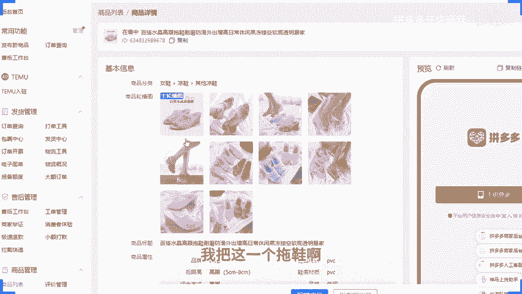

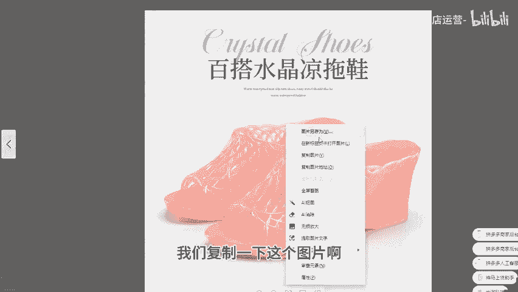

好，OK各位所有人在直播间的小伙伴们啊，现在有认认真听的公屏上溜走起来是吧？公屏上溜走起来啊，注意看啊，这一个只演示一下啊，这一个只演示一遍啊。你如果说没有记住错过了啊，你没有听清楚，那是你的问题了啊。

我已经重点强调了啊，这一点很重要啊，大家可以看一下啊，当我们把图片放进来之后，对不对？我们把整个的界面放大啊，把页面放大来，有看到这一个一个的小格子的，现在公屏上打个一。😊。

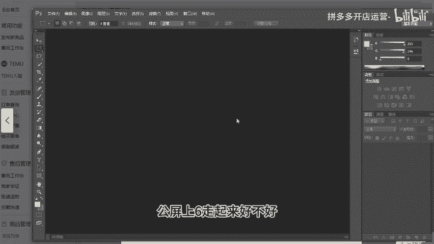

啊，有看到这一个一个小格子的公屏上可以打个一啊，好不好？来动动快啊，所有的在直播间的小伙伴们，现在有看到的小一给我走起来，好不好？不要给我这个偷懒开小差啊，好不好。😡，不要给我偷懒看药塞啊。

这一个小格子啊，这个小格子有看到的话，公屏打一。哎，我点个名啊，我点个名啊，我看到有的小伙伴就是没吭声啊，一句话没吭啊。来啊，我问一下啊，我问一下啊这个。😡，人间财月来在吧。人间财月在不在在不在？

有看到吧，有看到这个小格子吗？嗯，有看到的话扣个一好吧，人间财月啊。😊，然后还有这个。哆啦A梦啊。哆啦A梦来有看到吧？有看到扣个一啊。对啊，你们你们在的话，你就在我提出问题的时候，在我问你们确认的时候。

你就要第一时间回复我呀，对吧？不要闷不吭声的啊，不要我点你名字啊，对吧？在这边给我给我这个双生成干啥的啊，对不对？没有意义啊，对吧？啊，会动要积极一点啊，好不好？不要害羞啊，不要害羞啊。

有看到就直接跟我讲啊，O来这个小格子呢叫做像素啊，这个小格子呢叫做像素。那么电脑它在识别图片的时候呢，它不会说直接识别成一个图片啊，它识别的是这个图片呢长有多少个像素宽有多少个像素，然后呢。

这其中每个像素是怎么排列的，排列在每一行每一格每一个位置的像素呢，它的颜色是什么啊，比如说我来给你们看一下啊，我给你们给你们看一下，比如说来。😡，位置的这个像素呢，它就是这样一个灰色啊。

一个浅灰色的一个像素啊，好吧，它的颜色信息是这样子的，然后我们往下翻对吧？到下面啊，到下面拖鞋位置啊，我们找一下啊，找一下拖鞋位置啊，找一下拖鞋位置来。😊。

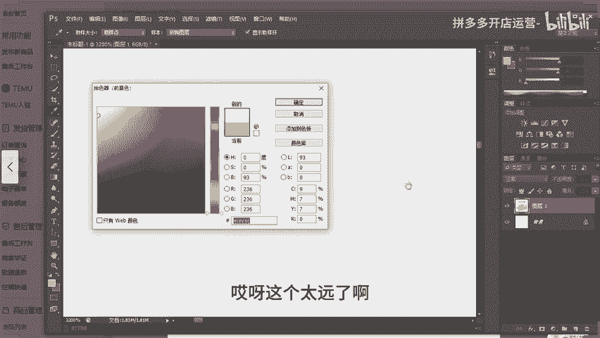

这个太远了啊太远了，我我稍微缩小一点嘛，这样好早一点。啊，拖的快一点啊，来好OKOKOK哎，来，我们我们先在把它放大，这个时候放大这个时候放大啊。😊，来，比如说这一个位置啊这一个像素啊这一个像素啊。

比如说这个像素啊哎，比如这一个像素啊，对吧？它排在呃第呃几几第几行第几个位置的对吧？哎，它的像素的颜色是什么，对吧？哎，这个时候抓取出来，它会在这个地方进行一个进行一个排序啊，然后呢，在这边鞋子部分啊。

在这个位置它又是什么颜色，对吧？什么样的一个一个一个像素的一个排列方式，它会记录下来。这个时候呢，这是我们整个图片识别出来一个状态。😊，如果说你用的是同行的图片，那么它识别出来就是一样的。各位能明白。

公屏上打个6，好吧，能明白，公屏打个6。所以这种情况呢，你就没有原创性的。😡，没有原创性的话，那么平台在进行推荐的时候呢，就会推荐数据表现更好的同款同样商品的图片的一个一个产品。

那么这个时候我们要怎么做啊，经常说这个事情啊，经常说这个事情。这个时候呢我们就需要改变我们自己图片的产品的这个图片里面的像素信息，它的颜色信息要改变啊，怎么改变呢？哎，你去找一个颜色比较复杂的图片啊。

你去找一个颜色比较复杂图片啊。你看啊，比如说这个是我找图片啊，来看一下啊，找一个图片之后呢，把它放到PS里面来。

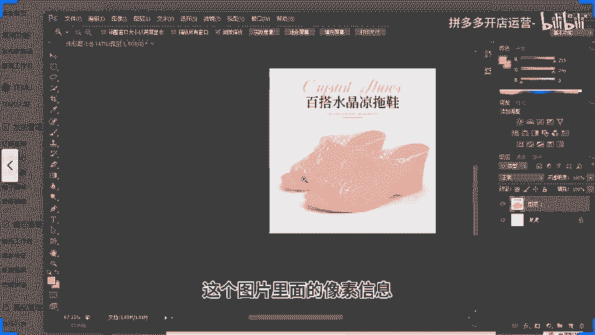

来。各位，有看到的这一步有看到的没问题，公屏上打个一啊，这一步所有人啊有看到的公屏打个一啊。如果说不明白，不理解，没听没看懂，可以直接问啊，可以直接问啊来。😡，拿进来之后呢。把这一张图片呢进行拖动啊。

哪怕变形一下都没关系的，拖动一下啊，让它覆盖掉整个画布，整个页面，整个图片给它覆盖掉。啊，给他覆盖掉。覆盖掉之后，那么回车确认再把我们这一张图片啊，就上面这个我们拖进来这个图片啊。

这个图层它的不透明度调到2%。对。😡，来。到这一步没有问题，能看懂的公屏上打个一啊，能够记住的公屏打个一啊，动作快啊，动作快。那我们现来说一说这么做目的是干嘛啊来。😡，放大这一个图片。

各位在这里看的很清楚的，有一条一条的杠啊，有一条一条杠啊，有一条的杠啊，这里有个白色的杠，看到没有？这里有个白色的杠，这里有个白色的杠，各位有看到吗？有看到国民打6啊，有看到公民打6。😊，嗯。

百1%也行1也行啊，%也行啊。一般的话看看你的产品图片的一个实际情况，只要不影响我们产品的一个观看的话，这个不透明度呢，你可以尽量的做的多一点都没问题的，做的高一点都没问题的啊。2%5%10%。

只要不影响产品的观看都可以的啊。那么放过来之后呢，这一块它是有变化的。来，看到没有？😡，啊，看到没有？这个就很清晰啊啊，看打开关闭打开关闭，对吧？这个过程中呢，它的像素的颜色是已经发生改变了，对不对？

那么平台识别出来的时候呢，整个画质啊整个图片它就是一个新的图片。😊，啊，整个图片呢它就是一个新的图片，包括这个时候呢，产品本身也会受到一些变化。看到没有？这一块其实还是有这个一个印子的啊。当然呢。

我们不认真去看啊，如果说是正常图片大小，不认真看的话，是看不到的，对不对？来，看到没有？这里是有的啊，包括这里也有一条杠的啊，对吧？😊，好K。😊，那么这样做有小伙伴可能说，哎，那这样做就可以了吗？

这样做可以帮助我们图片在识别的时候呢识别成一个自己原创图片啊，因为它跟别人不一样的。但这里只是第一步。那么要做的更加的这个好一点的话，O那么你在这个图片呢，保存出来之后呢，可以再去用到工具啊。

去把这一张图片啊，把这一张图片的这个EXIF的一个文件信息啊也给它调整一下啊，1张主图我自己做的时候呢，如果说是呃供应商图片的话，我是所有图片都去做的啊。

包括我的10张主图SQ图片以及我的详情图我都会去改的啊，是这样子的，看你自己呢，你要是觉得做一张图就够你去做一张图，反正我的话都做的啊，反正我自己都做的啊，好吧，来啊。对。😡，这一步。没问题，公民打印。

啊，这一步没问题，公平打印。

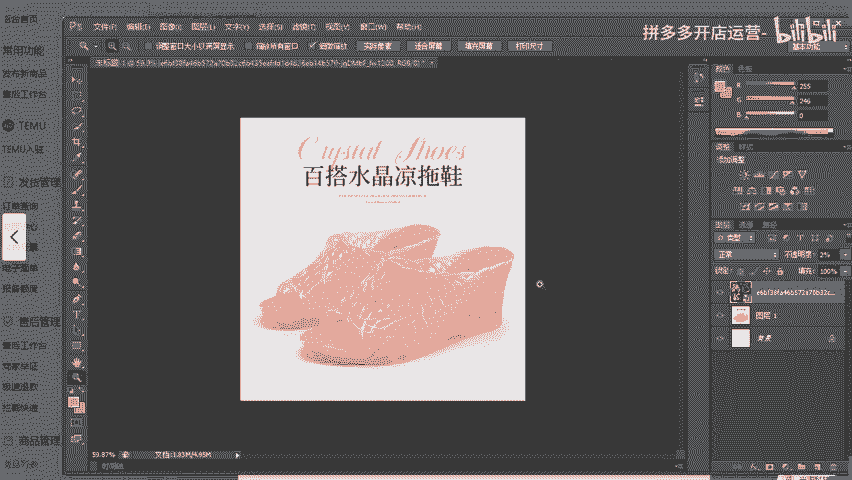

那么可能就有人会说了，哎，西罗，那这样做他它真的这真的是就这么好用吗？那我听别人说过，可以抠图换背景的对吧？可以做一个镜像的啊，对吧？呃，你们有没有听说过抠图换背景啊或者镜像啊，有没有听过的？😡。

来我问一下啊，抠图换背景。有听过吗？还有这个镜像图片。有没有听过？😡，有没有听过？😡，有是吧啊啊起风有听过的黄帽子没听过啊，那我跟你说一下啊，抠图换换背景是什么呢？就是说哎我们现在这个图片呢。

它不是有一双凉鞋在这里嘛，对不对？好，那我就把这个背景给它抠掉去。😡。

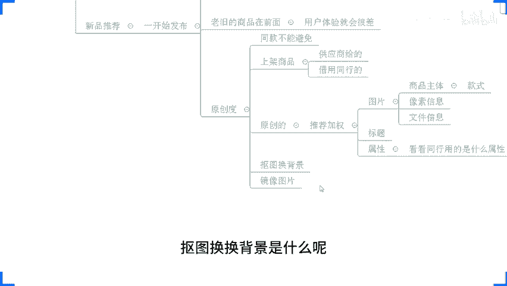

啊，我我我就随便简单的来操作一下啊，不用去做的那么特别的精细啊，我就随便的操作一下啊。好吧，我们就随便的操作一下。比如说我直接把这个呃。😊，等一下啊，这个怎么会。OK啊，等下等下，找错图层了啊。

在这边啊在这边来取消一下来。😊，啊，我随便扣一下，我就随便扣一下啊，随便扣一下啊，随便扣一下。😡，然后把把这一个抠掉啊，把这个抠掉啊，把这个抠掉。然后呢，我们在这下面呢换一个，假如说是红色啊。

这里我就随便抠了一下，因为就用模棒随便点了一下啊，所以比较随意一点啊，感觉就很烂对吧？但无所谓啊，但无所谓，我只是给大家演示一下什么意思啊，这叫抠图换背景啊，我把产品抠出来。

把背景换成别的颜色或者别的花纹的图片啊，或者说像这样子啊，比如说这个样子啊，来我把这一个放这里面啊，比如说这个样子啊，比如这个样子啊，我把它不透明度调高啊，比如比如说这个样子啊，这个是我的产品啊。

在前面啊，这是我的产品在前面啊，假如说这个意思啊，好不好？这叫抠度换背景。那么这种方式行不行？各位来我问一下我问一下这种方式行不行？😊。

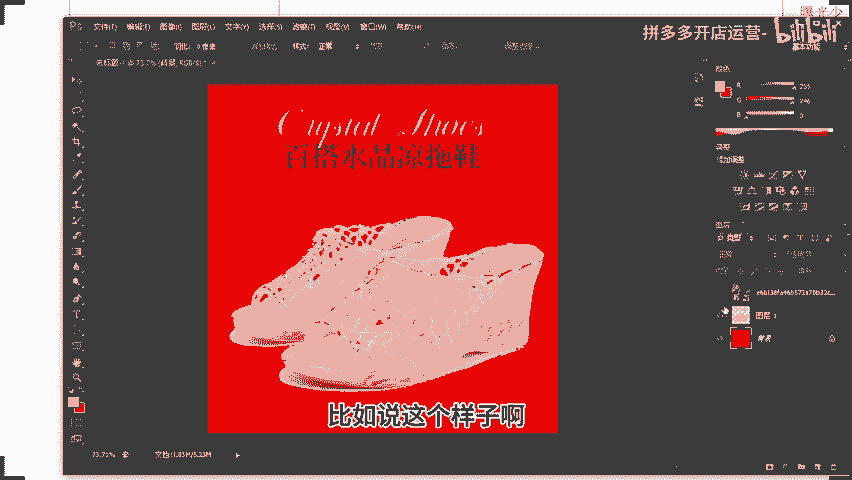

这种方式行不行？来，各位说一下，你们觉得这种方式行不行？😡，你们觉得这么方子行不行？😡，可以说一下，觉得行的打一，觉得不行打2啊。来我看一下，考考你们啊，考考你们看你们的基础怎么样啊。😡，行吗？呃。

有人说也行，有人说应该不行吧啊，然后不行吧，然后就说可以啊，好O。来啊太乱了，感觉哎，这个这个因为这个只是随便的给大家给大家演示一下啊，只是这么一演示一下而已啊。这个没有扣好。

就是随便的为了为了展示而展示的啊，这个跟乱不乱没关系啊，好吧。😡。

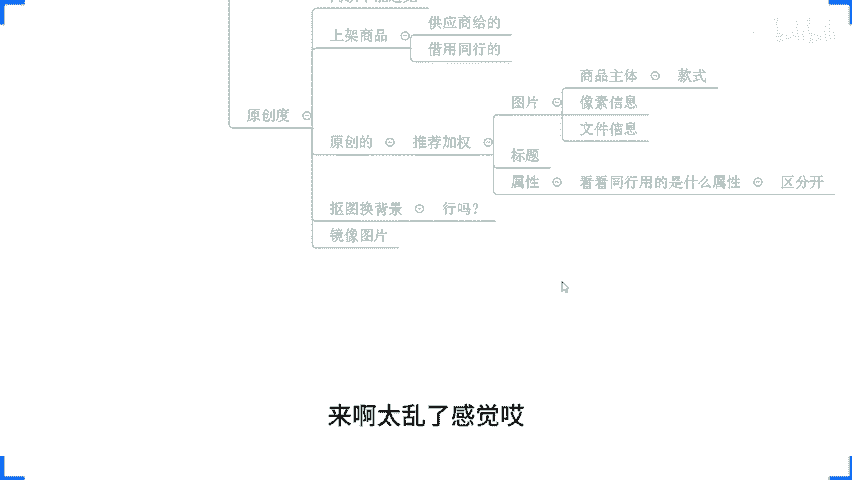

但是我告诉大家啊但是我告诉大家，这样子去做行不行呢？😡，不行。没有回放啊，没有回放，这样子去做行不行？不行，为什么不行呢？来，原因很简单，我们刚刚有多少人去拿手机拍过这个图片的，现在公屏上可以打个一啊。

有刚刚有去用手机拍过这个图片的，公屏打个一，我确认一下啊。😡。

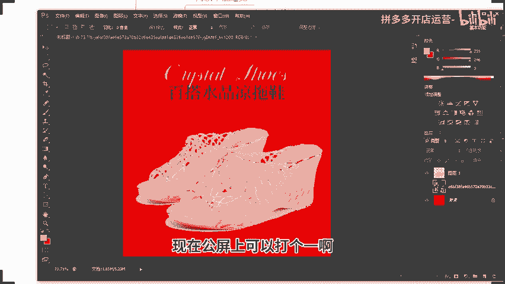

好啊，OKOK okKOK那么这个时候呢，我们刚刚有提到过一个词，叫做它做到原创度是可以去完成我们什么完成我们的这个原创操作的，对不对？可以有到加权。但是平台在考核的时候，它识别的是商品主体部分。

知道吧？它识别的是商品主体部分，那么商品主体部分，如果说你跟别人是一样的对吧？他不是有个小框子，把这个产品框出来嘛？对吧？比如说他把这一块框出来，或者他把这一只鞋子框出来，对吧？

来进行识别是不是是不是这个样子的，是不是这个样子的来，各位是的话，公屏打个6啊，是的，公屏打个6。😡，平台会把这一个产品，一个鞋子或者一双鞋子框出来来进行识别。那么如果说我们去抠图幻面景的话。

这个时候你图片的原创度有没有有，但是它一般它这一个产品主体部分是没有发生改变的。😡，啊，所以这个时候呢，它的原创度其实是有限的，而且更重要一点呢，它直接识别出来就是同款啊，直接识别出来就是同款。

而我们如果通过刚刚说的这种方式去做的话，它识别出来呢，有概率是被判定为相似款的。😡。

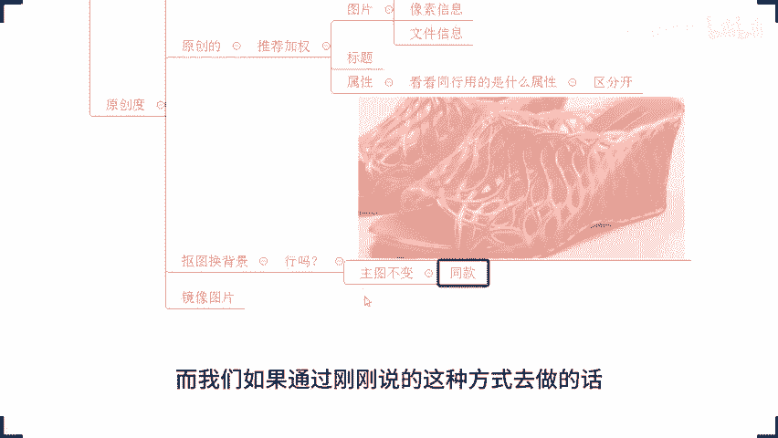

啊，有概率啊有概率被判定为是相似款啊。等一下，我把这里我把这里填充成白色啊。啊，这个情况呢，它是有概率被判定为是相似款的。所以这种情况呢，我们这种方式呢，它上面权重会高一点啊会高一点啊。

那然后另外一点啊，像这种镜像操作呢，什么叫镜像操作来来演示一下啊，来还是复制一个图片啊，拿到PS里面来，好不好？我们再来一次啊，镜像操作什么意思呢？来，就是来到这个图片里面。

我来直接做一个左右的一个什么翻转啊，这叫镜像啊，这叫镜像镜像完了之后，哎，这个图片就完定搞定了，完成了。😡，相似跟同款是不一样吗？那你觉得呢？你觉得呢？是不是？就跟就跟这个就跟这个。😡，罪犯一样的对吧。

嫌疑犯和罪犯一个是一个是这个判刑的啊，一个是还没判刑，你觉得能一样吗？😡，是吧一个可能只是抓到了，知道他是有犯罪，但是还没判刑，一个是已经判刑了啊，知道吧？他也不一样的啊。

那像我们这个左右镜像是不是很简单嘛，对吧？看着很简单，对不对？所有人都可以用。😡，所有人都可以用啊，只要是个人都能玩，都能用。所以这个时候呢，你会发现这种没难度的东西呢，所有人都能用的时候呢。

它也会有很多的一样的操作情况出现。那么它是没有办法保证原创度的。

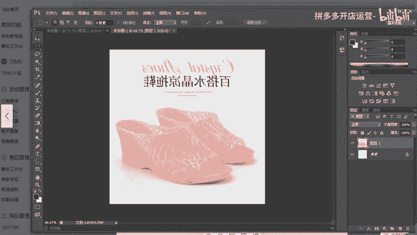

那我们刚刚说的这种方式，他为什么好用？嗯，我们刚刚说的这种方式，它为什么好用，各位知道吗？😡，那我告诉大家为什么好用啊？首先这一个颜色复杂图片呢，是我自己找的，对不对？😡，这个颜色不要图片是我自己找的。

所以说我用到的这个颜色信息替换进去的时候呢，它大概率呢是不会有到一模一样的。😡，啊啊我们我们把它做成做成高一点啊，十8啊，对吧？这个花纹呢就是这个花纹呢同行可能很难跟我做成一样的，对不对？

所以这个时候呢，我的原创度是有一定保障的。哪怕有人找到了这个图片，跟我是一样的，同一张图。😡，啊，哪怕有人找的这个图片是跟我是同样的一张图。因为我每次拖动的时候，我是我自己随机拖动的啊。

拖的位置拖的大小不一样。所以这个时候它的颜色信息也是不同的。😡，哪怕是我自己再重新做一次，可能做出来也不一样。😡，各位能明白吗？除非是有人盗图盗我的图，各位能明白吗？能明白，现在公民打一好不。

能明白公民打一。😡，那么这样操作的话，我们产品的原创度就可以得到大大的提高。当原创度提高之后，OK的。那么你的新品的平台推荐就会增加啊。当你的新品推荐增加之后。啊，把你的新品推荐啊。增加之后啊。

你产品能够有到一个优质的。😡，组图能够完成点击的引导。啊，那么你的点击率高。你的权重就会高。同时，当用户进店之后，你的SKU布局有做到引导转化啊，能够去把价格定位到热销价格，能够什么满足。用户的。需求。

那么你的转化就不会有太大问题。他会比较高啊比较高。而且稳定。那么这个时候你说你店铺能不能上来？😡，是不是？所以很多时候做店铺啊。😡。

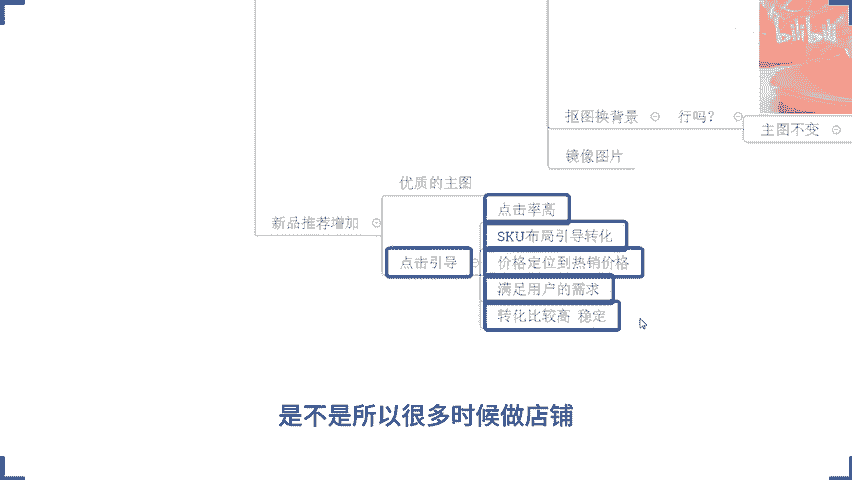