# 拼多多开店运营-新手电商运营实战指南，B站最全拼多多零基础入门教程！拼多多运营秘籍，小白也能成电商大亨！轻松上手拼多多，拼多多新手开店赚钱攻略 - P4：04 关键词的选择及组合 - 拼多多开店运营- - BV1xms8eSEVs

hello大家好，我是西楼。那么今天给大家分享的内容呢，是我们拼多多新手开店内功修炼片中的关键词的选择及组合啊。换句话说呢，就是我们标题的一个写作啊。那么在分享之前呢。

然后规矩先在来看一下近期跟小伙伴他们的店铺数据，好吧。

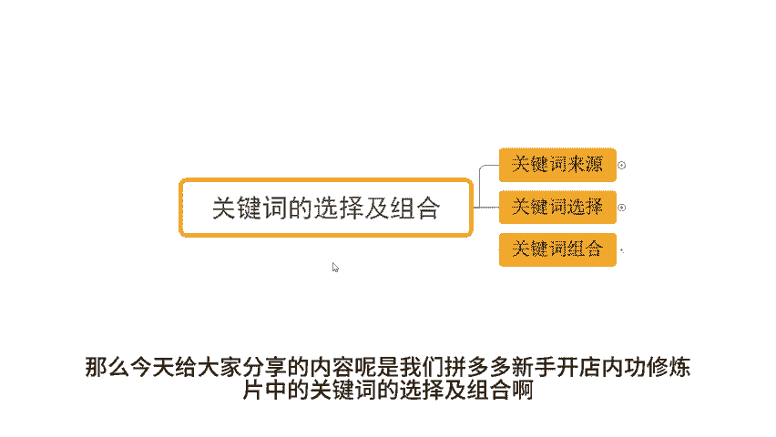

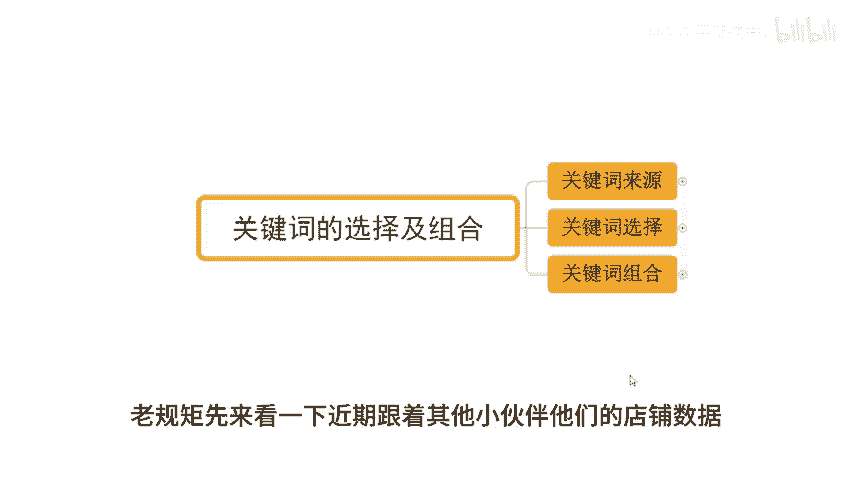

那么可以看到，像这个店铺呢，是一个完全没有任何数据的一个新店啊，从最早年黄开始的。那跟了实效之后呢，也是通过最开始的这个数据分析产品的选品呢，包括我们前期的一些技础操作，不断的在优化提升我们上面的权重。

那么到后面的话啊，商品的数据累计到一定的阶段之后呢，访客开始增长啊，到后期一天的访客呢是做到了15000，一天的订单呢是2900单，转化率呢做到了18。76啊。

还有像这个店铺原本呢是有一定的数据的访客在3元左右，而且呢是有一些波动的对吧？那么跟着实操之后呢，也是通过我们产品的啊，这个布局优化，包括SKU的一个优化来不断的完善我们商品的这个转化的引导，对？

提升我们上面权重到后期的话，一天的这个访客呢是做到了1300一天的订单呢是2100单，转化率呢做到了16。47啊，也都非常不错的。还有像这个店铺，那早期呢访客是1000多20千0不到啊。

那么也是一个啊通过不断优化开始提升的一个数据啊，那么到后期的话，一天的访客呢做到了。呃，12000啊，一天的订单呢也是2100多单，转化利量做到17。03%啊，也都非常不错。

那么不管是这种有基础有数据店铺啊，又或者这种零访客的一些纯新店呢，其实用时长也都是可以得到一个很好提高的啊。那么这些店铺呢也都是通过自流的方式来操作的。如果说你想知道怎么通过自流来操作店铺。

你想要通过战流来打造爆款数据，OK建议你可以仔细观看我分享视频，好吧。

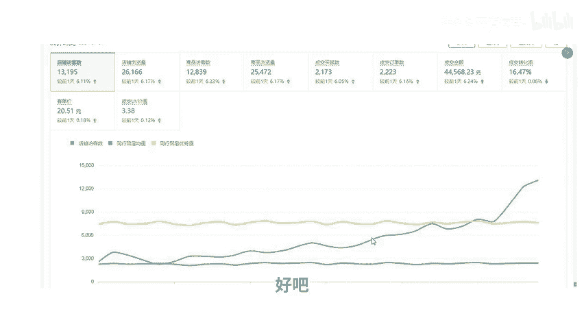

那店铺操作呢对于我们很多的新手小伙伴来说呢，会有到很多的困难。这个很正常。如果说你有店铺操作方面的问题啊，有需要资料的呀，OK可以找我啊。那么有时间的话，我也可以带着你一起去实操，对吧？

像这些小伙伴一样呢，我们一起能够具有到啊更好的操作方法，快速提升我们运营能力，让我们店铺呢达到一个更高水平，好不好？OK那继续啊，那针对到我们今天分享内容呢叫做关键词的选择及组合。那首先第一个问题呢。

就是我们关键词来源呢，我们得搞清楚，对吧？我们的关键词从哪里来的。

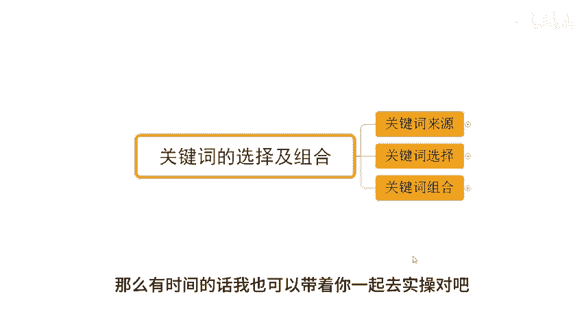

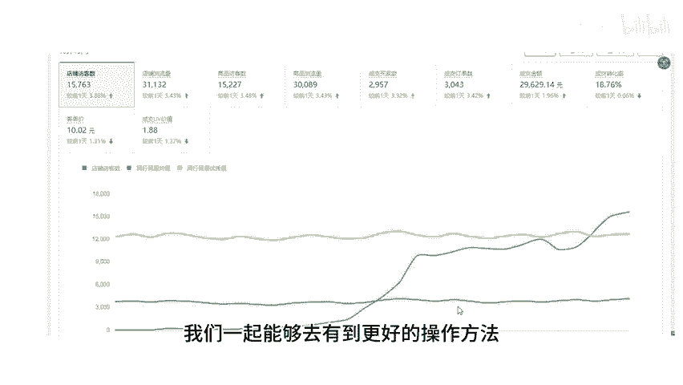

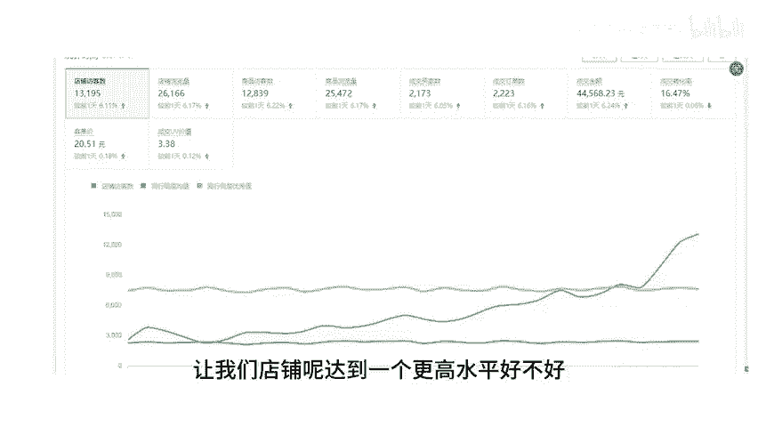

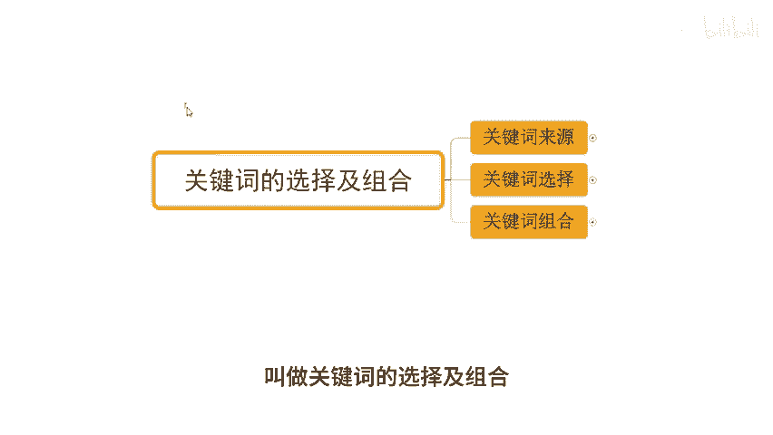

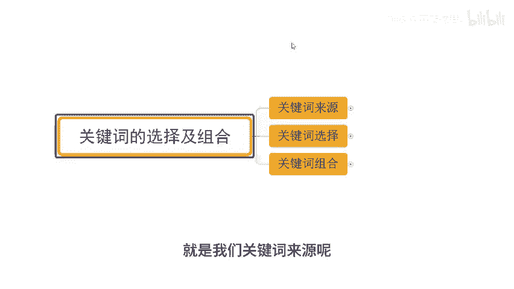

如果说这个问题不去解决的话，我们店铺后面的所谓的这个选择呀组合呀都是扯淡的，对不对？O那么首先可以看一下啊，在关键词来源方面呢，有多种方式啊，第一种方式呢是我们搜索下拉框。

这个呢是我们所有小伙伴可能相对来说会更加熟悉的啊这种方式那这个东西呢为什么会从这里来呢，其实道理很简单，因为这个搜索下拉框的关键词呢，对于我们平台对于我们用户来说呢，可能使用的频率会比较高一点。

用的人品比较多一点，那么我们用到之后呢，后期对我们产品来讲可能曝光也会比较多一点，对吧？那么这个怎么操作呢？在我们的买家APP对吧？在这个搜索端口里面呢去输入关键词。

这个时候呢输入之后平台就会根据我们输入的关键词进行联想啊，在整个的关键词的这个下方呢展示出来，我们相关联的一些关键词。那么这个位置呢我们称之为搜索下拉。

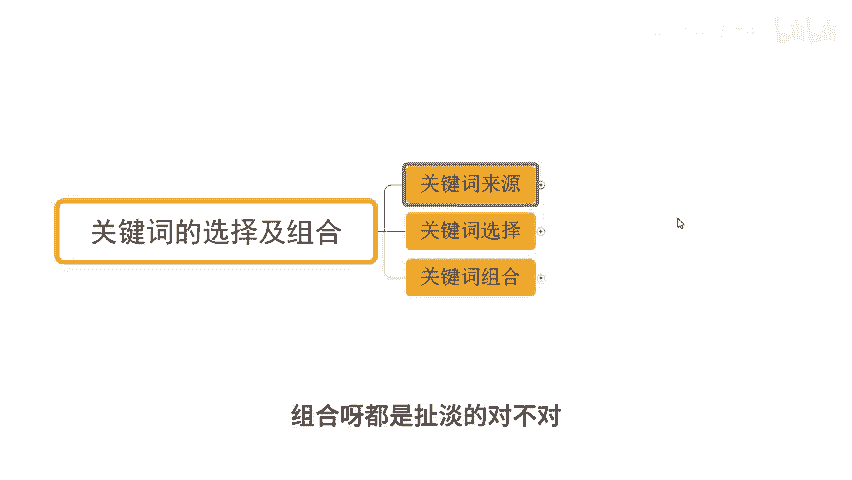

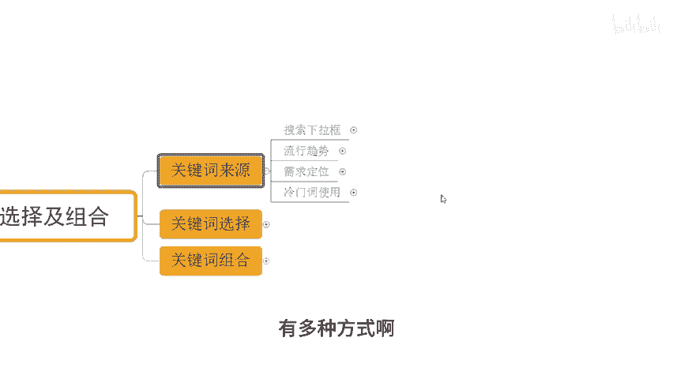

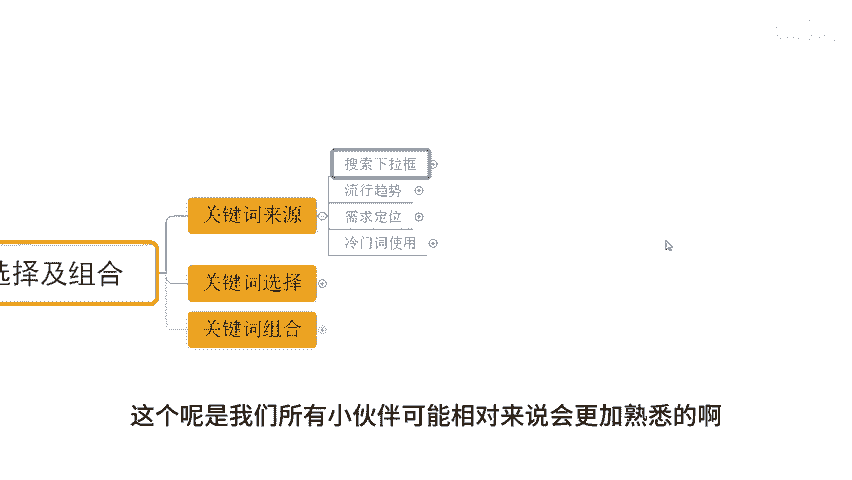

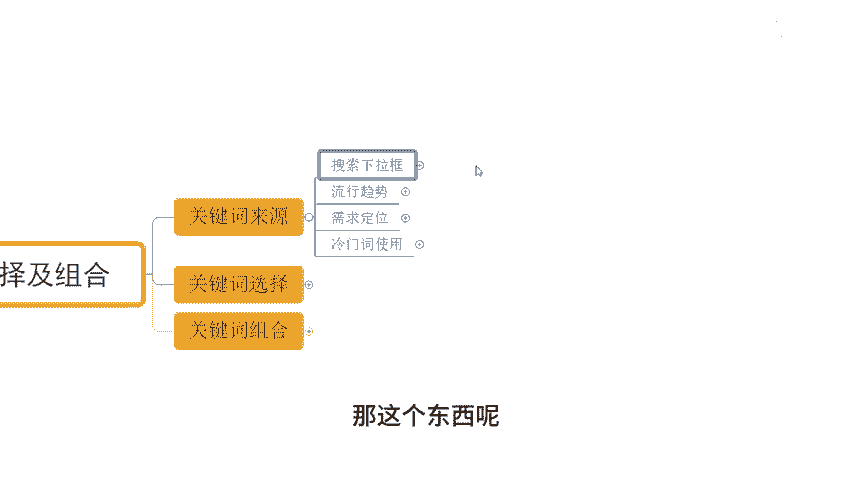

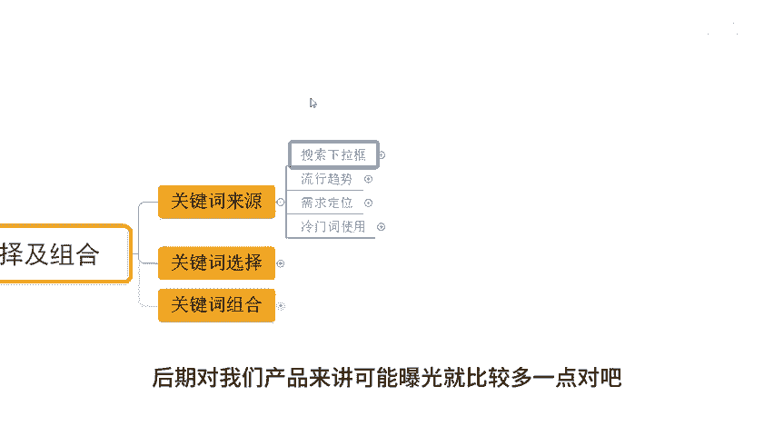

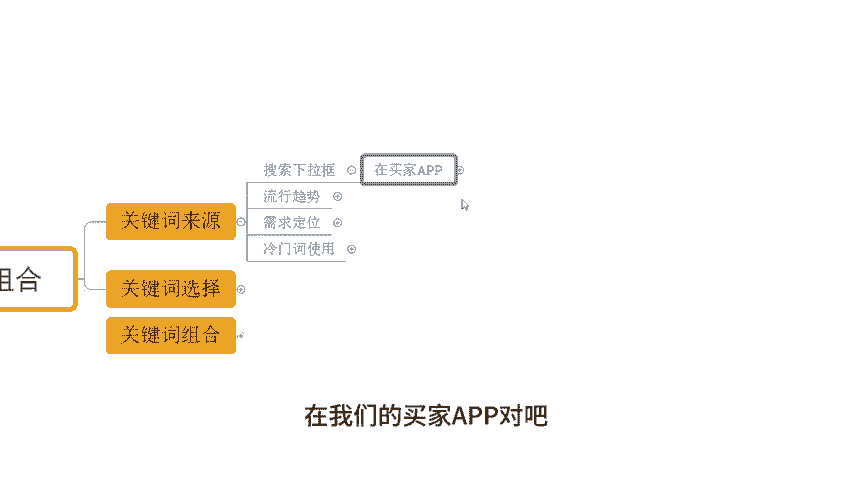

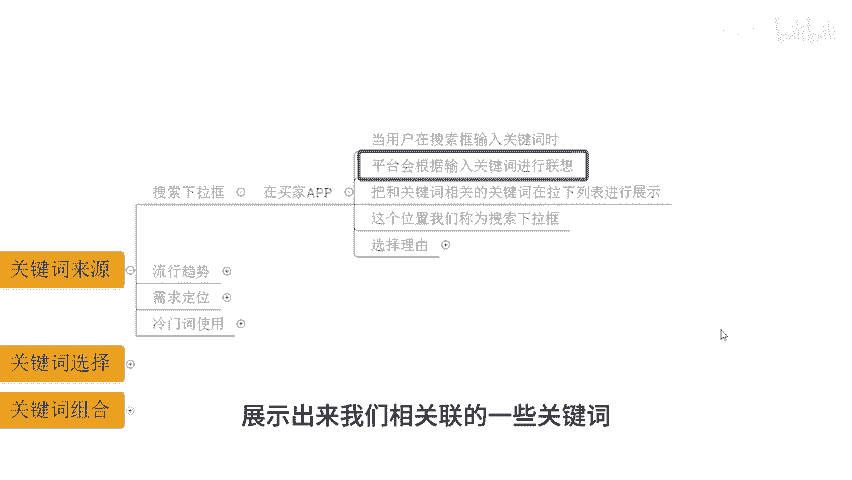

好，那选择他的理由，其实我刚刚有提到过，对不对？因为这些词呢，它首先跟我们产品呢是相关联的，一为关联度比较高的是一个关键词。同时呢那么。

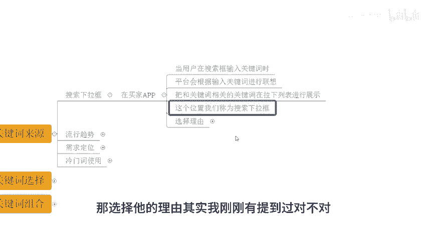

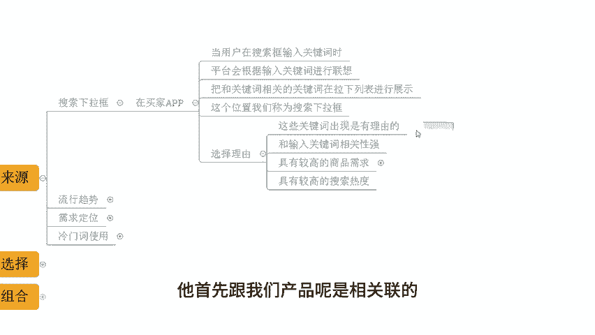

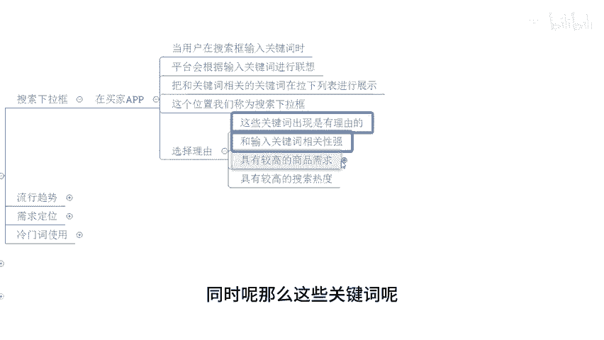

这些关键词呢，它一般是带着一些其他的属性词形助词的。所以他们的一个精准度会比较高一点啊，那么用户呢也会根据实际情况来选择这些关键词。那到后期呢可能会进行一个转化，对吧？

同时呢这些词呢它之所以能够出现在这个位置呢，也是。也是因为啊平台会判定说这些关键词和我们当前的这个输入的这个词呢，它的一个相关度比较高一点。那平时有人搜索这个我们输入关键词部分呢进行成交的话。

也会以我们下拉框这些关键词呢，它有一个比较高的一个呃这个联粘性吧，啊算是或者比较高的一个需求。所以用到这些词呢，我们后期整体的产品的点击和转化呢，也都会有到一些比较高的一个数据反馈哈。

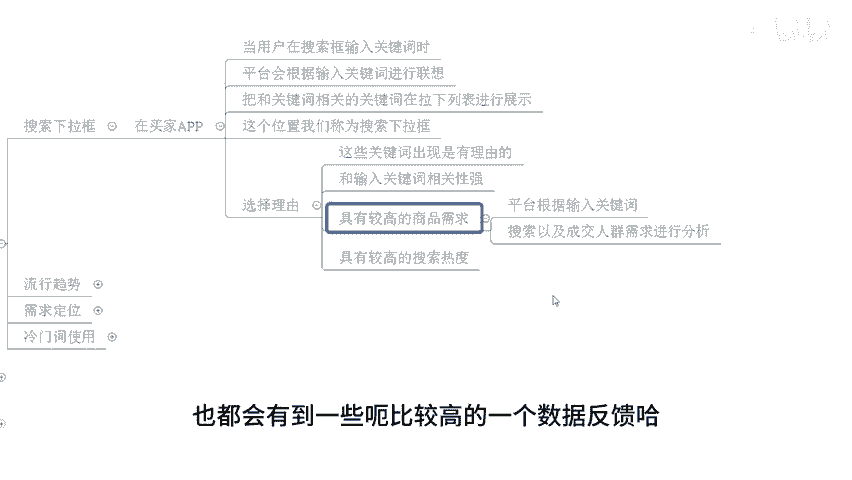

那么再一个呢，就是我们可以通过我们的流行趋势来进行一个关键词的选择啊。那么这些关键词呢都是我们可以去参考的。

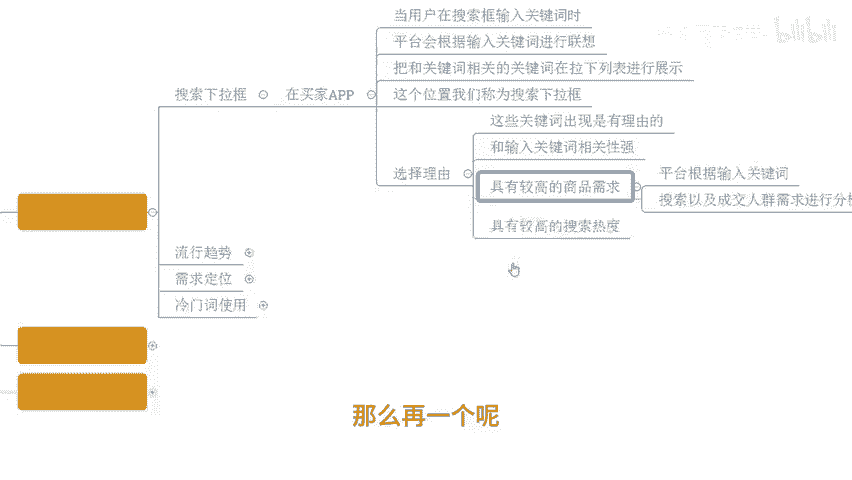

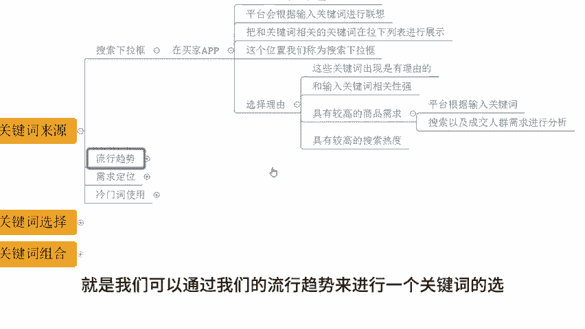

那在针对到我们的一些潮流时尚平台呀，或者是网红达人啊或者时尚大咖等等啊，他们啊平时呢也都会有到一些所谓的呃潮流的一些指引，对不对？那通过他们对这个潮流的一些影响啊，对这个流行的一些影响。

那么可能在未来一段时间里面，他们平时所呃关注的，或者所去提倡的一些。

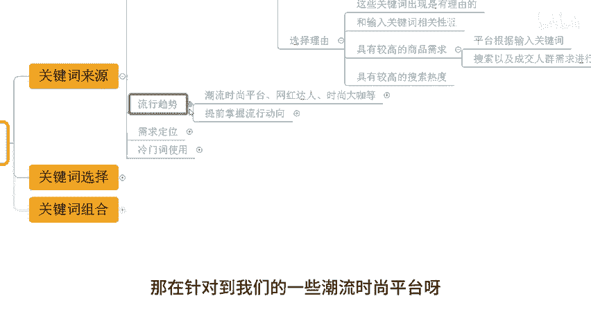

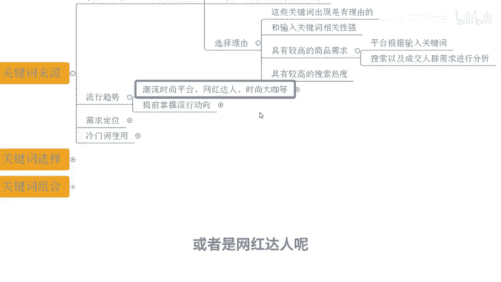

时尚的一些概念。长流的概念呢会在后面很长一段时间里面呢影响到我们未来的一个这个呃用户的一些观点啊。所以说在呃不同渠道和不同方式呢，那么对于我们公公众啊。

都会有到这种各种各方面的一个时尚观念的引导和消费能力的一个引导啊，所以我们可以干嘛呢？提前去掌握好这些人的一个动向啊，那像他们在。

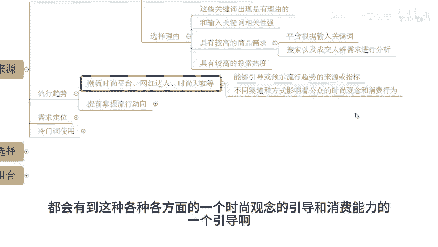

发布的一些当下的或者未来的一些流行的一些产品呢，使用的一些流行元素啊，对不对？那我们把它来作为我的标题啊进行制作的时候呢，进行使用它，使用到我的店铺里面来，对不对？

这个时候呢在未来这个流行元素或者这些词汇或者这些东西呢成为一个潮流风向的时候呢，他会有到非常高的一个热度。那这个时候呢，我也能够得到一个平台大量的一个曝光，是这样子的啊。

那么再一个呢就是我们的需求定位了。那这个呢是根据我们产品特性来的，是由我们自身作为商家去出发的啊，那么商家呢站在我们买家站在我们消费者的角度来根据我们的需求去找产品的时候。

如果我需要找到出符合我现在当前经营的这个产品的一些关键词，尤其是精准关键词时候，我会用到什么词去搜。那我会收到什么样的关键词之后呢，觉得哎刚好是符合我的需求的那我去通过这种词来进行我标。

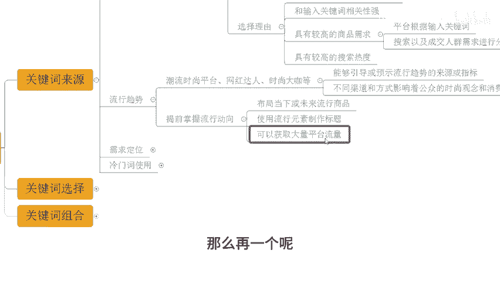

标题的一个完善啊，也是可以的。当然呢，这个可能更加偏向于啊个人主观和经验的一个呃这个方向了啊，是这样子的那另外呢就是我们冷门池啊。

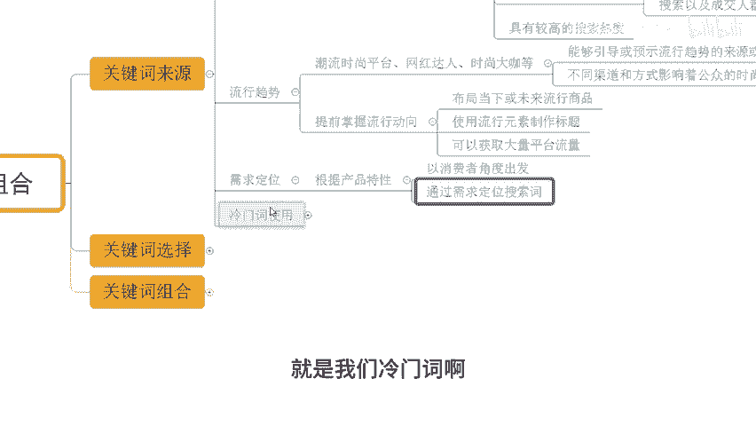

冷门池呢这个东西呢一定也是根据我们商品特性来的。那么这个所谓的冷门池，所谓的这一个商品的特性，对吧？我们要去分析。首先呢我们要针对到我们商品呢它的一个特性进行一个定义。

那么这个定义呢呃是作为我们后期的关键词来进行使用的啊，我们可以通过运营规划来通过未来一段时间对我们这个产品的呃所谓的冷门池的一个运用啊，或者是引导打造出非常庞大的一个搜索数据和产品的一个需求。

那么这样呢来告诉平台这样的一个属性这样的一个关键词会有到大量的用户有需要。那么让这个词的热度被平台认可之后进行一个推荐。推荐之后呢，因为别人没有在用这个词的时候呢，我有在用。

那从而呢让我可以形成对这个关键词对这个产品的一个垄断，是这样子的啊，所以关键词来源呢，我们通过四种渠道去找或者去确。

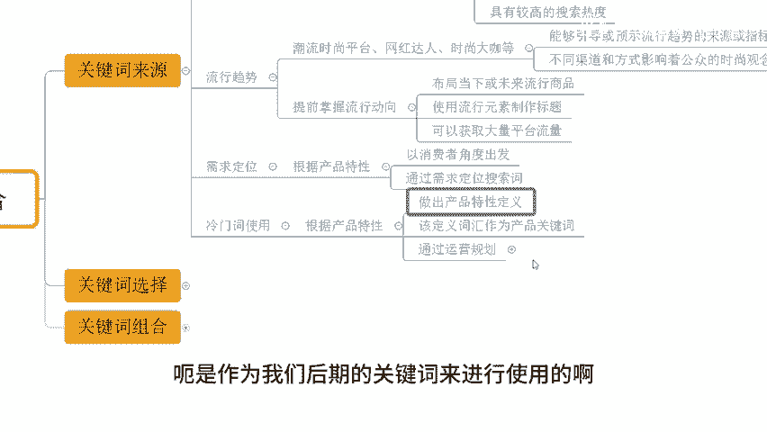

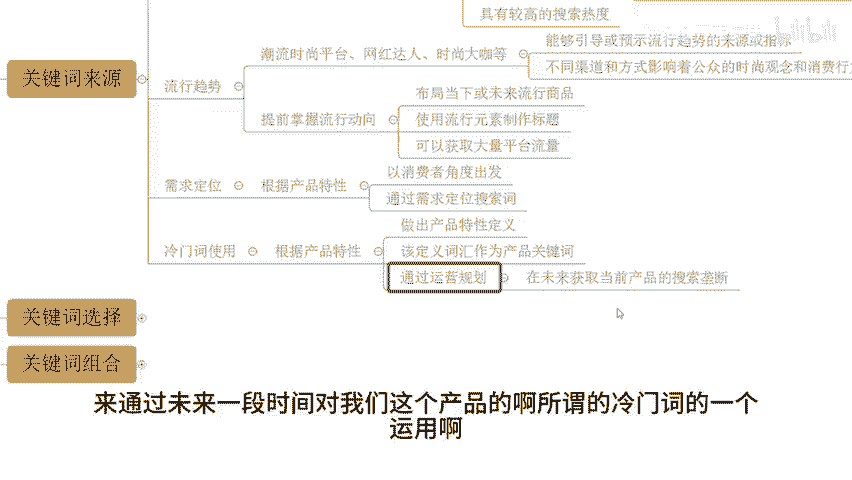

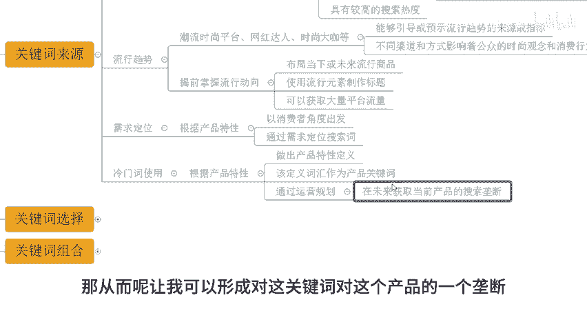

定都是没问题的。但是其中有一点冷门词一定要去做啊。那这些关键词我们应该怎么去选择，应该怎么去确定呢？OK。

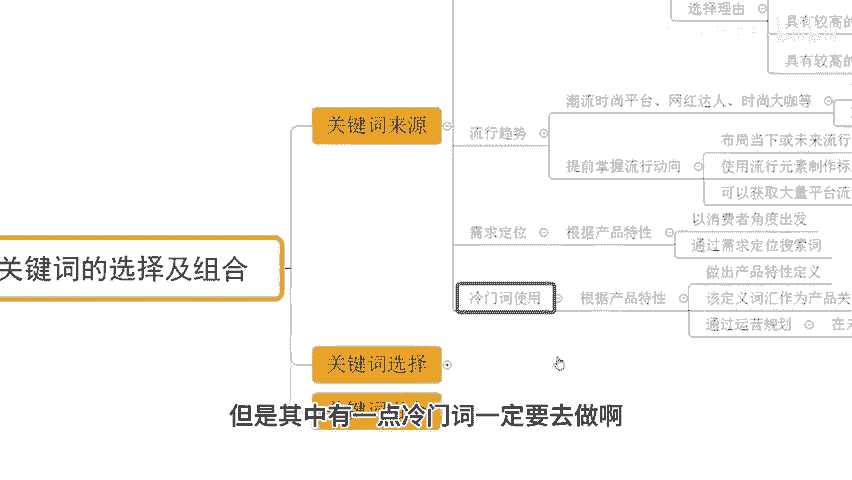

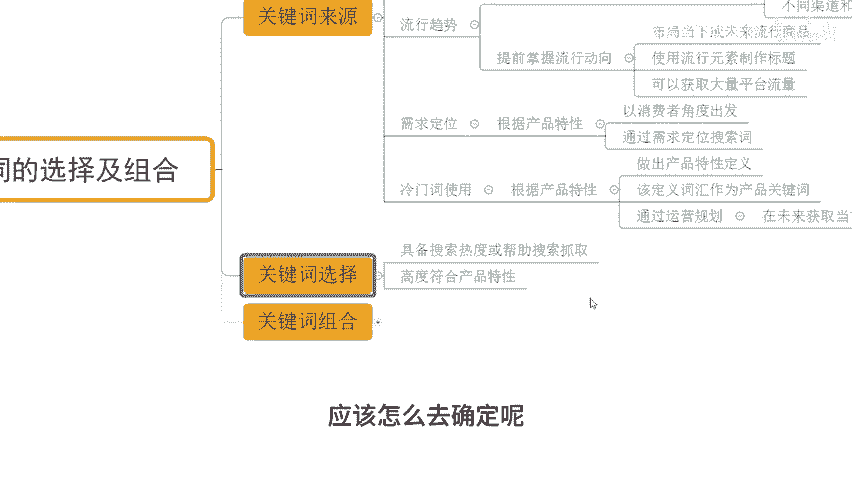

其实一句话就可以搞定他啊，就是我们要具备一定的搜索热度，或者帮助到我完成搜索抓取的高度符合产品特征的一些关键词。

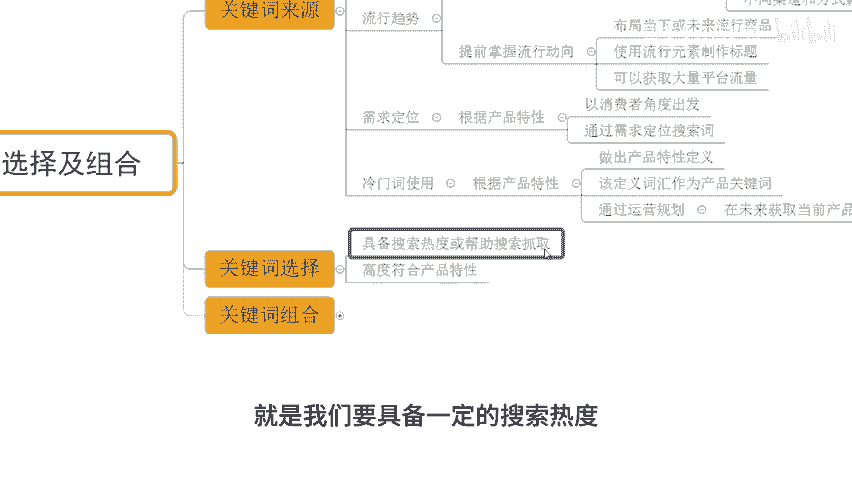

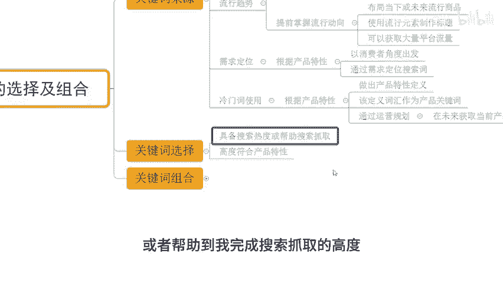

就这么一句话就搞定了啊。那么有了这些词之后呢，我们再来进行我们的标题组合。而标题组合的时候呢，参考到以下这些原则。第一个点呢就是我们的简洁明了啊，那让我的标题呢能够啊相对来说更加简洁，更加易懂。

避免啊特别的繁琐，特别的复杂的这样一些词汇啊，能够去直接表达出我产品的一些主要信息，我产品的一些特性，这是最简单的一个方式，对吧？那在组合关键词的时候呢，我们关键词啊要优先，对吧？

放在我们的一些这个重要关键词，要放在我们的头部前部。

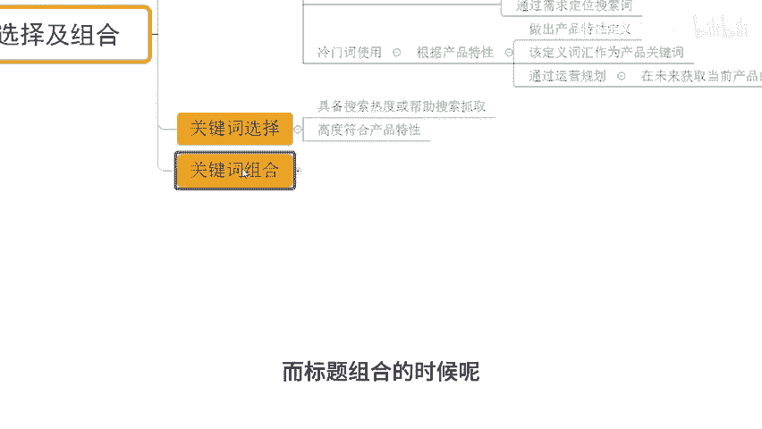

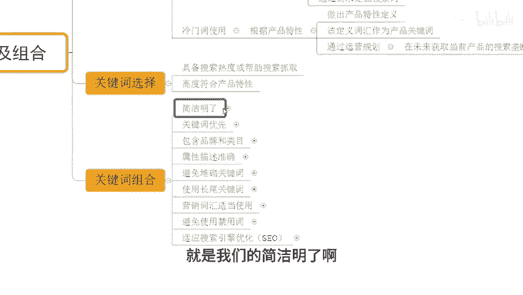

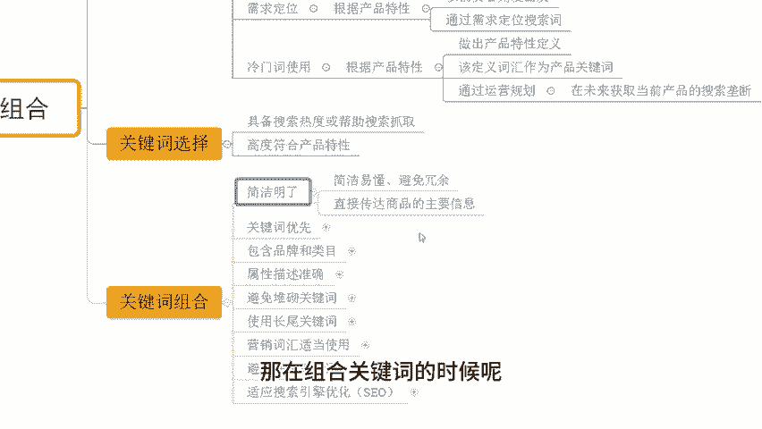

那么这样呢，既可以满足我们的所权众的一个抓取，又能够去增加我们点击。因为我们平时在我们收的结果页里面啊展示的话，只会展示我们前面部分的一个一个标题。这个时候呢，如果用户搜的这个关键词。

就是我们在前面部分写的这个关键词的话，那么这个时候用户点进率呢也会更高一点。

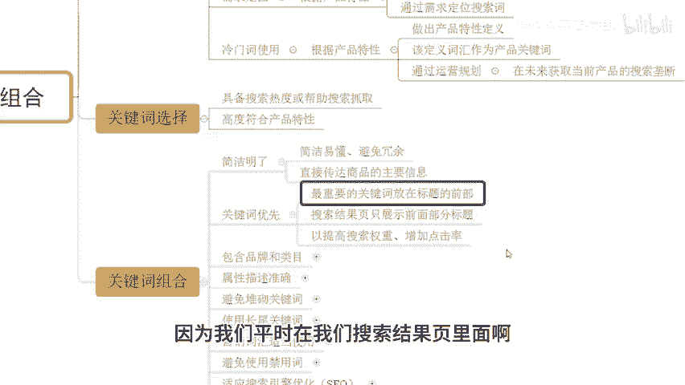

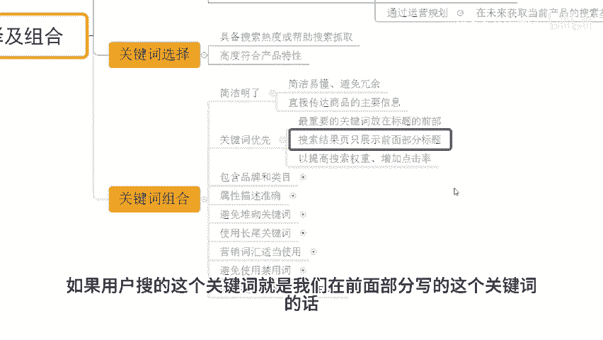

同时呢在我们的标题里面呢，要尽可能去包含到一些品牌值跟我们的类目词啊。因为如果说我们品牌是有一定知名度的，或者是有一定的这个影响力的，那么它一定是可以得到一个很好的推荐权重的对吧？

那即使推万步说我们的品牌本身没有任何的权重。那么放出去之后呢，也可以去通过我们产品的运营来带动我们品牌的一个影响力啊，来扩大我们品牌的一个认知，对吧？同时呢有到类目词的话。

也可以帮我们去完成我们产品的类目的一个推荐的一个锁定啊，也是可以的啊，那再一个就是我们属性描述要准确啊。这个东西呢，包括像我们产品的颜色呀尺寸啊材质啊功能啊等等啊，这些各种各样属性，一定要精准。

那么只有这些属性精准的，用户收到我们产品时候呢，才会有到更好点击，包括说在后期呢才可能会形成一个相对比较好的转化。如果说本身我们产品就不具备这样的属性你去乱写一通的话，后期的话，即使有用户。

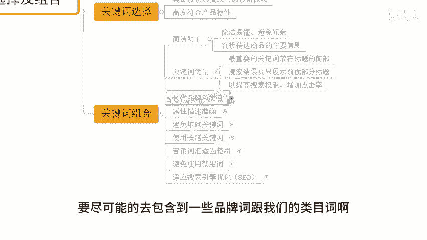

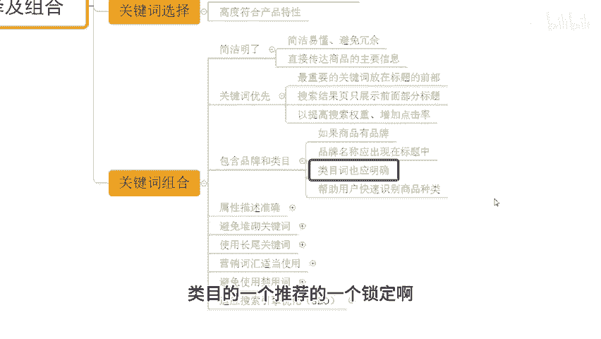

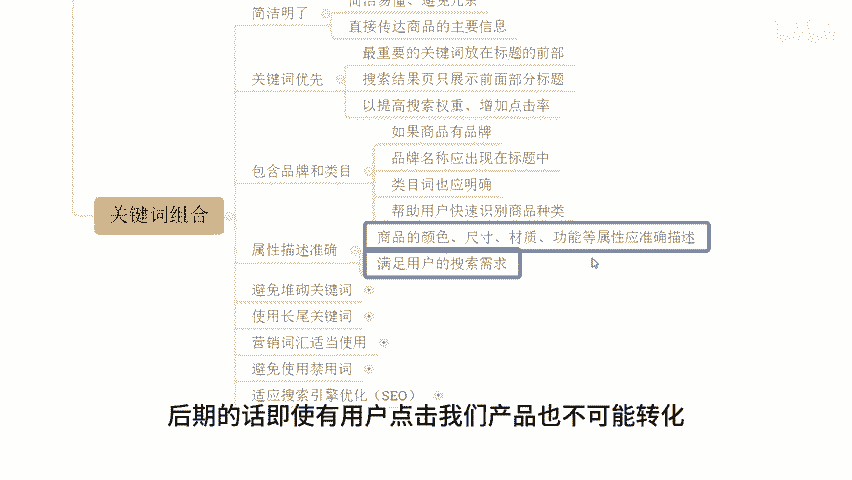

点击我们产品也不可能转化，它的转化率会很低啊，那就没有意义了。那再一个呢就是我们要避免堆砌关键词啊，这个东西很重要啊。因为我们呃在整个标题使用过程中的话啊，那字数是有限的对吧？只有30个字符啊。

只有60个字符有30个字的位置。那如果说我们在这个里面呢反复出现了相同的字相同的词的话，其实对于我们去覆盖到更大的这个搜索范围的话是不利的啊，那么这样呢我们的第一方面呢搜索范围会变小，覆盖会变小。

再一个方面就是我们这个单一的关键词，它在权重计算的时候呢，它会分散每一个词根都会记录一定的商品的权重。这个时候呢我们的词跟权重会相对更低一点啊，也会有不利影响。所以这方面呢希望大家能够了解清楚。

那再就是呢我们要尽可能的去多使用一些长尾词。那么这个长尾词呢是根据我们产品组词来进拓展的，进行一个纵向的一个。

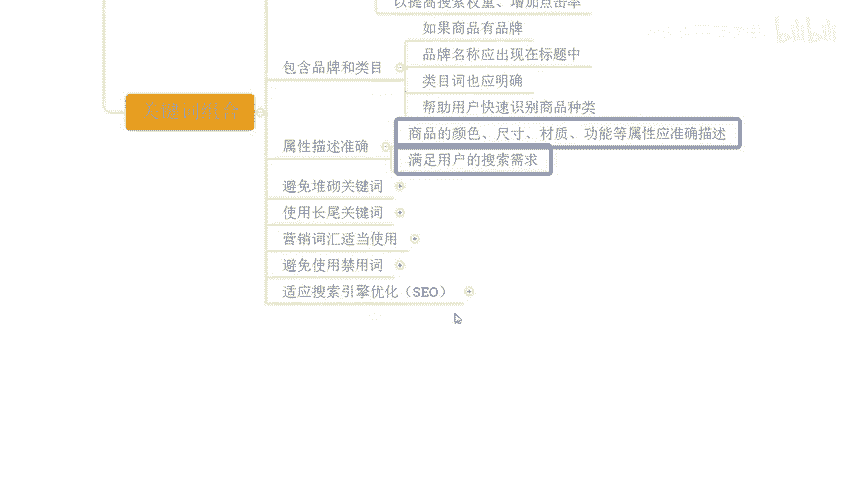

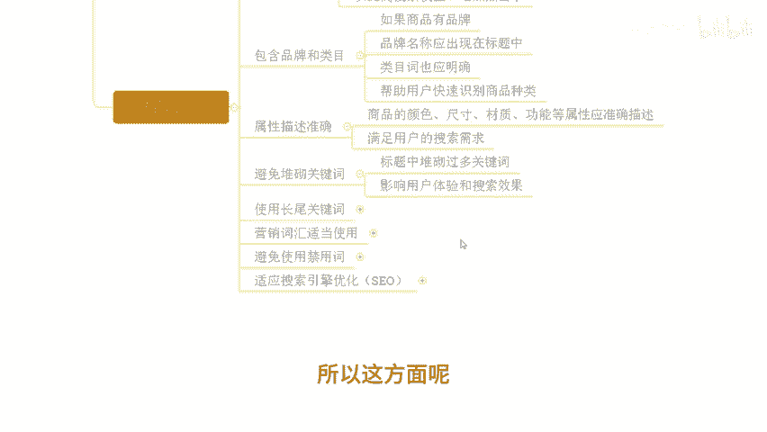

啊，划分的啊，这样的话他才能够去有到更加精准的流量覆盖。尤其在前期的时候呢，可能一些大池热词，我们没有办法拿到很好的曝光，但是能够去做到一个纵向的一个细分品相的一个长尾池的话，OK那么这个时候呢。

我整体的产品的进准度会更高。可能在一些长尾池的板块呢，我的曝光可能会更多一点啊。

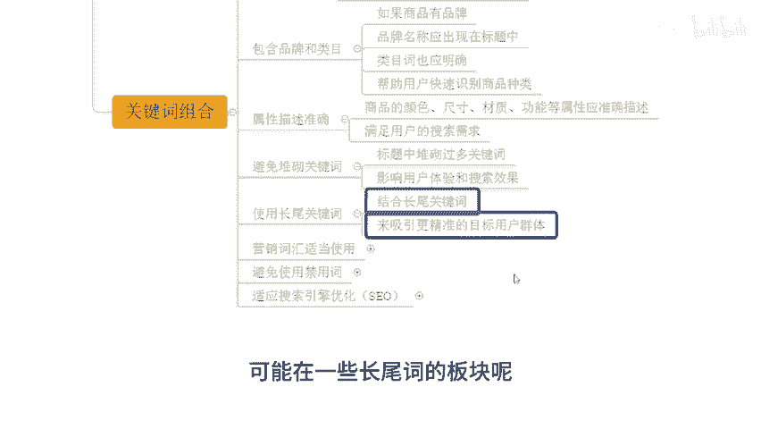

然后呢，再就是什么呢？我们要适当的去使用一些营销词了，像什么特价呀、新品啊、热卖呀等等这些营销词对吧？甚至是包邮啊对吧？等等这些东西。那么它可以更好吸引我们消费者的一个注意啊。

通过我们的这个活动信息的一个露出呢来完成我们后期转化的一个引导，包括点击的引导啊，都是可以的。

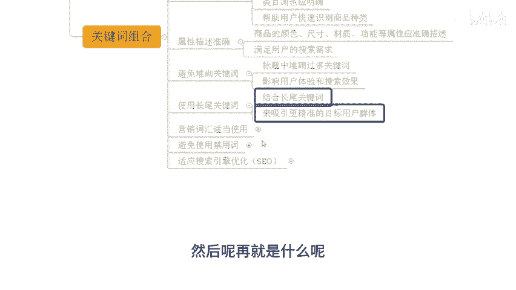

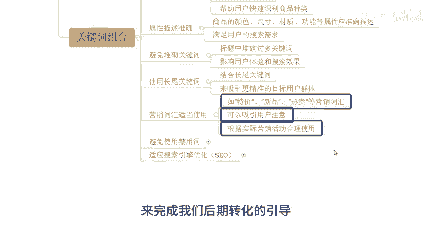

然后再一个就是什么呢？我们要呃避免使用到一些金融词，像一些相关的法律法规啊，还有平台规则规定的一些呃这个不符合规范的词啊，一些这个极限词啊啊这一个夸张的一些修饰词啊，这种东西不能用的就不要用啊。

避免违规啊。那么再一个呢就是我们要适应的搜索引擎的一个优化啊。在P多多平台的话，我们也要记算法的一个推荐权重，对不对？那优化我们关键词的一个使用。这样呢，在后期我们产品的排名考核过程中呢。

才有可能去有到一个更好的排名展示，达到更多曝光是这样子的。那么这就是我们组合的时候一些细节。那在主合过程中呢，其实把我们符合产品关键词呢进行一个这个融合就可以了啊，我们也不说是去进行一个组合吧。

可能组合这个词呢，对于大多数小伙伴来讲呢，可能更多时候呢会过分的去纠结所谓的排序之类的。其实。

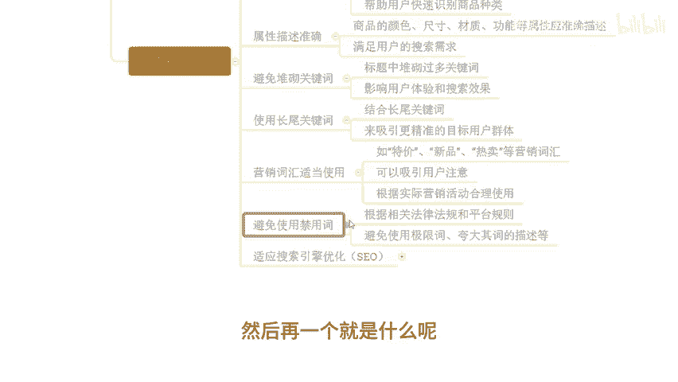

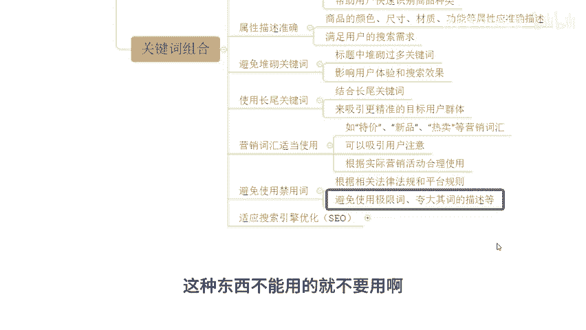

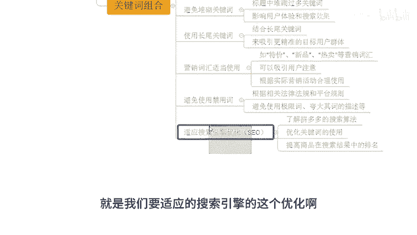

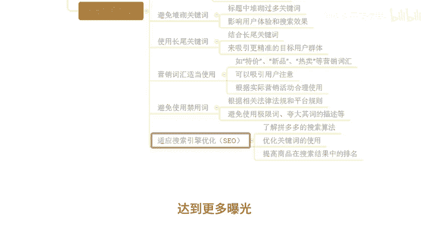

目前来讲的话，所系统呢是没有什么太大的一个呃区别的那我们能够去让更多的关键词进行啊融合，能够形成我们的标题，能够保证我们的同时人啊能够保证我们充分表达清楚我们的信息啊O的啊，那么在这个过程中呢。

这些词啊，也就是我们刚讲的这些下拉框词啊潮流趋势啊，包括我们这些需求定位啊，冷门词啊，通过我们的一个分析之后，把它尽可能完整的啊去在我们30个字里面进行表达O就可以的啊。O那么在标题写作过程中呢。

具体还有什么其他一些疑问，或者是具体操作方面有不懂的啊，或者有需要资料的啊，可以找我啊。那么今天的这个视频分享呢就到这里。那有时间的话，我也可以带着你一起去坐店啊。

就这小伙伴一样呢我们一起能够有到一个更加好的作方式，快速提升我们运营能力，让我们店铺呢达到更高水平好吧O那么我们下来见。

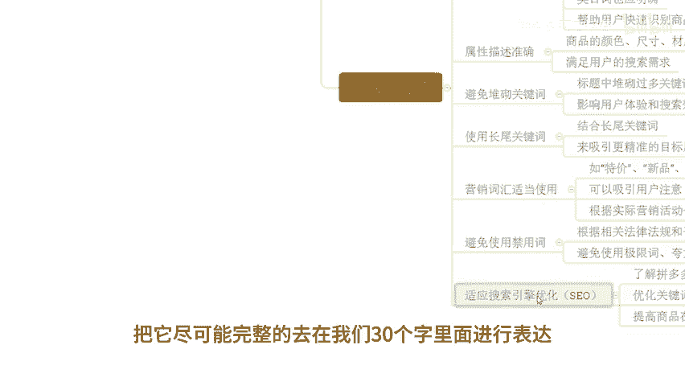

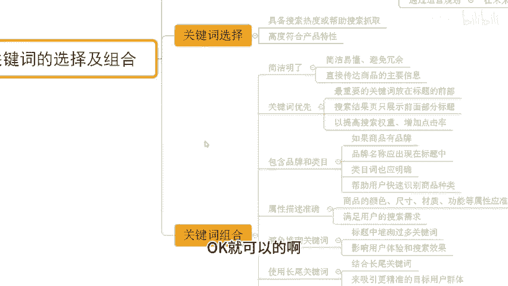

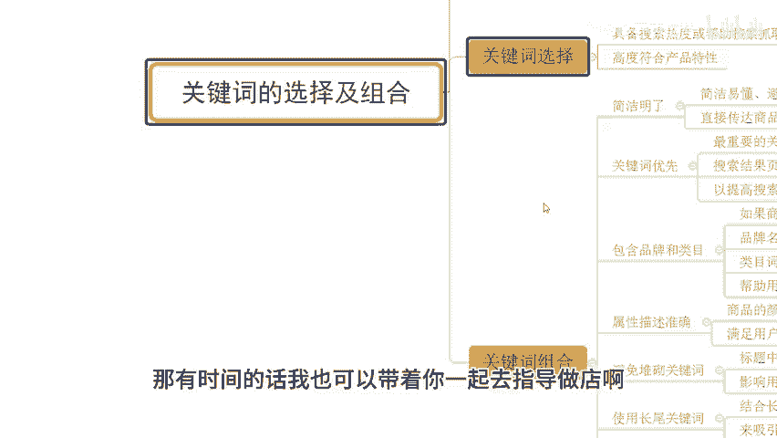

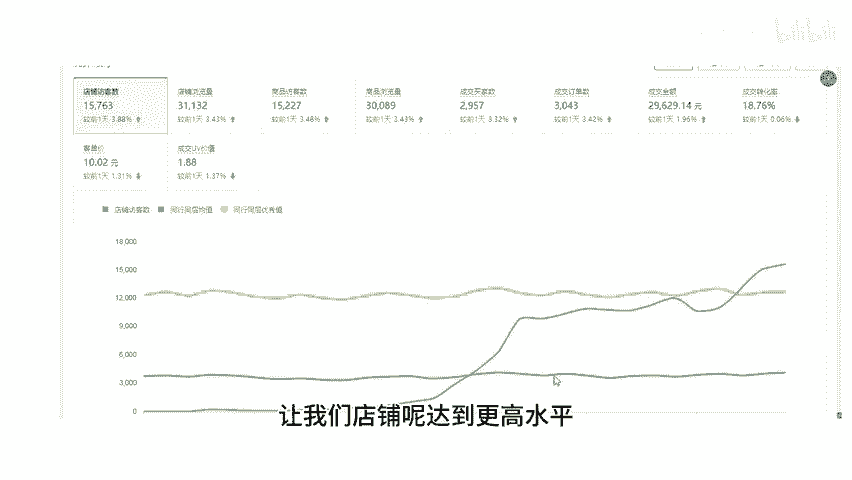

各位，拜拜。

