# 拼多多开店运营-新手电商运营实战指南，B站最全拼多多零基础入门教程！拼多多运营秘籍，小白也能成电商大亨！轻松上手拼多多，拼多多新手开店赚钱攻略 - P51：051 拼多多新店排名卡位 新手零基础如何做爆款 - 拼多多开店运营- - BV1xms8eSEVs

那我自己呢是10年开始独立名营垫铺的。😡，在整个过程中呢也走了很多弯路啊，也正是因为我走了很多弯路，所以说呢也铸就了我一些比较成熟的运营方法啊。那么到13年的时候呢。

我自己经营的淘宝女装店铺呢是进入了拓盆强啊算是赚到了我人生的第一桶金啊，那么从这之后呢，啊，可以说是顺风顺水吧，对吧？15年的时候呢，受邀在淘大做分享啊，当年呢也是被评选为了优秀讲师。

那么这一年呢也认识到了非常多的一些行业的大佬啊，那么对我的这一个人脉的拓展呢，也起到了很大帮助啊，那在17年的时候呢，也是跟我朋友对吧？当时一个这个拼多多这边的一个管理层的一个朋友啊。

当时极力要求我赶紧做拼多多，说这一年要爆发。哎，我信了他进了他之后呢，哎确实还不错啊，当年我拼多多的营业额呢就做到了800。😊，万啊那么同样的也是这一年啊，在行业里面呢名气呢也算是比较大一点了啊。

那么受邀呢成为了一家港交所上市公司的电商顾问啊，专门为他们提供一些电商运营方面的一些信息咨询啊。那19年的时候呢是参加了全国电商大赛啊，被评选为了优秀讲师啊，获得了认证讲师一个称号。20年的时候呢。

在成都移动电子工会上呢，被评选为了电商经营人物top10啊，22年的时候呢是在华南电商协会啊给我授予了一个荣誉副会长的一个称号啊，这就是我自己的一些小经历吧。那目前呢我自己经营的店铺呢品类比较多一点啊。

包括像我们的服装，这是我的老本行啊，一直在做啊，到后面呢也做了食品啊五金家居啊，这几个品类都在玩。那当下呢这些店铺也是交给我自己培养的运营团队，他们在操作。所以呢自己能够把控一个方向同时呢。

抽出时间来做一些其他拓展啊所以呢会做一些分享。😊，给大家啊，那么自己呢尤其擅长的呢是店铺的整体运营策划SU优化以及直通车板块。所以说大家如果说有店铺操作方面的问题，平时我们可以多沟通多交流，好吧？好了？

废话不多说，时间也差不多到了啊，大家都知道我干嘛的？你知道我是谁了，对不对？为什么说给大家做分享呢？我现在大家能感受到，对吧？毕竟呢确实啊还是有点小东西的对吧？OK啊，那么现在呢最后再确认一次啊。

所有的在直播间的小伙伴们能够清楚听到我声音的，能够看到我这边电脑桌面的声音跟方面都没有问题的话，公屏上小一走起来，好不好？😊，来动作换啊。ok ok ok啊，还不错啊还不错。😊，好，O。

那么时间已经到了啊，直接开始我们今天的一个正式分享啊，正式分享好吧，那今天分享内容呢叫做拼多多新店排名卡位新手零基础如何做爆款？我相信啊，如果说这两天有关注到我朋友圈的小伙伴呢，是有看到一个店铺的对吧？

那么这个店铺呢，它是一个纯新店来的，从8号开始入住啊，8号入住的。那么8号入住呢，截止到呃，13号的时候，他一天的订单呢是有40单啊。而且各位注意了，这个店铺呢是没有做一单刷单的。

完全没有去做任何的人工操作。各位这个店铺的操作方法呢，也是我今天要分享给大家这个方法啊，非常适合我们当下去起报新品去玩我们店铺爆款的一个方法。各位，那么如果说你今天自己对于店铺操作。是没有思路。

没有方法的。你是对于我们整个起报店铺比较迷茫的OK那么一定要用心听好吧，那么把这个东西掌握好之后呢，对你自己店铺的提升是非常非常大的。那么像我们很多小伙伴之所以觉得店铺不好做，做不起来。

其实呢也正是因为很多细节没有把控到位啊，这里我多一句嘴啊，问一下啊，各位目前就是我刚刚一开始就是问大家嘛，对吧？你们说很多小伙伴是已经开店了嘛啊，扣了一个6的，说开店了，那我现在先确认一下啊。

各位当前已经开店的小伙伴。你们觉得新平起报很难的，觉得流量很难获取的，觉得操作起来非常痛苦的这种小伙伴呢，公屏上现在可以打一个2，好不？来，我确认一下好吧，我确认一下啊。😡，OK啊，还不少啊还不少。

那么其他小伙伴呢是觉得这个新品操作比较简单吗？还是怎么样呢？嗯，没有没有这一个科数质的小伙伴是呃什么样的一个想法可以说一下啊，是还没有做呢，还是觉得很简单啊。那如果说觉得这个东西确实很简单。

觉得对你来说没有什么太大的帮助的话，现在其实可以退出去的。因为今天的话主要就涉及到了新品操作啊，主要涉及到新品操作啊，还没做啊还没做没关系，没做，你可以打问号，你不知道吧？

我对这个没有概念O你可以打一个问号好吧？这样子呢我也能够清楚知道你的状态啊，如果说你觉得是很简单的O那么现在可以退出的啊，不浪费时间啊我这个人呢比较实际也比较讲究效率啊。

那么完全没有必要浪费更多时间在这里啊做了3天三天后就没流量了啊。然后呢还有小伙伴说开了几个星期感觉只能开了才能卖好。😊，Okay。这是很正常的一个事情啊，也很现实的一个问题。做店铺有的时候就是这样子的。

让我们觉得确实有点无从下手。到最后发现呢，我只能去干嘛呢？去只能去开车去做付费推广拿流量，但是这种方式对我们店铺伤害又很大，对吧？那么到后期你会发现你开车开完之后啊，开车开完之后呢。

你会发现你的开车的这个曝光量会越来越少。曝光越来越少啊，然后呢，你的出价也会越来越贵。啊，然后呢，整体的这个呃数据量啊也越来越少。最后就直接完全烧不动了，对吧？基本这个样子的啊，基本这个样子的。

那么之所以你们做店铺会有这样的一些困惑，会有这样的一些无从下手的感觉呢。实际上我告诉大家，并不是说拼多多真的有多难啊，真的在众多的电商平台里面。😡，我个人。每个平台都在操作，都呃亲身经历过的。

我个人啊非常直观的感受，包括说我带了很多人去做实操，包括很多平台也都有在做啊，那么。这个感受是非常直观的，就是拼多多在众多平台里面，它是最容易上手的。😡，那之所以大家会觉得拼多多却无从下手。

不知道怎么去做，没有感觉，不知道怎么去玩它，对吧？做不起来。很多时候呢，就是因为你根本没有理清楚平台它的排名卡位到底怎么去计算的，它怎么去获取排名的，这个是一个非常现实的问题。😡，好吧。

那么现在呢我现在就问大家一个问题啊，这个问题我希望大家呢能够认真思考，把你真正意义上深思熟虑的答案呢发在公屏上。如果说你没有答案的，你不懂运营，你完全没有概念的，OK打问号啊。

让我清楚知道你确实是不知道的，你是什么样一个状态方便呢，我后面给大家分享好不？OK什么问题呢？来，各位注意听了啊，什么问题呢？对于我们的新品啊对于我们的新品，各位注意了啊，对于我们的新品。

那产产品上架之后。产品上架之后。啊，平台考核的第一项数据是什么？嗯。这个是什么？😡，各位可以把你自己认为正确答案发出来。如果不知道答问号，好吧，如果说哎西楼，我对这个东西真的完全一窍不通，没有概念。

OK打问号好吧，那么如果说你心目中是有答案的，可以把答案发在公屏上，好吧OK呃，新文庆说，哎，搜索流量。😡，然后大寒2。0说哎，人气。然后西门庆又讲了一个曝光啊，然后其他小伙伴呢都是问号居多。

还有没有要补充的？嗯，还有没有补充的？还有没有补充的？有没有有没有没有要补充的啊，来动作快啊，如果说没有要补充的，如果说确实不知道打问号。如果说没有要补充的，公屏上也可以扣一个一，好吧。

让我知道你们的状态啊，不然的话可能我呃一直等着你们在给我这个答案的同时呢，会浪费到很多的时间啊，会影响我们整个的节奏，好不好？来啊，可以动作快一点啊，然后还有这一个自然流量，对吧？OK。😡，好。

那么截止到目前啊截止到目前啊，给到我的答案呢，就这些啊，还有点击是吧哎。啊，西门庆啊，你这个不愧是西门大官人啊，知道了真多啊，你懂得太多了啊。😊，我要让我的武松兄弟来教训你了。😊，O了。😊。

那刚刚呢呃大家给到我的答案呢有这些啊，刚刚大家给到我的答案有这些啊，那么各位。😊，现在呢我们就来说一说这个事情。来兄弟们。我们现在反思一下啊呃呃还有收藏吧，对吧？那没关系啊。

你觉得有就可以可以打出来就好了啊。收藏啊。OK现在我们来反思一下啊。刚刚呢我问了一个问题，我说我们新品上架之后啊，平台考核的第一项数据是什么，大家呢给了我很多答案，对吧？确实也有在思考。

这个我是看得到的，我是感受到到的啊，所以我呢也非常的觉得呃感谢大家对吧？能够去配合我啊，非常不错啊，感谢大家，但是呢有绝大部分小伙伴呢是没有答案的，不知道对吧？😊，各位，如果说你对于这个东西是不知道的。

那么我现在问你一个问题啊，你不用回答我，你在你心里面好好去想一想这个问题，好不好，你。😡，凭什么能做好店铺？好吧，如果说这种问题你是没有答案的，你认真思考一下，你凭什么能做好店铺？😡，我们做任何事情啊。

各位注意了，我们做任何事情，你想要做好，你想要做成功，你不可能是靠运气的。😡，做店铺呢是做生意，对吧？如果说做生意这个事情，我们根本自己都没有了解清楚情况，盲目操作的话，那么你会亏钱的。😡。

这个很现实的问题好不好？那么刚刚如果说这个问题是没有答案的小伙伴，目前是已经开店的小伙伴，现在请你公屏上打一个2。😡，好吧，可以动作快啊，我知道大有人在啊，刚刚有很多小伙伴是刚刚是呃扣了问号的。

是已经开店的啊，很多小伙伴都这样子的。那么注意了，兄弟们啊，今天自己给自己敲响一个警钟啊，你在没有掌握运营技巧之前。😊，如果你想要去赚到钱。😡，OK的。那么多花点心思在自己的店铺上。

多花点心思在研究算法上，多花点心思在我们产品上。只有这样你才能够有机会做好。好吧，有很多很多小伙伴啊，这里我说一下啊，每天会花费很大的时间去看一些所谓的干货啊吧？研究所谓的干货，对吧？研究所谓的视频。

研究所谓的黑科技，但是真正意义上对自己的店铺却很少关注。😊，这是很现实的问题。啊，我经常会问大家一个事情，我说哎，那你现在店铺没有做好，你店铺数据不是很多的情况之下，那你觉得你店铺最大的问题是什么呢？

很多人是没有办法清楚的表述出店铺存在的问题是什么的。他只能说一句话，我店铺没有访客。😡，各位。😡，这个很恐怖啊这个很恐怖。什么意思呢？注意没有反客是结果，对吧？没有反客是我们店铺经营的结果。

它不是我们店铺的问题。😡，我们店铺的问题是我们如何去获取访客？我们在获取访客过程中，为什么没有达成我们达到想要的目的？各位，这个逻辑能不能理解？如果能的话，公屏打个6。😡，好吧。

如果这个逻辑能够理解公屏打个6啊，所以说大家心里面一定要有这样的一个概念啊，做店铺的话不要盲目操作，不要乱操作，心里面一定要先给自己画一个线，先给自己定一个目标。😡，啊，OK啊扯远啊扯远了啊。

这个刚刚这个有点小激动啊，扯得有点远，但是问题不大啊，问题不大啊，也不影响我们今天的分享啊。那么刚刚呢是分享到说我们这个店铺第一个考核数据是什么，对吧？大家给到我的答案，那我们一起来剖析一下啊，好吧。

😊，来，首先呢刚才小伙友讲的说是搜索流量啊，有自然流量啊，有这个人气曝光点击收藏啊。那么这里呢我直接到告诉大家啊，这里我直接告诉大家好吧，这里我直接告诉大家啊。😡。

那么平台在针对到我们产品进行的第一个考核数据。就是报关。啊，他的考核的第一个数据就是保光。什么意思呢？各位来啊，举个例子，现在呢我们的店铺有进行产品上架。啊，我们现在店铺有进行产品上架啊。

上架的商品呢一个是A。一个是B。好吧，一个是A，一个是B。那么AB2个商品，他们两个谁权重更高啊，谁权重更高。那么这个时候平台是会根据我们的商品的什么啊？质量来进行考核了，对不对？根据我们的标题。

根据我们的关键词，根据我们的价格，根据我们的属性，根据我们的图片等等。进行考核，考核完成之后会进行对应人群的推荐。那么这一个推荐得到的数据就是曝光。啊，这个时候他会进行推荐啊。

推荐的时候得到的数据就是曝光啊，那么曝光多少啊，曝光多少，直接就会影响到后续数据。那在前期如果说我们都是新品刚刚上架的情况之下，曝光越多的商品，我们会认为平台考核产品过程中判定我们商品的受众群体更大。

产品的这个需求量更多，机会更大。啊，也就是它的基础权重更高。各位这个逻辑能够听明白的话，公屏上打个一。啊，这里就涉及到一个概念叫基础权重啊。这个东西呢是我们的产品的啊商品质量来确定的。商品质量是什么呢？

商品质量是我们的标题啊，我们的关键词，我们的。图片啊。我们的价格，我们的属性啊等等啊等等。好吧，这些乱七八糟的东西啊，那么在这个时候，针对到商品曝光产生之后呢，就会进行第一组数据的后续考核了啊。

那么这里的考核点，各位。应该很清楚吧，产品有了曝光之后，后续考核什么考核我们的点击。啊，考核我们的点击。啊，好我们点击。那如果今天AB两个商品，它的推荐曝光啊，它的推荐曝光一致。啊。

他的推荐曝光是一致的啊，那么产品A呢拿到的曝光是。1万产品B拿到曝光也是1万，或者产品A拿到的曝光是500，产品B拿到的曝光也是500。他们俩的曝光是一致的啊。那么这个时候呢，点击的差异会形成点击率。

对吧？点击量的差异，会形成点击率，那么点击率越高的商品平台会认为。😡，用户喜爱度更高。啊，点击率更高的话啊，用户喜爱度就更高。换句话说呢，在不考虑后续成交的前提之下。

那么未来一段时间里面产品进行推荐排名的话，那么平台会优先推荐谁点击率更高的产品。各位来。整个到目前为止，这个思路是通的，公屏上打个6啊，到目前为止，整个思路是通的，公屏打个6啊。如果说有没有听明白的。

没有理解到的，公屏上可以直接问的啊，好不好？有任何店铺操作方面的问题啊，大家记住了啊，马上提出我们马上解决啊，不要去拖沓，不要耽搁啊，好不好？😡，O啊。都能理解吗？啊，其他人呢？嗯，其他人呢来所有人啊。

所有在直播间小伙伴们啊都动起来，好吧啊，你们在直播间的话啊呃互动一定要积极。😡，啊，一定要积极，因为你只能只有互动积极的话，这样子才能够思路跟上，不至于说开小差。在我分享的过程中呢。

跟我互动积极的时候呢，也能够更好的去理解啊，去吸收。好吧？OK呃，理解了，但是还是不知道怎么去曝怎么去做曝光。OK不着急啊，不着急，我们继续往下来分析啊，我们继续往下分析。那刚刚我们提到过一个词啊。

就是在不考虑后续成交的情况之下，平台呢会优先推荐点击率更高的商品，对不对？但是可能不考虑成交吗？嗯，但是可能不考虑成交吗？大家觉得可能吗？觉得可能的工作人打一个可能好不好？觉得不可能的。

打一个不可能好吧，来动动快啊，我看一下。😡，嗯。啊，明显感觉啊打数打数字的时候，大家的回复都会比较快一点啊，然后打汉字是都会慢一点啊，好吧，是打汉字比较麻烦，是不是？😊，哎。

下次我还是尽量的让你们扣数字吧，好不好。这样子呢，你们可以稍微轻松一点啊。OK啊呃这个。😊，指意说可能啊这个把我惊到了啊，那我们平台在进行商品考核的时候，一定是会考核到我们后续成交的。

所以说不可能不考核啊，这是肯定的。但是即使它会考核，也要分阶段，也要分时候啊。那今天呢我们的产品是新品啊，我们的产品呢没有基础销量啊，也没有评价。😊，我们可能到目前为止呢，是什么都没有。

是吧目前为止什么都没有。那这个时候用户看到我们的商品。😡，被系统推荐之后，看到我们商品完成了产品的曝光获取，得到了产品曝光。

得到了用户点击它转化率和我们有有基础数据的历史数据有一定沉淀的这种老商品来对比的话，他有优势吗？嗯，各位觉得有优势的公民打一，觉得没有优势的公民打2。啊，有优势的打一啊，没有优势打2啊，动作快。😊。

OK对，像西门说的，哎，这个呃这个这个什么都没有，他不一定购买的啊。点击数据这点击数据，你直接看你的访客量就可以了。我们直接前期就用访客量来来来来来这个分析就可以了啊。好吧，OK好。

那么现在啊那么现在问题来了。😊，既然说我们现在本身是什么都没有的情况之下，转化概率就很低。如果说平台会进行我们的转化考核的话，我们跟老链接老商品那些成熟的商品来对比，肯定是没有优势的，对不对？

所以这个阶段的话，平台不会去重点考核我们的成交啊，成交它会进行弱化懂吗？在新品阶段它会弱化啊，但是这个弱化呢是分阶段的啊，但这个弱化呢是分阶段的啊，在今年的5月份之前啊，在今年的5月份之前。😡。

这个阶段呢是有7天。啊，7天前面呢几乎啊几乎是不考核的啊，7天前面是几乎不考核的啊。5月份之后呢，这个改版了啊，算法更新了啊，变成了3天。啊，变成了3天啊，所以前三天你转化少或者没有转化问题不大。

但是如果超过3天之后你没有转化，那么抱歉啊，你的产品权重在很大程度上来说跟同行对比的话会弱很多。啊，会做很多啊，新品整个产品的新品阶段呢是一个月，但是这一个月呢会不断的进行考核。

不断的进行这一个平台的一个这个呃商品池的一个一个一个排查啊，好吧，你的数据不达标，踢出去，你的这个同款相似款特别多踢出去啊，包括说你的这个源创性不够踢出去，知道吧？它会不断的去刷出来啊。

最长时间呢是一个月啊，最长时间是一个月啊，这个是新品考核，那么在整个的操作过程中，那既然说我们是新品，对吧？那前期呢平台也会弱化到我们的这一个转化的考核，那我们要不要去做我们可以做，我们也可以不做。

对吧？啊，按照理论上的说是这样子的，但是我们不做我们的同行会做对吧？😊，那么这个时候如果真的在这一个板块我完全不去做，我肯定会落后于我的同行。那么怎么办？那么我们就得搞清楚平台具体考核的东西是什么。

我们要做哪一个板块为主，并且呢我们应该维护哪些数据。啊，那么首先在我们新品阶段，虽然说转化考核是弱化，但是他会参与考核考核的数据比例占比呢，这里跟大家讲一下啊，是40%。啊，40%。

那么我们可以这样理解，就是整个产品的权重分满分100分。那么产品的转化的数据呢，相量的数据呢，它一共占了40分，好不好，一共占了40分。那么另外呢还有60%，也就是60分，它是另外的部分，哪部分呢？

这部分呢就是我们产品的人气。刚刚是有小伙伴提到过这个词的啊，那么这个人气呢指的是我们产品的这个曝光啊，搜索热度。点击率。点击量。啊，是这些啊是这些。那么呃这个产品的40%的部分呢。

这个是我们刚刚讲到的产品的后续的转化部分，对吧？销量部分，那么这个我们统称为销量数据啊，销量啊，那么它呢就实际呢就包含了很多东西了啊，有我们产品的订单量啊，单量啊单量，我这里写单量吧，这样子好理解点啊。

单量啊啊，还有到我们的产品的转化率啊，还有我们产品的成交额，还有我们产品的UV价值，还有我们产品的同比增长率。😊，还有我们产品的收藏率。啊。包括说后续呢还有更多的一些数据会考核。

但大体的东西呢就这些好吧，各位考核的内容现在能够记住的，或者能够看到的，现在赶紧的啊，可以截个屏保存一下啊，然后记一下没问题的话，公屏上打个一啊，先记一下，然后我跟大家讲一下为什么这样子啊。

那么这些我们应该怎么去做啊，我再跟他说一下就好了。这样子呢，大家可以更加的轻松一点，理解起来好不好？来呃，能够记住的话，公屏扣个一啊，动么快。😊，OK啊，如果说这些数据里面你有真的自己不理解的地方呢。

也可以直接说啊，也可以直接说啊。好吧，来啊，那么这个时候我们要注注意的一个事情是什么呢？我要去做我的产品权重是新品权重，对不对？我要去达成我产品的推荐曝光是吧？刚刚不是小伙伴在说吗，哎。

你这个逻辑我是能够理解，但是重点是这个曝光，我应该怎么去做，对吧？这个很关键啊，啊，UV什么意思是吧？OK啊，呃，UV。😊，这个东西呢呃我不知道你们对于互联网了解多少啊。

UV其实就是一个用户啊一个用户啊啊一个访客，他进入我们店铺呢是SUV。也行吧也行吧啊，一个用户进入我们店铺呢，他是记录1个UV的啊，就是呃1个IP地址，你们可以这样理解吧，1个IP进来一次啊啊。

1个IP进来一次，一个人进来一次，他是1个UV。那么他反复进来多次呢，还是记录1个UV。但是他会记录啊这个浏览量就会变成的PV啊。UV的意思就是当前你店铺有多少个人进来。

而UV价值呢就是这些人平均每个人他能给你店铺创造的这个呃价值是多少啊，创造的这个营业额是多少比举个例子啊，假如说现在呢我们店铺一共呢卖了10万块钱，好吧啊，我们店铺一共卖了10万块钱。啊。

这是我的营业额啊这是我营业额。那我店铺呢有1万个访客。😡，好吧，我店铺有1万个访客，那么这个时候110万的营业额和1万个访客，他的UV价值就是10万除以1万，对吧？就等于10好不好，就等于10。

那么另外呢，与此同时，假如说有一个店铺呢，他也是呃做了10万的营业额，好不好？他也做了10万的营业额。但是他的店铺呢访客只有5000个啊，他只有5000个访客。那么这个时候他的UV价值呢就是20。

我们认为。5000访客UV价值20的这个店铺呢，对流量的利用率更高，对平台来说，它的价值也就更大。来，各位能够明白，能够理解公屏上小六走一波好吧，动作快。😡，那么这些所有的数据啊注意了啊。

这些所有的数据在进行产品考核的时候呢，都会记录进来啊，这所有东西都会记录进来。只不过各位注意了啊，如果前期你上来就去做这个订单，做销量，对吧？做呃转化率，做销售，叫销售额啊。😡，这些乱七八糟东西啊。

那么你做破天顶破天，也就只够做到40%。也就只能做到40分，对吧？但凡我把这些产品的人气部分做好的话，我有60分，我会比你更强。😡，啊，我会比你更强。那如果说我在做的时候，我把这所有东西都做到位的话。

ok我能拿到100分。所以我的权重就会更高。好吧，而且还有更加重要的一点什么呢？如果说你真的在前期的时候，能够把这60分做到位，你的产品曝光就会很多，而且你的数据正常也会很快啊。

当你能够去引导真实转化的时候呢，你甚至于就可以直接去起爆。好吧，各位还记得我一开始跟你们讲的就呃我这个昨天啊包括说呃分享的这个朋友圈的这个小伙伴吗？大家记得吗？😡，还记得吗？8号开的一个新店啊。

8号开的一个新店啊，对吧？8号啊8号。注册开的新店啊，8号注册开的新店啊，上架商品到产品开始去操作经营啊，截止到我们的这个13号的时候，这一天啊一天店铺真实订单已经40多单了。

店铺的访客已经有1900多了啊，1900多了啊，这个大家是有看到的，对不对？那么这个店铺呢完完整整的是没有去做任何的补单之类的操作，完完整整的是只去做了前期的什么人气权重板块。

那么它的知识转化是能够跟上的，后面是没有做任何其他操作的，直接就拉爆了啊，直接拉爆了啊，那么怎么去做的，现在开始正式分享啊，那么整个考核板块考核内容给大家讲清楚了。

那么现在我们就说说这些数据到底怎么去做的啊？各位所有的啊注意力即中啊，想要听的，现在。公屏上8打一个啊，所有人注意力集中啊，想要听的公屏上打一个8啊。那么可以认真听。如果说等一会儿你说哎西楼。

我没有听明白，我没有听懂，那么ok的，你直接问直接讲我们马上去回答如果说你现在没有在听注意力没有集中，你错过的对吧？O我先说一句抱歉啊，这是你自己的问题好不好？我不可能说单独的去照顾到某一个人对吧？

毕竟我是分享给大家的啊，O啊，那么来啊，所有人注意了啊，在整个的操作过程中的话，刚刚我们提到的新品的运营呢是会涉及到两个重点考核板块，对吧？一个是我们产品的啊什么呀？点击啊这个下，这里啊。

点击点击率对吧？啊，包括说我们的热度啊，包括像我们还有产品的一个呃这个后续的一个销量，对不对？做了十来天搜索点击。😊，呃，怎么还没有流量呢？是做的啥吗？这个我不清楚你怎么做的啊，这个我不清楚你怎么做的。

这没有办法帮你判断的。这个实话实说啊，对吧？我也不是神仙啊，不能掐指一算嘛，对吧？哎，我掐指一算啊，性能庆啊，你店铺呢是什么什么问题的那不太可能啊，好吧，这个毕竟呢是涉及到具体数据具体分析的嘛啊。

我们讲做店呢就是实事求是嘛，对不对？不能说是主观去臆测啊，这样子做不好店铺的啊，那么你店铺做了十来天搜索和点击还是没有流量的话啊，O呃很多个方面都有可能啊，一个要么就是你产品的选品有问题。

再一个你关键只有问题。再一个你可能商品本身的这个呃属性方面有问题，或者是你产品定价有问题。那么再一个呢啊也有可能就是你产品的这个呃原创度不够啊，你的标题，你的这一个主图，你的这一个产品图啊，原创度不够。

导致你的推荐会比较弱一点啊，都有可能啊，这个原因很多啊，没有办法去一概而论啊。😊，当然呢，还有到一个问题就是什么？可能你操作过程中呢，你的数据。做了啊，但是数据有问题异常，导致被查了。

只不过没有给通知而已，好不好？只不过没有给通知而已啊。那么这里呢，我顺便问一句啊，各位，你们有多少人，你们有多少人啊，现在做店铺呢，是上来之后呢，先去做销量，啊，做了10天半个月之后，发现哎，好像不行。

没数据了，然后又换一个链接再继续。😡，啊，换一个链接啊换一个链接啊，然后再继续。😊，啊，然后做完就发现还是不行，又换一个链接，再继续。有有没有多成这样子的来，我问一下。😡，嗯，我问一下。

有断少是这样子的，就像西楼这就像这个西门庆一样的，对不对？哎，做了十来天，发现这个好像没什么数据，没什么没什么动静啊，是不是哪里出问题，不知道啊，搞了半天，口思冥想，不知道哎，重新做链接，重新换连接啊。

有没有这样子的。😡，都没有吗？啊，那还好啊那还好啊，如果都没有的话还好啊。😊，如果说你是这个样子的话，OK的那你真的是太傻了啊。那这样做店铺的话真的是很难的啊。那么这里呢我也顺便提醒大家一句话啊。

店铺操作呢我们有很多人习惯性的去做一些销量。😊，习惯性的去补单啊，那么。补单这个行为可不可以做可以做。但是它的目的是什么？

你要搞清楚我们做店铺呢补单只是为了我们达成某一些呃这个数据考核或者去完成某一些呃这个东西的一个手段而已。比如像西门庆说的，哎，我去做评价是吧？哎，那么我们可以做这个事情。

那你如果说把店铺运营就当做是去补单去依赖它的话，OK那么你这个大错特错的啊。各位注意了啊，这里的话提醒大家一下啊。那呃回过头来，我们继续啊来说一说怎么玩。啊，具体实操啊实操方法。实操方法啊OK。

产品在进行上架时候呢，首先第一件事情记住了，先去做好冷门词，在我们的关键词里面啊，关键词啊，关键词组合标题的时候，先做好冷门词。啊，这个先做好啊这个先做好。至于原因啊，之前我呃分享视频里面也说过。

包括说我之前做直播分享也讲到过啊，这里呢呃我再确认一次，有没有人不知道什么意思的。😡，有没有人不知道的，有不知道想要讲一下的啊，公屏上打个一。如果说都清楚呢，直接跳过。因为这个我讲过很多次啊。

不想浪费时间啊。😡，呃，超过5个人吧哎，我天我刚前脚说超过超超过5个人，后脚就这个这个这个这个数据就扣上来了啊。😡，呃，还不少啊，这么多吗？😮，不是哎，兄弟，你们平时都在干什么啊。

这个这个做店铺做的像你们这样迷迷糊糊的，这个怎么行的呀？😡，哎呦，你们这样做，让我很害怕呀。那那我先先把这个冷文词的逻辑先给你们普及一下啊，好吧好？来，首先这样子的啊，我们产品呢一开始组合标题对吧？

是用到关键词的嘛。😡，是用到关键词的啊，用到关键词，对不对啊，冷门词是不是关键词是关键词啊？是关键词。那么这些关键词呢，一开始我们选择使用的呢是一些热搜词，对吧？可能我们默认情况下使用的这些热搜词。😊。

但是如果说用到这些热搜时呢，会有到一个问题，这些关键词用户搜索的时候。我们的产品是找不到的。为什么找不到？因为我们的商品没有权重。😡，是不是我们的上面没有权重。😡，那么这个时候呢。

如果说今天我的标题里面是有一个冷门词的，我通过冷门词。组合啊加上我们的热搜池，这样去搜索我们产品的话。那么因为这个冷门池呢没有别人在使用，只有我在用啊，可能或者说很少有人在用。

那么这个时候我的商品被抓取到的概率会大大增加，对吧？甚至于我可以直接排名很靠前，排名在第一位。啊，都有这种可能啊都有这种可能。那么这是一个啊这是一个。那么这个时候呢。

就可以通过冷门池加热收持的方式呢来进行搜索。帮助我们的产品提升搜索热度。啊，帮助我们的商品提升搜索。啊，搜索热度啊。那么当我们产品的搜索热度高的时候，平台会认为我们的。产品用户需求高，喜爱度高。

给我们更多的推荐。刚刚不是有人说哎，这个曝光怎么获取吗？那么这一步就可以帮我们完成曝光获取啊，可以有到这么一个效果啊，怎么找冷门池，冷门池不是我们找出来的。啊，是我们创造的，好不好？

人们词不是我们找出来的啊，不是找的。😡，不是找的。是创造的。啊，是创造的啊。OK假如说商标OK确实啊，如果说你的品牌名。是你自己的，别人没有在用，那么他可以当做冷门子来用，没问题。

但是品牌当做冷门池操作呢，它的难度比较大。😡，啊，难度高。啊，难度高啊难度高，而且呢本身品牌的知名度比较低。品牌知名度低的话啊，那么他的一个难度就更大了啊，它难度就更大啊，那怎么办？😡。

花钱花钱这个钱也花了不少的啊，这个钱花的也不少的啊，那那怎么办啊？听清楚了，这个时候我们创造冷门池的时候呢，干嘛呢？结合到我们自己产品的特性。😡，结合了我们产品的功能。啊，等等来进行一个呃创造啊。

我举个例子啊我举个例子，各位呃，在座有多少是女孩子的来，我问一下。有道人是女孩子的，来公屏上扣个一啊，我我确认一下好吧，来女孩子的扣个一，动动快。😡，嗯。OK啊呃，不多啊，女孩子今天不多啊。

但是有啊但是有。那么如果是女孩子呢，应该对这个有一个产品属性应该会有听说过啊，什么产品属性呢？有个颜色啊有个颜色啊，这个呢我经常给大家举例子啊，有个颜色呢叫做。牛油果绿。啊，牛油果绿啊。

这个颜色来有听过的话，公屏上打个6好不好？有听过的话，公屏打个6。有听过的话，公屏打个6啊来。好。那你们你们有有看到过这个牛油果绿吧。😡，这个牛油果绿啊，我告诉大家。

它出现的时间并不是特别早啊并不是特别早。这个词呢是在19年的时候才火的啊，是不是跟姨妈红一个意思，差不多这么理解吧啊，啊，差不多这个意思啊，那你说绿色就绿色吧，为啥还要搞个牛油果绿，对吧？

以前没有这样叫的，对不对？我们在选择衣服啊，选择什么产品的时候呢，没有人会去收牛油果绿，对吧？莫名其妙，19年的时候呢，这个词就特别火。😡，啊，然后呢，确实这个颜色呢就对某一种绿的表述呢就非常的准确。

然后用户呢也会喜欢去搜这个词。那么当时呢，像我们做服装的，做饰品的啊，对跟这个女性的一些穿搭相关的产品的时候啊，但凡是有这样的一个比较接近的颜色，我们都会用这个词去做做出来之后呢，发现确实搜索量很大。

对吧。😡，那如果说我是绿色。啊，如果说我是绿色。那么今天我把我的这个绿色下了一个定义。啊，我给我的绿色下了一个定义，对吧？😡，我给我的绿色下了一个定义啊，今天我不叫他牛油果绿了啊，我叫它丝八绿，行不行？

😡，啊，我叫它丝瓜绿行不行啊？打个比方，我只是打个比方啊。各位啊，我只是打个比方哈，我现在啊我现在定义了一个颜色，叫丝瓜绿。这个丝瓜绿呢确实也是一个呃，就是我们可以把它跟我产品进行关联的一个属性，对吧？

然后这个属性呢，我们可以来进行该颜色的定义，😊，这个定义之后呢，用户会觉得很贴切，他也符合用户的一个习惯，对吧？这个颜色也是用户需要的。好，OK我们再把这个词给它炒火，热度炒高。

那么一开始这个词是没有人用的，它是冷门词，当我去把这个词的热度炒高之后呢，那么我是可以对这个词形成垄断的对吧？帮我去完成排名获取，包括说我的曝光获取。各位，现在能够明白公民打忧啊，现在能够明白公民打6。

这是我们冷门池的意思，这也是我们冷门池的一个创造的一个方式啊。那么颜色呀、功能呢，包括说各种其他的这些东西，我们都可以去这样的方式来创造啊。但是创造的前提条件是呢，符合用户需求。

并且能够去满足用户习惯啊，包括说能够体现出产品的一个特征啊，这是以它为原则的，具体产品具体分析，怎么把这个你们是炒热啊，等一会会讲到标急啊不急啊。好，那么这一步。首先第一步搞定它。

然后同时呢啊然后同时呢记住了啊这一步的操作之后呢，我们这些热门关键词的话啊，一定是高度符合我产品的。😡，一定是高度服务产品的热门池啊热门词。啊，热门池的话，5个以上进行产品组合，好不好？OK记住了啊。

这是第一步。那么做好这一步之后呢，OK接着我们就可以上架商品了，对不对？但是上架商品之前，我们先要去做一个事情。准备。啊，准备啊准备准备什么呢？准备标签。啊，准备标签，你现在呢就可以去找到10个人啊。

找到10个人啊。各位10个人能不能找到？😡，你的七大姑八大姨，你的这个前女友前男友对吧？你的这个隔壁老王，隔壁老李隔壁老宋，对吧，能不能找到？😡，能不能找到10人能不能找到各位？😡，没问题吧，没问题。

扣个一啊没问题，扣个1啊，这个应该不过分啊。如果10个人搞不定，那么最少5个人啊，最少5个人啊，10个人你搞不定的话，最少5个人好吧，最少5个人啊。😡，OK能搞定的话，好，现在10个人找到啊。

10个人找到之后呢，你们可以把这10个人呢去呃进行一个编号，对吧？啊，0102啊，03啊，04以此类推啊，以此类推，一直到我们的这个10对吧？哎，编号啊，编号，那么这个编号呢哎对应的每一个是谁啊。

比如说像我们的01对吧？是我们的这个西门庆。😊，啊，然后呢，这个02呢是大囊啊，0儿是大囊。啊，当郎，然后呢，03呢是今年啊今年好不好？03是今年啊，然后呢，这个呃04呢是这个二郎啊，二郎好不，二郎。

然后呢，05呢是这个老宋啊老宋。😊，啊，您6呢是这个老王啊，好吧啊，以此类推啊以此类推，好吧，以此类推啊，我们就举个例子就可以了啊。这每个编号呢就对应的是某一个人啊，大家记住了啊啊大家记住了啊。😊。

😀あ。😊，这个这个大家记住就可以了啊。好，大家记住就可以了啊。😊，OK搞定它啊搞定它搞定它这干嘛呢？来，刚刚一开始的时候，我们不是去写标题吗？我们不是去做好了我们产品的关键词嘛，对不对？好。

那么产品里面有5个热搜词，对吧？这5个热搜词呢我们拿过来啊，有5个热搜词。😊，啊，那么这5个这书时证，我们现在拿过来拿过来干嘛呢？拿过来去搜索竞争对手，好吧，这个时候我们先去搜索。😡，啊。

谁搜索这10个人搜索啊，这10个人搜索啊，搜索关键词啊关键词哎。关键词哎，什么情况？关键词一啊关键词。2、关键词三啊关键词。4、以此类推，关键词5好吧，这5个关键词呢是我一开始写作标题的时候。

和我产品高度符合的行业热搜词。各位。能够理解，没问题，公民打一。如果有不明白啊，可以直接说抓紧时间。我尽量的把每一个步骤呢给大家讲的更加清晰一点啊，这样子大家可能理解起来会更加透彻。

操作的时候呢也不会走弯路，也能够更好去落地啊，好吧，来没问题，对吧？OK那么做了这个步骤之后，现在呢我们现在让这些人啊，让这10个人分别去搜索5个关键词，好吧。😊，10个人。分别搜索。

五个词不要点击商品啊，不要点击商品。啊，不要点击商品啊，10个人分别搜索符合词。搜索完成之后，我们可以通过销量排序啊，我们可以通过销量排序，对不对？把我们的竞争对手给他做一个这个截图啊。

把我们的搜索结果页啊，搜索结果页啊，做一个截图啊，我们来看一看啊，这里给他演示一下吧吧，来你们做什么产品的呀来。😡，这里给我演示一下吧，免得你们搞不懂啊，这什么意思啊，给给你们演示一下。

你们做什么产品的。😡。

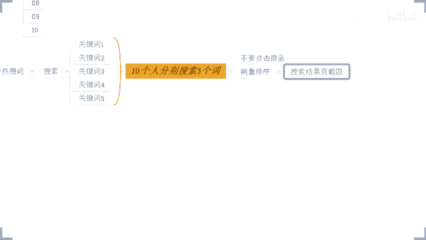

哎，丝袜啊这个东西我比较喜欢啊，丝袜啊呃，玩具就算了啊，对玩具不感兴趣啊。这个我只能说这个谢文庆啊，抱歉了啊啊，这个目前来说啊，公屏上对我感兴趣的产品呢也就只有10万了啊，1万啊。

丝袜啊OK好。来啊，兄弟们注意看了啊注意看了啊。现在一开始最早的时候，我们先去搜索关键词丝袜，对不对啊，这个是我自己的这个产品啊，这是我自己产品。那么下拉框里面呢就会有到一些热收持，看到没有？

下拉框里面啊就会有到一些热搜词啊，那么这些热搜词里面呢，是符合我产品的，也是我标题在使用的，对吧？也是我标题在使用的啊，然后我现在就可以去搜索。比如说哎丝袜半截到大腿。啊，这是我在使用的。

也是符合我产品的啊。OK我现在去搜索这个词啊啊，我我们我们什么鬼一看就不正经，这是纯正经的啊，好吧，纯正经的。哎来，我去搜索丝袜这个词啊，来OK。😡。

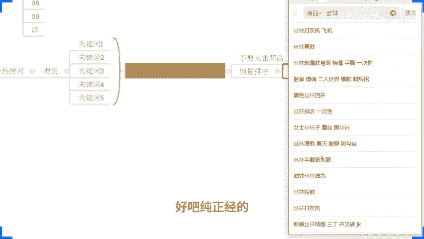

好，哎，完蛋啊，这个居然验证失败啊，搞什么飞机啊？输入图呃，请输入图中的验证码，这玩意儿输不进去啊。哎，可可以输啊。上次我就是点不进去，点半天点不点不了啊。哎，怎么字母打不上去呢？哦哦，我知道了。

上次应该也是这样子啊。我输入法没切换啊，太尴尬了啊。OK。😊。

来啊来啊。呃，来。

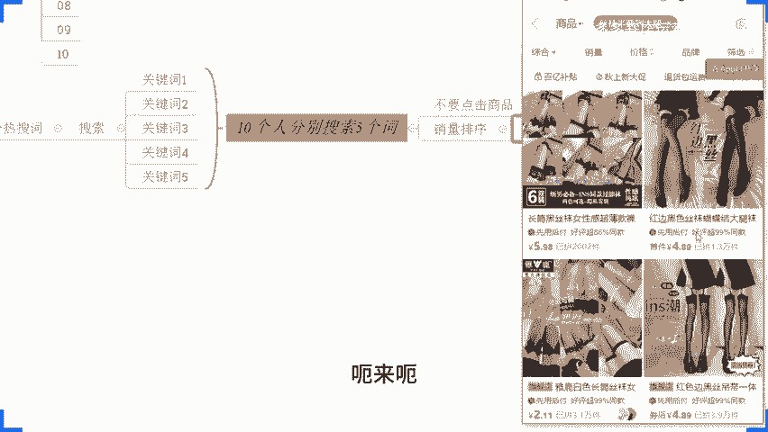

呃，这个是我们刚刚搜的啊，这是我们刚刚说的啊，丝袜半截到大腿啊，我的搜索没有这个词啊，这个东西大家不用在意那些细节啊，这个东西大家看看就行了啊，懂方法就可以了啊，好不好？我们关键是方法掌握好啊来。

我们搜索完了这个丝袜对吧？说索完了这个丝袜啊，那么这个。😊。

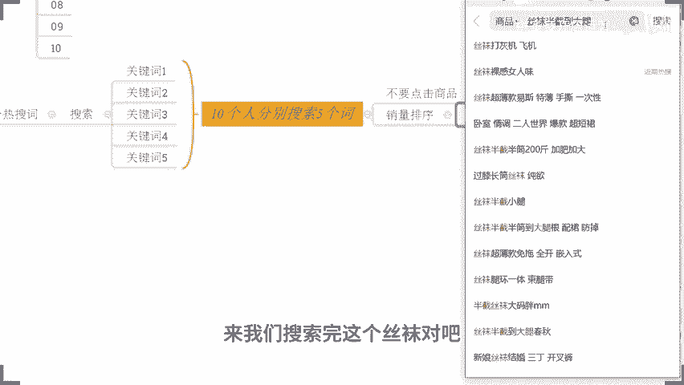

丝袜收索完之后，对不对？丝袜半截到大腿，对吧？完了之后呢，我们看这个相量排序啊，来各位。😊。

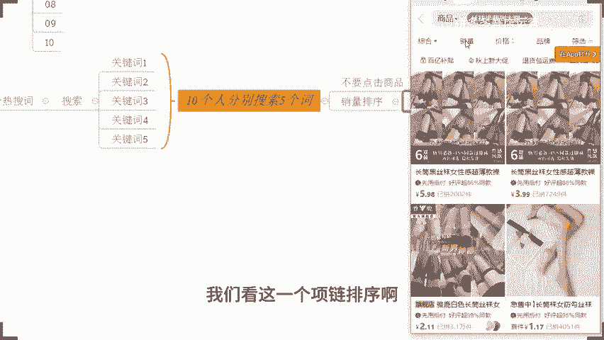

没问题，公民打6啊，到目前为止没问题，公民打6啊好吧，到目前为止，没问题，公民打6啊，这个是我们首先说的第一个词啊，我们把它记录一下啊，把它给放到这边来。😊。

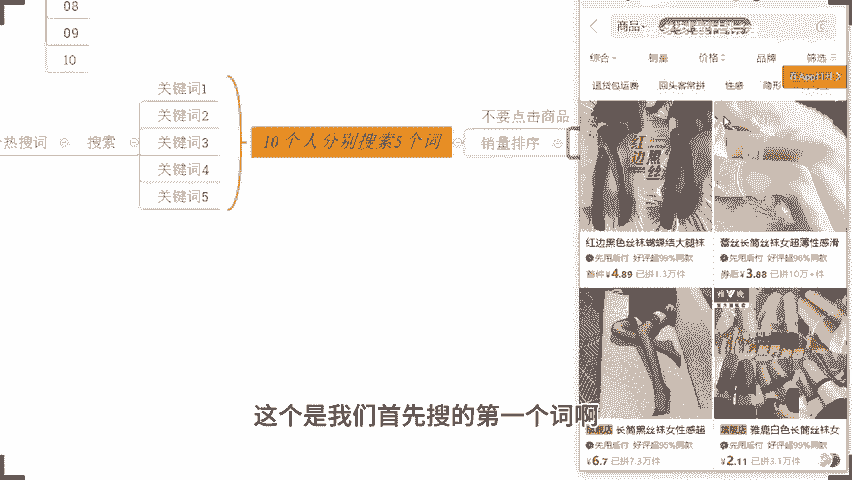

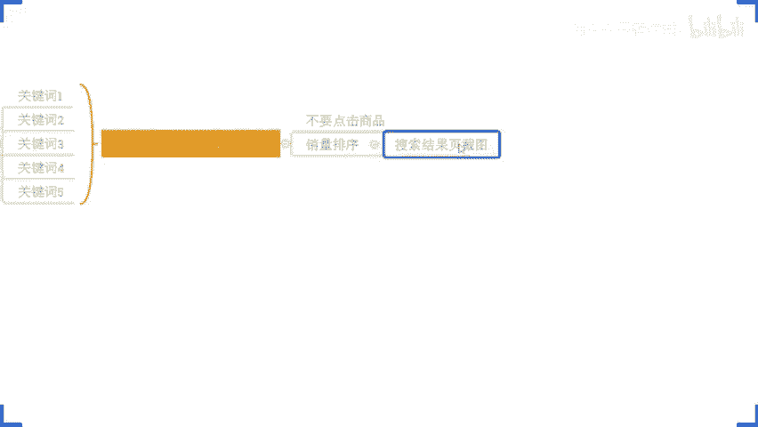

O。😊，看到没有？这是我们刚看到的啊，那接着下一步呢，OK我们还会去搜索别的关键词，对不对？什么什么别的关键词呢，来我们继续看丝袜啊，丝袜啊，我们来看一看这个呃吊带丝袜吧，好不好？吊带丝袜好不？

来啊吊带丝袜啊，我们一样的销量排序啊，销量排序啊，哎我们来看一看啊，就在这里看一看啊，当然前提条件啊，是这个词和我们产品是高度符合是一样的啊。好不好？那么这个时候我们搜完之后呢，哎我们可以往下翻一翻。

看一看，把整个的界面的都去浏览一下啊，看一看它都是什么产品啊，那在这些产品里面呢，在这些搜索结果页里面呢，我们最好的方式是什么呢？通过10个人搜索5个关键词的时候呢，都能够去看到相同的产品。😊。

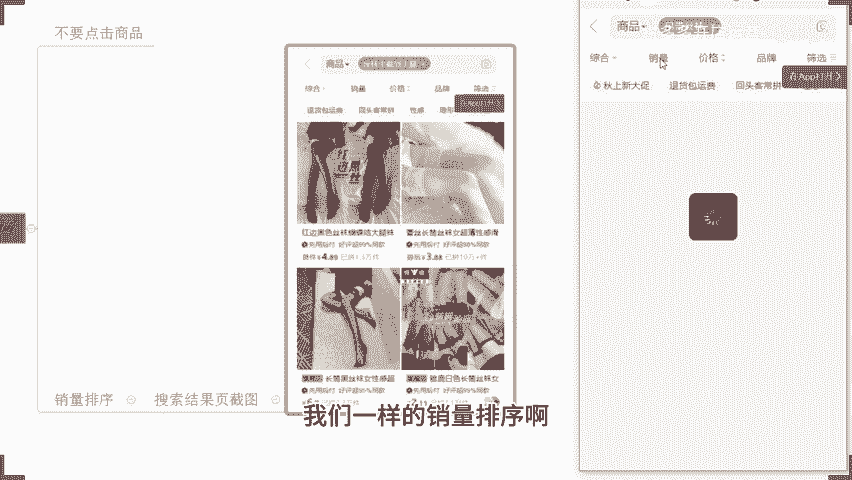

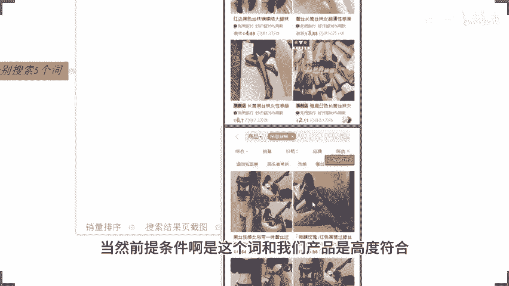

啊，把这些相同的产品呢，我们把它给找出来啊，通过这些词找出5个啊，找出5个啊。产品它能够在不同的词啊，不同的人搜索的时候都能够展示出来。好吧，找出5个产品啊，不同的词，不同的人是数都能展示出来啊。

当然因为我刚刚这里呢这个关键词它相差可能比较大一点啊呃，可能有点区别。所以呢我们试了之后呢，发现它可能有点有点啊差别比较多啊，我们可以再往后看一看啊，找一找别的词吧，好吧。

刚后我们第一个词是不是什么来着？呃，半截到大腿，对不对？那我们再看看别的啊，再看别的啊。😡。

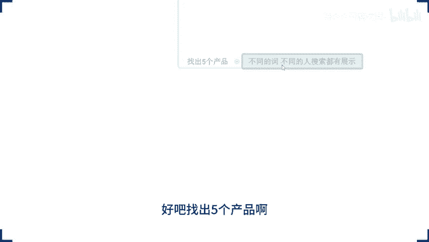

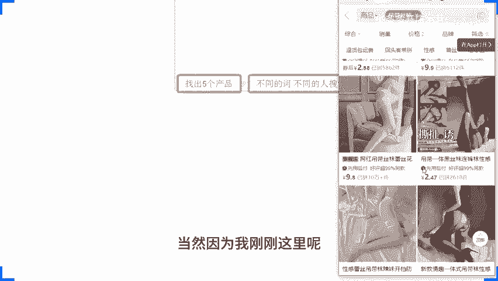

呃，这个这个这个。呃，好像也没什么特别的啊，好吧，好像也没什么特别的。嗯，女士丝袜吧啊，就女士丝袜吧啊，我们找点正经的关键词啊，来看一看啊，好吧。

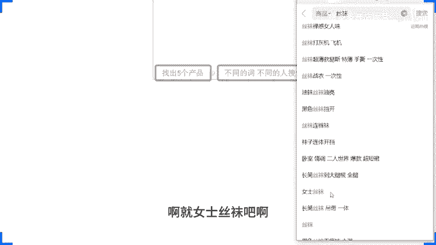

哎，这话我不能这样说啊，免得等一会儿你们说哎，西楼，你之前说的这个词是不是不正经啊？来来啊，这里就有了啊，这里就有了来啊，兄弟们啊，有看到吗？啊，有看到吗？是这个意思啊，看到没有？这里啊。

我我把它放这里了啊，我把它放这里来。😊。

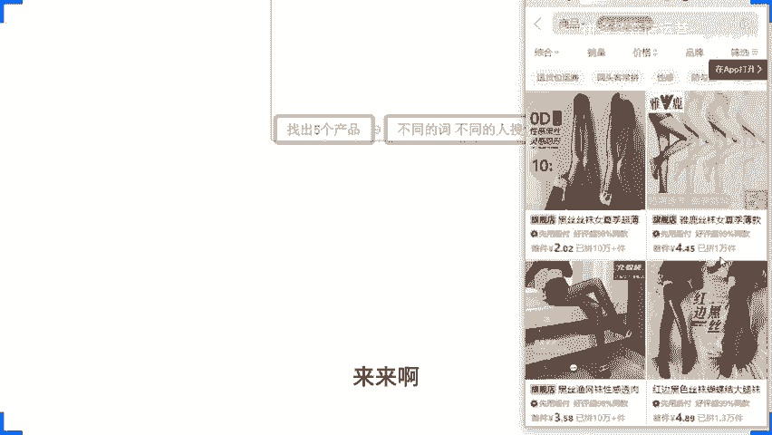

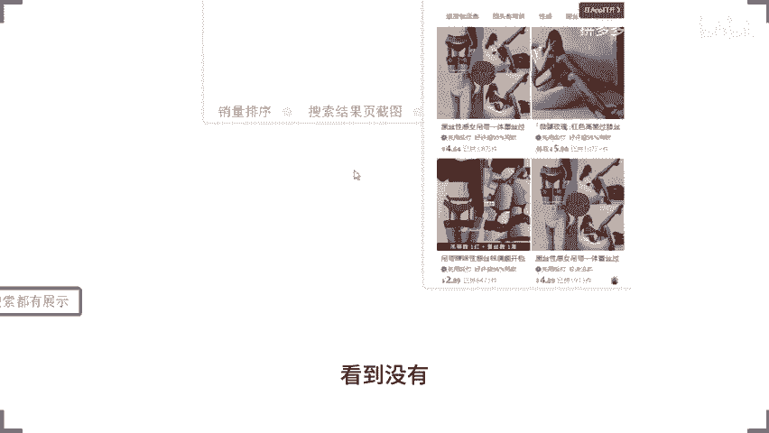

来，这里啊红边黑丝有看到吗？红边黑丝看到没有？😡，各位能看到的话，公屏上打个6啊，动么快，所有人动起来啊，所有人动起来。😡，啊，这个地方你要是没没搞懂，没明白，后面你可能可能去做的啊，我先说一下。😡。

OK的啊OK的啊，能记住能看懂就行啊。这里呢这是两个不同的关键词，对不对？呃，丝袜半截到大腿跟女士丝袜像这一个产品呢，他就能够都看到，对吧？都能搜得出来啊，都能搜得出来啊，就是这个意思。

尽量的5个词不同的人搜索的时候呢，就可以看到相同的产品在这个地方展示的啊。我们把这种产品呢。😊，是谁啊给他记一下啊，记一下。然后后续我们会用到它的啊，这是我们这一步做标签前的准备工作啊。

做标签准备工作啊，这一步记录下来啊。那么这里呢我们把它理解为是呃，产品一啊，然后呢一直到陈品5啊，产品2。产品3。产品是。产品5OK各位。没毛病，公屏上打个一，下一步开始操作啊，这个是准备工作啊。

准备工作标签第一步准备完。接着第二步第二步啊，接着第二步，第二步干嘛呢？第二步，我们让这些人啊，让这10个人啊，让这10个人分别每个人去搜索啊一个关键词。第二步。😡，分别搜索一个关键词。

比如说我们的这个用户一啊，比如说我们的用户一啊，好吧，比如说我们用户一，他去搜索了关键词一，对吧？然后呢，用户二也搜索关键词一，以此类推，然后呢是关键词2。啊，关键词3。关键词是。

关键词5啊以此类推哈这样子。好，搜索完之后呢，分别呢去浏览不同的产品啊。第一个人搜索关键词一呢，去浏览产品一好不好？第二个人浏览产品2，第三个人产品2第。😡，3第四个人产品啊三啊，以此类推好不好？来。

各位没问题的话，现在公屏上打个一啊，这个啊这个排序方式没问题，公屏打个一。啊，这个排序方式如果说没问题，公屏打个一啊，动动快。OK啊，那么这个过程是干嘛呢？

这个过程是为了让我们这些人从一开始的搜索标签产生我们产品标签。那么让他们形成点击之后呢，这些人这些词也都会发生关联，形成后续的一个产品权重啊，我们给我们商品打标的一个权重啊，是这样子的。好。

这是我们准备工作。那么准备工作搞定之后，接着到我们正式操作了啊，接着到我们正式操作。😡，啊，接着到我们正式操作啊，正式操作第一天。😡，啊，正式操作第一天啊，注意了啊，那么这个时候呢，我们第一步。啊。

我们第一步干嘛呢？让这10个人分别去搜索对应的关键词。啊，让这10个人分别搜索对应的关键词，然后通过这些关键词呢，对我们的商品进行浏览。啊。各位这一步我知道有人可能会说，哎，小。

因为我这个产品呢是刚上架的新品嘛，那可能会有一个问题啊，它没有被收录啊，对吧？注意啊，准备时间这一天呢，就是我们产品上架这一天，这一刻第一天呢是我们啊比如说我头一天上架的这个第一天是我们今天第二天啊。

那么这个时候呢，我们产品已经被收录了，这是第一点。第二点的话，如果说你直接搜索关键词找不到，可以组合冷门池啊，可以。组合的门词。如果组合能文字还是不行，你可以通过链接的方式去进行浏览。先打上标签之后。

打上一个浏览记录之后，打上足迹之后，再去通过搜索完成。但是最终一定要通过搜索端口完成这个动作。各位，能够明白公民打一。😡，那么这个动作是干嘛呢？

这个动作是为了让我们头一天做的商品的这个人群标签权重打在我们商品上啊，我们可以这样理解，我们的用户一开始搜索关键词的时候呢，平台会判定哎这些人对这个产品有需求，所以他会搜索，对不对？他是有需求的人。

然后通过对这些产品进行点击之后，会让平台觉得哎，我们这些人呢喜欢这些产品。那么这些产品是谁？这些产品是我的竞争对手。😡。

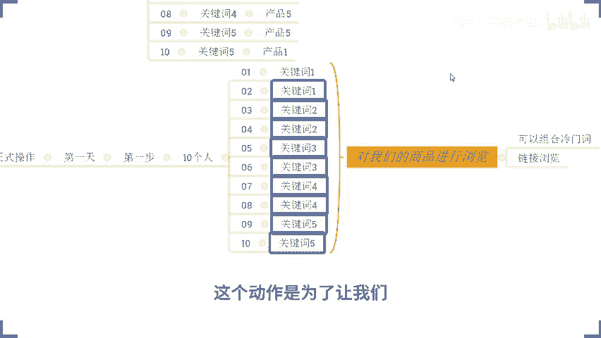

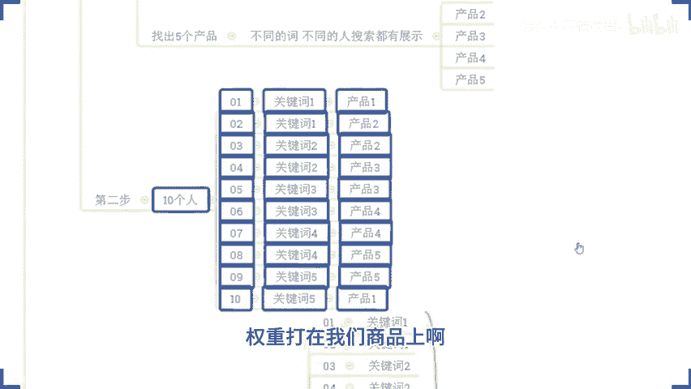

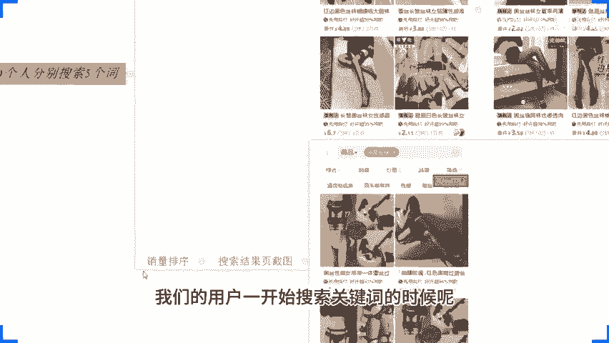

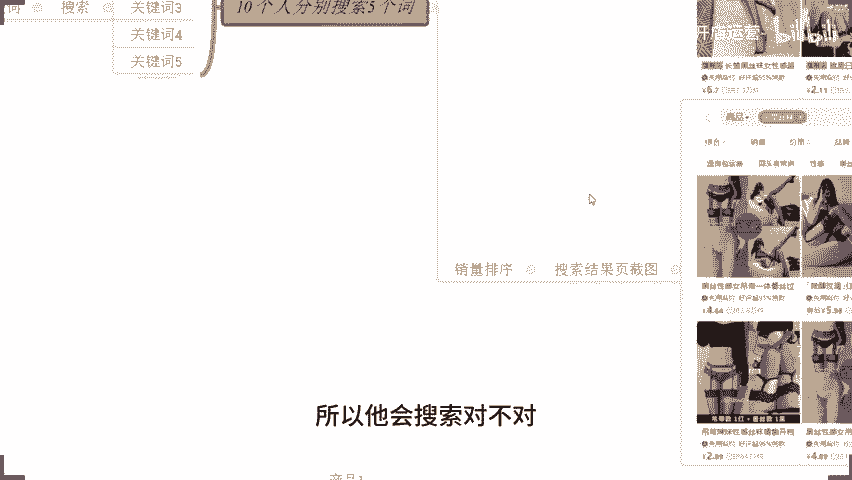

为什么是我的竞争对手？因为这些关键词是我产品高度符合的，而这些词呢是我自己这些关键词搜索出来的结果。😡，啊，真的需要7到58是吧肯定的啊肯定的啊，当然这个只是一个其中一个方法而已啊。

这个只是其中的一个方法而已啊。大家可以去参考一下啊啊，你要是真的，你说哎这个这种东西我没法做做不了嘛？做都做不到啊，没关系啊，还有很多方法的对吧？做电商嘛，方法不是只有一种对吧？

就像我们讲的条条大路通过嘛，对不对？😊，那么来啊啊继续说继续说啊，那么在这一步的时候完成它。好，这是第一步啊，这是第一步。那么搞定之后呢，我们进入到第二步。😡，啊，搞定之后，我们进做第二步。

第二步是干嘛呢？各位第二步的时候呢，听清楚啦啊，听清楚啦。那么同样的这些人啊，同样的这些人去进行我们竞争对手的浏览啊，同样的这些人进行我们竞争对手的浏览。注意啊，那么简单浏览就可以了。访客一下呃。

店铺访客一下子没有了，单量下降上不去。具体店铺你自己的问题呢，等到下播再问吧，好不好？现在注意力集中吧，认真听好不好？好不好？呃，这个时候我不可能单独来给你解答一一个人的问题，好不好？理解一下啊。

理解一下啊。那么这个时候呢听清楚了。第二步啊，第二步，完成我们店铺竞争对手的简单浏览。啊，先浏览我们店铺再去浏览同行，对吧？同行简单浏览就可以了。那么在浏览同行的时候呢，其中安排两个人。😡。

下单不付款啊，这第一天的时候安排两个人啊，这个人数不同的时间节点是不一样的啊。第一天这里呢我们是两个。啊，两个啊两个啊，那比如说一和3啊，比如说一和3啊，比如说一和3啊。啊，比如说一二3通过下单不付款。

或者下单之后再付完款，再退货的方式去做。那么让我们这一个人呢打上一个交易需求的一个标签啊，打上它打上他之后呢，OK听清楚了，接着来进行第三步。第三步呢。

OK还是这些人啊还是这些人还是浏览我们自己的商品啊，还是通过对应的关键词去浏览。但是记住了每个呃呃这一个小时啊，一组人啊，一个基数组一个基数。啊，一个偶数组啊，每个小时一组人啊完成他啊，好吧。

讲的很细啊，卡的视频就见识到了，是吧？OK那么来各位。😊，有没有问题？到这一步有没有问题？那这个有没有问题？那么每个小时一次形成一个高频率的。啊，反复的。搜索浏览。啊。来，各位到这一步有没有问题？😡。

那么这一步干嘛的呢？还记得吗？一开始我们说过一个事情，产品呢会进行我们的一个搜索板块的一个权重考核，对不对？产品的搜索热度，产品的曝光量对吧？那么反复搜索它的搜索热度会很高，它的曝光量也会很大。

搜索热度。这个时候呢，热度很高的时候呢，平台也会判定说用户对我们这类产品呢有很好的需求。于是乎又可以再一次给我产品进行加权。啊，又可以加权，好不好？那么同时在晚上的时候或者下午的时候。

总之你反复操作完这个动作之后是吧，最起码连着操作三次之后啊，三次啊三次。然后呢，你再去做一个动作，就是之前在同行下单跑掉的这些人回来我店铺进行下单。那么这个时候下单干嘛呢？这个时候下单呢。

就会让平台认为我的产品比这些产品更优秀，或者用户更加喜欢我的产品。而且我的产品本身是新品。😡。

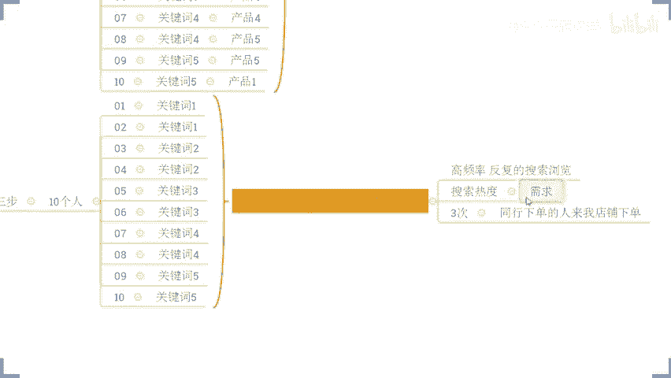

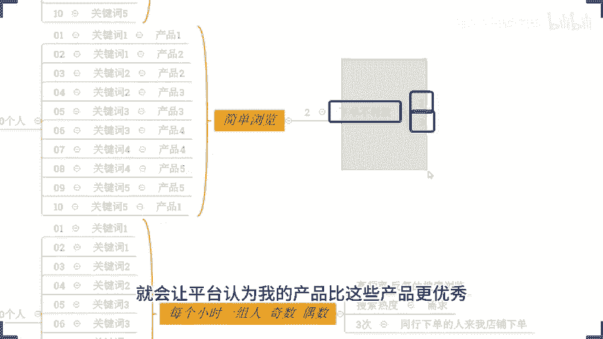

啊，那么当我有到一个比较好的搜索，比较好的点击，又会有到一个好的成交的板块的情况之下，各位注意了。😡，注意了啊，那我的商品的推荐曝光就会很高，产品的后续的产品访客就会更多。各位记住了啊。

那么像我之前说的那个8号开店的那个哥们啊，他当时都没有去做自己店铺成交啊，他没有去做哦。

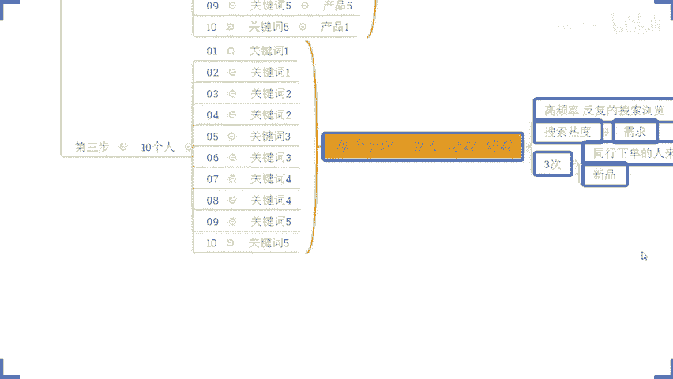

他都没做这个事情，他只是做了售入热度，但是因为他产品。😡。

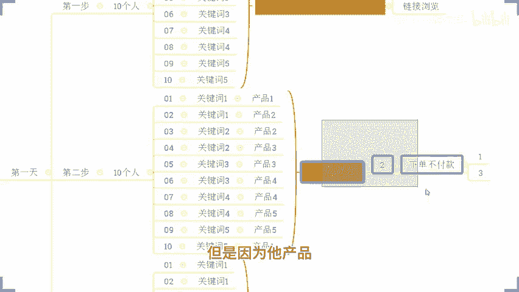