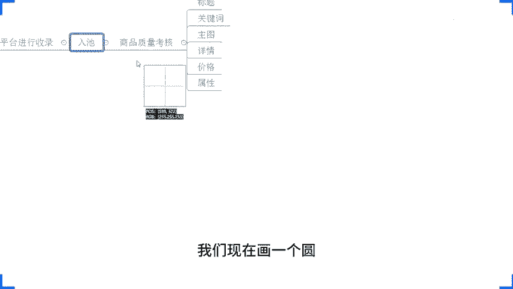
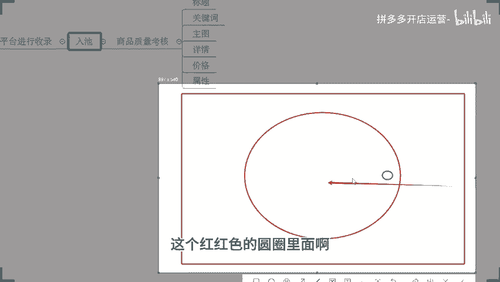
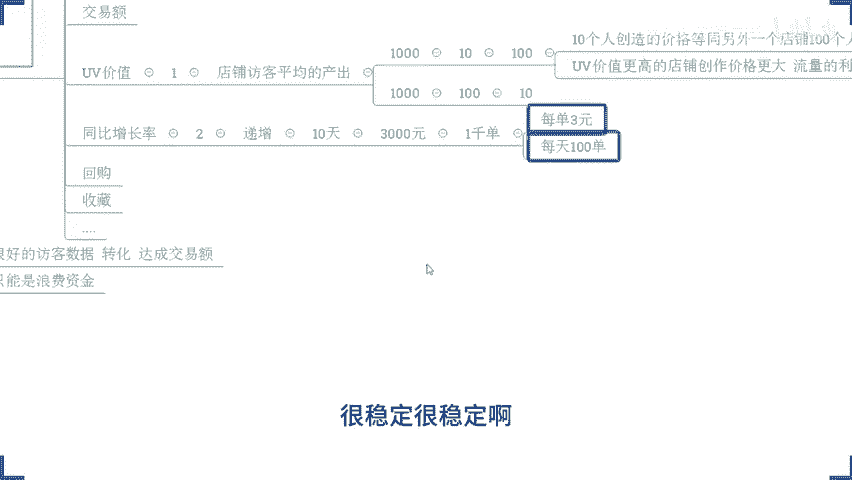
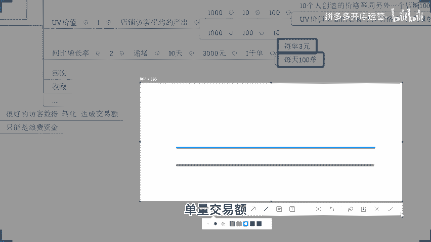
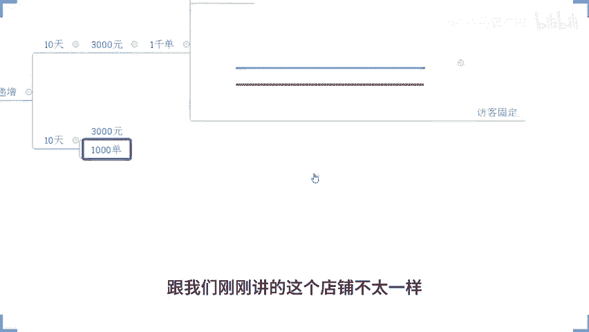
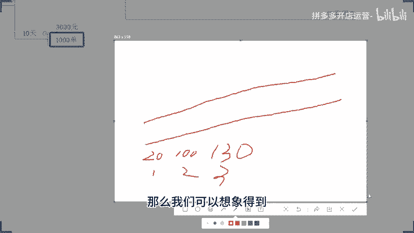
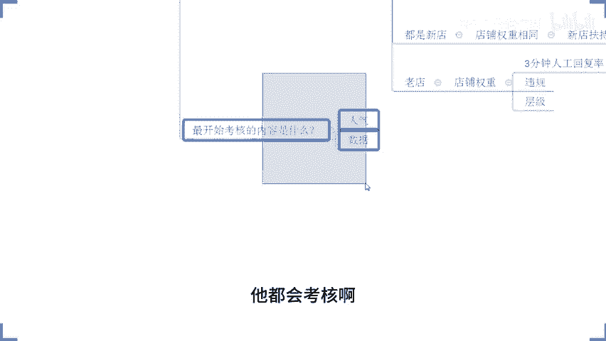

# 拼多多开店运营-新手电商运营实战指南，B站最全拼多多零基础入门教程！拼多多运营秘籍，小白也能成电商大亨！轻松上手拼多多，拼多多新手开店赚钱攻略 - P52：052 深度解析排名算法 拼多多如何起爆新品自然流 - 拼多多开店运营- - BV1xms8eSEVs

那么今天我分享内容呢，如果说是你现在店铺确确实实是符合需要去做的，是你没有做到位的，那么记得一定要去实操。但是操作之前请请先去确定好，确实是你店铺现在当下这个阶段适合的啊。

那如果说不是OK你也不要盲目去做。因为你们盲目做店的话，只会什么造成浪费啊，所以最后一个要求不要盲目。操作。好吧，避免。造成。浪费。OK啊三个点我已经讲完了啊，这三个要求已经讲完了啊。

那么正式分享呢在我们两点钟还有这个几十秒时间啊。那所有的小伙伴最后呢我再确认一次，现在在直播间的小伙伴们啊，能够清楚的听到我声音的，能够清楚的看到我这边电脑桌面的声音跟画面都没问题的话。

公屏上扣一个6好吧，来动一快啊，确认一下啊，所有人没问题的，动起来O的啊，非常不错啊非常不错啊。那么一会儿啊我们在直播过程中的话，大家也要保持这样的一个热情跟这样的一个互动性啊，有任何问题。

有任何这个需要大家确认的时候呢，一定积极回复我啊，避免说我们到时候呢在直播过程中出现这个脱节或者是出现这个思想这个开小差的一些现象啊，导致后面你可能会有很多东西听漏掉，听错掉，对吧？导致没法去做好吧？

好了啊，那么今天分享内容呢叫什么呢？叫做深度解析排名算法。😊，说如何起报新品战略？那么之所以会有这样的一个风险呢，是因为最近呢有很多人啊。跟我讲哎，这个戏楼我店铺呢开了啊，我店铺开了，对吧？

我店铺开了啊，那么开完之后呢，呃我现在我不知道做什么产品，对吧？啊，甚至有的小伙伴说哎，记得我店铺开了啊，我产品已经上架了啊，产品上架了。下一步不知道做什么了。啊，不知道啊。各位我想先在乎我分享之前啊。

😊，跟他确认一下啊，你们今天在直播间的小伙伴们有没有是这种情况的？😡，来确认一下，有没有有的话扣个一啊，有的话扣个一。😡，有的话扣个1啊。OK啊。😊，呃，这个。蒋琴是吧，蒋琴是这样子的，然后呢。

这个西安世纪香料是这样子的啊，成程啊说有应该也是这样子的啊，还真有啊还真有各位。这个地方呢我说一下啊，如果说你是这种情况的。我先要给你泼一盆冷水了啊我先要给你泼一盆冷水了。如果说你真的是这样的。

那么你没有去有到一个完整的运营规划的话，你做店铺。大概率啊是会亏的。甚至可以这样说，店铺的运营呢可能。在某种意义上来讲，可能不太适合你。啊，这是一个非常非常现实的问题。因为这样去做店铺啊。

你如果说前期没有做到一个好的规划，你连产品是什么都不知道，你连上家都要该干什么都不知道的话，那么这个过程你肯定会浪费你店铺前期操作的这样一个平台扶持时间。

那么并且呢你在整个做店过程中肯定会造成大量的浪费。因为你每做一步都是在什么呢？摸着石头过河，你脑袋里面是没有一个完整的操作思路的。😡，那么这样的话，整个店铺运营呢，你的投入的时间，你的花费的资金等等。

都会比你的竞争对手要多的多的多。那这个情况之下，你的成本增加了，你的运营难度增加了。你跟团行竞争的时候，你又花费了非常大的精力。而这个精力是得不到一个正向反馈的。到最后呢，你只能干嘛呢？放弃。😡。

所以坐垫的时候呢，我们前期的时候先搞清楚你要做什么，你为什么要做这个，你怎么去做，这个很关键。好吧，那么这个也是我一直以来跟着我实操小伙伴的事这些小伙伴啊，我强调的一个事情啊。

我们做什么事情的时候应该做什么，为什么做这个怎么去做？我们要把它理顺思路搞清楚啊。然后小二讲，哎，我们先要去做访客，做流量啊，OK那么来。😡，对于我们店铺运来说，我们先要做什么？😡，做流量吗？做访客吗？

对啊，对也不对啊，对也不对啊。那为什么我说要对呢？因为我们店铺来讲啊，我们想要去把产品卖出去，我店铺一定要有访客，一定要有有流量，对吧？这个是一个非常现实的问题。你没有访客，没有流量。😡，啊，没有流量。

你的产品卖给谁啊？😡，是吧卖给谁啊，这个问题就很现实啊。那么在我们去做流量，在我们去做访客之前。😡，首先我们要清楚的是，平台的流量是从哪里来的，他为什么要给我们？能懂吗？所以我们要做的时候。

先就得把我们的算法搞清楚，先把平台的推荐的机制搞清楚。各位。能够明白这个逻辑的话，公屏上扣个一。啊，能够明白这个逻辑了，公民扣个一啊。那现在问题来了呀。😡，现在问题来了，对吧？

既人说我想要搞清楚他的算法，我想要明白他的推荐的逻辑。😡，啊，我想搞清楚算法，我想搞清楚这个逻辑。那么到底什么样的这个这个推荐算法，什么样的一个推荐的一个逻辑？这个我们清清楚吗？我们不清楚，对不对？

那如果这个东西我们不清楚我们怎么去做访客，我们怎么去做流量，我们怎么去卖货。是不是OK啊，又到了这个戏楼提问时间啊，对吧？可能有小伙伴是第一次来直播间的，在我确认一下啊，我确认一下有没有小伙伴。😊。

有没有小伙伴？是第一次来西露乐直播间，有没有有的话打一个第一字可以吗？😡，你如要打一个第一字可以吗？来动么快啊，OK成乘是第一次啊。OK123是第一次点是第一次，先是第一次，保儿第一次啊。OK啊。

还不少啊还不少啊。😊，OK那呃这里我说一下，我在做直播分享的时候呢，不是给大家去讲课件讲课程啊，这个也不是什么讲课啊，包括你们在平时看到我分享的这个视频啊，也不是课程，这个只是分享而已。

那么在直播分享的时候呢，我是有一个习惯的啊，这里我先给他打个预防针啊，我喜欢提问。😊，我喜欢提问啊，那么之所以我喜欢提问。不是为了去为难大家啊，这里我先给大家讲清楚啊，我没有那个恶恶趣味啊。

要为难大家的意思。没有的啊，那么之所以我会选择提问的方式来进行跟大家交流沟通呢，是因为你们的思维很多时候呢是比较跳头活跃的。啊，很跳脱啊，很活跃。可能有的时候我们在讲某一个点的时候。

你可能就想着很多很多天花乱坠的东西去了，对吧？那么这个时候呢。😊，注意力就很难集中。但是当我进行提问的时候，如果你真正意义上有在跟着我的问题去思考的话啊，那么你可以更好的理解啊我分享的内容。

并且你可以建立。啊，一个呃。比较健康的这个运营思维。好吧啊，怎么提问啊？OK啊，不着急不着急啊，我马上就会问到大家这这个问题的啊。来啊，那么你们可以有这个心理准备就可以了啊。OK那现在开始提问时间啊。

第一个问题是什么呢？好。😊，来。拼多多平台商品排名的这个算法，它会考核我们产品的这些各种各样的东西，对吧？它会进行排名嘛。那么这个排名过程中考核的内容有哪些？啊，这个问题大家先思考一下。

如果说你自己是有答案的啊，可以把答案发在公屏上。如果说确实有在认真思考，但是想不明白，想不清楚。或者说哎我现在就是一个纯新手，我对这个问题就没有概念的。你可以把公屏上打一个问号啊。

让我清楚知道你们的状态就可以了。好不好？那如果说是有这个答案呢，那就把答案发出来啊，OK这边这个蒋金说，哎，是有这个价格啊，然后陈晨成说是商品权重啊。然后这一个先说。点击。转化价格规格啊。

然后一一说新手没概念。然后这个赞斗说哎，有我们的。这个标题啊有图片，有SKU有点击率，有转化率啊，有收藏量。店铺数据啊店铺数据呢就包括了我们的评级，对吧？啊，平分。领航员。嗯。相对来说啊比较完善啊。

很多啊很多。那么其他小伙伴呢来。😡，其他小伙伴呢有没有要补充的啊，有没有要补充的？😡，有没有要补充的？如果有要补充的啊，抓紧时间。如果说确实哎没有要补充的话，哎，你可以扣个一。然后还是那句话。

你是新手没有概念的小伙伴们，公屏打一个问号啊，目前给到我反馈的纯新手没有概念的呢，只有两个人啊，其他人呢应该是都懂得了。按照这个情况来说，或者自己心里面有答案的啊，可以把答案发出来。😡。

因为我分享的内容的话，是基于你们大家的基础来的。如果确实很多都是纯新手的话，没关系啊，我由浅入深给大家剖析一遍，这样子大家理解起来会更加透彻一点啊。那如果说大家是有基础的呢。

我可能就会把一些相对来说比较基础又浪费时间的部分呢跳过去了啊。OK先然说哎还有到这个销量啊，然后还有到123说有到这个店铺层级。😊，好，还有吗？OK啊，又有好几个小伙伴说是呃，这个新手对吧？是新手啊。

是新手不懂的啊，好吧。啊，大品牌啊，多喝闫枪说大品牌。啊，大品牌啊。好。OK啊，那我要点名了啊我要点名了啊呃努力努力再努力来。😊，你说一下你说一下啊，关于这个问题啊，你说一下呃，你的答案是什么？😡。

努力努力在努力在吧。😡，嗯，是不在吗？嗯。OK啊，换一个人啊，继续啊换一个人呃，事在人为来事在人为在不在？😡，自道人辉在不在？😡，在啊呃刚刚的这个问题答案呢，你可以说一下啊。这样子啊这样子。

一开始的时候呢，跟大家确认的时候啊，大家的这个扣数字呢还是扣的蛮蛮积极的啊啊，刚进来是吧？好啊，那我现在啊我再跟大家确认一下有多少人是在直播间的，来，现在扣一个一，好吧。有多少人在直播间的？😡。

刚刚提问的时候。如果说你是在直播间的，没有回复啊，没有关系啊，没关系啊，你也可以直接扣个一啊，表示你在直播间。但是我希望后面我们的沟通跟交流，大家可以积极的回复。好不好，因为你如果说不说话。

我是不知道你的状态的，还是那句话，对吧？你不跟我沟通，那么我们整个的分享其实在某种意义上来说是没有任何意义的。😡，我直播间里面不需要大家进来挂机捧场这种的，我希望的是能够相互交流，相互沟通给了大家。😡。

给大家一些帮助啊。能够理解吧，而不是说在直播间里面。😡，跟挂机一样，打游戏一样挂机挂经验一样的是吧，那个就没有什么意义了，好吧。😡，好了，不耽搁时间啊不耽搁时间。道理呢，我相信大家都懂。

那如果说你是不愿意沟通的，不愿意交流的，OK可以出去的啊。我直播间里面也不欢迎这种人好不好？下一次如果我再点到谁的名啊。现在我们直播间这些人啊，大致哪些人是在的，我有看到的啊，我是点到你的名。

你没有回复的话，那我就默认啊，你是不想听的，我就帮你请出去了啊。OK包括说刚刚啊没有回复的这些小伙伴，一会儿呃，你如果说是有没有听明白，没有听懂的地方，你跑过来跟我说，哎，你讲的那个东西啊。

我没有听明白，我没有听懂，你可不可以跟我再分享一次。抱歉。😊，你是谁？😡，凭什么是吧？😡，就这么简单，好吧，OK啊，那我刚刚问到这个问题呢，叫做排名过程中考核的内容有哪些，对吧？

那么大家呢也非常多的答案告诉我啊，给到我一些答案在这边的啊，给到我一些答案在这边的啊。😡，那么这些答案啊。对。😡，也不对啊，对，是为什么呢？因为确实这些基本上在我们店铺的排名考核过程中呢，都会参与考核。

那么不对呢，是因为这些考核的内容呢，它并不完整啊，只是一部分，好吧，只是一部分。那么。😡，是自己完全不懂的零基础教伙伴们。现在一定要注意听了啊，我先带大家把这整个的商品排名逻辑给他梳理一遍。

然后已经有在做店的啊，对于排名算法的逻辑呢，没有特别的去研究过的，或者是没有真正义上去吃透它的小伙伴们，现在也可以认真听一下。如果说你连算法都不知道。你连这个考核的逻辑都不清楚，你想把店铺做好，不可能。

我直接很负责任的告诉大家，我们做电商是做什么，做电商的人，作为运营来说，你玩的是数据，你们以为你运营的是商品no，你们运营的是数据，只有你的运营的数据达成平台的考核要求，满足系统的推荐的一个算法。

你才能有数据，你你才能有访客，你才能有订单。所以说你在运营过程中，你运营的不是你的店铺，不是你的产品，而是数据。各位记住了啊，跟头条抖音一样的。我跟你讲这个东西。呃，在这个算法上，在机制上面来讲啊。

他肯定都是以数据反馈为考核点的。知道吧？你不管你是做抖音也好，你做头条也好，做别的东西也好，你做的这些内容输出，那他的数据反馈不好的话，那么一样的，你也不可能拿到很多的播放，很多的推荐，对不对？

一个道理的产品也是一样的啊。那么来啊，各位注意了啊，我们首先来说一个事情，今天我作为一个商家啊，我作为一个商家好吧唉。😊，我作为一个商家，现在我开了一个拼多多店铺，我开了拼多多店铺之后呢。

我在拼多多的店铺里面上传了一个产品。啊，上传产品。那么现在假如说我上传的这个产品啊。行业里面卖的最好的人一天卖个两单。那行业。最好的销量啊，一天两单啊。那么另外比如说像我们的这一个战斗啊。

他也做了一个产品，对吧？它一天店铺里面上传的这个产品呢，行业里面卖的最好的这种产品呢，一天可以卖个一万单。啊，一天卖一万单。好，各位我想问一下啊，这两个商品来对比的话。他的商品权重谁会更高？

当然很多小伙伴可能说上面全都是什么意思没关系啊，不着急，一会儿我们讲这个分享过程中的话，一定会给大家去理顺的啊，一万的，对不对？OK那么这里呢我首先要告诉大家什么呢？我们产品不同。😡，你的市场体量不同。

平台给我们的商品权重也是不一样的。你们所说的。第二个对的，没有毛病，没有毛病啊，一定是这一万单的这种产品，权重更高。好吧，那么现在问题来了，如果说我去开一个店铺，我上传的产品呢，有好多个。

其中有一个产品呢，他一天能够卖一万单这种的，卖的好的啊。另外一个产品呢，卖的最好的一天卖两单。那么这两个产品在经营过程中能够去有机会做爆的概率一定是一万单这个产品，对不对？

因为卖两单这个上线在这里摆着的。你卖的最好一天不过卖两单，你能做的怎么样呢？😡，所以产品在某种意义上来讲，它也会影响到我们后续的市场体量跟我们的平台推荐啊，所以上传产品的时候呢。

一开始就要上传一些符合市场需要的啊，符合市场需求的具备市场体量的。热销商品。啊，这个是最起码的一个要求，对不对？那么这个时候回过头来，我们继续再看这个产品，我们去通过我们所谓的选品分析去找对吧？

去找找到之后。我去上架上架了之后，这个时候平台会针对到我们商品进行推荐，对吧？我们平台产品上架了，上架之后这个时候。我们要有访客，要有数据呀，对吧？

那么这个数据是首先会被我们的平台收录完成我们的产品之后进行推荐获取得到的。啊，这个先大家搞清楚啊，产品上架对吧？上架之后平台。进行收入啊，收入什么意思呢？就是说我们平台你可以理解为它就是一个鱼塘啊。

对吧？就是一个鱼塘啊，那这个词呢大家可能会听的比较多，叫入池，对吧？这个词大家听的比较多，叫入池啊，我们现在呢把平台理解为是一个鱼塘。所有的上传到平台的商品呢都会被平台收录进来，但是收入呢是有条件的啊。

有条件的。那么你达成收入的要求，那么你可以进入到这个鱼塘，用户在鱼塘里面捞鱼的时候，它就有机会看到你的产品，有机会捞到你的产品，看到呢就是我们产品得到曝光，捞到就是在我们店铺进行下单。

我们店铺就可以卖货了。各位这个逻辑现在能够理解的话，确定没问题，公屏上扣个一，好吧，动作快，所有人动起来。OK啊，那么在这样的情况之下啊，我们的商品上传之后，我们刚刚也提到过入职是有要求的对吧？

那么它有什么要求呢？好，一开始我们产品上架的时候呢，平台会进行我们商品啊，这一个质量的考核啊，一开始的时候会进行商品质量考核，怎么看有没有入职是吧？你就前期看你产品有没有这一个呃访客数据。

有没有曝光就好了啊，包括说我们在做这些呃平台的这个活动提报的时候，他是否能够拿到推荐曝光啊，都可以的，它是没有一个明确标准的啊，他没有说给到我们一个展示的方式说哎我们店铺入职了，我们商品入职了。

没有的啊，没有的好吧，那么这个入职是一个概念性的东西啊，这个入职是一个概念性的东西啊，啊，正常是多少，这这个没有标准，不同产品不一样。就像我说的，假如说你这个头部商家一天卖卖两单。

有的商品一天可以卖一万单。你说他们两个这个正常的自然曝光是一样的吗？不一样的，对吧？不同品类是不同的啊，OK那么现在先认真听啊，把这个逻辑搞透。当我们产品上架之后呢，进行商品质量的考核。😡，啊。

进行商品质量的考核啊，听清楚了啊。这个时候考核之后，我们产品符合平台的考核标准，满足系统的考核要求就可以完成入职。这个入职呢是可以被我们平台用户进行搜索，并且有用户会进行我们产品的推荐展示。

怎么考核考核什么东西？哎，这个问题还算是个正常问题啊，好吧，来考核的是商品质量，对吧？商品质量是什么？来，有多少人想知道的？😡，嗯，有多少人想知道的？我看一下，因为这个是一个很基础的问题啊。

这个是一个很基础的问题啊。😡，想知道的扣一啊，我看一下。就是这个你的成级啊，不不不不不不不啊，这个跟成级没关系啊，这个跟你成绩没关系啊。OK啊，行啊，呃，很多小伙伴对这个问题都是想知道对吧？啊。

这个东西呢，其实是一个非常基础的板块啊，但是这个东西确实也很重要啊，也理解大家想要了解这个东西啊，那我直接说啊，我不不敢卖关子啊，商品质量它不是说我们产品它用的材质是什么样的，用的什么工艺。

它能够用多少年，对吧？耐不耐摔，防不防这个呃防不防水，防不防火，不是这个啊，不是这个质量啊，不是这个质量啊，那么这个商品质量呢是我们产品的。😡，标题啊，产品的关键词，产品的主图，产品的详情，产品的价格。

产品的属性，好吧。这个是商品质量。啊，这个商品质量啊，还别说系统讲的怪好的嘞，我的天，我就当你在在夸我啊，刘雪啊。😊，来啊，各位。😊，各位啊，这里看一下啊，什么意思呢？来各位。😊，刚刚我不是讲吗？

我说我们的平台呢它可以理解为是一个鱼塘，对吧？可以理解为是一个鱼塘啊。来，今天啊我我们现在先来画一个圆啊，我们现在画一个圆。😊。

来这个圆呢就是一个鱼塘啊，这个圆就是个鱼塘啊。那现在我的商品如果说发布了，对吧？这个时候呢，可能它会有到呃一个非常非常大的一个平台收入我们商品啊，这个红色的框子啊，方框啊。

这个方框就是完成我们商品收入的啊，这个框子啊，这个收入的框子呢，它只是我们产品上架了啊，但是呢它不一定能拿到曝光。各位能懂吧？我们产品上架和产品拿到曝光是两个概念啊，我现在换一个颜色啊，绿色啊。

换一个绿色啊，这个是我们产品啊，我们产品现在上架了之后呢，你是可以在这个红色的框子里面内部的啊，它是已经在平台上有这个链接了，但是被收录到系统推荐的商品池是要进入这个红圈的那它怎么进入呢？一开始的时候。

我可能只是在这个这个呃。这个方框里面对不对？当我能够去有到很好的各项数据的时候，我就可以往中心移动啊，我的商品可以往中心移动啊。比如说我商品的标题是一个原创标题。

而且呢关键词都是一些符合我商品的优秀的关键词，能够具有到很好的产品抓取效果，并且产品的各项属性也是很优秀的，和我的标题高度匹配。好，那么这个时候呢这个产品会往中心移动，对吧？在进行平台考核的时候。

它会往中心移动。当我的价格也有很大的产品优势的时候，好，它会再次往中间移动。我的图片也很好，是原创的，能够去有到很好的辨识度能够具有到很好的点击率，对吧？是一个优秀图片，它会再往中间移动，对吧？

包括说我们后续的各种商品属性的一个发布啊，哎等等。它表现都很好的话，继续往中心移动。好，那么这个时候呢它进入到了我们这个产品。😊，的展示的曝光的范围内，这个红这红色的圆圈里面啊。

它就可以得到系统推荐曝光。各位。

这样的一个逻辑。大家能理解的话，现在公民打一考核部分呢就是我们的标题关键词、主图详情、价格啊属性等等啊。它是这么一个逻辑来的啊。那么这个过程中就像我们刚才讲到的，我的标题是能够去跟我产品高度符合的。

并且它是能够包含到更多符合产品的优质关键词，同时产品的图片考核过程中，详情考核过程中是能够被什么被平台判定我的图片是具备原创性，有到一个相对比较不错的产品的点击反馈这样的优秀的图片啊。

那么同时我的价格有优势，对吧？能够在属性方面体现出我产品的这个呃这个这个搜索的一个一个逻辑，并且它是满足市场的需求的。好，这个是候可以得到曝光啊。但是。问题来了。那么这个时候呢，我们如果说是新店。啊。

这里啊我们如果说是新店，对吧？今天我不是刚开始上架产品，我是刚开始开的一个店铺，对我是新店嘛啊，那有人是老店。😡，来，各位我想问一下啊，有人是新店，有人是老店，对？就像我们今天在直播间的小伙伴们。

你们有人也开的新店，有人可能是已经开了一段时间老店铺了。那么我想问一下，这个时候我们商品发布之后，它会进行一样的考核吗？😊，嗯。😊，他的考核是一样的吗？😡，不一样吧啊，小二说不一样吧。😡，不一样吗？

不会吗？有没有不同答案的？😡，觉得不会的啊觉得不会的啊，公屏上现在公屏上啊觉得不会的扣个一啊，所有人动起来啊，可能打字打不会这种自然比较比较麻烦一点啊，你们可能也是也会操作起来比较困难啊。

打数字吧应该比较简单的啊，然后觉得会的。😡，啊，觉得会的可以打个2啊，我看一下好，OK啊。😊，觉得一样的啊觉得觉得觉得这个不一样啊，觉得不一样，不会一样的啊，不是一样的啊。2。😊，OK okO啊。

行行行行好，好，这里我说一下啊这里我说一下啊，在产品考核的过程中，当前我们商品发布的时候，它确实会考核一样的东西啊。😊，各位在这个阶段，商品考核过程中，他确实会考核一样东西。但是虽然说考核一样东西。

在后续的时候会加入更多的东西进行考核。就像你们刚刚讲到的对吧？可能后续还会考核到我们的啊访客量啊，成交数据啊，包括这些各种各样的东西啊，确实是这样子的。那么在这个阶段可以看到啊，产品进行考核的时候。

他考核了我们商品质量对吧？进行推荐曝光。但是推荐曝光，它也会有多有少。如果说我们都是新店啊，这里啊都是新店。好，那么这个时候呢，它就只会考核商品权重。因为我们都是新店的情况之下，我们的店铺权重。

相同对吧？它就只会考核到商品权重。那么我们的商品谁更符合平台需求，谁的标题更优秀，谁的图片更优秀，谁的价格更有竞争力，谁的产品属性更加具备平台的用户需求，那么它的权重可能更高，可能拿到推荐曝款也会更多。

对吧？但是如果说我们有新店，有老店的情况之下。好，那么老店铺。在进行考核的过程中，你是会记入到我们的店铺群重考核的。那么店铺权众是什么呢？其实就是我们的店铺数据啊，那包括像我们的这个3分钟。

那3分钟人工回复率啊。包括像我们店铺的这一个什么投诉率呀呃物流服务异常率啊、品质退货率啊，什么纠纷率啊，对吧？还有违规啊等等啊，这些都属于店铺群众，包含你们刚刚有人说的一个东西层级。啊。

之前你们有人说层级这个问题嘛，对不对？来，各位现在啊所有人注意了啊，所有人注意了。虽然说我们店铺权重考核的时候会考核这些东西，但是如果说我们是新店，记住了。因为我们店铺现在是新开的，你还没有这些数据。

你没有3分钟人工回复率，你没有30天投诉率，你也没有物流服务异常率，你也没有什么纠纷退款率，你甚至也没有违规，对吧？这些所有的店铺权重考核的地方，你是不具备这些数据的。那么这个时候呢。

平台在你开店30天内默认你是合格的，这个也就是我们所谓的新店的。😡，扶持来是新店的小伙伴，先在公屏上打个6可以吗？如果说你是新店，公屏上现在可以打个6啊，多快。😡，好，OK啊不少啊不少。那么这个时候呢。

我要说一个事情，就是什么呢？你们如果说是新店的。😡，有人说我现在做店铺呢，我现在第一步阶段，我先去把我的层绩拉上去，对吧？之前你们有人说做层绩这个事情嘛，对不对？店铺层级记住了。😡，记住了啊。😡。

他最长最长是30天，但在30天内其实还会有各种各样细分的考核节点的啊。你如果不达标，那么这个考核也会收回去啊，好吧，陈思成，那么你们一开始说有人讲这个店铺层级的事情的，店铺层级越多，访客越多。😡。

有没有这个说法？有，但是这个说法他其实是不成立的。😡，他其实不成立的，之所以店铺层级越高，访客越多，是因为我们的店铺能够有到很好的。访客数据，并且形成转化，能够达成店铺交易额。

所以这个时候我们店铺它访客多是正常，是自然的。但是如果说你是通过做层级，做大单的方式去拉层级的话，OK这个时候做上去之后，你是没有这前面数据作为支撑的，你只是有了一个交易额，它是没有办法给到你访客的。

😡，所以这个动作不要去做，你做它的过程呢，只能是啊只能。是浪费我们的资金而言，没有异议啊，没有异议。好吧。那么在这个过程中注意了啊。😡，产品上架完成平台的商品质量考核进行推荐曝光，对吧？

进行推荐曝光之后，接着下一步会进行我们后续的产品这入考核啊，会进行后续的考核。那么这个时候。啊，我们商品拿到曝光，再往后就会进行我们的这个呃点击反馈。包括说我们的用户的呃转化，包括我们用户的这个产出。

对不对？等等这些数据进行考核啊。那么这些所有的考核内容呢，我这里直接写一下啊，我直接写一下。商品的这个点击啊啊商品的这个搜索商品的呃转化，对吧？商品的这个销量啊，商品的交易额啊，商品的UV价值。啊。

因为价值。啊，商品的这个呃同比增长率。啊，包括说我们店铺的一个回购啊。啊，回购啊，包括我们的收藏等等啊等等。这些数据都是我们商品后续考核的内容。各位，那么针对这些数据有没有哪些数据是你不清楚不懂的。

我先确认一下。啊，我先确认一下，针对的这些数据，你有没有是哪个不懂的？😡，因为价值不懂是吧，其他人呢？因惠价值有多少人想知道的？😡，UV价值有多少人想知道的？如果说想知道的话，现在公屏上打个一啊。

动得快。😡，OK啊OK啊，非常多人想知道啊非常多非常非常多人想知道啊。😊，还有同比增长率是吧？OK啊，那么这一个啊也想知道啊，扣一个2啊，来这一个想知道的话扣个2，我看一下啊啊，如果人比较多的话。

我就把这个两个数据给他讲一讲啊。😊，okO啊还不少还不少。行行行行啊，那么来啊，首先第一个啊UV价值啊，UV价值。😊，各位，现在啊UA价值的概念，我先给大家讲一下。UV价值呢代表的是我们店铺。访客啊。

秦军的。产出。什么意思呢？比如说现在呢我店铺一共卖了1000块钱啊，打个比方啊，我店铺一共产生了1000的交易额，1000块钱卖出去了啊。那么我店铺现在一共呢是有10个访客啊。

我店铺现在一共有10个访客，听清楚了没有？所以平均每个访客呢，就有100块的产出啊。😡，是吧，这是访客啊，这是访客啊，UV是访客的意思啊。那这里如果说我店铺卖了1000块钱，我店铺现在是有100个访客。

那相当于呢我平均每个访客呢产生的价值就只有10块钱。😡，啊，平均每个访客产生的价值就是只有10块钱。那，现在我们可以回头来看一看啊，同样都是卖了1000块钱，一个店铺10个人卖了1000块钱。😡。

一个店铺呢，100个人卖了1000块钱。那作为我们如果是平台的话啊，如果我们自己是平台的话，对不对？我肯定会认为这一个10个人。😡，创造的价值。等同另外。一个店铺100个。人创造的价值。是不是啊？

那么换句话说呢，这一个店铺为我们平台带来的利益更多，创造的价值也更大。这一个店铺呢，它每一个流量，每一个人创造的价值会相对更小，对吧？如果说今天我们产品不同，类目不同的话，那无所谓的。

可能就没有什么太大区别，对不对？但如果说我们产品都是差不多的，都是相同的产品你存在这样的一些差异的话，好，OK那么UV价值更高的这个店铺。对平台来说，创造啊。价值更大。啊，对流量的。利用率。也更高。

对吧所以说我会把流量更多的。推荐给这个店铺。啊，对，流量给的多啊，就这意思，各位来。由为价值，人民白，公民大意。啊，如果说不清楚的，没问题，打问号啊。😡，如果说还不清楚打问号啊。😡，好，OK啊。

都能明白啊，那我们继续往下啊，那我们继续往下啊，那对于我们店铺来讲，还有一个数据叫同比增长率，对吧？这个东西呢大家是说想知道想怎么了解的那。😊，在讲这个数据之前。我先问大家一个词，大家有没有听过叫递增。

嗯，地中这个词有没有听过啊，有听过的打一啊，有听过的打一，没听过的打2。😡，听过是吧啊，听过啊，那么第一张什么意思呢？😡，今天我店铺做一单，明天店铺做两单，后天店铺做三单，大后天做四单，对吧？啊。

往上一直一直往上去堆数据，数据越来越大越来越多啊，对吧？递增其实同比增长率就是最早递增他的操作逻辑。那我们现在来举个例子啊，还是老规矩给他家举例子啊，好吧，还是老规矩给大家举例子啊，好吧，来。😡。

今天我们有一个店铺啊，这个店铺呢，他。7天啊7天。啊，他7天啊或者30天吧啊，或者30天啊，好吧，30天吧啊，30天。😊，创造了。3000块钱的营业额。啊，然后呢，卖了1000单啊1000单。啊。

卖了1000单啊，每单3块钱啊，每单3块钱好不？各位没问题吧，每单3块钱啊，每单3块。😊，啊，我只是为了方便啊，所以说这样的一些数据啊，大家好好好去观察啊就可以了啊，每单3块钱啊，然后呢，平均每天呢。

😊，啊也不是平均嘛，他就是平他就是每天啊，他就是每天啊，好吧，这一0千单啊，这10千0单啊，他30天啊，他30天哎，等下等下，我这样子我十0天吧吧凑个整数吧啊，不然的话有些有小数点啊。

我就10天宝宝1天啊，好吧，10天。那这个店铺呢1000单啊，卖了3000块钱，他每天呢就卖100单。😡，啊，每天100单。非常平均，非常的稳定，好不好？各位来。😡，他平均每天就是100单啊。

很稳定很稳定啊。那么这个时候呢，他店铺的销售数据呢，大家可以看到了是吧？来，我给大家画一个图啊，我给他家画个图啊。😡。

这一个啊。这个啊这个是单量啊，这是单量，每天100单啊，这是每天100单。然后它的交易额呢也是很稳定的啊，交易额也是很稳定的啊，每天就3000块钱啊，每天就是每每天每天就这一个呃300块钱啊。

每天300块钱好吧，我换一个颜色啊，对吧？这是它的店铺数据啊，它的单量它的交易额啊，单量交易额。那么在它单量交易额都异常稳定的这种情况之下的话啊，不出意外。😊。

啊，不出意外的话啊，它的这个转化很稳定的情况之下，不出意外啊，它的访客也会相对比较固定。是不是他的访客也会相对比较固定啊。那另外有一个店铺啊，也是10天啊。😡，也是10天。

那他也创造了3000块的营业额。他也做了一0单。啊，他也做了10千单，但是另外的这个店铺呢，跟我们刚刚讲的这个店铺不太一样，对吧？来，他假如说啊可以看一下啊，第一天啊第一天。

他只做了。20单啊，打个比方啊，20单。第二天呢，哎，他做了100单。对吧啊，假如说第三天的时候呢，哎，他往上走了130单。啊，最终呢这个几天下来之后呢，他的数据这个样子的啊，往上走的。哎。

它的数据是往上走的啊，这个是它的单量啊，这个单量啊，那么它的交易额也是呈现出这样的一个趋势的啊。如果它的转化率是固定的情况之下，或者相对稳定的情况之下。

那么我们可以想象得到它的访客是不是也是处于一个上升趋势的。😊。

是不是？各位能能能能看懂吧，能看懂吧，对吧？好，那么现在啊我们我们做一个假设啊，我们现在做一个假设我们自己就是拼多多平台。😡，我们自己就是拼多多平台，那现在有两个店铺，这两个店铺呢。

一个它是数据非常稳定很固定的，相当于呢就是。😡，这个死呢死不了，上马上不去，对吧？一潭死水的呢那那个样子了啊。那另外一个店铺呢，它各项数据它是在不断增长的。那作为我是平台的话。

这两个店铺在我考核产品权重，考核店铺权重周期里面，他们两个是一样的情况之下。那么后续谁？😡，他在未来阶段，可能对于我来说啊，我会愿意给他更多的流量来进行测试，或者是给他更好的展示来进行一个呃推荐。

谁是第一个呢，还是第二个啊，大家可以把你们认为正确或者自己心目中的答案发出来，好吧。OK第二个对吧第二个为什么？第二个有成长，第二个它在递增，对吧？O确实这个样子的。那么第二个产品呢。

它的数据在不断的增长，在不断的提升。我认为它是有潜力的，它可能在未来会有到更大的发展，而且它的数据是还没有达到瓶颈跟上线的，而上面这个呢它已经达到瓶颈了，它就这样了，它没有机会了。

而下面这个它是有机会的，它还没有达到上线，我可以往上去给它推荐来看看它的天花板在哪里，对不对？😊，没毛病啊，那么这个就是。😡，同比增长率的一个体现。就是地增的一个体现。

但是这个同比增长率这个递增是我们自己店铺内部的，对不对？实际上同比增长率呢是要跟外部来对比的。什么意思呢？来，我来看一个店铺啊。😡，来，各位呃，这个店铺大家有看到的话，公屏上打个一好吧。

这个数据大家有看到，公屏打个一啊。😡，这个店铺呢是跟我实操的一个小伙伴啊，这个店铺是跟我实操的一个小伙伴啊呃，从零开始的一个新店，看到没有？从零开始一个新店啊。

那么这个店铺呢从最早开始上架到后期访客开始提升，对不对？到后面做到一个小爆发，一天访客从零做到了27000，一天卖了2100多单。7。82%的转化率啊，40多的客单价，对不对？那么这个店铺呢。

它也是参照了我们的同比增长在操作，也去严格意义上的把我们这里讲到的各项数据指标再进行一个把控啊，所以他后续才能达到一个很好增长。而这个店铺呢做的是自然流啊，做的是自然流好吧？那么这个数据怎么去把控的。

来，我说一下啊，那同比增长率，它不是说我想增长多少就增长多少，对不对？假如说今天我的同行。😊，啊，我的同行啊卖的很好的同行，他们很优秀，对吧？平台已经判定了他是一个优秀商家。😡，他今天有1单。

明天有20单，后天有40单。那么他每天的同比增长率是多少？百分之百。各位。😡，能明白吗？😡，能明白吗？能明白公民打一啊，能明白公民打一。如果不明白为什么是百分之百的，也可以说啊，这个没关系啊。

虽然说这个东西是一个比较基础的点，但是我也非常乐意给大家分享啊，无所谓的。那么今天。😡，不明白是吧啊，有多少人不明白百分之百怎么来的。😡，其实这个算法就很简单的啊，各位认真听一下啊，认真听一下啊。

是用我们今天的数据来公示啊公示。😡，今天数据啊减去前一天数据好吧，今天数据减去前减去前前一天数据啊，然后再除以前一天数据啊是这么来进行计算的，好吧，乘以百分之百啊，最后再乘以百分之百。换算成百分比嘛。

对不对啊？这里还有个括号啊，再打上去啊。是这样的啊。20从十0变上来20了，对不对？20变成了呃，这个十0变成20，增加了10，对吧？10除以10等于11乘以百分之百就是百分之百。它比头一天增加了一倍。

我们讲对吧？就是增加了百分之百。😡，好吧，如果说我头一天10个，第二天15个啊，后面一天啊这里就变成了这个20个啊。打个比方，那么他们之间的竞争呃这个增长频率的话，头一天50%。😡，第二天30%。

能懂吗？啊，不是30%33%，对吧？😡，各位能明白吗？😡，能明白吗？😡，增长率啊这增长率啊这增长率啊OK啊。😡，那我们回过头继续说啊，今天我的同行对吧？他是啊百分之百的正常率。

它是很优秀的平台呢也会针对到这种店铺给他进行加权。但是如果说我今天在我们的店铺的产出。😡，我们的销售额啊我们的销售额，我们的单量啊我们的单量。啊，包括我们的各项其他的这些数数据啊都一致的情况之下啊。

假如说我们的增长率不同啊，我是从十5变成了20变成了呃25，对吧？我啊，这是我的啊，这是我的啊，我的。😡，啊，这是我的啊，假如说我是这样变化的。虽然说我们的这个呃最终的这个交易额是一样的啊。

我们最终交易额是一样的啊啊，我们的这个呃UV价值杠税据指标都差不多啊。当然这个单量肯定不太一样了，对吧？单量肯定肯定肯定不一样了啊。那么这个时候我的增长率是没有我的同行好的，对不对？😡，各位能看懂吗？

这个时候我的增长率是没有同行优秀的对吧？没有它好的那如果我的其他的数据是跟他一样的情况之下，平台也会判定我跟他对比来说同行更优秀。好吧，同样更优秀好，各位。人民白院的话，公屏上打个一。😡，啊。

能明白的话，公屏打个一。好，OK啊，那既然说大家都清楚的话，那我们继续啊啊这个你看行业数据来进行一个反推就可以了。你具体的同样数据是看不到的啊，这个你是看不到的啊。我们可以根据行业数据来反推啊。

找出优秀的值就可以了啊。😊，好吧，来啊，那这些东西啊这些东西它的前提条件啊，哪怕同比生长率对不对？这些前提条件是我们其他数据考核跟同行对比相同或者没有优势，对吧？但是如果其他数据有优势的情况之下。

你是可以做的更好的，对不对？它会有到优先级啊，考核是有优先级的啊，来，现在我问大家一个问题，作为我们一个新店，我一上传了一个新商品。那么平台最开始。考核的内容是什么？😡，嗯。现在我产品上架了啊。

我进行了产品发布，对不对？我商品上架了啊，我商品上架了啊，那么这个时候平台除了我们商品啊，除了我们商品的质量之外，那么这个时候系统给我们进行收录完成推荐曝光。那么考核最重要的数据是什么？😡。

最开始考核的数据是什么？OK啊，警察说去虫绿啊，然后先说啊转化啊转化。呃，去虫绿这个说辞呢倒是挺新鲜的啊，但是这个呢其实我们可以理解为是新品考核，对吧？呃，可以有这方面的考核。

但转化方面的话是肯定没有的。那么转化费是肯定是没有的啊。那这个地方我直接说我给他卖关子啊。😡，听清楚了，兄弟们，如果说你连这个东西都不知道，你连这个东西都没有理解透彻，都没有搞懂的话。

那么这一趴对于店铺运来讲的话，你想做好很难。啊，刚卡出去没听见是吧，没关系啊没关系啊，刚刚讲的就是一个很简单的一个基础逻辑而已啊。好吧，一会儿哪里不知道啊，可以再问我都没关系。😡。

那么这个时候平台卡核的东西到底是什么？😡，嗯，填台考核东到底是什么？听清楚平台考核的是我们商品的人气。啊，平时考核我们上面人气，这是第一步初初始考核的东西啊，这是最开始考核的东西啊。

然后考核人气同时才会考核我们产品的数据啊，他都会考核，他都会考核啊，注意啊，他都会考核。😡。

