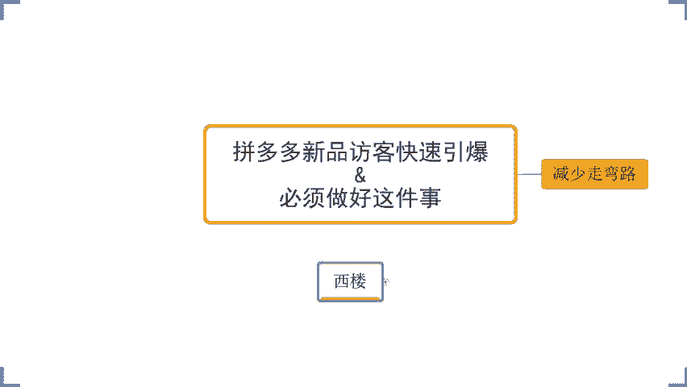
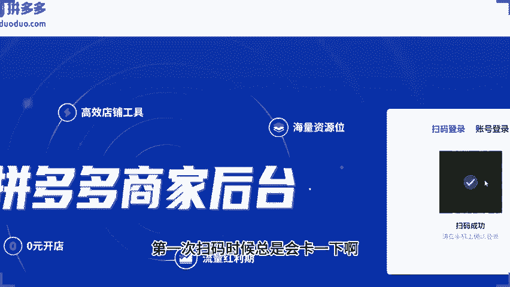
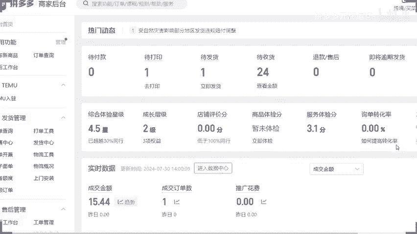
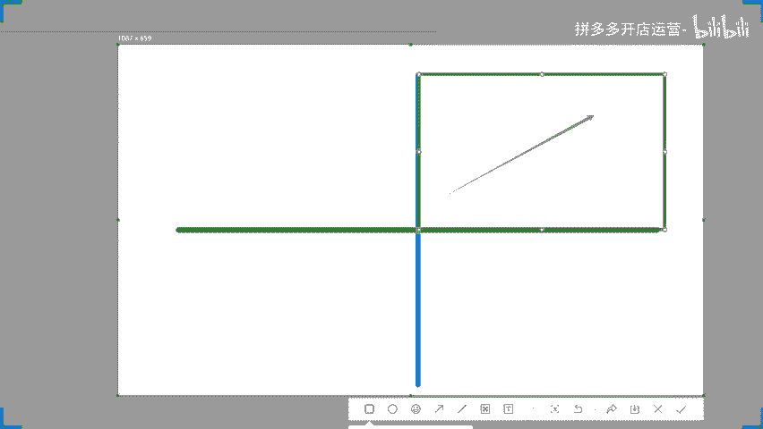
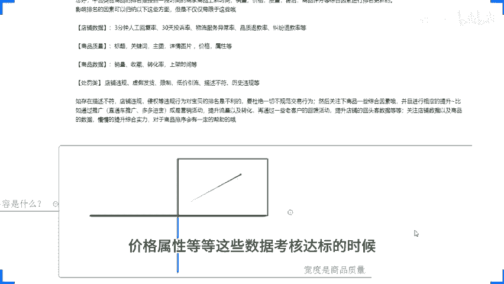
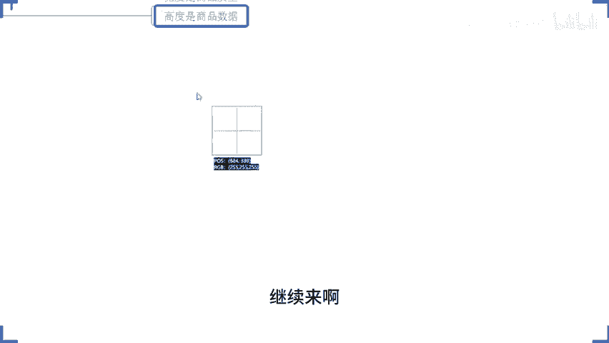
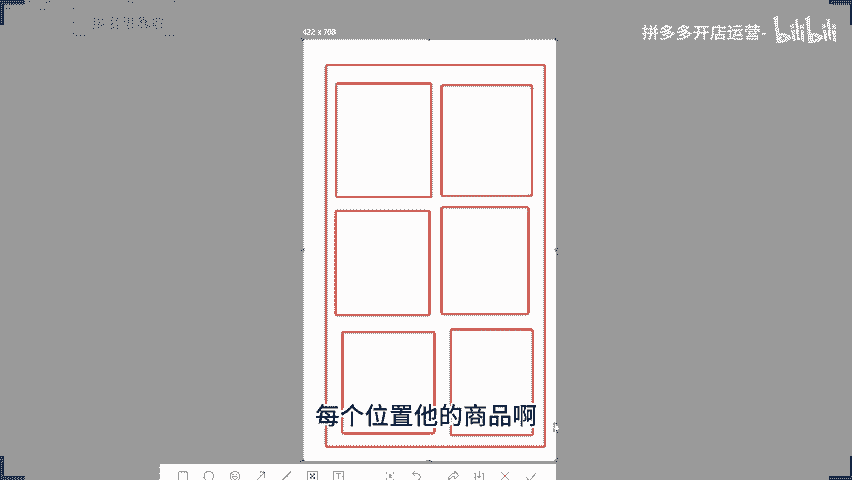
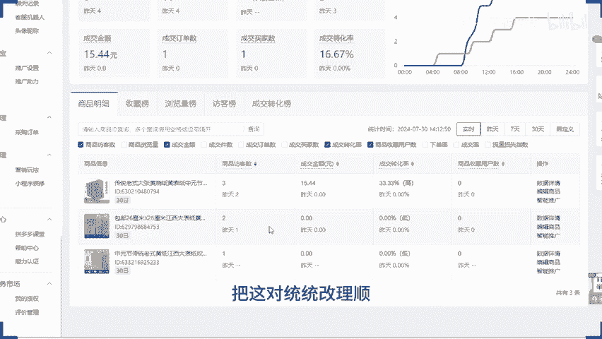

# 拼多多开店运营-新手电商运营实战指南，B站最全拼多多零基础入门教程！拼多多运营秘籍，小白也能成电商大亨！轻松上手拼多多，拼多多新手开店赚钱攻略 - P53：053 拼多多访客新品快速引爆 必须要做好这件事 - 拼多多开店运营- - BV1xms8eSEVs

当然了，如果说是有疑议的，有不清楚的，也可以直接讲。然后呢，小许是有问到说一个问题，哎，那我们这个店铺啊，商品体检要去优化吗？该做的优化优化到位就行了。那些。不是我们需要去优化的部分。

就不用管它没关系的。因为很多时候平台给到我们的这所谓的提示，它并不一定是对的。甚至有的时候给到我们那些通知，它只是通知而已。它是所有商家批量去发送的一个通知，好吧。

包括说我们这己产品在呃内部的这一个体检过程中的一些所谓的优化。它不一定是对的。啊，你没有发现就是很多时候你按照平台要求的东西去做了所谓的优化，所谓的调整，你访客仍然没有任何变化。

各位有没有遇到过有遇到过的话，公屏打一个6。好吧，你按照平台所说的A呃，这个价格调整了，标题调整了，属性调整了或者什么图片调整了，各种乱七八糟的，跟你说了一大堆，你去调整了，调整完调整去。

原本有访客的变成没访客了。对吧为什么？因为你每一次商品编辑会影响你产品的历史权重。如果说你前期一开始上架商品的时候，把这些所有的东西做到位了。OK他给你提示什么，不用管。😡，硬钢就完事儿了啊。

当然如果说你是被比价了，okK那我们一定要去做这一个防比价的这个操作啊，但是防比价的操作呢，也不是说我们上来直接去编辑商品，修改SKU不是的。你去修改SQU的话。

当前SKU的一个商品的历史数据也会被清洗掉，也会影响权重，好不好？而是干嘛呢？去通过新增的方式来调整我们的商品SQ的价格，从而减少对我们商品群众的影响，好不好？OK啊，那么今天分享内容呢。

大家有看到叫做新品访客快速引爆，必须做好这件事。必须做好哪件事呢？这里先容我卖个关子啊，那么这个是我们很多的新手小伙伴容易犯错误的地方。包括说今天在座的各位老板，各位小伙伴们，对吧？

有很多人在店铺运营过程中呢，容易走一些弯路，容易踩一些坑，浪费自己的操作时间，浪费自己的资金，好吧？那么今天这个方法呢可以让你什么减少走弯路。啊，让你能够去干嘛呢？更加有效的去操作我们的店铺。那么呃。

还是老规矩啊。以实操的角度来出发，我们来去分析店铺操作啊，来分享我们店铺的运营好不好？呃，时间还有3分钟，我先做一个调查啊，目前是已经开店的小伙伴，公屏上呢可以打一个一，好不好？还没有开店小伙伴呢。

公屏打一个2啊，我来看一看啊。OK啊，目前给到我反馈的呢，只有几个别的小伙伴是还没有开店的啊，只有几个别的小伙伴。那么各位没有开店的小伙伴呢也没有关系啊。那我这个人分享内容的话，一定是由浅入深的去分享。

给大家把底层逻辑给大家理顺讲透。😊，所以说不用担心说是听不懂之类的东西啊。那。已经开店的小伙伴。今天的话啊我们的分享呢就以店铺数据来进行，好不好？各位，你们如果说是有谁现在方便的话，方便扫码的话。

可以把手机掏出来准备好，好吧，一会儿呢，我们直接结合到店铺来进行讲解进行分享，那么可以在公屏上呢，准备好之后啊，可以在公屏上呢扣一个6，好吧，准备好了，公屏上可以扣一个6啊。然后呢。

我们扫完码差不多就到两点钟就可以正式开始了。好吧。OK啊，可以抓紧时间准备啊，我给你们点时间啊，顺便的我先喝口水哈，润润喉咙。😊，都差不多了吧。都差不多的话，那我就准备开始了，因为时间也差不多了，对吧？

还有一分钟时间到两点啊，开始分享啊，所以呢我们就不耽搁时间啊，那么先到先得啊，这个东西看手术啊，绝对没有这个呃偏心一说的啊，大家可以自己拼手术来啊。😊，等一下啊，我先把马放出来啊，我先把马放出来。

OK啊准备啊。😊，来，我刷新一下啊刷新一下。好，可以开始扫了啊，我放大一点啊，少少一点。😊，嗯，这个谁扫到了？我已经看到这个上面这个刷新按钮在转动了啊。我感觉每次都都很奇怪。

第一次扫码的时候总是会卡一下啊，不知道为什么。😡。

Okay。

这个店铺我看一下是叫什么名字先啊。

叫林明发是哪个小伙伴的呀？来确认一下啊，00发这个店铺是哪个小伙伴的？😡，啊，你的是吧，OKO ok okK好。😊，呃。这个有点有点小尴尬啊，这是一个纯新店啊，但是问题不大。

我知道啊可能大多数小伙伴呢目前的店铺情况都是这个样子的啊，想问一下，接下来有没有什么呃，这个需要操作的，对吧？有没有必要就着做还是重开啊，OK的。😊，讲真的啊讲真的啊呃，别的咱们先不说啊别的咱们先不说。

就这个这个店铺的服务体验分就这么低的评分的话啊，你除非是能够快速的去把这个评分拉上去，不然的话是没有意义的。当然了，因为你本人是个新店嘛，他偶尔有一个两个的这个服务评分比较低。

就会导致你这个这个这个评分低一点啊，所以这个点的话，其实问题不大啊，倒是呃，哎，我我记得不错，你是不是上次跟我说过，你这个店铺呃，是刚开始没有跟这个厂家沟通好发货问题导致的，是不是是不是你啊？😊，呃。

我有没有记错啊？啊，是你是吧OK啊啊上次的话只是简单截了一个图案，没注意看啊，没注意看啊。那一你目前这个情况的话，店铺本身没有什么太多数据，其实可以接着做，这个倒问题不大。这个评分也好拉的啊，倒是好吧。

这个评分也倒是好拉的啊。那因为这个服务评分低的话，我告诉大家一个问题，就是我们整个商品的平台推牛会受到影响啊，会受到影响啊。还有就是我们这个店铺评分啊，店铺评分啊，这一块也是啊店铺评分呢分为9个档次。

这个如果说你们有坐垫的话，应该知道的。如果说没有坐店小伙伴的话，那么这里可以认真听一下啊，这里有一个店铺评分啊，你们以后在坐垫的时候一定要注意这个东西。😊，那么这个东西呢给大家讲一下。

它是分为9个档位的啊，从三分开始啊，从三分开始。那么一直到我们五分啊一直到我们五分。如果说你的这个评分特别特别低，低到4分以下的话，平台的推荐是会被什么限制的啊，低于4点5分准确的讲啊。

低于4点5分店铺的这个推荐呢，就在某一种程度上受到影响了。因为低于4点5分你是不能上活动的。各位记住的话，公屏扣1好不好？那么还有一个东西呢，是我们需要重点留意的重中之重的一个问题。

就是你们在日常运营店铺的时候呢，可能现在还没有遇到这种情况，就是店铺一开始运营的时候呢，好好的没有任何毛病，没有任何问题，但是突然有一天哎断流了。各位有没有听说过或者有没有见过的。

甚至有没有接触过遇到过的，有没有有的话可以打一个2，好不好？😡，店铺我在日常运营过程中可能根本就没有什么毛病，对吧？我店铺没有什么任何问题。我我看了我店铺对吧？我我这个呃推广也是正常的，我这个店。😡。

店铺活动也正常的对吧？各种东西都正常的，但突然有一天我就是断流了，我的客单价也没问题，我的转化率也没问题，对吧？OK如果说你们有遇到这种情况的，那么记住了，先检查什么呢？你的推广是否正常？

如果说你平时有在做推广的话，啊，好几个店铺已经断掉了是吧？O啊，那么就认真听一下啊，如果说你店铺已经在做推广了，那么你去观察一下你的推广数据，是不是推广断流。如果是的话，那么我们针对到推广板块进行优化。

做我们产品的坑产，做我们产品的这个呃活动降价，做我们产品的这个转化率去拉伸我们商品的权重，放大人群，同时呢针对到我们的产品啊。😊，评分进行关注。如果说评分掉了，那么也有可能是评分导致的。

再就是违规有没有违规啊。那如果说推广方面没问题的话，回过头来看一看商品本身的转化率。来，我给大家看一下这边。在这里啊。跑过来看一看啊，我们商品本身的产品转化率，包括说我们店铺的这些数据啊。

当然因为这个店铺本身是一个新店嘛，没有什么太大数据，我只是拿这个界面给它进行展示啊。数据方面的话，你们自己看自己店铺就可以了。各位来转化率这边如果说我现在店铺对吧？

一开始我的访客都是从从这里往上走的对吧？从从低往上走的啊，走到后面突然开始掉了，对吧？不断的往下降，看到没有？这里就很很很这个现实的一个数据啊，摆在这个地方的对吧？我把这个别的东西都关掉去啊。

就看这边啊，看到没有？从开始没有访客到慢慢慢慢上涨慢慢慢上对吧？到后面一天有个一两百个对不对？各位然后突然一下哎150多个，然后到后面唉啪100多个对吧？几十个到后面没有了。😊，啊。

如果说你是属于这种情况的啊，甚至是比这个还严重啊，正常情况下像我说的那种断流的话，第二天可能就腰斩了，再到后面可能再再往下掉掉个3分之1，再往后面掉。

可能直接在3到5天之内就会掉到基本上没有反馈的样子的啊，我说不是这种情况可能更严重一点啊。那么这个时候你回过头来看一看你的转化率。😡，知道吧？你回过来看一看你的转化率。那你访客上升的时候。

转化率在哪个地方？访客。😡，调的时候，前面3天到5天的转化率是什么样的一个情况？如果说我们店铺一开始访客是稳定的，在增长，那么这个时候大概率是因为我们商品数据是完成考核的啊，之前几千访客叫成个位数是吧？

那这个就是很很很标准的一个情况了啊，那这些转化方面有没有存在问题。那我现在只有自己看看一位，什么只有自己看看一位啊。呃，你你是指你你现在店铺没有没有任何数据是吧？😡，一。😊，没事没事没事啊。

那今天我们分享内容啊，可以看到对吧？就是这个呃呃就是这一个新品啊，就是这个新品怎么去起报访客的啊，好不好？当然呢这个方法呢我跟大家讲一下，我来讲一下啊，适合我们基本上啊绝大部分人都适合所有的品类都适合。

基本上这样子。因为这个方法是基于我们平台算法底层逻辑来的，好不好？至于说这个方法到底怎么样，我只能说非常不错。但是你要问我说怎么个不做法，对吧？OK你们可以看看这个数据好吧好？

我给你我给你们看看这个数据啊。😊，来啊呃，我给你们找一个这个纯新店吧，重新起来的纯新店啊。哎，等一下啊。呃，这我再找我再找一找啊，这这个店铺啊，这个店铺重新店啊，从零开始的来，各位有看到吗？

有看到扣1啊，有看的话可以扣1啊，有看到的可以扣1啊。好吧，那么这个店铺就是从最开始临访开始做的，看到没有？😊，啊，用到的也就是这个方法。那么快速的去拉伸我们商品权重。看到没有？然后呢。

通过一段时间沉淀之后，访客就开始涨了，也就差不多在20天左右吧，开始就已经开始呈现出一个非常好的上升趋势啊。当然在后面这个小爆发这里我也说一下啊，是因为产品确实在价格方面做了一些让步啊。

然后通过提报活动的方式去拉了一波啊，所以开始有一个比较大的增长啊，这个也实话实说啊，那么整个数据的话，从零做到了18000访客。一天卖2900多单，看到没有？15。99的转化率啊，所以说方法OK的。

大家不用担心啊，包括就像我们刚刚讲到的这种新店呢啊，我现在一个访客店铺啊ok的没关系，我们所有人的店铺都是从零开始做的。大家不用说有任何的这个觉得呃数据比较差，有比较这个不好意思这的没有关系啊。

那在过程中的话，总会有这样一个经历的，对不对？那把它做好方法掌握到ok的好吧？那同时呢在分享过程中呢，这里我要强调一下，如果说有任何不确定的地方不清楚的地方一定要记得。😊，第一时间跟我讲啊。

避免说我分享完成之后呢，哎，你没有听明白没有听懂。到最后呢你还是不知道怎么做好不好？各位来啊，所有人听明白，有在用心去听的，有在认真听的，公屏上又走一波，好不好？我们就来说一说，继续往下讲啊。

我们继续继续往下讲啊，等一会的话不要给我这个开小差啊，OK了OK了啊，还不错啊还不错还不错啊。那对于整个操作来讲的话，我刚说的对吧？我们如果说存在这种情况的话，就来看我们的转化率有没有问题。

如果说转化率没问题。如果说我的成交额都没有问题，都是正常的UV价值也是正常的。但是我的访客就是掉了，那么这个时候回过头来看一看啊，大概率就是我们的店铺评分有问题。😡。

那么这个店铺评分什么样的是会出问题呢？这里我跟他家说一下，他在大的考核范围里面的话啊，4点8分以上是会有到一个非常好的曝光扶持的啊啊，这里我就不去给大家打字啊，口述就可以了，大家用心听啊。

那么如果说是4。8分以下。4点5分到4点7分这个这个之间啊，产品是会有正常的推荐曝光，不会有什么特别大的扶持。但是低于4。5，抱歉了啊，基本上呢你的推广这个这个推广方面。

包括说我们的系统推荐方面都会受受限啊。然后如果说你的评分低于4分。那抱歉了啊，店铺基本上可能就离娘娘不远了啊，因为他这个时候就不是说推不推荐的问题了，他会限制你的曝光好不好？各位记住这一点啊，然后呢。

我们在日常做的时候，每个类目其实是不一样的，他还会有到额外的考核，就是根据我们行业均值的考核嘛，对不对？这里有到啊超过同行多少商家，对不对？他有这么一个均值的考核。那我们在日常进行店铺运营的时候。

记住了，你每一天的时候关注一下你的访客数据，关注一下你的数据增长趋势，关注一下你的各项的数据指标，这些东西呢，你最好的方式是通过表格记录下来。好吧，我每天有多少访客，有多少的这个呃商品访客。

有多少的支付买家数，有多少订单，有多少的交易额转化率多少，包括客单价优惠价值。然后呢，我们店铺的层级是哪个层级，店铺的评分是多少评分？如果说OK有一天我的数据掉了。😊，好。

那么这个时候回过头来对自己做表格记录啊。那么回过头来看一看啊，哎，是不是我的评分掉了。如果是，那么你要记住一个事情。这个店铺评分呢，它会有到一个阈值，在不同的品类里面有不同的标准，对吧？我刚刚讲了过的。

比如说有的内幕他可能4点6分以上，他的数据呢会比较好一点，4点5分到4。6分这个这个分数的话。他可能根本就没有什么特别好的加权。但是你会发现啊，当你的评分低于4。6分的时候，哎，我的访客开始急速下降。

那么这个时候你心里面就要有个数了。哎，我其他数据都没问题的情况之下，访客急速下降。那么我的评分变化。😡，它是有这一个数据数这个一个一个量的变化的，对不对？那后期我在经营的时候。

就要重点维护到我的店铺评分，让它高于这个4。6分。这样才能保证我的正常平台推荐曝光。各位能记住的话，公屏扣1。啊，这个点能够能够记住公民扣1啊。OK啊那多了我们就不多扯了啊。

这个地方因为是比稍微比较偏的一个一个小的知识点啊，开始开刚开始新店里哪有评分了，对吧？刚开始你是新店哪有评分呢，对不对？OK那我们回过来来看一看啊，这个店铺它呢是一个呃先对于我还说的话，它开了多久。

我们先不管它其实就是个纯新店来的，对不对？这个东西呢就不去不去多说什么东西了啊。😊，那么这里呢呃我们来我们来重点来说一说吧，我们新品操作的方式啊，这里我们就重点来说一说我们新品操作的方式。各位呃。

有多少人目前是属于在做新店，做新品，不懂新品操作的。😊，公屏上扣个一。同么快啊。😡，那么这一个的话，可能说一对于一些呃这个经营店铺比较久的商家，或者是对于一些这个呃新的商家。

可能都会觉得哎新的商家说我完全不懂的啊，没关系啊，那么可以认真听。如果是对于一些经营的时间比较久的老商家，OK没关系啊，那么在后面的分享里面也会有到很多的细节，是你可能在之前没有接触到的。

或者是你忽略掉的东西啊，OK啊，那么呃目前的话我看到啊供应上是有很多小伙伴是属于在做新品，做新店的啊。那么各位。😊，问答一个问题啊，又开始了啊，西楼经常性的会提问题啊，这里我也说到过，对吧，那。😊。

对于你们来讲。新品操作你们首先做的事情是什么？嗯。😊，啊，新品运营吧，我这里啊新品运营啊。OK呃，魏文说改销量啊改销量。😊，然后呢，这一个问文说出评论啊。呃，桥下说店铺基础。麦兜说主图。啊，张斗说撤款。

然后不限先说参加活动，还有吗？还有吗？然后这一个酸奶酪价格。价格嗯。OK还有吗？然后呃。风间玻璃说标题。然后点说市场方向。OK啊，感觉这个这个话题稍微可能一开始没有说的特别明确一点啊。

那我现在再换一个啊，我现在再换一个啊，好吧好。😡，来啊，我画条线啊我画条线啊，线上的呢就是我们刚刚这个问题的答案了啊，我再画条线啊，然后线下面呢，我们在另外一个问题。新品上架之后啊。

这样我明确一个明确一个固定的一个一个环节吧。新品上架之后，你做的第一件事情。是什么来。各位。啊，万里归矩对于上面这个说的呢是呃，先成交首单拉访客吧，应该啊啊破零嘛，就是啊破零。然后互说哎改销量。

做限时限量。啊，没有限时限量啊。破宁。看数据啊看数据啊，这个这个数据看的我都有点懵啊。呃，还有吗？还有吗？新品上架之后，你做的第一件事情是什么？来还有吗？OK呃，郑斗说打标。然后。CIY说推广啊推广啊。

我忍不住笑了啊，然后设优惠券啊。😊，呃，O。还有没有要补充的？如果说没有需要补充的话，公屏上现在可以打一个一，好不好？😡，如果说没有需要补充的话，公屏上先给以打个一啊。风建不定说看同行的销量。😡。

OK啊来。😊，还有要补充的吗？如果没有补充的话，公屏扣个一啊，动得快，所有人动起来啊。😡，啊，同行比价。OK啊O okK那我大概知道了，今天大家的基础情况我感觉说实话啊呃不能说你们没有基础啊。

但是可能基基础来说的话，一般啊一般啊真的啊真的一般。😊，呃，我说一下啊，各位。😊，嗯，目前来说，店铺运营来讲的话啊，各位跟我们前几年是稍微有点区别的啊。嗯我不建议大家上来就去改销量。记住了吗？

为什么不建议大家上来就去改销量呢？因为改销量对于我们店铺的经营来说，它除了在产品的销量数据展示上有有一点帮助之外，在其他的。各个层面上来讲没有任何意义。各位，你理解吧？他只是说我们看着好看。

包括说我们的用户进来我店铺之后，可能说他可以帮助我们去更好的给到消费者购物信心，让他形成转化。各位能理解吗？因为我们用户呢他有从众心理嘛，他会觉得哎这个产品卖的很好啊，卖了几千件，卖了几万件啊。

应该是很不错的产品，对不对？我我也去买它应该不会吃亏，不会上当，是不是？可能是以这种一个心态啊？但是对于我们新店来说，你直接去上来改销量的话。😊，很大程度上来说，没有实质性的帮助。啊。

然后再就说目前看来这个销量展示也没有什么太大意义。其实说实话，我目前做店的话已经很少去改销量了啊，这个实话实讲啊，这个实话实讲啊，因为这个对我来讲呃，帮助就是因为不同层面吧，可能不同层级吧。

对于你们新店来说，可能觉得有销量数据展示呢，可能自己也会也会觉得有有有点信心一点，对不对？但是像对于我来说，像我这个层级的商家来讲的话，已经不去改销量了，没有太大意义啊。呃，那么多销量一个评价没有。😊。

你改销量的话，肯定不会有出屏的对吧？出品你要额外去做的啊，是这样子OK啊。然后呃刚刚有小伙伴说破零对吧？这个我觉得没什么太大毛病啊，没什么太大毛病啊啊，然后呢，有说我去报活动啊，做限时限量，对吧？

然后还有小伙伴说去看数据，这个看数据其实跟我讲讲真的啊，给我整懵了，我不懂他看什么，因为这个产品刚上架。😊，他是没有数据的。如果说你是看同行数据，包括说我们这边就说看同行的销量的，对不对？😡，啊。

有这种情况的，我讲真的啊，这种情况的话，是我们在上架商品之前都要去做的，而不是上架商品之后去做的。如果说你上架商品之前，你不确定你产品是否有足够的市场体量，是否有足够的竞争优势，对吧？

那么你这个产品上架之后去做这个动作是没有意义的。如果它是好的，那么你做对吧？那它不好的呢，你又下架吗？😡，那不是浪费时间吗？😡，各位能明白的话扣1啊，刚刚这个这个这个看销量的这个啊，这个是哪个哥们来的。

我我忘了是谁啊，我忘了是谁啊，可以可以公屏上扣个一啊，好吧？如果说这一点能够理解的话，公屏扣个一啊，没有意义。然后。😊，仿比价或者同行比价这个操作的话，也是我们在上架商品之前就要去做好策划的。啊。

这个是我们需要在上架商品之前做好策划的，对不对？我想要去做好我的产品，我想要让我的产品跟同行在进行价格竞争的时候，有到更好的竞争优势。那我一定是在上架商品之前去做，而不是上架商品之后再去改。你改的越多。

对我们产品的销量影响，或者对我们产品的权重影响越严重啊，这个是没有意义的。😡，然后呢，还有小伙伴说打标啊，这个我觉得我我认可的啊。然后还有小伙伴说是推广。这里推广的话。

我记得有好几个小伙伴说的这个事情是哪几个公屏上打一个2可以吗？说上架商品第一件事情去做推广的是谁？😡，来公屏打一个2。OK桥架还有吗？还我记得还有好几个啊。😡，OCIY啊O好行。😊，各位。😡。

如果说啊你是家里有矿啊，确实啊家里有矿啊。😡，啊，家里有矿，然后呢，确实不差钱，产品有绝对优势。😡，好，你可以这样去做。好不好，你可以这样去做。如果不是记住了，上架商品之后，千万千万不要直接去做推广。

各位。记住了吗？能记住扣1啊，能记住扣一。当然我给他家解释一下为什么，好吧，因为我们产品在上架之后，这个时候平台会有系统的。😡，推荐好吧，这个平台是会有系统推荐的。如果说你上来直接去做推广。

那么这个推广的曝光。会覆盖掉。啊，会覆盖掉我们的自然推荐曝光。那么覆盖掉之后就会有一个问题，所有的数据就成为了我们的付费的数据。对不？曝光是付费曝光，点击是付费点击，原本你有自然曝光。

有自然点击的这些数据呢跑到付费里面去了，你就没有自然曝光，没有自然点击了，当你没有自然数据的时候。那么他能被放大吗？嗯，0放大100倍，放大1000倍还是零，对不对？那如果你是一呢？

你放大100倍就是100，对吧？你放到1000倍就是1000，各位能懂吗？😡，现在掉进去怎么办？是不是老链接先不用管它了，你正常按你自己节奏去做，做新链接，不要去做付费。😡。

然后老链接如果说是有一定的自然曝光的话，慢慢慢慢减少。当然如果说你的推广数据本身就不好的话，直接停掉。啊，不开车怎么入职呢？我的天。哎。3579啊，真的，你这个话问的我，你们你们所认为的入职。真的。

在某种意义上来讲，你们可能看到的很多的这些所谓的干货，所谓的这个资料之类的啊，给了你们太多的误区了。我都很害怕哈那我现在问大家一个问题吧。😡，我现在问大问大一个问题啊，各位。😡，新品权重考核是考核什么？

嗯，考核内容。是什么？啊，参加活动没问题啊，参加活动是没问题的，好不好？来，我把这个问题抛出来，大家先先思考一下，然后我们来再来结再回过头来说一说这个事情。包括说你们说的怎么入职的问题，好不好？

来动动快。😡，把这个东西刚好研究透彻呢，我们也就也就可以去把我们前期操作的这个玩法给他讲透彻了，好不好？来这里新品权重考核考核的内容是什么？还是就是说点击量还有吗？😡，啊，点击掉，然后。邢希旺说数据啊。

你这个说的太笼统了啊，数据啊。然后倪丹说成交还有收藏对吧？啊，封间玻璃说收藏啊，万里归析说自然搜索。访客点击量。收藏量。购买率啊，那就转化率喽，对不对？然后互说转化率。然后I可以说是访客浏览。转化率。

小声说是转换。好。还有要补充的吗？嗯，如果说没有公屏上请打一个一啊，动作坏啊。这一趴的话，我们节奏要拉快了。😡，OK啊OKOK没有要补充的是吧？好，那么这里啊我给他讲一下啊。😊，嗯。

我不确定你们坐店做多久了，包括有有的小伙伴可能刚开始坐店的，包括有的小伙伴可能已经做了一段时间了，甚至很长时间了啊，有的可能一两个月甚至半年的都有啊。这个这个确实呃。

你们在公屏上的小伙伴呢也都是呃或多或少啊，都是些老熟人啊，对吧？那嗯以你们当前给到我的这一个答案的话，我说实话。你们很难把店铺做起来。这个不是我挖苦你们啊，真的。😡，以我看到的这个答案来讲的话。

我真的是这样判断的这是我个人认知里面的一个一个答案，很难把店铺做起来。为什么呢？因为你们连平台的最起码的这些东西都没有搞明白。😡，我们就说吃饭吧，对吧？😡，那你不能说不管什么东西往嘴里塞吧。

那个吃能不能吃，你就你就往嘴里塞，那肯定不对的，对不对？😡，你说你你去吃鱼，鱼翅，明明在里面，你不把它挑出来，你把鱼你把鱼丝往嘴里咽，你不得被卡死吗？是不是？😡，你是排骨，连骨头一起往里面咽。

那你不得噎死吗，对吧？那我们刚刚有看到这些你们所说的啊，这些内容确确实实也是我们店铺考核内容里面的东西。但是如果你讲新品权重考核考核就这些东西的话，那么大错特错。啊，大错特错，好不好？来啊。😡。

现在大家可以看一下，这边这个是我们店铺后台啊，这个是我们店铺后台。各位新品考核也好，搜索排名考核也好，其实都是一样道理的。各位啊，来回过头来看一眼啊，回过头来看一眼。😊，这边呢是有官方的。

标准答案给了我们的。😡，啊，这边是有官方的标准答案给到我们的来。😡，各位这一趴有看到的话，现在公屏上可以打个一。啊，给他截个图啊给他截个图好吧，放到我们的这一个呃课件里面来。啊，放到科厅里面来啊。

放大一点啊放大一点。来啊。这个不是我说的，也不是我杜撰的啊，这个是官方规则来的。😡，啊，这是官方规则来的那我们商品在进行排名考核的时候，我们能够去考核东西什么呢？来这里啊。一段时间的商家商品上新时间。

销量、价格、质量、售后、商品评分等综合因素进行排名更新。考核的因素可以归纳以下几个方面，但不仅仅局限于这些。注意啊，这些还不是完整全部的内容。那么这里呢是有有几个点啊嗯，这里是有几个点啊。各位。

这里有几个点，这里考核项目呢分为4个点，对不对？这里考核项目4个点。各位，那么现在在这4个点里面。😡，我想问一下，哪些是针对到新品上架之后开始考核的内容？嗯。😊，现在啊问大家这个问题。

你们已经看到标准答案了啊，哪些是我们产品上架之后考核的内容？😡，就刚开始上架之后啊，第一时间会考核的部分有哪些？😡，商品质量还有呢？还有没要补充的，或者有没有不同答案的？😡，啊。3579啊。哎。

CIY低价引流。okK ok啊不不为难你们了不为难你们了啊，好吧好吧好不，我不为难你们了啊，我感觉确实我有点有点过于的这个。😊，我有点有点过于的给你们高要求了啊，我我直接讲吧，我直接讲吧，好不吧？

来来来来来啊，现在啊，所有人注意力集中，好不好，公屏上打一个一好不好？来，所有人动起来啊，公屏打一个一啊，我直接讲啊，我直接讲就不难为你们了啊，这个比较浪费时间啊，就不等了啊，好吧，来，所有人注意了啊。

看清楚。😊。

我现在画一个图啊，我先画一个图。😡，O看啊，这是一条横线，对不对？这条横线啊，那现在呢我们把这条横线呢做出一个呃。做出一个。竖轴来啊再做一条竖轴来啊，注意中间这里的这个点呢就是原点啊，就是原点，好吧。

就是原点啊。那我们再做一条数字出来。嗯，没有没有没有划上啊。哦，我我用蓝色再来画一个啊，画一条线，哎呀，完蛋。还挺麻烦的啊，画起来还挺不方便的。来啊这是条横轴啊，然后继续再画一条竖轴。

我用蓝色来画啊用蓝色来画啊。好。OK啊。那么中间呢，这里有一个原点啊，刚刚我也讲到过，中间有一个圆点，对不对？这个原点呢，就是我们。产品的曝光点。啊，商品上架之后呢，这里这个点呢就是零访客的曝光点啊。

当我的数据能够突破它的时候，当我的曝光能够突破它的时候，它会向上并且向右增长，对不对啊，就像我们的这个曲线图一样，对吧？它会向上向右增长啊。从原点往左和原点往上数据啊往右啊往右和往上数据会越来越大啊。

数据会越来越大啊。那么往下啊往右数据会啊往左往下是越来越小的。那么当我们产品上架之后呢，这个时候我们商品的数据什么样子的呢？来看一下啊，我换一个颜色吧，这样子啊这样子来。产品上架之后呢，这里看到没有？

一开始呢它是在最下面的小圆点这个地方的，它是没有曝光的，没有数据的，对不对？当我们产品在达成某些要求的时候，它的曝光会变大。啊，会向上增长，也会向右延伸。啊。

然后最终呢他能够拿到这个产品最大的曝光的宽度以及最高的曝光数据，这么一个高度，宽度和高度。那么这一个范围呢，就是我们产品拿到的最大曝光。各位，现在这个图形大家能够明白我在说什么的，公屏上扣个一。

如果不清楚的，公屏上可以打个2，好不好？这里这个图形现在能够理解的话，公屏打个一，不懂的打2。

不能换啊。OK啊，那么针对到这个地方。😡，这里呢首先是有到宽度和高度，对不对？那么这里我说一下宽度是什么，宽度呢是我们的商品质量。啊，宽度是商品质量。当我们产品上架之后。

你产品的标题关键词、主图详情图片、价格属性等等。这些数据考核达标的时候，它的宽度会增加啊，什么意思呢？可能一开始它就是一个小点，对吧？就这么一个小点，当你宽度达标的时候啊，当你这一个标题达标的时候。

它会往右延伸，对吧？当你这一个关键词也都是很好的，符合产品的关键词的时候，它会再次延伸。当你的价格有价格优势的时候，它会再次变宽。当你的商品属性是属于爆款属性的时候，它会再次变宽。

啊，直到所有的数据都能达到他产品的最大值的时候。

它的宽度就被锁死了，而高度板块的话啊，这里。😡，啊，而高度板块的话，这里啊看一下啊，是我们的商品数据。啊，是我们的商品数据。当你有到很好的商品销量，有到很好的收藏数据，有到很好的转化率。

有到很好的上传时间，对不对？好，那么这个时候产品的高度会增加啊，那么一开始可能它是很矮的一个高度，对不对？当我们有销量之后，高度增加了之后，OK我的曝光范围就变大了。各位。😊，这个逻辑。

是不是跟你们以往认为的这个产品的这个呃排名增长或者权能增长就非常的形象体现出来了啊，是不是很好理解？如果说没有听着有点难。😡，啊，这个有有谁听不懂吗？我我确认一下，有没有人听不懂。

或者觉得这个这个不好理解的。😡，除了西希旺，其他人呢？😡，嗯，各位呃，不用担心说是。我觉得很简单，然后你们怕说怕觉得不好理解啊，然后就不好意思说，不用这样子啊。😡，能理解，但不清楚具体怎么做是吧？

OK不着急，具体怎么做，我会讲到的啊，这个不着急。那么现在我们要搞清楚就是高度和宽度，它是怎么来的。😡，啊，现在我们搞清楚高度跟跟宽度是怎么来的啊，然后高度跟宽度怎么来了之后。

我们再来看一看这个东西继续来啊。😡。

继续来啊。来这里我就我就不去拿之前的这个颜色了，我随便找一个颜色啊，随便换一下就好了啊，好不好来啊。😡，随便画一下啊随便画一下来，这个是我们刚刚画的这个十字架。然后呢，我产品上架之后呢。

它是可以有到一个高度跟宽度，对不对？好，来，一开始他没有销量的时候。😊，他只有宽度，对不对？一开始没有销量的时候，他只有宽度啊。😡，但这个宽度它有没有曝光，是有的。啊，他是有的。各位，我的标题没问题。

我的属性没问题，我的价格没问题，我的这个呃图片没问题，对不对？它的宽度会越来越宽嘛，对不对？然后在这个过程中呢，我的销量有有数据了，我的产出有了我的转化率达标了，我的UV价值达标了，我的收藏达标了。

我的呃各种各样的产品数据都达标。好，它的高度会增加。但是在这个过程中还会考核我们店铺的数据以及我们的处罚类。😊，当我们店铺数据不达标的时候，产品会被限制曝光。怎么限制曝光呢？

假如说我们店铺这个人工回复率不达标，对吧？那么这个曝光就会整体往下降。😡，换句话说呢，你的起点，别人的起点是零，你的起点就是负数。😡，那么你的最大包工范围呢，就会损失掉一部分。那你店铺呢还有投诉，对吧？

他会再次往下降，你店铺各种各样的其他的服务还有异常，还会继续往下降。那如果说你店铺权重已经降到最低了，所有数据都不达标。那么这个时候抱歉了啊，哪怕你商品有数据，哪怕你商品权众够高。

但是这个时候你是没有推荐曝光的。😡，是这么一个逻辑。然后回过头来再看看啊，你店铺如果说是有违规的话，他是直接往什么往左下来的。店铺有违规，他的降权是直接往左下来。😡，你的高高度跟宽度会统一一致性减少。

他不仅仅只是高度问题。😡，你店铺有这个虚假交易，对吧？你店铺有其他的这个描述不符，你店铺还有其他的这个这个低价引流向权啊等等啊。那么这个时候呢，高度跟宽度会同时降。😡。

各位来。啊，来。现在这一个权重的考核的逻辑能明白。能够理解公民先打一，具体这些数据怎么达标，先不着急。😡，好吧。😡，OK啊好。😊，很形象是吧，很形象就行啊，能理解就行啊。那在这个过程中，各位老板。😡。

我们上架之后，平台考核的第一组数据还是你们刚刚所说的那些吗？不是了啊，不是了，现在回过头来再看一眼商品上架之后，考核的基数数据是什么？先是考核到我们的宽度啊，是不是先会考核到我们的宽度。😡。

那有小伙伴可能会说，哎，那为什么不是考核我们店铺群众呢？因为优先考核商品。商品权重相同的情况之下才会考核店铺。而且我们是新店的情况之下，记住了，你有店铺数据吗？你有3分钟人工回复率吗？

你有30天投诉率吗？你有物流服务异常率吗？你都没有对吧？你有处罚类的违规吗？你也没有，那你没有的话怎么办？这些数据是默认达标的。😡，这也就是所谓的新店的扶持。啊，你没有平台考核的时候。

他不考核你他就当你达标，懂吗？这个所谓的扶持呢，30天。所以我们平台会要求你开店注册之后尽快上架产品去运营。如果说你不去做，那么你就白白浪费掉这个不考核的时间了。你超过30天之后，店铺没有数据。好。

这个时候你再去做的时候，那么你的店铺的这个扶持是没有的，平台会考核你的商品数据也会考核你的店铺数据。但是你店铺没有数据怎么办？你就不达标，不达标怎么办？会限制曝光。各位。😡，理解了吗？好。

那么现在既然是这样的情况的话，我们应该怎么去做？啊，商品质量对吧？啊，商品质量。先把商品质量搞到位嘛，对不对？先把商品质量搞到位嘛，但商品质量怎么搞到位的，你上架之前就要完成这个操作的。😡。

你上架之前就要策划好你的标题，找好你的关键词，做好图片的策划跟设计，包括说你的价格定位，包括说你的属性，对吧？这些东西你在选品的时候做好，然后再去策划好它，是不是？

那么商品上架之后接着会考核的第一个数据是什么？嗯。平台会根据我们的商品质量给我们基础曝光。这个我刚刚说过的，对不对？你们有没有人见过的，就是本身这个产品呢就是新品，它没有销量啊，也不是推广位。😡。

但是他的排名很靠前，有没有见过这种产品？各位今天在座的各位老板们有没有见过这种产品的？😡，有是吧啊，CC没有看到过啊，CIY有看到过的啊O。啊，战斗有看到过小声理解啊，但是没有看到过这种对吧？好。

OK那我说一下，这种是能够被推荐的。😊，就是我们平台针对到我们的新品进行推荐的。那么这个新品台为什么要进行推荐？这里我也说一下，给他家画一个图啊来。

这个是我们的拼多多的界面啊，好吧，我随便换一下啊，随便画一下，这是一个一个的商品的展示位置，好吧，这是一个一个商品展示位置啊，我们随便画一画啊。😊，那正常来讲的话啊，产品在进行展示的时候呢。

每个位置它的商品啊根据我们千人千面进行推荐，是不是？第一个位置呢，一般来说是我们的广告位居多。

是吧第一个位置一般来说是广告位居多，其次呢是我们的这个历史记录推荐。啊，这一个第二个位置啊，历史记录推荐啊，然后再到第三个第四个呢，在后面呢就是一些畅销商品啊，热销商品对吧？有这种高销量的啊。

有好评率高的。😊，啊啊还有一些综合数据好的。对吧等等啊，各种推荐啊各种推荐。但是针对到有一部分人，这一部分人呢，他们是比较喜欢新商品的，比较喜欢一些新鲜事物的这种人。

这种人是千层千面平台进行人群分类出来的，不是我们自己知道的或者固定的啊，不是这样子的。那么会在这个界面里面某一些位置，比如说第六个位置啊，他会进行一个推荐。那么这个推荐呢。

是把所有新上架的商品呢进行一个随机展示。那么这个随机展示呢是针对到有新品权重的商品。如果说你是抄袭的，如果说你是特别多同款的，特别多相似款的这种情况大概率呢推荐会很弱，甚至是没有。各位。

这也是为什么说我们一直强调产品上家要做好原创性，保证我们产品拿到新品推荐的原因。各位能理解了吗？😡，那么这个时候可能小文说，哎，那嗯我我就是没有这个东西，我是不是就没有推荐了也不是啊。

平台也会针对到一些确实符合市场需求的。😡，进行推荐啊，只不过这个呢他的人群是不一样的啊，不同人群他有不同的推荐方式啊。那么总而言之，你新品上架之后，根据我们产品的商品质量都会有到一个基础曝光。

这个曝光多和少的问题。😡，啊，曝光多跟曝光少的问题，你是新品，你是符合市场的，那么推荐机会更多。如果说你不是新品，你只是符合市场的，那么你推荐机会相对更少一点。如果说你既不是新品，又不符合市场需求。

而且还没有任何的产品特点和优势，那么这个时候你的推荐就会很少，甚至是没有。😡，那么这个推荐才是真正意义上的入职。能懂吗？他是被系统收录进商品的推荐库。我们可以理解为这个平台啊，它就是一个水池。

只有我们进入这个水池之后，别人在里面打捞商品捞鱼，我们是一条条鱼啊，它才能捞到我们这叫入池。这个形容应该很形象啊。各位能理解吧。那如果我不符合它没有进入到这个推荐范围里面去，你就没有入池。😡。

这个不是你单纯的去开车就可以的。当然你说你你开车可不可以入此，当然可以入此。但是这种方式就像我讲的，你会影响到我们产品的什么嗯。😡，推荐报光自然曝光。啊。

这个是很不利于我们后面运营的那我们在这个阶段进行产品推荐之后，拿到基础曝光之后，实际上平台就会开始考核。😡，啊，这个时候平台就会开始考核。这个考核不是说基于我们商品的质量考核了，而是基于我们商品的数据。

对吧？刚刚你们有人提到过数据这个词。那么现在我们回过头来看一看商品数据有哪些。销量收藏转化率算量时间。那么他考核的是这些东西吗？😡，告诉大家不是。啊，不是，为什么不是呢？因为我们产品现在是新上架的新品。

你本身就不具备很好的转化能力，他不会上来就直接考核你的转化。那么这个地方考核什么，给他提个醒啊，产品的推荐是给到我们曝光。😡，那么有了曝光之后，后续会考核什么？各位。😡，把你们认为这确的答案发在公屏上。

😡，我知道啊可能有很多小伙伴这个时候已经不耐烦了。哎，西楼，你直接跟我讲怎么做就可以了，对吧？你不要跟我讲这些乱七八糟东西，是吧？不想听我说实话啊，如果说这些基础的底层逻辑你没有吃透的话。

你做不好店铺的。😡，OK点击对吧？啊，对吧这些才是干货是吧？哎，还是还是有有懂行的啊，还是有懂行的啊，这些东西你们可能在别的地方不会跟你们讲，对吧？你们可能在别的地方去看视频听课之类的对吧？

听直播之类的，可能别人跟你讲，哎，你今天上架之后做五单，明天上架之后做8单，后天上架做20单对吧？原来做一个星期做递增。😊，然后呢，扯淡对吧？做完这有要有用吗？😡，是不是？OK的啊。

所以这些东西你不搞懂的话啊，你真正意义上做赁部是很难提升的啊。OK那么这个时候就你们说的考核的部分是考核的点击。😡，啊，这里的点击呢除了点击数之外啊。点击量啊除了点击量之外，还有点击率。啊。

除了点击量之外，还有点击率啊，这两个板块都会考核。至于考核原因，应该不用我说吧，相同的商品啊点击率越高，权重越高。这个都清楚吧。😡，对吧产品。啊，产品曝光相同。点击率越高，访客越多。对吧半个阅读。

是不是？那么同样的产品呢点击率越高，权重越高。同样的产品数据来说的话，你点击率越高，平台认为用户的喜爱度越高，给到你的推荐也就越多。后续你的产品的曝光也会越多。那么当你能够有到越多的推荐的时候呢。

你自然而然排名会更靠前，你的曝光机会就变大了，对吧？变多了。那么你的反客变多之后，你的成交概率有会变大。😡，那么这个时候各位。我们应该怎么去做？嗯，我们应该怎么去做？来看到这个地方，我们应该怎么去做？

😡，我们要提高的数据是什么点击率，对不对？😡，我们要提高数据什么点击率，对吧？我们应该怎么去说哎，CIY说图片不错啊不错。这个时候我们要做的什么？😡，图片，那么这个时候做晚不晚？😡，这个时候做晚不晚？

这个时候做晚不晚？我想问一下，这个时候做晚不晚？😡，这个时候如果说你才去做图片，才去说优化图片的话，其实已经晚了。😡，我们在上架之前就要去把产品的主图策划做好。知道吧？然后再去操作。

很多东西我们要做在前面，而不是做在后面。😡，当然了，你说在后期我们商品运营过程中，我可不可以去找出更优秀的图片来进行优化。可以。但是在我们商品上架之前，你也需要去先把这个东西做好。

至少来说做出一套能够具备足够吸引力的图片。因为只有这样，你才能够去在同类竞争中获取到更好的点击率，拿到更多曝光，得到更高群重。那么这个时候有肖董跟他说，哎，谢楼。哎呀，你说这个呢。之前我倒是没做。

但是现在做呢又像你说的已经晚了，那怎么办？😡，来。有没有小伙伴有这种疑惑的？😡，有没有小伙伴想知道的？如果想如果有这个疑惑，公民是6%，好吧。😡，那么这个方法呢。

也就是我一开始开播的时候跟他讲的这个方法啊，我说必须做好这件事情，哪件事情把点击率优化好啊，把点击率优化好。那么这个就是我们产品前期运营中中的一个核心。😡，啊，这就是核心。

你没有看到之前给大家说的这个店铺，对不对？上来的时候零访客啊，上来是零访客，然后上来第一天开始有一点数据，对吧？到后面啊慢慢慢慢慢的数据累积这个过程啊，这个过程其实都是有啊。

我们今天所说的这个操作的一个一个一个东西在里面的啊。当因为他的这一个数据呢，后期起来的比较多啊，所以这个每一个跨度呢数据比较大，你们可能看不到具体的数据啊，如果说是早期时你们会发现啊。

前面的数据呢它的一个变化呢，第一天可能有几百个，第二天一两百个啊，但后面慢慢慢的几十个啊下降调回来，然后再往后涨上去啊，是这样一个过程。因为这个数据呢前面的数据比较相对比较小一点。

所以这里看看的不是很清楚啊，但问题不大啊，但问题不大对吧？大家知道这个逻辑就可以的。那么这个方法呢，也就是你们后面要去重点去操作的一个方法，什么方法呢？前期的时候把你的点击率。😊，不号。是吧。怎么做来。

我直接给他讲怎么做好不？我直接给大他讲怎么做。那么当我们进行产品上架之后。在你进行产品运营的时候，商品在第一阶段呢会重点考核点击，对吧？点击量和点击率嘛，对不对？那么在这过程中。

我要为了让我的商品权重更高。这个时候呢你可以去找人。通过各种渠道啊。进入我们的商品。啊，你可以分享链接，你也可以通过其他的方式去做啊。做完之后呢，记得要去通过平台的搜索端口。完成搜索进店可以全标题。

也可以是关键词都行，无所谓。各位能理解吗？无所谓啊，可以全面题，可以是半标皮，可以是关键词。通过搜索端口去做搜索端口去做的时候呢，它是来帮我们把我们产品的曝光放大。同时呢放大我们的搜索热度。啊。

当我们产品的搜索热度高，平台也会认为我们商品的平台需求人群多，需求量大，也会为我们产品进行加权。这个逻辑各位能理解吗？😡，我举个例子啊，打个比方，今天呢我们直播间里面有很多小伙伴，对吧？

比如像这个万里归期啊。😊，别的小伙伴呢平时跟我都是一板一眼的，万里归期呢特别调皮，对吧？没事给我皮一下，对吧？还动不动揉搂啊，叫的特别恶心，对吧？还调戏我两下，我就对他记忆很深刻。

那么就跟我们在平台上一样了，对不对？那我们这个商品呢天天被人收，天天被人收，天天被人收，那么是不是也会让平台知道哎，这个产品能够去有到一个很好的收索热度，能够有到很好的需求呢？

我是不是也能够很好的记住他呢，就这个意思啊，我的天。😡，哎K啊，学坏了啊学坏了啊。😊，哎呦，你们这家伙真的是讨厌啊，懂不懂？意思就这个意思啊，然后呢，CIY说哎，收不到怎么办？就像我刚刚讲的。

你前期可以干嘛呢？现在前期可以通过啊链接的方式进店，也可以通过其他的方式进店，先去进店，甚至说你去收藏都没问题啊，有了这样的一个历史记录之后，你可以通过全标题去搜，可以通过卡的门次去搜啊。

总能搜得到的啊，总能搜得到的好不好？O了啊。然后如果说你说哎我实在是实在是收不到，那么你反复的多去几次啊，通过这一个。😊，通过这一个搜索，通过这个扫码，通过这一个链接的方式多去几次啊。

然后呢隔间隔2小时你再去啊，你再去啊，再看看啊，因为它收入呢是有过程的啊，那么这样的话收到之后呢，我们产品的热度会增加。同时完成我们产品的点击啊，通过这一个方式完成点击之后啊。

我们整个商品的点击量会增加。啊，哇，你好恶心是吧？我也这样觉得啊。😊，懂吗？它的整体的点击量会增加啊，那么。😊，你们给我请一下来好不好？我的天，动不动动不动搂搂搂搂的啊，以后不许叫我楼楼。

谁叫我楼楼给你拉黑啊。😡，呃，然后给他整体的这个呃点击量增加，对吧？那么这个点击量增加呢，有小伙伴可能会说了，哎，呃，这个小楼到底点击量做多少合适，对吧？😊，各位，我说一下啊，这个没有固定的数据。

根据我们产品本身来的啊，根据我们产品本身来的啊，什么意思呢？来，我给大家举个例子啊。我要举个例子啊，来呃，小生说没事就去说说玩。OK可以去啊，可以去啊。来，假如说今天小生。😊，啊。

假如今天小生啊他做了一个产品啊，他做了一个产品，好吧，这个产品哎，我们也我们也不是小生吧，就说这个店铺吧，好不，来，我们说这个店铺吧来。😡，这个是这是谁的来的？我我都忘了这是谁了啊，我都忘了是谁了。😡。

一个问题忘了啊一个问题忘了啊。嗯。OK啊好，他店铺现在是4个访客啊，对吧？他店铺有多少曝光，我们知道吗？😡，啊，他店铺有多少曝光，我们知道吗？来，兄弟们兄弟们来动动快啊，他店铺有多少曝光，我们知道吗？

😡，我们现在假设这个店铺是刚开店，刚上架的新品啊，我们现在假设刚开店刚上架的新品，这个店铺它有多少曝光，我们知道吗？😡，嗯。知不知道？😡，知道吗？😡，数据不错，天哪，你们能不能把思路跟上了？

关注点在哪里啊？😊，呃，所以确实还不错啊，表平均啊，很稳定啊很稳定。😊，呃，因因为我记得好像是离丹说他店铺只有一个访客啊，所以你的数据是他的4倍啊，确实还不错的。Right吧。😊，呃，没有没有没有。

因为他店铺只有一个访客啊，好好像是好像他店铺是只有一个访客啊，所以他的是他的4倍嘛，对吧？😊，😀呵呵。😊，这个还不知道是个曝光啊。O啊，我说一下啊，不对的啊不对的，这个店铺的曝光多少，我们是不知道的。

😡，这个店铺的曝光多少，我们是不知道的啊，各位注意了啊，这个店铺的曝光我们是不知道的啊，我们只能看到什么呢？它的访客是个。😡，懂吗？访客4个啊，我们能看到，但是它的曝光多少我们是不知道的。😡，啊。

它的曝光多少我们是不知道的。呃，稍等一下吧啊，稍等一下吧，等下时间允许看一下啊，他的访客4个，但他曝光多少，我们不知道。😊，啊，曝光多少不知道啊，为什么这样说呢？因为整个店铺他的曝光数据是没有公开的。

😡，我们只能说看到他的人，这些曝光里面的人有4个人点击了他的商品，对不对？😡，那么假如说啊现在我们想要去啊做这一个店铺提升的话，那么他的啊访客我们现在做了一个增长。啊。

我们反官做了一个增长啊啊现在扫码太浪费时间，没必要啊，先把内容听完吧啊。😊，假如说今天啊他并不是个访客，我现在做了一个动作。😡，我把访客做成了5个。啊，我把访客做成了5个各位。这个第五个访客呢。

这第五个访客呢是我自己找人按照我说的方式呢去做的搜索，做的浏览，做的点击。好吧。那么这个时候各位来动作看啊，动动啊这个注意力集中啊，注意看啊。访客。从5个啊从4个变成了5个。那曝光呢原本是多少。

我不知道，对吧？😡，原本多少我不知道啊，假如说啊我们现在打个比方，假如说啊还有100个。😡，好吧，假如说他有100个啊，那么这个时候呢，他有4个访客呢，点击率就是4%。😡，对不对？😡，没错吧。😡，各位。

这这个这个能理解吧，他的曝光都少我们不知道，其中呢有4个人点击了他的产品，所以说他店铺有4个访客。😡，现在我们假设它有100个曝光，点击率呢就是4%啊，我们只是假设一下啊。

那么在这一个假设的潜提条件不变的情况之下。我现在找人去做了一次点击。做了一次搜索，我的访客变成了5个我的。😡，曝光从原本的100个是不是就变多了？是不是？😡，变是101没说吧。😡，各位，这个没错吧。😡。

那么这个时候我的点击率变成多少？😡，差不多5%吧，对吧？4。9%几吧，应该是啊4点9几啊呃，小数点后面我们就不去多写了，我让他去算，我就不去写了，反正是4%。9几啊，对吧？呃，后面是多少。

我们就不去管了啊。😡，那么这个时候各位我想问一下，这两个商品啊，虽然说都是我同样的同一个产品，那么同样的数据啊，那么在我通过一个人点击之后，它的权重有没有变高？嗯。变高了吗？有吗？😡。

我们现在不考虑其他这些乱七八糟的什么，卖了多少单之类的，你是几个几个访客，你说你有成交吗？不太可能。😡，对吧。😡，但这个时候啊但这个时候我们的访客有增长的过程中呢，我们的权益是有增加的。

访客是指进店之后，还是点击商品浏览器。嗯。访客呢可以是进入你店铺的，也可以是点击你商品，进入你商品的啊，都可以啊都可以。啊，这里的访客啊这里的访客没有特指是进入店铺进入商品的啊。

当然我们呃在进行说明的时候，我们是以产品举例子。啊，理解吧？OK我们在进行说明的时候，刚我们是以产品举例子啊，它的产品有多少访客对吧？有多少曝光。那么我们刚刚因为我们刚刚看的这个数据呢，是整个店铺的嘛。

所以这里呢我讲这个数据呢没有特指是哪一个啊。但是我们在经营的时候啊，一定是以单品来进行考考虑的啊，好吧，那在这样的一个情况之下，既然说我只需要做一个点击，那就会比我原本要好。😡，何乐而不为呢？是不是？

那有人说他我要做多少合适呢？你要看跟谁比，你要看你的同行是谁，对吧？那正常在我们进营店铺的时候，对吧？如果说我的同行啊，这里啊我的同行。😡，假如说啊他店铺有20个访客。对吧他店铺有20个访客。

他的曝光也是100个啊，我们先打个比方，他的曝光也是100个啊，曝光100个，他有20个访客，他的点击率20%。😡，啊，他的点金20%。那我们怎么办？你做一个还有用吗？😡，没有用，对不对？没有用啊。

那所以这种情况之下呢，一般来说我们前期的时候会把这个数据做的更大一点，做的更多一点啊。😡，这个都不知道的啊这个都不知道。我刚刚说的，假如说啊假如说懂吗？懂志学？假如说吗？这个是不知道的。😡。

这是不知道的啊，我们只是打比方。所以这个时候我们其实因为这里本身我连我自己的曝光都不知道，对吧？我连我自己的曝光都不知道，我更何况知道别人的呢，我们是根本就没法知道的，我们只能尽可能的在理想层面上来讲。

把这个数据做的更好，更漂亮。跟我自己的单品来对比的话，这因为这两个数据它是不动的，它是固定的啊，它是固定的对吧？这个基础数据它是固定的对吧？它是一00也好，它是10千0也好，它是一万也好。

这个基础数据是固定的，只要我做了这个动作，我的数据就会被放大，所以它是肯定的对不对？那在跟同行对比的时候，我是不知道同行是多少的，它有多少点击，它有多少访客，他有多少曝光，它有多少转化率。

它有多少点击率我都不知道。😡，那怎么办？我只能以理想状态去把它把我们能做的数据做到最大。各位能懂吧？我只能这样去做。所以说前期的时候啊，所以说前期的时候，我们可以尽可能的把这个点击率点击量放大。啊。

像这个店铺啊像这个店铺你没有看到这个店铺，对不对？我来讲一下这个店铺啊，第一天做了多少，好不好？田判知道的嗯，田判知道的。😡，有没有人知道？这个店铺第一天上架新品的时候，我要讲一下啊。😡，200年级。

啊，做了200个，第一天啊做了200个。啊，第一天做了200个。然后第二天多少呢？150个。啊，这跟转化有什么关系啊？兄弟，我的天呐。访客做了200个访客，兄弟啊。理解吗？😡，这跟你转化没关系啊。😡。

啊，你送你先吃啊，你不是进来晚了，你是根本就就没进来啊。😡，你那会儿说你进来晚了的时候啊，其实还没有讲到这个逻辑里面来嘛，对不对？这个你整个应该是能够听完整的啊，你不应该是这样的一个状态啊，好不好？😡。

然后呢，第三天做了100个。第四天是没有做的，第四天的时候，反正只有三十几个。😡，啊啊啊这个店铺这个店铺做袜子啊，这个店铺做袜子啊，这个店铺做了袜子啊，这个店铺做袜子啊，我还我还以为你说这个。😡。

这个20是转化率啊。嗯，好。然后后面是没有在操作，是真实数据，真实访客来的。为什么这样做呢？我跟他讲一下啊，我跟他讲一下啊，那么这个过程中呢，前面这几天呢是养我们商品的标签，也同时养我们商品的点击人气。

对吧？把这一部分做起来之后呢，整个商品的推荐曝光会变多，推荐曝告进来之后呢，给到我们的真实访客。当我们能够去把我的整体的转化率拉高之后。😡，那么转化没问题的时候，流量成序没问题的时候。

你的访客自然然会放大的。😡，啊，这个数据还好啊，这个数据还好啊，其实呃产品来说的话，因为它的客单价比较低嘛，当时前期的时候呢，转化率也没那么高啊。这个我实话实讲，前期的时候转化率十%几啊。

前期的时候啊这前面这个阶段就十几所以说你们看到啊他在前面的话花了很长时间在差不多几百访客徘徊啊，一两百访客的时候过了好好长时间转化率上来之后呢，他的这一个整体的产出订单够了啊，慢慢慢慢累积之后。

访客才放大的啊，到后面的话访客破千，这个后面呢通过做这个竞价活动的方式来拉高数据啊，看到没有？这个阶段的时候是做进价拉高的啊，这个这个点啊，这个有一说一啊，做定价拉高了一一波。但是拉高之后呢。

你们看到啊他的一个整体的客单价是有所下降的啊，它的客单价是有所下降的啊，那么整体的转化呢是拉高了啊，不断的在攀升，数据在不断的拉升啊，拉升之后。😊，不整体反客就会开始不断的增长。啊，不道说真的啊。各位。

所以整个商品的运营的话，你们自己心里面有个数在什么阶段应该去做什么？如果说你上来第一件事情先去做什么改销量，先去做什么呃这个呃S单之类的OK抱歉啊，那很难得到一个好的提高的对吧？

当你能够去有到一个好的方法去做的时候，那么自而然并不提升，可以更加的一个呃直观，更加的简单，对吧？当这个方法在做的时候呢，看到没有？前期做完这个东西之后。😡，反客进来啊，通过我们自身的商品的。

这个设置啊能够去把我们转化拉出来。OK的。那么这个转化啊这个转化啊，我说一下啊，这个转化啊。这个转化啊在我之前给他分享过的商品的SKU的啊SKU的一个价格指引。做到位的话，问题不大的。

包括说在我们产品上架第七天的时候呢，再去通过活动的方式来获取到推荐曝光。OK的。好吧？那么这个呢之前我跟他提到过的。今天我见我再简单给大家讲一下啊，当我们前面这个阶段做的做完我们推荐群众之后。

同时我们也是要去操作我们产品的销量的，对不对？只不过前期的时候重点考核的是我们商品的人气权重啊，它的销量群重占比呢只有40%。而这40%里面呢，有销量啊，有我们的客单价啊，有我们的交易额。啊。

交易额有我们的转化率啊，有我们的这个收藏对吧？等等这些数据在里面啊。那这些数据只占40%前三天啊前三天前三天重点是这个40%。另外的话，商品人气60%。做完这三天之后OK后面的话转化稳稳住。

维持好维持好维持好之后呢，在第七天的时候。报名活动。把我们的SQ的价格指引加进来。啊，把这个加进来啊，加进来之后呢，我们可以得到降价推荐。😊，还可以得到什么呢？榜单推荐。啊，当然本人推荐是呃看内幕的啊。

有的内目不一定啊，然后同时呢是可以有到一个系统的曝光扶持的。因为你本身是新品，而且你有降价这个动作，这个是有区别于我们的降价推荐的，它会有额外的加权。😡，那么这样的话，整体的产品呢，它的曝光就会非常大。

曝光大同时呢你能够去把转化拉出来，通过SQ的价格自己把转化拉出来的话啊，访客是可以在这个过程中不断的正常看到啊，这边是第一天啊，第二天第三天啊，后面第四天第五天、第六天第七天对不对？

这一天的时候后面报了活动嘛，上面看到没有？这里啊第八天啊第九天然后慢慢的数据过来的啊，慢慢慢慢数据是过来的啊，新品价格设置要虚高一点嘛？呃，这个前期你的价格啊，前期你的价格一开始的时候。

你是也要做到一个两个SQ的布局的。前期的时候呢，虚高的那一个单独去做。然后另外一个呢可以通过正常发布去做价格定位，也可以通过活动的发布去做价格定位无所谓，但是第七天的时候。

你要去做另外高客单的这个SQ进行打折，并且你在前期操作的时候呢，所有的数据通过高。给取成交好吧，呃，要打折打的第一怎么办？那这个是你房比价的问题啊，这是你返比价的问题啊。OK啊。

那么房比下呢这个东西这也也提到过的啊，这里就呃简单提一嘴，做好你的产品图片，做好你的商品的SQ的名称的一个呃设置问题不大啊。包括说我们在遇到这种情况，真的去做活动的时候，折扣比较低的话。

OK可以直接写SQ重新去做新的SQ都都可以的。因为在这个阶段，我们上面本身是没有太高权重的。😊，好吧，OK啊，那么多的我就不多说了啊。来前期上架的时候。😡，要做什么，大家知道了吗？😡。

今天这个分享内容呢，我我我讲真的啊很基础。😡，啊，今天我分享这个内容呢很基础，但是很重要。啊。很基础，但是很重要。你们有很多人。😡，啊，很多人坐垫。啊，之所以会觉得上架商品之后操作什么没有访客。😡。

大概呢就是这基础东西没做好。什么意思呢？我举个例子啊，如果说你今天没有听到我分享这内容，对不对？你上来之后直接去做销量，做评价来，我给你们我给你们看一下啊。前期我刚刚讲权重百分之百的考核，对不对？

其中呢60%是在我们的人气里面。😡，然后呢，40%是在销量里面啊，前三天，那么你上来之后，第一时间你先去做销量。😡，对吧这个销量呢在我们的数据考核里面呢，只占了一小部分，它还会考核到我们的什么客单价。

对不对？还会考核到我们的什么交易额。😡，还会考虑到我们的什么UV价值对吧？啊等等各种各样的些东西啊。那么这个只是做一个相对的话，它在40%里面占比其实很小一部分的，对不对？😊。

那么如果说我现在跟你一起做店铺，我做的是60%里面的这部分我做的是点击啊，我做的是点击率，我做的是点击量。😡，来。谁权度更高？你和我进行运营的话，我只要把这一部分做到位。如果说你只做了这部分的话。

那抱歉你绝对打不过我。😡，同样的，我在做这个上面这部分的时候，我同步也在做下面这部分。😡，那么这种情况之下，我可以碾压你。😡，在产品的推荐报告的时候呢，我可以得到优先推荐。各位。😡，能懂吗？

确定能听明白，确定能够听懂的。现在公屏上可以打个一，好不好？😡，所以说店铺运营有的时候你们看似很简单的东西，它背后蕴含的逻辑，蕴含的道理是很重要的。如果说这些东西你没有掌握到，你说你把店铺做好可能吗？

😡，不可能。好吧，不可能。嗯。你觉得呢？IK。你觉得呢？平台考核规则是一样的啊，这里要搞清楚啊。那么这里我问一下啊，今天你们以前有听到过这样的一个这个给你们讲起这样的一个具体的操作方法的逻辑的。

公屏上扣个一，好吧，没有听到过的，公屏扣个2。😊，啊，没有没有看到过的公民合格2。😡，对这个东西之前没有听到过的，没有没有了解到的公民QQ2啊，OK的啊，这么多人。😡，这么多人。啊，那你说。同样做店铺。

凭什么你能做的好？😡，是不是？所以说方式分合很重要啊。如果说今天你对于定铺操作来讲是真的啊想要做好的啊，然后自己确实没有好的方法。😡，O。😊，可以跟着实操。好吧，目前我这里呢还有实操名额。😡，啊。

还有什么明，但是不多啊，目前只有三个了啊，目前只有三个了啊，目前只有三个了啊呃，他们是多长时间做成这样的数据呢？你说刘刚刚给你们看这个是吧啊，这个嘛？那你可以看到啊，对不对？来，别打别的，你可以看一下。

你可以看一下啊，这里最开始是零访客啊，这里最开始是零访客啊，到后面啊这边是一个月的数据啊，他因为他只能最长只能看到一个月的数据啊，到后面呢是18000。😊，啊，到后面是18000啊啊。

而且这个数据呢是前几天的数据了啊，好吧，这是前几天数据啊，对吧啊，他后面是18000啊。实操是什么样子的陪跑吗？呃，实操不是陪跑啊，也不是代运营，不是这个呃培训教学麦课乘客流赛的啊，好不好？OK啊呃。

那这样子我问我问一下我问一下。😡，有多少人对这个实操有兴趣的，想了解的公屏上有兴趣的小伙伴呢可以公屏上打个一，好吧，有兴趣的对于实操有兴趣的小伙伴，公屏的可以打个一。做了自然扭啊做自然扭好吧，做自然扭。

你说说这个客单价几块钱做墙封费找死啊，是不是客单价几块钱都西做什么强锋费是吧？😡，哎，我的天OKO啊行行行行行行啊，既然说大家都想了解，那我先说一下啊，实操方式好不好？这里啊给大家写一下啊。

给他写一下啊，具体实操方式啊，跟着实操是要付费的啊。这个我想我先讲清楚啊，跟着实操号是要付费的。但是呢也不是说你愿意花钱就可以的。我有一些要求啊。如果说你是那种想要一夜暴富的，什么都不想干。

想谈着赚钱的啊，自己想法特别多，说什么不愿意听的，不要来。😊，那么你既然是跟着实操，那么我跟你说什么，你要听，我跟你讲什么，你要去做。你如果什么都不做。你说今天花了这个钱，我店铺就能起飞。

扯淡这种不要来啊，这种不要来啊，不要先混浪费时间，我要对我自己负责，更要对你们负责，好不好？那么跟着实操实操方式什么样的呢？听清楚了，不是啊这个看视频看资料啊，不是看视频看资料啊，而是干嘛呢？

而是针对你个人。😡，情况。和你店铺情况。进行什么单独指导。好吧，是这样子的，你把子账号开给我啊，你把纸账号开给我。😡，啊，你把纸上号开给我啊，然后我看到你的数据之后，我带着你一起分析，对吧？

比如说像今天这个店铺，哎，我们一看这个店铺没有任何数据，对不对？那我们就给大家看一看他店铺目前的这个情况是不是值得我们去继续做。如果不值得开心店。如果还可以就还能做。好，那我们把所有产品再过一遍。😊。

这些产品当前上架这些产品有没有机会？如果没有机会全部给我通通下架掉，对吧？下架完成之后呢，我们再重新去针对新的商品进行策划，对吧？我们需要做什么样的一个价格定位。我们需要做什么样的SQ布局。

我们需要做什么样的产品的主图，我们需要做什么样的产品的详情，我们应该怎么去发布它，把这对通通改理顺，理顺完之后，一步一步的去操作。各位能懂吗？😡。

