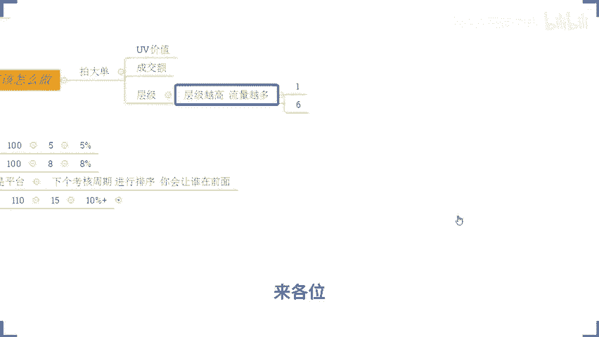
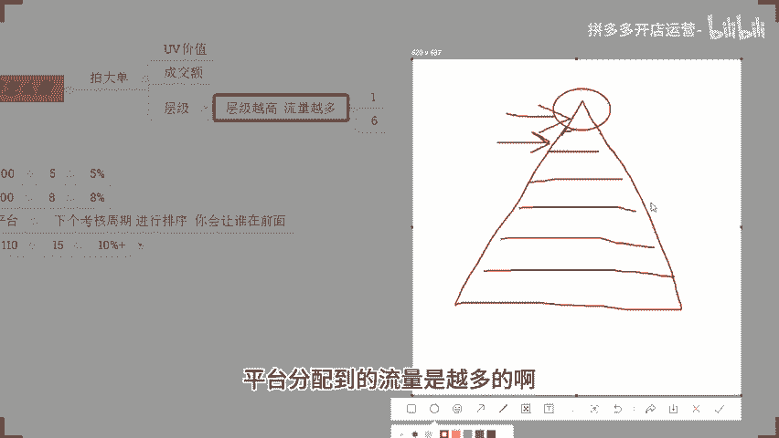
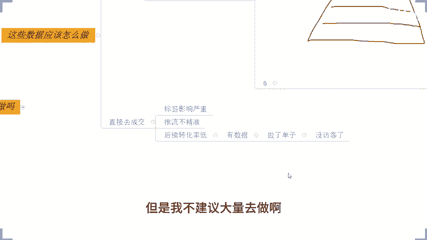

# 拼多多开店运营-新手电商运营实战指南，B站最全拼多多零基础入门教程！拼多多运营秘籍，小白也能成电商大亨！轻松上手拼多多，拼多多新手开店赚钱攻略 - P54：054 拼多多运营必备 新品爆款打造细节 - 拼多多开店运营- - BV1xms8eSEVs

那对于我们这个店铺的一个违规是吧？存在的其实这种情况的话，听清楚了，你不要上来就去哎，说哎，我数据掉了，我要补数据，我要干嘛干嘛的，各种这样乱七八糟动作，一大堆，千万千万不要。

那么这个时候你真正意义上应该做的是什么呢？OK如果说你店铺之前没有报活动。啊，你现在看一看能不能上活动，如果能上打一个低价去，好吧好？打一个低价去啊，把活动价格打下来一点啊。如果说你之前是有报活动O的。

那么你现在看一看你自己限时限量购，还有没有在做，如果有在做O那么不要管它等活动结束再说，如果说没有在做去把限时限量购开起来，把折扣价格比原本的活动价格打的更低一点。

然后如果说唉我现在的活动也在报我的限时限量购也在做，我等不及它下来怎么办？设置一个商品券，好吧？也是针对到我们这个产品的设置一个商品券，把金额比之前要做的多一点，把价格往下拉一点点啊。

那么这一个降价行为呢，可以帮我们去拓展人群甚至可以刺激转化。如果。说我们的真实数据，用户的点击反馈跟转化好了。OK那么数据在持续一个星期左右会恢复，好吧？呃，开线上的各朋友不准说同时。

因为都是同时卖一个品，这跟你同时卖几个品没有关系啊，好吧？你跟你朋友是卖同一个商品，对不对？他不让你做做现成性团购，他觉得你这个价格打的太低了，那你可以原价上活动嘛，对吧？这关西的小问题了。

OK大家注意看啊，接着再往下啊，如果说哎我店铺是没有违规的。听清楚了。我店铺现在没有违规，我数于往下掉了，那么再来分析另外一个事情是不是市场问题。😡，啊，是不是市场问题？

那我们整体的这个市场是不是说因为受到一些外部的原因，比如说这个呃气候的变化呀，换季呀，或者是节日的一些变化呀，导致的我们整体的数据下降，对吧？那么这个地方是有机可循的，你看大盘数据就可以了。

如果说不是ok那么无伤大呀，无关紧要，不用管它。那包括像我们这几天你们可能小伙把小伙伴在说，哎，我数据掉了，对不对？好，O那么如果说不是我们这个换季的影响，不是我们产品生命周期的影响。好。

那么你再去看一看有没有同行跟款做了你一样的图片一样的SQO再做低价。啊，这个就是低价截流。好吧，你去关注一下这个事情啊。如果说有，那么你试着去做房比价，或者你要么就跟他硬钢。都可以。看你自己怎么选择啊。

这是另外一个方式。还有另外的点呢，就是说哎我现在店铺呢没有什么这个违规，我的市场也没什么问题，也没有同行在跟我截流。OK那么再往下呢，我们就要做一个事情，看一看你的店铺的评分。呃，怎么做横比价。

把你的SQ图片和你的SQ名称做的不一样。好吧，做的不一样就可以了啊。那在这个地方呢，我们再来说一说店铺评分的问题。如果说你一开始的时候，你在之前访客打个比方啊，1500啊，1500啊。

你的访客2000啊，在网上涨，你在这个期间的时候，你要去关注你的数据，如果说你没有关注，那抱歉，这是你自己的问题了啊，那么我帮不了你啊。那如果说你一开始是有在关注你数据的时候。

你每天去观察一下你整体店铺的数据，像你的整体的访客变化呀，你的点击情况啊，你的转化情况啊，你的UA价值，你的客单价啊，对吧？等等各项数据，包括说我们的店铺评分，你关注一下，那么这些数据涨的时候。

一定你的店铺评分不会太低。如果说今天哎我头一天访客还有2000，第二天只有500了，莫名其妙掉了一大截，对不对？好，你来关注。😊，一下你的店铺评分是不是掉了。如果说是OK那么你一定要记得这个数值是多少。

之前是多少，现在是多少。那么以后你在店铺运营的时候，一定要维护到你这一个店铺评分在这一个标准之上，这个每个类目不一样。有的品类可能4。5，有的品类可能4。6，有的品类可能4。34。2，都有可能啊。

但是正常情况下低于4。5平台是不会进行推流的。所以这个点大家要注意一下啊，那如果说你低于4。5，你的平台不能不能推流，包括你连上活动有的时候都会受限制的情况之下，你说你访客掉不掉，你说你流量掉不掉。

对不对？所以这是一个非常严重的问题。那么这个地方如果说我们关注好的话，OK那我们在这个阶段，我店铺评分下降，导致我访客下降的话，OK把评分拉上去。但是我们去拉评分的时候，你自己去做，只是制标啊。

怎么去提评分。这个我的天，你们这些问题问的真的是。😡，太没水平了啊，就跟我们吃饭一样的对吧？你可以用手抓着吃，你可以用筷子吃，你可以用勺子吃，对吧？你怎么吃都行。😡，啊，你怎么吃都行，这个随意你啊。

你可以你可以是通过直播端口去做对吧？你也可以通过这个劲宝去做，你也可以通通过这个搜索端口去做，随便你怎么去做，对吧？你自己安排就可以了啊，渠道都无所谓的，怎么做都行啊，看你自己哈。那这个只是治标。😡。

真正意义上要维护我们店铺运营，去起到一个长期发展的作用的话，一定要治本。我们要分析原因。那什么原因导致的。如果说是我的产品不行，O那么你换产品，如果说是我的产品这边发货效率低，替换供应商。

如果说哎我的产品我觉得款式不错，我我这个供应商我觉得还行，对吧？只不过可能有的人他对我们这个产品挑剔，那么可能是你价格定位有问题，好不好？那如果说所有问题都都O的对吧？

可能只是我们在客服接待的时候跟用跟用户之间关系处理上不是很好，或者是我对这个客服接待的板块来来说容易忽略。这个时间的回复效率比较低下，导致一些人呢对我的这个服务不满意啊，给了我一些一分评价。

那么优化你的服务，这个才是治本。😡，各位能够明白，能够理解公民大义。好吧，能够明白能够理解公民大一。啊，OK啊，来其他人呢？😊，其他人呢？🤧。😊，呃，你应该就是评论问题是吧？价格上一般同行还是打不动的。

哎呦这么自信啊，可以的啊，我欣赏你的自信啊，可以可以可以啊。那如果这样子的话啊，这个WIK啊，我觉得你可以认真听一下了啊。今天的话可以认真听一听。因为今天后面我要分享这个方法的话。

对于我们有价格优势的商品的话，它的一个效果是非常非常好的。我可以给你看一下啊，我可以给你看一下啊，来这个WIK有看到吗？WIK有看到的话，公屏打个6好吧，啊，来如果说你对你的价格确实很有信心啊。

你的价格在同行里面真的是很很这个有竞争力的话，那么今天后面这一个分享的方法，你一定要认真听啊，为什么这样讲呢？你可以看到这是一个纯新店来的啊，这是一个纯新店来的，对不对？

从零访客开始的这个店铺呢就用到了今天要分享这个方法，并且呢它也是在价格竞争力上有一定的优势。然后你可以看到从新店上架到我们取款的整体时间很短啊，那么直接从零啊干到了1200的访客，一天的话1900多单。

看到没有？😊，15。68的转化率啊，那么这个方法你们可以认真听一听啊。对于你们来讲应该是很有帮助的啊。OK这个店铺操作的话，其实方法有很多啊，没有你们想的那么难啊，只不过呢你们可能自自身在运营的时候呢。

缺少一些这个方式方法跟这个运营思路而已啊，不用担心的啊，好好听好好听啊，OK那么我们刚刚讲的是评分，对吧？那我们回过头来还要干嘛呢？还要看就是我们的数据。😊，刚刚我不是提到过嘛，对不对？

我们在日常运营中呢，我们还得去关注到我们店铺的各种各样的数据，对吧？哎，我的访客，哎，我的这个转化对吧？哎，我的这个客单价啊，我的UV价值对吧？包括说我们的成交额啊等等啊等等啊，各项数据指标。

只要在我们后台里面能够看到的，我们都要去看。那如果今天我的访客突然下降了。OK你也可以仔细的去回顾一下，你在访客下降前面一个星期啊，钱。😊，一个星期啊的数据变化，哪些数据变化呢？包括像你自己的转化率。

对吧？啊，你的这个UV价值啊，这两个板块是重点啊这两个板块是重点啊。这么一个板块你重点关注一下啊，比如说今天我店铺呢原本有一有2000访客，今天就有500了，对不对？

那么这个2000访客到500这个变化过程中呢，是哪一个商品的数据掉了，或者是哪几个的商品数据掉了。那么你进到这些商品详情里面去认真的去看一看它的数据，那么这些数据里面转化情况怎么样的。

因为价值情况怎么样的。如果说唉这个产品它就是在过去一段时间里面转化数据表现很差，或者是没有达到以前数据增长过程中的一个很好的表现的话，那么这个阶段就是我们要重点优化的一个数据，我们要引导转化，好吧？

把这东西做好，基本上问题不大的。O啊，今天呢你们问到的这一个问题呢，叫之前有访客，现在访客突然掉了啊，几个情况呢，就给大家分享了这个地方，好不好？那么以下呢就开始我们今天的正式分享。所有人啊。😊。

动起来，公屏上扣个一好不好？所有人动起来啊，公屏扣个一好不好？动得快啊。那么呃对于我们店铺操作来讲的话，我知道啊有很多人就像我今天在直播间里面看到的啊，有很多人都是真正意义上的纯新手纯小白。

那么今天的分享呢我也会由浅入深的来跟大家分享。包括说我们的运营逻辑啊，这种思维方式的一个建议啊，我之前也提到过啊，所以大家不用担心说哎西楼这个内容我会不会听不懂，或者西楼这个东西会不会特别基础。

导致我没有办法得到一套提升，不至于啊一定会对你们有帮助。这一点我可以打包票。另外一点的话啊，后面呢会有到一个呃针对到我们店铺在解决如何进行转化的一个非常有意思的一个方法啊。

对大家肯定是也会有到非常大的帮助的啊。O那么呃在正式分享过程中呢，我会经常的提问这一点的话，大家先有心理准备哈。所以这个时候呢我要开始我的第一个。😊，问题了，好不好？各位。那么在我们的日常运营中。

我们作为店铺的运营，或者我们作为店铺的老板，对吧？那我们运营的目标啊，或者不是不是目标啊。我们运营的这个呃对象啊，应该这样讲啊，我们运营的对象是什么？来，这个问题大家思考一下好不好？各位。

现在这个问题大家思考一下啊，来把你们认为正确答案呢发在公屏上啊。这个问题我没有说是问的好玩的，我希望大家能够认真对待好不好？把你认为正确答案呢发在公屏上。

这个是我们运营思维建立的一个非常重要的一个一个一个事情啊。OK这个比如说产品，还有什么不同的意意见吗？OK然后呢，2026说是顾客WIK说是客户啊，然后美美说顾客啊。

然后枫叶说顾客小飞说顾客O悠悠说是让店铺获利啊，信希旺说是顾客好，呃，有没有什么其他不同答案的。😊，哎，小二讲是流量啊流量啊啊，这个小二的答案呢跟刚刚其他小伙伴答案呢不太一样啊。

我们目前呢大多数的小伙伴回答的这个呃答案呢是顾客啊，那么还有其他不同答案吗？如果说没有不同答案的，公屏上可以扣个一啊，动作快啊，没有其他不同答案的，公屏扣个一啊，动作快，我确认一下啊，我确认一下啊。

来动作快啊。😊，如果说有答案的，你自己心里面有想法的，快速的把你自己认为正确答案发到公屏上啊，我还是非常期待啊，我还是非常期待的。至少到目前为止呢呃没有人给到的答案是真实意义上准确的啊啊，有接近的。

但是没有准确的，好吧。😡，OK啊OK啊，基本上都扣了一了啊，基本上都扣了一了啊。我看几个活跃小伙伴都扣一了啊。然后还有更多小小伙伴呢是没有回复的啊，我点个名吧，好不好？我点个名呃，万里归期啊。

你也是老熟人了，对不对？来万里归妻啊，你说一下这个问题，你有其他部分答案吗？如果没有的话，扣个一好不好？😊，万年归溪有听到吧，然后还有像我们的这个桃子。桃子有不同答案吗？😡，桃子如果说有不懂答案的话。

把答案发公屏上啊。如果说没有的话啊，公屏上扣个一是吧？O啊，对，你们要动起来啊，对吧？你看啊如果说你们刚刚都扣一的话，我也不用来问你们一次，专门问一下，对吧？浪费时间好不好？所有的在直播间小伙伴们啊。

在我问大家问题的时候，我希望你如果说真的是有在直播间人听的话啊，记得第一时间把答案发出来啊，好不好？这一点的话，我希望大家配合一下啊，O新希望给出了一个新的答案叫利润啊，好行行行行行啊，那我们去纠结了。

不用纠结啊，啊，我说一下我的理解吧。至少来说我认为我的这个理解在我这里它是标准答案啊，大家可以去跟着我的思路来来这个走一走啊，来看一看啊，是不是这样子的。其实我们运营的对象不是产品啊。

各位我们运营的对象不是产品啊，我们运营的对象也不是利润。我们运营的对象呢也不是顾客，我们的运营对象也不是什么。😊，户对吧我们运营对象是什么呢？我们运营对象是数据。好吧。

那这个东西呢呃刚刚有小伙伴说是运营的对象是流量啊比较接近的。我觉得还是啊。所以这点的话我希望大家能够明白啊，我们运营的对象是数据啊，当然这个只是我的理解啊，大家可以可以有不同意见啊。

但是这个在我这里是标准答案好吧？那如果说你现在有持有不同不同意见的话，那么没关系，可以先认真听一下啊，看看我的一个这个想法，如果说你认同的话，那么你可以把这个答案呢当做是你认为对的答案以后呢。

你以这个方式来运营的店铺好不好？那我们在做店铺的时候，我不管我们想要去做成什么样，对不对？我不管我要去赚多少钱，或者我要让我的产品卖了多好，卖多少单。

我或者是让我的用户呢在我店铺里面有到一个多好的购物体验，有到多好的一个转化，对吧？这些东西都不重要，重要的是他们是根据数据来体现的，而我们针对到店铺运营。😊，最核心最根本的参照就是数据。没有数据。

你是没有办法进行运营的啊。当然呢你们说运营的对象是产品啊，这个逻辑也是成立的啊，对不对？我不能说你们的错，但是只能说在我这里啊标准答案是数据，好不好？

所以大家可以可以把这个逻辑稍微的呃在脑袋里面过一过啊。那我们如果想让我们店铺做的很好，或者是让我们店铺变得啊数据逐步的上升，对不对？变得更优秀，那么一定是在数据层面上达成了平台的。😡。

考核规这个标准啊考核标准啊，不能说是规则啊，考核标准。各位这一点大家同意吗？如果说同意的话，公屏上打个6好不好？😡，对吧我不管我的店铺想要做的多好，对不对？哎，我要像这种店铺来。

我一天要做到12000的访客，一天卖个100多单，对不对？哎，或者是我一天要卖个2000多单，对吧？那我不管我的店铺要做多好，那么一定是在数据层面上，我能够达成考核，平台才会给我推牛。

不然的话你不可能做得起来，是不是OK的啊，那这个地方呢就有到一个非常重要的事情了，需要我们去呃在认真思考一下。既然说对运营对象式数据，既然说我们平台考核呢是有标准的，那么在我们运营过程中。

哪些数据是最最重要的。😡，大家可以啊在公屏上呢再一次回复一下我这个答案啊，哪些数据是。最重要的。好吧，你们可以在公屏上呢把你认为正确答案呢发出来啊，这个问题呢也希望大家能够认真对待。

那么这个地方呢就真正意义上开始，就是我们针对到店铺的运营思维逻辑的一个建立了。如果说你现在是新手小白的，你心里面没有答案的，公屏上可以打问号，好不好？然后呢，你心里面是有答案的，你知道一些东西。

你认为哪些东西是对的，你把答案发的发的出来啊，那么我们一起探讨，好不好？😊，那么这个地方的话，不管你是心如小白也好，还是说你自己有一定运营基础也好，那么都是一个非常好的一个呃这个呃切入点啊。

对于我们店铺运来讲好吧？O有很多小伙伴发出来答案啊，包括像这个小二哎讲到说是有这个店铺的访客，由于说有成交对吧？林枫叶说有销量评价跟转化杰罗说是这个访客和转化然后go说是这个呃点击率转化率啊。

每每说是点击率啊，访客率啊，访客率什么意思啊啊，没没搞明白啊啊，努力努力在努力问了一个问题，啊，没有访客咋办啊，没有访客咋办，你可以认真听一下啊。今天的话后面会讲到的。

没访客咋办啊然后还有很多啊基本上都围绕着转化率啊，坑产啊啊单成交单量啊对吧？这些东西来的，还有收藏啊，还有这个UV价这些人提到啊，各种各样的数据啊O啊包括像后面呢还有这个。😊，呃。

这个小伙伴提到了这个评论问题啊。OK啊，行行行行行行，好，确实你们所说的这些数据呢，对于我们店铺来讲都很重要，对吧？但是呢真正意义上在我们店铺运营过程中啊，我们有到一个东西啊。

可能你们平时呢没有这样的一个呃知识体系来建立你们有到一个非常好的呃这个完整的框架啊思为框架啊，这个是可能比较少一点的。那么实际上呢在店铺运营啊。😊，它是有一个标准答案的，这个不是我说的了啊。

这个不是我说的了啊，这个是我们呃专业体系知识里面的一个呃非常重要的核心的概念啊，叫做运营三要素啊，叫做运营三要素。那么这运营三要素是什么呢？其实就是我们在店铺运营过程中的一些数据指标啊，哪些指标呢？

来来写一下啊，好不好？就首首先第一个啊流量啊第一个流量啊。第二个呢哎这个东西呢大家都知道啊，这个东西大家都知道。第二个东西呢就是我们的这个呃客单价。😊，啊，这个秘就是课程讲啊。

然后第三个东西呢就是我们的转化率啊，这几个东西我相信大家应该都清楚，对不对？平时你们可能也都接触的比较多这些这些数据。那如果说你是还没有开店呢，对这些数据不了解的，没关系啊。

那么现在你知道了以后你要知道我们运营的核心三要素是这三个。那么为什么是这三个呢？道理很简单，首先就像你们提到的，哎，那我没有流量怎么办？对呀，你没有流量，你是不可能进行转化的，你也不可能卖出去你的产品。

对不对？所以流量的重要性毋庸置疑，流量是什么？流量就是访客。对吧原看就是访客，对不对？那当我有了访客之后。😡，我的商品如果说卖不出去，没人买，是不是等于说我一样赚不到钱。所以这个时候呢我们想要去赚到钱。

我就要卖出去我的商品。一旦我的产品访客形成了订单，那么我们就形成了转化，就会构成转化率。同样的访客数据呢转化率越高，那我们的成交的单量也就越多，对吧？我赚到的钱也可能越多，是不是？而在这个过程中呢。

我们有的人他可能买的产品的这个价格很低啊，那么这个时候呢都是买低价商品的时候呢，我的利润就会很薄，甚至说我们会面临亏损的风险。因为有人可能还会退货，对不对？我们会涉及到一个产品的运输成本的问题。

那么如果说有人他都是买一些高客端的商品，那我的盈利空间就大，那我赚钱的概率就越大，所以说这个时候呢会涉及到客单价的问题。各位来这三个数据指标现在都清楚的话。😊，公屏上打个6好吧，以后记得啊。

运营最最重要的数据是哪些是我们的流量客单价跟转化率啊，这个三个呢叫做运营的核心三要素啊，运营核心三要素啊，核心啊，我再把它打出来啊，核心两个字给你们打出来啊，所以这个点很重要啊。

那我们想要让我们的店铺有访客。我们想要让我们的店铺呢有数据。哎。这个这个这个这个。网络掉了啊，我我看一下啊。哎喂有有有，刚刚这个这个这个这个这个网络断了一下啊，来来来来来来来包租可，包租婆啊。

怎么突然网卡了，是不是？😊，包租婆怎么没水了啊，是吧，来现现正常吗？现正常吗？😊，现在正常吗？来，各位各位小伙伴们啊，目前在直播间的小伙友们能够清楚听到的话，还是老规矩啊，扣个一啊。😊，OKO啊。

行行行行啊，呃，我网络刚好正恢复正常，我就看到小二说了一句啊，包租婆怎么突然卡了啊，那让我想起了他的台词，对不对？包租婆怎么停水了，是吧？😊，啊，OK ok正常就行啊。

那刚刚也讲到这一个核心三要素这个点啊，大家应该能够记住的啊能够记住的那当我们在后续运营的时候，其实我们就是要在针对到这三个数据指标不断的去提升，对吧？那么各位现在呢呃我们想要知道的是什么呢？

我们很多人说哎我没有反客怎么办啊，我没有转化怎么办？对？哎我的能价低怎么办？我的毛利低怎么办啊？可能这个时候呢我们的问题就会再次延伸出来，对不对？各位有没有发现啊，来现在大家有没有发现一个问题。

当我们从最开始提出第一个问题的时候开始啊，不断的把这个问题向后延伸啊，到后面对不对？就会涉及到我们真正意义上的操作部分各位有发现吗？来现在有发现的话，公民打个6。😊，所以小伙把它动起来啊。

如果说你现在是已经发现这样的一个规律，或者是已经感受到了啊，公民可以打个6好吧好？好，非常不错啊非常不错啊，至少来说你们是有在思考的。那么这个是什么？各位这个就是运营逻辑的建立啊。

当我们想要去做好一个店铺的时候。😊，你不能盲目的去说，哎，我想要去做什么或者怎么样，而是你应该去找到问题的核心点，找到问题的根源。然后针对这个问题呢来进行拆分来进行剖析，对吧？

那么导致这个问题的原因有哪些？那么这些原因又是因为哪些数据或者哪些原因导致的。那么对应的这些原因，我们应该怎么去解决它。这个就是运营，运营是一个发现问题，并且解决问题的过程，好不好？

就像我们上面啊提到的第一个问题一样的，对不对？你们说哎我店铺的访客突然掉了，那这个东西怎么解决，解决方案一定是在我们的原因之后，对吧？我们先要去确定原因，是我们有违规吗？是我们市场有问题吗？

是我有同行截流竞争吗？还是说我店铺评分有问题，又或者说是我的商品数据有问题，是不是我们把所有的问题先梳理清楚，来逐个的排查，然后再针对到我们的实际问题来进行数据优化，这个就是运营。

那如果说你不具备这样的运营能力，OK你说你做店铺，你能做好吗？每天你都是在闭着眼睛乱操作。那么你这个时候呢，你就会花费掉大量的时间，对不对？哎，你的这个大量的时间啊，大量的资金啊，就完全浪费掉了。

甚至有的时候呢，你做的越多错的越多，所以这个问题很关键啊，这个东西呢，我已经反复强调了很多次，但是我发现很多人对这个东西是呃，我不知道是属于容易忽视它。

还还是说这个呃在店铺运营过程中确实是知属于缺乏导致的啊，就像这个WIK啊WIK之前讲了说哎我之前就是这个店铺数据掉了之后，我赶紧去这个做了销量，对吧？我做了100单。对吧那么这个时候你们想想。

如果说我们店铺真的是存在说平台已经抓到我违规了，给我降权了。我上来去干了100单，你说你死不死？😡，各位，你们想一下啊，是不是有道理？😡，所以如果说我们在运营店铺的时候也是一样道理。

我们要把所有的问题逐一的去拆分出来。各位。听得进去的认为我说的有道理的，现在公屏上打个一好不好？所有的有在任人听的啊。那么我不希望你们以后做店铺呢是闭着眼睛乱操作。那么这样去做店铺的话。

是永远做不起来的，你只会浪费时间，浪费钱，知道吧？所以这是一个很恐怖的事情哈。好，OK啊，那回到我们这个主题中来啊，刚刚这一个也是题外话啊，插进来一下啊，那回到我们主题中来啊。

那今天我们讲到的我们运营呢，有核心三要素，对吧？有流量，有客这个客单价，有转化率。那么在这些数据里面。😊，我们想要去做的最最让我们头疼的。可能很多时候呢啊有的人觉得是流量啊，有的人觉得是这个客单价。

有的人觉得是转化率，对不对？那么今天我就分享一个方法啊，给了大家能够让大家去提升好我们的流量，获取到更高的客单价来带来更好的转化率，好不好啊，这点的话大家注意听了啊，好不好？来。数据提升啊数据提升。

也就是我们的店铺数据增长了，对不对？他我们刚提到过呢，平台是有考核标准的。那么考核的标准是什么呢？是我们的数据，对吧？我们刚刚也提到过，那么这个数据是哪些呢？哎，有我们的这个呃。销量对吧，有我们的销量。

有我们的这个。转换率啊，有我们转化率，有我们的收藏啊，有我们的上架时间啊，这个是这个是平台在后台是有写明的平台考核规则啊，是这些啊。然后另外呢，其实还有到我们的点击率啊，包括说我们的点击量啊。啊。

包括说我们的搜索热度啊等等啊等等啊，都是有关联的啊。那么在销量里面呢，又包含了很多，包括像我们产品的这个呃单量啊，单量啊，包括像我们产品的这个呃刚刚我们提到过的客单价啊，包括像我们产品的UV价值，对吧？

这些东西啊，包括成交额啊，都是在我们这个销量考核里面的啊，这些所有数据都是啊。那么在这个过程中，我们要优化好我们产品的数据，点击率点击量啊，包括是搜索热度，我们可不可以做啊。各位我问一下啊。

这几个数据我们可不可以优化，可不可以做。😊，来，这个数我们可以说吗？😡，如果认为可以的，公民打一，认为不可以的，公民打2，好吧。😡，OK啊O啊，目前给到我答案的小伙伴都认为是可以做的。没错啊。

这个数据呢是可以做的啊，这个数据是可以做的啊。我来看一下案例啊，我来看一下案例啊，来各位这个店铺呢，刚刚一开始呢我有给这一个WIK有看过啊，刚刚我有给这个WIK看过啊。

可以看到从最早零访客的一个新店开始操作的啊，那么上架操作之后呢，前面几天时间里面，其实我们又是有在操作这个数据的，包括这个数据呢，我们可以在任何阶段去开始操作都是没问题的啊，都是没问题的啊。

那对于我们整个的数据操作的话，在这个期间呢啊尤其像我们新品前期的时候呢去做效果会更好一点。那么你可以去找你的七大姑八大姨啊，去完成这个产品的搜索点击跟浏览啊，都是没问题的，对不对？

可以反复去操作来增加我们商品的热度啊，产品的热度搜索的热度以及我们的点击点击率啊都是可以的啊。那么这个数据呢是没有一个固定要求的。你不同品类。😊，啊，做的数据是不一样的。当然了，哪怕你只做了一个。

也一定会比你不做要好的多。有没有人对这个不理解的，有没有有的话打问号啊，我确认一次啊，我确认一次，有没有人对这个不理解的。因为如果说你是新手的，可能这样听的话，确实听不明白，这个没关系。OK啊。

桃子不懂啊，有没有其他人不懂的。如果说有不懂的话啊，如果说有对这个东西有不明白的话，公屏上先打个问号好吧呃，可以找资源准备，有资源有资源没问题，有资源的啊。来我看一下超过5个人吧啊。

超过5个人我就讲一下啊。如果是5个人以内的话，你们就下播之后单独找我吧，好不好？😡，来所有不懂的啊这个点啊这个点所有不懂的啊，问号扣起来，我看一下。😊，不是吧，你们你们很多人刚刚闷不吭声的，对不对？

你们很多人刚刚闷不吭声的，现在突然说没有5个人就不讲就就抠出来是吧？😡，哎呦喂，我的天，你们真的是人才啊，你们真是人才。😡，呃，行吧行吧行吧，那那那那我我这个我我点个名吧，我看看我看看啊。

看到一个这个熟悉的一个面孔啊，看到一个熟悉的面孔啊。😊，我点个屏，我问一下啊我问一下啊。这个设计星空啊呃设计失空啊，设计失空设计失空来。对吧也是老熟人了。😡，确认一下啊，你这边这个问题懂不懂啊？😡。

确认一下啊跟你确认一下啊。嗯。不懂是吧，我的天兄弟。😡，你在干什么啊？你要是不明白不懂的话，你问号扣起来呀，对吧？不要等我来问你，你再说好不好？你们要自觉一点，兄弟们啊，没有什么不好意思的啊，好不好？

你。😡，你看小二都发脾气了，拉出去砍了对吧？😊，哎呀，好了好了，不逗你们了啊。好，那我们直接讲了啊，我们直接讲好，我直接拿数据给大家举例子好吧。假如说现在呢我们有产品开始竞争啊，商品A商品B好不好？

商品A商品B啊，这两个商品呢它们都是新品，好不好？听清楚了啊，这两个商品都是新品啊，听清楚了。😊，那么这两个商品呢，在上架之后呢，平台是会给我们推荐曝光的，对不对？这个推荐曝光呢可能多可能少。

我们也不确定。但如果说这两个商品他们是相同的。类目产品的价格也都差不多，商品的属性也都差不多，甚至可以说是相似款，对吧？好，它的推荐权重呢应该也是大差不差的啊，没有什么太大出入啊。

那这个时候我们做一个假设假设商品A呢拿到了100个曝光，好不好？商品B呢也拿到了100个曝光。😊，那么商品A呢，今天哎用户的点击量呢听清楚了，用户的点击量呢有5个，对吧？好，它的点击率呢5%。各位。😡。

来这一组数据没有问题的话，公屏上小一扣起来啊，我确认一下好吧，这一组数据没问题，公屏小一扣起来。😡，好啊，那就行了那就行啊。那这个时候看清楚了啊，商品A的数据已经有了，对不对？商品B啊商品B哎。

这个这叫牛啊，对吧？它呢有8个人点击了啊，它有8个人点击了啊，好不好？他有8个人点击了啊，那么8个人点击之后呢，它的点击率呢是8%。😊，这个时候这两个商品都是新品，都没有成交。😡，都没有订单。好。

那现在我问大家一个问题。那如果说你就是平台。第二天或者下一个考核周期的时候啊，下个考核周期啊，下个。进行排序的时候。你会。让谁在前面好吧，来这个问题问到大家。😡，OK啊B是吧啊。

看来你们都都已经了解这个东西了啊，都明白了啊。好，是B啊。所以说点击率点击量跟搜索热度呢，它是影响我们产品权重的啊。那么我们刚刚提到过，对？我们这个东西可以自己做啊，我们可以找人去做，那找谁做呢？

找你的前女友前男友对吧？七他881都行，做多少呢？我刚刚提到过，哪怕做一个都好的。但具体做多少更优秀呢？跟我们的产品不同，做的量不一样啊，比如说我现在只去做了一个点击啊，我只做了一个点击啊。

我们这里写A一好了啊，我们写A一啊，这个就是我做了啊，我去优化过的数据啊，我做了一个点击这个时候呢我的访客就变成了6个，对不对？😊，那当我访客变成6个的时候呢，其实我的曝光量也发生改变了。

因为我没有曝光是不可能有点击的嘛，对不对？所以这个时候呢，原本的100个曝光里面呢，又会额外多出来我这一个曝光，啊，那么换句话说呢，我的曝光量就是101，对吧？😡，没错吧，就是101啊。

那么这个时候变成101之后呢，我的点击率也会跟着改变6除以101。那么点击率呢应该在差不多6%了啊嗯。😡，是不是差不多6%的样子啊？OK啊哎，上财通值啊，你还算的挺快的啊，5。94%是吧啊。

差不多6%啊，我就说嘛，对不对？啊，5。94%对不对？那这个时候商品A啊，商品A我们去优化之后，我们的操作之后，它的数据会变得更优秀，有没有？点击率变得更高了。那如果这两个产品来对比的话啊。

A一和A来对比的话，谁会排在更前面，你们自己说来把答案发出来啊，把答案发公屏上好不？A一对没错，A一啊，所以这就是我们刚刚讲到的这个东西，但是做多少是一个问题。我们做一个的话，这个时候呢。

我们是比原来要优秀了，这个没有错，但是我们还是没有B优秀，对不对？😊，没说吧，我们仍然没有必优秀。所以说这个时候可能我的数据量会做的多一点，多少呢？假如说我今天做了10个呢啊，我今天做了10个啊。

打个比方啊，我今天做了10个啊，那么这个时候呢它就变成110了，对不对？哎，15除以110啊，O就等于多少百之123的样子啊，好吧，百123的样子啊，好吧差不多这样吧，我们就不去算了，算就不去算了啊。

百分之百十几啊，百10几啊。😡，啊，我写个加号吧10%以上啊，10%以上啊，所以这个时候呢我们就变得更优秀，对不对？所以做多少合适，根据我们的同行来，根据我们的类目来啊，是这个样子的，各位能能理解吧。

所以这个地方的话，你们去做做的数据量越多越好喽。这个就看你自己的能力啊，你有能力找更多的人去完成这个动作，你找更多的人啊，至于刚刚这个有小伙伴就问说，哎，哎那做这个东西我有资源呢，对吧？是谁问的来的。

我忘了啊，这是谁问的，我忘了啊，有资源的啊，有资源的呃，今天的话确实也看到你们的比较认真啊来。😊，你们想不要这个这边呢？我问一下。😡，嗯，有人可能说哎嗯我这个朋友有限呢，我找朋友的话有丢面子，对不对？

我找他们又麻烦欠人情呃，有资源的话最好喽，对吧？呃，可不可以分享一下，OK的啊，看你们自己喽啊，来有多少人想要的来，我看一下。😊，对，想要的话，公屏上扣个一或者打一个响字啊，我看一看啊，我看一看啊。😊。

对吧既然想要的话，好歹得动起来吧，对吧？😡，感觉你们不太想要的样子啊。😡，哎呦哎呦哎呦哎呦突然就热情起来了啊，可以可以可以可以啊。好呃，既然说你们想要的话，那我也没那么小气啊，分享给你们。

但是呢在分享之前呢，我要先跟大家讲一个事情，就是资源呢你们自己去用就可以了，你不要外传。😊，这个没问题吧，如果没问题的话，公民打一个6啊，给到我一个承诺啊，自己用就可以，不要外传啊。😡。

OK的话打个6啊打个6啊。好，你们记得自己的承诺啊，君子一言，驷马难追哈，好不好？OK那呃我把资源的这个微信啊发公屏上啊，你们可以自己加一下啊，可以自己加一下，好不好？😊，嗯，等一下我找一找啊。

我找一找啊。OK啊，这里啊这里啊来。😊，这个是资源微信。啊，这边微信啊。可以自己加一下啊，可以自己加一下啊。然后这个是呃二维码啊，二维码。好，你们可以自己加给你们一点时间吧啊，给你们一点时间。

我相信你们很多人已经迫不及待了啊，给你们一点时间啊，呃10秒钟吧10秒钟吧吧10秒钟吧，你们自己加一下啊。那么这个呢我也发公屏上一下啊，公屏上你们自己加已经加了的小伙伴的话，公屏上可以扣个一啊。

到时候我我确认一下啊，我确认一下然后呢对于整个店铺操作来讲的话，就我们刚给你们看到的这个店铺一样啊就我刚给你看这个店铺样的，对不对？哎，也都是用到这种方法在做啊，所以效果怎么样，不用我去多说什么啊。

你们可以自己感受到的啊，那呃自己去用的时候呢，这里要我要讲一下啊，量力而行啊，量力而行啊，量力而行，你自己呢有资金有能力你可以做多一点你资金少少做一点啊，量力而行啊，对于店铺操作来讲的话。

很多的细节部分操作呢是比较重要的。像这一点呢都是。😊，小细节。而这些细节操作到位的话，你是可以比你的同行优秀很多的啊。因为你们想一下，前期的时候呢，别人没有在做的时候，你在做这一板块的话。

那么你的权重会高很多。因为新品前期的话，它重点考核的不是转化啊为什么呢？因为平台也都知道的新品它是没有太好的转化的，你没有评价没有销量，没有历史标签，所以你的转化率不会很高，所以前期的时候呢。

它重点考核的不是啊这个产品的这个转化，而是我们产品的这个点击啊，产品的点击率好不好？呃，还是得讲方法，那肯定的嘛。你如果说没有方法的话，瞎操作不就是在浪费钱吗？是不是东东一榔头西一棒槌的。

你能做好店铺吗？做不好好？啊时间差不多啊，时间差不多，这个地方我先收起来啊，这个不给你们看了啊说好10秒钟啊，超时了啊。😊，OK好了好了好了啊，呃，差不多到这里啊，我们接往下啊。那这个东西做到位之后呢。

后面呢部分呢就开始到我们后续的一个呃更加多的一个操作部分了。哎，我们要去做我们产品的收藏，做我们产品的转化，做我们产品的销量对不对？来，各位我想问一下啊，关于这些数据，你们觉得应该怎么做？😊，啊。

这些啊这些啊这稀去了啊，这些数据应该怎么做？来。可以把你们认为好的方法发到公屏上，好吧，这个没关系啊，谁也不认识谁啊，可以发出来，没关系的啊，一起探讨一下。😡，拍大单OK拍大单。还有吗？还有吗？啊。

直直接去买是吧，直接去买啊，还有吗？呃，我相信啊应该应该你们后续更多的方法的话，也都会集中在这个地方吧。呃，有没有不同答案的，来，我确认一下10秒钟吧啊，有不同答案的，公屏上可以打个一啊。

然后我等你把答案发出来。😊，啊，有不同答案的，你可以在公屏上打个一，我等你啊，把这个答案发出来10秒钟时间啊，好不好？大家可以帮我倒倒计时一下啊，好不好呃。😊，有不能答案，你就发就好了，你不用问啊。

不用问我啊，你认为对的答案，你就发出来就可以了啊。😡，OK啊，目前是没有人扣1了啊，目前是没有人扣1了啊。那么呃答案的话也就集中在3个，对吧？拍大家直接去做销量啊，还有改销量这三种，是不是？😊，ok啊。

那么这里我说一下啊，兄弟们。😊，很多时候你们店铺操作觉得。做不做做不起来，做不好，其实真的是有原因的。这里我说一下啊，这里我说一下真的是有原因的啊。各位。来，我先说一说第一个问题吧。

你们讲到的拍大单的问题。😡，来拍照单它的作用是什么？各位，你们知道吗？😡，嗯，拍照单的作用是什么？你们知道吗？😡，来，各位拍到单的职接作用是什么？大家知道吗？好呃，上才同纸说了UV价值。😡，啊。

UV价值啊，这个是直最直接的，对不对？UV价值上来了啊，那么也有可能呢还会有到我们整体的店铺产出，对吧？啊，我们的这个成交额吧，我这样写吧，写产出可能你们到时候又又又这个呃不理解了，对吧？我说成交额啊。

还有是什么呢？啊层级对吧？层级啊，OK啊，好，OK啊来。😊，那么我们去做店铺的话，新店可不可以这样做？我不能说不可以，但是这种方法在我看来一定是不好的。😡，啊，一定是不好的，好不好？各位。

我我说一下为什么，你们可以听一下啊，这个可能就是你们很多人做店铺做不好的原因，就在这个地方。😡，首先第一个拍大单可以提高优惠价值，对不对？这个点我我认可的我我承认的啊，这个没毛病。其次呢。

拍大单也可以提高我们的交易额，这个也没问题，也没毛病啊，拍大单也可以去拉升我们的店铺层级，这个也是对的。而这些数据呢对于我们权重考核也都是有帮助的。这个更没有毛病但是毛病在哪里呢？好，我说一下第一个点。

😊，做大单的话，它对于我们的层级有提高，对吧？层级越高，我们所认为的流量越多。这句话你们有没有听过的？如果说没有听过的，公屏上打一个一，有听过的打一个6，好吧，没有听过打一，有听过打6啊。

这句话有没有听过的？没听过打一啊，有听过打6好，目前给到我这边的回答的呢，基本上大部分呢是有听过的啊，少部分没有听过。好。okK好，那么现在我大概情况知道了啊，兄弟们给我记住了。😡，层级越高，流量越多。

这个逻辑呢确实是存在的。注意我说的是存在，但是并不代表说这个说法就是对的。啊，那么为什么说层级越高，流量越多呢？来，各位我来给大家画一下啊，我来给他家画一下店铺的访客啊，店铺的访客啊。

它是呈现出一个呃这个三角结构的，对不对？层级越高的店铺呢是越少的啊，这个地方打个比方是第七层级啊，再往下呢，第六层级对吧？第五层级第四层级第三层级，然后第二层级第一层级好不好？是这样子的啊。

这里呢大家知道是什么东西就可以了，我就不去写了啊。那么在这个地方的话，层级越高的店铺。😊。

平台分配到的流量是越多的。

啊，这个是成立的，这个也不是说不适合新店啊，这个也不是说不适合新店。各位。那么为什么我说这种方法有问题呢？来，我重点说明一下成绩是根据什么考核的，根据我们店铺的交易额，什么交易额30天的交易额是不是？

那么这30天的交易额越高，你的成级越高？但是这30天的交易额，它为什么会变高，为什么会越高，层绩越高？😡，因为你店铺是能够有到持续稳定的产出的。那么这个持续稳定的产出是哪里来的？是因为你能够获取到。

访客，并且这些访客能够稳定的转化，对吧？你才能得到稳定的什么成交，是不是？所以说。这里与其说层级越高，流量越多，不如说因为你流量多转化好，所以带动你交易额提高，你的成绩才越高。各位。

能够明白能够理解公民哪一。所以说这个地方实际上他们两个之间的关系是反过来的。😡，而我们作为新店啊而我们作为新店的话，我现在去操作呢，哎我做了这个事情，我做了成绩，我把我的成绩拉上去了。

是我们按照正常逻辑来讲，这个层级所分配到的流量是越多的。但是因为我们店铺本身不具备竞争力，你是拿不到这个曝光的。😡，所以你去做成绩有用吗？没有用有意议吗？没有意议，好不好？这个是没有用的。😡。

OK刚刚还有人在问，哎，那现在做什么好做，原啊叫叫什么来？原来啊。😊，不好意思啊不好意思啊，跟我们当前讲的这个内容不相关的问题的话，先不要问，好不好？我不可能说单独给你一个人讲讲这个直播分享吧，对不对？

理解一下啊，理解一下啊，那这个地方的话。😡，这个说法错误的。😡，啊，错误的啊错误的啊，没有用啊，无用功。你做的越多，花的钱越多，仅此而已，浪费钱，为什么呢？因为我们每一笔成交要扣点的。

兄弟是不是千分之6。😡，对吧千分之6。😊，大部分的内部你做了三层级、四层级，成交额要做到十来万的样子。大部分的内部啊，好吧，所以这个时候你的扣点都要扣个好几百甚至上千块。😡，是吧有有什么好处吗？

没有任何好处。啊，没有任何好处，好吧？OK那再来说一说我们的呃这个成交跟优惠价值。😊，ああ。这两个数据啊，虽然说是能够去影响到我的商品权重。但是它毕竟只是两个数据而已，对不对？

那么如果说你的转化率跟不上，如果说你的整体的这个呃客单价跟不上，对吧？啊，包括说你的后续的什么收藏之类的跟不上。那么你只是这两个数据的话，哪怕你能够去做的比你的同行优秀，你有竞争力。

那么它的加权也是有限的。各位，所以这样的操作的话。😡，我不建议大家去做啊，我不能说你完全就是错误的啊，但是我不建议你去这样做。😡，啊，所以拍照单这个方法我不认同啊，我不认同。然后还有人说我直接等一下啊。

我把我把这里这个这个这个。😡，我把下面这个部分收起来了啊啊，有些伙伴可能说，哎，我直接。😡，啊，直接去哎成交啊，对吧？这个因为有的敏感词嘛，大家知道是什么意思就行了啊，我就不在这个上面写了啊。

我直接去成交，对吧？我找人去做，我做个几百几千单，是不是哎，可不可以？😡，也不可以。啊，也不可以。前期你操作的时候，你可能可以去做一些基础数据，这个没问题，对吧？但是你做的越多，对我们标签影响越严重。

😡，那么这个时候呢，会导致我们平台的推流。不精准。啊，然后引起什么问题呢？引起我们后续。啊，后续转化率低。然后呢，你的店铺访客哪怕上去了也会下来，你稳不住。啊。

这是一个非常直接的问题啊这是非常直接的问题。而且你操作的少了没有用，操作的多了，风险高。😡，现在呢我不知道你们有没有感触到啊，那么现在呢平台在针对到店铺这一板块的考核里面呢，逐步的在呃增加这个考核比重。

可能他不会给你店铺下违规通知，但是基本上呢会屏蔽曝光。这个我相信你们很多人做的是有感受到的，好吧，有这种感触的小伙伴，公屏可以打个6啊。哎我现在店铺呢有一点数据的，有数据啊，我去做了单子啊。

我想把数据做好一点啊，我做了单子。😡，做完之后，我发现我店铺没访客了。😡，是不是有没有有没有这种感触的，有没有有没有这种感触的？😡，他不会跟你说，你店铺违规了，也不会跟你说发一个违规通知告诉你。

你你这个被查了，对吧？但是他会用行动告诉你啊，他会用行动告诉你，你店铺就是没数据，我就帮你屏蔽了，对吧？我也不去我也不去给你下通知，告诉你违规，我就给你做哎，你今天做十单，明天做2十单，后你做00单。

当天做1000呢，你做多了之后，哎，马上就给你店铺来一个冻结。😡，是吧把货款移动搞定。所以说这个时候呢，你去这样做好不好？我不建议啊我不建议那少量的去做一些基础曝光和转化，以及我们的这一个评价啊。

这个我觉得是OK的。但是我不建议大量去做啊，我不建议大量去做啊。OK那怎么去。😡。

