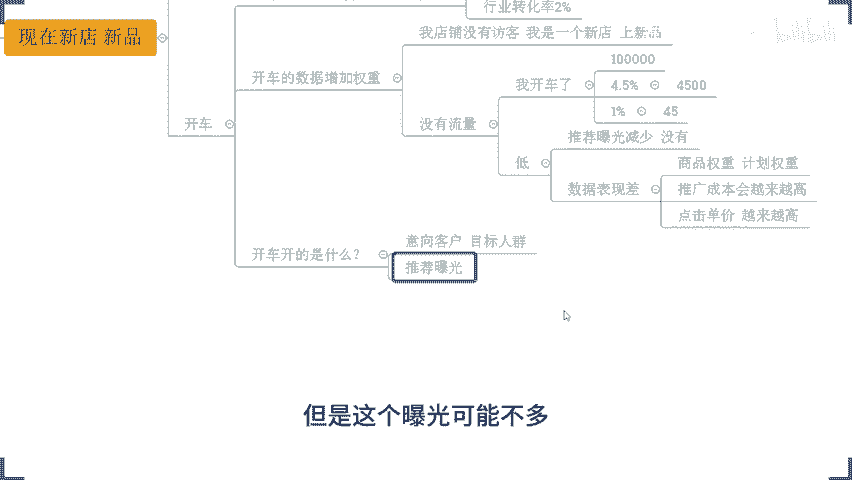
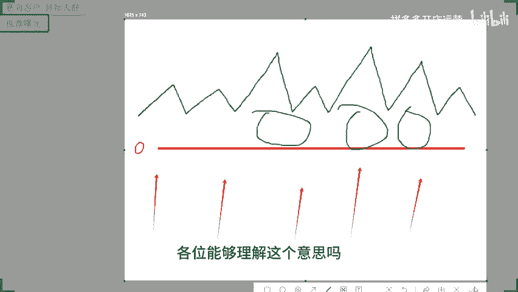
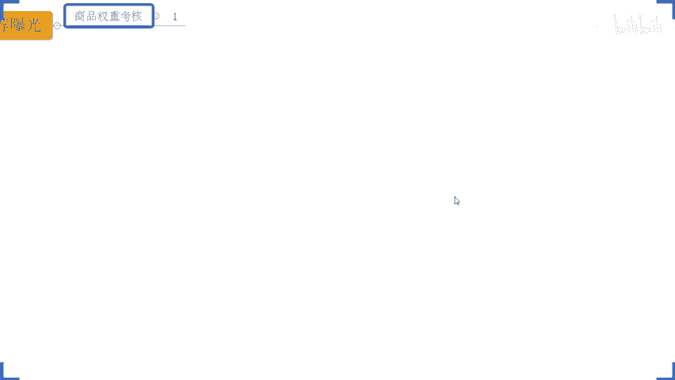
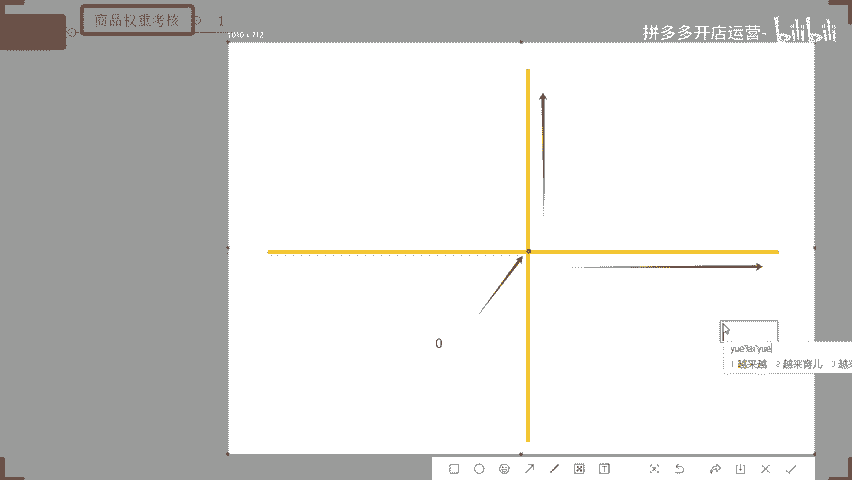
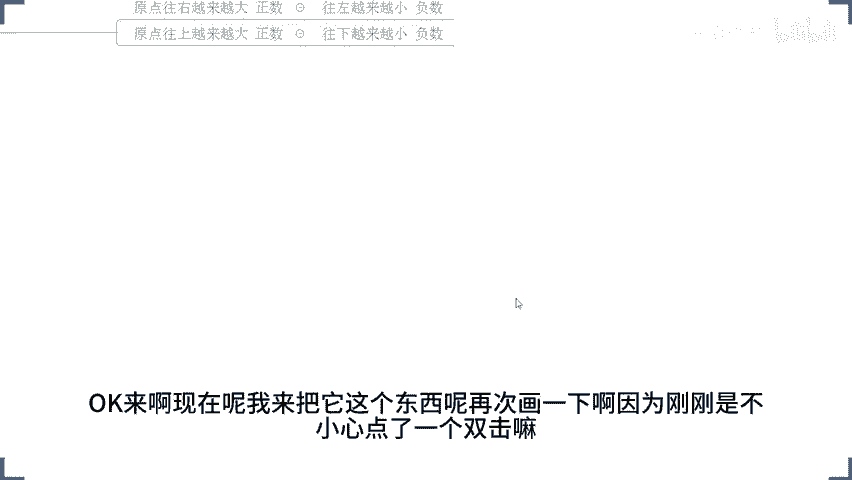
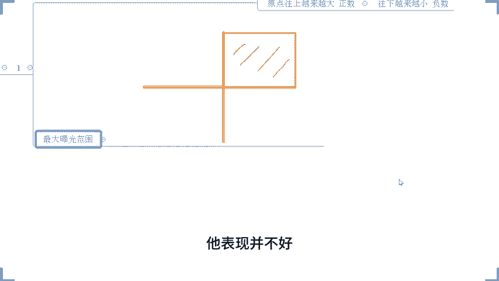
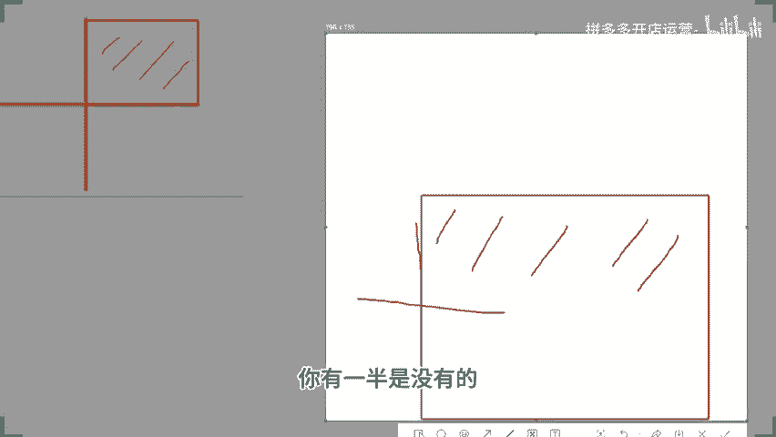
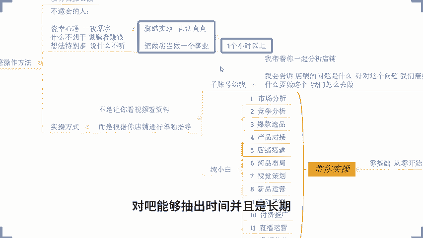

# 拼多多开店运营-新手电商运营实战指南，B站最全拼多多零基础入门教程！拼多多运营秘籍，小白也能成电商大亨！轻松上手拼多多，拼多多新手开店赚钱攻略 - P55：055 拼多多爆款打造秘籍 新品访客飙升玩法 - 拼多多开店运营- - BV1xms8eSEVs

如果说你是没有开店小伙伴，没有关系啊，不用担心。哎，你说我是不是你这样去讲这个店铺后台这些数据，我不会会不会看不懂，我会会听不明白，不用担心的啊。

那么我讲的话一定是会由钱入深的去帮大家分析这个店铺操作的啊然希说我想问一下把店铺做起来需要多少成本这看你能力啊你有能力呢成本会少一点，你没有运营能力的话，你花再多钱可能也是走弯路浪费钱而已。

就这么简单啊这个没有说一定是多少成本的这个说法的对不对？我们这个运营能力强，你的这个经营成本呢就会降低运营能力弱，你的成本就会增加。并且你运营能力弱的情况之下，你可能这个成本增加之后你不一定能做起来。

这也是很多人自己摸索做店铺一直以来浪费钱亏钱的原因这个地方然后这个S说哎开车亏钱开一单亏一单我的这个有没有有没有人需要扫码的。如果有话，我就你们把现上的问题先解决一下？然后这边说是开车开车亏。😊。

钱啊亏钱。还有刚刚说刚刚说这个呃第二阶段烧不动啊，第二阶段啊烧不动。😊，OK很多人都是这样讲的啊，我跟你们说一下啊，这个东西呢其实很现实的一个问题啊。呃，简单的来说一下吧不好，如果说你想要去开车。

你想要去把这个付费推广给他数据拉上来，你想要去把这个店铺做的很好的话，OK记住一句话啊，记住一句话，听清楚了。兄弟们，这个话我说了不止一次很多次了啊，很多次了啊哈，100块卖了4单是吧？😊，啊。

我说了很多次这个事情的，就是你们如果说现在啊现在啊你是一个新店啊，或者是你在做新品啊，现在我不管你们是新店还是新品啊，听清楚了。那么你如果说没有一个啊没有很好的自然曝光。😡，好吧，没有很好的。😊。

产品的这个流量承接能力。不要开车。啊，什么叫很好的流量承能力呢？就是你的点击率，你的转化率没有很好。你的产品的产出不是很高的时候，这个时你不要开车。那么我跟他说一下，我是什么时候开车的，好不好？

包括说我带1操岁小伙伴，你们可以看一下啊，来像这个哥们，你们你们有看到吗？有看到这个店铺没有？有看到没有？有看到公屏扣个一啊，有看到公屏扣个一啊，有看到的话，公屏扣个一，你们不开车。

没有流量是很正常的一个事情，是因为你们不会做这个跟你开不开车没有关系啊，这个你们开不开车没有关系。那么我说一下这个店铺来兄弟们有看到吧？这个店铺纯自然流。😡。

到你们看到的后面一天12000访客的时候还是没有开车的。😡，存置按钮一毛钱车子没开，从零起步的新店。知道吧？重新起的新店，所以说开不开车跟我们店铺有备流量有关系吗？有关系，但是没有必然的关系。😡。

知道吧？绝对低价车有自然牛0。我的天呃，你有这样的想法的话，我只能说你可能对拼多多的理解的话，就过于片面了，可能还根本就没有掌握拼多多，没有理解拼多多。好吧，那么等一会我跟你们讲什么什么原因。

什么情况啊，这个东西不要着急啊，首先第一点啊，我刚刚为什么这样说呢？首先一个事情，各位你们很多人喜欢去开车。😊，对吧哎，我现在我店铺做了，我我没有流量，我就要去开车，我不开车，我就没流量，对吧？

我我不开车，我就没单子。我开了车之后我可能会亏，然后又出现问题，对不对？但是你喜欢开车的时候，你要搞清楚一个事情，各位开车它能够增加我们权重，对吧？我们可能平时这样想的，但是开车这个事情听清楚了。

大家记住开车这个动作。😡，并不能增加权重。这句话大家记一下好吧。那么增加权重的是什么呢？是我们开车的数据增加权重啊，什么意思呢？来给大家讲一下啊，假如说今天这个STO啊，包括说我们的这个万里归期。

包括我美好生活，包括我们的阳光下啊，包括我们的指导黎明，好吧，所有的小伙伴现在认真听了啊，这一个的话是你们很多人容易踩的一个坑，容易走的一个误区。如果说你连这个东西都没搞懂的话，你做店铺一定会亏。

这句话不是危言耸听啊，这个是事实。因为你们目前就是这个情况。你们之所以现在开车开不好亏钱，就是因为你们没有搞懂这个东西什么意思呢？来，现在啊我问一下，假如说现在我们的产品行业点击率啊，假如说5%。

我们不用说太高啊，我们现在不用说太高啊，我们现在不用说太高啊，现在啊我的行业点击率5%，好不好？然后呢我的行业。😡，转化率啊2%啊，这个数据不高吧。我我相信在我们各个品类里面，这个数据绝对不算高的。😡。

没错吧，各位大家同意吗？同意的话，公屏扣个一好吧？同意的话，公屏扣个一啊，这个数据不过分吧。在我们大多数行业里面来说，这个这个数据绝对不高，对不对？OK同意是不是？好，现在假如说我店铺没有访客啊。

我店铺没有访客，我是一个新店。😡，啊，我是一个新店啊，在上新品。😊，我没有流量对吧？哎，我没流量。😡，然后呢，我干嘛呢？我开车了。啊，我开车了啊，我开车之后呢，好，我店铺呢，哎今天我开车开了10万曝光。

好不好？我开了10万曝光好不好？哎，那我的点击率多少呢？哎，不高4。5。😊，4。5%点击率好吧？然后呢，我的转化率多时呢，不高1%啊，1%来。😡，各位，我想问一下啊，这样的数据啊。

这样的数据跟破不破零没关系啊，跟破破破零没关系啊。现在啊我去做了这个事情，我店铺我上了之后，我没有反客嘛，对不对？我去开车了，我开车之后呢，我拿了10万曝光，数据不少吧，对吧？数据不少吧。

10万曝光的4。5%的点击率达到了访客是多少。来，各位有没有谁可以帮我算一下的。嗯，10万曝光啊，1万曝光。😡，啊。百之这个4。5%点击率多少多少的访客啊，OK4500，对不对？好，4500啊。

4500的访客的话，换句话说，我的订单多少单呢？是不是45单，你说有单量吗？有单量吧，对吧？你说有访客吗？有访客吧，哎，那问题来了，这个数据能给我增加群重吗？😊，他可以累计我的销量权重，这个没有毛病啊。

这个没有毛病，对不对？但是在进行排名考核的时候，我们跟同行来对比的时候，那我有权重吗？😡，嗯。😊，我可以累积权重。啊，我可以累计我的销量数据，但是我的权重在同行对比的时候一定是低的。啊，一定是低的。

对不对？权重很低啊，这个是你们自己说的，我没有说啊，对吧？这是你们自己说的，权重很低。那么这个权重很低的时候就意味着什么呢？意味着我产品的推荐曝光会减少或者是没有，没错吧。

那么这个时候呢同样的还有一个问题，因为我的点击反馈，因为我的整个的转化对吧？数据表现啊，数据表现差啊，那么这个时候呢，我整个的商品权重啊，商品权重啊，我的计划权重都会很低啊，都会很低。那么这个时候呢。

我后期的推广成本会越来越高。我的点击单价。😊，啊，点击单价也会越来。越高啊，你说你开车这样开不亏吗？你不亏，谁亏，亏不死你。😡，知道吧？兄弟们这个逻辑先搞清楚啊，所以说我们在上来的时候。

你如果说不确定你是是否能够有到一个很好的流量程能力说，你不要开车。😡，而且还有一个非常重要的点是什么呢？各位来开车开的是什么？😡，嗯，各位来，我问大家一个问题，开车开的是什么？😡，开车开的是什么？来。

各位你们说一下啊，开车开的是什么？😡，就是我的投放目标是谁？😡，我的投话目标是谁？😡，这个这个这个问题，如果说你没有在开过车的，有你没有在做过付费推广的人，应该是有到这样的一个。

这个很好的思维逻辑应该是能够回答我这个问题的。哎，这个上次同复说了，开车开的就是意向客户，对不对？开车开的就是我的目标人群，对吧？开车开的是我的意向。啊，我的意象啊。啊，意向客户啊，我的目标人群对吧？

开车开的就这么个玩意儿啊。那如果说你现在本身没有任何的标签人群，那么你上来开车的时候，首先第一件事情平台会给你推荐曝光，对吧？这个推荐曝光呢是根据我们产品一开始上架之后的各种的基础数据来的。

会给你这个曝光，但是这个曝光可能不多，我给他家画个图啊，来，各位我给他画一个图啊，这个图画完之后呢，你们可能就会更加的清晰一点啊。打个比方啊，现在看清楚啊，看清楚啊，打个比方，现在这一条线呢。

各位这一条线呢是我们产品的曝光线啊，当我产品的某些数据指标超过这条线对不对？我就可以拿到一部分曝光，好吧。那么这前面啊这里我给他写一下啊，这个地方是零啊，这个是零这一条线以下是没有曝光的。

超过这条线往上呢，就是有曝光的，可能有有一部分，但是可能不多啊。😊。

那么商品在上架之后呢，它的整体数据怎么样子呢？来看一下啊，假如说我产品上架之后，对不对？可能他在有些数据的时候呢会高一点，有些数据可能会差一点，对吧？类类类似跟同行对比来说，它的曝光数据。

它的排名数据可能会多一点少一点啊那么比如说它可能在价格方面有优势，或者在这个标的方面写的很好，在属性方面是爆款属性啊，那么它就会有一部分的数据呢是超出来的啊。

是这样子超出来的但是如果说我现在去做了付费推广的话，就不一样了。我做付费推广的话，是把整个的商品的曝光整体向上的拉高啊，是这么一个事情啊，拉高的状态什么样子呢？就是这个地方看上去啊，看清楚啊，看清楚啊。

把它整体往上抬对吧？可能我出价越高，我的头腾越低排的越高，各位能够理解这个意思吗？能够理解公平打一啊，来这个图我刚画的这一个图，大家能够理解公平打一啊。😊。

所以这个时候你会发现哎我做了付费推广之后，我的曝光变多了。但是各位注意到一个事情啊，当你的曝光变多的时候呢，原本你产品的曝光有的可能很少，但是把这个曝光这个付费做了之后呢，它就被我们的付费覆盖掉了啊。

原本的自然曝光。😡，被覆覆盖掉了啊，那么它被覆盖掉之后呢，OK后续我产品的点击，我产品的转化啊，我产品的这个呃订单等等这些东西，对吧？对吧？哎，转化啊，对，会吞我们自然流。这个时候当我们的自然曝光。啊。

没有产出的时候。平台会放大你的自然流量吗？嗯，来各位，你们自己说一下会放大吗？你们自己说一下，觉得会的可以打一，觉得不会的打2好吧，觉得会的打一，觉得不会打2好吧，来。😡，OK所以说道理很简单。

大家都懂，对吧？只要我这样一讲，大家都能够理解，都能够明白。但是为什么你们自己做的时候会却非要去自己给自己挖坑呢？这个我就很很难理解的一个事情，对吧？而且还有一个事情，各位你们想一下啊，你们想一下。😡。

就像我们平时呃，这个。这个这个怎么说呢？呃，打电话充话费一样的，对不对？你们是不是也会经常有人有这个电话打过来跟你讲，哎，你现在这个套餐呢还可以可以有这个什么什么一个增值服务，对吧？哎。

你只要保证一年是这个套餐，那么后面的话其实我会给到你一个额外的一个流量包之类的东西，有没有？有吧？其实一个逻辑的啊，因为你平时可能用到的这个花费比较多，或者是偶尔会用到一个比较多的一个花费。

或者是在呃这个流量上面用的比较多一点，那么平台就会跟你讲，哎，让你去花更多的钱，对吧？那么你在我们拼多多也是一样的。你在拼多多呢，你进行一个用户的运营，对吧？你进行一个流量的运营。

那么当你的流量都是通过付费渠道来的时候，😊，那平台也会认为啊，哎这个店铺这个老板啊，这个老板他就是花钱买流的，花钱买流量的啊，就是花钱买流量的买买流量的。啊，我要让他多花点钱啊。😡，对吧我要多花钱。

然后我可以多赚一点嘛，对不对？那所以这个时候呢，你在这种情况之下的话，他本身就不会给你去放自然流量的。😡，各位，这个事情就很恐怖了啊，这个事情就很恐怖了啊。而且目前来讲的话。

这样的一个模式在我们各个平台都是一样的。😡，啊，这个我们各个平台都是一样的，像你去做这个抖音，对吧？你去做了头流，头牛之后，你发现你的自然流量就没有了，会少很多，对吧？你做这个淘宝一样的对。

就干成强付费啊，就这个意思啊。所以说你们不要上来就去做付费，这个没有意义啊。那我们要怎么做呢？来看清楚了，上来之后呢，我们首先要搞清楚一个事情，就是什么呢？我要去做好我产品的推荐曝光。😡，各位。

这个才是一个非常重要一点啊。那么这里呢我我先问一下啊，有多少人对于我们产品啊新品考核的一个呃新品考核权重啊，这个东西大家不清楚的，有多少人啊，有多少人不清楚啊，想知道的不清楚的，想知道的。

公屏上可以打一个一，好吧，我看一下，如果比较多，那我把这个东西讲一讲，因为这个东西比较基础一点啊。但是我看你们今天这这个这个这个情况呢，应该很多人也是比较基础的一个状态。OK啊O okK啊。

很多人是对这个东西不了解，对吧？啊，OK那么剩下的另外一部分，如果说你是对这个东西知道的。OK那么也可以听一听啊，就当做一个复习啊。那如果说你对这个东西呢不是很了解的。那么今天可以认真听一下。

那它对于我们店铺的运营来讲的话，是非常非常重要的一个点，好吧呃，这个地方呢呃这个部分呢，我也不去不去给你们打字干什么拼多多就这样只要付费。对对对对对对，就这个意思。这个不光是拼多多啊。

其他平台也都一样的啊，其他平台都一样的啊。😊，所以说这个东西呢你也不能只说是拼多多，就是所有的平台嘛，它核心本质就是让你花钱，让你让你花那么多钱，他赚更多钱嘛，对不对？那么来啊。

所以这个地方大家注意一下啊，这一趴的话，我不会去给你们打太多的字啊，我会尽可能的通过这个图文的形式来给大家讲的更加清楚一点好吧？OK这个不然说第二阶段断流怎么办？OK啊呃，不安，你稍等一下吧，好吧。

你稍等一下吧啊，这个问题不着急啊，因为这个问题跟我们当前内容不相关啊，我们今天主要讲的是自然流好不好？没问题吧。推广带动自然流，它是有前提的。😡，推广可不可以带投资人聊当然可以，但是它是有前提的。

什么前提啊？来来我顺便这个地方也跟大家说一下吧啊。既然说大家问到了呃，包括刚刚第二阶段的这个问题，有多少人想知道的，我我先确认一下吧，好不好？我先确认一下。如果大家都对这个付费推广这么感兴趣。

大家先可以现在公屏打个6啊，你们刚刚提到这几个问题的，我先给他讲一下，免得你们这个这个到时候心里面痒痒的，对不对？😡，然后又不认真听啊。好，OKOK啊这么多人啊。😊，ok ok okO啊，行行行行行啊。

那行啊，那现在大家注意听了啊，注意听了啊，注意听了啊，两个问题。😊，第二阶段断牛。啊，第二阶是断流，然后呢推广带动战流。啊，推广单中自留啊，这两个问题我先跟他讲一下，好吧。😊。

第二阶段断流的原因是什么呢？其实道理很简单。我们产品前期的时候，如果说你本身是一个没有太多数据的新品，那么这种情况你去做第二阶段大概率就会断流，这是一个必然的现象。为什么这样说呢？

首先我们要了解清楚我们推广的一个规律啊，推广的一个什么规则吧，只能这样说，推广的规则不能说规律了啊，推广的规则。那么推广的规则第一阶段是干嘛的，是蓄水，对吧？第一阶段。是蓄水。啊，蓄水。啊，是蓄水。

让你去嘛圈定人群。啊，让你去圈定人群，对吧？但是你要知道一个事情，第一阶段的推广了平台为了让你快速的去达成这个目标，达成圈定人群这个目标，它是会有加持的啊，它是会有加持的啊，这个是规则来的啊。

是会有加持的啊，或者是是会有这个扶持的啊，扶持可能你们你们更能理解一点啊，是有扶持的啊，这是扶持的，相当于什么呢？按照正常情况来说，本来你当前这个付费推广的一个成本对吧？你只能拿到100个曝光。

但是平台为了让你快速的把第一阶段跑完，他可能会给你一00曝光啊，当然了这个具体的一个数据呢，跟我们的品类是有关系的啊，我只是打个比方，大家不用去深究这个数据的比例问题啊，大概大家这个大家不用深究。

总而言之，你要知道一个事情，按照正常情况来说，那么他这个扶持比例是你的几倍，甚至是十几倍。😡，所以说在这个时候，如果说你进入第二阶段。😡，啊，你进入第二阶段，那你的费用。😡，没有变的情况之下啊。

那么本身他就会有一个缩减的。啊，这个是必然的。这个东西跟你是新品是老款没有关系啊，这个点大家要搞清楚啊，这个是我们这个推广的一个算法问题。那么你们如果说是有做店铺，有去做付务推广的人。

应该都会发现这个问题。😡，或多或少，你再进入第二阶段都会掉，只是掉的多掉的少的问题，只是推动推不动的问题。你们刚刚讲第二阶段断流的这个情况呢，就是第二阶段你完全没有流量，对不对？那么这种情况呢。

大概率是第一种情况，就是你是新品。那么这个时候首先第一件事情，在趋准确的时候，他进行推广的时候呢，它也会根据我们商品的。😡，标签人群来进行推荐啊，对吧？来进行推荐啊，人群啊这里打错字啊人群啊。啊。

进行推荐啊进行推荐。但是呢这里有一个问题，因为我们本身是新品。那么这个时候呢，我本身人群的数据就很少，对吧？按照正常来讲可能说我的产品呢适用于男性啊，适用于这个20岁到40岁的人对吧？

适用于这个呃消费能力相对来说比较高的人啊，那么他可能有一个呃一个亿的人在里面，但是因为我的商品权重低，那我的标签会弱。这一个亿里面本来我可能就只能占50万的一个曝光人群。但是因为我是第一阶段。

我是这个呃产品的权重比较弱，可能这个50万呢又会更少推广的覆盖范围又会更少。那么进入第二阶段之后呢，他又会再次缩减。各位这个能够理解能够明白的话，公民可以打个一。所以这个时候呢人群缩减之后。

我的曝光会再次减少。😡，啊，会再次减少。好吧，那么这个时候呢，很多人就会说哎，那这个东西如果说这样的话，我应该怎么做？有有噪音吗？😡，有噪音吗？嗯，各位，你们听到有噪音吗？是是什么声音啊？没有吗？😡。

没有是吧，OK那那可能是这个万万里归途啊，可能是你万里归期啊，可能是你自己这个设备问题啊，可能是你这个设备问题。你是不是有有马上有电话要过来了，然后你的这个音响之类的会跟着一起有这个呃。😡。

有这一个这个这个杂音进来啊啊，是不是有这个电话声的进来了，有电波的干扰啊。😊，对吧OK这个时候啊，我们第一阶段推广的时候会这样子，对，有电流录音是吧，那应该就是这个有有这种干扰的这种情况的啊啊。

还是说是说我自己这边的声音啊，我的麦有有电流声吗？是这样的吗？啊，有可能是我这个离太近了。啊啊那么大多数人正常的话，应该不是我这自己设备设备问题啊。OK啊呃，那么来啊，各位注意了啊注意了啊。

现在问题来了啊，那这个情况既然说是。😡，平台的问题，既然说是这个算法问题，那我们应该怎么做，对吧？作为消费者，作为作为这个商家啊，作为商家，我的推广我应该怎么去做？注意啊。那么首先第一件事情听清楚了。

你在前期的时候要累积足够的标签人群，否则不要开车。当然呢你们大多数人呢是没有做到这个点的，所以你们已经开车了，你们已经踩坑了，对吧？导致你店铺没有曝光了，那么这个问题怎么解决呢？来，各位。😡。

第一个操作啊。😡，这个操作很多啊，那么最最常见的操作啊，也是我们讲的第一个操作啊，也是我们讲的第一个操作啊，这最最常见的操作。你们很多人可能会说，哎，那我第一阶段做完第二阶段断流了之后，我推不出去。

那我去把这个出价调高吧。😊，对吧这是最常见的操作，对吧？我去把我的头闪调低，我把我去把我出来调高，这个是最最常见的操作。但是各位注意了啊，这个是我们能够想到的第一个操作，但是它是最差的操作。😡，啊。

但是他是最差的操作，不到万不得已，不要去调价。各位能记住吗？不到万不得已，不要调价。因为一旦调价之后，你想一想后期的话，你的花费只会越来越贵。😡，它不可能有有太大的一个幅度降下来的啊，这是这是必然的啊。

这是必然的那么那如果说我们不去做这个操作，不去做这个动作，有哪些方式可以帮助我们去完成我们产品的曝光获取呢？来。😡，坑产好吧，坑产啊，上来之后呢，如果说我现在产品的流量没有了啊，我做推广推不动了啊。

连续三天啊，连续三天去做坑产，把大单做进来，把我们的UV价值拉高啊，哪怕你的点击率转化率不是很好，你把坑产拉高。那么这样呢一样可以增加我们的商品权重。那么它是可以得到更多的推荐曝光的。啊。

那么这个推荐报告呢，在我们付费的加持之下，它的数据会被放大。是这样子的啊，各位这是第一个操作啊。那么正常来讲还有第一个操作什么呢？OK刚刚这个STO说了，哎，我们去做销量，做出评，那么这个没问题，对吧？

这个没问题，哎，我们连续去维护好我们产品的转化啊，也是可以的，连续去维护好我们转化。那么操作呢也是三天啊，也是3天，好吧，并且呢去把评价做出来。😊，这个是没问题的。啊，这是没问题的那除了这个操作呢，哎。

那这些东西都是需要我去做单子的那风险也高啊，对吧？万一我被查了怎么办，对不对？所以这种东西呢我们可能也是说很多人不愿意这样去做，或者是不敢这样去做，对吧？那怎么办呢？来看一下另外的操作报名活动。😡，啊。

报名活动啊报名活动的时候呢，它其实有一个操作，什么呢？深度浏览有用没用啊，在这个阶段深度浏览没有用啊。那么在这个阶段我们是要去干嘛呢？我们是要去把我们的这个呃推荐群众拉起来。

你只是一个深度浏览是做不上去的啊，那么你要去当然深度浏览可以强化我们的标签，这是没毛病的。但是这个阶段啊，这个阶段是是做不动的啊，活动会打骨折，那么只能说这样讲吧，你的原价上活动方式，你不会操作而已啊。

好吧？报名活动报名活动的目的什么呢？得到活动推荐。😊，啊，然后呢，同时得到一个降价加权。啊，得到一个降价加权啊，得到降价加权好不好？只能这样子说，那么这样的话，我们整个商品呢也能得到更多的推荐曝光。

而这个推荐曝光在付费的加持之下呢，又可以得到一个放大好吧，所以这几个操作，你们都可以去试着尝试来放大我们的曝光啊。如果说这些你都做了，还是没有的话，OK那么你去看一看你是不是有差评。😊。

如果是好把你的好评率拉上去，把你的跌杀评分拉上去，好吧，这个是我们需要去做的一个事情啊，如这个结论说刚来能不能看到前面的思维导图，这个前面没没什么东西的，没太多东西啊，可以看一下。

其实呃就一些基础东西在这边啊，没什么太多东西啊，好吧，不重要啊，这个东西不重要，这个只是你们刚刚在开播之前，他们提到的一些问题，我们在解答而已啊，这个东西不重要啊，不重要好吧。

来各位第二阶段断流知道怎么操作了吗？知道的话，公屏上打个6可以吧？来第二阶段怎么操作啊，如果说没有曝括怎么操作，知道的话，公屏打个6。OK那么我们再来说一说推广带动自然流这个问题。

很多人选择去做富位推广，就是想着说，哎，我现在店铺没有曝光，没有数据，我去做推广，让通过推广呢来带动我的自然流，对吧？OK啊，我说一下啊，那么推广能带动自然流吗？能证明我把答案告诉大家。啊。

这里我告诉大家，一会儿讲多多进宝，多多进宝没什么好讲的，不用讲那个东西不用讲，你们不要做就好了啊。你们不用去想着靠劲宝把你们店铺拉起来。当然你自己如果说有达人渠道去帮你冲量，可以冲量，可以帮你跑出去。

这个没问题。但是你不要指望说达人帮你把这个店铺做起来，好不？而且劲宝的话是很坑的一个事情啊。这里面有多坑，我就先不说了，你们自己知道就可以了啊。那先把这个东西搞清楚啊，推广的带动战略的操作的话。

这里我说一下。😡，他是有到一个非常非常苛刻的条件的，就是你的数据啊一定是能够超过我们行业的1。5倍。啊啊1。5倍。什么意思呢？来还是回到我们上面数据举例子啊，来，假如说我行业的点击率是5%。

行业的转化率是2%。那么如果你的推广数据啊，能够把你的点击率做到多少呢？7。5%转化率做到3%，那么它才会有到加权的一个条件，这是最起码的一个基础，那在这个基础之上呢，你还要达到一定的数据量。好吧。

你除了率要达到之外，还有量要达到。😡，律啊和。量啊他两个都要考核。啊，他两个都要考核产品热度搜索权重访客数呃，这个是讲的啥SPO你说的是啥？你说的是这个加权条件吗？😡，啊，这个这个这个看你怎么理解吧。

这个看你怎么理解吧。反正这里我只能跟他这样讲啊，你如果想要通过推广带动权重的话，在你的推广数据里面，这两个两个东西一定要达到啊一定要达到啊率的话啊超过1。5倍量的话，这里我说一下每天啊每天听清楚了。

最少最少点击量要超过200啊，但是这两00这个数据并不多，对吧？这个数据并不多，但是这是一个基础。如果说你哎我店铺推广还可以啊，我店铺的点击率做了10，转换率做了5%，但是你一天点击就只有几个啊，对吧？

能行吗？不行，不行，啊，不行，啊，那么首先还是得有自然流等下这个这个先不着急啊，我还没说完啊，自不自然流这个东西这是后话啊，重点是什么呢？重点是你要给到你自然流曝光的机会。😡，啊。

你要给到你的这留曝光机会啊，如果说你的投放是全天覆盖的，那么你能拿到曝光机会吗？😡，拿不到对吧？拿不到啊，拿不到。所以说在我们早期的时候专门去做这种啊这个付费流撬动自然流的时候呢。

我们都会在凌晨时候或者是早上单独抽出那么一两个小时快速的把数据跑出去，跑出去之后呢，剩下流速空档时间。那么这个空档时间来让我们自然流进店。那这个进电呢，其实一方面是平台的推荐权重啊，另外一方面呢。

其实是我们产品做付费推广的时候，付费曝光所圈定的人群的二次进电。好吧，是这样子的。所以真正意义上你说通过付费去带动这张流这个东西。对于我们在座的各位老板来说，应该是天方夜谭。我相信是这样子的。

因为这些数据啊确实你们很难达到，好吧，是这样子的。所以你们不用去想那么多，老老实实的先去把自然流的逻辑搞清楚，把自然流做会。这个才是王道。当然如果说你钱多，对吧？你这个随意啊，无所谓。

你想怎么烧怎么烧啊，就当我没说好了是吧？OK啊，那么接着往下来了啊，然后我们来讲一讲这个呃新品的自然权重曝光的一个考范围啊，这个东西刚刚也提到过，对吧？只不过呢。

因为大家刚刚是对这个付费的问题还比较纠结嘛。所以我们回归回过头去讲一下啊。那么现在各位老板啊，来有在认真听的公屏上快速的扣个一，我们来说一说这个呃自然局的操作方法啊，来动的快啊。😊。

OK啊还不错还不错还不错啊，感受到各位的热情了啊。好吧，那么我们在做我们自然权重的时候呢，我们就必须要完成我们新品的权重考核。😊，啊，或者我要完成我们商品的考核啊，商品这里我我还打反了，字打反了商品啊。

商品权重考核不是不是考核权重啊，权重考核。啊。考了什么东西呢？来。这个地方呢我画图给他快速的过一遍啊。

各位可以看到啊可以看到啊这边这一个呃，这里呢我先给他画一个这个十字架啊，先给他画一个十字架啊。各位呃，应该是能够看清楚吧，对吧？这个应该是能够看清楚啊。诶，完蛋。OK啊来。😊，这个里呢有一个十字架啊。

这里有一个十字架。那么这个地方啊这个地方中心的原点呢啊，这个你中心的原点啊，我再画一下啊，画一个红色吧，好吧，画一个小红点啊，画一个小红点啊，我放进来啊。这个红色的圆点呢是零啊，是数据零啊。

我这里打一下字吧，0啊是0。那么这个箭头往上是啊越来越大啊，往左啊往右啊往右也是越来越大啊，好吧，往右越来越大啊。

啊，网又越来越大啊，然后往上哎，滚蛋。😊，不小心点了一个双击啊，然后这就没有了啊，没关系啊，这里我就在这边跟他写吧。好吧，这里我跟我这我这里给他写啊啊呃原点啊原点。😡，往右。啊，越来越大。啊，原点往左。

越来越小。啊，换句话说呢，往右是正数啊往右是正数啊往右是正数，好吧，往左呢是负数。好吧，是负数，好吧，各位。然后呢，这个圆点呢往上也是越来越大，是正数，往下呢也是越来越小，是负数。好吧。

这里呢我复制一下啊，再粘贴一下，往上啊往上。各位这个能看懂吧，这个能看懂吧。现现在这个这个这个图像能看懂吧，目前到这里为止能看懂吧？😡，能看懂的话，公屏声打一个能字，好不好？对。

坐标轴啊坐标轴啊OK来啊，现在呢我来把它这个东西呢再次画一下啊，因为刚刚是不要你点了一个双击嘛，所以说这个地方没有给它画完啊。那么但是呢先把它把这个东西讲清楚啊，那么现在我们继续啊。😊。

好，OK。好，那么在这个时候呢，我们在进行产品上架的时候呢，正常来说我产品上架之后呢，它的。产品的展示的位置呢是在这个原点。啊，是在这个原点啊。这里我画一下啊，正常来说我一开始上架的时候呢。

我产品的曝光它的展示位置呢是以零来开始的对吧？我不可能说扣我的数据吧，对吧？我不可能说我的曝光是负数吧，对吧？这个不太可能啊，正常逻辑来讲，我的曝光呢是0。那么在这个基础之上，现在呢OK。

我们产品呢就会获取到各种的考核，对吧？OK假如说我产品在进行这个上架之后呢，完成了考核，或者是平台对我的商品进行考核。比如说那么我的商品它能够有到一个好的标题啊，它从原点这个地方就会往右移动，对吧？

它就会往右移动，它的宽度会变宽。各位。啊，哎，等一下啊，这里啊它可以从这里啊往这边移动啊，宽度会变宽，哎，标题还不错啊，宽度变宽，图片还不错，标题变宽，属性也可以，标题变宽，哎，价格优势也很好。

标题再次呃这个这个宽度再次变宽啊。那么如果说我的各项数据都是特别优秀的，它顶破天，也就是把这条线占满，把我们的宽度占满啊。各位。😊，这是一个啊这是一个OK那么这个时候呢，但是这个轴它宽度再宽。

它的数据也都是0。为什么呢？因为我们还没有高度啊，它只是覆盖的范围变大了而已啊。那当我们有了一定的曝光之后，我有了所谓的点击啊，我点击率很好，它的高度会变高，对吧？它有很好的收藏高度会再次变高。

它有很好的这个浏览的一个数据啊，人群权重会非常稳定啊，高度会再次变高，推荐权重会很好。后面呢它有可能会得到一个很好的点击转化对吧？啊，成交额也很不错啊，因于价值也很好啊，同比增长率也很好。

然然后一步一步的它会变高，那么最高呢也就是把我们这一趴啊，这一部分范围全部给它占满。这就是我们产品能拿到的最大的曝光范围。各位来这一步到目前为止能够看懂的话。😊。

公屏上再打一个一，好吧。最大曝光范围。啊，那我们做付费推广的话，其实也是同样道理的，它也是最多也就占这一块的范围啊，也是最多占这一块的范围啊。那么如果说我们在推广的时候。

或者是我们在进行产品的正常运营的时候，这里注意了，我的产品存在问题，什么问题呢？我的商品这个标题呀属性呢，我的图片呢，我的价格呀等等，它表现并不好，它并没有很好很优质的话。

OK那么这个时候我们刚刚讲到的啊，这一个框子啊，这里我就不去画那个十字架了，这个是我们原本最大的曝光范围啊，这里呢我随便画一下啊，这是那个轴啊，这是那个轴啊，好吧，这是那个轴。

这是我们原本最大的曝光范围啊。那因为我产品的标题属性价格等等，可能它不是很好的话，那么它的一个宽度实际上会变窄的。它的覆盖范围会变窄啊。那同时呢我的。

产出没有同行高，数据没有很优秀，它的高度也会变小，对吧？😡，是这样一个逻辑的那在这个过程中，如果我们能够拿到很好的数据，对吧？很好的这个产品的这个商品质量，商品的数据来说的话。

OK那么平台也会考核到别的东西，什么东西呢？我们产品的呃店铺的一个数据啊，包括说我们产品的店铺有没有违规，我们店铺的这一些呃服务指标有没有达标，它会考核好吧，商品权重相同的时候啊。

注意商品相中权重相同的时候，就会考核我们店铺板块，那么如果说你店铺的三分钟人工回分率不达标，对吧？哎，它就会往下啊，它就会往下或者是往往左往下啊来调低我们的展示位置，我们的起点会降低。😊，啊。

比如说哎我们的3分钟人工率达标，那么你的高度原点啊从这个点会往下挪，你会被降权，这就是所谓的降权啊，这就所谓降权。然后呢，你的这个呃物流服务也不达标，那么你会再次降权。那么你店铺呢还有很多的退款。

很多投诉好，再次降权。包括你店铺呢可能还有违规啊，再往下降。那么这个时候呢，你的有效曝光就只是这一块。😊，相当于呢你有一半是没有的，你只有一半的数据了。😡。

各位来这里能够明白，能够理解公屏上再一次打个6，对吗？所有人动起来啊。那么你们可能以前都听说过权重啊、曝光啊，这乱七八糟的东西，对吧？他会考核呀，但是可能很少有人去给你们这样去解释它，对吧？

很少有人给你们掰开的时候跟你们讲它怎么考核怎么计算的。但今天我相信你们是能够很好理解的。所以说在这个情况之下呢，我们要去做我们产品权重搞清楚一个事情，对不对？那我要保证我的商品权重能够去很好很优秀。

同时呢我要保证我店铺数据没问题，我店铺要没有违规。但是在这些数据都能够达标的情况之下呢，那么我们如果说去做我的产品是新品的话，那么考核的时候重点就是要考核到，要去把我们的什么，把我们的曝光范围变大。

同时把我们的高度拉高。啊，讲的很细是吧？OK啊，很细的话，你们就要认真听啊，能够听懂，能够记住，这个很关键啊，好不好？来宽度。😊，怎么。怎么怎么变大啊怎么变大。高度。怎么变的？来。

这个时候是不是问题出来了？😡，那我们如果说能够去把我的宽度变大，能够去把我的高度变大，是不是就等于我店铺这个产品呢？它能够去有机会做成爆款，而且机会比你的同行要大很多。各位，这个逻辑没错吧。

如果大家觉得没错，有兴趣想要认真往下听的话，现在呢公屏上小一走一波，好不好？我就把这一个店铺它怎么做的，给大家详细的讲一讲。😡，啊，我就把这个店铺怎么做的，给他详细讲一讲。😊，啊。

这个店铺一个纯新店来的，看到没有？一个纯新店来的啊，从最早的零访客，看到没有？最早的零访客一步一步操作，到后面一天访客做到多少15000一天的订单是2900多单，18。76的转化率，好吧？他怎么玩的。

我给你们讲一下，然后你们就能清楚知道为什么这样做，我们要怎么去玩怎么去做啊，想是吧？好，O啊，既然说你们想的话，那么来现在认真听了，好不好？那宽度的变大，我们讲呢他考核的是我们的商品啊。

从第一天操作开讲一讲是吧？啊，不着急不着急，从哪天开始操作这个东西是小问题啊，关键的点在于说我们要了解清楚考核的逻辑是什么，这个很关键，啊，把这个东西搞清楚，这个才是你们真正要去做的事情。

当我知道考核的东西是什么，然后我们做店呢才会有到。更好的思路去布局。哎，我第一天要做什么，第二天不做什么，知道吧？这个才是关键啊。OK那么商品的宽度呢是我们商品的质量啊考核的啊，商品质量是什么呢？

是我们产品的，刚刚我提到过了，对不对？我的标题啊，我产品的图片，我产品的这个价格。😊，啊，价格我的属性啊等等啊，这些乱七八糟东西啊。换一句话说，就是我商品在上传的时候就一开始具备的东西。

那么这里呢就要求我们一开始在产品发布之前有到一个很好的选品思维，找到的产品上传的产品呢，你首先得是符合市场需求的潜力商品，这个是必须的。

如果说你做的这个产品就是没有市场的排名第一的头破商家一天就卖个三股单，你说你去做它有什么意义吗？你做不起来，各位这个逻辑能理解的话，公民大一好吧，这个逻辑能够理解公民大一啊。😡，来这么快啊。

那么有了这样的一个东西之后，后面呢我再去做的时候，我的标题，我的图片做好原创，对吧？能够去拿到更好的推荐权重啊，这个东西要做到原创啊，原创。啊，做了原创，能够拿到更好的推荐权众。啊。

能够得到什么新品推荐啊，这个是很关键的一个东西啊。然后同时呢我的价格一定是要符合市场的热销价格段。😊，那如果你的产品真的很贵，那么你要想办法去替代替换啊，不要去硬钢，真的很贵，没有任何价格优势。

产品的话，你做起来很累，不是说不能做啊，会很累。尤其是你们不懂的情况下去做的话，就更麻烦啊。如果说你有方法有技巧，可能操作起来呢，还会容易一点。但是如果说你完全没有方法，不懂操作的话，特别麻烦啊。

很难做起来，好吧？然后再一个就是我们属性呢，这个属性呢就没有什么特别好讲的了。把我如实去发布就可以了，对不对？他能够帮我们完成我们的匹配啊，人群匹配跟这个需求匹配。😡，啊，人比区啊。那么再往后呢。

OK那我们把我们的宽度在选品的时候，在我们上升商品的时候把它做大了啊，能够去做到最大的状态。那么剩下呢就是我们的高度问题，高度是什么？嗯，高度是什么？来，各位我现在在跟他家考考大家啊，高度是什么？嗯。

有个人还记得的高度是什么？高度是什么？有没有人记得，如果不记得公屏上打问号啊，如果记得的话，把答案发出来。😡，高度是曝光高高度是曝也可以这样理解吧，也可以这样理解。

但是这个东西呢呃跟我刚刚给大家讲到过的部分呢，内容呢还是有点差异的啊，稍微有点区别啊。你可以理解为是曝光啊，这个都无所谓啊，这个都无所谓。哎，战斗说哎，点击率浏览量收藏量转化率对吧？

成交啊等等这些各种各样的数据，是这些是我们的商品数据。😊，啊，是我们商品数据。商品数据里面呢，我们平台是会有到一个考核内容的啊，就包括了我们的销量啊，考核的这个呃收藏考核的我们的转化率啊。

包括说我们的上架时间。啊，这是我们商品数据，对不对？但是呢在考核这些数据的同时，其实在这里面呢还忽略掉了一个东西，它是故意漏掉的。这里我来讲一下啊，什么东西呢？就是我们产品的人气啊，产品的人气啊。

那么这个人气呢是我们的呃点击率啊，人气啊，人气是我们产品的点击率啊，点击率啊，还有我们的点击量。啊，还有我们产品的什么呢？搜索热度啊热度。是这些东西啊，而销量里面呢又有更多东西了啊。

销量里面包括了我们真正的这一个单量啊，单量啊，还包括了什么呢？我们的成交额，还包括了我们的客单价，还包括了我们的UV价值，还包括了我们的同比增长率。好吧好，然后再就是我们转化率啊。

这其都是销量板块考核的啊，各位。来，目前商品数据考核板块里面都清楚有哪些东西的话，公屏上打个一好吧。来，目前这些板块考核内容有哪些东西，大家清楚的话，公屏打个一。好，清楚了，是不是？那么来啊。

那现在的话都清楚之后呢，我们就来讲一讲具体的操作啊，具体操作啊。我也我一开始有说过了啊，西楼讲这个呃一些干货分享的话，我不会去给你们讲什么课件，给你们去呃这个卖什么瓜是吧，装什么这个是吧？大家都懂得啊。

我也讲的更加的详细，分享的更加的具体。但是呢希望大家能够认真听啊，听完之后确实是自己没做到位的地方呢，一定记得去实操，好吧。那么这个部分呢，我说一下啊。😊，只讲一遍，我不会去给你们写太多的笔记。

给你们讲太多的这个所谓的理论了啊。这一趴的话就是实打实的去操作了啊，好吧，实打实的去操作了啊。那么现在呢我们就来说一说我产品前期操作的时候，如何去放大数据。啊，我作为一个店铺开店了，我要去上架产品。

我要去操作我的产品，对吧？那怎么去做？那么听清楚了，整个操作的话啊，前面几天时间几天呢，4天是核心啊，前面4天是核心。那么这个核心操作的话是我们做新品，目前来讲必备的。

尤其是现在这个阶段平台的算法马上要改版会强化我们的标签权重啊，强化标签权重啊，这个板块会强化掉，而强化之后呢，它是以我们商品的数据反馈。啊，它不再是原本的推荐权重为主导，而是以数据反馈为主导啊。

这个板块大家注意注意看啊。所以这个时候呢我们在操作的时候呢，你如果说没有把这个数据板块做到位，你后面操作的很难，怎么去做呢？来看清楚了，三天时间是我们的呃正式操作。然后呢，还有到一天时间呢。

是准备时间啊。这个在前面啊一天。准备。时间啊好。三天啊三天正式收入，一天准备时间。那么准备时间干嘛呢？准备时间一个事情找到10个人。啊，找到10个人，这10个人呢是可以是你的这个朋友，也可以是你的亲戚。

但是最好呢是符合我们产品标签人群的。我们的成交人群的啊，我们的目标成交人群是男性，你就找男性，是女性，你就找女性。这个最好的啊，大概是什么样一个年龄段的，你最好去找符合的。然后呢，再去让这些人呢。

后面我们会去做标签啊，做需求标签。好，这个大家记住啊，这10个人呢，我们就现在呢先来简单的呃打个比方啊，他可能是这个呃这个熊大熊二对吧？光头强啊等等这些人啊，反正我们就不管他了，名字我们随便随便想啊。

可能也是你的前女友前男友之类的，对不对？无所谓，名字呢，你们可以随便去写。但是我们先来做一个编号，比如说010203啊，一直到这个一0好吧啊，这一个点的话，大家注意一下啊，好吧，来啊。

比如说这个01呢就是熊大，对吧？😊，熊大啊这个呃你认为就是熊二。😊，好吧，熊二啊，然后呢，林三是光头强啊。😊，好吧，以此类推啊以此类推啊以此类推，店铺没有曝光怎么办？那我们今天解决的不就是曝光问题吗？

好不好？一顿好运啊，现在认真听啊，你把这个操作好了，你店铺就有曝光好不好？我们现在讲的内容就是解决没怎么去获取曝光，怎么去获取群众的问题啊。兄弟啊，来各位这个这个问题啊，到目前为止。

第一天这些人的问题能够明白了，公屏打一，这里我就不往下打字了啊啊，这里呢你们知道这个编号是干什么的就行了啊，我就不去往下打名字了啊，好不好啊，可能是你的前男友前面有什么的啊。

你的这个七大姑八大姨什么的啊，都无所谓啊，这一趴你先搞清楚，搞清楚之后，接着再做另外一个事情，去找到5个关键词。😊，啊，找到5个关键词，这5个关键词呢是符合产品的。标题包含的。啊，热手持。好吧。

一开始你在做标题的时候，你就把这5个词做进去了。😡，啊，一开始你在坐标题时，你把它做进去了啊，在在在什么在。😡，突然来了一个债啊。OK啊，来，各位没问题吧。😊，没问题吧。😡，各位，这个没问题吧。😡。

找到5个词有没有问题，没问题，公屏打个一啊，没问题，公屏打个一。😡，动作快啊，思路跟上啊思路跟上啊，动作快啊。OK啊，都没问题，对不对？好，那就继续往下了啊。那么这5个关键词。😊。

这5个关键词对下拉框是可以找到啊可以找到啊。这5个关键词我们找到之后呢，好，我们就把这些词呢也做好一个编号。比如说关键词一啊，然后关键词2。关键词3。关键词是啊，然后关键词5。找到10个人。

怎么保证符合标签呢？我的天，你的产品卖给谁的，你知不知道是男啊？深蓝深蓝海洋，你的产品卖给谁的，你知不知道卖给男人多还是卖给女人多，卖给大概多大年龄的人，你知不知道这个你知道吧？这是前提条件啊。

只要保证这个就没问题啊，这是第一点啊，那么其次实在是找不到这些人也没关系，因为平台考核的标签是动态标签。所以你找到人之后，我们第一天准备工作这个地方，我们还有找到关键词。

找到关键词后还要去做我们后续的标签的一个达标。所以这一个点不用担心啊，认真听就好了，是路是跟上啊，不用着急。那么来这些关键词呢，比如说第一个词呢是这个我我们以这个服装举例子好不好？

比如说第一个词呢是这个呃纯棉。😡，T恤啊，比如说第一个词是纯棉T恤啊，第二个词呢可能是这个圆领T恤啊。😡，啊，一个第二个城是原理T恤啊，我的核心主词呢是T恤这个词啊，那么这里呢我呃我只打个比方啊。

这里我只打个比方，好吧，找到这些词呢，你同样的做好编号，然后干嘛呢？然后这10个人分别去浏览这5个关键词。😡，啊，搜索浏览就可以了，不要点击商品啊，不要点击商品啊，这是第一步啊，这是第一步。各位没问题。

公屏打一。这10个人分别去浏览这5个万件词，不要顶级商品，没问题吧。😡，能理解吧，有没有人不懂的？😡，应该都都没问题啊。那么浏览完成之后呢，这个地方注意啊，注意注意这一个浏览之后，不要去上明。

我们要做一个动作，我们去把产品排名靠前的。😡，记录下来。啊，把产品排名靠前的记录下来，我们去截个屏啊，我把这个每个人搜的关键词呃，我搜完之后呢，我去截个屏，截长频啊，把这些产品记录下来。

然后我再对比一下。😡，对比找出啊。不同的人。搜索不同的词和相同的词。都能展示。啊，都能展示排名靠前的5个产品，好不好？各位这一个。OK吗？OK吗？这一个OK吗？能能能理解吗？有没有人不懂的？😡。

有没有人不懂的，如果都懂得明白，打一啊。如果不明白打问号。😡，没问题，对不对？好，那就行啊。那么这个地方我们把这些产品记录下来之后，干嘛呢？好，注意这5个产品呢，就是我后续的对标的同行。😊，啊。

这5个产品就是我对标的同行。那么为什么收视度是我对标同行呢？首先这些关键词是跟我产品高度符合的关键词。那我用到不同的人去搜索关键词都能看到他们的话，那这些产品一定是在我这些关键词里面权重很高的产品。😡。

所以说我对标他们去做，但凡是我能够去做出跟他一样的产品权重或者是标签权重，我的曝光不会太少。当然这里呢有到一个点，最好呢价格跟我们差不多啊，这是一个点啊，好不好？

那么这里呢这5个产品我们也说是啊商品啊一好吧，我们去把它记录下来商品2商品啊，商品。3、商品4商品。5啊5个记录下来。然后确定好这些东西之后呢，我们在这一天的时候完成一个打标。这也是我们刚刚有人问，哎。

那我怎么去去解决这个标签的问题。来5个人对不对？啊，10个人是不是来这10个人下来，这10个人下来啊，我把这些先删掉啊，10个人下来，这10个人下来之后呢，这些人分别去浏览关键词。😊，啊，一好吧。

这个打个比方啊打个比方，那么我们的一啊和二都去浏览关键词一啊，搜索关键词一，这次啊搜索关键词一，然后呢。分别呢去浏览啊商品一和商品2。啊，商品一和商品2，然后呢，我们的二啊我们的二啊我们的三啊。

我们的三啊和四呢分别去浏览搜索我们的关键词2，浏览我们的商品2。和商品三。啊，以此类推啊，这里我就不去说了，我直接把它复制下来啊，我直接把它复制下来，粘贴好之后大家再看啊，粘贴好之后大家看再看啊。

那么这一趴有没有人不理解的，有没有人看不懂的，我先问一下啊，到这一趴，我们找这10个人分别去搜索浏览这5个词，然后去浏览这些对应的商品，这一趴有没有人看不懂的。😊，嗯，有没有人看不懂？

如果能理解公民打义啊如果能理解公民打义啊，那么整个的样式就这样子的啊，通过这10个人呢分别去浏览关键词一到关键词5，然后去分别浏览商品一到商品5。那么整个这个动作呢，是来让我们这些人打上一个需求标签。

😡，啊，打上一个需求标签能理解对吧？好，OK那么做完这个动作之后呢，接着就到我们正式操作了啊，正式操作的第一天对，打标签啊，第一天啊来看一下啊，正式操作的第一天来看一下啊。首先第一步。😊。

早上的时候啊早上的时候完成这个第一步，早上是干嘛呢？我们让这10个人。头天不是已经打完标签了吗？啊，头天已经打完标签了啊，早上的时候呢，我们让10个人第一步啊，通过对应的关键词来浏览我们的商品。😡。

有人可能就会说，哎，西罗，要是他通过这些词搜不到我的产品怎么办？哎呀，完蛋了，这个是不是没法玩OK不用担心啊，实在是收不到。😡，啊，实在收不到，可以干嘛呢？可以先分享链接。啊，分享链接浏览啊。

再去搜索关键词，或者是添加冷门池啊，去搜索链接多次多几次之后，再通过这些词去浏览啊，一定要完成这一部分的浏览啊，一定要完成这一部分。那么这个时候呢，它的目的呢，其实是很简单，让我们的商品完成打标。啊。

完成达标，同时呢让我们的商品和对应的关键词呢发生关联。啊，或者发生关系吧啊发生关系对吧？那这个时候呢，我们的产品在某种意义上来说呢，和这些爆款商品也是有产生关系的。各位。😡，来。😊，没问题，公民打一啊。

到这一步没问题，公民打一。多多小福来，这一部分能理解吧，对不对？你也是我的老粉丝了啊，算是一个忠实粉丝了啊，对吧？这一部分应该没问题吧。😡，好啊，那完成这个操作的时候呢，好，接着呢再就是我的第二步啊。

这再是我第二步啊。第二步。第二步的时候呢，哎我们让这些人再一次啊让这些人呢再一次通过这些关键词呢？去浏览同行好吧，让这些人呢再一次去浏览同行。浏览同行的时候呢，其中呢安排到两个人啊。

这一天安排两个人做一个操作，什么操作呢？在同行。😊，店铺哎，同行啊打错字啊，在同行店铺下单不付款或者下单再退款。好吧。来。OK吗？这一趴OK吗？比如说第一天我找一和3啊，第一天我找一和3。01和03啊。

这两个人啊，这第一天啊，我找这两个人。然后第二步搞定啊，这就是我们第二步了啊，这是我们第二步，接着再进行第三步。接着再进行第三步。第三步呢还是这些人，还是这些词，还是浏览我们的商品。注意这一次的浏览呢。

反复浏览。然不你了啊，每间隔一个小时一次。啊，每间隔一个小时一次，你可以把这些人呢分成两波啊，你可以把这些人呢分成两波，对吧？这一个小时呢，你找基数单位的人对吧？13579第二个小时呢，你找24680。

也可以完全的覆盖掉这个每间隔一个小时，让我们的操作难度呢也会轻松一点，简单一点，好吧，这样一个逻辑啊，每间隔一个小时反复浏览。那么它的操作方式目的呢就是为了增加产品的搜索热度。😊。

那么刚刚我们提到过的对吧？搜索热度高的话，也会增加我们产品权重，对不对？那同时呢接着在我们的第四步。啊，接着在我们第四步，还是这些人，还是这些词，还是浏览我们的产品，对吧？到了我们的。

下午或者是到我们的晚上对吧？嗯6到10点吧啊，6到10点你自己看时间无所谓啊，时间早晚无所谓，6到10点无所谓。做一个动作，就是这些一和三啊在同行不下下单不付款的人啊，在同行下单不付款的人来到我们店铺。

增交。啊，来到我们店铺成交，注意成交的话，把UV价值。做高啊坐高做了多少呢？20。啊，做到20。各位，这是我们第一天的操作啊，这是我们第一天的操作。那么这一天操作的话，它有很多个好处啊。

第一个完成了我们商品打标。第二个完成了我们产品关键词的收索热度。第三个完成了我店铺的成交，并且完成了成交数据的考核。同时呢让我们的产品在系统考核过程中呢，让平台判定用户更喜欢我们产品。各位。

就像我们上台同事说的一样，那吧？让系统觉得我们产品啊更有竞争力。对这个意思啊，各位来这一趴没问题的话，现在公屏打一。😊，干吗？嗯，大家觉得干吗？是不是很详细啊，基本上的话。

每一个操作系节都给你们讲到位了啊，OK的啊。那么这是我们第一天操作啊，这是我们第一天操作啊，这是我们第一天操作。然后呢，第二天操作第三天操作，这里我也跟他讲一下啊。

来第二天操作呢和第三天操作其实差不多啊差不多，他只不过呢没有第一步这个浏览我们商品上来就直接做一个事情到同行下单去做这个事情。第二天呢是三个人。😊，第二天三个人就是谁呢啊，是谁呢？就是05啊。

07还有09这三个人好吧，这三个人。然后呢，再到这一天的时候呢，还是这样的一个操作啊，做到我们的一个成交啊，做了我们一个成交好吧，同样操作做了我们成交。只不过呢第一原昨天的这一个标签的操作呢没有了。

那么我们去通行下单这个动作呢做成我们的第一步啊，十年老粉是吧？OK的啊。好，十年老粉的话啊，如果说是呃有兴趣好好坐店的话，我觉得完全可以直跟着实操了，对吧？我看看你是不是真粉啊，吧？第二步啊。

然后这个是第二步啊，变成我们这个第第四步要变成我们第三步啊，是这样这样子的啊，是这样子的。然后呃这个是我们的第二天啊，这是我们第二天。😊，哎哎对对，就是就是第二天啊。

这第二天啊第二天啊第二天O然后呃他的操作呢同样的是为了完成我们产品权重考核，而我们商品权重考核的时候呢，产品的曝光和我们关键次权重考核是累计完成三天数据统计的。所以说我们操作三天啊。

所以说我们操了三天啊，O呃有机续跟实操是不是啊，那没关系啊，那没关系，我把第三天的讲完啊，我把第三天讲完，然后我说一下这个要求啊虽然说是老粉啊，虽然说是真粉，但是我也不能说呃放弃我的这个原则啊。

跟我实操呢，我不光是说你愿意花钱就可以的，我也是有条件的啊，没关系啊，没关系，可以把这个第三天听完啊，第三天的操作，我这里说一下啊，第三天啊。😊，第三天啊，那同样的方式对不对？

把我们的第一步去打标动作做掉去，拿掉去啊，完成我们的后续的这个哎。这一天啊，等等等等等，这一个第三天的操作我好像是弄掉了。来回过头来，我再把它给放下来一下啊。这是第三天啊第三天啊OK那么这一天呢。

这里的人呢就变成了02040608啊，然后10啊，这里就是5个人了啊，5个人了啊，O啊，就这样的一个操作吧啊呃整个的玩法的话，其实操作起来呢没有特别的复杂。最大难点呢。

就是说你们可能很多人觉得这个方式呢操作起来特别的费人，对吧？啊，会觉得很麻烦，但这个东西呢其实怕麻烦的话，你就不要坐店对吧？坐店总会有麻烦的而坐店的方式呢有很多。

这个只是我们店铺操作的其中一种方法而已啊，这个不是说我昨天就只有这一个方法。这一点大家注意一下啊，那么店铺操作呢呃有很多很多的方法，有很多很多方法。那么包括说有很多方法呢，你们也很多人去试去做。

但是呢有句话说的好，对不对？店铺的操作呢，你一定要干嘛呢？要结合店铺实际情况啊，因为如果说你。店铺的这个不适合这个玩法的话，你去做。很有可能你做了之后呢就没效果的。😡，啊，然后呢，你会浪费掉你的时间。

啊，然后浪费资金。对不对？浪费机会。啊，这就是一个现实问题。老年机也可以这样做啊也可以这样做，这个是没毛病的啊，这是没毛病的。因为这个是基于我们算法的一个逻辑来的啊，可以去这样做。没关系啊。

拉升曝光是没问题的。那么啊刚刚嫖呢也在说，哎，西老，那么怎么跟着你实操，对吧？我是真粉啊，我是真粉，我想去跟着你跟着你玩啊，那么这里我问一下啊，有多少人目前来讲店铺操作呢是呃没有思路的。😊，没有思路啊。

然后没有一个完整的操作方法的。是属于一个呃，走一步看一步，再浪费钱的来公民扣个一，我看一下好吧。然后这个呃深海说哎深产说能学无无货源的一个做法吗？我说一下，如果说你说的无货源，包括说我们小小伙伴啊。

如果说你们说的无货源是指的无老的铺货这种采集铺货的不要做这种没有意义，早就过时了啊，不要做。那啊目前呢做一件代发这种的精细化的运营呢是O的，没问题的，这种方式一直都O的啊，包括跟我实在的小伙伴。

有很多小伙伴，他们店铺操作呢也都是这种一件代发的像这个店铺来可以看到啊，各位来看到啊，像这个店铺啊，他就是做的一件代发的啊，他就做一代发的好吧？40多客单价，一天呢做了2万多的访客。

一天卖3000多单做代发的啊，做代发的是3。06的转化率啊，好吧，代发的，代发这样可以做起来啊，这个东西不冲突的啊，跟你是不是厂家没有太大关联啊，好不？这个店不冲突。所以说你如果说想要去做店。

你说我没有货源，我做这种一定代发可不可以完全没问题啊。但是如果说你去做采集铺。😊，过的话，这种方式早就过时了，不要去做啊不要去做。那么呃这个小呆说哎，截个图，这个截图就不不用了啊。

你自己刚刚没认真听的话，就不用了。因为我讲到这个是实操部分只讲一遍的啊，那么呃整个的操作的话啊，如果说你们刚刚讲到是这种啊走一步看一步没有思路的这种小伙伴来认真听一下啊，目前呢我是有在带实操的。

还有名额啊，目前是还有名额的啊，还有实操名额。😡，啊，你们有兴趣呢，可以跟着来。那么但是这里我要说清楚，跟着我实操的话要花钱的，而且不是说你愿意花钱就可以的。有一部分人是不适合跟着实操的。

哪一部分人呢来不适合的人啊，我这里说一下啊，不适合的人，就那种啊有侥幸心理的。😡，啊，又侥印心理的啊，然后呢，想着什么一夜暴富的。这种不要来啊这种不要来。😡，对吧做店铺呢就是做生意啊。

我们如果说就想着一夜暴富这种呢，真的你没有一个完整的这个呃运营思维，没有想着脚踏实地去做这个事情的话，不要来啊。然后还有什么呢？还有就是那种呃自己呢什么都不干。😡，啊，或者什么不想干。对不对？

就想着什么行着赚钱的。😡，这种不要来啊这种不要来。因为我也说过，店铺数据呢不是你去看视频，看出来，也不是你听课听出来的，对不对？也更不是说你花了钱。你说哎，希楼，我在这里花了你钱，对不对？

我跟着你实3号，我店铺就能起来。不是的，而是你要去做的，你如果说只是买了一个名额跟着实3的名额，你说你店铺就就能起来吗？扯淡啊，你不去做永远起不来，所以说如果说你是这种情况呢，不要来。

那么还有一种什么情况呢？就是说哎，想法特别多。😡，啊，想法特别多，然后说什么。不听的。啊，说什么不听的这种人不要来，来了也带不动啊，我只能这样子讲，好吧，如果说你不是这种情况的，你是那种对吧？

想要去脚踏实地。😡，啊，认认真真的。啊，认认真真的坐垫的啊，能够去把坐垫当做一份事业的。啊，有这样想法的小伙伴，OK你可以来啊，你可以来好吧。那么呃这种情况的话，但是有一个前定条件。

就是你能够真正真正意义上抽出时间去抽入店铺，对吧？那我们需要保证沟通，你像你周一到周六。😊，嗯。这个白天时间啊，你能够抽出一个小时以上的时间。啊，你能够抽出一个小时以上时间啊。

跟我去沟通店铺问题去落地执行店铺操作。那么这种情况可以来，好不好？来，刚刚这个O的，对吧？是真的想要去做店的，能够去长期坐店，能够去把当中有事业去做的，能够有时间的小伙伴，公屏上可以扣个一啊。

我我确认一下啊，我确认一下呃，一屋子身一屋子或身家都在这里，现在卖不出去，我都想去摆地摊了。😊，啊，这个很正常，因为很多人做店铺呢，你自己没有方法，到时候呢呃所有的这个库存堆到家里面就卖不出去啊。

我们讲很多这种做电商的人呢，最终钱赚没赚到，赚到了可能对吧？赚到了钱在哪里呢，在库存上，根本就没有一毛钱在手里面，对吧？所以这就是运营方法的缺失，导致一个后果啊，O的。那么既然说你们是这种情况的。

像这个深海，包括说像我们的这个呃多多小福啊，包括像我们的嫖啊，包括像阳光下，对不对？是这种情况啊，满足的话，好，那我说一下我的实招方式，好不？我说一下我的实操方式啊。😊，我说一下实操方式啊。

这里我我说一下，大家可以认真听啊，包括像这个小吴啊，本身呢之前也是这个呃有有想去跟着实操的，也都讲过这个事情的。那么现在可以认真再听一下啊，听清楚。那么实操方式呢听清啊，那不是让你去不是让你。😊。

看视频，看资料啊，听清楚，不是让你看视频看清的啊。😡，而是什么呢？而是。😡，根据你店铺啊进行单独指导。什么意思呢？好，那么你现在如果说是已经开店的小伙伴，你把子账号开给我。然后我带着你啊。😡。

一起分析店铺，我们来分析店铺对吧？我会告诉你哎，我会告诉你店铺的问题是什么，对吧？那针对到这样的问题。😡，我们需要做什么？我们为什么要做这个？😡，我们怎么去做？啊，能够让你去直接解决店铺问题。

快速提升你的运营能力，并且提升我们店铺数据。这个是实施方式。😡，当然呢有小伙伴可能会说，哎，徐楼，那我现在我店铺都没开，我什么指证号，我也不懂，我就是零基础的小白，我能不能跟你实商。OK了，没问题。

也可以的啊。如果说你是纯小白。😡，啊，如果说你是纯小白来认真看一下啊，那么没关系，好吧。首先第一步呢，我先带着你做一个事情，什么事情呢？😊，市场分析。我们要搞清楚我们未来要。要静音的这个产品。

这个品类它能不能做它的市场空间大不大，它能不能盈利啊，然后这个东西搞清楚之后，确实有市场空间能够盈利，我们再去做啊，做之前呢，我们还要干嘛呢？我们还是做一个东西，竞争分析啊。

我们要搞清楚我的竞争对手是谁啊，他们是怎么做的，他们卖的怎么样，我如果要去做的话，我应该怎么去突出我的竞争优势，把这个东西搞清楚搞完这个东西之后呢，okK我们再来进行下一步，哎。

我们要进行一个爆款的选品啊，包括说我们产品的对接，对吧？包括我们产品对接。😡，我们要做什么样的产品，我们要怎么去跟我们的呃这个货这供应商谈判啊，怎么去对接我们产品的呃这个发货，还有这个退货问题啊。

怎么去沟通。OK这些东西我会带怎么去做做完之后后面呢剩下再就是什么呢？再是我们的店铺搭建，对吧？啊，店铺搭建。同时呢，我们要把我们店铺的这些设置，技术信息，完善好，怎么去填，怎么去写，怎么去布局。

包括后面呢我们还要做我们的产品的啊产品的商品布局。😊，商品。布局啊，我们要做哪个款式是我的引流款，哪个款式是我们的这个流量款，哪个款式是我们的利润款，哪个款式是我们的炮灰款，哪个款是我们的备用款等等。

所有的东西我们要提前布局好布局好之后呢，O后面呢我们再来做我们产品的视觉策划啊，视觉策划啊，这个东西我们再来做啊，我应该怎么去突出我的卖点，怎么去做我们产品的图片，怎么去上架，对不对？

O那么再往后呢就是我们的新品运营啊，我们怎么去做我们前期新品操作，怎么去拉伸我们的曝光，怎么去做我们产品的什么访客啊，那么做完之后呢，后面ok我们再会涉及到可能我们的活动运营，对吧？啊，活动运营。

我们应该怎么去报活动。😊，啊，我们应该怎么去报活动啊，我们报活动的时候应该怎么去设置，设置的价格怎么样子的，应该通过哪些活动来进行搭配拉伸曝光啊，把这搞清楚。搞定之后呢，后期可能什么呢？

我们还会涉及到付费推广，哎，当我们权重达到瓶颈之后，后面呢我们想放大数据，我们要做付费推广，怎么做做哪个渠道吧？怎么去设置我们的计划怎么去优化我们的计划对吧？

等等一系列的包括后面呢可能我们会涉及到我们的直播运营，对不对？哎，我们做的时候呢，不可能说只是单一的去做一个呃自然流，我们还可以做直播来扩大曝光数据来提升产品权重，增加我们的点击率跟转化率，对吧？

那做完这个位之后呢，后面还可能会涉及到我们的什么数据优化啊等等。这所有的每一个细节都是我直接带着你去实操。😊，啊，直接带你实操好吧，那么换句话说呢，零基础。从零开始。好吧，来，各位实操方式都清楚的话。

公屏上可以打个一好吧，实招方式现在都清楚，公民可以打个一啊。像这个森圳海洋啊，多多小福瓢，还有阳光下阳阳光下的这个一颗星啊，实招方式都没问题吧。😊，OKO okK啊OK啊。那么如果说时间方面没问题。

对吧？能够抽出时间，并且是长期坐垫的方式方面也没问题的话。

