# 拼多多开店运营-新手电商运营实战指南，B站最全拼多多零基础入门教程！拼多多运营秘籍，小白也能成电商大亨！轻松上手拼多多，拼多多新手开店赚钱攻略 - P6：06 如何策划高点击率主图 - 拼多多开店运营- - BV1xms8eSEVs

hello大家好，我是西楼。那么今天给大家分享的内容呢是我们拼多多新手开店内功修炼片中的如何策划高点击率主图？

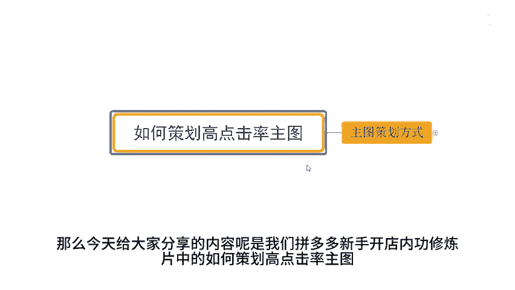

在付养之前呢，先给大家看一下近期跟着实他小伙伴他们的店铺数据，好吧。

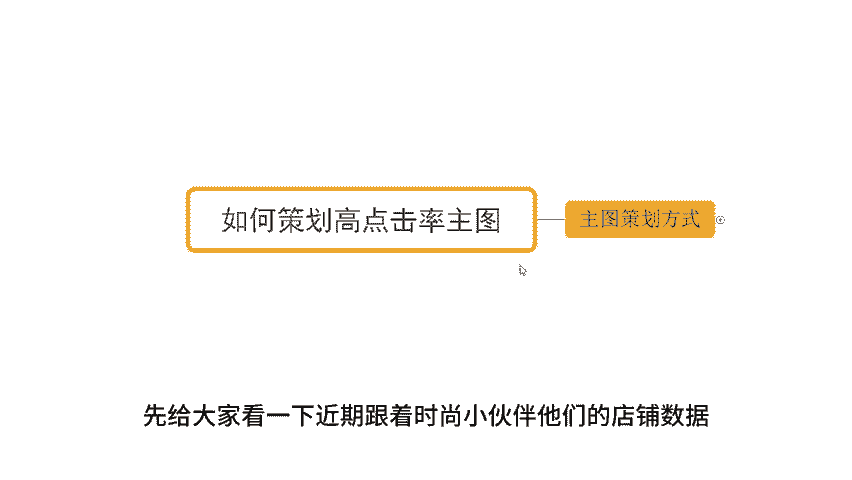

可以看到像这个店铺呢，原本是一个临访客的新店啊，从最早的没有数据的一个新店开始一步一步操作啊。那我们选择好了产品之后，完成了产品上架，再到我们产品的运营，一步一步的来累积我们上面权重啊。

经过一段时间累积之后呢，后面呢产品的数据呢开始呈现出一个啊比较大的一个啊这样的一个幅度的一个上升啊。到后期的话，一天的访客呢做到了15000。一天的订单呢是2900多单。转化率呢做到了8。76%啊。

还有像这个店铺啊，原本的访客是在3000左右啊，呈现出一些小小的波动啊。那么根据产品的实际情况，完成了一些调整优化之后呢，整体的访客也在不断的上升啊。当然呢整个上的过程呢也会出现一些这个起伏啊。

这个也很正常。那么到后期的话，一天的访客呢做到了1000一天的订单呢是2100单转化率呢做到6。47啊。当然除了这个店铺之外呢，还会呢像这个店铺啊，原本的访客在1000多200不到啊。

也是针对到我们商品的这个结构啊，包括说我们产品的SKU啊等等啊，价格方面呢进行调整优化啊。那么在整个运营过程中呢，整体的访客也在不断的增长。到后期的话，一天访客呢也做到了啊12000一天的订单呢是。

2100多单转化率呢做到了17。03%啊也都非常不错。像这种临访客的新店也好啊，还有像这些有数据，有基础的店铺也好呢，其实更实上都是能够得到一个非常好的提升的。而这些店铺呢也都是通过自然流的方式在操作。

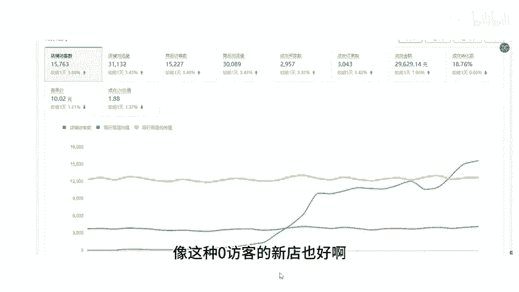

如果说你想要知道怎么通过自然流来操作店铺，你想要通过自然流来打造爆款的话，OK建议你可以仔细观看我分享视频。好吧。那么对于我们的新手小白来说呢，坐垫呢会有到很多的困难。如果说店铺操作有什么问题呀。

有需要资料的呀，可以找我啊，有时间的话，我也可以带着你一起去实操坐垫啊，就像这小伙伴一样呢，我们一起能够去有到更好的方法，能够快速提升我们店铺数据，让我们店铺呢达到更高水平。好吧。

OK那怎么去策划我们的高点盈率主图呢，来直接开始啊，在策划方式方面呢，OK首先第一件事情呢，我们就要了解清楚我们的目标用户啊，这个是非常非常非常重要的一个事情。

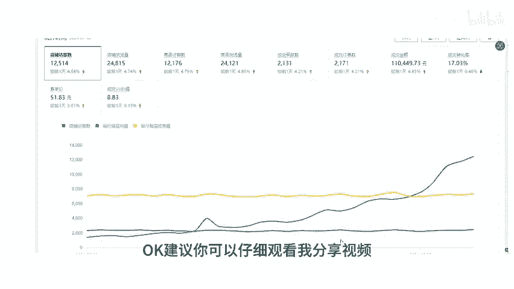

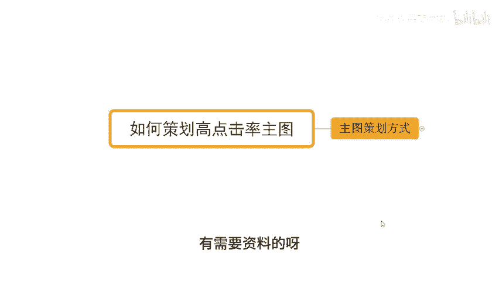

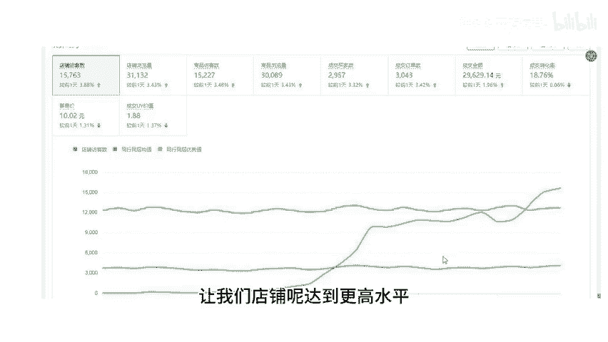

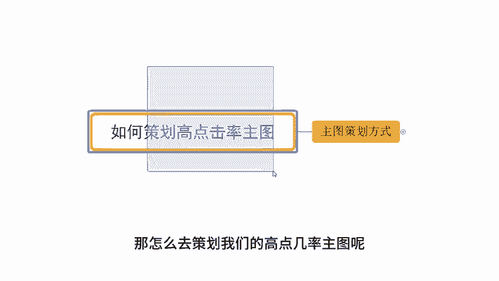

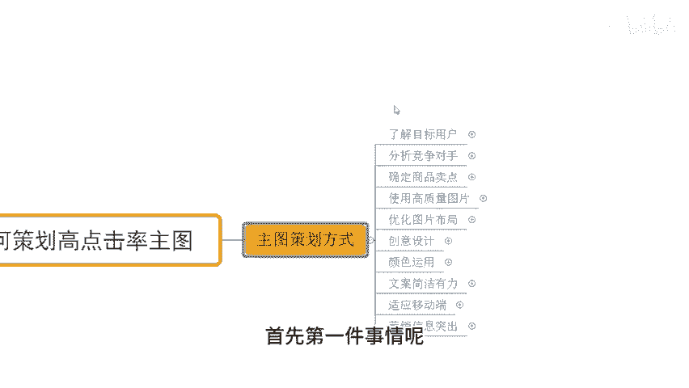

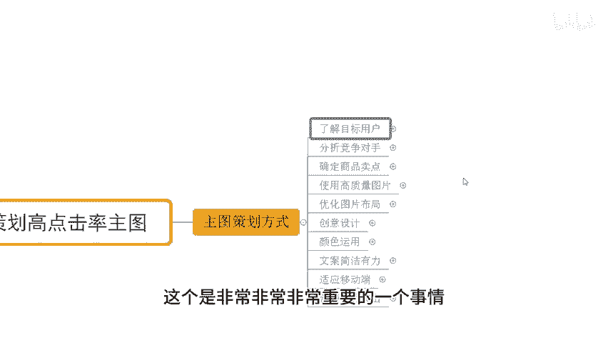

我们要研究我们目标群体啊，他们的一些需求，他们的喜好，他们的购物习惯，然后针对性的去设计出符合他们口味的主图。

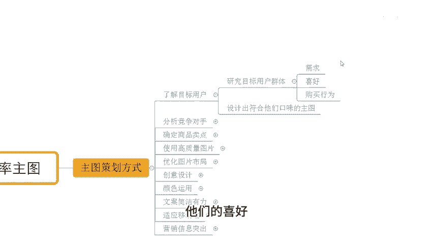

这个是一个非常重要的点啊，因为其实每个人对于每个图片的感官是不一样的。每个人呢对我们图片的需求也是不一样的。可能有的人呢喜欢这个黄色，有的人可能喜欢红色，对吧？有的人可能喜欢黑色。

像我们每个人对于颜色的感官也是不一样的。所以当我们能够去在经营某一个产品的时候呢，可能我们要做的并不是说让我们产品符合所有人的需求，能够满足所有人的一个感官，对吧？并不是的。

那我们要去找到那些和我产品可能高度匹配的，可能去有到呃更加。好的购物能力的这样的一个人，对吧？把他们的需求找出来，然后呢，针对性的去让我们产品更加符合他们的要求。

来从而带动我们整体商品的点击以及后续的转化。这样呢在整个的推广过程中，在我们整个产品的经营过程中，我们的流量呢他也会形成一个细分人群的精准定位，形成一个非常好的点击反馈。

那后期平台进行这个人群推荐的时候呢，也可以推得更加精准一点，整体后期的整体访客上升也好点击转化也好，也会更加的稳定。好吧，O那么这是我们需要做一个事情。那除此之外呢，还有什么呢？

就是我们需要去分析我的竞争对手啊，这个东西也是非常非常重要的。我们要去观察好我们竞争对手，他们的组织设计啊，了解清楚他们的这个营销的策略主织的一个表达的方式，我们搞清楚。

然后并且呢要找出差异的一个点来啊。

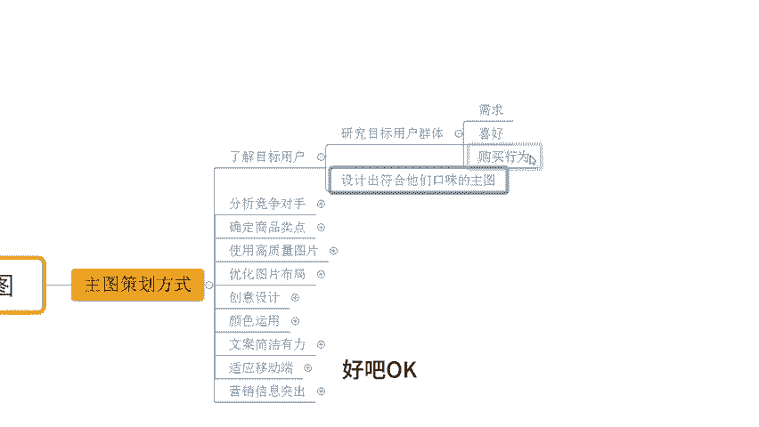

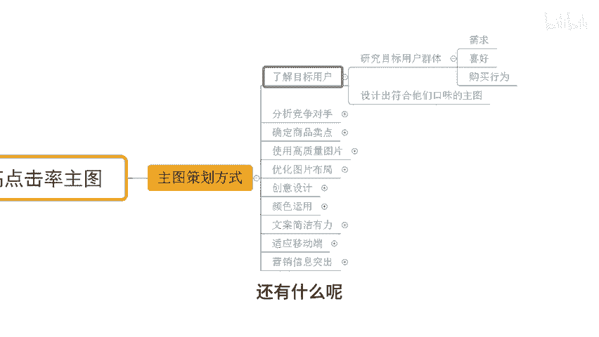

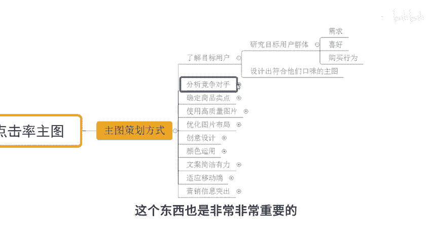

针对到这个差异呢来完成我们产品的运营。为什么这样说呢？其实对于消费者来说，他可能通过首页，通过搜索结果页，或者通过其他一些活动页面来进行商品的一个查找，对吧？

大多数商品他们可能整体的展示方式啊呃其他各种各样的东西呢都非常非常的接近。那如果说我们没有到形成一个差异的一个点的话啊，那后期可能我们也会在整个的界面里面嗯，这个相对来说比较平庸，没有特别突出点的话。

我们也不会有到特别好的用户的一个关注度那么就会导致我们产品呢啊不显眼啊，那么在后期的时候呢，点击板块来讲，包括我们转化来说的话，也都不会有到很好的数据。所以说我们在前期的时候呢。

一定要学会去分析竞争对手找出差异点来进行我们商品的一个策划啊，从此之外呢，还有就是我们要确定我们商品的卖点啊，这个关系就大了啊。那么明确清楚，知道我们商品独特卖点呢。

并且让这一个卖点在主图里面能够突出的展示出来。

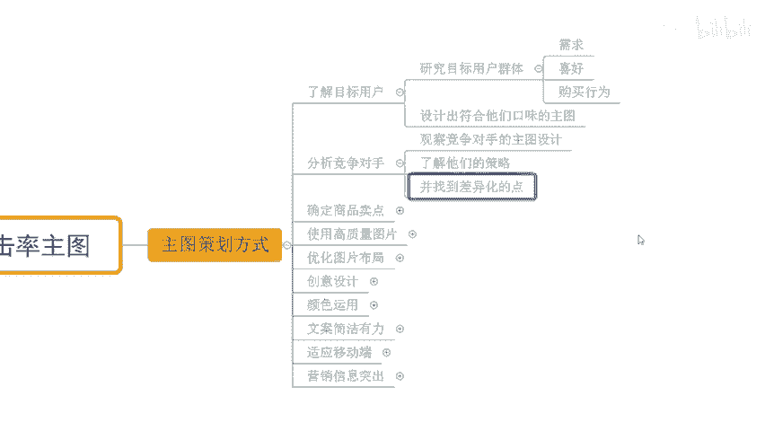

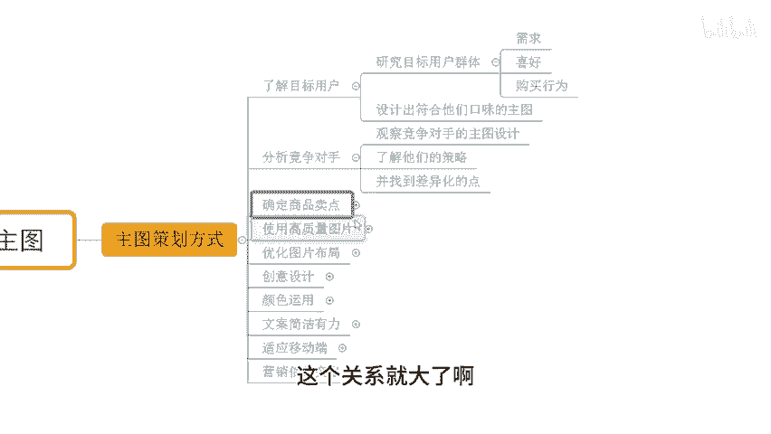

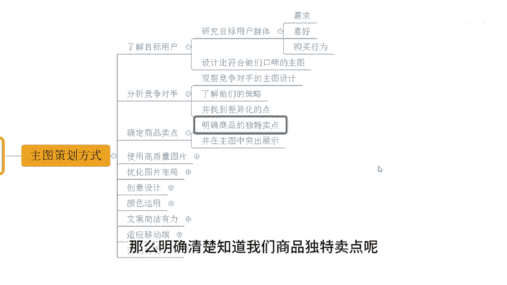

这样子我们整个上品呢才能够去真正意义上更好的更加容易让我们用户接受，并且打动我们的消费者，这是一个非常重要点的啊。那同时呢，我们在操作过程中呢，我们图片呢一定是要去使用到一些。

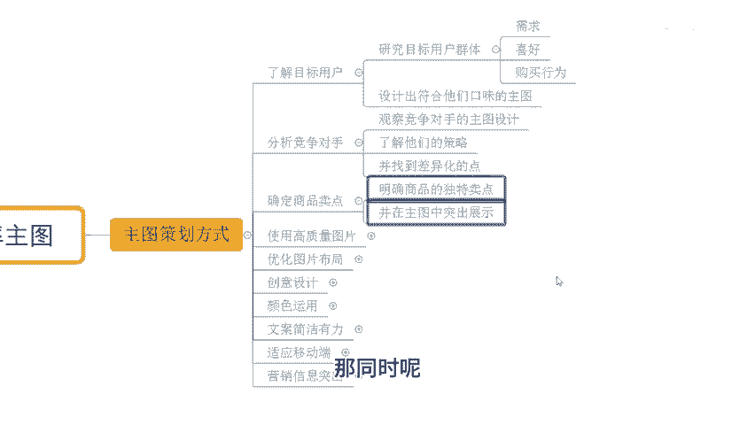

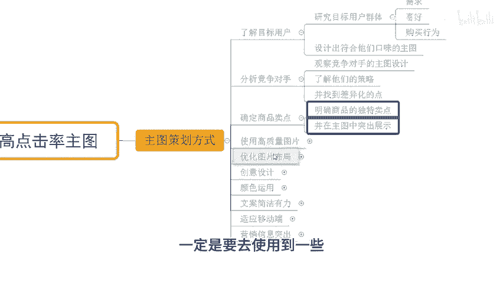

这个质量更高的图片，让它的清晰度更高，分辨率更高。

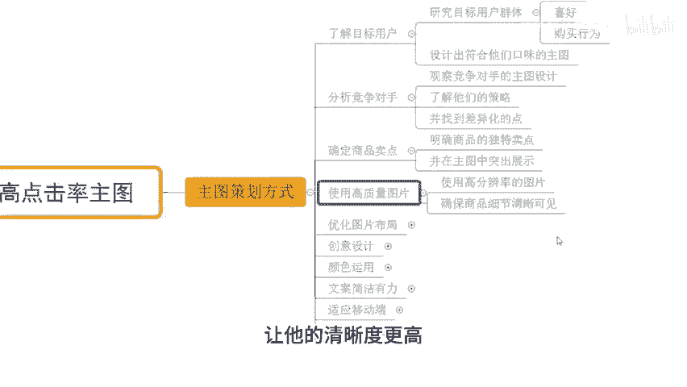

保留出更多的一些细节。那么这个时候。用户呢看到这样图片的时候呢，他会觉得哎非常的专业，非常的这个呃值得信任，是这样子啊，那如果一个图片都模糊不清的，跟打烂马赛克一样的对吧？

我相信你也不会觉得这个店铺的这量有多好，是不是啊，那同时呢我们在整个的呃主图策划过程中呢，也要去优化好我们的主图的一个布局，对吧？那我们在呃整个产品的排版方面呢，要合理的去安排我们的元素啊进行排布。

避免说啊比较杂乱呢，同时呢要确保我们视觉的一个焦点，是集中在商品上，能够去充分的突出我们产品的一个特性啊，或者是特点啊，这样呢才能够去更好的让消费者了解我的产品形成转化啊，同时呢在我们的创意设计板块呢。

这个东西呢也是需要去了解清楚的。就是我们要运用到更多的一些呃创意的元素，让我们产品呢在表达过程中呢啊。

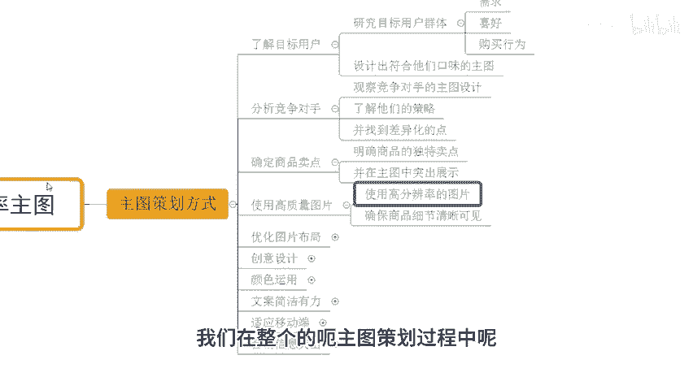

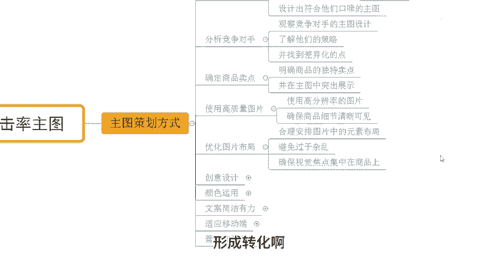

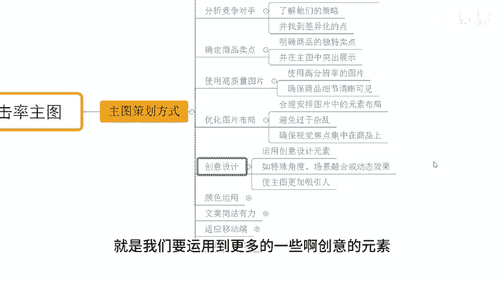

图片上来讲更加的有新意啊。同时在整个展示的方式里面啊，像一些特殊角度啊，场景的融合呀，或者是动态一些效果呀等等，这些也要使用出来，能够去让我们的主图呢更加的吸引人。

能够让我们主图呢在呃差异化上得到一个体现，让我们的用户呢更好的了解我们产品啊。同时呢在我们整个的这个策划过程中呢，我们的颜色运用也要去注意到位啊。这个呢也是我们经常去说的一个事情。

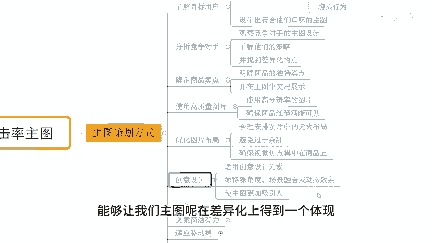

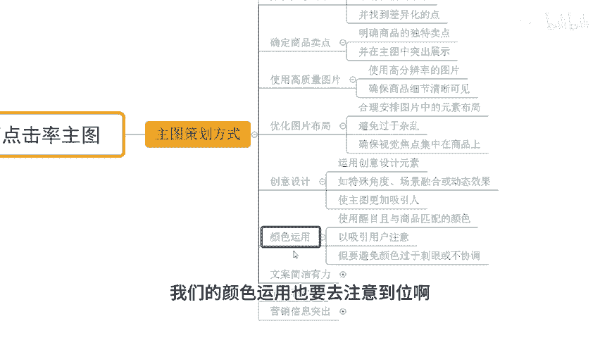

像我们的颜色板块的话，要使用到一些醒目，并且呢与我们商品是匹配的颜色。那么这个颜色呢是我们点缀我们图片的颜色，也可以是我们图片的背景色，也可以是其他的颜色，总的颜辞就是我们整个的色彩的运用呢。

是要以吸引用户注意力为目的的。但是呢要避免颜色过于的混乱，过于的刺眼不协调啊，因为不好的颜色表达的话，对于用户来讲的话，可能也会觉得呃拉低了我们产品的一个档次啊。

那能够有到呃相对更好的产品的颜色展示的话，我们在整个推广过程中呢，产品的点击也会更高一点啊，这个东西呢在我们产品的背景上，在我们产品层面上，在我们的色彩的搭配上面都可以去体现出来。

也就是我们所谓的颜色差异化啊。那通过它就能够去完成啊。然后再呢就是我们的文案，那我们要文案简洁有。

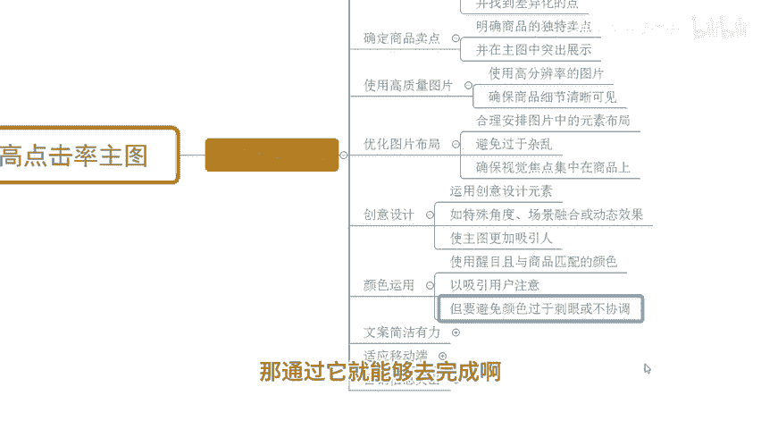

啊在主图上呢添加出一些简洁明了的文案，能够去充分的体现出我的促销信息，或者是我产品的特点。注意啊，这些信息呢一定要集中不要过于分散。那么这个时候呢你分散的太多，写的太多，等于没写的。

因为用户他在阅读过程中的话，不会说大量的时间来盯着你的主图去看。那么这个信息足够的突出足够的有吸引力的话，才能够去帮助我们消费者得到一个呃关注我们上品的机会。了解我们上面的一个机会。

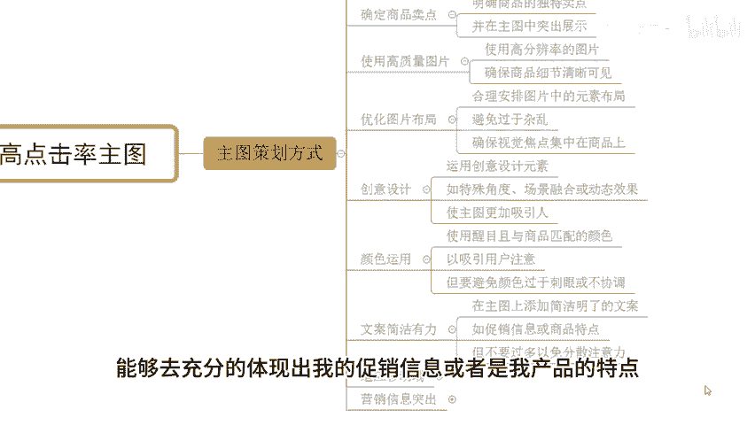

那么再往后呢，就是我们需要去适应到我们的移动端。所以我们的用户呢基本上就是呃在手机端口上进行我们产品浏览的对吧？所以这个时候呢我们要确保我们主图呢在手机设备上显示效果。

一定是能够去充分的展示出我产品的这个细节还有我产品的一些卖点来的啊，同时呢在表达过程中呢，我们的文字不要太小，不然的话我们可能整个图片它是看不见文字的。

你可能文字就是一个呃跟马赛克一样的一个一个斑点在那个地方的话就没有意义了，对吧？所以我们要在这个表达上面呢呃文字足够的精炼，足够的清晰，足够的大啊。那同时呢我们在呃营销信息上面。

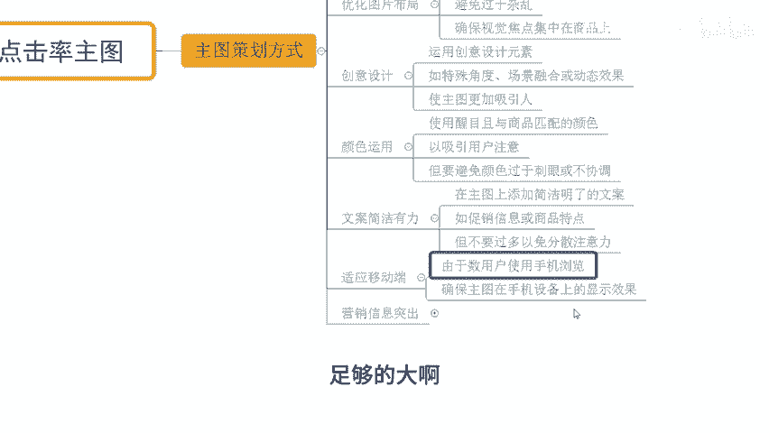

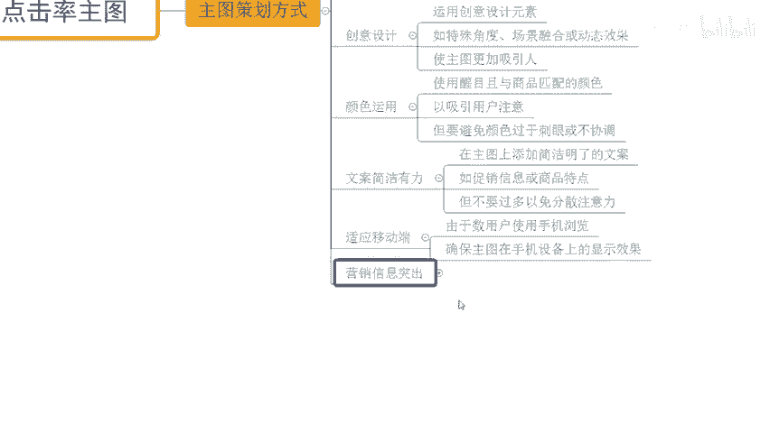

也要去突出出来啊。那么呃尤尤其像我们产品的一些这个促销的一些活动啊，特惠啊，这个特别的些优惠啊，包括这些东西能够让他们呢充分的展示出来，能够去清晰可见来确保我们用户呢能够了解到我们店铺的一些营销信息。

通过这些东西呢完成我们店铺商品的一个点击引导和转化引导。好吧，那图片策划方面呢，其实更多时候呢考虑的就是我们如何让我们用户更好的了解我的商品，如何让我的用户呢更好的去呃形成一个转化啊。

得到更好的一个点击反馈。那么这个呢是需要利用到我们的市场分析，也会需要运用到我们自身的一个经验来进行判断的。在视觉策划板块来讲的话，他可能更多是要借助我们的运营思维，而不是设计思维。

所以这点大家需要去注意一下。那如果说你对这方面呢，本身是没有一个完整的概念的话，OK的那么也可以多去了解一下。那么有什么问题也可以多问我啊。

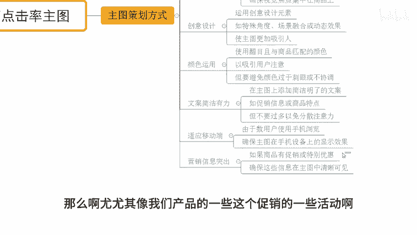

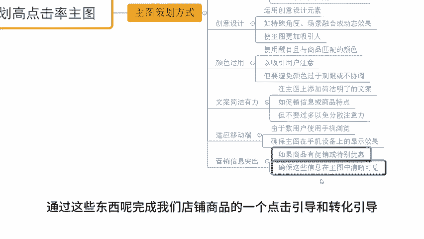

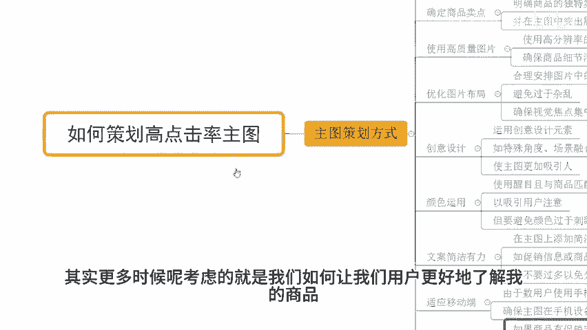

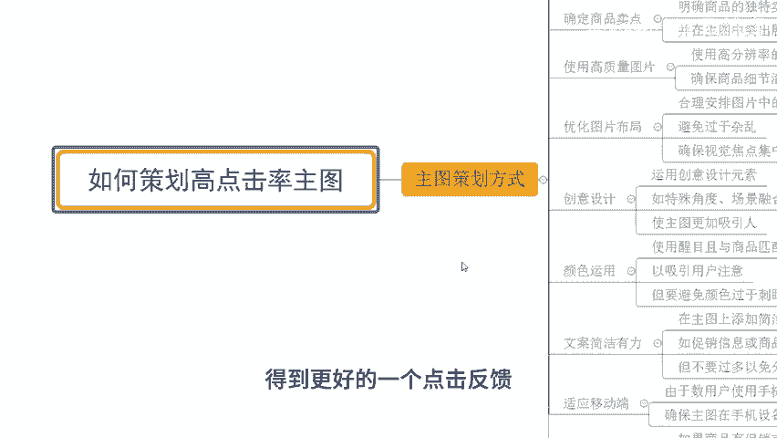

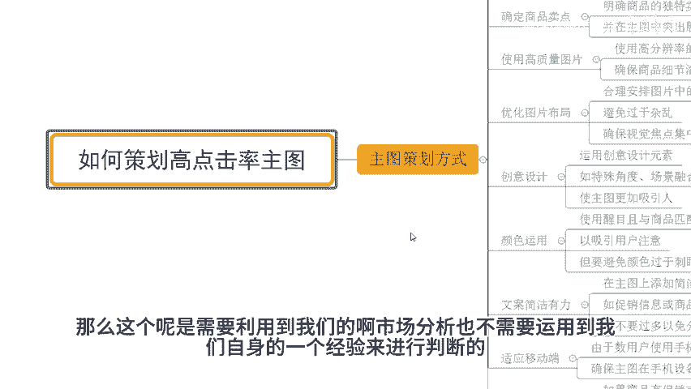

那包括像我们些小伙伴有什么其他地铺问题也好啊，或者有需要资料的呀，都可以找我啊。那么有时间的话，我也可以带着你继续实操。就像这些小伙伴一样呢，我们一起能够有到一个更好的操作方法。

能够让我们店铺呢达到更高水平。好吧，OK那么今天的一个分享呢就到这边。那我们下次再见，各位，拜拜。😊。

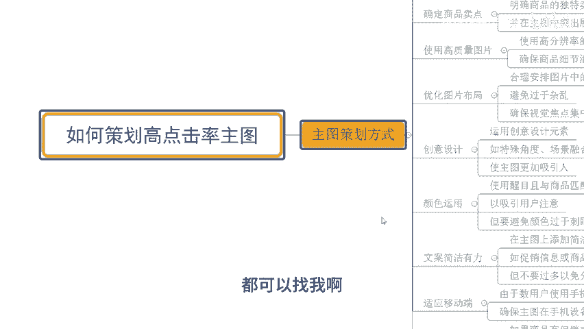

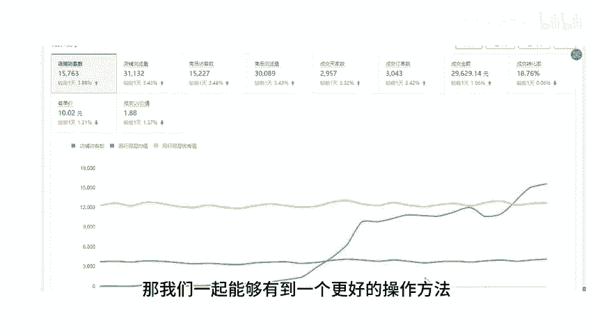

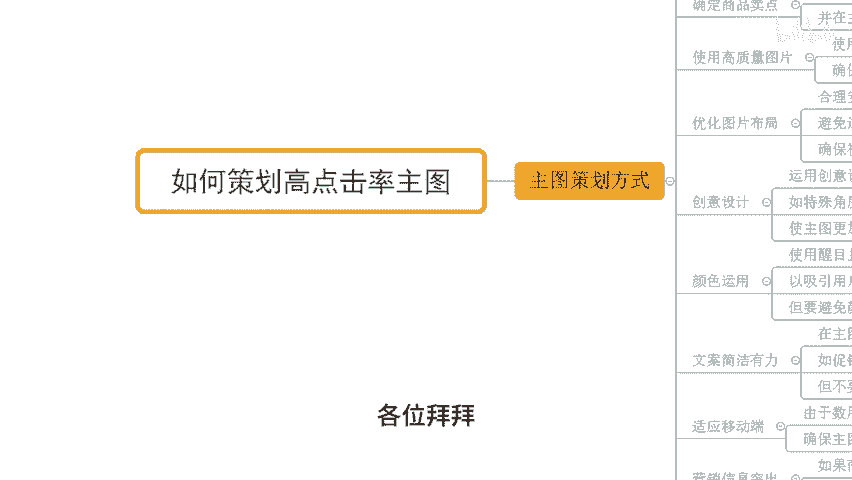