# 拼多多开店运营-新手电商运营实战指南，B站最全拼多多零基础入门教程！拼多多运营秘籍，小白也能成电商大亨！轻松上手拼多多，拼多多新手开店赚钱攻略 - P9：09 店铺营销活动策划 - 拼多多开店运营- - BV1xms8eSEVs

hello，大家好，我是谢楼。那么今天给大家分享的内容呢，是我们拼多多新手开店内功修炼片中的店铺营销活动策划的内容啊。

在费用之前呢，老郭先给大家看一下郑西跟的石他小伙伴，他们的店铺数据，好吧。

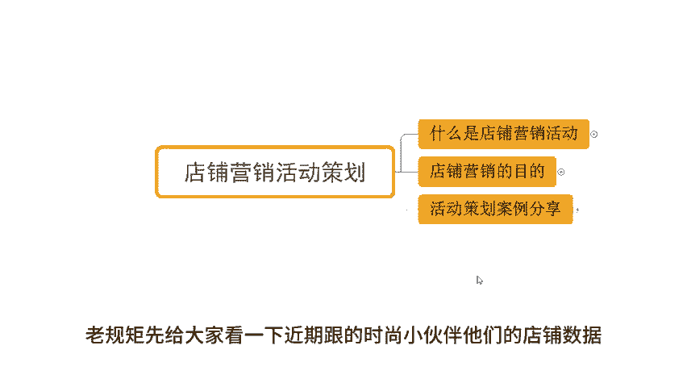

可以看到，像这个店铺呢，原本访客在3000左右啊，而且访客会存在一些波动。那么跟着实效之后呢，我们针对到产品的结构，包括说我们产品的SKU进行了优化调整。那在优化之后呢，整体的访客也在不断的增长啊。

那么整个店铺呢到后期一天的访客呢是做到了1万三一天啊，一天的这个订单呢是2100单转化率呢16。47啊，除了这个店铺之外呢，还像这个店铺啊一样的，原本的访客呢在1000多2千0不到啊。

那么同样的也是通过产品结构SQ的一个优化完成了我们转化的一个提升。那么当转化提升之后呢，整体的访客也在不断的增长啊，到后期的话一天的访客呢。

从原本的2000不到做到了12000一天的订单呢也是做到2100多单转化率呢17。03啊也都非常不错的。当然呢除了像这种有基础有数据的店铺之外呢，一些零访客的新店，那是。一样是可以得到一个很好提升的啊。

可以看到像这个店铺就是一个新店来的对吧？最少是零访客，那么没有任何数据的一个店铺啊。那跟据实之后呢，我们通过市场分析竞争分析完成了我们的产品定位。那么定位完成之后呢。

开始去对接货源上架操作我们店铺的商品，对吧？提升权重。那么当数据累积一段时间之后呢，整个店铺的数据呢开始增长爆发。那到后期呢，从我们的临访客啊做到了一天15000的一个访客数据啊。

一天订单呢是2900多单转化率呢18。76啊，也都非常不错的。那么这些店铺呢都是通过战略的方式来操作的啊。那如果你想要知道怎么通过自然流来提升店铺数据，你想要知道怎么通过自然流来打造爆款。

OK建样也可以仔细观看我分享视频，好吧。

那么对于我们店铺运来说的话，其实对于很多的吸售小白来讲，肯定会遇到很多的困难，这个很正常。那如果说你有这种店铺招上面的问题啊，有需要资料的呀，O可以找我啊。有时间的话，我可以带着你一起去实操做店啊。

就像这些小伙伴一样呢，我们一起能够有到更好的收售方法来提升我们店铺数据，让店铺呢达到更高水平，好吧，OK闲话不多说。那么店铺的营销活动策划到底是什么，对吧？这个东西呢嗯我要跟他讲清楚了。

他呢不是说就是我们平时的这个活动提报啊，或者是使用到我们一些营销工具来完成一些促销打折或者优惠券的一个设置并不是这样子的啊，所谓的这一个呃店铺营销活动呢，他其实是指的我们商家自身开展的啊。

那么我们店铺内部的一个营销活动。

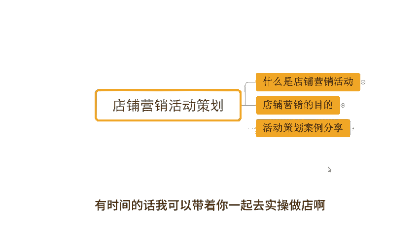

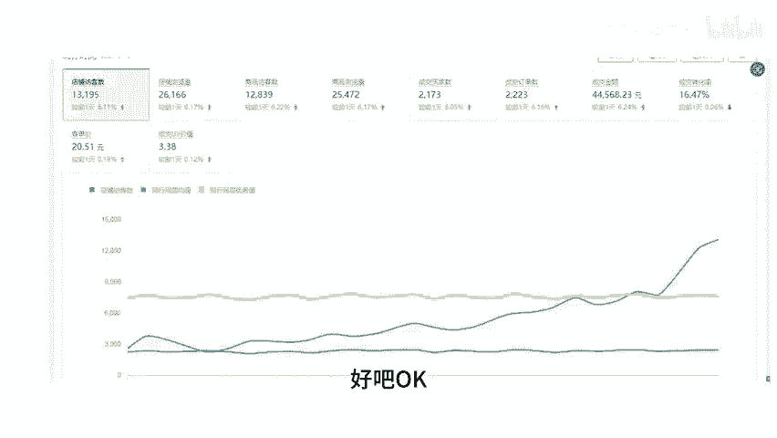

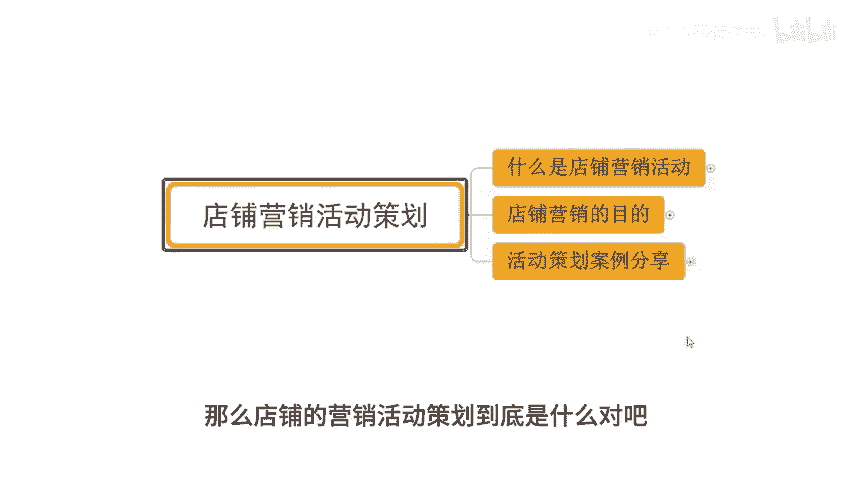

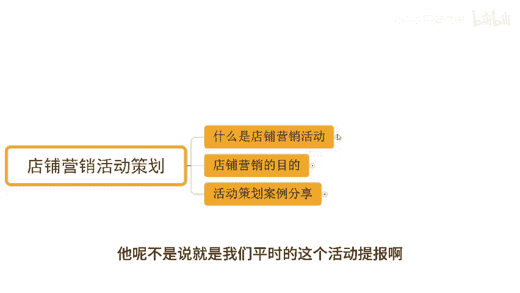

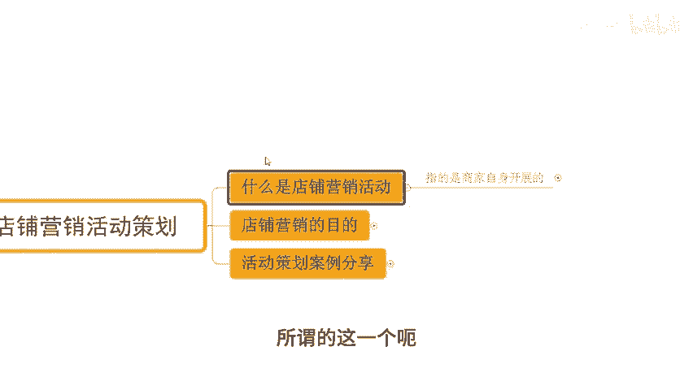

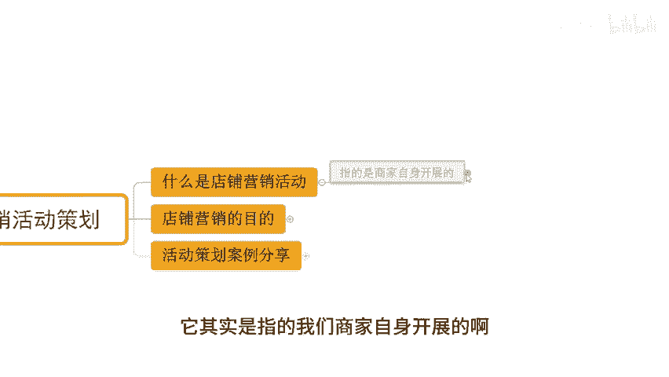

他是对类的啊，那他的意呢呃做了这个事情是干嘛呢？就是为了去推广我们的产品嘛，对吧？为了增加我们产品的销售额，提升我们店铺的知名度，提升我们市场的份额啊，那么采取了这种的这个促销或者是宣传的一个手段啊。

仅此而已。那么整个这个店铺营销的目的呢进行拆分的话，其实就几个重要的一个点啊，第一个点呢就是为了更好的去吸引我们的曝光人群，完成我们点击进店这个动作。当有到更多的人对吧？通过我们的宣传。

通过我们的一些营销手段，完成点击进店的话，O那么他是可以提升我们店铺的点击率的那同样的访客的情况之下，那我们呃点击率更高的话，我的曝光量其实更少的对不对？那反过来是一样的。那么我的曝光不变的情况之下。

我的点击率越高，我的访客会越多。那么这个时候呢，我们整个店铺的访。

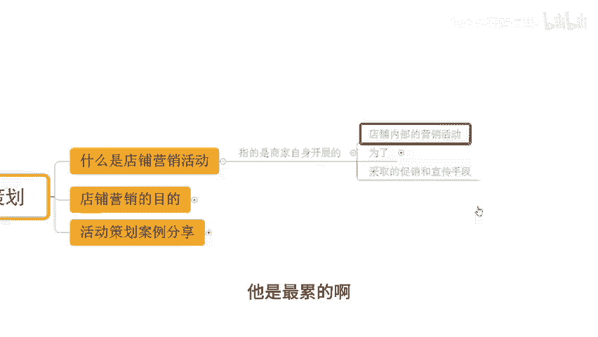

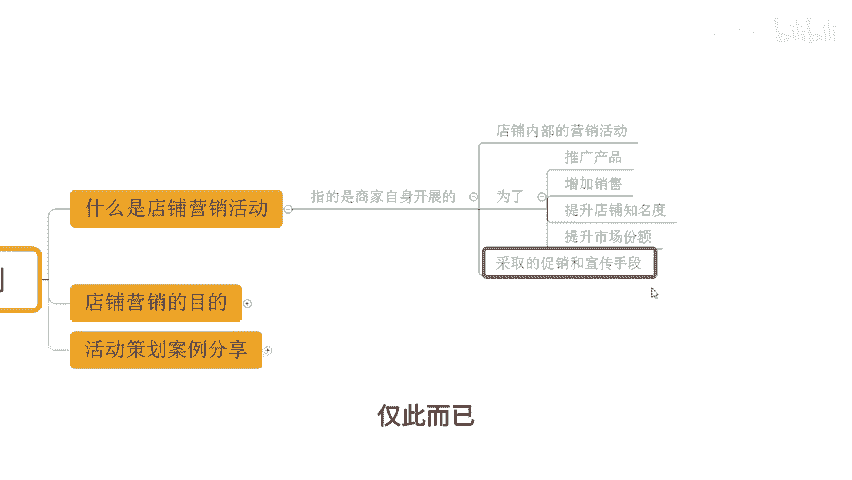

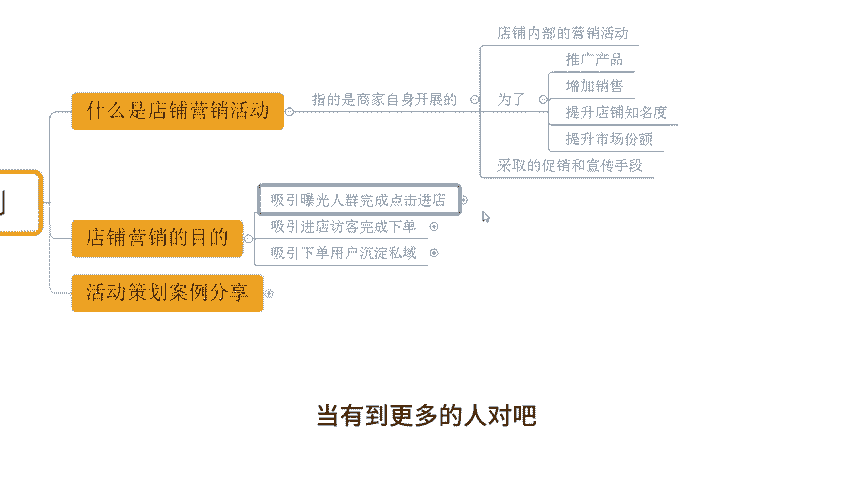

客基数变大之后呢，也能够去有到更多订单的产生。同样的，当我们这一个访客点击率增加的同时，我们可以去通过这个图片完成更好的用户的引导啊，那么引流可能会更加精准一点啊。

到后期呢对我们各项数据指标的提升都有帮助啊，同样的除了这样的一个目的之外呢，还可以引导我们更多的进店的访客呢，完成下单的这个动作啊，从而呢帮助我们店铺呢提升我们的转化率。对吧？首先第一件事情呢。

就是这些用户呢是通过我们所设置的这些营销手段，引导进店的。所以他们对我们的这种营销手段是感兴趣的而且对我们产品也是感兴趣的对吧？在这样的一个引导下，那完成后期的转化本身就是技所当然呢会更高一点啊。

是这么一个情况的所以当我们的访客变得更多而访客进店之后转化又会更高的情况之下呢，我们整体的权重也会变得更高那同时呢还有一个作用就是什么呢？能够去吸引。

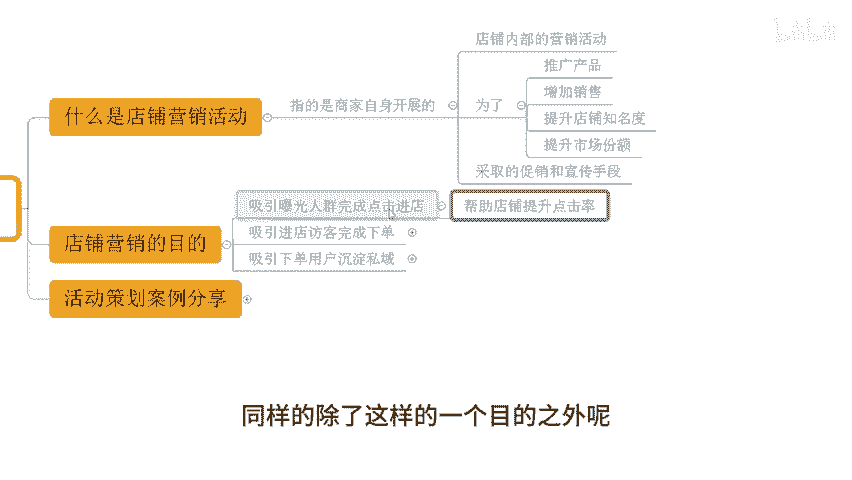

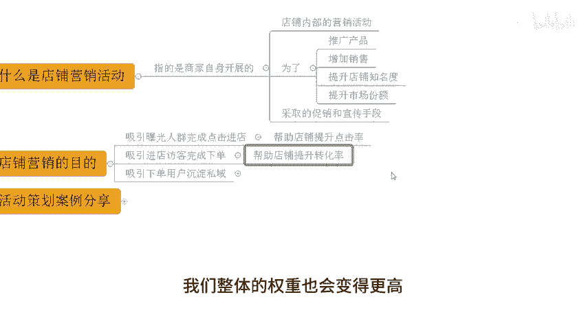

我们下单的用户呢进行一个私域的沉淀啊。那么这样呢，我们可以帮助店铺呢做到一个用户留存，也可以帮我们店铺呢在后期做了更多的回购。

来从而提升我们店铺的流量的一个成本啊这个降低成本之后呢来提升我们的一个运营的一个这个利润的一个扩大啊，同时呢也可以帮我们去提升我们店铺的权重。

因为回购本身的权重会比我们正常去做拉新来说或者是进货成交来讲，在某种意义上来讲是会更高的啊。那么讲到这个地方呢，可能就有很多伙伴奇哎那你说了这么多对吧？那这个东西到底是什么对吧？

怎么去做的O那我给大家分享一个这个案例啊，让大家去了解一下他到底什么逻辑。那么把这个东搞清楚之后呢，我们可以按照这一个这思维方式呢去进行我们店铺营销策划的一个这个计划的一个实施或者计划的一个设计啊。

都是没问题的。那么今天分享案例呢就是拍下就送的一个活动啊。这个活动呢其实在我。

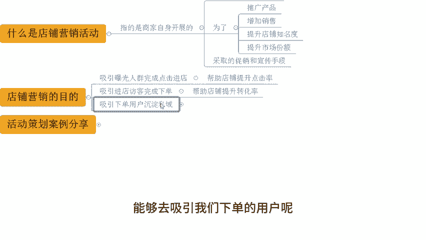

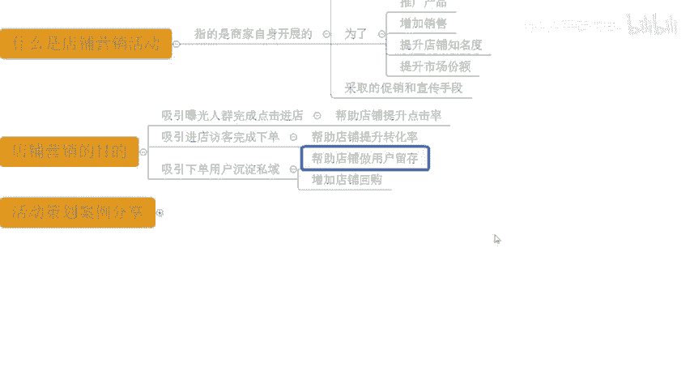

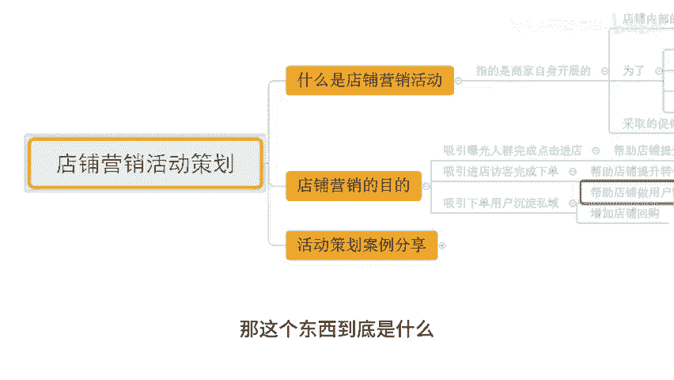

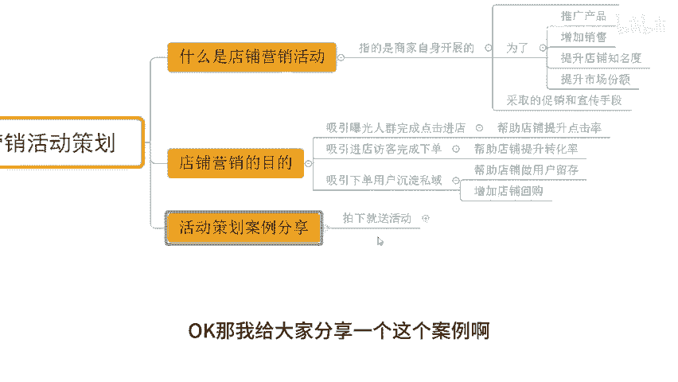

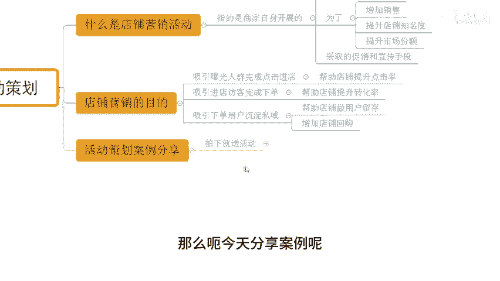

我自己店铺，包括说我带1操级小伙伴店铺呢都有在用啊，而且效果非常好。你们刚刚看到这个纯新店对吧？起爆的这个店铺呢，就有用到这个玩法啊，当然它的可能价比较低一点啊，那么也比较适合这种玩法啊。

那我们具体说一说他的一个收方式。

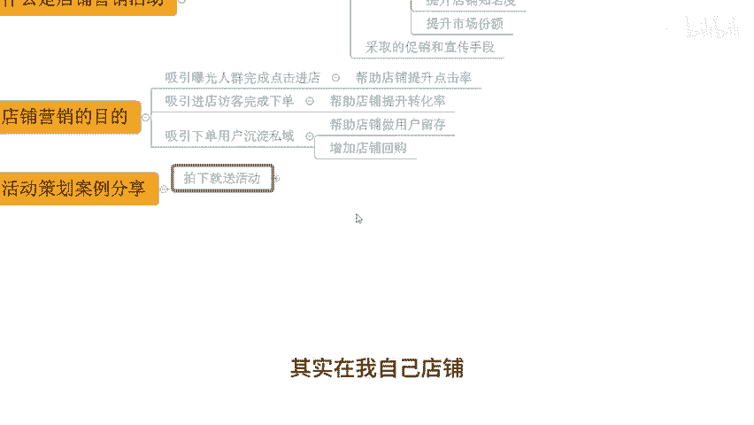

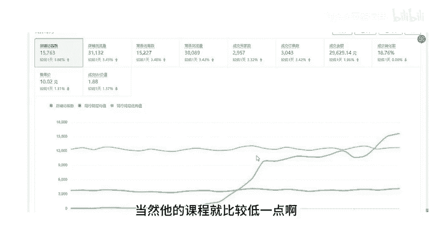

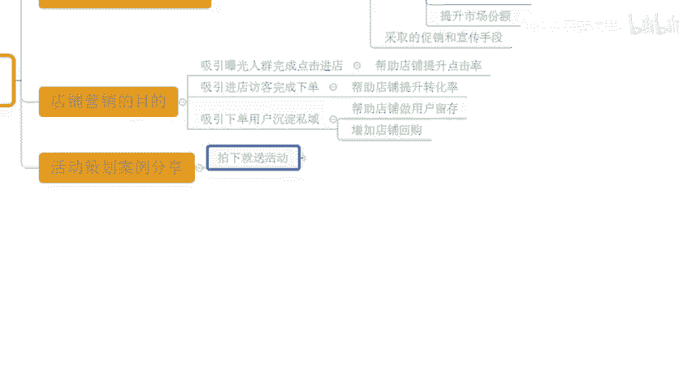

首先呢我们要搞清楚我们的活动目标，对吧？活动目标呢几个点。第一个呢能够去吸引到我们用户进店啊，来从而提升我们点击率。同时呢能够促进用户转化啊，并且呢能够去提高我们的客单价。

然后去这个实现我们这个私域的一个沉淀啊，是这样子的。那么这是我们的一个目的啊，我们要去做一个事情。那所以这个时候呢我们以这些目的为我们最终的一个呃引导的一个方向来完成我们活动策划的一个策划的一个执行啊。

O那么活动的主题呢还要就送对吧？这个是我们的一个主题。那在整个的一个活动的形式里面呢，就是说是由用户呢去完成我们指定规格的一个下单啊，然后呢通过完成订单之后。

交易完成之后呢进行返现的方式来进行的一个一个活动啊。那么活动的一个详情，我们来看一下，首先呢我们在我们的主图里面可以展示我们的活动信息啊，那么通过活动信息的。

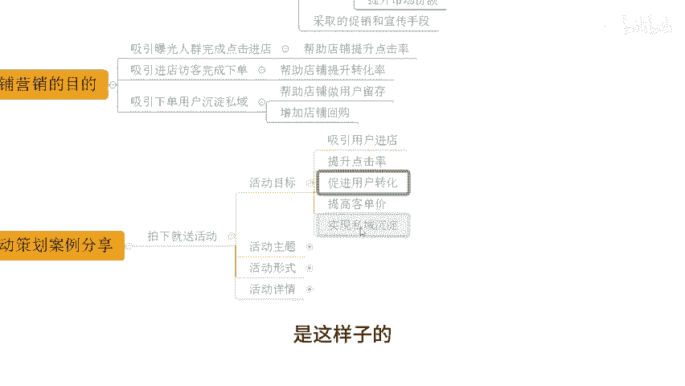

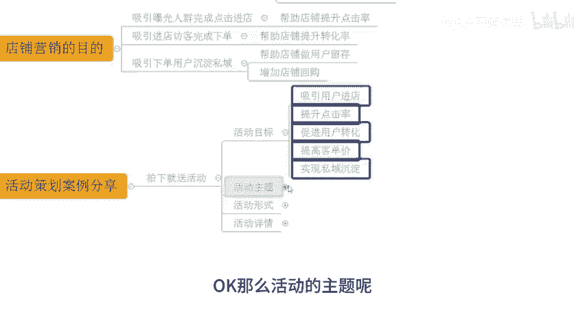

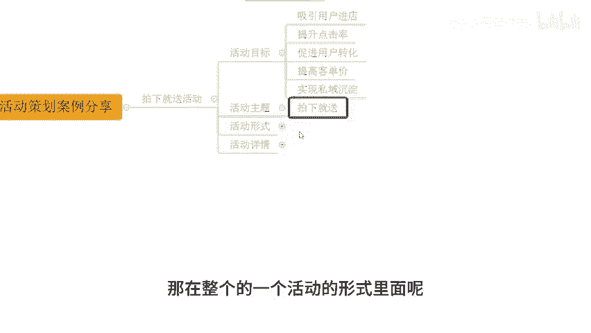

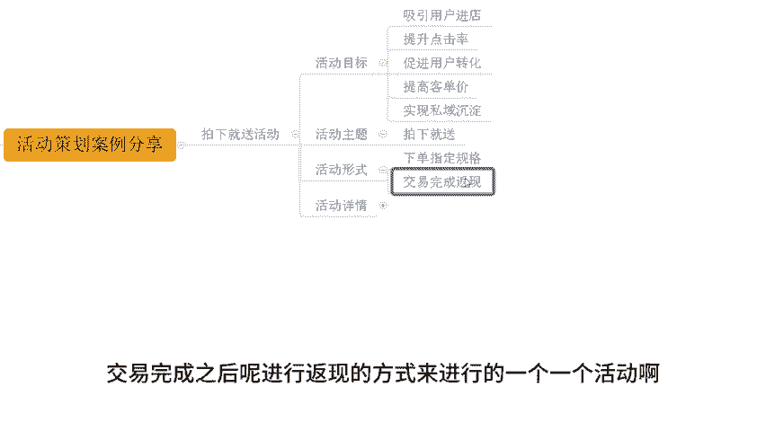

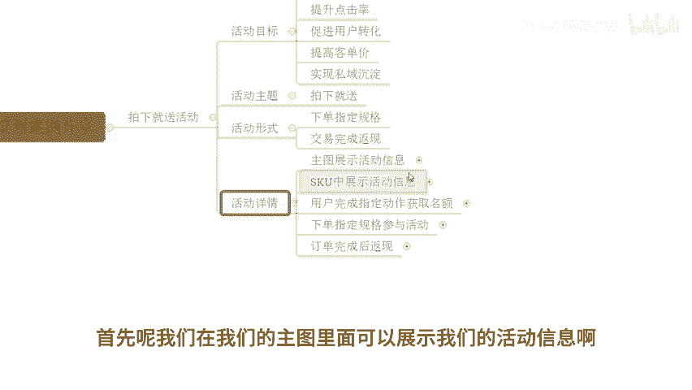

一个录出呢来引导我们用户呢点击进店啊，比如说我们在主图里面可以写上拍下就送这样的一个活动文案。那么告诉消费者，哎，我们这个店铺现在是拍就送的。但是可能在某种意义上来讲的话。

用户会觉得拍下就送就送的是我们这个主图的产品，对不对啊，那如果我们是高客端的产品的话，O那我们可以实际上把这个送的这个东西呢，它并不是我们的主图的产品，只不过是一些其他商品进行替代啊，我们要灵活一点啊。

那第客单的商品呢就可以直接去送。这个没关系啊，反正嗯我觉得吧有的时候在某种层面上来讲的话，完成真实的一个引导跟转化会比我们去眼前的这些细微的一些利润可能会在未来的成长空间来讲会更大一点啊。

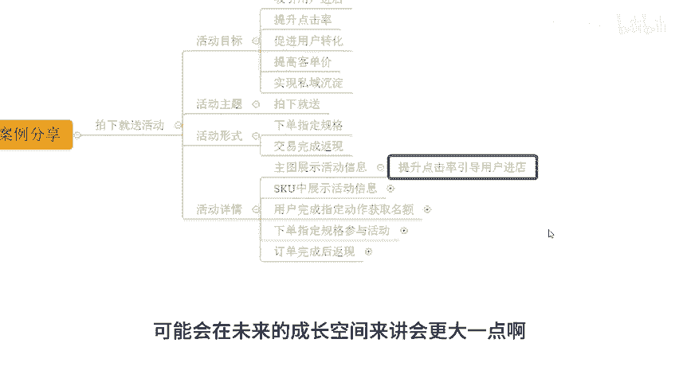

那在整个的经营过程中呢，我们在店内的一个事实的话，在SQ的一个这个布局中呢，需要展示出我们的活动信息。包括说我们在SQ的名称呢，还有图片上啊，对吧？都要去录出这些活动详情。

包括我们在详情页的首屏也要去进行活动说明。那我们要告诉消费者，你到我店铺呢去完成这个下单对吧？那么下单的时候呢，你可以下单某一个SQ这个SQ呢，你去买了之后，哎，我可以免费送给你啊。

那么你收到货之后觉得满意给到我一个好评，你要觉得不满意，直接申请仅退款啊，当然呢，你收货之后觉得满意的话，O那么我可以通过小额打款，把这个成本直接返还给你啊，都是OK的啊。那把这些说明说清楚啊。

那同时呢在这个过程中呢，也不是说所有人都能够去参与到我们这个活动的。

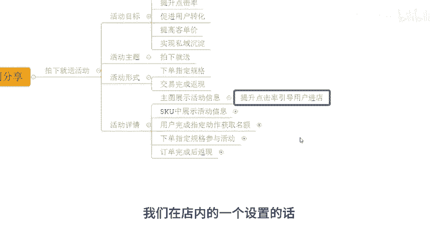

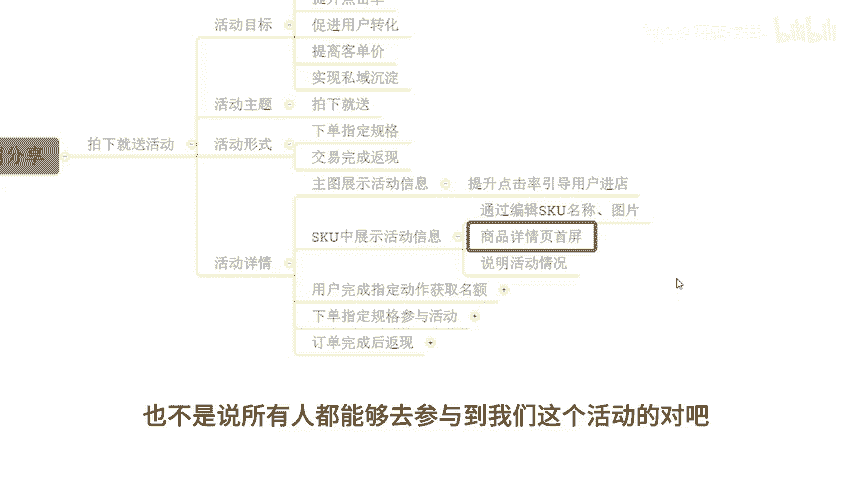

对吧那么哪些人可以参与呢？需要用户完成一些指定的动作来获取这个名额。首先呢我们去送的这个规格呢，肯定是有一个数量限制的对吧？我不可能说一直免费送免费送万一人怎么说是不送呢。

所以每个ID仅限一单I一单然后呢每天呢只有几个名额比10个名额或者20个名额或者30个名额你如果说是这个确实你的运营成本会比较多一点啊，你的一个执行预算会多一点以这个名额稍微做多一点都可以这无所谓。

但是呢一定是要用户完成指定的一个动作什么动作呢？比如说关注我们店铺或者是收藏我们指定的产品。那么这样呢可以增加我们店铺的粉丝来提高我们店铺收藏也提我们商品收藏，从而增加我们店铺权重，包括后期的时候呢。

至用户对这一类商品有需求时呢，因为收藏过我们店铺或者是我们商品啊，他也可以有到一个优先展示权利啊，可帮我们去拿到更多曝光。后期啊那么这个时候用户呢他就会去。

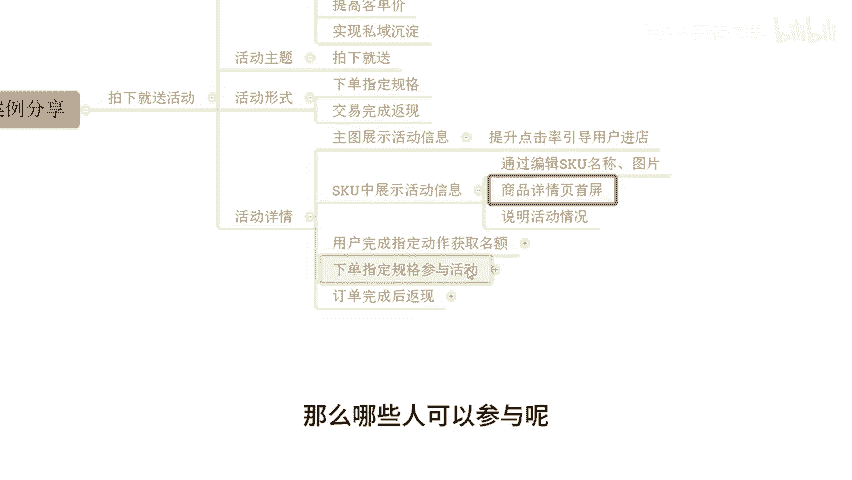

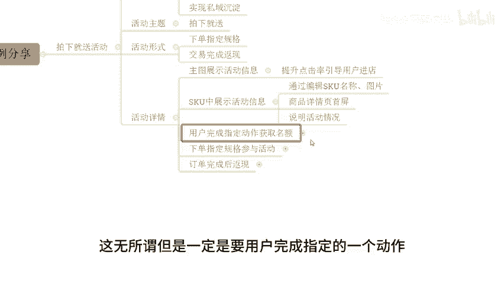

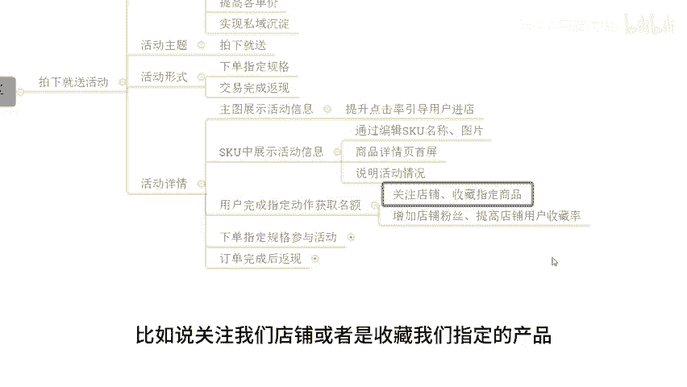

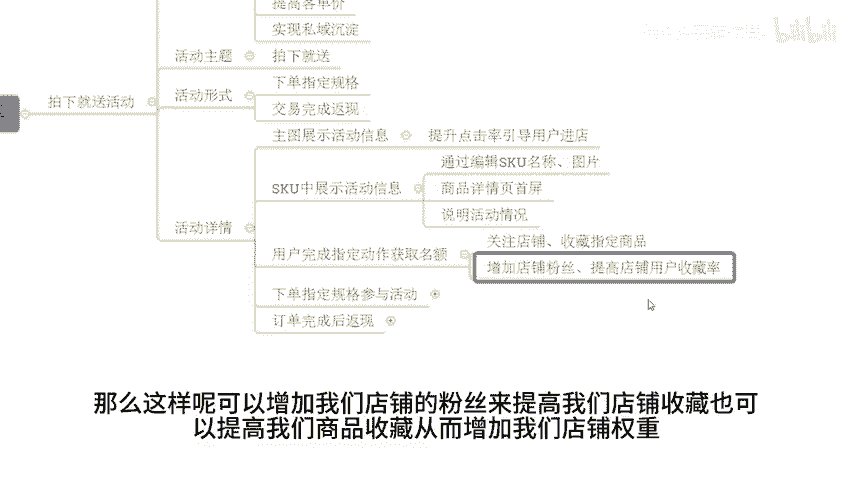

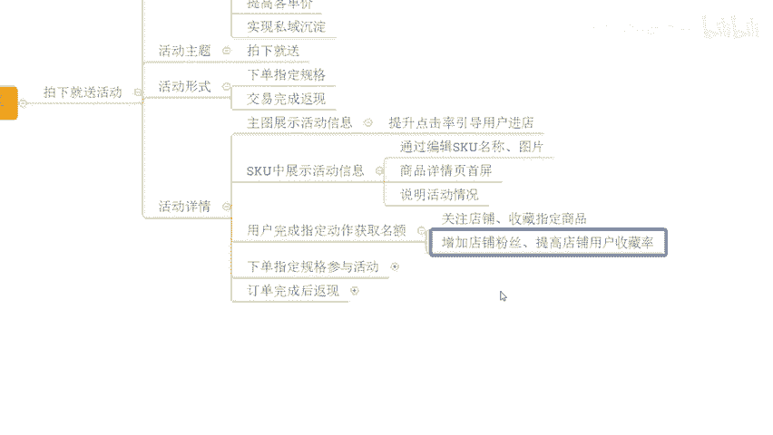

做这个事情。当然前提条件是我们这个产品它确实是需要的。但这个东西基本上问题不大啊。因为本身这些人能够看到我们的商品一定是符合我们产品标签的啊，这一点不用去任何的怀疑，对吧？那么下单指定规格这个合同呢。

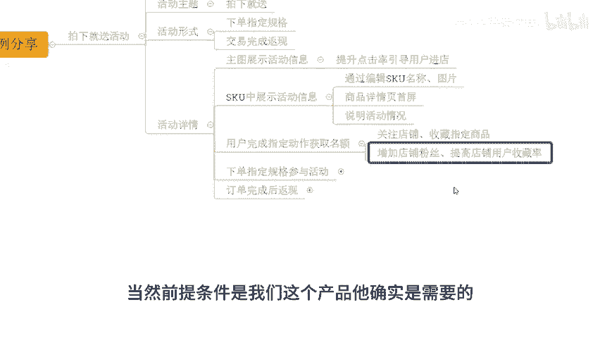

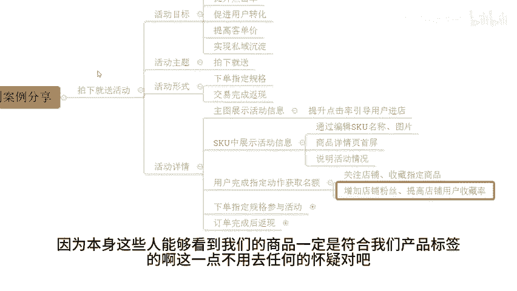

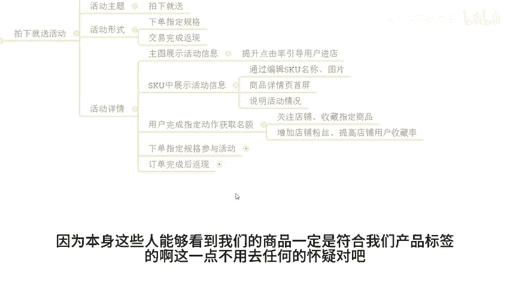

我们就可以去在这个SQ里面呢布局一些低客单的商品，对吧？或者是一些体验装啊，或者是一些相关的配件呢，或者关联商品都可以的啊。那么这个针对到我们不同产品呢，我们可以用到不同的方式。

那再到后面呢进行一个订单的返现就可以了啊，那么返现呢是想要打款对吧？那当然也可以通过思欲去完成。那如果是思域对吧？那么就可以完成自建鱼塘的一个动作啊，这个呢是一个非常好的一方式啊，那么在这个过程中呢。

可能小说哎那这些用户他为什么要去配合着我们买这个东西呢，那一定是我们这个产品规格能够有足够的吸引力对吧？这一点是肯定的那确实是需要的那么另外一方面呢，当用户他过来的时候呢。

可能他买这个低客单的这个规格或者是小的体验装的这个规格呢，他并不是说他的一个实际需求，对吧？这个并不能满足他的个实际需求，至少来说这一点是可以肯定的那所以说呢那用户在正常下单，他所需要的规格的时候呢。

他也可以额外的再去拍多一个我们所需要他下单的。

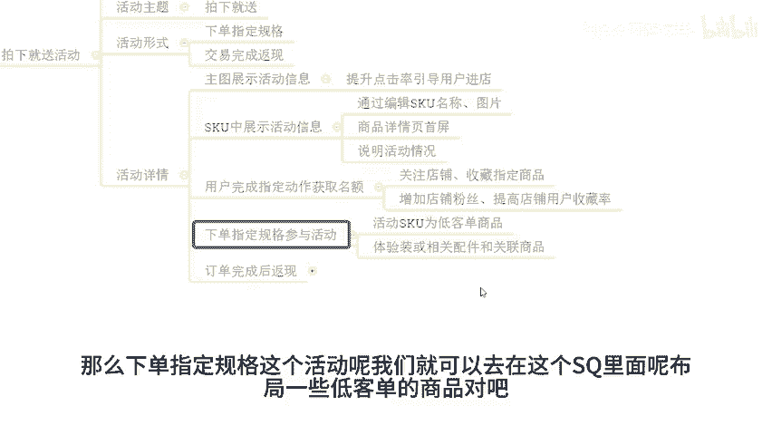

体验的一个呃返现的一个一个规格，活动的一个规格。那么用户拿到手之后呢，可以先去使用啊，我们相当于是赠送的这个规格产品，对不对？他觉得满意，O在确认收货就好了。如果觉得不满意。

他正常下单的这个产品呢可以退货退款。另外这一个呃相当于体验的这个产品呢可以直接仅行退款就可以。当然我们可以通过小额贷款把这部分款项呢返还回去，然后直接全部订单申行这个退货退款也是可以的啊。

都这个都没问题的。那么这样呢对用户来说也可以到更好的保障啊。那呃当然这种方式呢，针对到我们不同产品和我们不同的一个客单啊，可能会有到不同的一个要求，或者是一些细微的调整。这个我没有办法说把所有的变化。

所有的情况都讲的非常的详细。这个因为时间关系不太现实对吧？那如果说你在整个的店铺运营过程中对于这一样的一个活动啊是有兴趣的。但是呢自己可能在呃操作上面呢。

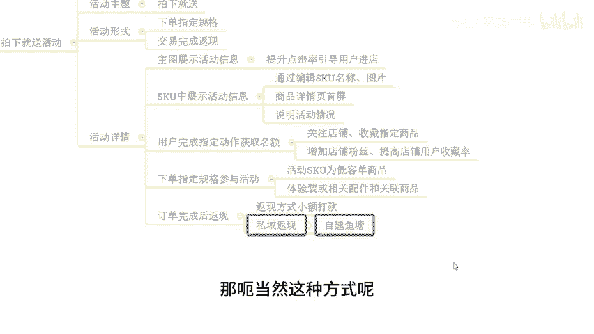

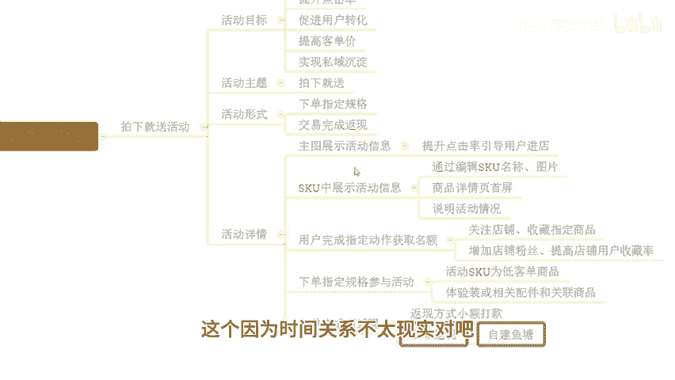

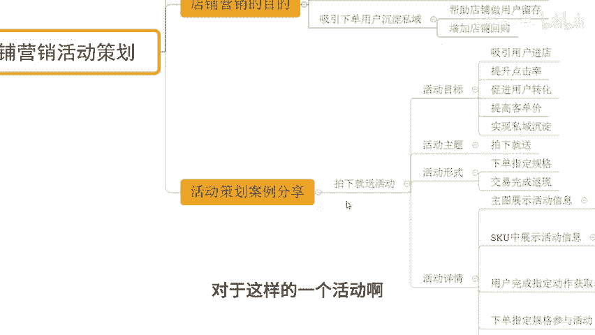

在理上面呢还有所欠缺，还有什么其他一些作方面的问题呢？OK的，可以直接找我啊。同样的那有需要资料的这些小伙伴呢也可以找我啊。那么呃还是那句话，有时间的话，我也可以带着你一起去实操坐垫，对吧？

就像这小伙伴一样的，我们一起能够去有到一个更好的方法，能够让我们店铺呢达到更高水平。好吧。OK那么今天的视频呢就分享到这里，我们下次见。各位，拜拜。😊。

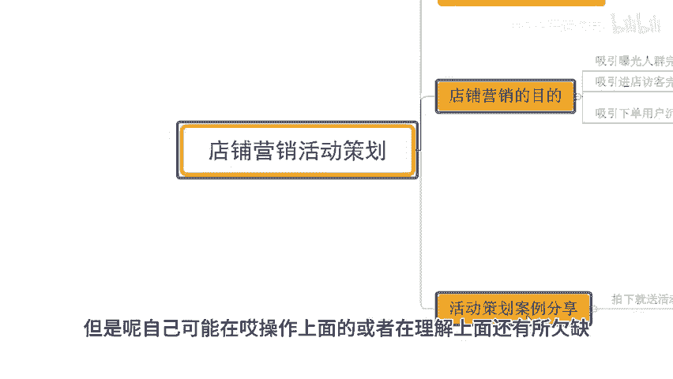

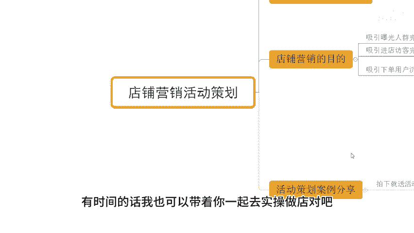

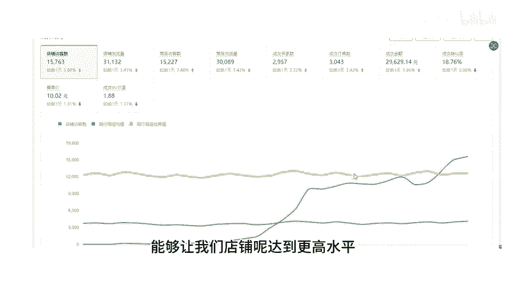

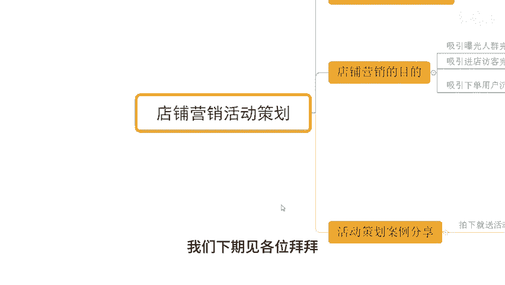