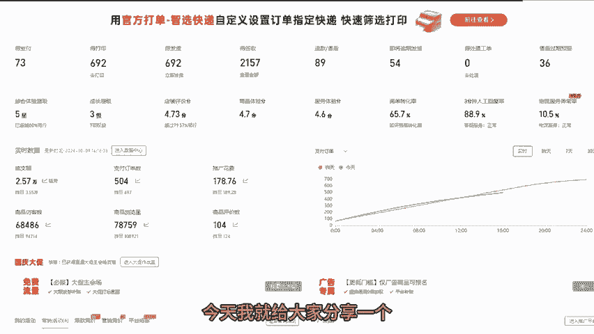
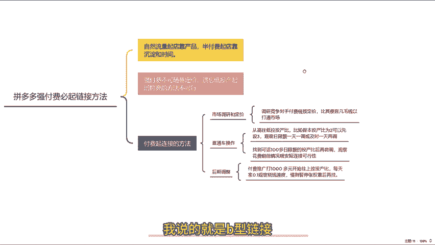
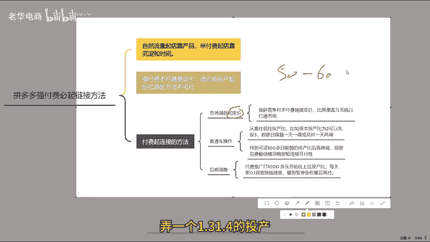
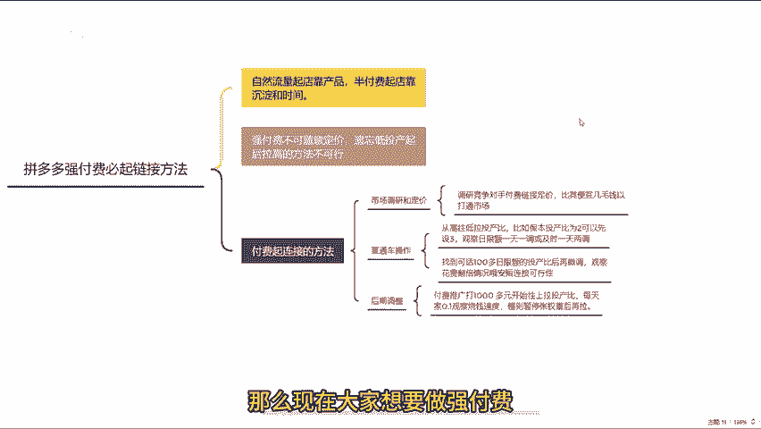
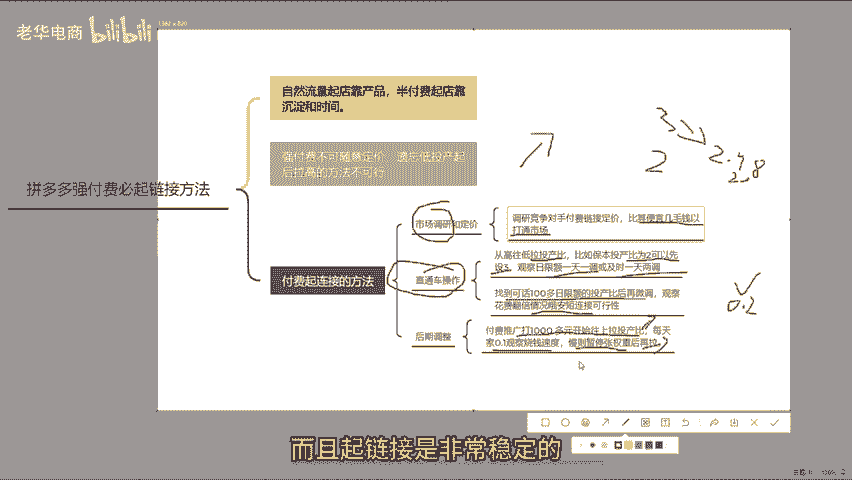
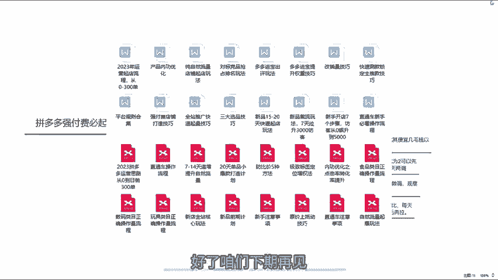

# 拼多多强付费玩法冲击双十一快速起店日销300单 多多运营 拼多多小白 拼多多新手开店 拼多多干货 拼多多商家 拼多多学习 拼多多店铺 拼多多玩法 拼多多 - P1 - 老华电商 - BV1JU2NYBExc

现在做拼多多店铺，自然流量起垫靠的是产品，半付费起店靠的是沉淀和时间。如果我们做拼多多，想要在年底之前翻身，那就只有全付费的起垫方法了。今天我就给大家分享一个强付费必起链接的方法。

你没有听错，我说的就是闭起年金。

但是这里首先要明确的是，在打偿付费的时候，千万不要随意定价，否则基本上会亏很惨。一般可能有些商家朋友一开始会把利润定到50%到60%，这么高的利润肯定不会亏。然后以超低的投产往下拉，弄1个1。31。

4的投产，再慢慢往上调。现在这种方法呢肯定是行不通的。那么现在大家想要做强付费，一定要按照我的这种方法去做，就能够快速盈利。

言归正传。首先第一步，我们需要做一个竞争对手的市场调研。在竞价的时候，一定要确保你的产品在同市场环境下价格要低一些。我们可以先看一下那些打付费的链接，它的定价是多少，你只要比他们便宜个几毛钱就够了。

这样一来呢，你的定价肯定可以在市场中打通，剩下的就是靠直通车买流量。我们开直通车的时候，一定要从高往低拉图产，不要像以前一样，一开始用亏本的投产比，然后再慢慢往上拉，现在千万不能这么做。

因为这样你无法确保前期亏了之后，后期能够拉回来。所以上车的时候设置高投产比，然后慢慢往下调。举个例子，如果你的保本投产比是2，那我们上车的时候可以设置三的投产比，设置日限和观察一天。

并且每天调整一下直通车。如果说今天设置的是三投产比，跑不动，明天就降到2。9，如果还是跑不动，后天就降到2。8，这样慢慢操作。或者说如果你比较着急，最多一天可以调整两次。

然后找到一个一天能花100多的日限额投产比。比如说降到2。1的时候才能够花的出去。然后我们再往下给它降到0。2到0。3。第二天再观察花费之后能不能翻倍，如果没有，那就调整投产。如果翻倍了。

那就说明这个链接在付费推广中是行得通的。只要不乱动链接肯定是能够做起来的。这个时候我们该怎么办呢？那就让子能再飞一会儿嘛，等到你的付费推广一天能够花的出去1000多块钱之后，再开始往上慢慢拉投产比。

以实现盈利的目的。每天加个0。1，完成之后，观察第二天稍显的速度有没有变慢。如果没有变慢，你就可以继续加。如果变慢了，那就暂停两天涨一下权重再往上拉就行。按照这样操作方法，你前期基本上没有什么亏损。

甚至还可能盈利。而且企链接是非常稳定的，学会了就赶紧去操作吧。最后还有不懂的可以问我，想学习更多多多运营知识，可以一键三连，拿一个我整理的从新手到精通店铺综合运营资料。好了，咱们下期再见。

