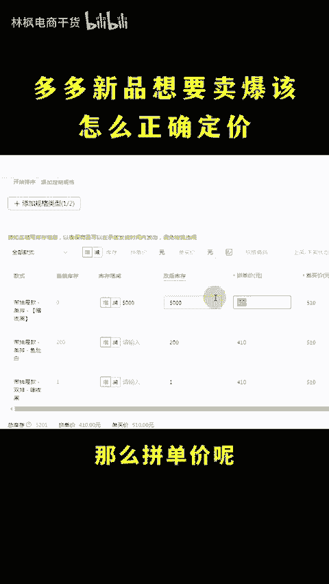
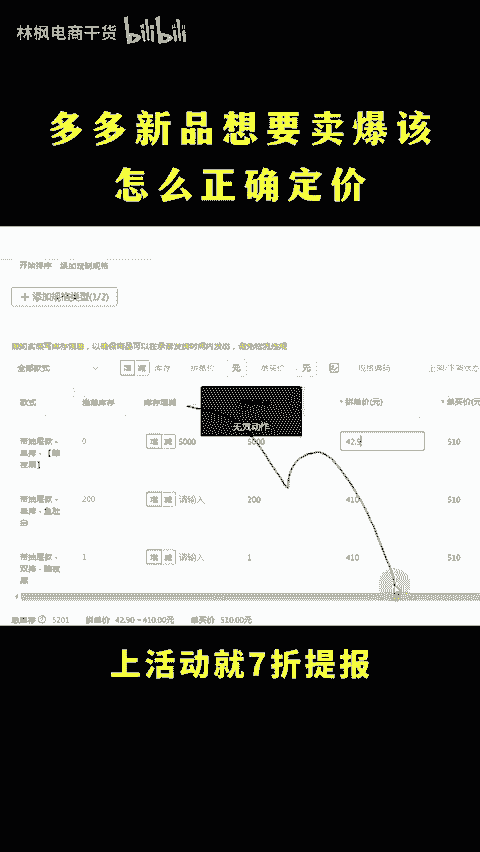
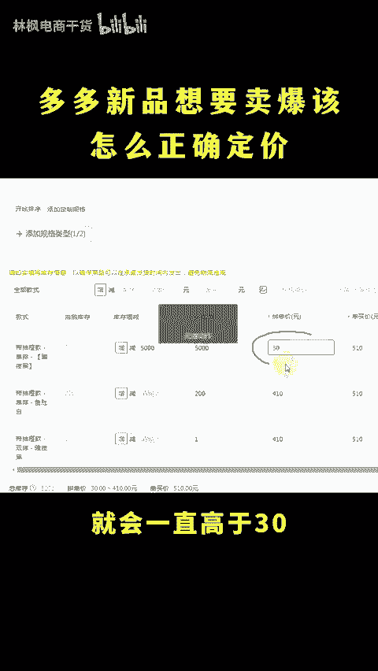
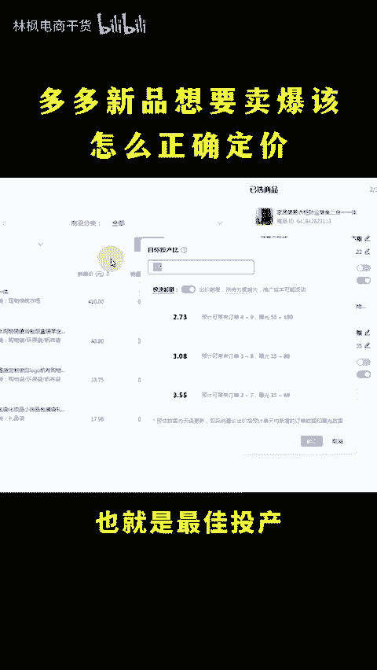
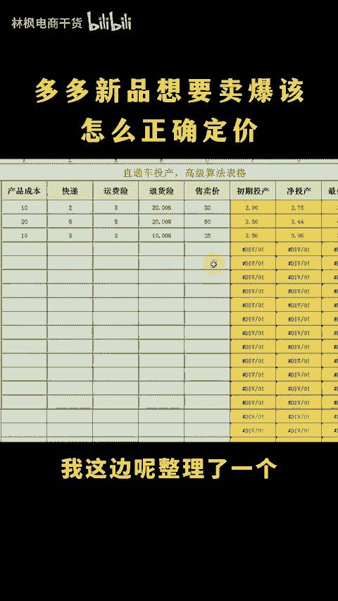

# 拼多多怎么定价卖的多同时开车活动还有利润呢？ - P1 - 林枫电商干货 - BV1wC1yYHEBb

拼多多新品想要卖爆该怎么争取定价呢？直接参考同行的，没有同行就跨领域，同行卖多少，你就定多少，还能省下特价成本。我信你个鬼这个糟老头捡话怎么定价卖得多，同时开车活动还有利润呢。这么简单。

直接按照我这个公式来，花30秒时间教会你点个关注点个赞直接上13假设卖一单成本20，想要利润在1，那么拼单价呢就定30除以0。7等于42。

活动出降价空间上活动就7折提报不上呢设置12元的新个领领券这样平台记录的劣势最低就会一直高于30，链接上涨好了之后想要开车开的又快又挣钱啊。除了要会看数据做优化调整之外，投场的数字也很重要。

不会设置的按照我这套公式来啊，卖一单成本20利润有10块。那么保本投上呢就是30除以10等于3按保本投上起步跑个几天累积数据，然后再看退款比例，假设三天卖了100单退1单，退货率呢就是10。

再加上记入服务费罚款等等算5%。😡。

算出优化后的头产是3除以0。9乘以1。05等于3。5，这是净头闪，想要开车利润最高，头闪就要开到净头场的1。3倍以上，也就是最佳头闪，3。5乘以1。3等于4。55，不会计算的也没事。

我这边呢整理了一个盈亏头闪自动计算表格，填入数值自动出结果，需要的看这里。

