# 拼多多怎么才能做出爆款链接 - P1 - 森森2906 - BV1TUxieTErP

🎼每天一个必领起就行了？拼多多怎么才能做出爆款链接呢？爆款都是看运气的，哪能说爆就爆啊。我看是你实力不行吧。现在做拼多多啊想要做出一条小爆款链接其实并不难。

前提是你的内功布局一定要做好一个好的内功指定的链接的上限产品内功无非就是主图标题详情页SQ布局以及销量评价。内功布局好，这量少不了。具体怎么做呢？看这边视频比较常建议点赞收藏起来慢慢看全程都是干货。

相信一定对你有帮助。首先第一个就是主图，不会做图的，可以用美图设计师，一键抠图秒换背景，分分钟就能量产上百张原相图片免费而且高效。强调一下主图的第一张要做高点级的麻扁图，这是搜索坑位的展示图。

还可以搭配三主图做多渠道引流。后台打开商品素材，第一张是白底图，这个可以打通搜索页和分类页的流量渠道，第二张是长图，可以提高搜索页和店铺页等场景的曝光。😊。

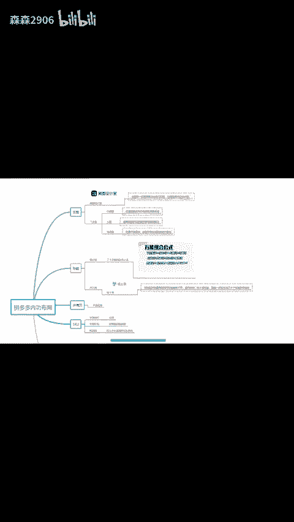

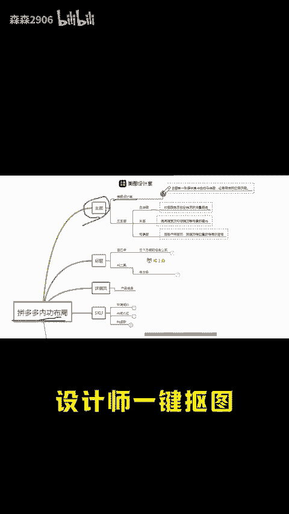

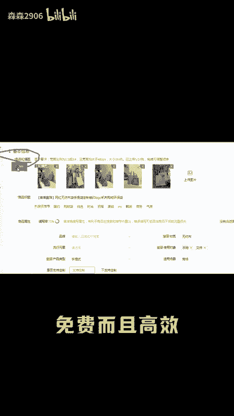

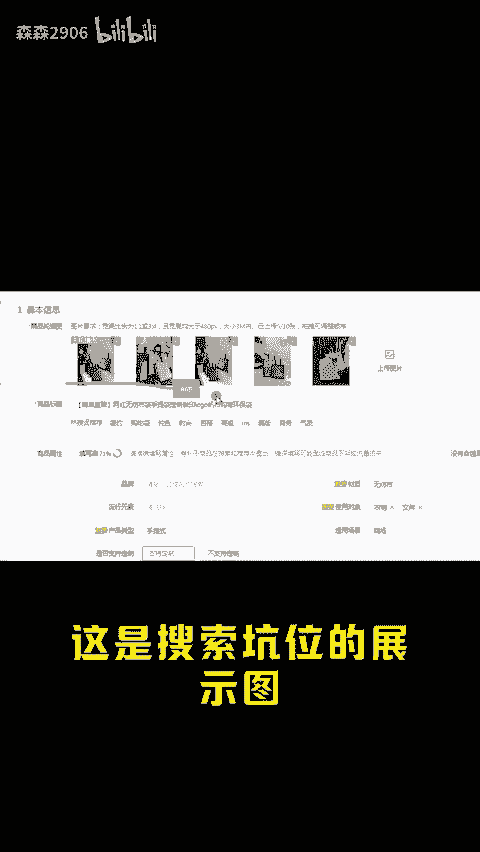

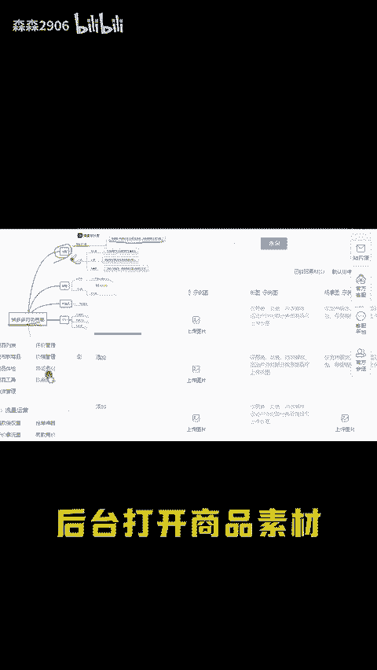

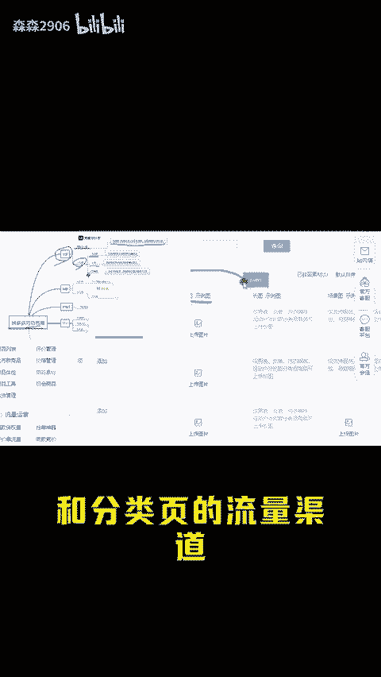

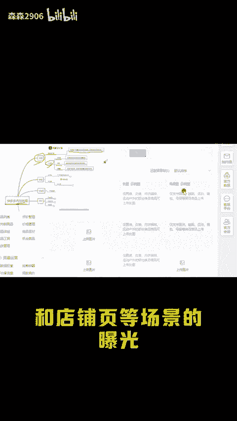

🎼第三个场景图在客户端首页频道页等位置获得展示资格，这些不做啊流量就白白浪费了。第二个就是标题，看这三个万能的组合公式，我报灯的链接啊都是这样写的。不想自己做标题的还可以用这个AI工具。

找到这种销量猫的同行标题复制下来进行拆词，导入组标题就能一次性分成几十个标题供你选择。详情页就不用多说了，把自己的产品信息上传上去。第三个就是SKUSKU不要做太多，外路低价做引流。

中间价位加营销词做承接，利润大的规格打上小火苗做对比，拉转化，环环相扣转化非常高。第四个就是销量评价啊，可以用这个工具改一个销量，再用这个工具一键采集优质好评。想要做出一个小报的链接。

以上的每一步啊都不能省略。链接流量起来以后，就在链接的基础上做一个矩阵裂变，A边的10条20条。现在做拼多多的思路一定是多店多链接，一条链接出个几十单，几十条链接就是几百单。

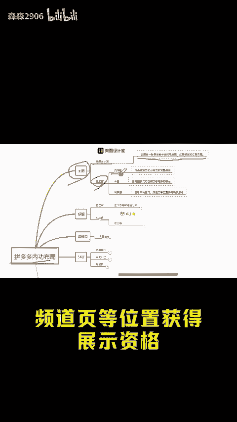

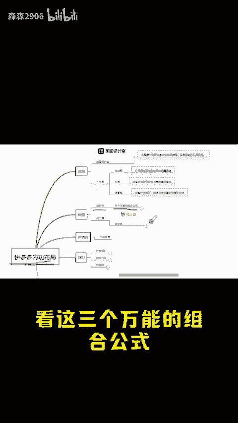

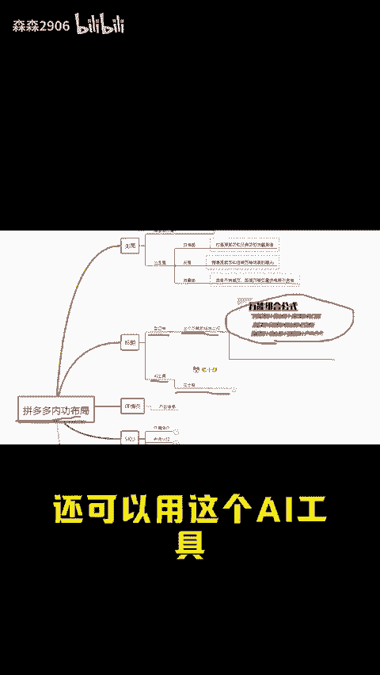

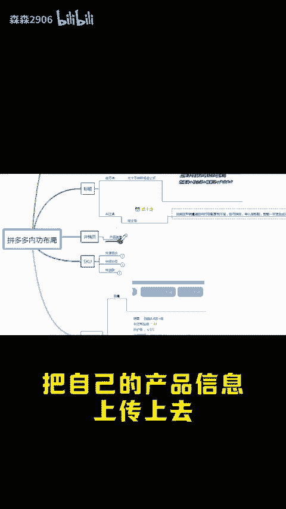

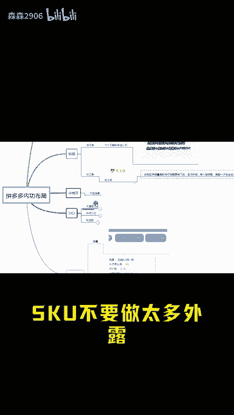

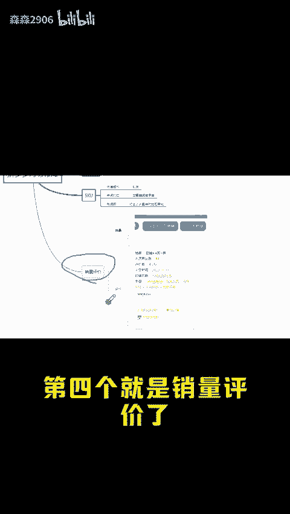

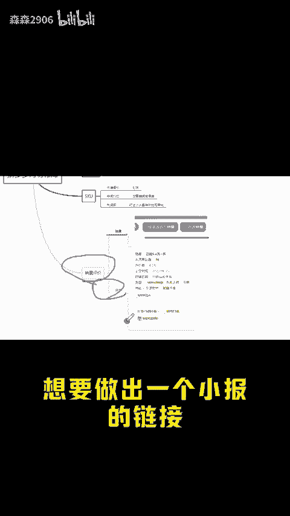

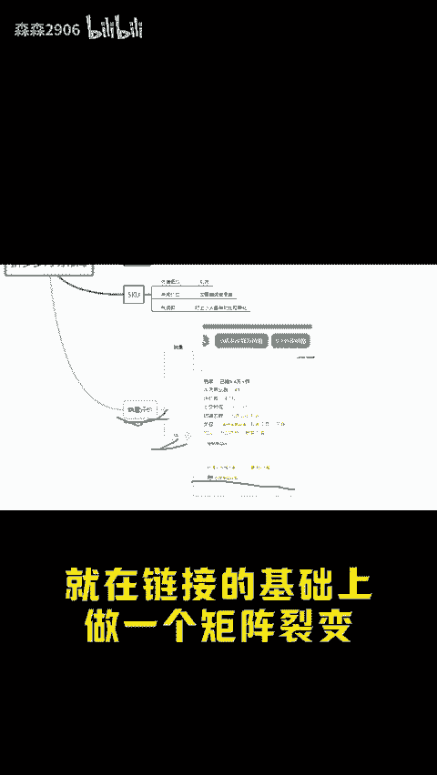

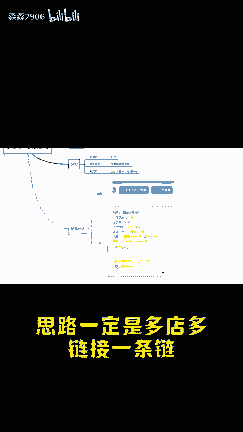

🎼路还是客观的，还有什么不懂的或者找不到工具的，后台扣1。下期给大家讲讲内功做好之后怎么开直通车。

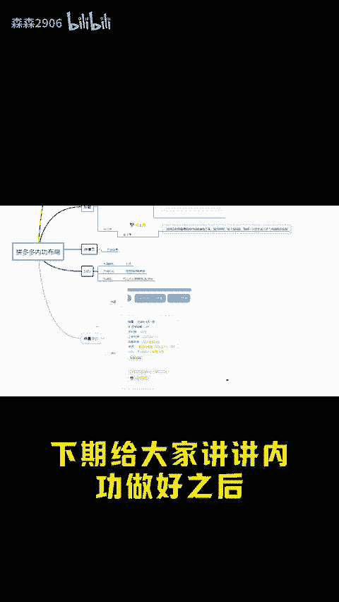