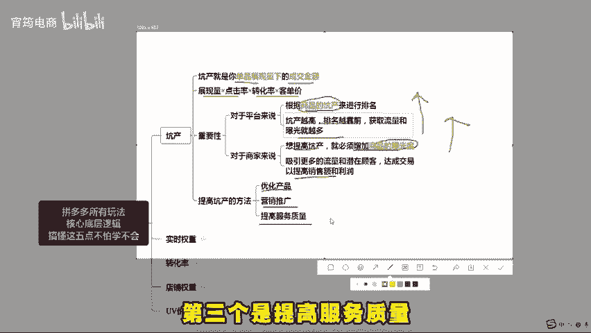
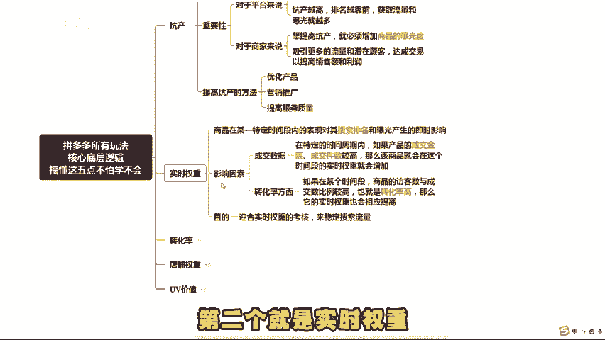
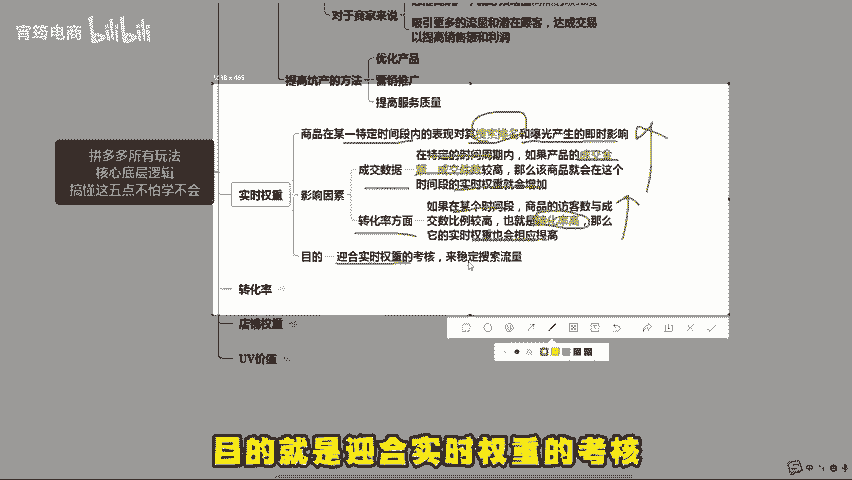
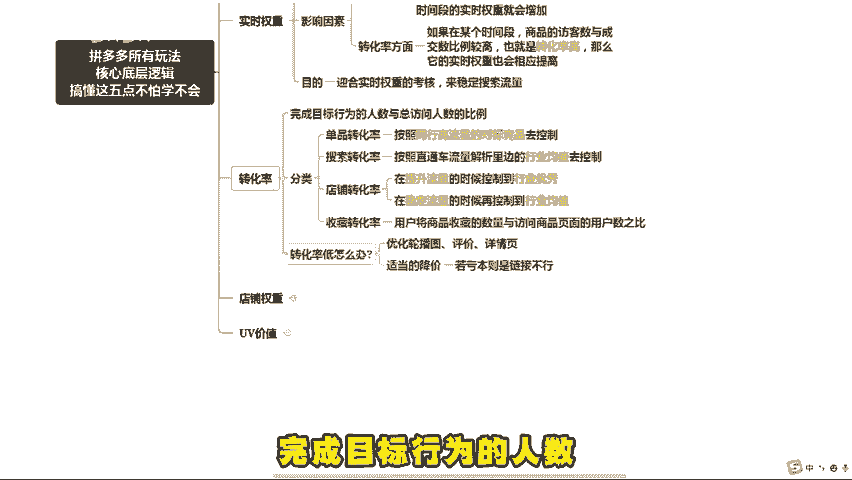
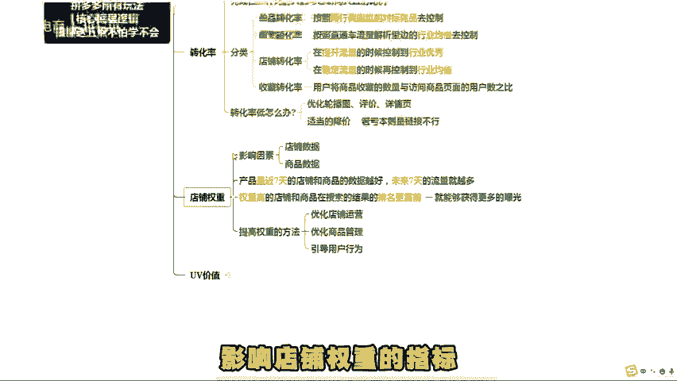
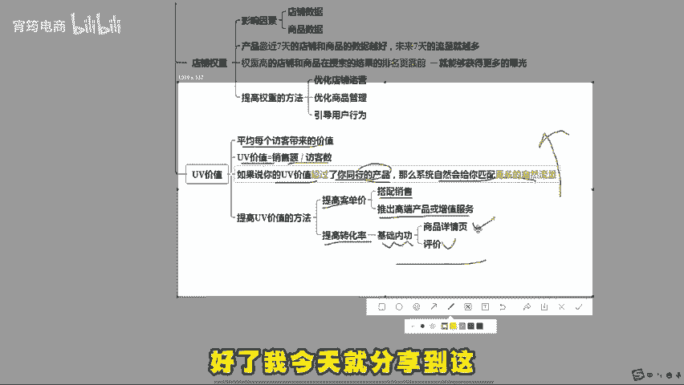
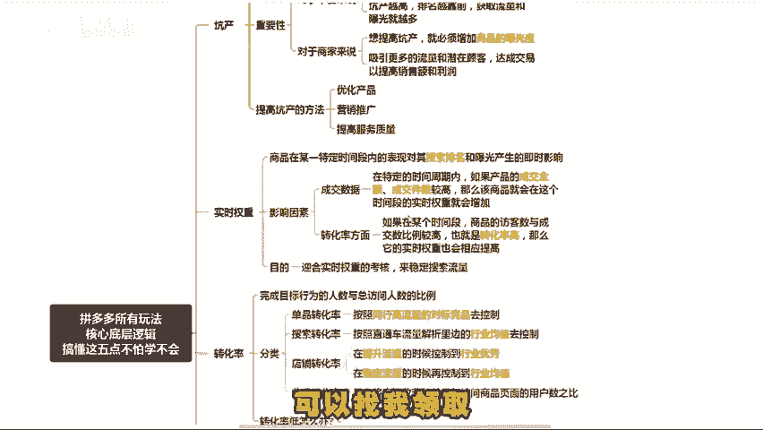

# 拼多多所有玩法核心底层逻辑，总结出来就这五点，学会了也能自创玩法（拼多多开店｜拼多多运营｜拼多多实操｜拼多多新手） - P1 - 宵筠电商 - BV1Qu1mY3EoA

不管你是新手还是老手，在拼多多这个平台上，千万不要被市面上五花八门的玩法给忽悠了。比如前段时间的指数单玩法，其核心指标就那么几点。那么这期视频我会把所有玩法的核心要点整理出来。这些学清楚了。

你自己也可以设计玩法。本期视频有点长，建议大家点赞收藏起来，反复观看。第一个就是坑产。可能许多新手不太理解，坑产就是你单品展现量下的成交金额，及坑产等于展现量，乘以点击率，乘以转化率再乘以客单价。

对平台来说，它是根据商品的坑产来进行排名的。也就是说你坑产越高排名越靠前，那么获取流量和曝光就越多。对于商家来说，如果你想提高坑产，就必须增加商品的曝光度，吸引更多的流量和潜在客户，达成交易。

以提高销售额和利润。那么如何提高坑产呢，可以从三个方面进行。第一个是优化产品。第二个是营销推广。第三个是提高服务质量，内容比较多就不过多阐述了，需要了解的可以找我拿实操文档。第二个就是。

实施权重，它是指在电商平台上，商品在某一特定时间段的表现，对其搜索排名和曝光产生及时影响。从两个方面来说，成交数据方面在特定的时间周期内，如果产品的成交金额，成交件数较高。

那么该商品就会在这个时间段的实施权重就会增加。而转化率方面，如果在某个时间段，商品的访客数与成交数比例较高，也就是转化率高。那么它的实施权重也会相应提高。

所以大部分电商玩法中都会让你去控制实时进键词的成交以及实时转化率，目的就是迎合实时权重的考核来稳定搜索流量。第三个是转化率只在特定时间范围内完成目标行为的人数与总访问人数的比例。

单品转化率是按照同行高流量的对标竞品去控制。搜索转化率是按照直通车流量解析里的行业均值去控制。店铺转化率在提升流量的时候控制到行业优秀，在稳定流量的时候呢，再去控制到行业均值即可。

收藏转化率是用户将商品收藏的数。

量与访问商品页面的用户数之比。如果整体转化率较低的话，可以先去优化轮播图评价详情页这几个地方。如果说这些你的优化好了，转化率还是上不去，那就是价格的原因。你可以适当的降价。如果降价亏本。

那么代表这个链接你去做就很难做起来。第四个就是店铺权重。你像店铺权重的指标就是店铺数据和商品数据，产品最近7天的店铺和商品的数据越好，未来7天的流量就越多，权重高的店铺和商品在搜索的结果的排名更靠前。

就能获得更多的曝光，提高权重的方法可以从这三个方面来做。第一个优化店铺运营。第二个，优化商品管理。第三个，引导用户行为不懂的可以来问我。第五个是UV价值，也就是平均每个访客带来的价值。

其计算公式为UV价值等于销售额除以访客数。如果说你的UV价值超过了你的同行的竞品，那么系统自然会给你匹配更多的自然流量。提高UV价值的方法有两个。第一个就是提高客单价可以搭配销售也可以推出高。

端产品或者是增值服务。第二个就是提高转化率，还是得从基础内功下功夫，优化商品详情页和评价。这些吸引用户进行成交。好了，我今天就分享到这，如果你看完有不懂的地方，可以随时来找我，也可以向我提问。

同时我也准备了拼多多各个类目的实操文档以及最新玩法的拆解步骤，可以找我领取。最后就是所有的商家朋友都能早日报单。

