# 拼多多搜索指数单细节讲解，新老链接快速获取自然流量！ - P1 - 电商辰瑞 - BV1QmsfeGEZW

我们讲指数这个东西。为什么说有的人拍了有用？为什么说有的人拍了他没有用？什么叫做指数单？首先你们要搞清楚。指数单。为什么今年是玩指数的，你们知道为什么吗？😡，就为什么今年。今年。嗯，是玩什么玩指数单。

其实指数单它一直都有。一直都有。但是为什么说今年指数单它被额外的去放大了呢？这是因为以前干嘛呢？我直播间有没有做黑五类的？啊，这是因为黑5类他以前只要。

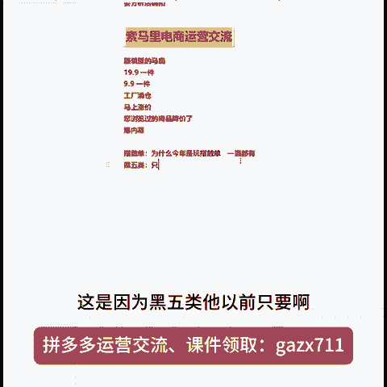

啊，这个是以前以前只要干嘛呢？能做出来。出来DSR，然后链接的什么呢？权重就很高，然后以及直通车呢也可以炸曝光。

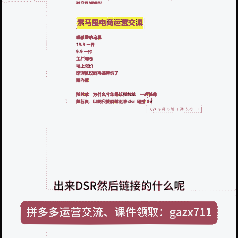

也可炸曝光哎，但是今年平台干嘛？把地也啥的。权重。削弱了，就相当于你们现在的DSR它已经没什么权重了，只是说平分了。就是DSR如果说你高啊，那么他就不会给你限流。但是你只要DSRD，他就会给你限流。

所以说DSR他就已经没什么权重的。那唯一的能够去做的，包括还有权重的就是什么呢？就指数单DSR它有权重啊，但是但是没有以前那么高，什么叫是指数单指数单，它就是通过什么呢？通过搜索的渠道然后呢。

进来的这个成交的一个行为，然后呢，没有被什么呢？平台过滤啊，进入了那个搜索。

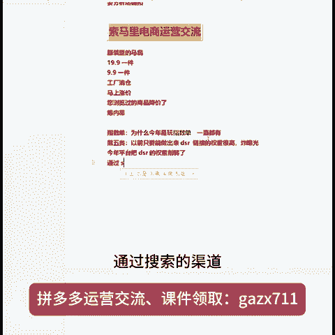

销售的指数，这个就叫做指数单。为什么说做指数单？

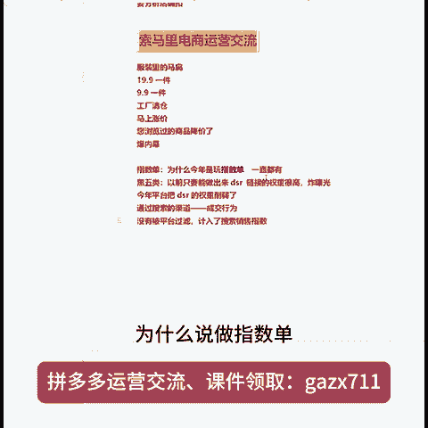

指示单为什么说有的链接效果很好？

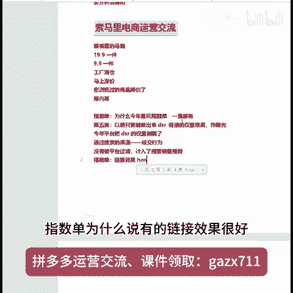

很好，包括为什么说有的链接效果。它不好，你们要搞清楚一个点就干嘛呢？我刚所讲的指数单，它是干嘛？它是通过搜索关键词下，然后去做的这个成交行为。所有的电商平台它都是赛马。

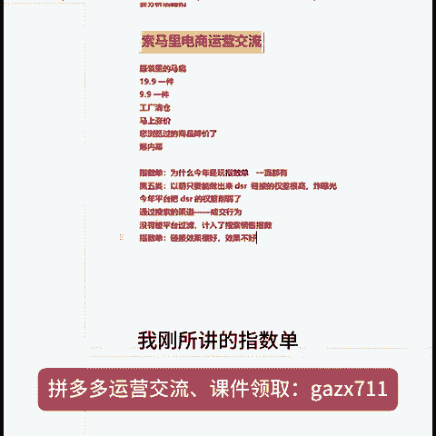

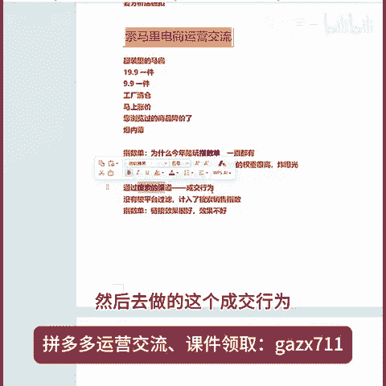

赛马即制？什么叫赛马机制？就是在看同样的时间段之内，谁的有效的GMV记住是有效的GMV以及有效的销量高。那么谁的排名就会靠前。那你如果说你做的是大类目，就是很大的那种大大类目，比方说呃食品百货家居日化。

包括家具、3C数码床品等等这些东西它都是大类目，那么大类目的话呢，它在搜索下和类目业下本身就已经有那种很高产出的商家了。那么你作为一个新链接，你即便是你在搜索下，你做了指数单。

但是你的成交就是有效的GMV包括什么呢？有效的销量，其实你是干不过同行的，就是相当于干嘛呢？以卵即石，就是同行的，它的产出很高。

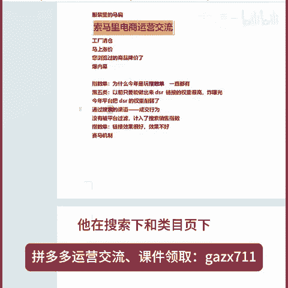

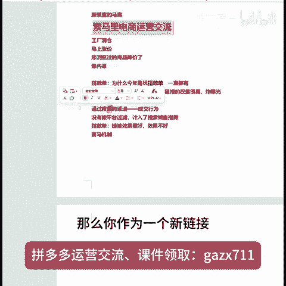

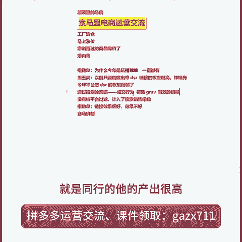

但是你的有效产出很低。所以这个时候你会觉得指数单对于你们的类目而言，它并不明显，知道吗？那么指数单它一般它作用于更多的一个情况下是什么呢？是当你去起链接，知道吗？然后过渡直通车。啊，二阶段的。嗯。

阿阶蛋。

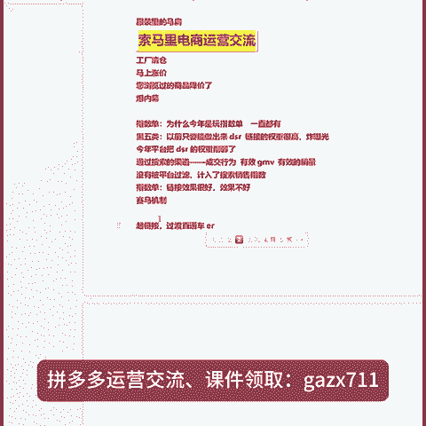

二阶段，然后包括直通车。炸曝光用的。

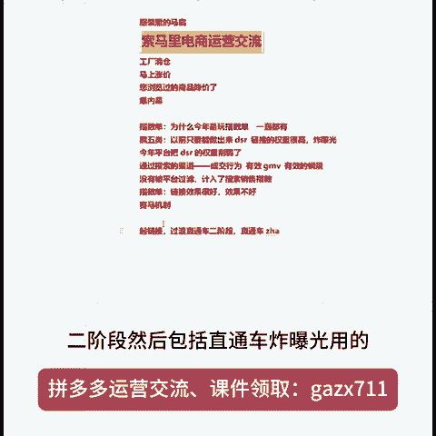

知道吧？他不是说这个作用，他只是说可以起到这样的一个作用。

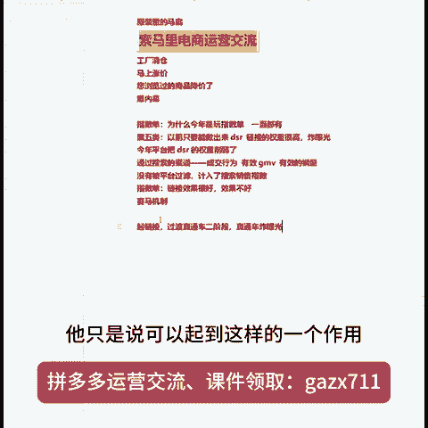

知道吧？要想所有的玩法，你玩的好，你永远逃脱不了什么呢？

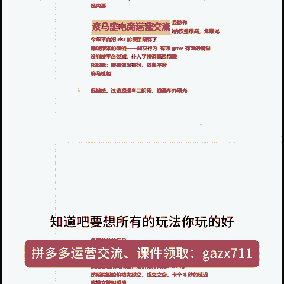

点击率以及什么转化率。那么点击率其实就是你的图片嘛，对不对？不就是你的轮播图嘛？是不是轮播图？轮波图包括转化率，转化率就是你的价格嘛，然后以及平台的这个比价信息，无非就是把这三个点搞定，然后再配合指数。

是不是你像马扁结合一些高投产，高投产的玩法，只要你链接稍微有一点价格优势，高投产它一样的活动指数单它就是。搜索下的成交啊，没有被过滤的。知道吧。你们其他帖子做做的啥产品啊？欢迎新进来的。

云号码这是啥年头的，谁用云号码呀，铁子。你用云你用云号码平台干啥？你不就是想做补单吗？你就回答我是不是。😡，这个什么蜗牛科技云号码平台，你是开注册店铺的，还是开用来跑S单的？哎，那种是解码平台啊。

没有手机号注册店铺的，你去办那种卡不就行了吗？呃，办那种就办那种虚拟卡就行了呀。你办过虚拟卡没有？就是那种低月租的虚拟卡，只要能接收验证码的就行了呀，也能用来注册店铺啊。虚拟卡的话，你在淘宝啊。

在拼多多一搜就一一大一大堆呀，用虚拟卡就行了，用什么云平台，不要道听途说，用虚拟卡就可以了。你像那个有几大几大平台的，他都有虚拟卡的。而且虚拟卡的话呢，它月租又便宜，一个月10块钱的样子吧。嗯。

肯定要实名认证啊。我跟你讲，你用云平台的话呢，你去注册店铺，它是有风险的。什么风险呢？就是如果说这个云云平台你跑路了，你那个店铺你都登不进去。你像你像虚拟卡，他几大不同的号商的话呢。

一个人他也可以办个两三张，那不那不不够你用了吗？只是说这些虚拟卡平台，他他玩不了，玩不了那种短视频的平台，你开店肯定是够用的啦。

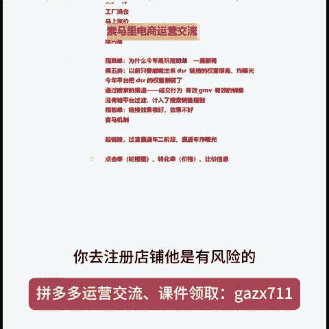

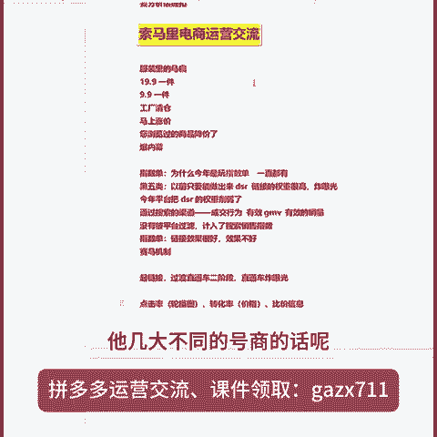

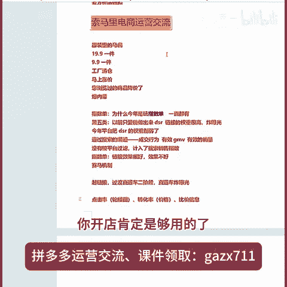