# 拼多多新品上架一招加四个字流量直接蹭蹭爆涨！ - P1 - 林枫电商干货 - BV13o2cY2E39

现在做拼多多新上架的链接，如果在标题前面加上这四个字，链接就能直接起飞。这里呢当然不是加什么拍一发三免费试用支持仅退款这种无下限的手段。今天这条视频看完。

只要你的标题搭配好这套操作就能够获得平台的免费推流。现在你的店铺新链接没有流量。大概率呢就是没有权重所导致的。所以我们想要新链接短期内起爆，并且直道年底电商的红利。那接下来的操作一定要仔细的听。

认真的学点个赞点个关注，直接上实操，首先打开我们的店铺后台，在发布产品的时候呢，千万不要点击发布新商品这里去发布，我们要先进入商品列表，再从发布机会商品这里去发布同款产品，进来之后。

我们再点击消费者正在搜，选择好你的二级类目，然后排序。这里按照热度去排序，再选择热度高。相关性强的产品去发布同款就能够获得新品标以及机会商品标。这套玩法的重点就是在上传同款的时候呢。

一定要手动的去编辑修改你的主图标题和S给这三个地方，首先主图我们点进来。只需要留一张机会。

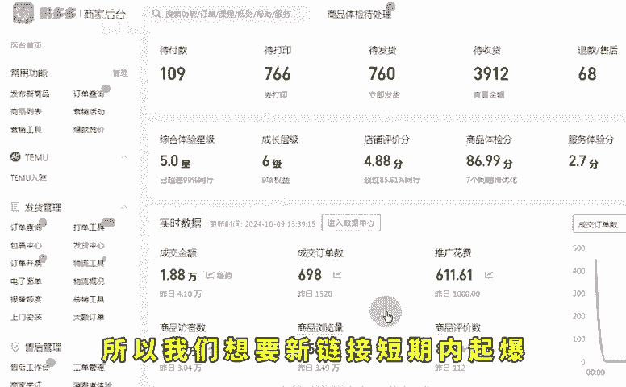

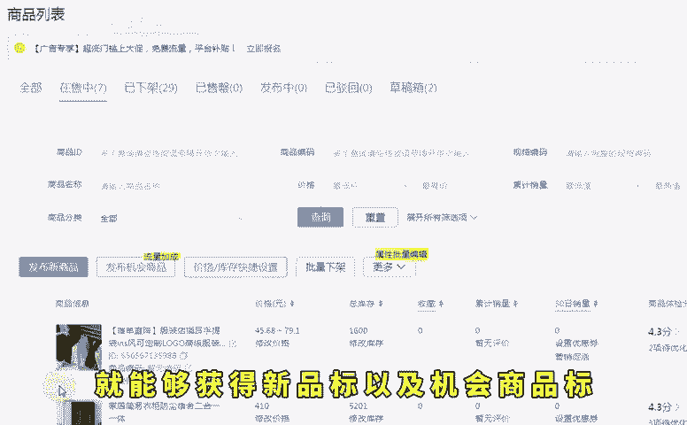

默认的图片就可以了，自己再做几张码点的图片上去，然后进入第二步操作。这一步呢非常的关键，把这一步做好，你的自然流量才能跟同行拉开差距。就是在我们的标题前面加上新客立减这四个字。

我们把这四个字呢配合接下来的操作，在店铺营销里面找到营销工具，创建一个新客立减，按建议设置优惠券，创建成功之后，这个链接就有了三重的权重加持，机会商品标新客立减营销文案，再加上新客立减券。

既有权重还能提高转化。当然到这里还没有结束，最后一步就是做一个矩证关键词进一步放大流量入口，在链接编辑中找到装修商详在详情页中间添加文本组件，然后在这里把产品关键词和同行的热搜词都加进来。

然后把颜色改成白色隐藏起来，这样就算爆单了。同行想抄都没得抄。当然做这个操作，你得配合仿比价操作，与同行错开类目流量，防止被比价抢排名，能更好的把店铺运营起来了。防比价大家可以直接利用AI的仿比价工具。

把这套SKU全部导入进去，系统呢。😊。

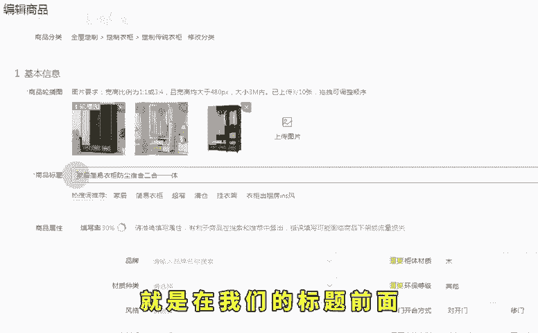

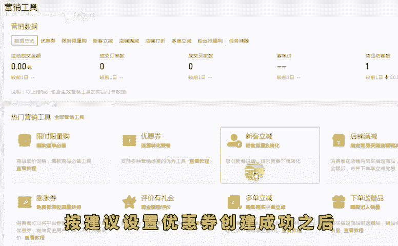

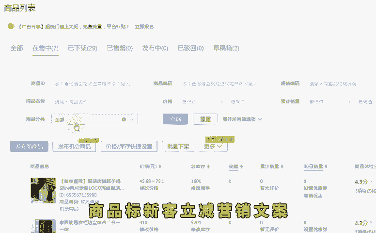

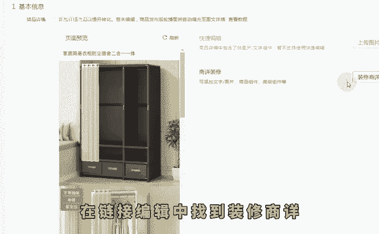

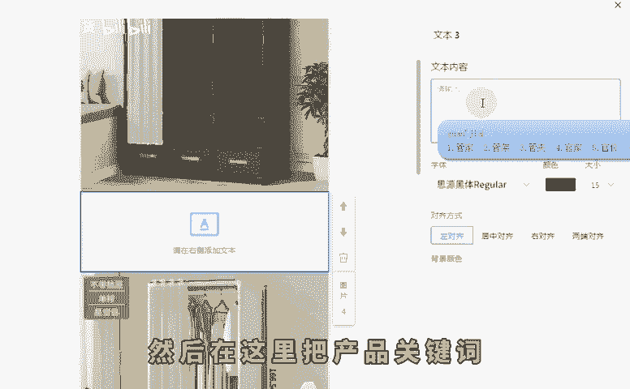

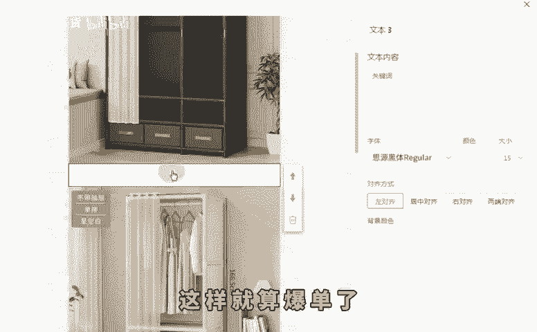

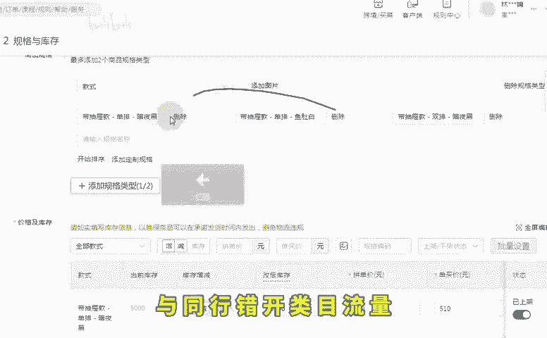

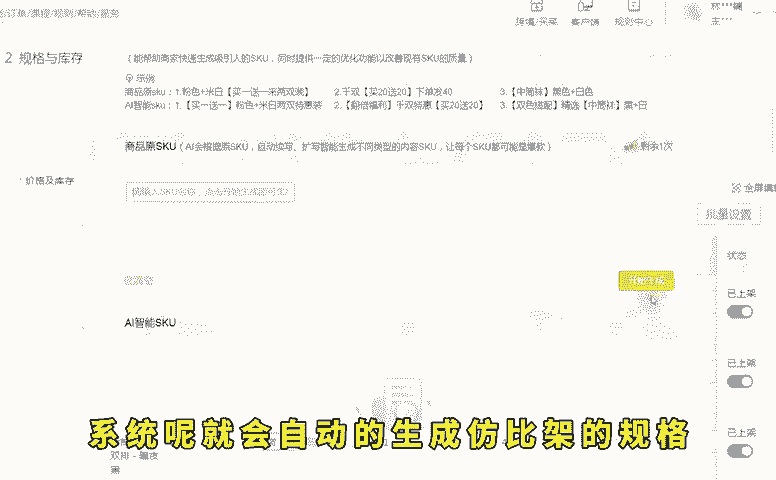

会自动的生成仿比价的规格，然后直接再搬运到店铺的SKU里面去就行了。听懂的抓紧时间去落地实操。如果说你不懂的，这边也整理了综合运营包。

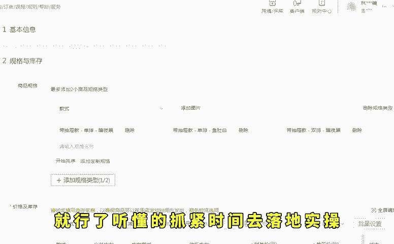