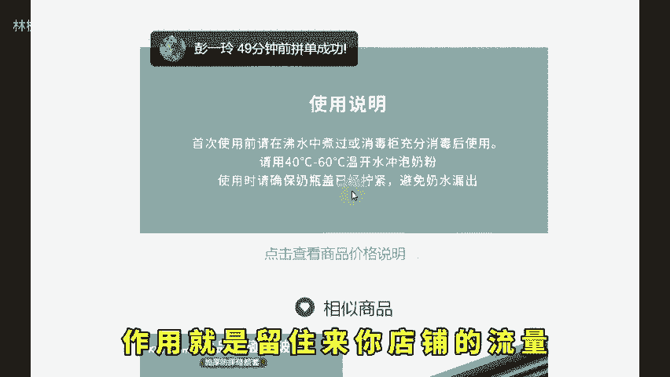
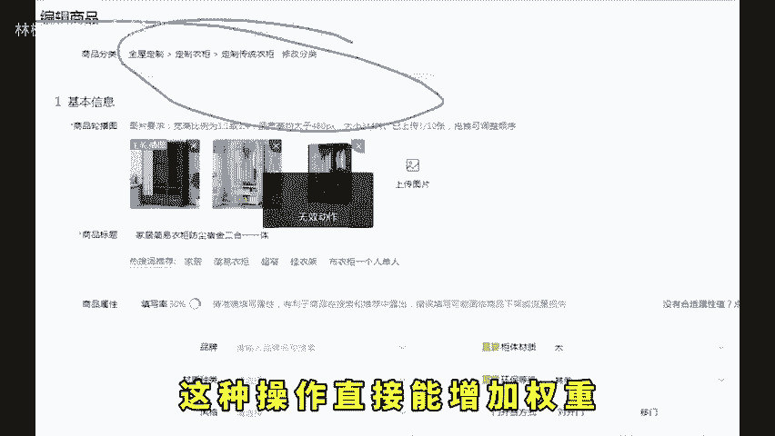
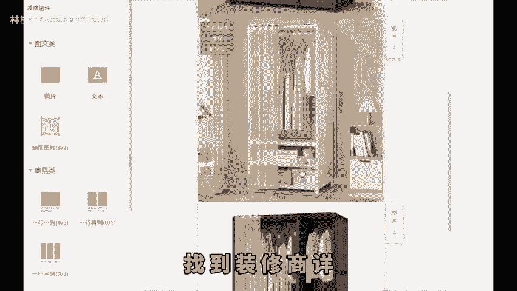
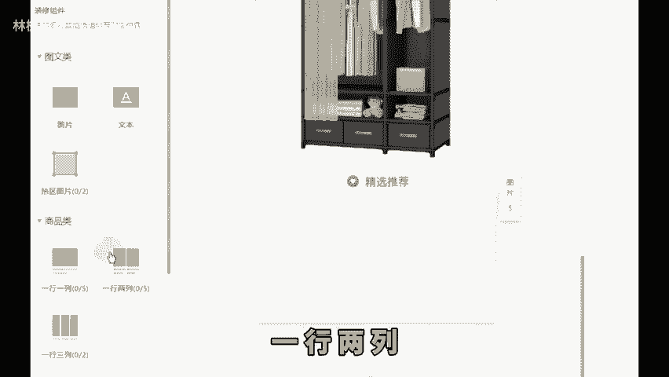
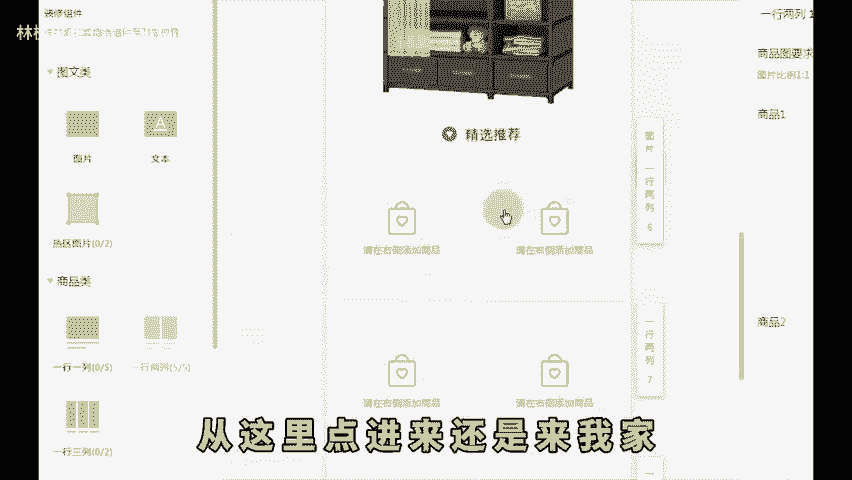
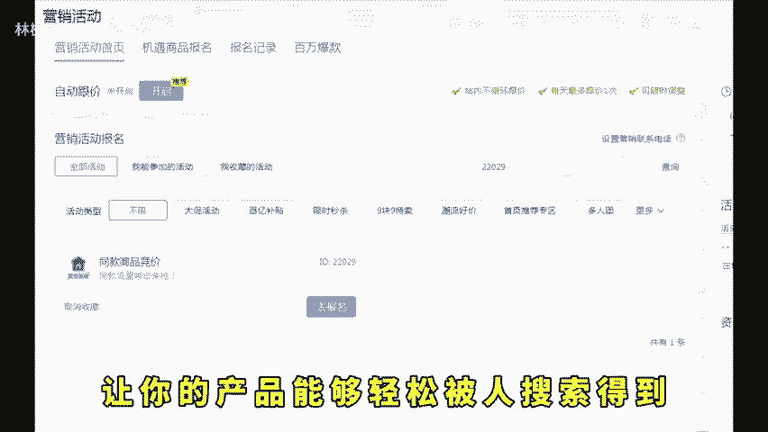
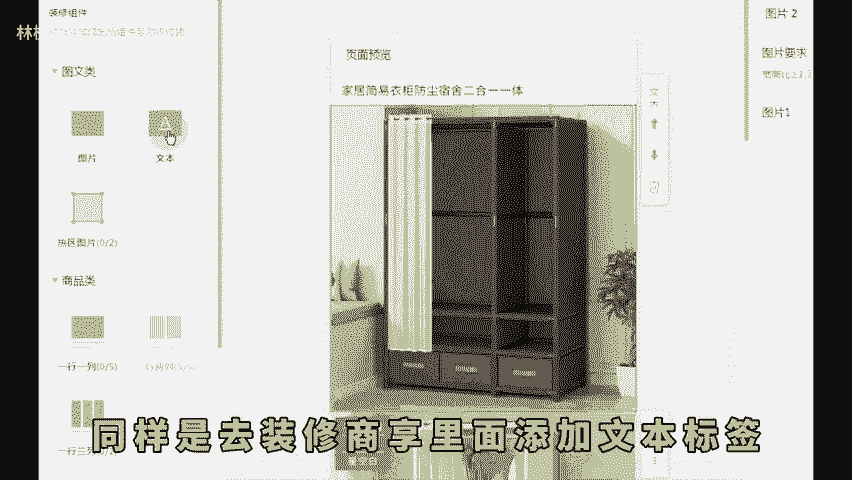
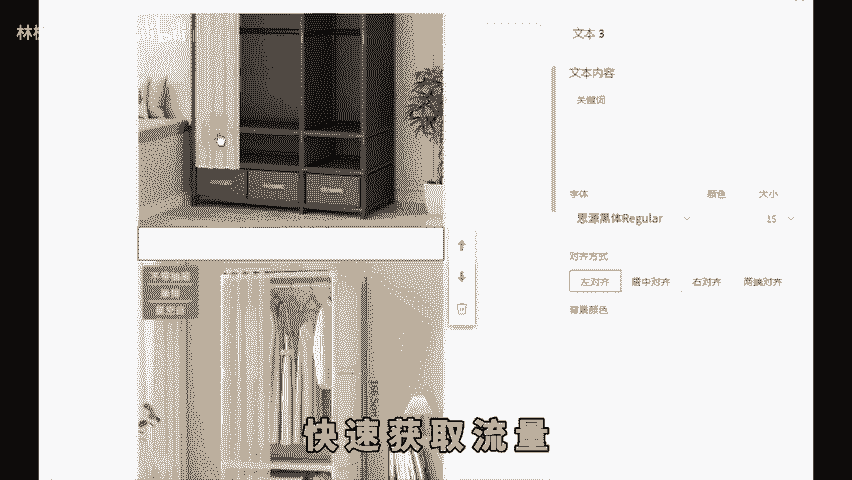
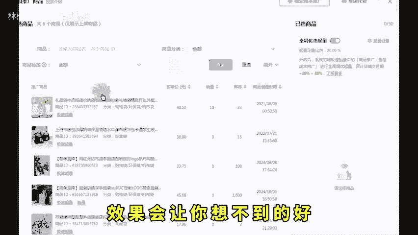

# 拼多多新品上架做好两个操作体量翻倍烦恼少一半！ - P1 - 林枫电商干货 - BV1EN2UYoE1g

拼多多新手坐店，千万不要上架就不断开车，这样大概率是起不来的，想要流量效果好，一定要先做两个超实用的技巧，一个能提高流量，一个能提高转化率，99%的商家根本没做过两个技巧，几乎适合所有产品。

上架后起量速度能比同行快3到5倍，先点关注再点赞，让你坐店烦恼少一半。第一个做房跳出超链接，这操作有点隐晦和难度，作用就是留住来你店铺的流量，增加消费者在你详情页填入时长。这个能加权重。

也能避免他们在这儿点到别的链接，我们通过设置可以让他们点击后还是进入到我们的链接，这种操作直接能增加权重。所以有必要设置，先进入商品边界面，找到装修商详，先在详情页最下边加一张精选推荐的图。

然后点击商品类组件，一行两列，点一下就增加异型，你多增加几行，做出来的效果会更好。然后把产品和图片都设置成自己的它的效果就是这样。这样一操作。

就算买家想点其他产品从这里点进来还是来我家同时搭配活动22029报名成功就能把产品展示在同行。

详上方同时打上同款低价，主图做的高端一点流量转化就少不了，非常实用的小技巧啊。看到这儿了，你点个赞不过分吧。第二个能大幅提升流量，而且你还不需要花一毛钱，就是配置行业热门词，可能这个是很多人第一次听说。

让你的产品能够轻松被人搜索得到，操作和上面有点类似，同样是去装修商详里面添加文本标签，然后把下拉框的热词，同行标题里的好词都编辑到这个里面来。只要有人搜索，你就有可能出现字体颜色设置成白色，给隐藏起来。

不然别人同行就知道你在干什么了。这种操作能增加你产品的属性标签，关键词标签，快速获取流量。你如果说这些基础搞好，你在后面再去推广引流效果会让你想不到的好，听懂的，抓紧时间去落地实操。如果说你不懂的。

这边也整理了综合运营包，左下角拿取。😡。

