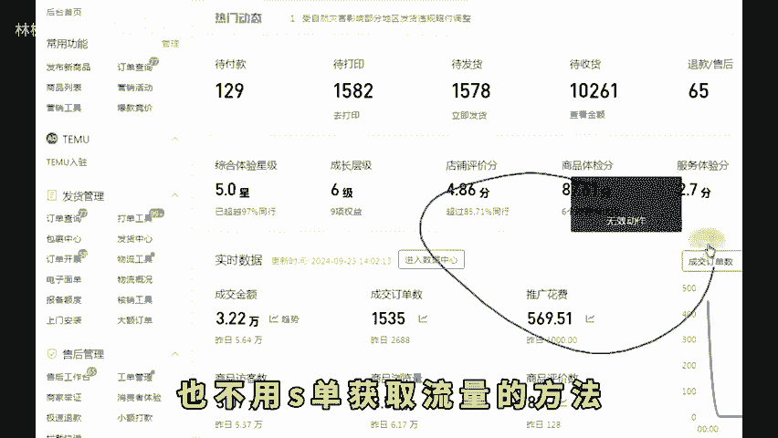
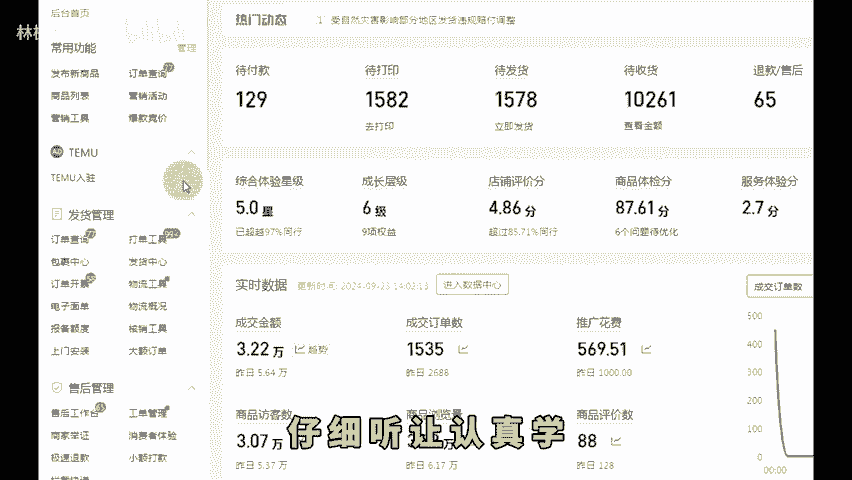
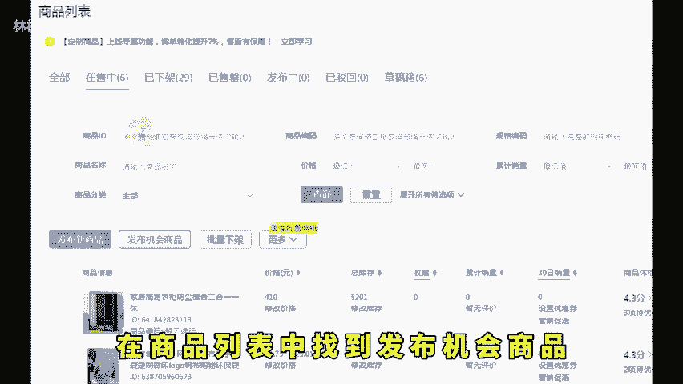
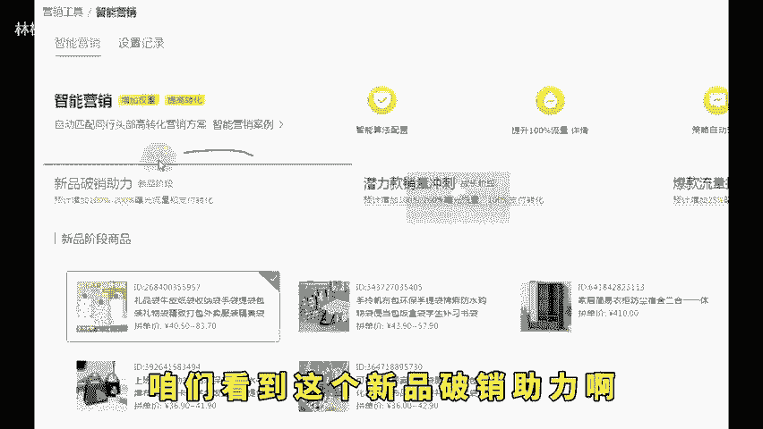
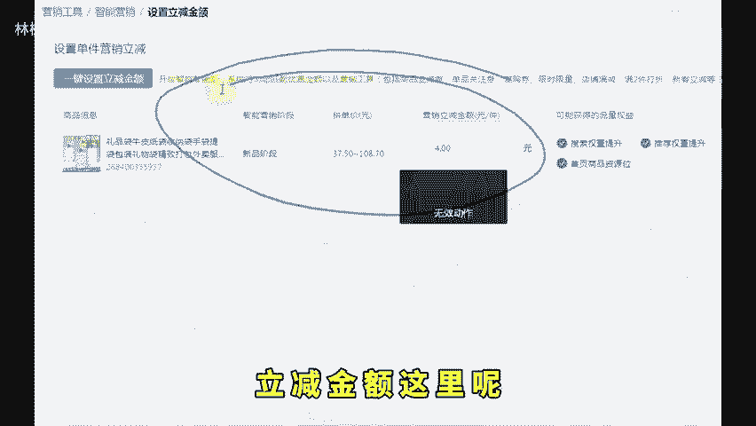
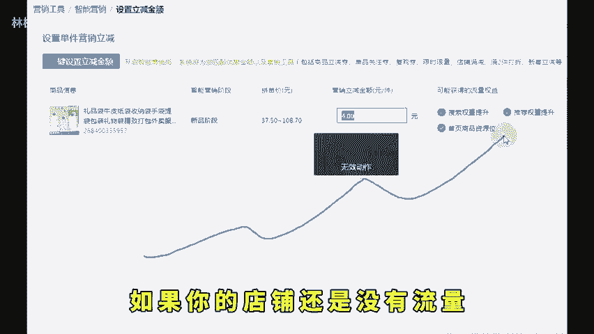
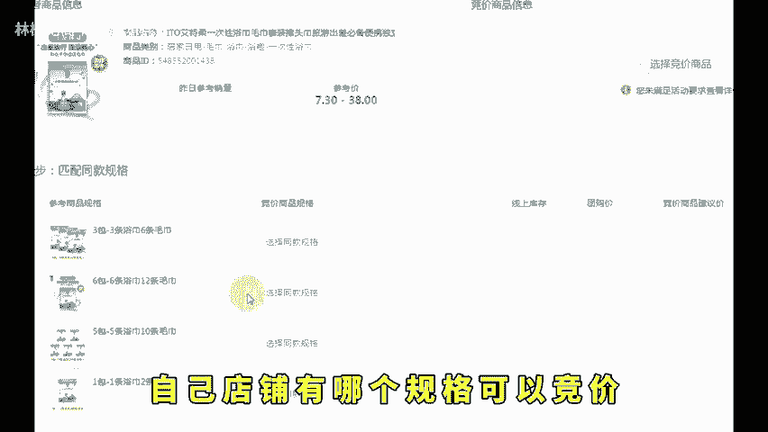
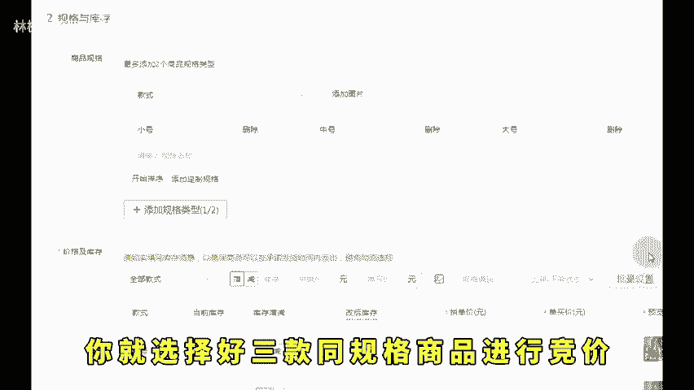
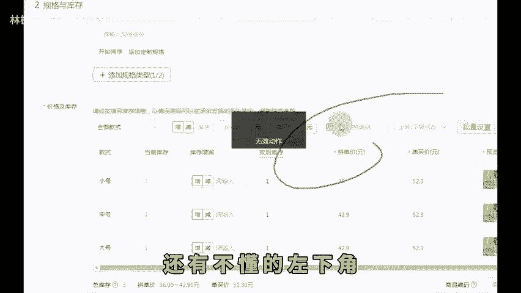

# 拼多多新品上架做好这两点七天就能做到访客破千！ - P1 - 林枫电商干货 - BV1KAsDe3EnN

🎼现在做拼多多啊，大部分新手是不是上架之后开车补单，然后做评价这三个操作不光投资大，而且还不一定有效。如果你学会这个不用开车，也不用S单获取流量的方法，那么你才算真正的入门的拼多多。

今天就请你花一分钟时间啊，按照我接下来要讲的这个操作，7天时间就能让你赶超同一时期的竞争对手仔细听，认真学。我只讲一遍，大家也可以点赞收藏起来反复观看。那么第一步呢在商品列表中找到发布机会商品。

然后我们点击消费者正在搜这个入口。这个是目前免费流量很大，并且知道这个入口的商家还不多的操作，在页面的下方选择跟你商品相关的产品，排序这里呢我们选择热度从高到低的商品，然后点击发布同款。

就可以让你的链接，打上机会商品标来获取流量加权。第一步这里呢我们至少要准备三条链接，为的就是万一你哪一条链接呢，操作失误限流了。我们的店铺也不会有空窗期。那么做完这些之后，第二步打开后台的营销工具。

找到智能营销，咱们看到这个新品破销助力啊，选择好需要操作的产品，然后点击下一步设置立减金额。😊。

🎼立减金额，这里呢我们就设置3到5块，这样子设置完之后啊，系统会给你分配首页资源位的流量，同时获取搜索和推荐双重加权。这里面呢都是真实买家进店成交之后权重有多高，就不用我多说了吧。做完这两步之后。

如果你的店铺还是没有流量，该怎么办？来看这里，今年啊官方新推出的爆款竞价工具。很多运营都在闷声发大财，不跟你们讲，那么我告诉你这个工具。你要是能上一波什么低业42分啊，直通车开不动啊等等这类问题啊。

通通给你解决掉。我们点进来之后呢，找到同款并且参与竞价进去之后你就能看到自己店铺有哪个规格可以竞价。然后对比一下，看一下这几个竞价亏不亏，只要我们亏的不多，你就选择好三款同规格商品进行竞价。

然后我们利用链接里面的其他规格来进行获利。只要竞价成功，你就可以零成本获取别人的广告位和搜索位的流量了。还有不懂的左下角。

