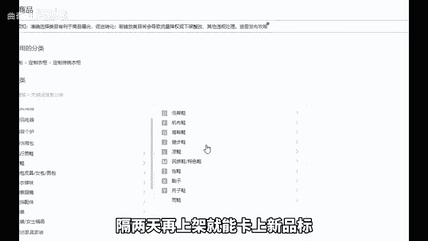
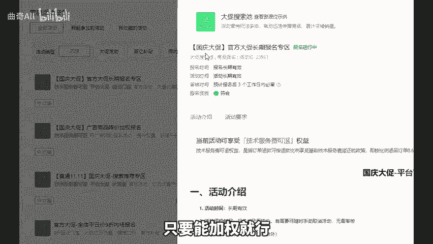
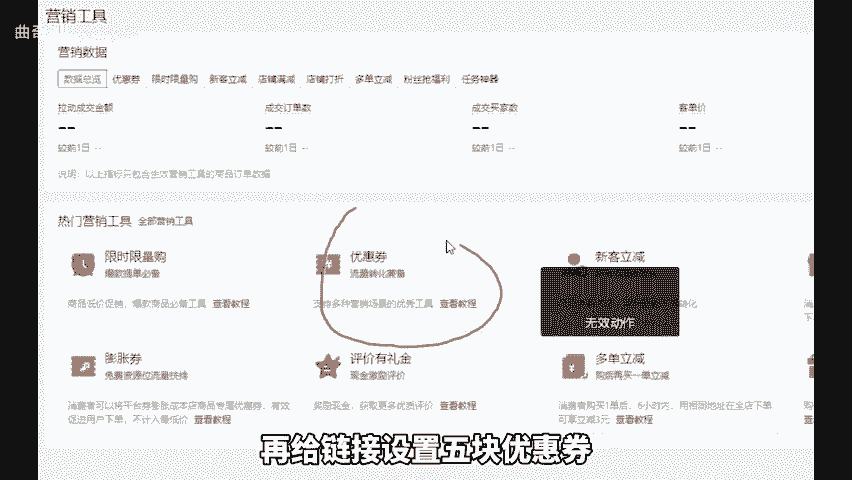

# 拼多多新品上架后学会这四个技巧，不推广就能出单！ - P1 - 曲奇All - BV1snxQerE8s

如今，拼多多竟然还有上架后不推广就能出单的好事，这并不是玄学，也不是黑科技，你只需要掌握这四个实用小技巧，就能不花一分钱实现出单。尤其是第三个技巧，建议所有店铺都去尝试一下，点个关注，点个赞。

直接上实操。首先第一个技巧是机会商品在上架时从这里进行操作。上架后将产品细节图片标题SKU改为自己的产品即可。接着第二个技巧是新品标。服饰鞋包类会自带新品标。其他类目可以自己卡标签。

先切换到服饰鞋包类目上架产品，随便报名额活动，然后下架产品，隔两天再上架就能卡上新品标。另外第三个技巧是新品原价上大促，先不管卖的好不好，只要能加全就行，可以直接原价上。如果不会操作。

可以翻翻我往期的视频，最后第四个技巧是设置优惠券，定价先提高价格5块，再给链接设置5块优惠券，大概率可以卡上低价精选横幅，大大提升点击和转换率。有条件的可以去把销量做个几万几10万。

这样去给新链接打基础，连直通车都。

不用开就能出单，又省一笔开支。好，今天的分享就到这里，还有不懂的可以后台找我，不知为你解答，还给你分享一份我整理的店铺综合营包。

