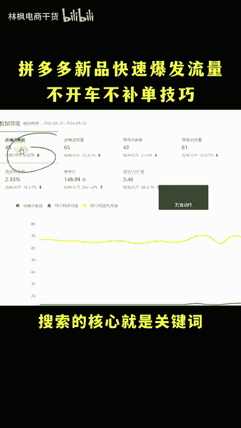
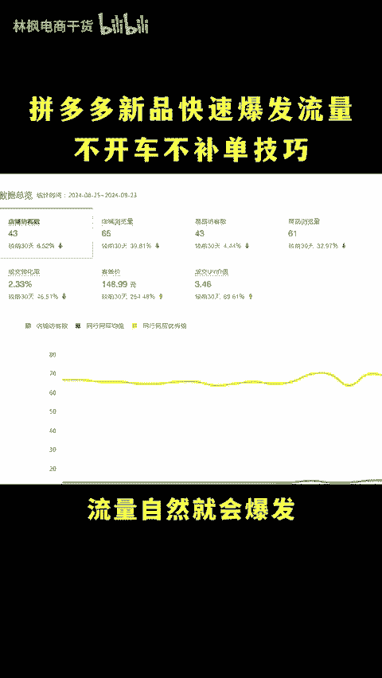
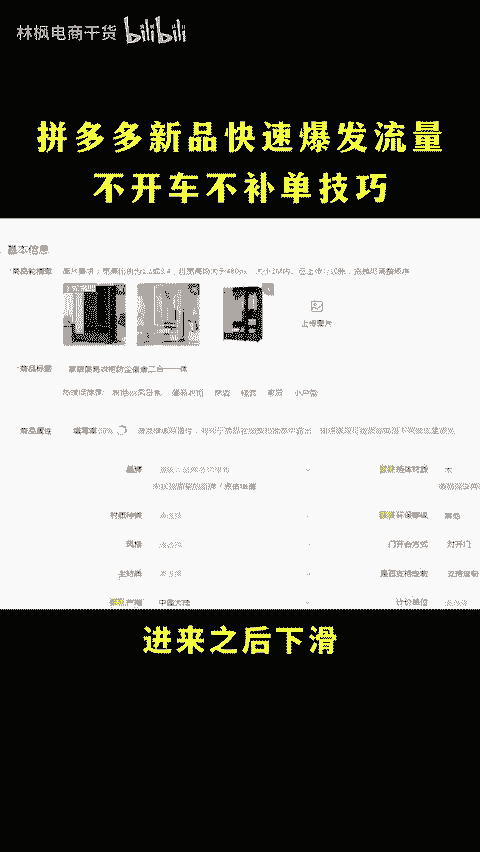
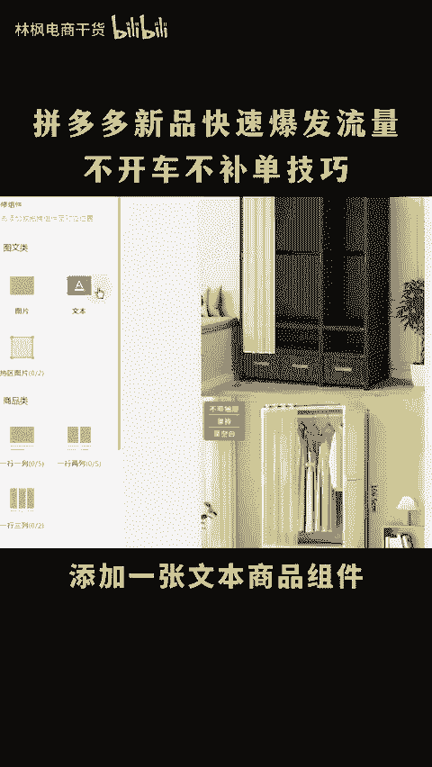
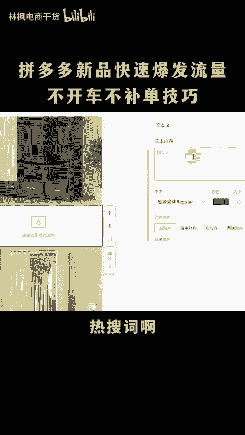
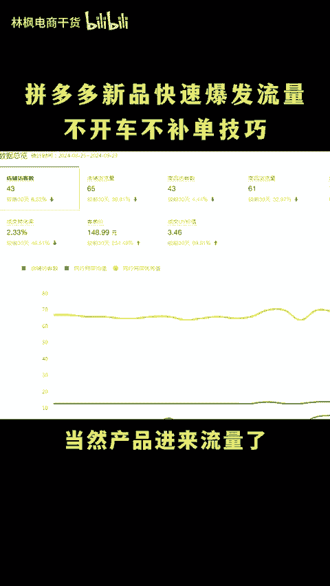
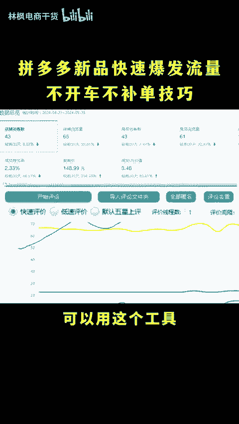
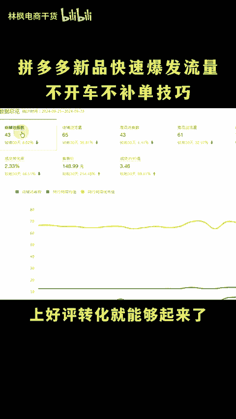

# 拼多多新品快速爆发流量的技巧不开车不补单！ - P1 - 林枫电商干货 - BV1NusreLE4r

现在做多多有没有让新品快速爆发流量的方法呢？当然有了，上在改百万销量几千好评，然后做几百搜索单，直接投放商品推广，不限额告出价，流量想不报都难。😡，o my god，怎么做新品快速播放流量成本还低呢？

今天就花30秒的时间啊，教你一招，大家可以点赞关注一下，直接上实操。😊，我们都知道流量的来源呢是搜索搜索的核心就是关键词，一般产品关键词只有标题的30个字而已。而我们用这个玩法。

新品呢就能够直接设置几百上千0个关键词引流关键词变多啊，流量自然就会爆发。首先我们打开后台找到商品列表，在链接这里啊点编辑进来之后下滑找到装修商详点击进来之后啊，在每两张详情页下面啊。

添加一张文本商品组件，然后呢把你竞品的引流关键词和下拉框相关性高的热搜词啊都给它添加进来，觉得麻烦的，你也可以直接把竞品的标题复制过来啊，再把颜色改成井号6个F也就是白设，这样同行就发现不了了。

就算你爆道了，它也无法照搬，这样设置好之后，第二天流量就会爆增。当然产品进来流量了，得转化成单才是。那么影响转化的核心就是评价了。可以用这个工具，零成本做评价。

只需要输入同行竞品的ID一键采集优质评价上好评，转化就能够下来了。还有不会的看这里。😊。

