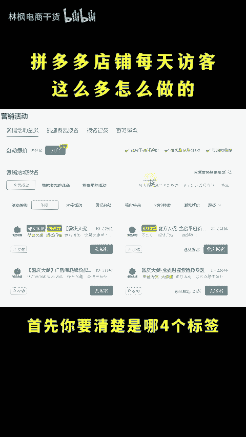
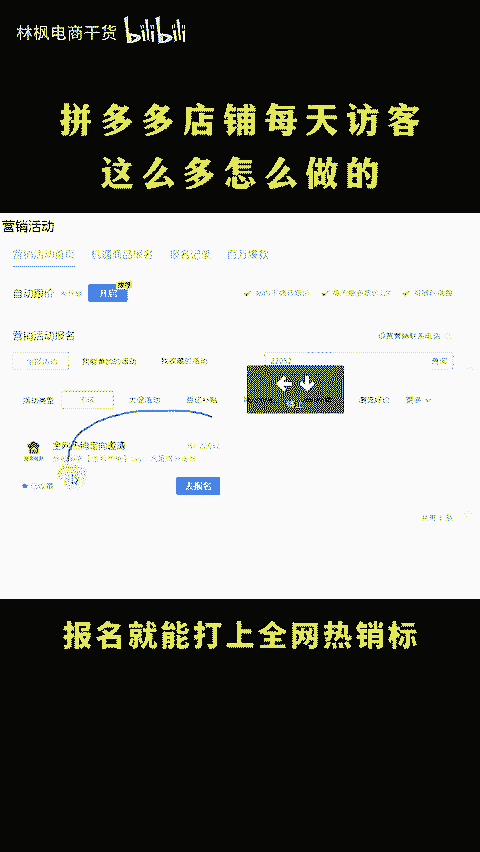
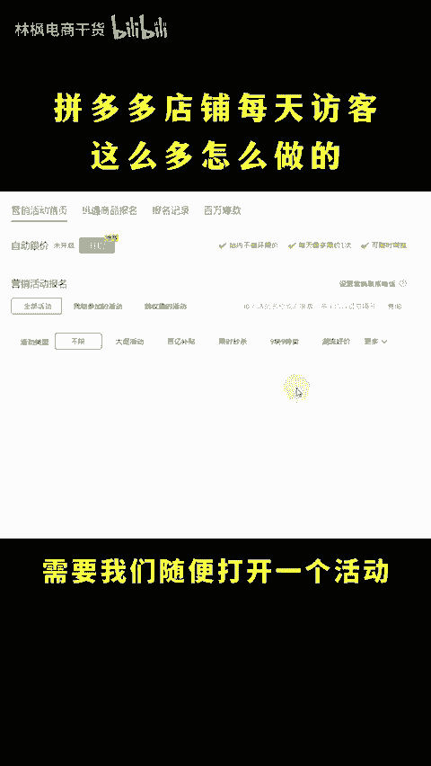
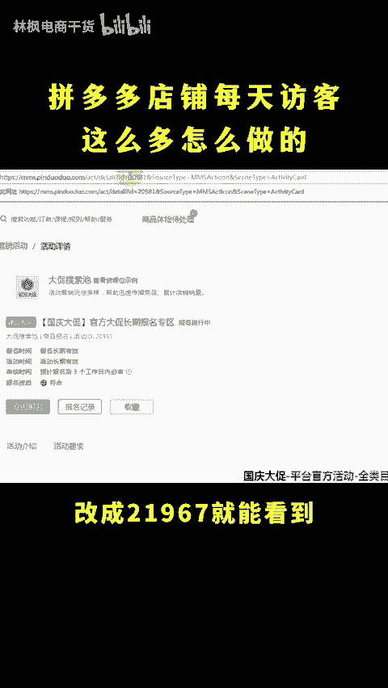
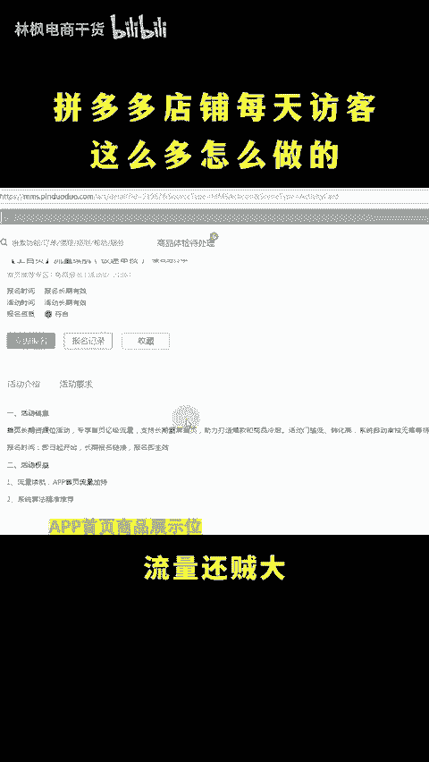

# 拼多多新品每天访客大几千都有做哪些操作？ - P1 - 林枫电商干货 - BV1igxjehEtE

做拼多多店铺每天这么的房客是怎么做到的呀？这有什么难的，每天破损百来单，然后直接高价开直通车花大几千，访客还会少吗？😡，🎼Oh my god。

あ？🎼金店怎么做到大几千的访客呢？我就做了一件事情啊，就是给我的链接呢打上4个官方流量的标签，流量来了，挡都挡不住，点个关注，点个赞，直接上失超啊。首先你要清楚是哪4个标签，全网热销标。

全网低价标多少天低价和限时优惠闪电标，想要打上这些标签其实也很简单。只要报名活动就能打上。后台打开一项活动，搜索22084报名就能打上全网低价标，搜索22052报名就能打上全网热销标。

搜索20303报名就能打上多少天低价，搜索22196报名就能打上限时优惠闪电标，这些活动不用降价就能打上。另外还有一个隐藏活动，很多人都不知道的，就是流量续航活动，这个活动直接搜索ID是少不到的。

需要我们随便打开一个活动，在活动的详情页上方的完整了，手动把这个ID改成21967就能看到回收的记录就能报名，无需时候无需比价，流量还贼大，还有不会操作的左下角。😊。

