# 拼多多新品没单这三个步骤肯定没做好！ - P1 - 林枫电商干货 - BV17v2bYvEAW

现在做拼多多一个新品的，想要快速拉升的，应该有三步，很多朋友做不起来呢，就是把这三个步骤经常忽略。第一部分应该是做店铺的权重。第二部分是做链接的测试。第三部分啊是把这个链接把它拉升打爆啊。

如果这三个步骤你少了第一步有可能直通车开不动。如果你少了第二步，可能你这个链接它没有爆款属性拉升之后呢会造成持续的亏损，所以这三个步骤是缺一不可。第一步我们要做的是提升店铺的权重啊。所谓店铺权重呢。

就是店铺的层级啊，DSR平分店铺的坑产这些东西，那我们首先上新5个链接，那如果你是非标品，那上5个款式不同的链接啊，价格段统一，风格统一就可以。如果你是标品啊，建议呢把同一个链接裂变。

那所谓裂变就是标题不一样，主图文案不一样啊，SK又不一样，价格不一样，然后呢做一周的大额坑产单。这大额坑产单怎么做呢？就是你直接分享链接，找一个人进店，把这5个链接每一个300块，这样就1500，对吧？

原则上一个大单不超过2000块就做一周做一周的目的是提高店铺的层级和。

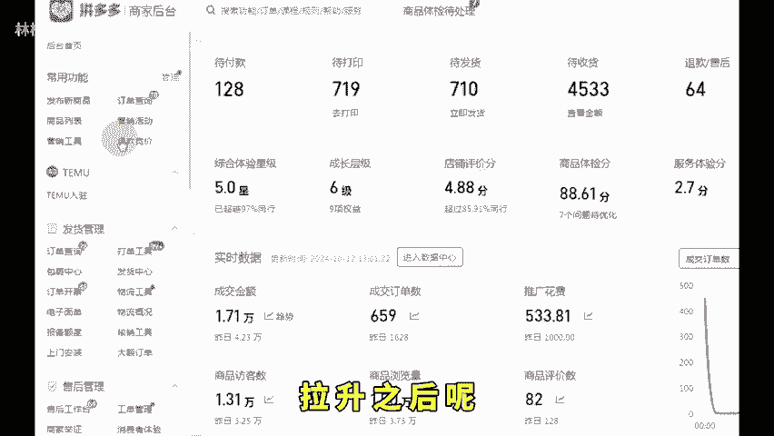

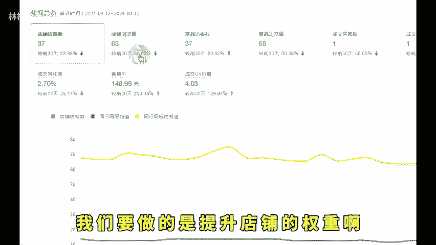

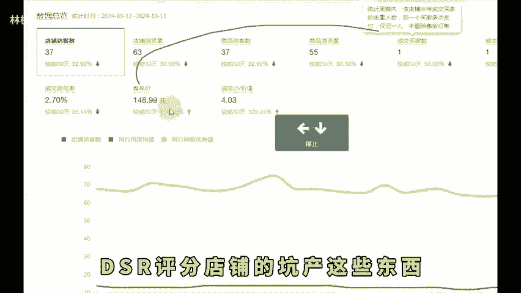

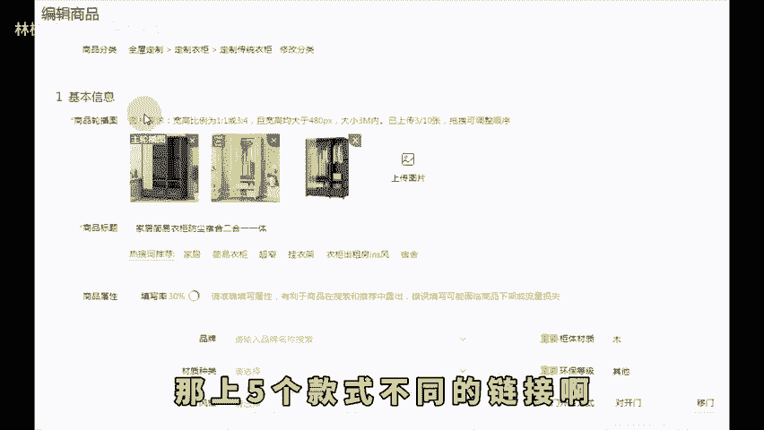

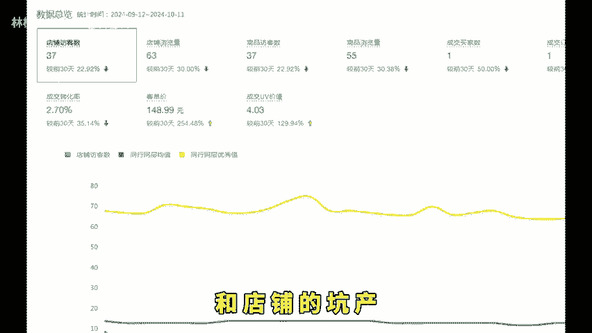

店铺的坑产，以便于在第二阶段啊，直通车能够轻松的跑动。另外呢在这一周，你需要通过进宝做100单的DSR为什么做100个。因为DSR需要50个有效好评，但我们做评价不能保证每个都触屏不是。

所以才需要100个。第二阶段就是把5个链接同时开车啊，然后呢都是利润出价，因为我们打造的这个评啊，利润50%嘛，我们一般都出的2。5这样的投产比。

然后呢提报活动21365同时打开评价有礼金和评价有礼金的短信通知啊，到第三步就是数据判断数据判断这个最简单就是你看哪一个链接它花钱花得快，说明它权重高，同时呢投产比如果你还满意的话。

那么这个链接你可以做主推，那其实你会发现有的链接根本跑不动啊，一天消耗很少。有的链接就跑得快。如果这个跑的快的链接在第二阶段没断流，那么很好，你就需要把它做一个类似于这样的拉升，这拉升怎么拉呢？

就是很简单，就是你提高日限额需要的是今天比昨天的销售额多，明天比今天的销售额多，至少要拉升一周，在第二周你可以做稳定。那拉升。😊。

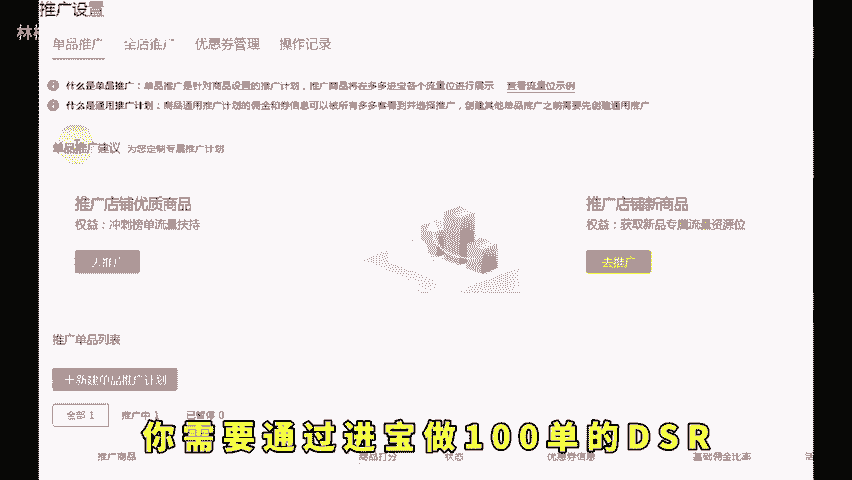

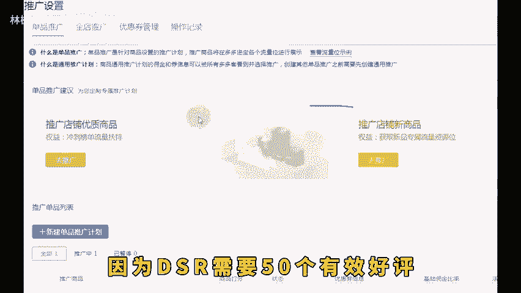

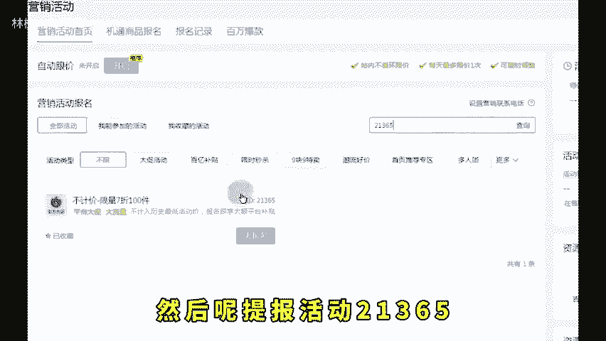

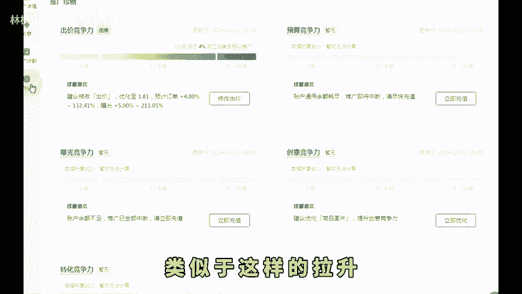

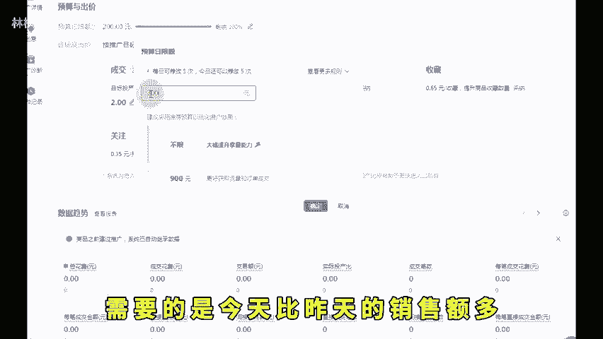

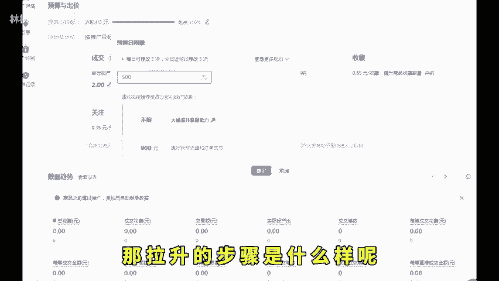

步骤是什么样呢？就是今天限额100，明天200，后天300，等到500以后，你说我感觉差不多了。可以，那每天可以限额到500。在第二周，然后呢不再递增限额，让系统自动烧。你会发现越烧越快。

在这时候再考虑托价啊。其中的注意事项就是现在打造一个链接啊，一定要做一周的坑产。第二个务必要测试链接，你不要随意找一个链接就主推，主推款是系统给你找出来的，不是自己制定，听懂的，抓紧时间去落地实操。

如果说你不懂的，这边也整理了综合运营包，留言拿去。😊。

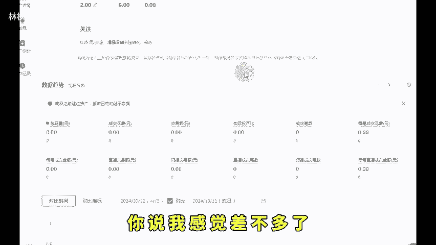

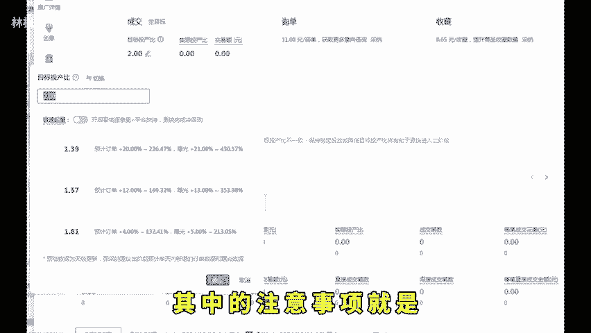

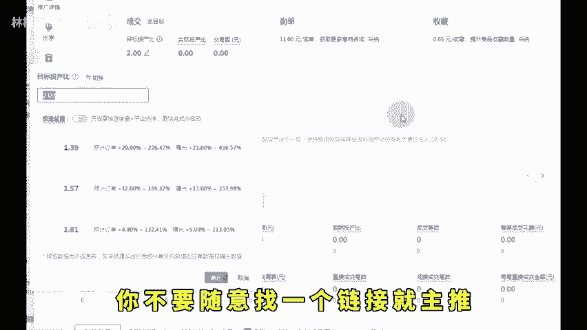

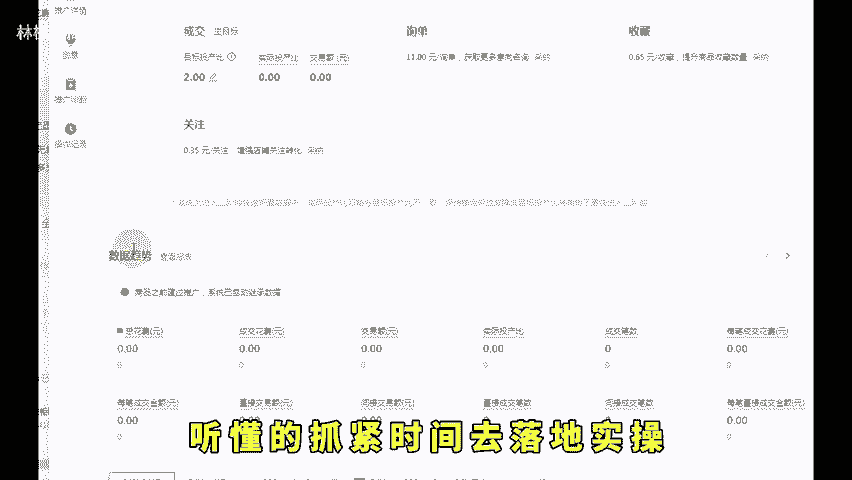