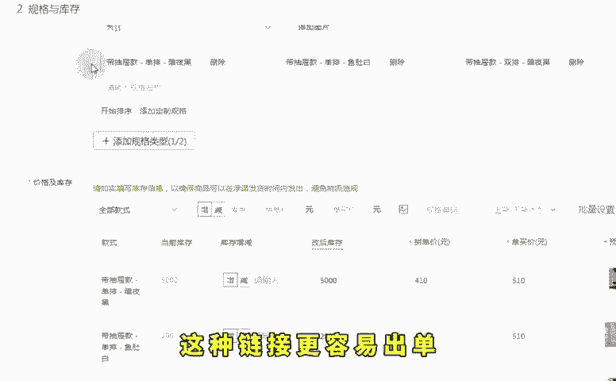
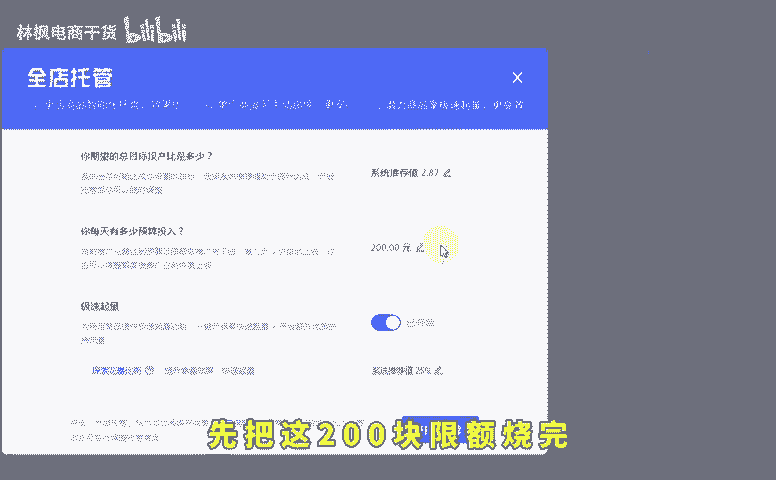
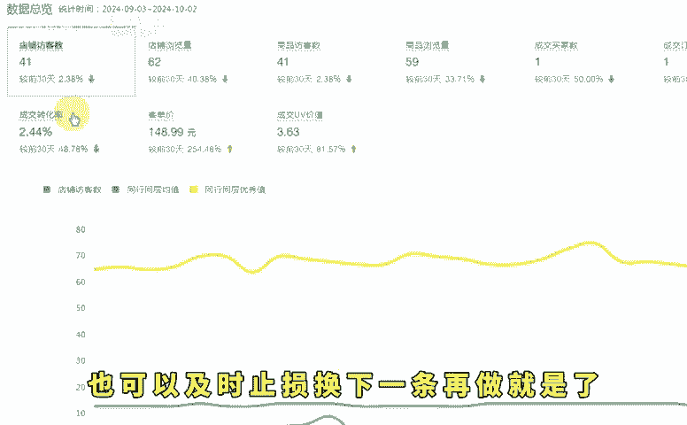

# 拼多多新品运营低成本不低价盈利起量7天访客破千！ - P1 - 林枫电商干货 - BV1ijxXeAEuR

🎼现在新手做拼多多店铺，只需掌握这一个直通车技巧，便能在前期实现盈利。如今真没必要亏钱去开拼多多店铺，你低价同行也会低价，低价没门槛，低价只会让你亏得更多。前期就低价亏去跑，后期越难回本。

基本上没见过前期亏很多钱，后续还能大赚的店铺，所以大家一定要学会前期盈利起垫的方法。今天我就把这个方法分享给大家，可以点个关注，点个赞，不懂得多看几遍。首先很多新手在上架链接的时候，链接布局不当。

这样的链接很难做起来，怎么推都没有用。这个时候就要学会找同行的对标链接，直接搜索并逐个查看，找到一个拼单数显示一天100单以上的链接，抄下它的链接，这种链接更容易出单，比自己瞎搞的链接起来的更快。

且简单粗暴。接着第二步开直通车，先开全店托管，设置限额200块，目标投产比刚开始设低一点。比如保本投产比为2，那目标投产就设成1。5或1。4低投产比更容易跑得动，先把这200块限额烧完。

然后打开商品推广，将商品推广的目标投产比直接翻一倍。

🎼如果全店托管投产比设成1。5，商品推广就设成3，烧完这200块转成商品推广就能直接跑动。这个时候三的投产比就能实现直接盈利。因为保本是2，所以商品推广可以直接盈利。但是要注意的是，第二天。

如果商品推广能跑动，就不用管持续盈利即可。如果跑不动就暂停商品推广，再烧200的全店托管烧完后再转回去就又能跑动了。直到第二天，全店托管能稳定跑，且单量稳定就不用管了。持续盈利就可以了。

这套企链接的流程可以重复去操作，非常简单，就算开始的链接推完数据不理想，也可以及时止损，换下一条再做就是了，低成本不用担心投入太多打水漂，希望可以帮助到你。

