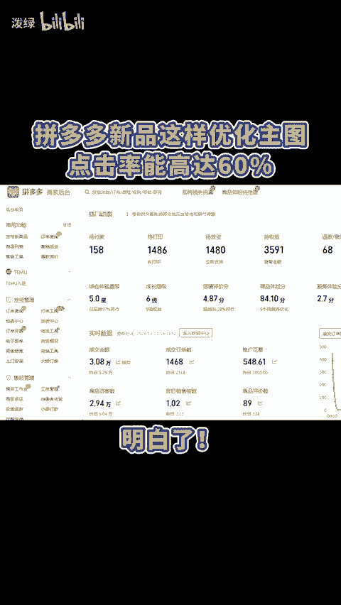
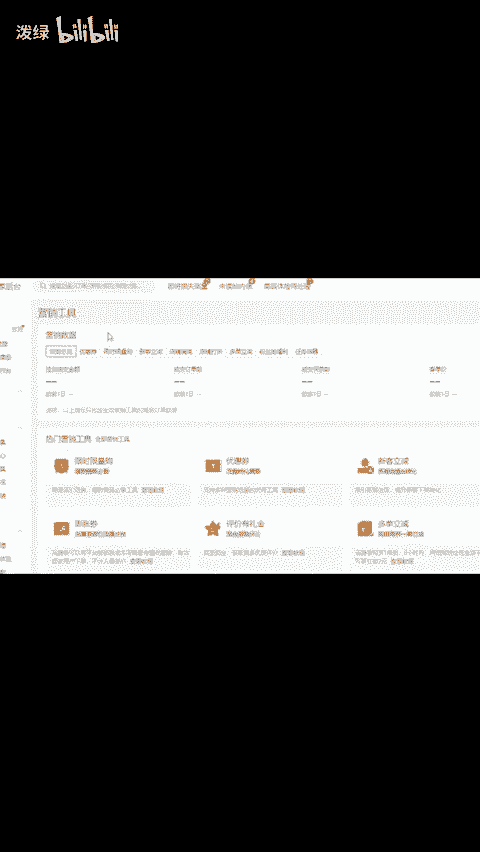
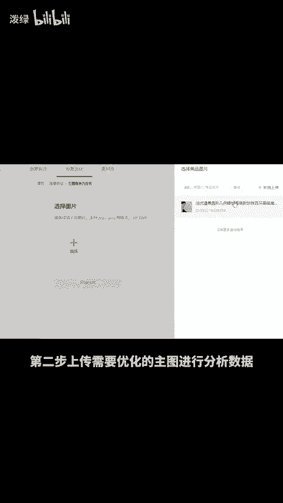
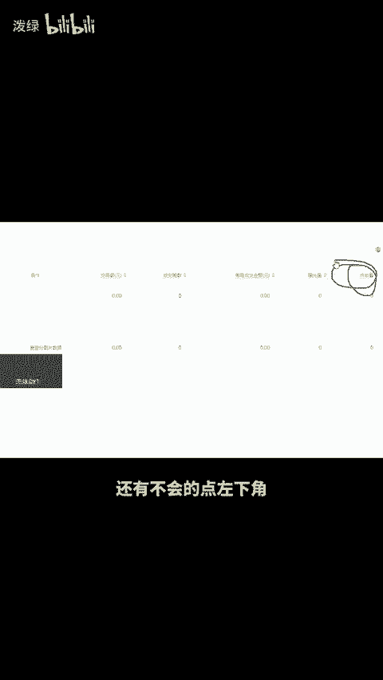

# 拼多多新品这样优化主图，点击率能高达60% - P1 - 泼绿 - BV16JbFewEha

拼多多新品这样优化主图，点击率能高达60%。明白，首先进入商家后台，在首页上方的搜索栏里搜索神笔马良，点击进入，再选择常用功能里的主图竞争力分析。第二步，上传需要优化的主图进行分析数据。

以此查看当前主图是否具有竞争力。第三步，图片优化，系统会为你生成一批适合推广的图片，点击下一步保存并完成。第四步，通过直通车测图，测出点击率最高的图，直接拿来作为主图即可。还有不会的点左下角。😊。

