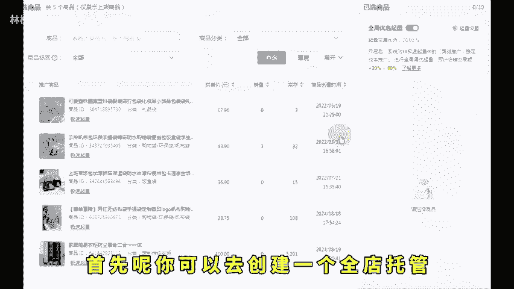
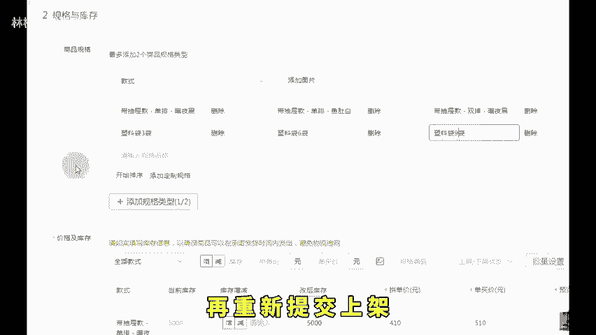
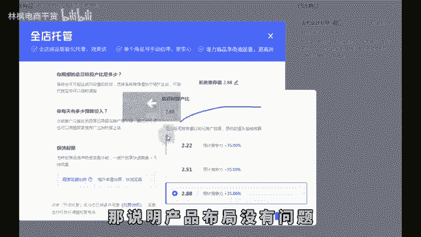
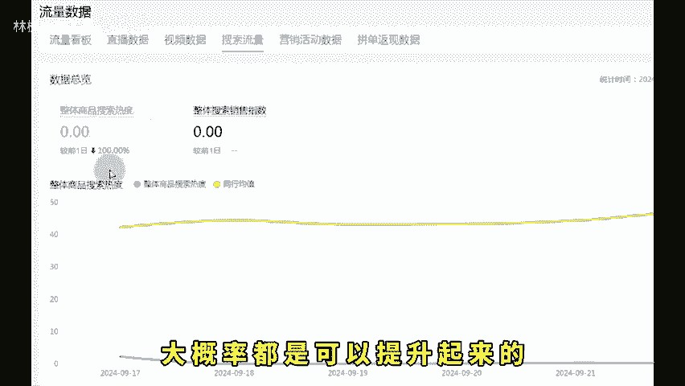

# 拼多多新店刚开没流量2分钟实操教你解决！ - P1 - 林枫电商干货 - BV1jrsBedE4J

🎼为什么你的拼多多新店啊没有流量也没访客，想必这也是很多新手，拼多多商家遇到的现状，店铺都开好了，产品也上架了，但是没有流量没有访客。甚至啊我开车都花不出去钱。

想买流量都买不到这个问题呢今天我来教各位解决，你只要学会这两个点你的店铺啊绝对可以做出来流量，并且它还是免费的自然流量。那么首第一个一定要学会去判断你的链接，你的商品有没有得到拼多多平台的认可。

首先如果拼多多都不认可你发布了这个产品，那么对应的它肯定不会给你免费流量的，就算你开车你花钱它也不会给你付费流量，对应着如何去检查这个问题呢？首先你可以去创建一个全店托管把这个商品添加到全店托管里面去。

按照系统给你的建议去出价。然观察这个计划能不能跑出来报关。如果说一个小时连100个曝光都跑不到的话，这肯定是拼多多都不认可你这个链接认可在哪个地方主要是我们的产品定价布局上面，在拼多多系统啊。

定价不合理的链接，它是不会给你流量的。所以呢我们要降价我们整体一个单价。那么怎么。

🎼比如说我是卖塑料袋的，你的定价跟市场定价是一样的，同行卖四代八袋1二袋装，你也卖个四袋8袋1二袋。那么对应着的话，如果说你价格比人家高一点，那可能他觉得你定价不合理，不给你推流了。

所以啊我们要降低单价，可以卖个三代、六代、九代或者两代、四代、六代，这样就可以把你所有规格的单价给它打下来。然后呢规格文字属性重新变动一下，调整一下，再重新提交上架。这样的话，你再去开一个托管计划。

你去试一下，只要整体的价格下去了。那对应的它都会给你推曝光的。只要一个小时就能跑出100个曝光以上的那说明产品布局没有问题，能够得到平台的推流了。然后第二个要点就是我们要去检查店铺评分。

打开后台找到数据中心，点击流量数据，上方的搜索流量下方的话，会有一个指数。我们看右边有一个整体搜索销售指数，只要我们整体的销售指数越高啊，那对应的平台给你的搜索流量，也就是免费流量，它是越多的。

如果说你整体销售指数很低的话呢，说明你对于搜索渠道根本就卖不动，搜索渠道流量用户不给你买单。

🎼你创造不了成交额，那么就是创造不了价值了。那么平台的话呢就是不会给你流量的。我们就要做这个东西。把这个指标给它做上去之后啊，你的流量才能够起得来。那对应着的话。

我们可以通过比如说找人搜索我产品的标题关键词，找到我产品进行成交，或者呢打开我们的商品推广，连续给他开个7天以上的时间，每天的话呢都从搜索获取一些订单，获取一些成交额获取的越多的话。

我们搜索指数提升的越快，这样做搜索指数连续拉高一个星期左右。那你后面的搜索流量就全是自然流量了，新店没流量，按照这两个核心去操作的话，大概率都是可以提升起来的。还有不懂的左下角。😊。

