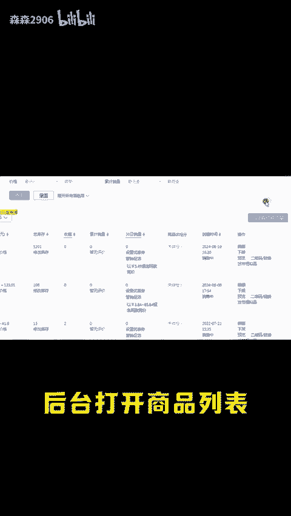
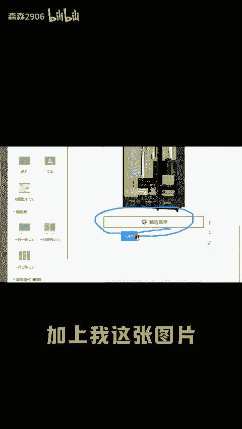
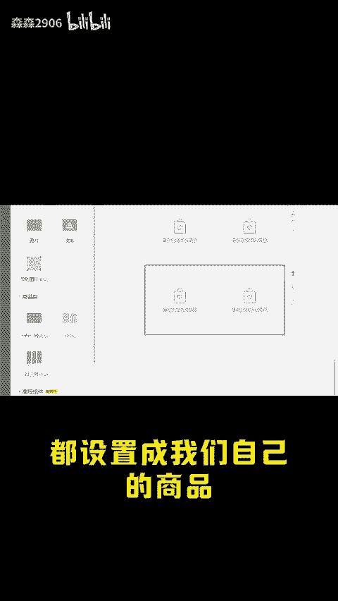
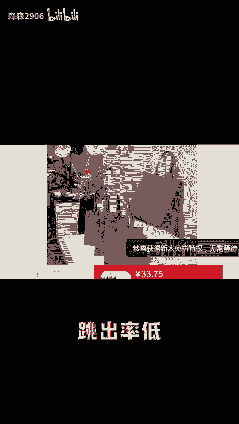
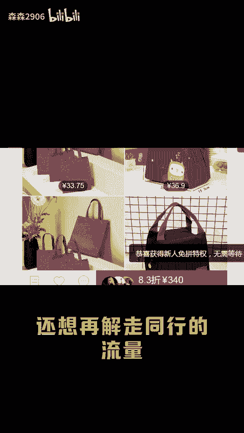
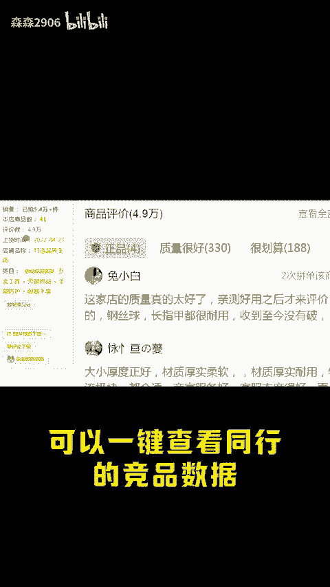
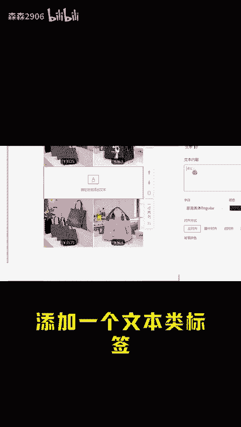
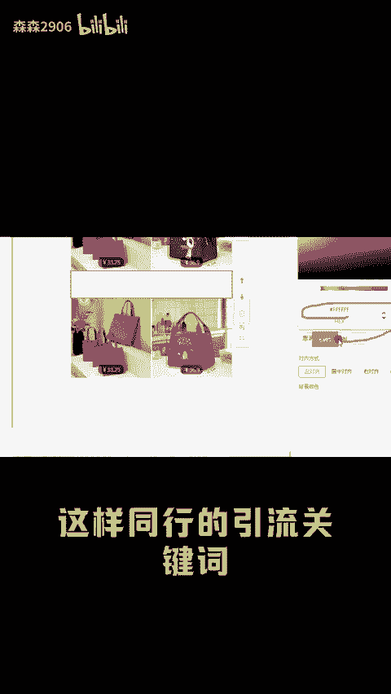
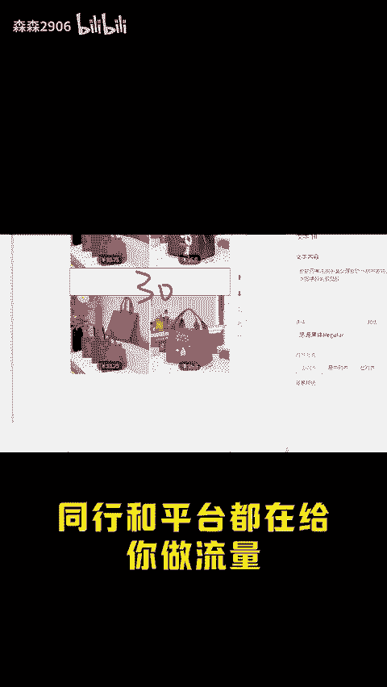

# 拼多多新店怎么快速做到访客破万？ - P1 - 森森2906 - BV1FGxne2EHW

🎼每天一个运营就想拼多多新店能不能做到新店访客破万呢？当然做不到了，访客破百，我倒是可以教教你这还用你教你来说教你一找我的店铺访客，从这样变成这样，就是用了这个操作。

把详情页底部的精选推荐全部换成自己店铺的商品，避免访客跳出，有效提高转化率，拉开店铺权重，访客破万不是问题，怎么操作呢？看这边后台打开商品列表点编辑下滑，找到装修商详，在详情页的最下面呢。

加上我这张图片，再添加5个一行两列的商品类组件都设置成我们自己的商品设置完成之后呢，我们用买家版打开看看。不管买家点哪里跳转的都是你店铺的商品，非常有效的降低跳出率，跳出率低，UV价值就高了。

店铺权重也就到了。如果你在防止截流的同时，还想再截走同行的流量。那么用这个工具可以一键查看同行的竞品数据，把同行相关性高的热搜词啊都给复制下来。不知道怎么找的。😊。

🎼直接复制竞品标题，还是打开装修商详，添加一个文本类标签，把复制的标题啊添加进去，颜色改成井号6个F。这样同行的引流关键词只有标题的30个字符，但你可以有几百个同行和平台都在给你做流量。

这样一套组合选下来，自然流量挡都挡不住，访客不万不是问题。今天的分享就到这里了。还有不懂的点赞关注，拿一份运营文档。

